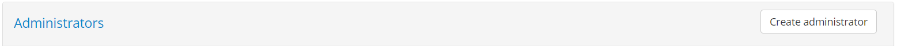
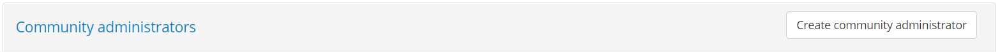

.. _community:

Manage test bed users
=====================

The **User Management** screen is the place where you can manage your test bed's communities, organisations and users. To access it click 
the **ADMIN** link from the screen's header.

.. figure:: ../screenshots/header_admin.PNG
  :align: center

Doing so presents you with a left side menu containing links to administrative functions, of which you need to click 
the **User Management** link.

.. figure:: ../screenshots/admin_community_ta.PNG
  :align: center

The screen is split in two sections:

* The **Administrators** section listing the currently defined test bed administrators, including yourself (see :ref:`community_testbed_administrators`).
* The **Communities** section listing the test bed's communities (see :ref:`community_testbed_communities`).

.. _community_testbed_administrators:

Manage test bed administrators
------------------------------

The **Administrators** section lists the test bed administrators in a table, with one row per administrator.

.. figure:: ../screenshots/admin_community_test_bed_administrators.PNG
  :align: center

For each administrator the table displays his/her **name** and **email** address. From this section you can create a new administrator
(see :ref:`community_testbed_administrators__create`) or edit an existing one (see :ref:`community_testbed_administrators__edit`).

.. _community_testbed_administrators__create:

Create test bed administrator
~~~~~~~~~~~~~~~~~~~~~~~~~~~~~

To create a new test bed administrator click the **Create administrator** button from the **Administrators** section header.

Doing so presents you with a screen to add the new administrator.

.. figure:: ../screenshots/admin_community_test_bed_administrators_create.PNG
  :align: center

In this form you are expected to enter the following information:

* The administrator's **name** (required).
* The **email** address (require). This is used to log into the test bed and is effectively a username formatted as an email. It does not have to be an active
  address as no emails will be sent to it.
* The **password** that also has to be **confirmed** (required). This can be modified by the new administrator upon login by accessing the profile management
  screen (see :ref:`manage_your_profile__change_password`).

To complete the creation of the new administrator click on **Save**. Clicking on **Cancel** will discard pending changes and return you to the previous 
screen.

.. _community_testbed_administrators__edit:

Edit test bed administrator
~~~~~~~~~~~~~~~~~~~~~~~~~~~

To edit an existing administrator click on his/her corresponding row from the **Administrators** table.

.. figure:: ../screenshots/admin_community_test_bed_administrators.PNG
  :align: center

Doing so will present you with the administrator's information in editable form fields.

.. figure:: ../screenshots/admin_community_test_bed_administrators_edit.PNG
  :align: center

This form displays the administrator's **name**, **email** and **role**, of which only the name is editable. To update this enter the new value and
click **Update**. You can also remove the administrator, upon confirmation, by clicking **Delete**, although this option will be disabled if this is 
the only test bed administrator. Finally, clicking **Back** will discard any pending changes and return to the previous screen.

.. _community_testbed_communities:

Manage communities
------------------

The **Communities** section allows you to manage the test bed's communities. Existing communities are presented in a table with a row per 
community.

.. figure:: ../screenshots/admin_community_communities.PNG
  :align: center

For each community the **short name** and **full name** is presented. From this section you can add a new community (see :ref:`community_testbed_communities__create`) 
or edit an existing one (see :ref:`community_testbed_communities__manage`).

.. note::
    **The default community:** The list of communities always includes the **Default community** which is a special-purpose community corresponding to
    the overall test bed itself. This community allows management of organisations without a specific community and also elements such as landing pages
    and legal notices defined at test bed level. See :ref:`community__defaults__community` for more information.

.. _community_testbed_communities__create:

Create a community
~~~~~~~~~~~~~~~~~~

Creating a new community is done by clicking the **Create community** button from the **Communities** section header.

.. figure:: ../screenshots/admin_community_communities_header.PNG
  :align: center

Doing so presents you with a screen to input the community's basic information.

.. figure:: ../screenshots/admin_community_communities_create.PNG
  :align: center

The information you are expected to provide is:

* The **short name** for the community (required), used in list displays.
* Its **full name** (required), used in detail screens and reports.
* A **support email** address (optional), used to deliver feedback provided by the community's users (see :ref:`community_testbed_communities__manage` for
  more information on this).

Once the information is entered you complete the community creation by clicking **Save**. Clicking **Cancel** discards pending changes and returns you to 
the previous screen.

.. note::
    **Setting a domain for the community:** Setting the community's domain is important as this provides full access to the domain's management (including
    its test cases) to the community's administrator(s). This can be done in the community details screen (see :ref:`community_testbed_communities__manage`).

.. _community_testbed_communities__manage:

Manage a community's details
----------------------------

To manage a community's details click its corresponding row from the **Communities** section.

.. figure:: ../screenshots/admin_community_communities.PNG
  :align: center

Doing so takes you to the community's detail screen that is split in five sections:

* The **Community detail** section presenting to you the information for the community.
* The **Community administrators** section allowing you to view and manage the community's administrators.
* The **Organisations** section in which you can view and manage the community's organisations.
* The **Landing pages** section listing the community-specific landing pages that can be used for the community's organisations.
* The **Legal notices** section listing the community-specific legal notices that can be displayed for the community's organisations.

The **Community detail** section allows you to view and edit the community's basic information.

.. figure:: ../screenshots/admin_community_details_ta.PNG
  :align: center

The information you can edit in this form is:

* The community's **short** and **full name** (required). These are visible to test bed administrators and in certain user reports.
* The community's linked **domain** (optional), granting full access to it to community administrators.
* The community's **support email** address (optional) to receive contact form submissions.

Regarding the **domain**, it is typically the case that you would want to specify one for the community. Doing so delegates
full management of the domain's specifications and test suites to the community's administrator(s) and is critical if they are responsible
for their configuration and test suite development. In addition, linking the community to a specific domain hides other domains from the 
community administrators and also the community's users when defining conformance statements (see :ref:`manage_your_conformance_statements__create`). 
It effectively presents to the community a view over the test bed that is dedicated to their own testing needs. If no domain is linked to the community,
its administrators and users are presented with all available domains and specifications.

Regarding the **support email**, this is the address, typically a functional mailbox, where community users' feedback is sent via 
the test bed's contact form (see :ref:`contact_support`). If this email address is configured, it will be used as the recipient of 
submissions from the community's users, with the test bed team's functional mailbox (DIGIT-ITB@ec.europa.eu) added in CC. If not 
configured, submissions will only be delivered to the test bed team's functional mailbox.

.. note::
    **When to configure a support email:** If this is a large user community expected to have frequent user interactions it is highly
    advised that it has its own support email. This is important since most questions would typically relate to the community's
    test cases and specifications rather than the test bed software itself. The test bed team will most likely not be able to answer 
    domain-specific questions and community users would experience unnecessary delays. On the other hand this could be unconfigured if
    testing activities for the community are limited, to benefit from the test bed's helpdesk without setting up one by the community.

Assuming a support email is defined, the contact form submission messages are formatted in HTML such as the following sample.

.. figure:: ../screenshots/contact_form_sample.PNG
  :align: center
  :scale: 50%

Received messages include the following information: 

* The user's **name**, **identifier** and **preferred contact address**.
* The related organisation's **identifier** and **name**, as well as your community's **identifier** and **name**.
* The **type** of the message and the **message** itself.

To persist any changes you have made in the community detail form click the **Save changes** button. Clicking the **Back** button will discard any pending changes and
return to the previous screen. Finally, the **Delete** button will, following confirmation, delete the complete community and all its dependent information.

.. note::
    **Default community:** The **Delete** button is hidden for the test bed's **Default community** as it cannot be deleted. 
    See :ref:`community__defaults__community` for more information.

.. _community__administrators:

Manage community administrators
~~~~~~~~~~~~~~~~~~~~~~~~~~~~~~~

The **Community administrators** section displays the users that are capable of managing the community. 

.. figure:: ../screenshots/admin_community_administrators.PNG
  :align: center

Community administrators are listed in a table with one row per user displaying the user's **name** and **email** address. Clicking on a row allows you to edit
the user's information in a separate screen.

.. figure:: ../screenshots/admin_community_administrators_edit.PNG
  :align: center

The information presented here is the user's **name**, **email** and **role**, all required properties, of which only the name is editable. To change the name 
edit the existing value and click on **Update**, whereas to delete the user click on **Delete**. Note that if this user is the only administrator configured
for the community the **Delete** button is disabled. Finally, clicking **Back** will discard any pending changes and return you to the previous screen.

To create a new community administrator click on the **Create community administrator** button from the section's header.

Doing so will present you with a form to enter the user's information.

.. figure:: ../screenshots/admin_community_administrators_create.PNG
  :align: center

In this form you are expected to provide the following information:

* The administrator's **name** (required), used in feedback submissions to the test bed.
* The **email** address (required), used to login. This is essentially a username formatted as an email address, and does not have to be a real functioning
  address as no emails are ever sent to it.
* The user's **password** that needs also to be **confirmed**. The entered password can be changed by the user upon login through the profile
  management screen (see :ref:`manage_your_profile__change_password`).

To complete the creation of the new administrator click on **Save**. Clicking **Cancel** discards changes and returns you to the previous screen.

.. note::
    **Default community:** This section is not displayed in case you are viewing the details of the test bed's **Default community**.
    See :ref:`community__defaults__community` for more information.

.. _community__organisations:

Manage organisations
~~~~~~~~~~~~~~~~~~~~

The **Organisations** section presents to you the organisations that are defined as members of the community. These are displayed in a table with one
row per organisation, displaying for each organisation its **short** and **full name**.

.. figure:: ../screenshots/admin_community_organisations.PNG
  :align: center

Clicking on **Create organisation** allows you to add a new organisation (see :ref:`community__create_organisation`), whereas clicking on the row of an
existing organisation allows you to edit its details (see :ref:`community__manage_organisation`).

.. _community__create_organisation:

Create an organisation
++++++++++++++++++++++

To create a new organisation click on the **Create organization** button from the section's header.

.. figure:: ../screenshots/admin_community_organisations_header.PNG
  :align: center

Doing so presents you with the screen to enter the new organisation's details.

.. figure:: ../screenshots/admin_community_organisations_create.PNG
  :align: center

In this screen you are expected to enter the following information for the organisation:

* Its **short name** (required), used in list displays.
* Its **full name** (required), used in detail screens and reports.
* Its **landing page** (optional), presented to its users upon login.
* Its **legal notice** (optional), presented to its users when they click the **Legal notice** link from the screen footer.

Regarding the landing page and legal notice, these are presented as a choice of the ones defined for the community 
(see :ref:`community__manage_landing_pages` and :ref:`community__manage_legal_notices` respectively). If no selection
is made then the default landing page for the community is used, falling back to the test bed's overall default if none
is defined (see :ref:`community__defaults__landing_page`). Defining the landing page and legal notice at the level of the organisation makes it possible to present a
customised message and notice per organisation.

To complete the creation of the new organisation click **Save**. Clicking on **Cancel** discards pending changes and returns you to the previous screen.

.. _community__manage_organisation:

Manage an organisation's details
++++++++++++++++++++++++++++++++

To manage an organisation's details click its corresponding row from the **Organisations** table displayed in the community details screen.

.. figure:: ../screenshots/admin_community_organisations.PNG
  :align: center

Doing so presents you with the organisation details page that is split in two sections:

* The **Organization detail** section, displaying the organisation's information and allowing it to be edited.
* The **Users** section, displaying the list of users for the organisation (see :ref:`community__manage_organisation__users`).

The **Organization detail** section displays the organisation's information in an editable form in which you can modify its **short name**, **full name**,
**landing page** and **legal notice**. 

.. figure:: ../screenshots/admin_community_organisations_organisation_detail.PNG
  :align: center

To change the organisation's information edit the displayed values and click the **Update** button. The organisation can also
be deleted from here by clicking the **Delete** button. Doing so will, following confirmation, delete the organisation and its dependent information (e.g. users). The 
**Back** button will discard any pending changes and return you back to the previous screen. Finally, the **Manage Tests** button allows you to manage the 
organisation's test configuration (see :ref:`community__manage_organisation__tests`).

.. _community__manage_organisation__tests:

Manage the organisation's tests
...............................

An interesting option available from the organisation's detail screen is the **Manage Tests** button. This allows you to configure the organisation's test setup, 
including its systems (see :ref:`manage_your_systems`) and conformance statements (see :ref:`manage_your_conformance_statements`). You can even proceed to 
complete a system's endpoint configuration used in test cases (see :ref:`execute_tests__provide_your_systems_configuration`) and also execute tests on behalf of 
the organisation (see :ref:`execute_tests`). When you click the **Manage Tests** button you will be directly taken to the organisation's system management screen.

.. figure:: ../screenshots/admin_community_organisations_organisation_manage.PNG
  :align: center

When on this screen you are effectively taking on the role of an administrator for the organisation, with the screen being displayed matching exactly what 
such a user would see if he/she clicked the **TESTS** button from the screen header. To avoid confusion between this screen and the one you can access for
your own special-purpose test organisation (see :ref:`validate_test_setup`), the banner displays the name of the selected organisation.

.. figure:: ../screenshots/admin_community_organisations_organisation_manage_banner.PNG
  :align: center

In addition, the system management screen now also presents a **Back** button that will bring you back to the organisation's detail screen. If you proceed to manage
the organisation's setup in further screens you can always return where you were through this **Back** button.

.. note::
    **Managing your organisations' test setup on their behalf** 

    Using the **Manage Tests** button allows you to fully complete an organisation's test setup on their behalf. This is an alternative to the organisations' 
    administrators doing this themselves (see :ref:`manage_your_conformance_statements`). The selected approach depends on the needs of the organisations' community. 
    
    If the community defines multiple specifications and its organisations are to fully take charge over what they want to conform to then the best approach would be 
    to avoid using the **Manage Tests** feature and let organisation administrators manage their own setup. On the other hand if the community has more simple 
    needs, it could be beneficial to define only non-administrator users for its organisations and configure on their behalf their system(s) and conformance 
    statement(s). Simple cases with only a single system and conformance statement per organisation would allow users to login, click on **TESTS** from the 
    screen header and immediately start testing.

.. _community__manage_organisation__users:

Manage the organisation's users
...............................

Management of the organisation's users is done through the **Users** section of the organisation's detail screen.

.. figure:: ../screenshots/admin_community_organisations_organisation_users.PNG
  :align: center

This section lists the currently defined users in a table, with one row per user, displaying for each one his/her **name**, **email** and **role**. To 
create a new user click the **Create user** button.

.. figure:: ../screenshots/admin_community_organisations_organisation_users_create.PNG
  :align: center

The resulting screen provides you with a form to enter the following information for the new user:

* The user's **name** (required), used when contacting the support team.
* The **email** address (required), used by the user to login. Note that this should be considered as a username formatted as an email, and does not
  need to be a functioning address as no messages will be sent to it.
* The user's **role** (required), either "Administrator" or "User". Recall that the "User" role can execute and follow up on tests, whereas the "Administrator"
  role can additionally manage the organisation's test configuration (e.g. systems and conformance statements) and add other users.
* The user's **password** and the password **confirmation**. The entered password can be changed by the user upon login through the profile management
  screen (see :ref:`manage_your_profile__change_password`).

To complete the creation of the user click the **Save** button. Clicking on **Cancel** will discard pending changes and return to the previous screen.

To edit an existing user click his/her corresponding row from the **Users** section.

.. figure:: ../screenshots/admin_community_organisations_organisation_users.PNG
  :align: center

Doing so presents you with a screen displaying the user's information in editable form fields.

.. figure:: ../screenshots/admin_community_organisations_organisation_users_edit.PNG
  :align: center

The information displayed is the user's **name**, **email**, **role** and **organisation**, all required, of which only the **name** and **role** can 
be edited. Clicking on **Update** saves your changes whereas clicking on **Back** discards them and returns you to the previous screen. The **Delete** 
button will, following confirmation, delete the current user.

.. _community__manage_landing_pages:

Manage community-specific landing pages
~~~~~~~~~~~~~~~~~~~~~~~~~~~~~~~~~~~~~~~

A **landing page** is the home page displayed to the community's users when they log into the test bed. Its purpose is to welcome users providing them context
on the use of the test bed and potentially including a customised message. Moreover, this customised message can even be set at the level of specific organisations
if you choose to do so (see :ref:`community__organisations`).

The landing pages available for the community are listed in the **Landing pages** section. These are presented in a table with one row per landing page,
displaying for each its **name**, **description** and indication on whether it is considered as the **default**.

.. figure:: ../screenshots/admin_community_landing_pages.PNG
  :align: center

The landing page marked as default is the one that applies to all organisations in the community that don't have another, more specific one configured. If no
landing page is defined then the one that applies to the test bed as a whole is automatically used (see :ref:`community__defaults__landing_page`). Note the 
community's default landing page is what the community's administrator(s) also view upon login.

Adding a new landing page can be done in one of the following ways:

* You can create a new landing page from scratch by clicking the **Create landing page** button.
* You can copy the test bed's default landing page by clicking the **Copy Test Bed landing page** button.
* You can copy one of the community's existing landing pages while editing its details.

.. note::
    **Default community:** In case you are viewing the details of the test bed's **Default community** no **Copy Test Bed landing page** button is presented. This
    is because the default landing page defined for this is actually considered the test bed's default. See :ref:`community__defaults__landing_page` for more information.

Create landing page
+++++++++++++++++++

When creating a new landing page you are presented with a form to enter its information.

.. figure:: ../screenshots/admin_community_landing_pages_create.PNG
  :align: center

If you are creating a landing page from scratch (i.e. you have clicked the **Create landing page** button), this form will be empty. Alternatively,
if the landing page is being created as a copy of an existing one (either the test bed's default landing page or another one defined for the community), the 
form will be prefilled. The information you are expected to complete for the landing page is:

* Its **name** (required), used in the list of landing pages and when selecting one for an organisation.
* Its **description** (optional), presented to test bed and community administrators.
* Whether or not it should be the **default** landing page for the community (default is "false").
* The landing page **content**, provided through a rich text editor, allowing you to add styled text, lists, images and links.

When you have provided the required information you can complete the landing page creation by clicking **Save**. Note that if you have set this as the 
new default landing page for the community you will also be prompted for confirmation considering that this will be immediately visible to all its
users. Clicking on the **Cancel** button will discard pending changes are return to the previous screen.

Edit landing page
+++++++++++++++++

To edit an existing landing page click its corresponding row from the **Landing pages** table.

.. figure:: ../screenshots/admin_community_landing_pages.PNG
  :align: center

Doing so will take you to a screen where the landing page's information is displayed in editable form fields.

.. figure:: ../screenshots/admin_community_landing_pages_edit.PNG
  :align: center

In this screen you can change the landing page's **name**, **description**, **default** setting and **content**. Note that if the landing page is currently
the default, this can't be unset. To switch defaults you would need to edit or create another landing page and at that time set it as the new default.
This is done to avoid misconfiguration where you could end up with no default landing page for the community.

To persist any changes click on the **Update** button or discard them clicking on the **Back** button. The **Delete** button will, following confirmation,
remove the landing page. Finally, the **Copy** button allows you to make a copy of this landing page, by taking you to the landing page creation screen prefilled
with the current landing page's information. This can be useful if you want to create minor variations of a default landing page for certain organisations.

.. _community__manage_legal_notices:

Manage community-specific legal notices
~~~~~~~~~~~~~~~~~~~~~~~~~~~~~~~~~~~~~~~

A **legal notice** is an arbitrary text that can be presented to the community's users when they click on the **Legal notice** link from the screen footer.
The purpose of this is to define terms and conditions, notices and disclaimers that you want to make known to the community.

.. figure:: ../screenshots/footer.PNG
  :align: center

You may define a default legal notice that applies to the entire community or even specific legal notices for one or more organisations.
The legal notices available for the community are listed in the **Legal notices** section. These are presented in a table with one row per notice,
displaying for each its **name**, **description** and indication on whether it is considered as the **default**.

.. figure:: ../screenshots/admin_community_legal_notices.PNG
  :align: center

The legal notice marked as default is the one that applies to all organisations in the community that don't have another, more specific one configured. If no
legal notice is defined then the one that applies to the test bed as a whole is automatically used (see :ref:`community__defaults__landing_page`). Note that 
the community's administrator(s) can also view the community's default legal notice when they click the relevant link from the screen footer.

Adding a new legal notice can be done in one of the following ways:

* You can create a new legal notice from scratch by clicking the **Create legal notice** button.
* You can copy the test bed's default legal notice by clicking the **Copy Test Bed legal notice** button.
* You can copy one of the community's existing legal notices while editing its details.

.. note::
    **Default community:** In case you are viewing the details of the test bed's **Default community** no **Copy Test Bed legal notice** button is presented. This
    is because the default legal notice defined for this is actually considered the test bed's default. See :ref:`community__defaults__landing_page` for more information.

Create legal notice
+++++++++++++++++++

When creating a new legal notice you are presented with a form to enter its information.

.. figure:: ../screenshots/admin_community_legal_notices_create.PNG
  :align: center

If you are creating a legal notice from scratch (i.e. you have clicked the **Create legal notice** button), this form will be empty. Alternatively,
if the legal notice is being created as a copy of an existing one (either the test bed's default legal notice or another one defined for the community), the 
form will be prefilled. The information you are expected to complete for the legal notice is:

* Its **name** (required), used in the list of legal notices and when selecting one for an organisation.
* Its **description** (optional), presented to test bed and community administrators.
* Whether or not it should be the **default** legal notice for the community (default is "false").
* The legal notice **content**, provided through a rich text editor, allowing you to add styled text, lists, images and links.

When you have provided the required information you can complete the legal notice creation by clicking **Save**. Note that if you have set this as the 
new default legal notice for the community you will also be prompted for confirmation considering that this will be available to all its
users. Clicking on the **Cancel** button will discard pending changes are return to the previous screen.

Edit legal notice
+++++++++++++++++

To edit an existing legal notice click its corresponding row from the **Legal notices** table.

.. figure:: ../screenshots/admin_community_legal_notices.PNG
  :align: center

Doing so will take you to a screen where the legal notice's information is displayed in editable form fields.

.. figure:: ../screenshots/admin_community_legal_notices_edit.PNG
  :align: center

In this screen you can change the legal notice's **name**, **description**, **default** setting and **content**. Note that if the legal notice is currently
the default, this can't be unset. To switch defaults you would need to edit or create another legal notice and at that time set it as the new default.
This is done to avoid misconfiguration where you could end up with no default legal notice for the community.

To persist any changes click on the **Update** button or discard them clicking on the **Back** button. The **Delete** button will, following confirmation,
remove the legal notice. Finally, the **Copy** button allows you to make a copy of this legal notice, by taking you to the legal notice creation screen prefilled
with the current legal notice's information. This can be useful if you want to create minor variations of a default legal notice for certain organisations.

.. _community__defaults:

Manage test bed defaults
------------------------

As test bed administrator you can define information as being default at test bed level, allowing your communities to fall back to them if no 
community-specific replacement is defined. The test-bed default elements that can be configured are:

* A default landing page.
* A default legal notice.

In addition, the test bed foresees a **Default community** to facilitate with the management of default elements as well as to support organisations
that don't belong to a specific community.

.. _community__defaults__community:

The Default community
~~~~~~~~~~~~~~~~~~~~~

The **Default community** is a special purpose community that is always present in the test bed and cannot be removed. It allows use of the test bed
without needing to define specific user communities for organisations with limited testing activities. Your special purpose **Admin organisation** is 
also defined as part of this community and allows you to verify any defined test cases before your users execute them.

In terms of management the **Default community** is exactly like a regular community with the following differences:

* It cannot be deleted.
* It cannot have community administrators defined for it (its administrators are the test bed administrators).
* Any organisations you add to this community will have access to all the specifications and test suites defined in the test bed.
* Elements defined as community defaults (landing page, legal notice) are considered also as the test bed defaults. 

These exceptions aside, management of the **Default community** uses the same screens as a regular community. See :ref:`community_testbed_communities__manage`
for more information.

.. note::
    **When to define organisations in the Default community:** The **Default community** can include organisations as any other community. It is advised
    however that organisations are added to this only in cases where testing activities are very limited or in case of proof-of-concepts. In most scenarios
    where a set of organisations need to execute tests that need to be followed up by administrators they would be better served by a dedicated 
    community. This allows you to delegate management, configuration and support tasks to the community's administrators and allow for easier use as
    non-relevant specifications will be hidden (both for community administrators and organisation users).

.. _community__defaults__landing_page:

Default landing page and legal notice
~~~~~~~~~~~~~~~~~~~~~~~~~~~~~~~~~~~~~

The test bed's default landing page and legal notice are those displayed to all users that don't have more specific ones configured. This could be possible
in two cases:

* For users within a specific community for which a community-level default landing page and/or legal notice is defined.
* For users of organisations that have a specific landing page and/or legal notice configured directly for their organisation.

In all other cases it is the test bed's default landing page and legal notice that will be displayed, including for test bed administrators.
Management of these defaults is achieved through the **Default community's** management screen as you would do for any community. The difference here is 
that the landing page or legal notice that is defined as default is the one considered as such not only for the **Default community's** organisations
but also for all communities.

To manage the default landing page or legal notice:

1. Select to manage the **Default community's** details (see :ref:`community_testbed_communities__manage`).
2. Manage the landing pages or legal notices through the same screens used for the community-specific ones 
   (see :ref:`community__manage_landing_pages` and :ref:`community__manage_legal_notices` respectively).