.. _community:

Manage communities
==================

The **Community management** screen is the place where you can manage the Test Bed's communities, organisations and users. It can be accessed
by clicking the relevant link from the menu, which presents you the screen :ref:`listing the defined communities<community_testbed_communities>`.

.. _community_testbed_communities:

Communities
-----------

The Test Bed's existing communities are presented in a table with a row per community.

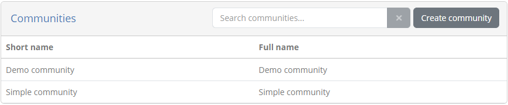

For each community the **short name** and **full name** is presented, and you can use the **search box** in the table's header to filter
the ones displayed based on their name. To view a :ref:`community's details <community_testbed_communities__manage>` click its
relevant row from the table, whereas to :ref:`create a new community<community_testbed_communities__create>` click the **Create community** button.

.. _community_testbed_communities__create:

Create a community
~~~~~~~~~~~~~~~~~~

Creating a new community is done by clicking the **Create community** button from the **Communities** panel.

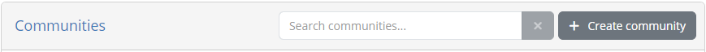

Doing so presents you with a screen to input the community's basic information.

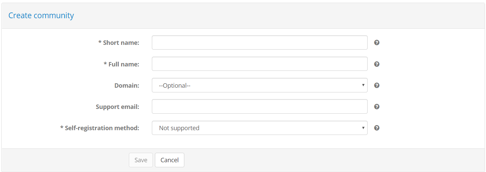

The information you are expected to provide is:

* The **short name** for the community (required), used in list displays.
* Its **full name** (required), used in detail screens and reports.
* The **domain** it will be linked with (optional) defining the conformance statements its members can create. Having selected a domains
  you may also click on the **View** button to see its details.
* A **support email** address (optional), used to deliver feedback provided by the community's users.
* A custom **tag** (optional) to visually distinguish the community.
* The preference on allowing **self-registration** for the community.
* The **user permissions** to apply for the community's organisation users.
* The **default user preferences** to apply for the community's organisation users.

More information on these settings is provided in the :ref:`community details section<community_testbed_communities__manage>`.
Once the information is entered you complete the community creation by clicking **Save**. Clicking **Cancel** discards pending changes and returns you to
the previous screen.

.. _community_testbed_communities__manage:

Manage community details
------------------------

To manage a community's details click its corresponding row from the **Communities** panel.

Doing so takes you to the community's detail screen that is split in two sections:

* The **Community details** section presenting to you the information for the community.
* Tabs listing additional data linked to the community.

The information grouped in the provided tabs include:

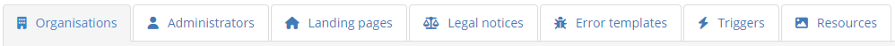

* The **Organisations** section in which you can view and manage the :ref:`organisations<community__organisations>`.
* The **Administrators** section allowing you to view and manage the :ref:`community administrators<community__administrators>`.
* The **Landing pages** section listing the :ref:`landing pages<community__manage_landing_pages>` that can be can used for the community's organisations.
* The **Legal notices** section listing the :ref:`legal notices<community__manage_legal_notices>` that can be can used for the community's organisations.
* The **Error templates** section listing the :ref:`error message templates<community__manage_error_templates>` used to display unexpected errors to the community's organisations.
* The **Webhooks** section listing the :ref:`webhooks<community__manage_triggers>` used to automate processes upon specific events.
* The **Resources** section listing the :ref:`resources<community__manage_resources>` referenced in documentation and other rich content.

The **Community details** section allows you to view and edit the community's basic information.

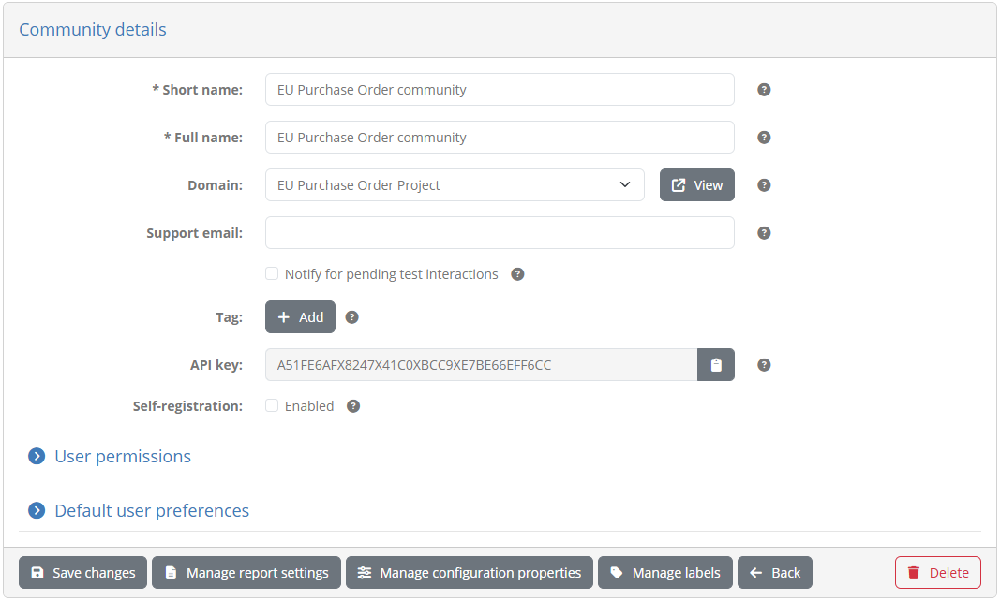

The information you can edit in this form is:

* The community's **short** and **full name** (required). These are visible to the Test Bed administrator and in certain user reports.
* The community's linked **domain** (optional), granting full access to it to community administrators. With a domain selected you
  may also click the **View** button to view its details.
* The community's **support email** address (optional) to receive contact form submissions.
* A custom **tag** (optional) to visually distinguish the community.
* The preference on allowing **self-registration** for the community.
* The **user permissions** you foresee for the community's members (initially collapsed).
* The **default user preferences** for the community's members (initially collapsed).

Regarding the **domain**, it is typically the case that you would want to specify one for the community. Doing so delegates
full management of the domain's specifications and test suites to the community's administrator(s) and is critical if they are responsible
for their configuration and test suite development. In addition, linking the community to a specific domain hides other domains from the
community administrators and also the community's users when defining conformance statements (see :ref:`manage_your_conformance_statements__create`).
It effectively presents to the community a view over the Test Bed that is dedicated to their own testing needs. If no domain is linked to the community,
its administrators and users are presented with all available domains and specifications.

.. note::
    **Changing a community's domain:** Once a community has been linked to a domain its members can create conformance statements and execute relevant tests.
    After this point, if you change the domain linked to the community, the conformance testing history of its members will be rendered obsolete. Note that
    changing a community's domain after creation is possible to facilitate initial setup but is almost never needed once the initial setup is compete.

In this screen you can also view the community's **REST API key** that is used to identify the community when managing test suites via
the :ref:`Test Bed's REST API<domains__specification__test_suite_rest>` (if enabled). This is an
automatically generated key that can be copied to your clipboard using the provided **copy** control.

Regarding the **support email**, this is the address, typically a functional mailbox, where community users' feedback is sent via
the Test Bed's contact form (see :ref:`contact_support`). If you configure this email address, it will be used as the recipient of
submissions, with the Test Bed default functional mailbox added in CC. If not configured, submissions will only
be delivered to the Test Bed default functional mailbox. You can also check here the **Notify for pending interactions** option so
that alerts are sent to the mailbox if test sessions are pending for administrator verification.

.. note::
    **When to configure a support email:** If this is a large user community expected to have frequent user interactions it is highly
    advised that it has its own support email. This is important since most questions would typically relate to the community's
    test cases and specifications rather than the Test Bed software itself. The Test Bed team will most likely not be able to answer
    domain-specific questions and community users would experience unnecessary delays. On the other hand this could be unconfigured if
    testing activities for the community are limited, to benefit from the Test Bed's helpdesk without setting up one by the community.

Assuming a support email is defined, the contact form submission messages are formatted in HTML such as the following sample.

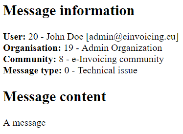

Received messages include the following information: 

* The user's **name**, **identifier** and **preferred contact address**.
* The related organisation's **identifier** and **name**, as well as its community's **identifier** and **name**.
* The **type** of the message and the **message** itself.
* Any **attachments** that the user has included.

The community's **tag** is an optional feature used to distinguish the community from others. Tags are displayed only to
administrators, and are used to convey some additional information regarding the community. Typical use cases would be
to provide a visual cue on the **setup's version** or to highlight that a specific setup is the **production configuration**
that organisation users can access.

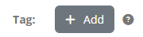

If you select to add a tag you will be presented with a popup to provide its information. This includes the tag's **name**,
a **description** presented as a tooltip, as well as **background** and **text** colours used to style it when displayed.
Clicking on **Save** will record the tag, whereas **Cancel** will close the popup without making changes.

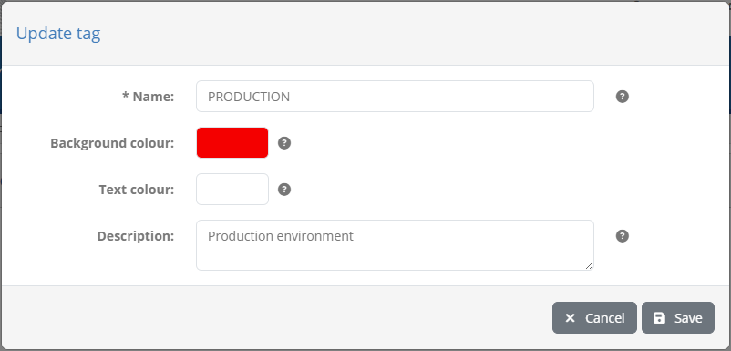

When a tag has been added to the community, you will see it presented in the form, with controls to **remove** or **edit** it.
You also have choices here on whether this tag will be presented to community and/or Test Bed administrators.

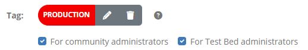

When a tag is present for a community, it will figure prominently in the **header** of all screens' panels that relate to the community's
configuration, as well as in lists that include the community.

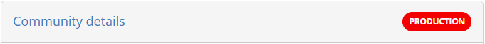

For community administrators, the tag display is even more prominent as it is shown persistently on all screens in the interface's banner.

**Self-registration method** is another point that merits further details, determining whether and how users can themselves
:ref:`register new organisations<login__create_account>` in the community through the Test Bed's :ref:`welcome page<login__welcome>`.
When enabled, you are presented with an additional section of settings specific to self-registration.

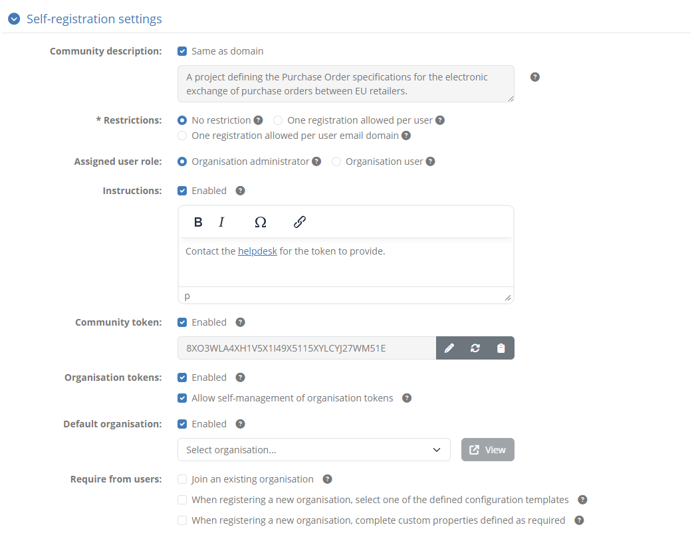

The settings available to you to tune the self-registration process are as follows:

* **Description:** This is a descriptive text for the community that will accompany its display in the self-registration form as one of the available
  communities. The purpose of this is to provide a short summary of what this community offers to potential users. If the community is linked to a **domain**
  you have the option of replicating the description from the domain by checking the **Same as domain** checkbox. You may alternatively provide a different
  description if this is more suitable.
* **Restrictions:** This allows you to select a means of restricting self-registration to ensure people and/or organisations enroll only once.
  The restrictions you can set are to not allow multiple registrations from the same user (based on her email address) or from the same email domain. Note
  that such restrictions are only supported if the Test Bed is integrated with EU Login that allows the Test Bed to be aware of users' actual email addresses.
* **Assigned user role:** Whether registering users will be created as organisation administrators or basic users.
* **Instructions:** A optional short help text that will be displayed to users to provide assistance. This can include simple formatting and hyperlinks
  to reference a support mailbox or link to online resources.
* **Community token:** An optional token that will need to be provided to register to the community. This can be generated automatically
  or set to a specific value. If missing, this means that the community in question can be registered to by anyone.
* **Organisation tokens:** These are settings that define whether you allow self-registering users to join existing organisations
  after providing an organisation-specific token. You may also allow or not organisation administrators to manage such tokens.
* **Default organisation:** You can select one of the community's organisations as the organisation in which new registrants will
  be added. This is a variant of providing an organisation token, whereby you allow users to join a specific organisation defined
  by you without providing further information.
* **Require from users:** These are requirements that you want to enforce to users completing the self-registration process. The options available here,
  are to join an existing organisation (by token or the default), or otherwise when creating a new organisation, to force the selection of a :ref:`configuration template<community__create_organisation>`,
  and to require the completion of :ref:`custom properties<community__properties>` marked as required (otherwise displayed as required but not blocking).
* **Self-registration notifications:** This option is available if the Test Bed supports email notifications and if the community defines a **support email**.
  Checking this will send a notification email to the configured support mailbox whenever there is a new registration.

.. note::
  **Organisation templates:** If you choose to enable self-registration for the community you may also find interesting the
  possibility to :ref:`define preconfigured templates for organisations<community__create_organisation>`.

The **user permissions** section allows you to customise the permissions available to the community's members. To display (or collapse) this section click
on the section's header. Doing so will present the available permission options

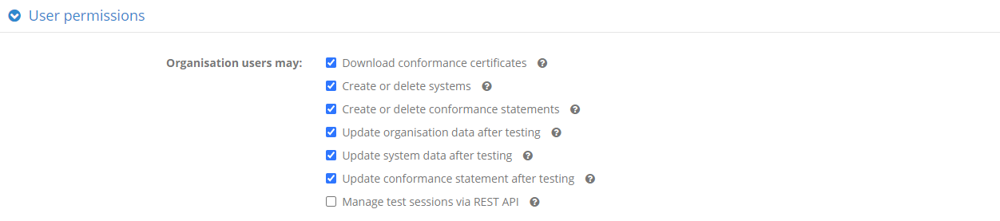

The available permission options are as follows:

* **Download conformance certificates**. If not allowed, only community administrators may create such certificates from the :ref:`conformance dashboard<monitor_conformance_status__statements__export_statement>` or a :ref:`conformance statement detail page<manage_your_conformance_statements__view_a_conformance_statements_details__export_certificate>`.
* **Download reports in XML format**. If not allowed, organisation users will see only download options for PDF reports.
* **Manage organisation users**. If not allowed, only community administrators will be able to manage users.
* **Create or delete systems**. Note that if this is not allowed, editing a system and its custom properties (if defined) will remain possible for organisation administrators.
* **Create or delete conformance statements**. If not allowed, users will only be able to test for what you preconfigure for them, or what they select
  during the self-registration process.
* **Update organisation data after testing**. If not allowed, an organisation that has performed at least one test session will not be allowed to edit its organisation information or its custom properties (if defined).
* **Update system data after testing**. If not allowed, a system for which a test has been performed will not be allowed to have its information or custom properties (if defined).
* **Update conformance statement after testing**. If not allowed, it will not be possible to delete or change the parameters of a conformance statement for which tests have been made.
* **View community test history**. If allowed, organisation users will be able to have a readonly view of all other community members' completed test sessions and reports.
* **Manage test sessions via REST API**. If allowed, the community's organisations will be able to launch, stop and query the status of tests :ref:`via the Test Bed's REST API<api>`.
  This is option will be listed only if the Test Bed's REST API is enabled.

In case you choose to set permissions linked to tests having been executed, you may find yourself in a position needing to allow changes due to misconfigurations. Instead of changing
the permissions for the entire community a better approach is to :ref:`delete the specific test sessions<session_dashboard__completed>` that should be ignored. This is possible for community
and Test Bed administrators through the :ref:`session dashboard<monitor_test_sessions>`.

.. note::
  **When to set user permissions:** You would restrict user permissions in the community if you want to make sure that only you and community administrators can manage systems and conformance statements
  or if you want to ensure that once testing starts no data is changed. This also works well when self-registration is enabled and requires the selection of a :ref:`configuration template<community__create_organisation>`.
  This way you ensure only predefined and non-editable conformance testing setups for your users.

Finally, the **default user preferences** section, allows you to set meaningful defaults for display settings applied to the community's users.

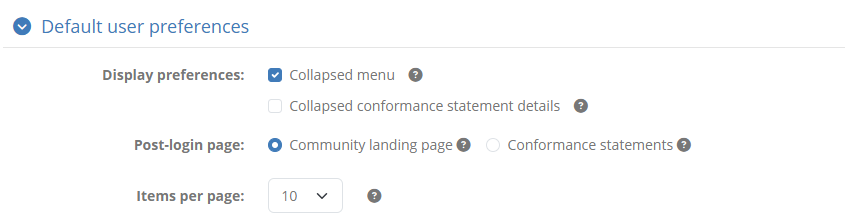

The preferences you can set include the following:

* Whether the :ref:`left-side menu <navigate__menu>` will display as collapsed.
* Whether :ref:`conformance statement details <manage_your_conformance_statements__view_a_conformance_statements_details>` will display by default as collapsed.
* The **initial page** to view once users log in, selecting between the :ref:`community landing page <navigate__landing_page>` or the :ref:`list of conformance statements <manage_your_conformance_statements>`.
* The **number of items** to display per page in paged displays.

New users in the community will have their preferences initialised to match these defaults. They will nonetheless always
be able to change them based on their actions and via their :ref:`profile page <manage_your_profile>`. Adapting the
default preferences may be meaningful if doing so is expected to result in an improved experience for the community's users. For example, if
there will be no community landing page you can have it bypassed rather than display an empty page upon login.
Similarly, if the community has limited testing options, you may prefer to force a simplified presentation for conformance statements.

If you modify the community's default user preferences, you will be presented with a choice on how to apply the change.
The new preferences could apply only for new users, or also be forced for existing ones.

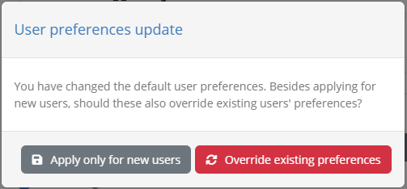

To persist any changes you have made in the community detail form click the **Save changes** button, whereas navigating away from this page will discard any pending changes.
The additional controls presented here, allow you to manage the community's :ref:`report settings <community__report_settings>`,
:ref:`custom configuration properties <community__properties>`, and :ref:`labels <community__labels>`. Finally,
the **Delete** button will, following confirmation, delete the complete community and all its dependent information.

.. _community__recipes:

Recipes for user management
~~~~~~~~~~~~~~~~~~~~~~~~~~~

The combination of **self-registration options** and **user permissions** afford you great flexibility in defining how users
would join the community and engage in testing. These approaches typically balance the effort and control administrators
put into the testing process, versus the steps needed by - but also the flexibility afforded to - organisation users.

.. _community__recipes__1:

Approach 1: Full preconfiguration
+++++++++++++++++++++++++++++++++

The community administrator preconfigures everything for the community, including the organisations
that will be testing, their users, and their conformance statements. This requires more effort on the side of the administrator
but this can be largely streamlined by copying configurations across organisations. With this approach you allow your
end users to simply connect, find everything already prepared for them, and start testing. Given that users likely never
need to administer their own organisation you could also create all users as basic, non-administrator users.

**When to use?**

When you have a limited amount of organisations that will be testing and want to make it as simple as possible for them
to connect and test. Good examples are projects led by the European Commission where organisations are limited to EU
Member States that will be testing against a predetermined set of specifications.

**How to configure?**

1. Disable self-registration.
2. Create all organisations beforehand.
3. Create conformance statements on behalf of each organisation before their initial connection.
4. Create all users as simple (non-administrator) users, or fine tune their permissions so that they cannot update their
   configuration or do their own user management.

.. _community__recipes__2:

Approach 2: Preconfigured users with test flexibility
+++++++++++++++++++++++++++++++++++++++++++++++++++++

The community administrator manually creates organisations without enabling self-registration. As part of creating a new
organisation, an organisation administrator is also created so that organisations can manage their own selection
of target specifications.

**When to use?**

When you don't expect a large number of organisations testing, or want to be explicitly involved in their onboarding.
This can also be useful if, even though you have a limited number of organisations, they can test against a multitude
of different specifications. While the onboarding is managed, you still delegate to them their own management of users
and conformance statements.

**How to configure?**

1. Disable self-registration.
2. Create each organisation per case.
3. Create the initial user for each organisation as an organisation administrator to allow them to manage their own users
   and conformance statements.

.. _community__recipes__3:

Approach 3: Self-service testing with limited flexibility
+++++++++++++++++++++++++++++++++++++++++++++++++++++++++

The community administrator enables self-registration for the community but controls what can be tested by defining
configuration templates. Moreover selection of a template, and optionally the input of configuration properties, during self-registration
can be set as mandatory. In case you know beforehand the organisations that will be testing you can also preconfigure these
and require that users register only for existing organisations.

**When to use?**

You want to control the organisations that are testing and curate what they will be testing against, but allow them to
make their own choices.

**How to configure?**

1. Enable self-registration.
2. Predefine all organisations and enable organisation self-registration tokens.
3. Allow organisation administrators to manage their own self-registration tokens.
4. Define configuration templates and require that one is selected during self-registration.
5. Disable the direct management of conformance statements.

.. _community__recipes__4:

Approach 4: Full self-service testing
+++++++++++++++++++++++++++++++++++++

The community administrator enables self-registration and delegates all user management and conformance statement creation
to organisation users. Configuration templates could also optionally be used, but they need not be set as mandatory
during the self-registration process.

**When to use?**

You don't know beforehand which organisations will be connecting to test, or there are multiple possible specifications to test against.
This approach can be suitable if you are creating an open experimentation environment, or if you are not aware beforehand
of the organisations that will be testing (e.g. software vendors).

**How to configure?**

1. Enable self-registration.
2. Optionally create configuration templates.
3. Ensure all permissions are in place to allow users to manage their own configuration (systems, users, and conformance statements).

.. _community__recipes__5:

Approach 5: Controlled demo environment
+++++++++++++++++++++++++++++++++++++++

The community administrator defines a specific default organisation with test cases used for experimentation and demonstration
purposes. Users joining this organisation can execute tests and view the testing history, but cannot make changes or see other
users.

**When to use?**

You are using the Test Bed as a demonstration and experimentation environment, rather than for conformance testing and certification.
In doing so you want to make it as simple as possible for users to join, but at the same time ensure that their permissions
and access remain limited.

**How to configure?**

1. Enable self-registration.
2. Define a default organisation for the community and force new users to join it.
3. Do not require community or organisation tokens to register.
4. Specify that self-registering users should be added with simple (non-administrator) accounts.

.. _community__organisations:

Manage organisations
~~~~~~~~~~~~~~~~~~~~

The **Organisations** tab presents to you the organisations that are defined as members of the community. These are displayed in a table with one
row per organisation, displaying for each organisation its **short** and **full name**. The table is paged and sorted by default based on the organisation's
short name, however the sorting can be adapted by clicking on the desired column's header for an ascending or descending sort. For each organisation you also
see whether or not this is defined as **configuration template** for self-registration in which case the name of the template is presented.

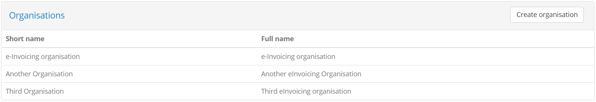

The displayed organisations can be filtered using the **search control** provided above the table. To apply filtering click the control, enter a text and then click
on the search icon. This filtering will be applied in a case-insensitive manner on the organisation's details. To the right of this you have a dropdown list that 
allows you to **sort based on creation order**. Such sorting is by default not applied, but you can choose to sort the organisations in an **earliest created first** 
or **latest created first** manner to refresh the display. Note that while sorting by creation order, you will not be able to sort by clicking on the table's
headers. To enable this again you will need to first disable creation order sorting.

On the right end of the controls you are provided with the **Create organisation** button, allowing you to :ref:`add a new organisation<community__create_organisation>` to the community.
Finally, each organisation's row can be clicked to proceed to :ref:`view and edit its details<community__manage_organisation>`.

.. _community__create_organisation:

Create an organisation
++++++++++++++++++++++

To create a new organisation click on the **Create organisation** button from the section's header.

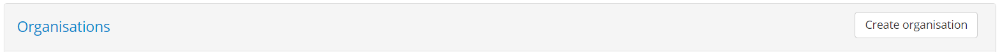

Doing so presents you with the screen to enter the new organisation's details.

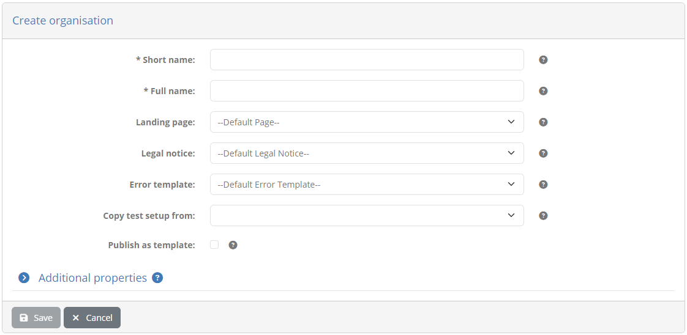

In this screen you are expected to enter the following information for the organisation:

* Its **short name** (required), used in list displays.
* Its **full name** (required), used in detail screens and reports.
* Its **landing page** (optional), presented to its users upon login.
* Its **legal notice** (optional), presented to its users when they click the **Legal notice** link from the screen footer.
* Its **error template** (optional), used to format unexpected errors presented to its users.
* Whether it should be **published as a template** (optional), as an option during self-registration if enabled for the community.
  Checking this will also prompt you for a **template name** to display to users.

Regarding the landing page, legal notice and error template, these are presented as a choice of the ones defined for the community
(see :ref:`community__manage_landing_pages`, :ref:`community__manage_legal_notices` and :ref:`community__manage_error_templates` respectively). If no selection
is made then the default settings for the community are used, falling back to the Test Bed's overall defaults if none
are defined for the community. Defining these at the level of the organisation allows you to present
customised messages and content per organisation and is left fully at your discretion as administrator.

If the community includes other organisations you are also presented here with an option to **copy the test setup** from
one of them as a source. Selecting one will replicate the selected organisation's systems and conformance statements for the
new organisation.

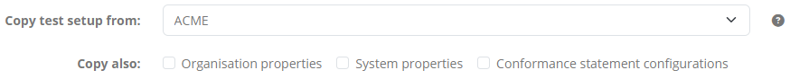

Once another organisation is selected to copy from, you are also presented with additional options to include:

* **Organisation properties:** To also copy any additional organisation-level properties that the source organisation defines.
* **System properties:** To also copy any additional system-level properties for replicated systems.
* **Conformance statement configurations:** To also copy any of the source organisation's configuration parameters set on its
  systems' conformance statements.

If additional organisation properties are foreseen, and as long as you are not copying the properties from another organisation,
you will also see an **Additional properties** section. Clicking this will expand it to allow you to manage the organisation's properties.

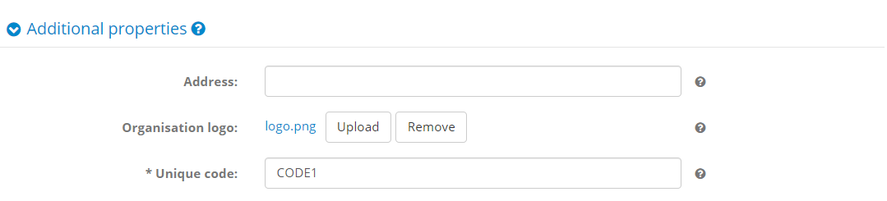

Configured properties can be simple texts, secret values (e.g. passwords) or files for which, if supplied by you, you will also
see a help tooltip to understand their meaning. Such properties can be edited as follows:

* For texts through an editable text field or dropdown select (for preset values).
* For files using the **upload** button. Once one is selected you can **download** or **delete** it.
* For secrets a read-only text field indicates whether a value is currently set. Provide a new value by checking
  **Update** which makes the text field editable. While editing you can also toggle the display of typed characters.

.. note::
  Required properties are marked with an asterisk. It is is not mandatory to fill these in when providing the organisation's
  information but as long as required properties are missing it will not be able to launch tests.

To complete the creation of the new organisation click **Save**. Clicking on **Cancel** discards pending changes and returns you to the previous screen.

.. note::
    **Defining a template organisation:** Using the **Copy test setup** option you could define a special purpose organisation that is configured in terms
    of its systems and conformance statements as you would expect all the community's organisations to be. This can be especially beneficial in cases where organisations
    will be expected to define multiple systems (e.g. "Development", "Integration", "Acceptance") or where the community's domain has numerous individual specifications. Using this
    approach enhances consistency and greatly reduces configuration effort.

    In addition, such templates can also be made publicly available to users during self-registration through the **Publish as template** option.

.. _community__manage_organisation:

Manage an organisation's details
++++++++++++++++++++++++++++++++

To manage an organisation's details click its corresponding row from the **Organisations** table displayed in the community details screen.

Doing so presents you with the organisation details page that is split in the following sections:

* The **Organisation details** section, displaying the organisation's information and allowing it to be edited.
* The **Systems** tab, displaying the list of systems registered for the organisation (see :ref:`community__manage_organisation__systems`)
* The **Users** tab, displaying the list of users for the organisation (see :ref:`community__manage_organisation__users`).
* The **REST API keys** tab, visible if :ref:`testing via REST API<api>` is enabled, allowing you to view and manage the
  organisation's API keys (see :ref:`community__manage_organisation__api_keys`).

The **Organisation details** section displays the organisation's information in an editable form in which you can modify its **short name**, **full name**,
**landing page**, **legal notice** and **error template**. You can also adapt whether or not this organisation will be listed during
self-registration as a **published template**.

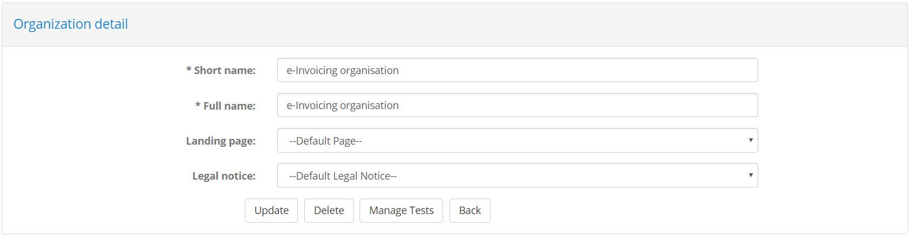

If the community includes other organisations you are also presented here with an option to **copy the test setup** from
one of them as a source. Selecting one will replicate the selected organisation's systems and conformance statements for the
new organisation. Note that in doing so the systems and conformance statements already defined will be removed.

Once another organisation is selected to copy from, you are also presented with additional options to include:

* **Organisation properties:** To also copy any additional organisation-level properties that the source organisation defines.
* **System properties:** To also copy any additional system-level properties for replicated systems.
* **Conformance statement configurations:** To also copy any of the source organisation's configuration parameters set on its
  systems' conformance statements.

In case **self-registration** is enabled for the community, as well as **organisation self-registration tokens**, you will
see in the organisation's details controls, to view and manage the self-registration token.

This token is used during the :ref:`self-registration process <login__roles__register>` to join an existing
organisation as opposed to registering a new one. It is visible to the organisation's existing users, and may also be
manageable by its administrator(s) if enabled by the community's :ref:`self-registration settings <community>`.

If the community foresees additional organisation properties, and as long as you are not copying the properties from another organisation,
you will also see an **Additional properties** section. Clicking this expands the section allowing you to manage the organisation's properties.

Configured properties can be simple texts, secret values (e.g. passwords) or files for which, if supplied by you, you will also see
a help tooltip to understand their meaning. Such properties can be managed as follows:

* For texts the current value is presented in an editable text field or dropdown select (in case of preset values).
* For files the **Upload** button is used to select a new file, whereas if one is already set you can download it
  by clicking on its link, or delete it by clicking **Remove**.
* For secrets a read-only text field indicates whether a value is currently set, whereas to provide a new value you
  check **Update**. When providing a new value you can also toggle the display of the typed characters.

.. note::
  Required properties are marked with an asterisk. It is is not mandatory to fill these in when providing the organisation's
  information but as long as required properties are missing it will not be able to launch tests.

To change the organisation's information, edit the displayed values and click the **Update** button. The organisation can also
be deleted from here by clicking the **Delete** button. Doing so will, following confirmation, delete the organisation and its dependent information (e.g. users). The 
**Back** button will discard any pending changes and return you back to the previous screen. Finally, the **Manage tests** button allows you to manage the
organisation's test configuration (see :ref:`community__manage_organisation__tests`).

.. _community__manage_organisation__tests:

Manage the organisation's tests
...............................

An interesting option available from the organisation's detail screen is the **Manage tests** button. This allows you to configure the organisation's test setup, 
including its systems (see :ref:`community__manage_organisation__systems`) and conformance statements (see :ref:`manage_your_conformance_statements`). You can even proceed to
complete a system's configuration parameters used in test cases (see :ref:`execute_tests__provide_your_systems_configuration`) and also execute tests on behalf of
the organisation (see :ref:`execute_tests`). When you click the **Manage tests** button you will be directly taken to the organisation's conformance statements.

.. figure:: ../screenshots/conformance_statements_admin.PNG
  :align: center

Through this screen you are effectively taking on the role of an administrator for the organisation. To highlight the fact that these are the statements of an
organisation in a selected community, rather than :ref:`your own admin organisation<manage_organisation>`, the
:ref:`navigation breadcrumb<navigate__breadcrumbs>` highlights the organisation you have selected from within the community. In
addition, the overall interface's banner will still display as "Community management" rather than "My conformance statements".

.. note::
    **Managing your organisations' test setup on their behalf** 

    Using the **Manage Tests** button allows you to fully complete an organisation's test setup on their behalf. This is an alternative to the organisations'
    administrators doing this themselves (see :ref:`manage_your_conformance_statements`). The selected approach depends on the needs of the organisations' community.
    
    If the community defines multiple specifications and its organisations are to fully take charge over what they want to conform to then the best approach would be
    to avoid using the **Manage tests** feature and let organisation administrators manage their own setup. On the other hand if the community has more simple
    needs, it could be beneficial to define only non-administrator users for its organisations and configure on their behalf their system(s) and conformance
    statement(s).

.. _community__manage_organisation__systems:

Manage an organisation's systems
................................

Selecting the **Systems** tab presents the :ref:`systems <introduction__glossary__system>` defined for the organisation.
Systems are an important concept in the Test Bed as they represent the software components being tested. Before
proceeding to test anything, an organisation will need to have one or more systems for which conformance statements will be defined.

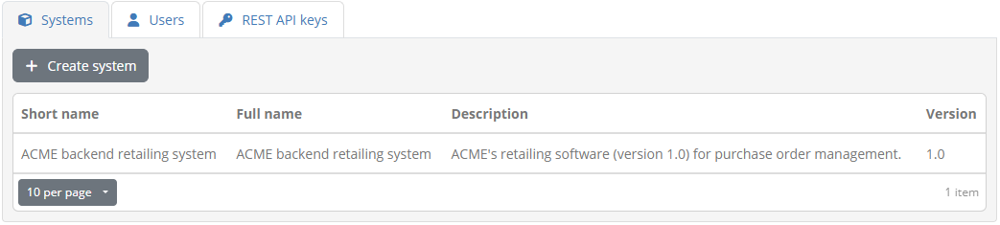

The organisation's systems are presented in a table that displays for each system:

* Its **short name**, a brief name used to display in search results.
* Its **full name**, the complete system name presented in reports and detail screens.
* A **description**, providing additional context on the specific system.
* A **version** number.

To :ref:`view the details of a specific system <community__manage_organisation__systems_edit>` you can click its row in the table. Clicking on
the **Create system** button allows you to :ref:`create a new system <community__manage_organisation__systems_create>`.

.. _community__manage_organisation__systems_create:

Create a new system
^^^^^^^^^^^^^^^^^^^

To create a new system click on the **Create system** button displayed above the listing of existing systems.

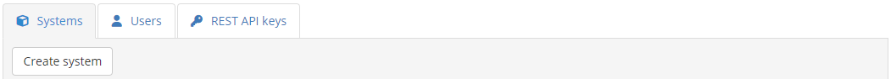

Doing so you will be presented with a screen to provide the new system's information.

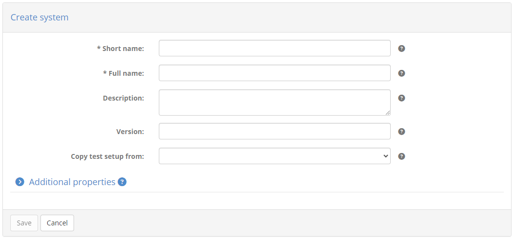

The inputs presented in the form are:

* The system's **short name** (required). This is used when the system is displayed in lists.
* The system's **full name** (required). This is included in reports that mention the system.
* An optional **description** to provide more information about the system.
* A **version** number. Although requested this is not currently used in the Test Bed apart from display purposes.

If the organisation includes other systems you are also presented here with an option to **copy the test setup** from
one of them as a source. Selecting one will replicate the selected system's conformance statements for the new system.

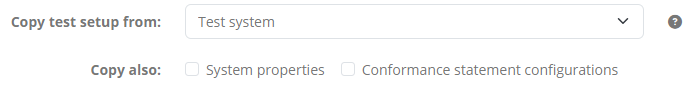

Once another system is selected to copy from, you are also presented with additional options to include:

* **System properties:** To also copy any additional system-level properties that the source system defines.
* **Conformance statement configurations:** To also copy any of the source system's configuration parameters set on its
  conformance statements.

If the community foresees additional system properties, and as long as you are not copying the properties from another system,
you will also see an **Additional properties** section. Clicking this expands the section so that you can manage the new system's properties.

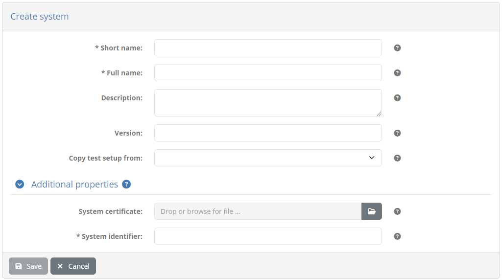

Configured properties can be simple texts, secret values (e.g. passwords) or files for which, if supplied by you or a community
administrator, you will also see a help tooltip to understand their meaning. Such properties can be edited as follows:

* For texts through an editable text field or by selecting a preset value from a dropdown list.
* For files using the **Upload** button. Once one is selected you can download it by clicking on its link, or delete it by
  clicking **Remove**.
* For secrets a read-only text field indicates whether a value is currently set. Provide a new value by checking
  **Update** which makes the text field editable. While editing you can also toggle the display of typed characters.

.. note::
  Required properties are marked with an asterisk. It is is not mandatory to fill these in when providing the system's
  information but as long as required properties are missing you will not be able to launch tests.

Once you have entered the system's information click the **Save** button to record it. You can also click the **Cancel** button
to return to the previous screen without making any changes.

.. _community__manage_organisation__systems_edit:

Edit an existing system
^^^^^^^^^^^^^^^^^^^^^^^

To edit an existing system click its row from the listing of existing systems. Doing so results in a screen
displaying the system's information, presented in editable input fields.

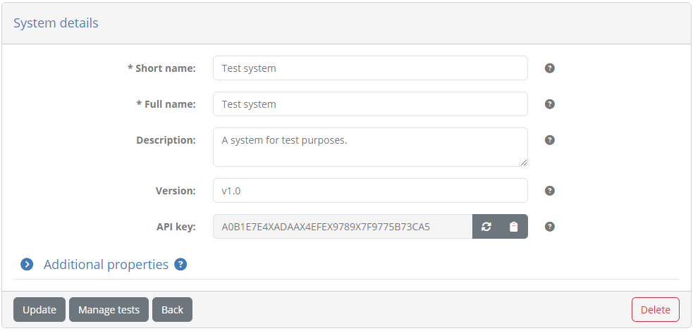

You can proceed here to modify the **short name**, **full name**, **description** and **version** of the system.  At the bottom you
also see the unique **API key** for the system that can be clicked to copy it to the clipboard or refreshed to update it.
This API key can be used in case the Test Bed's :ref:`REST API <api>` is enabled, or for
`messaging in test cases <https://www.itb.ec.europa.eu/docs/tdl/latest/handlers/index.html#built-in-messaging-handlers>`_.

If the organisation defines other systems you can also select to **copy the test setup** from another system which will reset the system's conformance statements to
match the selected one (upon confirmation).

Once another system is selected to copy from, you are also presented with additional options to include:

* **System properties:** To also copy any additional system-level properties that the source system defines.
* **Conformance statement configurations:** To also copy any of the source system's configuration parameters set on its
  conformance statements.

If the community foresees additional system properties, and as long as you are not copying the properties from another system, you
will also see an **Additional properties** section. You can click this to expand and manage the system's properties.

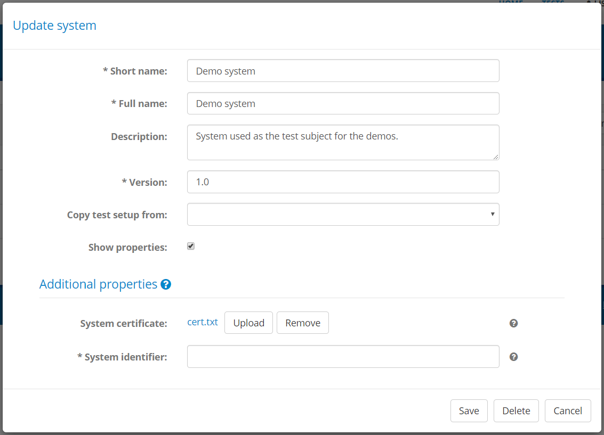

Configured properties can be simple texts, secret values (e.g. passwords) or files for which, if supplied by you or a community
administrator, you will also see a help tooltip to understand their meaning. Such properties can be managed as follows:

* For texts the current value is presented in an editable text field or dropdown menu (if the property has preset values).
* For files the **Upload** button is used to select a new file, whereas if one is already set you can download it
  by clicking on its link, or delete it by clicking **Remove**.
* For secrets a read-only text field indicates whether a value is currently set, whereas to provide a new value you
  check **Update**. When providing a new value you can also toggle the display of the typed characters.

Certain properties may actually be non-editable. Such properties can only be managed by you or a community administrator.

.. note::
  Required properties are marked with an asterisk. It is is not mandatory to fill these in when providing the system's
  information but as long as required properties are missing you will not be able to launch tests.

Once ready click the **Update** button to finish. You may also click here the **Manage tests** button to view the system's :ref:`conformance statements <manage_your_conformance_statements>`,
or the **Delete** button which, following confirmation, will proceed to
completely delete the system. In case you choose to delete the system, the tests realised for it will still be searchable but will be presented
as obsolete (see :ref:`monitor_test_sessions`). Finally, you can also click the **Back** button to return to the previous screen
without making any changes.

.. _community__manage_organisation__users:

Manage the organisation's users
...............................

Management of the organisation's users is done through the **Users** section of the organisation's detail screen.

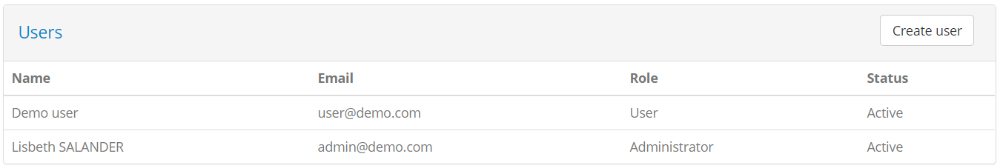

This section lists the currently defined users in a table, with one row per user, displaying for each one his/her **name**, **email** (or **username** if not integrated with EU Login), **role** and **status**.

.. note::
  **User status:** A user's status is meaningful when the Test Bed is integrated with an external identity provider such as EU Login. A value of **Inactive** indicates
  a user that has not yet :ref:`confirmed a role assignment<login__roles__confirm>` whereas a value of **Not migrated** indicates
  a legacy account that has not been :ref:`migrated <login__roles__migrate>`. In all other cases the user will be
  displayed as **Active**.

To create a new user for the organisation click on the **Create user** button from the section's header.
Clicking on an existing row from the table allows you to edit the relevant user's information.

The displayed screens and required information both when you edit or create a new user depends on whether or not the Test Bed
is integrated with an external identity provider.

Case: Using an identity provider
^^^^^^^^^^^^^^^^^^^^^^^^^^^^^^^^

When creating a user you will be presented with a form to enter her information.

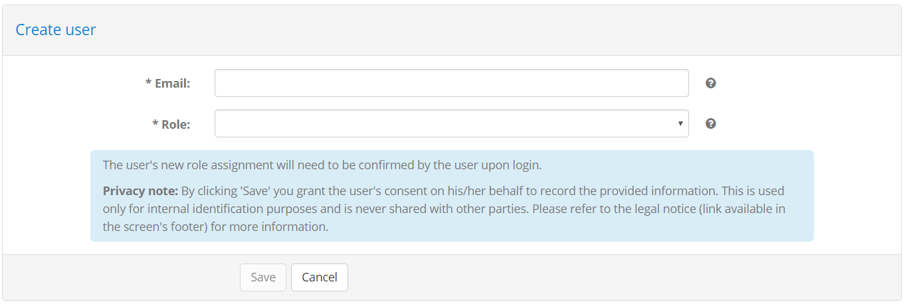

You are required to provide the **email** address and **role** of the user. The email address needs to be the one that the user has 
linked to her identity provider's account. The role can either be "Administrator" or "User". Recall that the "User" role can execute and follow
up on tests, whereas the "Administrator" role can additionally manage the organisation's configuration (e.g. properties, systems and
conformance statements) and add other users.

Once you have created the user you will see that a new entry is added to the list of users
but for which there is no displayed name and the displayed status is **Inactive**. The name and status will be
updated once this user has :ref:`confirmed this role assignment<login__roles__confirm>`. To finish creating the user click **Save**,
otherwise click **Cancel** to close the dialog.

Editing a user's details displays her information as read-only.

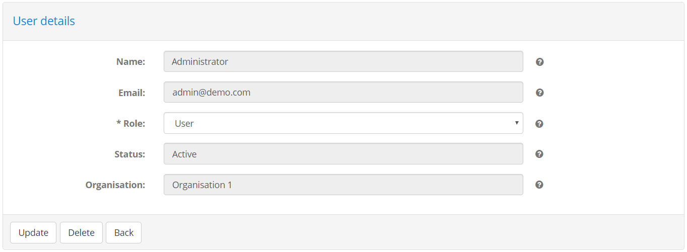

The information presented here is the user's **name**, **email**, **role**, **status** and **organisation**. From here you can change
the user's role and click on **Update** to save your change. Alternatively you can delete, upon confirmation, the user by clicking
on **Delete** or click **Back** to cancel and return to the previous screen.

Case: No identity provider
^^^^^^^^^^^^^^^^^^^^^^^^^^

When creating a user you will be presented with a form to enter the user's information.

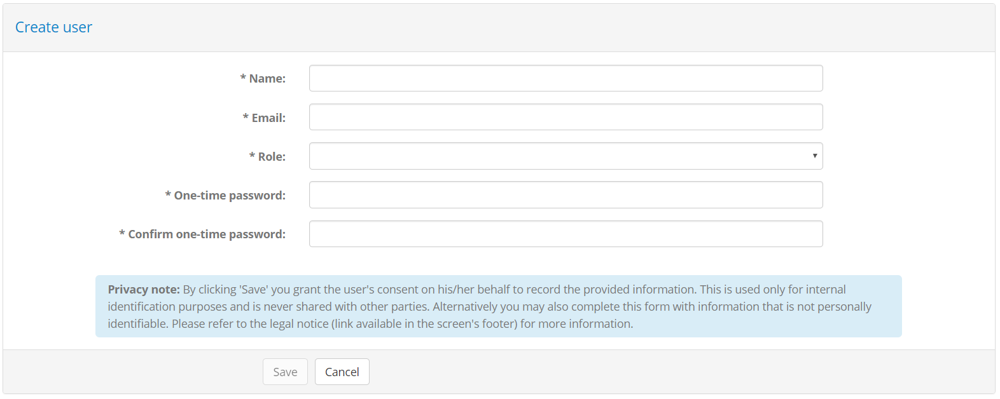

The resulting screen provides you with a form to enter the following information for the new user:

* The user's **name** (required), used when contacting the support team.
* The **username** (required), used by the user to login.
* The user's **role** (required), either "Administrator" or "User". Recall that the "User" role can execute and follow up on tests, whereas the "Administrator"
  role can additionally manage the organisation's test configuration (e.g. systems and conformance statements) and add other users.
* The user's **password**. The entered password is considered a "one-time" password that the user will need to change upon his/her next login.

To complete the creation of the user click the **Save** button. Clicking on **Cancel** will discard pending changes and return to the previous screen.

When editing a user you see a similar screen, this time prefilled with the user's information.

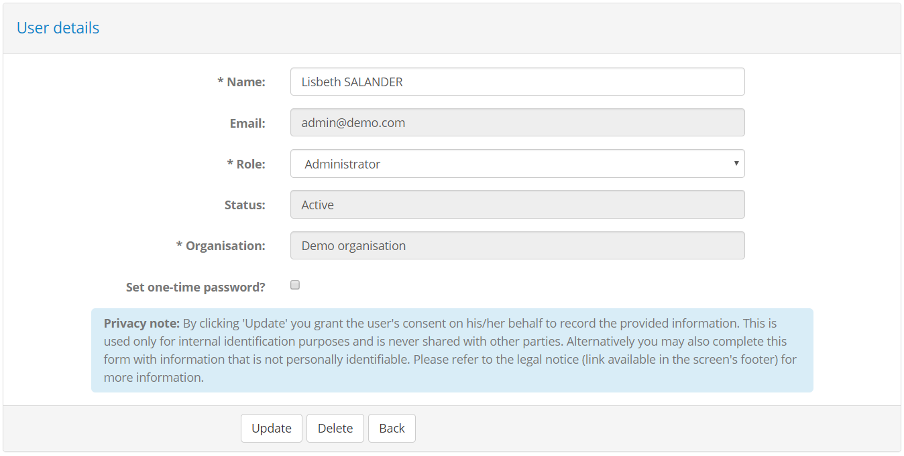

The information displayed is the user's **name**, **email**, **username**, **status** and **organisation**, of which only the **name** and **role** can
be edited. You may also check the **Set one-time password** option to provide a new password for your user (to be changed on his/her next login). Clicking 
on **Update** saves your changes whereas clicking on **Back** discards them and returns you to the previous screen. The **Delete** 
button will, following confirmation, delete the current user.

.. _community__manage_organisation__api_keys:

Manage the organisation's REST API keys
.......................................

Management of the organisation's REST API keys is done through the **REST API keys** section of the organisation's detail screen. This is visible if the
:ref:`Test Bed's REST API<api>` is enabled.

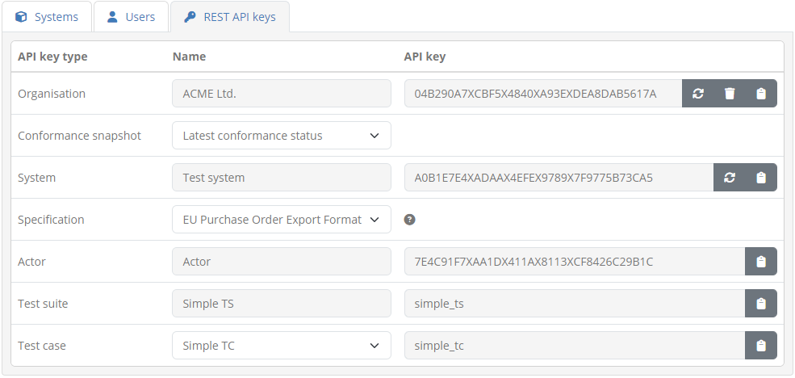

From this table you can view, manage and copy the keys needed to identify the organisation, the system to be tested and the target conformance statement and
tests. These API keys are listed in a table presenting per case the key to consider. For each key you may click the provided **copy** control to copy it to your
clipboard.

The keys listed include the following:

* **Organisation:** The key to identify the organisation. The readonly name of the organisation is displayed alongside the key. You are also presented here
  with **reset** and **delete** controls to replace or remove the key.
* **Conformance snapshot:** The conformance snapshots that include the organisation. Select one to update the other listed keys.
* **System:** The key to identify a specific system. If the organisation defines multiple systems these are presented in a dropdown list and selecting one
  will display its API key. The displayed key also provides a **reset** control to replace it.
* **Specification:** The target specification does not itself define an API key but you need to select one to view the API keys of its related information
  (actors, test suites and test cases). If the organisation has conformance statements for only a single specification this appears as preselected and readonly.
* **Actor:** The key to identify the target specification's actor. The actor, along with a given system essentially constitute a specific
  :ref:`conformance statement<manage_your_conformance_statements>`. The selected specification's actors are listed in a dropdown list unless there is a single one which would appear as a readonly preset selection.
  Selecting an actor from the list displays its related API key.
* **Test suite:** The key to identify a specific test suite. Selecting a given test suite displays its relevant API key.
* **Test case:** The key to identify a specific test case within the selected test suite. Selecting a given test case displays its relevant API key.

When removing or replacing the API key of the organisation or one of its systems, you will be prompted to confirm your action. If you
proceed to do so any existing automation setups referring to the organisation would need to be updated accordingly given that the previous
keys will no longer be valid.

Details on how these REST API keys are used to launch and manage test sessions are provided in the :ref:`REST API documentation<api>`.

.. note::

  The displayed specifications, actors, test suites and test cases are limited to those linked to the organisation's :ref:`conformance statements<manage_your_conformance_statements>`.

.. _community__administrators:

Manage administrators
~~~~~~~~~~~~~~~~~~~~~

The **Community administrators** section displays the users that are capable of managing the community.

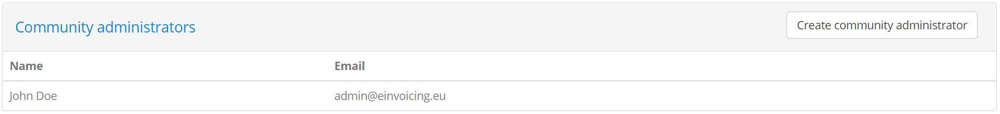

Community administrators are listed in a table with one row per user displaying the user's **name**, **email** address
(or **username** if not integrated with an external identity provider) and **status**.

.. note::
  **User status:** A user's status is meaningful when the Test Bed is integrated with an external identity provider such as EU Login. A value of **Inactive** indicates
  a user that has not yet :ref:`confirmed a role assignment<login__roles__confirm>` whereas a value of **Not migrated** indicates
  a legacy account that has not been :ref:`migrated <login__roles__migrate>`. In all other cases the user will be
  displayed as **Active**.

To create a new community administrator click on the **Create community administrator** button from the section's header.
Clicking on an existing row from the table allows you to edit the relevant user's information.

The displayed screens and required information both when you edit or create a new administrator depends on whether or not the Test Bed
is integrated with EU Login.

Case: Using an identity provider
++++++++++++++++++++++++++++++++

When creating an administrator you will be presented with a form to enter the user's information.

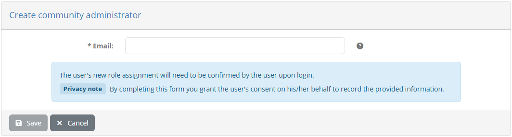

You are required to provide the **email** address of the user. This address needs to be the one that the user has linked to
her identity provider's account. Once you have created the user you will see that a new entry is added to the list of community administrators
but for which there is no displayed name and the displayed status is **Inactive**. The name and status will be
updated once this user has :ref:`confirmed this role assignment<login__roles__confirm>`. 

To finish creating the user click **Save**, otherwise click **Cancel** to close the dialog.

Editing an administrator's details displays her information as read-only.

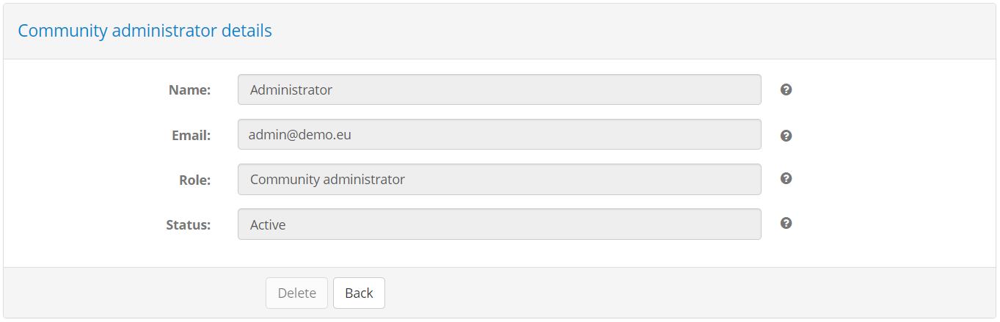

The information presented here is the user's **name**, **email**, **role**, and **status**. From here you can delete the user 
by clicking on **Delete** unless she is the only administrator configured for the community. Finally, clicking **Back** 
will return you to the previous screen.

Case: No identity provider
++++++++++++++++++++++++++

When creating an administrator you will be presented with a form to enter the user's information.

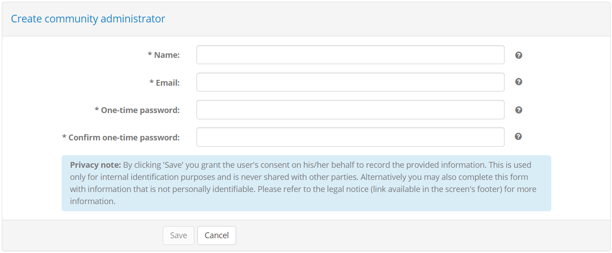

In this form you are expected to provide the following information:

* The administrator's **name** (required), used in your display and in feedback submissions to the Test Bed.
* The **username** (required), used to login.
* The user's **password**. The entered password is a "one-time" password which will need to be changed by the user upon his/her next login.

To complete the creation of the new administrator click on **Save**. Clicking **Cancel** discards changes and returns you to the previous screen.

When editing a user you see a similar screen, this time prefilled with the user's information.

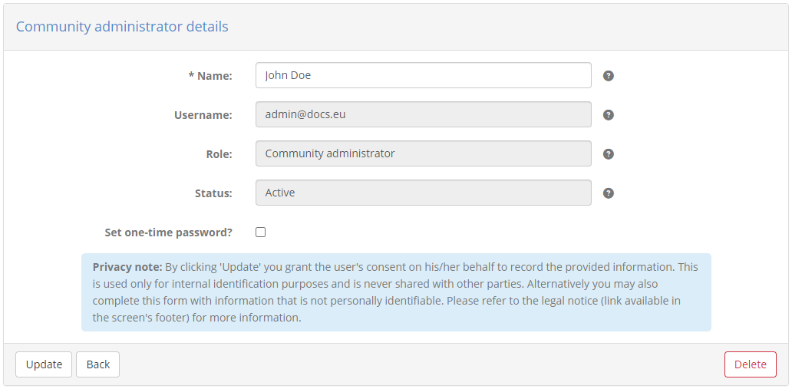

The information presented here is the user's **name**, **username**, **role**, and **status**, of which only the name is editable. To change the name
edit the existing value and click on **Update**, whereas to delete the user click on **Delete**. Finally, clicking **Back** will discard any pending
changes and return you to the previous screen.

In this form you may also choose to reset the user's password. You can do this by checking the **Set one-time password** option which will display for you 
an additional input field to provide the new password. The password you enter is considered a "one-time" password meaning that the user will be forced
to change it at his/her next login.

.. _community__manage_landing_pages:

Manage landing pages
~~~~~~~~~~~~~~~~~~~~

A **landing page** is the home page displayed to the community's users when they log into the Test Bed. Its purpose is to welcome users providing them context
on the use of the Test Bed and potentially including a customised message. Moreover, this customised message can even be set at the level of specific organisations
if you choose to do so (see :ref:`community__organisations`).

The landing pages available for the community are listed in the **Landing pages** section. These are presented in a table with one row per landing page,
displaying for each its **name**, **description** and indication on whether it is considered as the **default**.

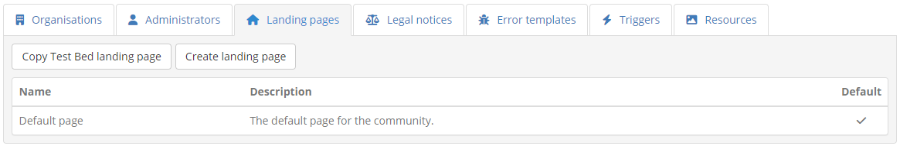

The landing page marked as default is the one that applies to all organisations in the community that don't have another, more specific one configured. If no
landing page is defined then the one that applies to the Test Bed as a whole is automatically used (see :ref:`systemAdmin__landing_pages`). Note the
community's default landing page is what the community's administrator(s) also view upon login.

Adding a new landing page can be done in one of the following ways:

* You can create a new landing page from scratch by clicking the **Create landing page** button.
* You can copy the :ref:`Test Bed's default landing page<systemAdmin__landing_pages>` by clicking the **Copy Test Bed landing page** button.
* You can copy one of the community's existing landing pages while editing its details.

Create landing page
+++++++++++++++++++

When creating a new landing page you are presented with a form to enter its information.

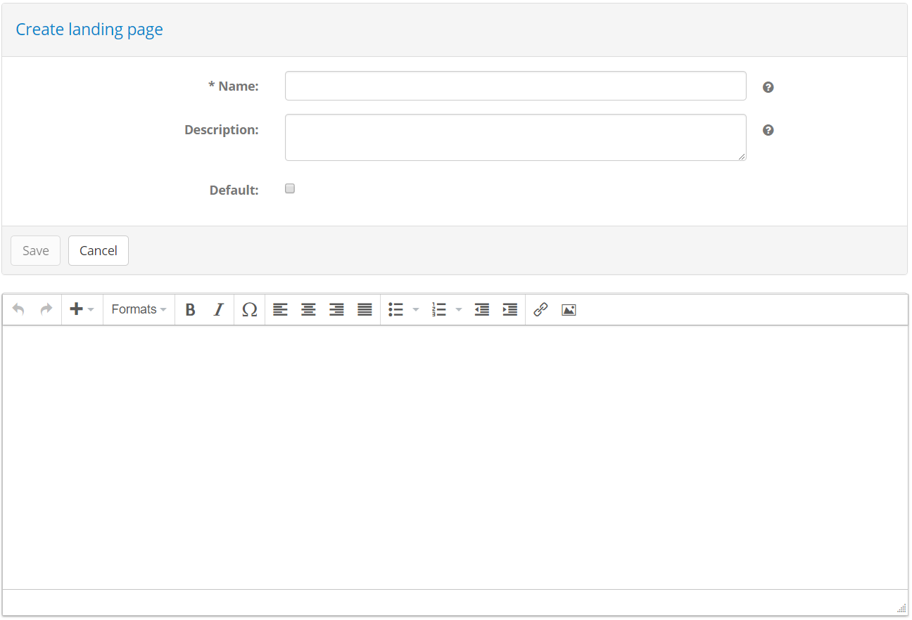

If you are creating a landing page from scratch (i.e. you have clicked the **Create landing page** button), this form will be empty. Alternatively,
if the landing page is being created as a copy of an existing one (either the Test Bed's default landing page or another one defined for the community), the
form will be prefilled. The information you are expected to complete for the landing page is:

* Its **name** (required), used in the list of landing pages and when selecting one for an organisation.
* Its **description** (optional), presented to Test Bed and community administrators.
* Whether or not it should be the **default** landing page for the community (default is "false").
* The landing page **content**, provided through a rich text editor, allowing you to add styled text, lists, images and links.

Above the rich text editor you have a **Copy resource reference** control that allows you to search in-place the :ref:`community's resources<community__manage_resources>`,
such as images to include or files to add download links for. Next to this you have the **Copy system-wide resource reference** control
which allows you to make a similar search on :ref:`system resources <systemAdmin__resources>` defined for the entire Test Bed. Once you find the resource you're looking for you can click it to copy its reference
to the clipboard. You can then use this reference as e.g. the source of an image file or the target of a link.

While editing the content of the landing page you can use the **Preview** button to preview how the landing page will look like before
you save it. The preview is presented in a popup that is styled and positioned exactly as the landing page :ref:`would appear<navigate__landing_page>`
when the community users log in. This allows you to fine tune aspects such as positioning and spacing to make sure the result is exactly
how you expect it to be.

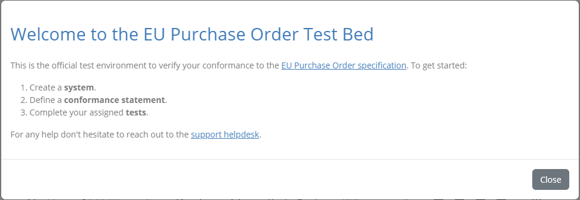

When you have finished defining the landing page you can complete its creation by clicking **Save**. Note that if you have set this as the
new default landing page for the community you will also be prompted for confirmation considering that this will be immediately visible to all your
users. Clicking on the **Cancel** button will discard pending changes and return to the previous screen.

Edit landing page
+++++++++++++++++

To edit an existing landing page click its corresponding row from the **Landing pages** table.

Doing so will take you to a screen where the landing page's information is displayed in editable form fields.

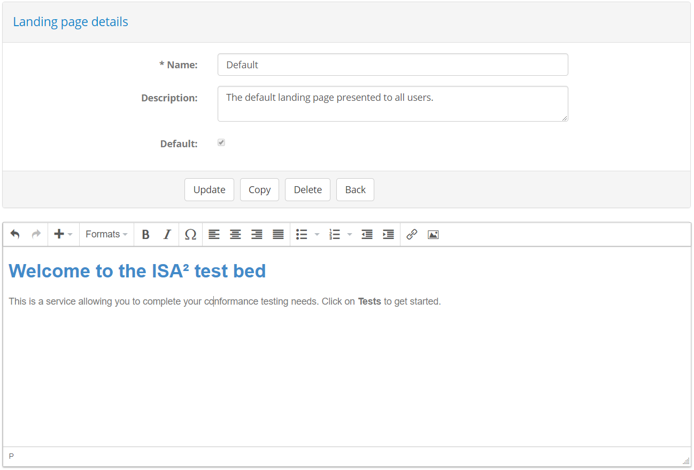

In this screen you can change the landing page's **name**, **description**, **default** setting and **content**. Note that if the landing page is currently
the default, this can't be unset. To switch defaults you would need to edit or create another landing page and at that time set it as the new default.
This is done to avoid misconfiguration where you could end up with no default landing page for the community.

Above the rich text editor you have a **Copy resource reference** control that allows you to search in-place the :ref:`community's resources<community__manage_resources>`,
such as images to include or files to add download links for. Next to this you have the **Copy system-wide resource reference** control
which allows you to make a similar search on :ref:`system resources <systemAdmin__resources>` defined for the entire Test Bed. Once you find the resource you're looking for you can click it to copy its reference
to the clipboard. You can then use this reference as e.g. the source of an image file or the target of a link.

While editing the content of the landing page you can use the **Preview** button to preview how the landing page will look like before
you save it. The preview is presented in a popup that is styled and positioned exactly as the landing page :ref:`would appear<navigate__landing_page>`
when the community users log in. This allows you to fine tune aspects such as positioning and spacing to make sure the result is exactly
how you expect it to be.

To persist any changes click on the **Update** button or discard them clicking on the **Back** button. The **Delete** button will, following confirmation,
remove the landing page. Finally, the **Copy** button allows you to make a copy of this landing page, by taking you to the landing page creation screen prefilled
with the current landing page's information. This can be useful if you want to create minor variations of a default landing page for certain organisations.

.. _community__manage_legal_notices:

Manage legal notices
~~~~~~~~~~~~~~~~~~~~

A **legal notice** is an arbitrary text that can be presented to the community's users when they click on the **Legal notice** link from the screen footer.
The purpose of this is to define terms and conditions, notices and disclaimers that you want to make known to the community.

You may define a default legal notice that applies to the entire community or even specific legal notices for one or more organisations.
The legal notices available for the community are listed in the **Legal notices** section. These are presented in a table with one row per notice,
displaying for each its **name**, **description** and indication on whether it is considered as the **default**.

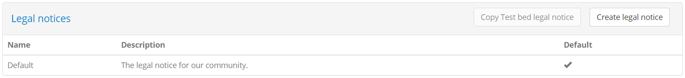

The legal notice marked as default is the one that applies to all organisations in the community that don't have another, more specific one configured. If no
legal notice is defined then the one that applies to the Test Bed as a whole is automatically used (see :ref:`systemAdmin__landing_pages`). Note that
the community's administrator(s) can also view the community's default legal notice when they click the relevant link from the screen footer.

Adding a new legal notice can be done in one of the following ways:

* You can create a new legal notice from scratch by clicking the **Create legal notice** button.
* You can copy the :ref:`Test Bed's default legal notice<systemAdmin__legal_notices>` by clicking the **Copy Test Bed legal notice** button.
* You can copy one of the community's existing legal notices while editing its details.

Create legal notice
+++++++++++++++++++

When creating a new legal notice you are presented with a form to enter its information.

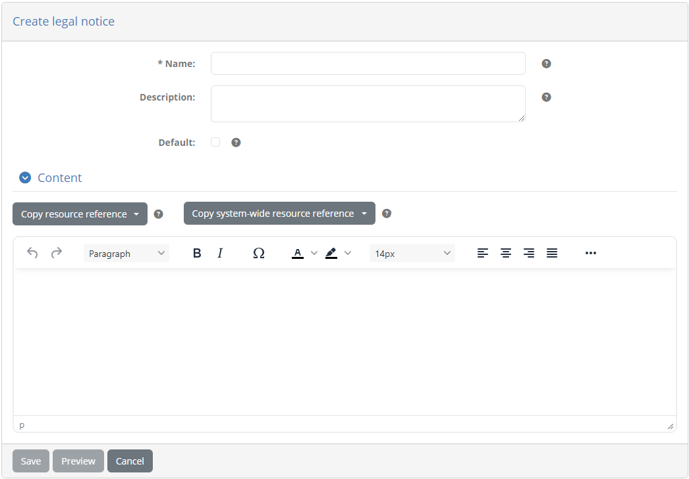

If you are creating a legal notice from scratch (i.e. you have clicked the **Create legal notice** button), this form will be empty. Alternatively,
if the legal notice is being created as a copy of an existing one (either the Test Bed's default legal notice or another one defined for the community), the
form will be prefilled. The information you are expected to complete for the legal notice is:

* Its **name** (required), used in the list of legal notices and when selecting one for an organisation.
* Its **description** (optional), presented to Test Bed and community administrators.
* Whether or not it should be the **default** legal notice for the community (default is "false").
* The legal notice **content**, provided through a rich text editor, allowing you to add styled text, lists, images and links.

Above the rich text editor you have a **Copy resource reference** control that allows you to search in-place the :ref:`community's resources<community__manage_resources>`,
such as images to include or files to add download links for. Next to this you have the **Copy system-wide resource reference** control
which allows you to make a similar search on :ref:`system resources <systemAdmin__resources>` defined for the entire Test Bed. Once you find the resource you're looking for you can click it to copy its reference
to the clipboard. You can then use this reference as e.g. the source of an image file or the target of a link.

While editing the content of the legal notice you can use the **Preview** button to preview how it will look like before
you save it. This allows you to fine tune its presentation and content to make sure the result is exactly how you expect it to be.

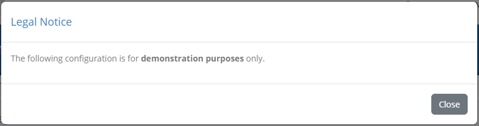

When you have provided the required information you can complete the legal notice creation by clicking **Save**. Note that if you have set this as the
new default legal notice for the community you will also be prompted for confirmation considering that this will be available to all its
users. Clicking on the **Cancel** button will discard pending changes and return to the previous screen.

Edit legal notice
+++++++++++++++++

To edit an existing legal notice click its corresponding row from the **Legal notices** table.

Doing so will take you to a screen where the legal notice's information is displayed in editable form fields.

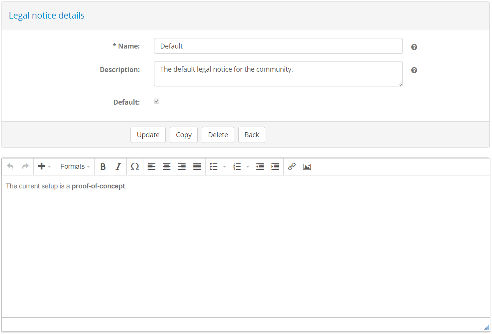

In this screen you can change the legal notice's **name**, **description**, **default** setting and **content**. Note that if the legal notice is currently
the default, this can't be unset. To switch defaults you would need to edit or create another legal notice and at that time set it as the new default.
This is done to avoid misconfiguration where you could end up with no default legal notice for the community.

Above the rich text editor you have a **Copy resource reference** control that allows you to search in-place the :ref:`community's resources<community__manage_resources>`,
such as images to include or files to add download links for. Next to this you have the **Copy system-wide resource reference** control
which allows you to make a similar search on :ref:`system resources <systemAdmin__resources>` defined for the entire Test Bed. Once you find the resource you're looking for you can click it to copy its reference
to the clipboard. You can then use this reference as e.g. the source of an image file or the target of a link.

While editing the content of the legal notice you can use the **Preview** button to preview how it will look like before
you save it. This allows you to fine tune its presentation and content to make sure the result is exactly how you expect it to be.

To persist any changes click on the **Update** button or discard them clicking on the **Back** button. The **Delete** button will, following confirmation,
remove the legal notice. Finally, the **Copy** button allows you to make a copy of this legal notice, by taking you to the legal notice creation screen prefilled
with the current legal notice's information. This can be useful if you want to create minor variations of a default legal notice for certain organisations.

.. _community__manage_error_templates:

Manage error templates
~~~~~~~~~~~~~~~~~~~~~~

An **error template** is a template that is used to format and stylise information displayed to users due to unexpected errors. They can be used to
provide specific guidelines to users or support information.

You may define a default error template that applies to the entire community or have specific ones for one or more organisations.
The templates available for the community are listed in the **Error templates** section. These are presented in a table with one row per template,
displaying for each its **name**, **description** and indication on whether it is considered as the **default**.

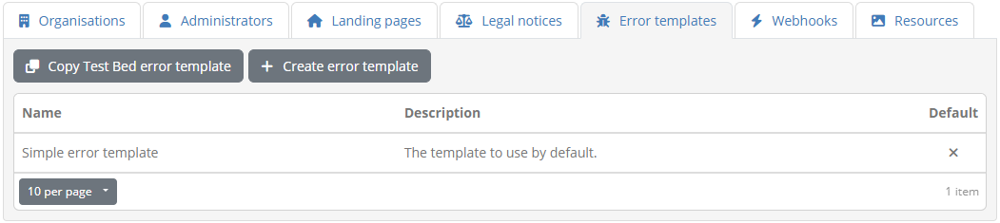

The template marked as default is the one that applies to all organisations in the community that don't have another, more specific one configured. If no
template is defined then the one that applies to the Test Bed as a whole is automatically used.

Adding a new error template can be done in one of the following ways:

* You can create a new template from scratch by clicking the **Create error template** button.
* You can copy the :ref:`Test Bed's default template<systemAdmin__error_templates>` by clicking the **Copy Test Bed error template** button.
* You can copy one of the community's existing templates while editing its details.

Create error template
+++++++++++++++++++++

When creating a new error template you are presented with a form to enter its information.

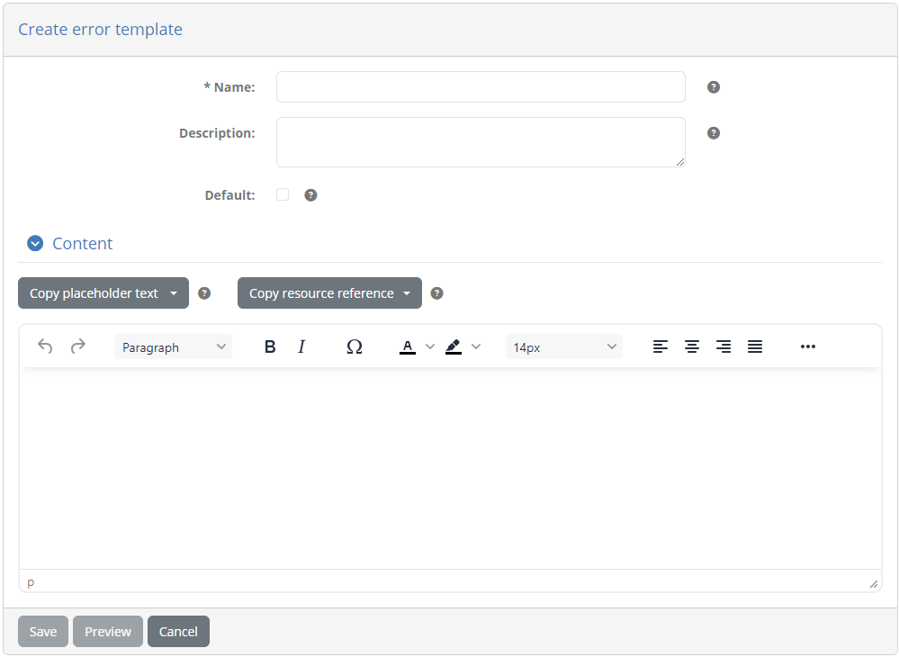

If you are creating an error template from scratch (i.e. you have clicked the **Create error template** button), this form will be empty. Alternatively,
if the template is being created as a copy of an existing one (either the Test Bed's default one or another one defined for the community), the
form will be prefilled. The information you are expected to complete for the error template is:

* Its **name** (required), used in the list of templates and when selecting one for an organisation.
* Its **description** (optional), presented to administrators.
* Whether or not it should be the **default** template for the community (default is "false").
* The template's **content**, provided through a rich text editor, allowing you to add styled text, lists, images and links.

When completing the content of the template you are also provided with two placeholders you can use that will be completed when an actual error is being treated:

* **$ERROR_DESCRIPTION:** The error message text (a text value - may be empty).
* **$ERROR_ID:** The error identifier (used to trace error in logs).

You can review and copy these placeholder values to your content using the **Copy placeholder text** button. In addition, you have a
**Copy resource reference** control that allows you to search in-place your :ref:`community's resources<community__manage_resources>`,
such as images to include or files to add download links for. Once you find the resource you're looking for you can click it to copy its reference
to the clipboard. You can then use this reference as e.g. the source of an image file or the target of a link.

While editing the template's content you can see a preview of what it would look like when used. To do so click the **Preview** button that will open an
error popup using a sample error and your current template:

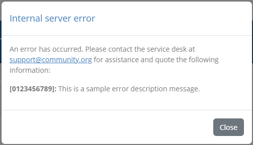

When you have provided the required information you can complete the template's creation by clicking **Save**. Note that if you have set this as the
new default for the community you will also be prompted for confirmation. Clicking on the **Cancel** button will discard pending changes and return to
the previous screen.

Edit error template
+++++++++++++++++++

To edit an existing error template click its corresponding row from the **Error templates** table.

Doing so will take you to a screen where the template's information is displayed in editable form fields.

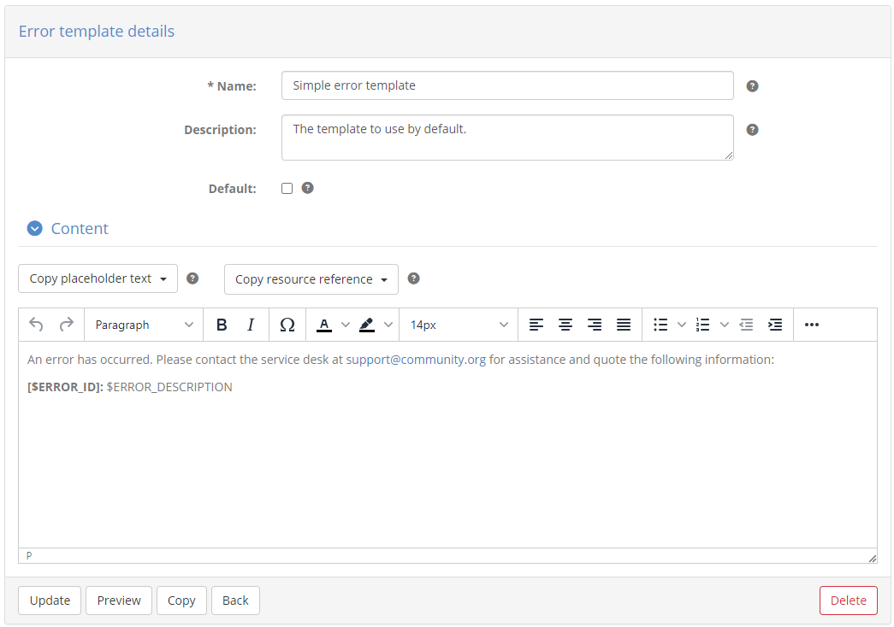

In this screen you can change the template's **name**, **description**, **default** setting and **content**. Note that if the template is currently
the default, this can't be unset. To switch defaults you would need to edit or create another one and at that time set it as the new default.
This is done to avoid misconfiguration where you could end up with no default error template.

When completing the content of the template you are also provided with two placeholders you can use that will be completed when an actual error is being treated:

* **$ERROR_DESCRIPTION:** The error message text (a text value - may be empty).
* **$ERROR_ID:** The error identifier (used to trace error in logs).

You can review and copy these placeholder values to your content using the **Copy placeholder text** button. In addition, you have a
**Copy resource reference** control that allows you to search in-place the :ref:`community's resources<community__manage_resources>`,
such as images to include or files to add download links for. Once you find the resource you're looking for you can click it to copy its reference
to the clipboard. You can then use this reference as e.g. the source of an image file or the target of a link.

While editing the template's content you can see a preview of what it would look like when used. To do so click the **Preview** button that will open an
error popup using a sample error and your current template:

Once you are finished click on the **Update** button to persist your changes or discard them clicking on the **Back** button. The **Delete** button
will, following confirmation, remove the template. Finally, the **Copy** button allows you to make a copy of this error template, by taking you to
the creation screen prefilled with the current template's information. This can be useful if you want to create minor variations of a default template
for certain organisations.

.. _community__manage_triggers:

Manage webhooks
~~~~~~~~~~~~~~~

A **webhook** is a means of carrying out automated processing when a given event occurs. Webhooks can receive various types of inputs depending
on their configured event, and can be used both to receive notifications and to modify the current test setup. They represent a powerful means of
extending the Test Bed's processing in a decoupled way and can be used to complete advanced tasks that the Test Bed alone cannot handle
(e.g. preparing configuration packages for new community members).

Webhook execution is always an asynchronous step, and a failed webhook call will never cause its root event to fail itself. Numerous webhooks
may be configured for the same event types which, assuming they are set as active, will all be processed. There is however no guarantee on the
execution order or chaining of webhooks, so you need to take this into account in your webhook design. Finally, note that webhooks are not
fired when bulk :ref:`import operations<exportimport__import>` take place (e.g. creating organisations through an import).

Configured webhooks are displayed in the **Webhooks** section. These are presented as a table with one row per webhook, displaying for each its
**name**, **description**, **event type**, **active** status and latest **result**.

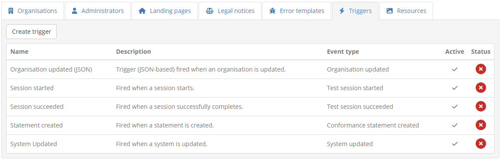

Adding a new webhook is done by clicking the **Create webhook** button.

.. _community__manage_triggers__create:

Create webhook
++++++++++++++

When creating a new webhook you are presented with a form to enter its information.

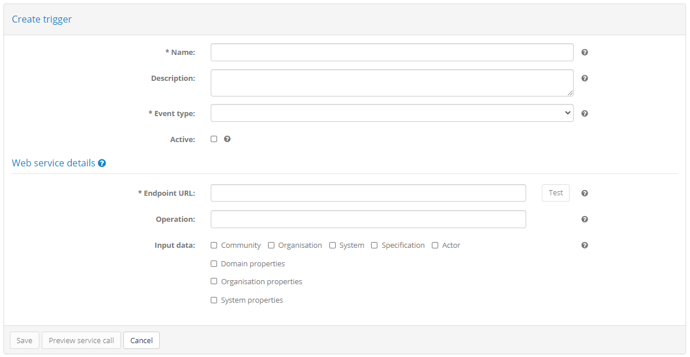

The information requested from you in this form for the new webhook is:

* Its **name** (required), used for display purposes in the list of webhooks.
* Its **description** (optional), presented to community administrators to provide additional context on the purpose of the webhook.
* The **event type** (required) for the occurrences of which the webhook will be fired.
* The **active** flag (optional) that determines whether this webhook is currently enabled (default is false).

The event types that are available for configuration are listed in the following table:

.. csv-table::
    :header: "Event type", "Description"
    :delim: |

    Organisation created | Creation of an organisation, either by a community administrator or via self-registration.
    Organisation updated | Update of an organisation's information (including :ref:`custom organisation properties<community__properties>`).
    System created | Creation of a system, either manually or via self-registration based on a :ref:`configuration template<community__create_organisation>`.
    System updated | Update of a system's information (including :ref:`custom system properties<community__properties>`).
    Conformance statement created | Creation of a conformance statement, either manually or via self-registration based on a :ref:`configuration template<community__create_organisation>`.
    Conformance statement updated | Update of a conformance statement's configuration (:ref:`endpoint parameter values<manage_your_conformance_statements__view_a_conformance_statements_details__endpoints>`).
    Conformance statement succeeded | Successful completion of a test session that leads to a conformance statement being considered as successfully passed.
    Test session started | Launch of a test session.
    Test session succeeded | Completion of a test session that resulted in a "successful" result.
    Test session failed | Completion of a test session that resulted in a "failed" result.

Once an event type is selected you will also be presented with an optional **fire condition**.

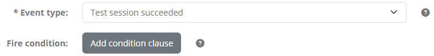

A fire condition is a specific rule that governs whether the webhook will be activated. This means that besides the webhook
event itself (e.g. starting a test session), you can specific for which cases the webhook should fire (e.g. specific test cases).
Clicking the **Add condition clause** button prompts you to add a clause to your condition (you can have any number of such clauses).
Doing so opens a popup to define the clause's parameters:

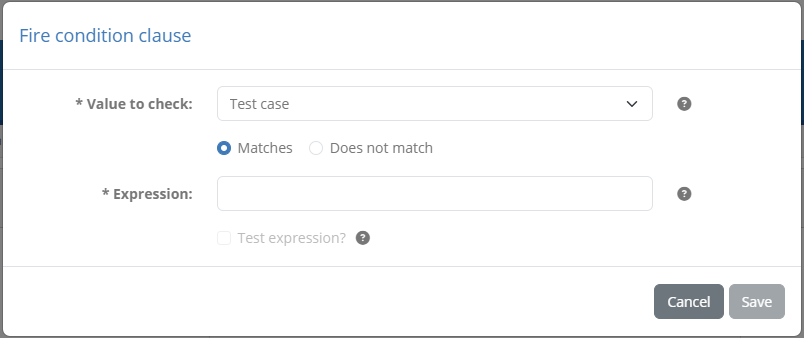

Clauses are based on checking values against **regular expressions**. In this popup you can select the value to check based 
on the webhook's event type, provide the expression to use, as well as whether the expression should
result in a match or not (the latter used to invert the check). 

Once you have selected the value type and provided an expression, you can also **test the expression** by checking the relevant
checkbox and using a sample value. For example, we can consider a webhook when test sessions start, that should apply
only for specifications with *"Export"* in their name:

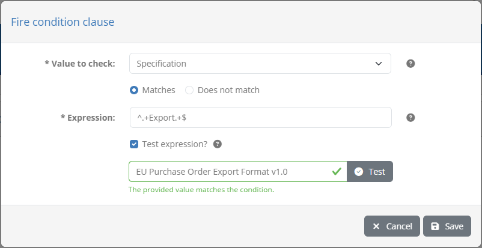

Once you have configured your fire condition with one or more clauses, you can manage it and also test it to make sure it works
as you expect. To test it check the relevant checkbox, and try it out for a specific type of value:

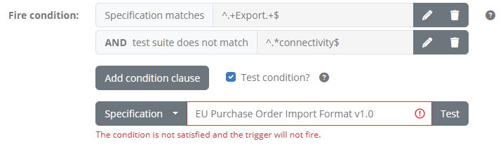

.. note::

  Defining fire conditions is optional - webhooks without conditions will always fire.

The separate **Web service details** section includes the inputs concerning the webhook's web service. Consider that the webhook itself is a set of metadata
that determines what fires and with what data, however the actual processing linked to the webhook is handled by the configured web service. This service
needs to be accessible by the Test Bed and must be either:

* A **SOAP service** implementing the `GITB processing service API`_, a simple API that expects an arbitrary set of inputs and can
  provide any number of outputs.
* An **HTTP service** listening for ``POST`` requests, receiving inputs and producing outputs in JSON.

The information required to configure this web service are:

* Its **endpoint URL** (required). In case of a GITB processing service this is expected to be the full URL to reach the service's WSDL file.
  If a JSON HTTP service is used instead, this is the URL at which the service is listening. In any case this URL needs to be provided
  as it should be used by the Test Bed, meaning that it could also be an internal address.
* An **operation** (optional), to signal an operation name to the service. Such operations are foreseen by the `GITB processing service API`_, although this can also be used for HTTP services as
  extra metadata to distinguish calls.
* The **input data** (optional) to provide as part of service's payload when the webhook fires.

The provided **endpoint URL** can be tested to ensure it is responding as expected. To do this click the **Test** button at the right end of the URL's text field.
If your service is set as a GITB processing service this will call the service's `getModuleDefinition operation`_, otherwise in case of an HTTP service, it will make an HTTP ``POST``
with an empty JSON payload (``{}``).

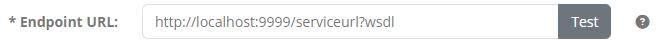

Once the call is made a popup will be displayed to present you the results. For example, a correctly working GITB processing service would result
in its response displayed as follows:

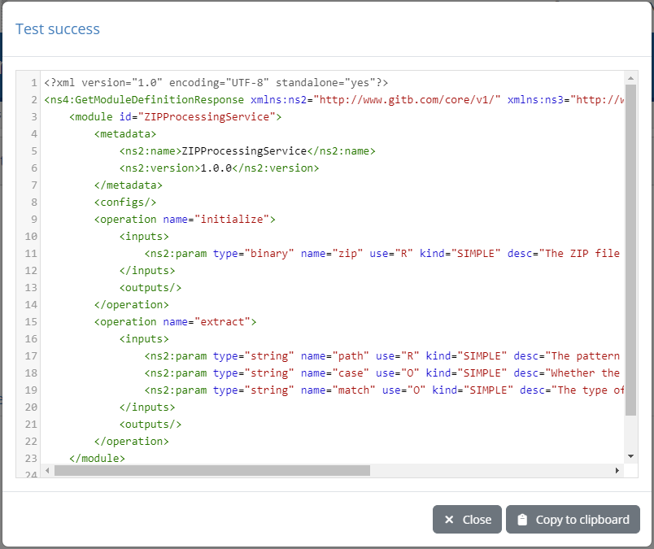

If the test fails, the popup will display the collected error messages from the call attempt. If multiple nested errors are raised you are presented with the errors in sequence.

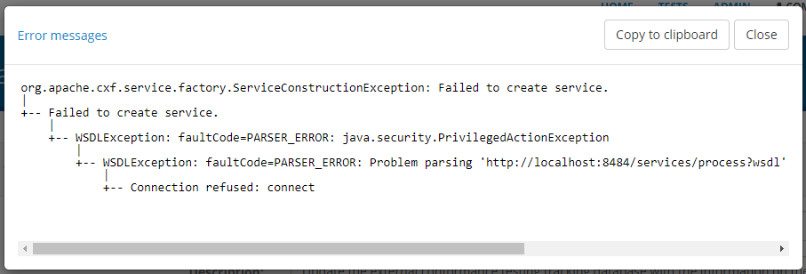

Regarding the webhook's **input data**, this represents the context needed by the webhook's web service to complete
its processing. The available inputs depend on the webhook's **event type** as follows:

.. csv-table::
    :header: "Input data", "Event types", "Details"
    :delim: |

    Community | All | The ID, short and full name of the community.
    Organisation | All | The ID, short and full name of the organisation linked to the event.
    System | System/statement created/updated/completed | The ID, short and full name of the system linked to the event
    Specification | Statement created/updated/completed | The ID, short and full name of the specification linked to the event
    Actor | Statement created/updated/completed | The ID, short and full name of the actor linked to the event
    Test session | Test session started/succeeded/failed | The ID of the test session, and its related test case and test suite.
    Test report | Test session succeeded/failed | The XML report of the test session expressed in the `GITB Test Reporting Language (GITB TRL) <https://www.itb.ec.europa.eu/docs/tdl/latest/introduction/index.html#specification-links>`_.
    Domain properties | All | The identifier and value of one or more custom domain properties.
    Organisation properties | All | The name and value of one or more custom organisation properties.
    System properties | System/statement created/updated/completed | The name and value of one or more custom system properties.
    Conformance statement properties | Statement created/updated/completed | The name and value of one or more custom system properties.

To include one or more types of data in the service's calls check the relevant checkboxes. In the case of domain, organisation, system and statement properties, once the relevant
option is checked, you will be presented with a multiple selection list with the properties defined for the community.

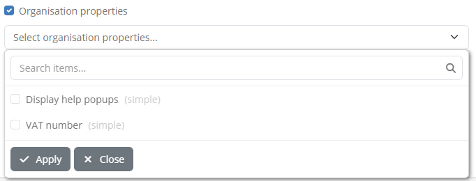

You see here the **name** of each property as well as its **type**. Simple and secret values are included as text, whereas binary values are included as serialised Base64 strings.

.. note::
  **Including secret properties:** Secret properties, if included as input, will be passed in the clear. Make sure that you are aware of this and only choose to include
  such values knowingly.

Once you have selected the inputs required by the service you can click the **Preview and test service call** button.

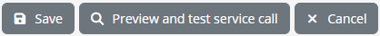

This will use the information provided to display the sample payload that will be sent to the service. In case this is configured to
be a **GITB processing service** this will be the input SOAP envelope.

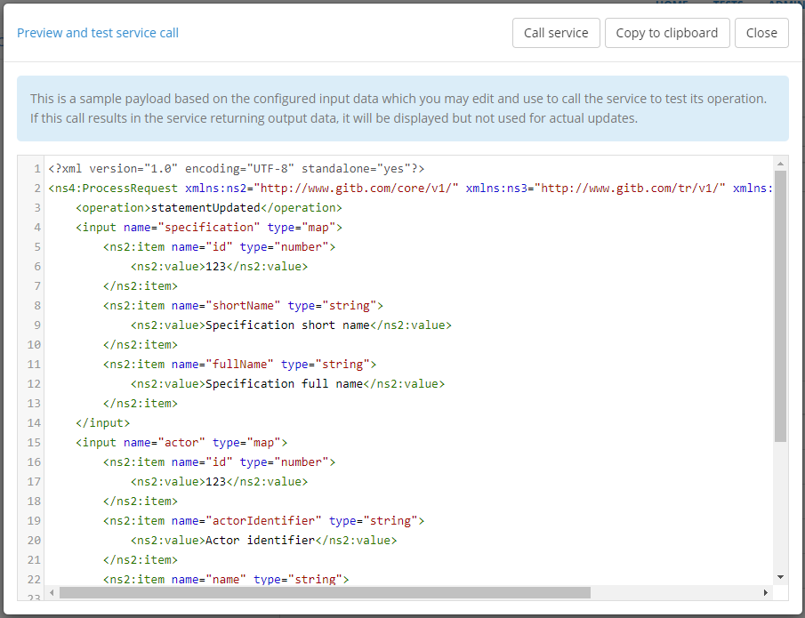

Alternatively, if the service is set as an **HTTP service**, the payload will be presented in JSON format.

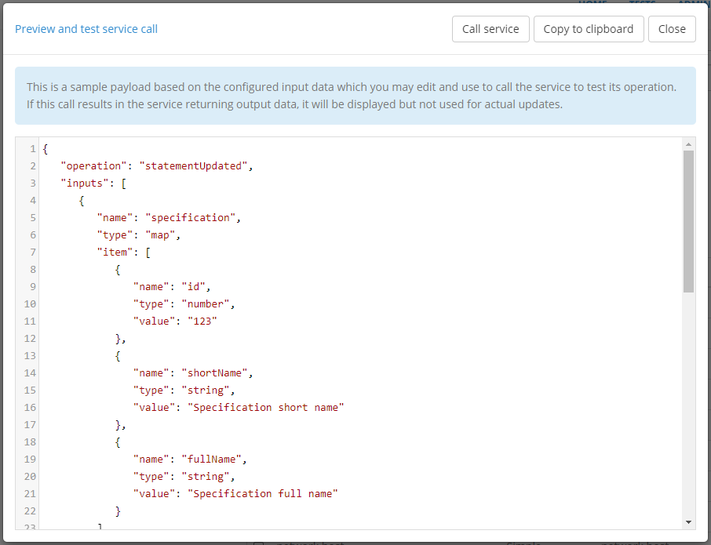

From this preview popup you can click **Copy to clipboard** to copy all text or **Close** to hide the preview. Clicking on **Call service** will call the webhook's service
using the presented payload, allowing you to test it directly from the webhook definition screen. Before making such a call you can also edit the payload to test different
input values and potentially refer to actual information from the community.

Once the service has been called you will see its result displayed in the popup or a detailed error trace. The
below example is a sample result after successfully calling a GITB processing service.

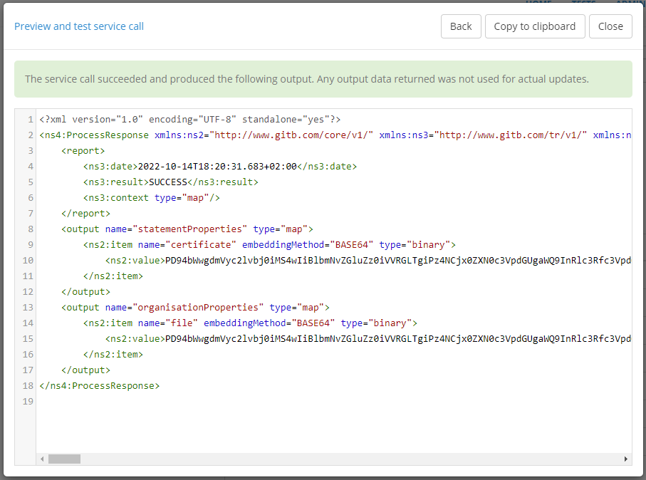

It is important to note that such test calls will never result in updating data on the side of the Test Bed.
Normal webhook calls support :ref:`updating data based on returned outputs<community__manage_triggers__output>`
but this does not apply when testing. You do however have the opportunity to inspect returned outputs that would
normally be used for updates, to ensure that everything is working as you expect. If you would like to make
additional test calls you can click here the **Back** button to return to the previous preview screen
(maintaining any editing that you may have introduced manually).

Once you have provided the required information and completed your tests, you can create the webhook by clicking the **Save** button. Clicking on the **Cancel** button will discard pending
changes and return to the previous screen.

.. _community__manage_triggers__edit:

Edit webhook
++++++++++++

To edit an existing webhook click its corresponding row from the **Webhooks** table.

Doing so will take you to a screen where the webhook's information is displayed in editable form fields.

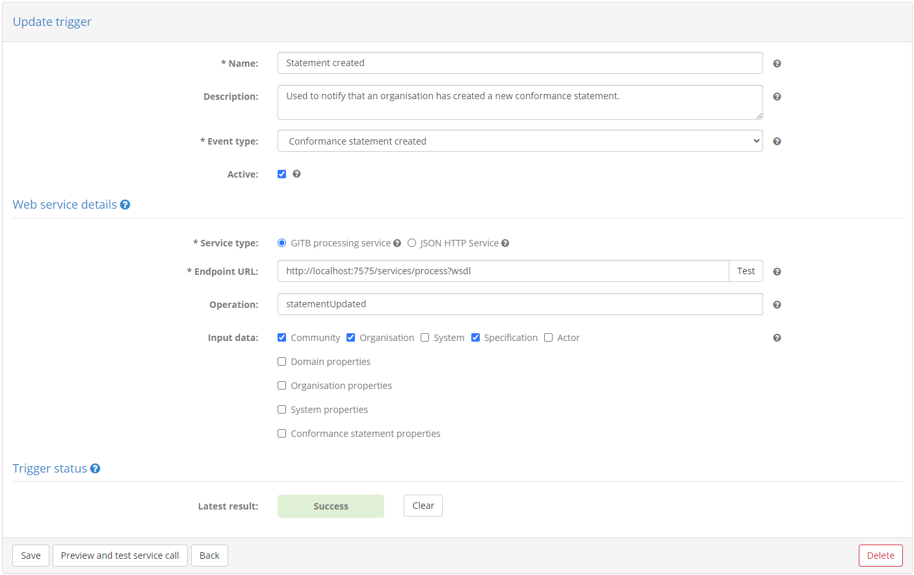

In this screen you can change the webhook's information, web service details and included data. For a detailed description of each property and the available options check the
:ref:`webhook creation<community__manage_triggers__create>` documentation. In this screen you can in addition see a section named **Webhook status** which
indicates the result from the webhook's last execution. This status can be one of the following:

* **None:** Highlighted in blue, this displays if the webhook has actually never fired up to now.
* **Success:** Highlighted in green, this indicates the webhook succeeded in its last execution.
* **Error:** Highlighted in red, this indicates the webhook failed in its last execution.

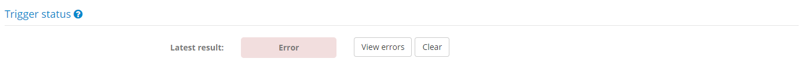

For webhooks having executed and resulting either in a success or failure, you are presented with a **Clear** button. You may click this to clear the latest status, resetting it to **None**,
in case you want to ensure a subsequently displayed status corresponds to changes you have just introduced. In the case of a failed last call you also have the option to **View errors**. Clicking this
will display the collected error messages returned from the last execution that you can **Copy to clipboard** or **Close**.

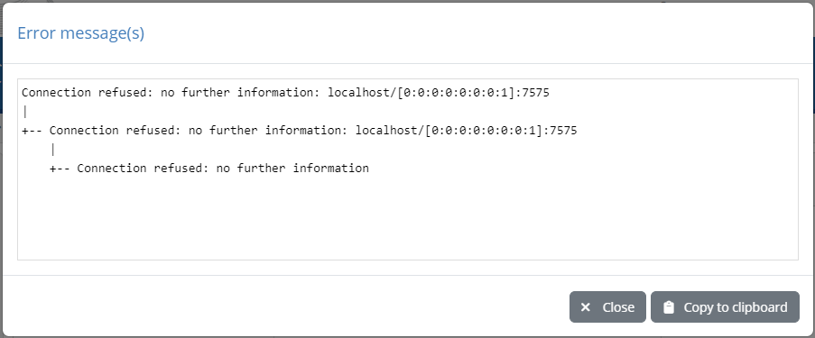

To persist any changes you have made in the webhook's definition click on **Save**. Clicking on **Delete** deletes, upon confirmation, the webhook, whereas clicking **Back** will cancel
pending changes and return to the :ref:`community details page<community>`.

.. _community__manage_triggers__output:

Returning output from webhooks
++++++++++++++++++++++++++++++

One of the powerful features of webhooks is that they can also adapt the configuration in the Test Bed. A webhook can achieve this by having its web service return an output as per the
`GITB processing service API`_ specification that can modify, depending on the webhook's event type, the values for **organisation properties**, **system properties** or **conformance statement parameters**.
In case of a JSON HTTP service, the same possibility exists by returning JSON output using the same names and structures as the `GITB processing service API`_.

Each type of output is grouped in a map (or JSON object for HTTP services) which defines output items as key-value pairs, the key being the property's key or identifier and the value being the value to set (provided as
Base64 in the case of binary properties). Each value map is named as follows:

* **organisationProperties** for organisation properties to set (applicable and handled in all cases).
* **systemProperties** for system properties to set (applicable and handled in events linked to systems and conformance statements).
* **statementProperties** for the properties of conformance statements (applicable and handled in events linked to conformance statements).

Note that returned properties that don't apply (e.g. system properties when creating an organisation) are ignored. This is also the case for properties that cannot be matched with existing ones.
In addition, any unexpected errors that may occur when calling webhooks or processing their responses have no effect on the origin event of the webhook. For example
a webhook fired for a newly created organisation that fails, will never prevent or affect the organisation's creation.

The following sample output illustrates a case where a webhook linked to the creation of a new conformance statement is returning values to set:

* For the organisation, setting its "identifier" property.
* For two conformance statement properties named "client.flag" and "client.number".

.. code-block:: xml

  <?xml version="1.0" encoding="UTF-8" standalone="yes"?>
  <ps:ProcessResponse xmlns:core="http://www.gitb.com/core/v1/" xmlns:ps="http://www.gitb.com/ps/v1/">
      <output name="organisationProperties">
          <core:item name="identifier">
              <core:value>123</core:value>
          </core:item>
      </output>
      <output name="statementProperties">
          <core:item name="client.flag">
              <core:value>true</core:value>
          </core:item>
          <core:item name="client.number">
              <core:value>ABC</core:value>
          </core:item>
      </output>
  </ps:ProcessResponse>

A use case for such a webhook could be to prepare the organisation's configuration linked to the new conformance statement so that it can begin testing. This webhook processing could
also be defined as a mandatory prerequisite through the use of a hidden but required property that is used as a control flag and set through the webhook's output.

.. _community__manage_resources:

Manage resources
~~~~~~~~~~~~~~~~

In several cases the Test Bed supports the definition of rich content as documentation or as a means of customising the experience of a community's members.
Specifically, rich content is available as:

* Community :ref:`landing pages<community__manage_landing_pages>`, :ref:`legal notices<community__manage_legal_notices>` and :ref:`error templates<community__manage_error_templates>`.
* Documentation for :ref:`test suites<domains__test_suite_details>` and :ref:`test cases<domains__test_case__details>`.

Within such rich content it is possible to include additional **resources**, either as displayed images or download links. Typical examples are a community's logo
displayed on its landing page, UML sequence diagrams to illustrate a test case's steps, and links to download test data. When referring to such resources, you may
either point to external sources (e.g. a public documentation site for your project) or to resources defined internally within the Test Bed. The configuration and
use of such internal resources is addressed in the current section.

.. note::
  **System-wide resources**: It is also possible to define :ref:`system-wide resources <systemAdmin__resources>` available publicly and to all community users.

Configured resources are displayed in the **Resources** section. Each resource is presented as a row displaying its file **name**, its **reference to use** when
including it in rich content, and its **description**. For each resource you are provided with controls to **copy** the resource's reference to the clipboard, **delete**
the resource, and **download** it.

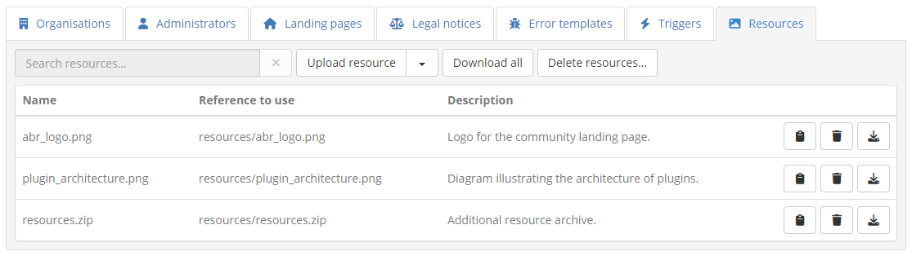

Above the listing of resources you have a **search filter** to search against resources' names and descriptions in a case-insensitive manner. From here you may also
select the  **Delete resources...** button to delete one or more resources, or the **Download all** button to download all resources in a ZIP archive. Adding new
resources is achieved through the **Upload resource** button that opens a popup in which you are asked to select the resource file and provide an optional description.

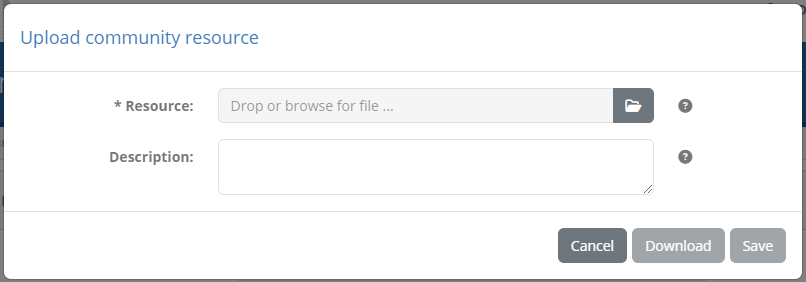

Alternatively, you may also click the options of the **Upload resource** button to perform a **Bulk upload**. Doing so will display a popup in which you can 
select a ZIP archive including all resources you would want to upload in one go. You may also select whether resources with the same name are to be replaced or
kept.

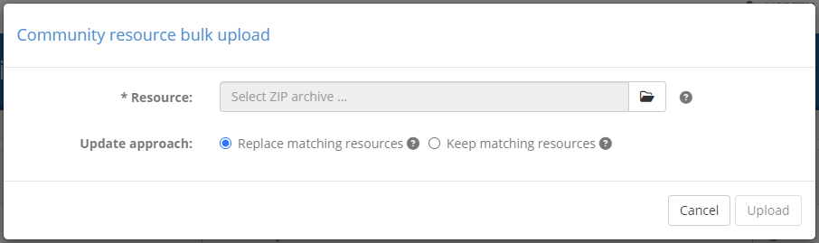

Whenever you upload a resource with a name matching an existing one (regardless of case), the new resource will be added with an index postfix. The same applies when uploading in bulk 
and having chosen to keep matching resources. This is done because names of resources need to be unique within a community to allow you to unambiguously refer to them
where needed.

To use a community resource in rich content you simply need to provide the resource reference as the source of an image or link. This can be done both when editing
rich content through the Test Bed's user interface, but also when preparing documentation included in test suite archives. It is important to note that resources are
**not publicly available**, but rather require you to have access to the community in question.

.. _community__report_settings:

Edit report settings
~~~~~~~~~~~~~~~~~~~~

All reports produced in the scope of the community's testing activities can be customised by the community administrator. This is done by clicking
the **Edit conformance certificate settings** button from the community details' panel:

The reports that can be customised here are:

* The :ref:`conformance statement certificate<community__report_settings__statement_certificate>`, confirming the successful testing of an organisation for a specific conformance statement.
* The :ref:`conformance overview certificate<community__report_settings__overview_certificate>`, confirming the successful testing of an organisation for a set of related conformance statements.
* The :ref:`conformance statement report<community__report_settings__statement_report>`, summarising the status of a specific conformance statement.
* The :ref:`conformance overview report<community__report_settings__overview_report>`, summarising the status of a set of related conformance statements.
* The :ref:`test case report<community__report_settings__test_case_report>`, summarising the result of a test session.
* The :ref:`test step report<community__report_settings__test_step_report>`, summarising the result of a test session's specific step.

Each report's settings are managed through specific panels included in the report settings screen. Clicking each panel expands it to display the available settings,
whereas clicking the **Back** button returns you to the :ref:`community details screen<community>`.

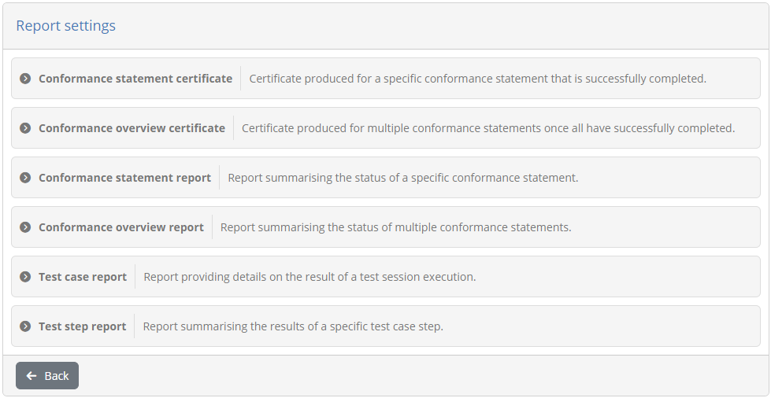

.. note::
  Not all elements of these reports can be customised. The settings that are available however are addressed in the following sections.

.. _community__report_settings__statement_certificate:

Conformance statement certificate
+++++++++++++++++++++++++++++++++

A **conformance statement certificate** acts as the official summary of an organisation's testing activities, providing proof of successfully passing a given
conformance statement. To manage the report click the **Conformance statement certificate** panel to display its available settings.

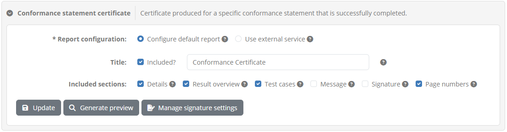

By default the **report's configuration** assumes you will be using the Test Bed's built-in report template. This foresees predefined but
customisable sets of information, that will be used to automatically generate the certificate when requested by organisation users.
When a certificate is generated by a community administrator, these settings serve as defaults that can be further customised before producing
the final report.

The options you can provide to customise your issued certificates are as follows:

* The **title** to use. If none is provided "Conformance Certificate" is used, but you may also choose to not include any title.
* Whether to add the conformance statement **details**. These are the information on the domain, specification, actor, organisation and system.
* Whether to add the **result overview**. This is a summary text on the number of successfully passed and failed test cases.
* Whether to add the individual **test cases**. Doing so will include a table showing the status for each test case in the conformance statement.
* Whether to add a custom **message**. This is a rich-text section that you can customise as needed.
* Whether to add a digital **signature** to the report. This is done to serve as proof of authenticity and for non-repudiation.
* Whether to include **page numbers** in the report's footer.

By default the conformance certificate includes the same information as the :ref:`conformance statement report<manage_your_conformance_statements__view_a_conformance_statements_details__export>`.
You are however free to customise this as you see fit for the community.

If you select to add a **message**, the form will expand to allow you to define its content:

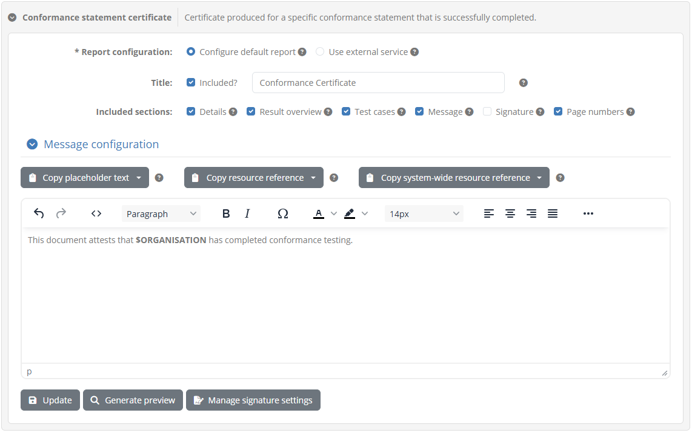

This is provided by means of a rich text editor that supports several placeholders that will be replaced using values from the actual conformance statement when
the certificate is generated. The supported placeholders and their meaning are listed in the following table.

.. csv-table::
  :header: "Placeholder", "Description"
  :delim: ~

  $DOMAIN ~ The full name of the domain.
  $SPECIFICATION ~ The full name of the specification.
  $SPECIFICATION_GROUP ~ The full name of the specification group.
  $SPECIFICATION_GROUP_OPTION ~ The full name of the option (specification within a group).
  $ACTOR ~ The full name of the actor linked to the conformance statement.
  $ORGANISATION ~ The full name of the organisation to be granted the certificate.
  $SYSTEM ~ The full name of the organisation's system that was used in the tests.
  $SNAPSHOT ~ The public name of the :ref:`relevant conformance snapshot <monitor_conformance_status__snapshots>` (or the label for the latest status).
  $BADGE ~ The :ref:`configured badge<domains__specification>` for the statement's status.
  $BADGE{width} ~ Similar to **$BADGE** but forcing a specific width (in pixels) for the image.
  $REPORT_DATE{format} ~ The date and time when the report was generated, using the defined format (as a `Java data format string <https://docs.oracle.com/en/java/javase/21/docs/api/java.base/java/time/format/DateTimeFormatter.html>`__).
  $LAST_UPDATE_DATE{format} ~ The date and time when the conformance status was last updated, using the defined format (as a `Java data format string <https://docs.oracle.com/en/java/javase/21/docs/api/java.base/java/time/format/DateTimeFormatter.html>`__).
  $ORGANISATION{PROPERTY} ~ The value of a :ref:`custom organisation-level property<community__properties>` (named "PROPERTY" here) set for the statement's organisation.
  $SYSTEM{PROPERTY} ~ The value of a :ref:`custom system-level property<community__properties>` (named "PROPERTY" here) set for the statement's system.
  $DOMAIN{PROPERTY} ~ The value of a :ref:`domain parameter<domains__domain__parameter_list>` (named "PROPERTY" here) set for the community's domain.

You can review and copy all the above placeholder values to your message content using the **Copy placeholder text** button.

Besides placeholders, you also have a **Copy resource reference** and **Copy system-wide resource reference** controls that allow you to search in-place respectively the :ref:`community's resources<community__manage_resources>`
and :ref:`system resources <systemAdmin__resources>`, such as images to include or files to add download links for. Once you find the resource you're looking for you can click it to copy its reference
to the clipboard. You can then use this reference as e.g. the source of an image file or the target of a link.

.. _community__report_settings__statement_certificate__external:

Delegate to an external service
...............................

Besides using the built-in certificate template you may choose to delegate the report's generation to an **external service**. Doing so affords you full control over the
resulting report, both in terms of included information as well as styling. To use this option, select the **Use external service** option for the **report configuration**.

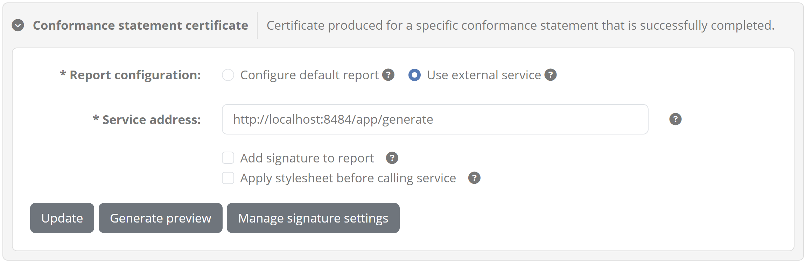

With this option enabled you are expected to configure an HTTP service that will:

* Receive from the Test Bed a ``POST`` request having as its body the relevant :ref:`conformance statement report <community__report_settings__statement_report>` in **XML format**.
* Respond with the produced PDF report.

Selecting this option presents you with a set of relevant inputs:

* The **service address** representing the endpoint to handle the report's generation.
* An option to **add a signature** to the produced report. You can skip this if you don't require signatures, or if the service itself adds a signature.
* An option to **apply a stylesheet before calling the service**. Doing so allows you to configure an XSLT stylesheet that will be applied to the default XML
  report before providing it to the configured service.

.. _community__report_settings__statement_certificate__signature:

Configure digital signatures
............................

To ensure the integrity and trust of your report you may also choose to include a **digital signature**. To manage your signature setting click on **Manage signature settings**
from the panel's footer.

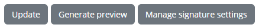

Doing so will display a popup in which you can provide information on the certificate to be used for the signatures.

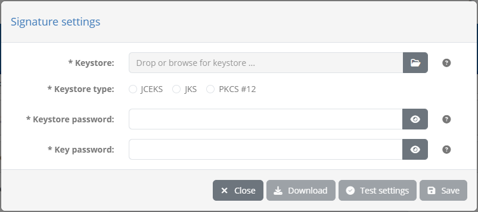

You are expected to provide here:

* The **keystore** file that includes the keypair (private and public key) that will be used. The keystore should contain **a single keypair**.
* The **keystore type**. Supported types are JCEKS, JKS and PKCS#12.
* The **keystore's password**, used to open and read the keystore's contents.
* The **key's password**, that is needed to use the private key when producing signatures.

.. note::
    **Use of a community keypair for signatures:** The reason you are expected to provide a keypair for signatures is because ultimately
    the responsibility for issuing and signing the report, as well as maintaining the validity of the relevant keypair lies within the community.

Once the certificate information is provided you may **Download** or **Delete** it's keystore. You may also validate your configuration to be certain
that the Test Bed can read the certificate by clicking the **Test settings** button. Clicking **Save** will persist your settings, whereas **Close** will hide the popup.

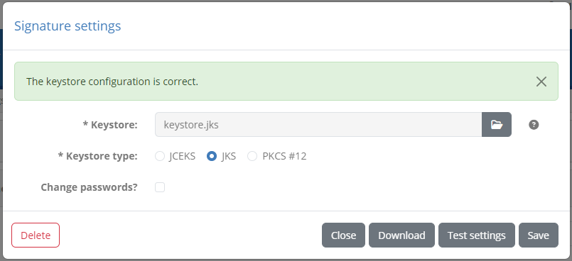

.. _community__report_settings__statement_certificate__review:

Preview your configuration
..........................

Once you have adjusted your settings you may preview them by clicking the **Generate preview** button. This will produce a certificate using sample values which,
in case you are using the default template, will be similar to the following example:

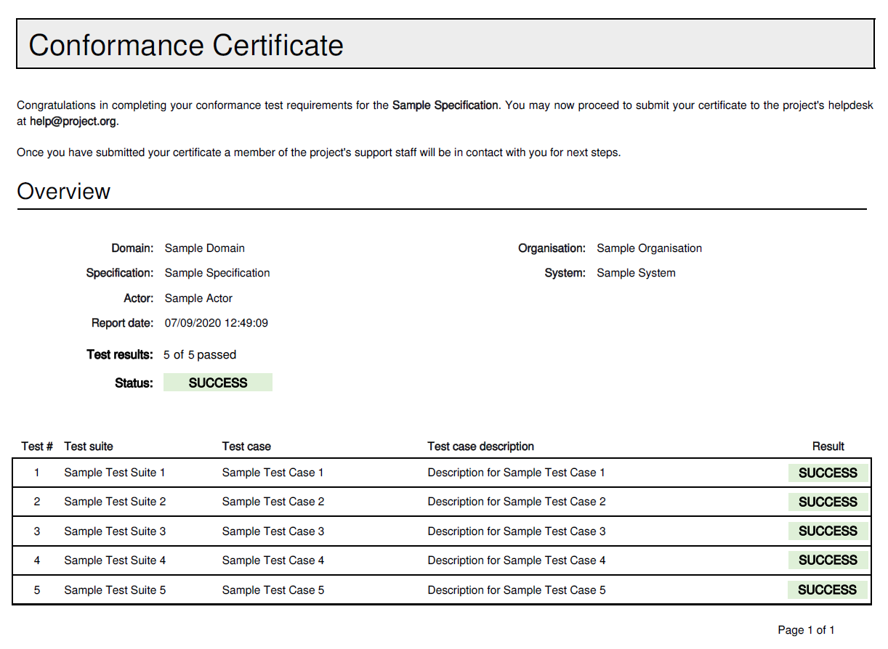

In case you chose to :ref:`delegate the report's generation to an external service <community__report_settings__statement_certificate__external>`, the preview also
serves as a test that the service is accessible and responds as expected. The service will be called with the sample data in XML form, and the resulting PDF report will
be downloaded. In case there is an error in the configuration or the service's processing, a popup with detailed information will be presented to help you troubleshoot
the issue.

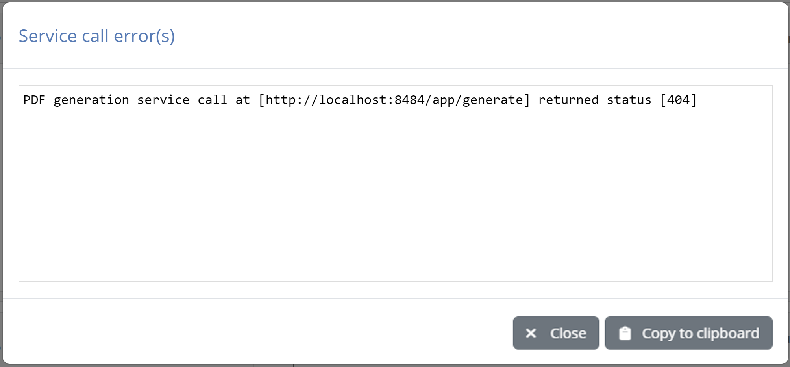

.. _community__report_settings__overview_certificate:

Conformance overview certificate
++++++++++++++++++++++++++++++++

A **conformance overview certificate** is similar in nature to the :ref:`conformance statement certificate<community__report_settings__statement_certificate>` in
that is provides proof of successful test completion for a given organisation. The difference in this case is that it focuses not on a single conformance statement,
but rather on a set of related statements at different aggregation levels. These could be the **overall status** of the organisation; or a specific **domain**,
**specification group**, or **specification**. To manage the report click the **Conformance overview certificate** panel to display its available settings.

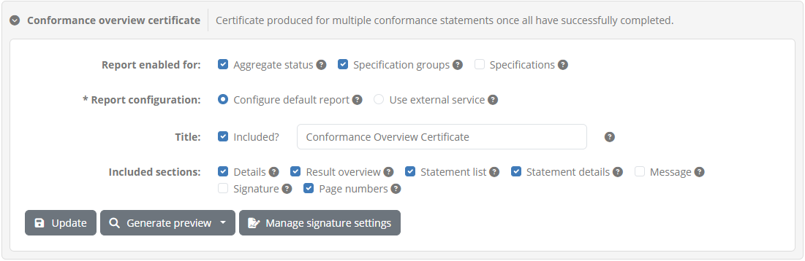

The first setting is to select the **report levels** for which conformance overview certificates will be enabled. By default users can produce a
normal :ref:`conformance overview report<manage_your_conformance_statements__export_overview>` at any level, but no conformance certificates. If and at which
levels such certificates are to be made available is determined by the community administrator with these options.

With at least one report level selected, the next option is on how to generate the report. By default the **report's configuration** assumes you will be
using the Test Bed's built-in report template. This foresees predefined but customisable sets of information, that will be used to automatically generate
the certificate when requested by organisation users. When a certificate is generated by a community administrator, these settings serve as defaults that
can be further customised before producing the final report.

The options you can provide to customise your issued certificates are as follows:

* The **title** to use. If none is provided "Conformance Certificate" is used, but you may also choose to not include any title.
* Whether to add the conformance overview **details**. These are the information on the domain, specification, actor, organisation and system.
* Whether to add the **result overview**. This is a summary text on the number of successfully passed and failed statement.
* Whether to add the **statement list**. Doing so will include a table showing the status for each statement in the conformance statement.
* Whether to add the individual **statement details**. Doing so will include a detailed report for each covered statement.
* Whether to add a custom **message**. This is a rich-text section that you can customise as needed.
* Whether to add a digital **signature** to the report. This is done to serve as proof of authenticity and for non-repudiation.
* Whether to include **page numbers** in the report's footer.

By default the conformance certificate includes the same information as the :ref:`conformance overview report<manage_your_conformance_statements__view_a_conformance_statements_details__export>`.
You are however free to customise this as you see fit for the community.

If you select to add a **message**, the form will expand to allow you to define its content:

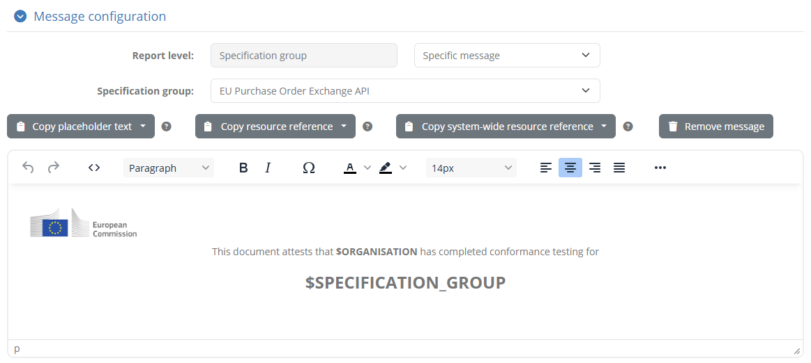

You can define different custom messages for different report aggregation levels and even specific levels, such as a given specification group. The available
choices are determined by the **report levels** for which you have enabled certificates as defined previously (using the **Report enabled for** options).
Depending on these levels you can define a custom message as follows:

* For the overall **aggregate status** of an organisation.
* For **domains**, **specification groups** or **specifications**.

In the cases of domains, specification groups and specifications you may define the **default message** to appear regardless of which domain, group or specification
the report refers to, or a **specific message** for the one the report refers to. In all cases, the custom message itself is configured by means of a rich text editor
that supports several placeholders that will be replaced when the certificate is generated. The supported placeholders, the levels for which they apply, and their
meaning are listed in the following table.

.. note::
  Where placeholders below include the term **index**, this refers to the 0-based sequential index of the overview's included conformance statements. For example,
  **$SPECIFICATION{0}** refers to the specification name of the first included conformance statement.

.. csv-table::
  :header: "Placeholder", "Report level", "Description"
  :delim: ~

  $DOMAIN ~ All levels (when a specific domain applies). ~ The full name of the domain.
  $DOMAIN{index} ~ Aggregate status (when more than one domains apply). ~ The full name of the domain at the given index.
  $SPECIFICATION ~ Specification. ~ The full name of the specification.
  $SPECIFICATION{index} ~ Aggregate status or Domain. ~ The full name of the specification at the given index.
  $SPECIFICATION_GROUP ~ Specification group. ~ The full name of the specification group.
  $SPECIFICATION_GROUP{index} ~ Aggregate status or Domain. ~ The full name of the specification group at the given index.
  $SPECIFICATION_GROUP_OPTION{index} ~ Specification group ~ The full name of the option (specification within a group) at the given index.
  $ACTOR{index} ~ All levels. ~ The full name of the actor at the given index.
  $ORGANISATION ~ All levels. ~ The full name of the organisation to be granted the certificate.
  $SYSTEM ~ All levels. ~ The full name of the organisation's system that was used in the tests.
  $SNAPSHOT ~ All levels. ~ The public name of the :ref:`relevant conformance snapshot <monitor_conformance_status__snapshots>` (or the label for the latest status).
  $BADGE{index} ~ All levels. ~ The :ref:`configured badge<domains__specification>` for the status of the statement at the given index.
  $BADGE{index|width} ~ All levels. ~ Similar to **$BADGE{index}** but forcing a specific width (in pixels) for the image.
  $BADGES{layout} ~ All levels. ~ All :ref:`configured badges<domains__specification>` for the statements' status, displayed either horizontally or vertically.
  $BADGES{layout|width} ~ All levels. ~ Similar to **$BADGES{layout}** but forcing a specific width (in pixels) for the images.
  $REPORT_DATE{format} ~ All levels. ~ The date and time when the report was generated, using the defined format (as a `Java data format string <https://docs.oracle.com/en/java/javase/21/docs/api/java.base/java/time/format/DateTimeFormatter.html>`__).
  $LAST_UPDATE_DATE{format} ~ All levels. ~ The date and time when the overall conformance status was last updated, using the defined format (as a `Java data format string <https://docs.oracle.com/en/java/javase/21/docs/api/java.base/java/time/format/DateTimeFormatter.html>`__).
  $ORGANISATION{PROPERTY} ~ All levels. ~ The value of a :ref:`custom organisation-level property<community__properties>` (named "PROPERTY" here) set for the relevant organisation.
  $SYSTEM{PROPERTY} ~ All levels. ~ The value of a :ref:`custom system-level property<community__properties>` (named "PROPERTY" here) set for the relevant system.
  $DOMAIN{PROPERTY} ~ Aggregate status (when a single domain applies), Domain, Specification group or Specification. ~ The value of a :ref:`domain parameter<domains__domain__parameter_list>` (named "PROPERTY" here) set for the community's domain.

You can review and copy all the above placeholder values to your message content using the **Copy placeholder text** button.

Besides placeholders, you also have a **Copy resource reference** and **Copy system-wide resource reference** controls that allow you to search in-place respectively the :ref:`community's resources<community__manage_resources>`
and :ref:`system resources <systemAdmin__resources>`, such as images to include or files to add download links for. Once you find the resource you're looking for you can click it to copy its reference
to the clipboard. You can then use this reference as e.g. the source of an image file or the target of a link. Finally, the **Remove message** button can
be used to remove a specific message's configuration.

.. _community__report_settings__overview_certificate__external:

Delegate to an external service
...............................

Besides using the built-in certificate template you may choose to delegate the report's generation to an **external service**. Doing so affords you full control over the
resulting report, both in terms of included information as well as styling. To use this option, select the **Use external service** option for the **report configuration**.

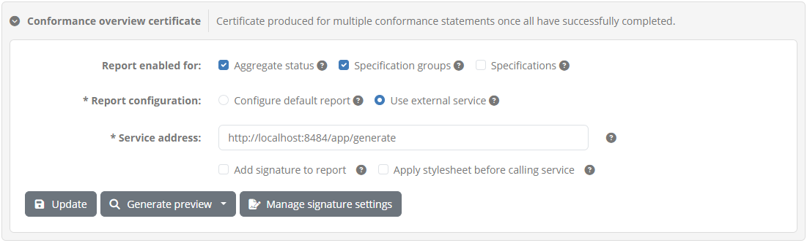

With this option enabled you are expected to configure an HTTP service that will:

* Receive from the Test Bed a ``POST`` request having as its body the relevant :ref:`conformance statement report <community__report_settings__statement_report>` in **XML format**.
* Respond with the produced PDF report.

Selecting this option presents you with a set of relevant inputs:

* The **service address** representing the endpoint to handle the report's generation.
* An option to **add a signature** to the produced report. You can skip this if you don't require signatures, or if the service itself adds a signature.
* An option to **apply a stylesheet before calling the service**. Doing so allows you to configure an XSLT stylesheet that will be applied to the default XML
  report before providing it to the configured service.

.. _community__report_settings__overview_certificate__signature:

Configure digital signatures
............................

To ensure the integrity and trust of your report you may also choose to include a **digital signature**. To manage your signature setting click on **Manage signature settings**
from the panel's footer.

Doing so will display a popup in which you can provide information on the certificate to be used for the signatures.

You are expected to provide here:

* The **keystore** file that includes the keypair (private and public key) that will be used. The keystore should contain **a single keypair**.
* The **keystore type**. Supported types are JCEKS, JKS and PKCS#12.
* The **keystore's password**, used to open and read the keystore's contents.
* The **key's password**, that is needed to use the private key when producing signatures.

.. note::
    **Use of a community keypair for signatures:** The reason you are expected to provide a keypair for signatures is because ultimately
    the responsibility for issuing and signing the report, as well as maintaining the validity of the relevant keypair lies within the community.

Once the certificate information is provided you may **Download** or **Delete** it's keystore. You may also validate your configuration to be certain
that the Test Bed can read the certificate by clicking the **Test settings** button. Clicking **Save** will persist your settings, whereas **Close** will hide the popup.

.. _community__report_settings__overview_certificate__review:

Preview your configuration
..........................

Once you have adjusted your settings you may preview them by clicking the **Generate preview** button. This will produce a certificate using sample values which,
in case you are using the default template, will be similar to the following example:

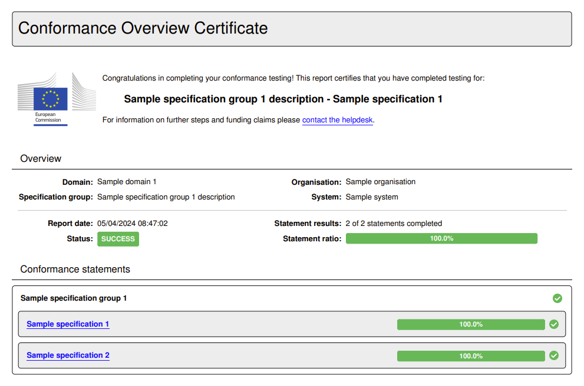

In case you chose to :ref:`delegate the report's generation to an external service <community__report_settings__overview_certificate__external>`, the preview also
serves as a test that the service is accessible and responds as expected. The service will be called with the sample data in XML form, and the resulting PDF report will
be downloaded. In case there is an error in the configuration or the service's processing, a popup with detailed information will be presented to help you troubleshoot
the issue.

.. _community__report_settings__statement_report:

Conformance statement report
++++++++++++++++++++++++++++

The **conformance statement report** is used to summarise the status of a given conformance statement. Available in XML and PDF, it is available to all users and for any
conformance statement status. The report's configuration settings are available in the **Conformance statement report** panel.

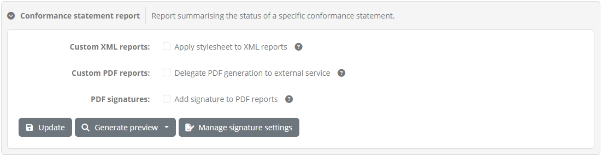

When producing an **XML report** this uses by default the `GITB Test Reporting Language (GITB TRL) <https://github.com/ISAITB/gitb-types/blob/master/gitb-types-specs/src/main/resources/schema/gitb_tr.xsd>`__
as the output format. If you prefer to use a different structure, you can check the **custom XML reports** option to provide an XSLT stylesheet.
This will be applied on the default XML data to produce the desired output.

When producing a **PDF report** the Test Bed's built-in template is used by default. If you want to customise the report, you can check
the **Custom PDF reports** option, in which case report generation will be delegated to an external service. In this case you will need to provide:

* The **service address** of the endpoint that will generate the reports. This is an HTTP endpoint that will receive a ``POST`` with the report
  data in XML, and is expected to return the resulting PDF.
* In case you chose to apply a **custom stylesheet** to XML reports, you can also choose whether the stylesheet should be applied to the XML
  data before posting it to the service.

Finally, regarding PDF reports you can also choose to include a **digital signature** to ensure your reports' integrity and trust. You can leave
the relevant option unchecked if you don't require signatures, or if you delegate to an external service that already signs the produced PDF reports.
If you have the Test Bed sign PDF reports you will need to also configure your :ref:`signature settings <community__report_settings__statement_report__signature>`.

.. _community__report_settings__statement_report__signature:

Configure digital signatures
............................

If you have selected to add digital signatures to PDF reports you will need to foresee a signing certificate. To manage this click on **Manage signature settings**
from the panel's footer.

Doing so will display a popup in which you can provide information on the certificate to be used for the signatures.

You are expected to provide here:

* The **keystore** file that includes the keypair (private and public key) that will be used. The keystore should contain **a single keypair**.
* The **keystore type**. Supported types are JCEKS, JKS and PKCS#12.
* The **keystore's password**, used to open and read the keystore's contents.
* The **key's password**, that is needed to use the private key when producing signatures.

.. note::
    **Use of a community keypair for signatures:** The reason you are expected to provide a keypair for signatures is because ultimately
    the responsibility for issuing and signing the report, as well as maintaining the validity of the relevant keypair lies within the community.

Once the certificate information is provided you may **Download** or **Delete** it's keystore. You may also validate your configuration to be certain
that the Test Bed can read the certificate by clicking the **Test settings** button. Clicking **Save** will persist your settings, whereas **Close** will hide the popup.

.. _community__report_settings__statement_report__preview:

Preview your configuration
..........................

Once you have adjusted your settings you may preview them by clicking the **Generate preview** button. You can preview both PDF and XML reports, and in both
cases produce reports with or without test case details.

When previewing your **XML report** settings, the produced report will be displayed in a popup allowing you to also **copy** and **download** it. If you have
configured a custom XSLT stylesheet this will also be applied to the preview.

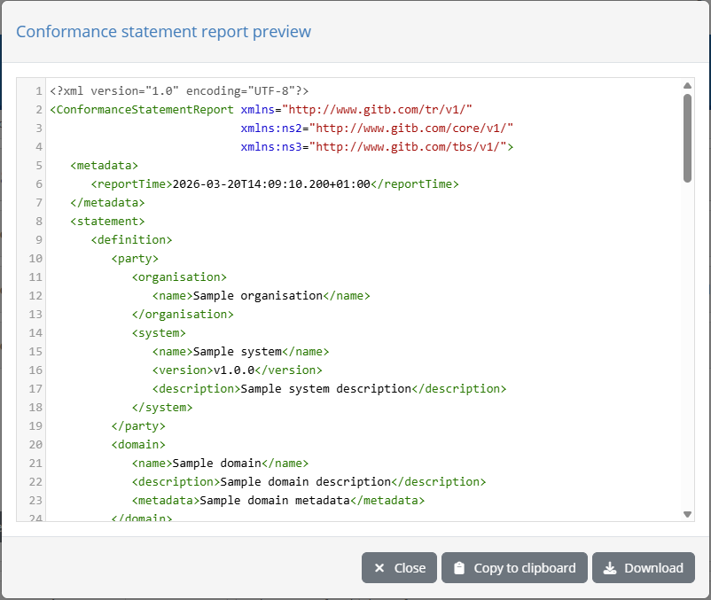

In the case of the **PDF report** settings, and assuming you are using the built-in template, the preview will be similar to the following example:

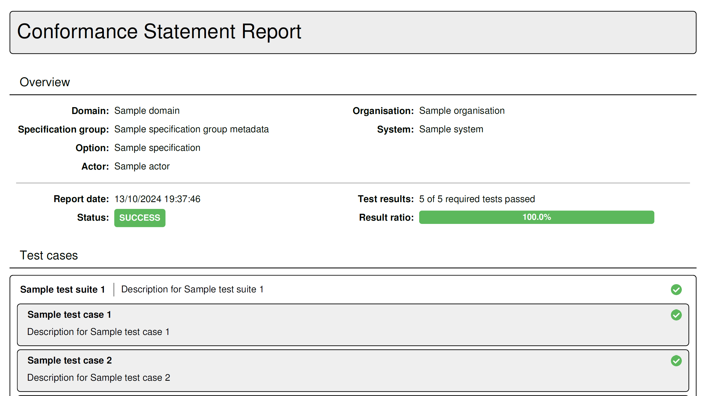

In case you chose to delegate the report's generation to an **external service**, the preview also serves as a test that the service is accessible and
responds as expected. The service will be called with the sample data in XML form, and the resulting PDF report will be downloaded. In case there is an
error in the configuration or the service's processing, a popup with detailed information will be presented to help you troubleshoot the issue.

.. _community__report_settings__overview_report:

Conformance overview report
+++++++++++++++++++++++++++

The **conformance overview report** is used to summarise the status of a set of related conformance statements. Available in XML and PDF, it is available to all users
and regardless of the status of the underlying conformance statements. The report's configuration settings are available in the
**Conformance overview report** panel.

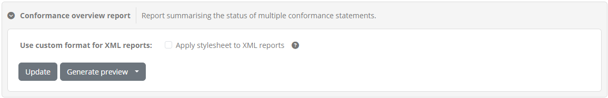

When producing an **XML report** this uses by default the `GITB Test Reporting Language (GITB TRL) <https://github.com/ISAITB/gitb-types/blob/master/gitb-types-specs/src/main/resources/schema/gitb_tr.xsd>`__
as the output format. If you prefer to use a different structure, you can check the **custom XML reports** option to provide an XSLT stylesheet.
This will be applied on the default XML data to produce the desired output.

When producing a **PDF report** the Test Bed's built-in template is used by default. If you want to customise the report, you can check
the **Custom PDF reports** option, in which case report generation will be delegated to an external service. In this case you will need to provide:

* The **service address** of the endpoint that will generate the reports. This is an HTTP endpoint that will receive a ``POST`` with the report
  data in XML, and is expected to return the resulting PDF.
* In case you chose to apply a **custom stylesheet** to XML reports, you can also choose whether the stylesheet should be applied to the XML
  data before posting it to the service.

Finally, regarding PDF reports you can also choose to include a **digital signature** to ensure your reports' integrity and trust. You can leave
the relevant option unchecked if you don't require signatures, or if you delegate to an external service that already signs the produced PDF reports.
If you have the Test Bed sign PDF reports you will need to also configure your :ref:`signature settings <community__report_settings__overview_report__signature>`.

.. _community__report_settings__overview_report__signature:

Configure digital signatures
............................

If you have selected to add digital signatures to PDF reports you will need to foresee a signing certificate. To manage this click on **Manage signature settings**
from the panel's footer.

Doing so will display a popup in which you can provide information on the certificate to be used for the signatures.

You are expected to provide here:

* The **keystore** file that includes the keypair (private and public key) that will be used. The keystore should contain **a single keypair**.
* The **keystore type**. Supported types are JCEKS, JKS and PKCS#12.
* The **keystore's password**, used to open and read the keystore's contents.
* The **key's password**, that is needed to use the private key when producing signatures.

.. note::
    **Use of a community keypair for signatures:** The reason you are expected to provide a keypair for signatures is because ultimately
    the responsibility for issuing and signing the report, as well as maintaining the validity of the relevant keypair lies within the community.

Once the certificate information is provided you may **Download** or **Delete** it's keystore. You may also validate your configuration to be certain
that the Test Bed can read the certificate by clicking the **Test settings** button. Clicking **Save** will persist your settings, whereas **Close** will hide the popup.

.. _community__report_settings__overview_report__preview:

Preview your configuration
..........................

Once you have adjusted your settings you may preview them by clicking the **Generate preview** button. You can preview both PDF and XML reports, and also
select the aggregation level at which you would want to produce the report at.

When previewing your **XML report** settings, the produced report will be displayed in a popup allowing you to also **copy** and **download** it. If you have
configured a custom XSLT stylesheet this will also be applied to the preview.

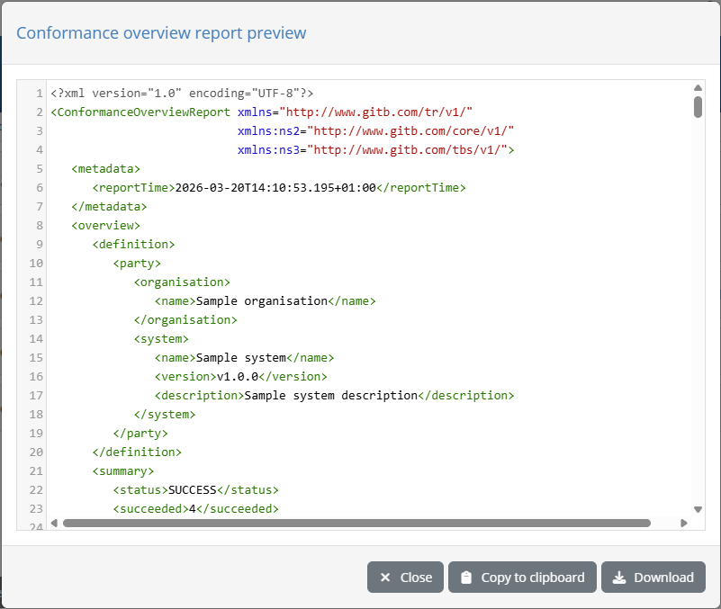

In the case of the **PDF report** settings, and assuming you are using the built-in template, the preview will be similar to the following example:

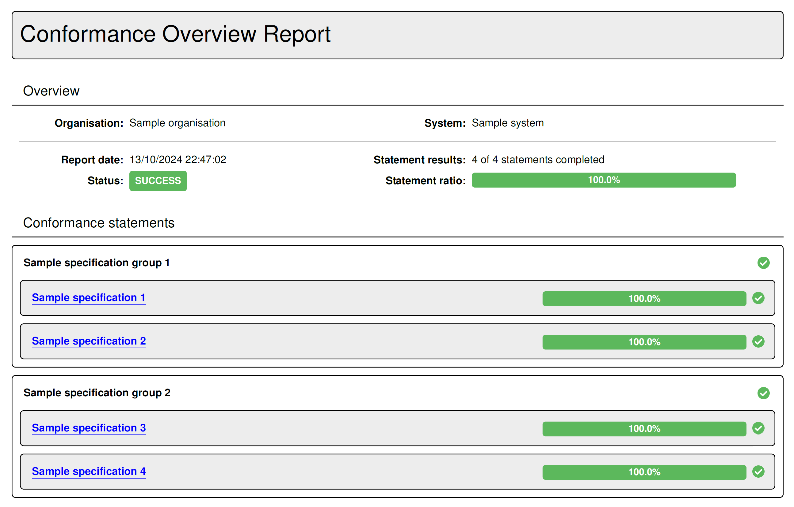

In case you chose to delegate the report's generation to an **external service**, the preview also serves as a test that the service is accessible and
responds as expected. The service will be called with the sample data in XML form, and the resulting PDF report will be downloaded. In case there is an
error in the configuration or the service's processing, a popup with detailed information will be presented to help you troubleshoot the issue.

.. _community__report_settings__test_case_report:

Test case report
++++++++++++++++

The **test case report** is used to summarise the result of a given test case's session and is available in XML and PDF formats.
The report's configuration settings are available in the **Test case report** panel.

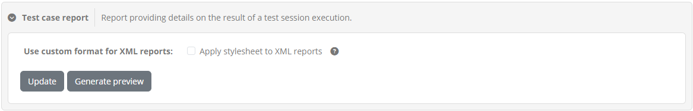

When producing an **XML report** this uses by default the `GITB Test Reporting Language (GITB TRL) <https://github.com/ISAITB/gitb-types/blob/master/gitb-types-specs/src/main/resources/schema/gitb_tr.xsd>`__
as the output format. If you prefer to use a different structure, you can check the **custom XML reports** option to provide an XSLT stylesheet.
This will be applied on the default XML data to produce the desired output.

When producing a **PDF report** the Test Bed's built-in template is used by default. If you want to customise the report, you can check
the **Custom PDF reports** option, in which case report generation will be delegated to an external service. In this case you will need to provide:

* The **service address** of the endpoint that will generate the reports. This is an HTTP endpoint that will receive a ``POST`` with the report
  data in XML, and is expected to return the resulting PDF.
* In case you chose to apply a **custom stylesheet** to XML reports, you can also choose whether the stylesheet should be applied to the XML
  data before posting it to the service.

Finally, regarding PDF reports you can also choose to include a **digital signature** to ensure your reports' integrity and trust. You can leave
the relevant option unchecked if you don't require signatures, or if you delegate to an external service that already signs the produced PDF reports.
If you have the Test Bed sign PDF reports you will need to also configure your :ref:`signature settings <community__report_settings__test_case_report__signature>`.

.. _community__report_settings__test_case_report__signature:

Configure digital signatures
............................

If you have selected to add digital signatures to PDF reports you will need to foresee a signing certificate. To manage this click on **Manage signature settings**
from the panel's footer.

Doing so will display a popup in which you can provide information on the certificate to be used for the signatures.

You are expected to provide here:

* The **keystore** file that includes the keypair (private and public key) that will be used. The keystore should contain **a single keypair**.
* The **keystore type**. Supported types are JCEKS, JKS and PKCS#12.
* The **keystore's password**, used to open and read the keystore's contents.
* The **key's password**, that is needed to use the private key when producing signatures.

.. note::
    **Use of a community keypair for signatures:** The reason you are expected to provide a keypair for signatures is because ultimately
    the responsibility for issuing and signing the report, as well as maintaining the validity of the relevant keypair lies within the community.

Once the certificate information is provided you may **Download** or **Delete** it's keystore. You may also validate your configuration to be certain
that the Test Bed can read the certificate by clicking the **Test settings** button. Clicking **Save** will persist your settings, whereas **Close** will hide the popup.

.. _community__report_settings__test_case_report__preview:

Preview your configuration
..........................

Once you have adjusted your settings you may preview them by clicking the **Generate preview** button. You can preview both PDF and XML reports.

When previewing your **XML report** settings, the produced report will be displayed in a popup allowing you to also **copy** and **download** it. If you have
configured a custom XSLT stylesheet this will also be applied to the preview.

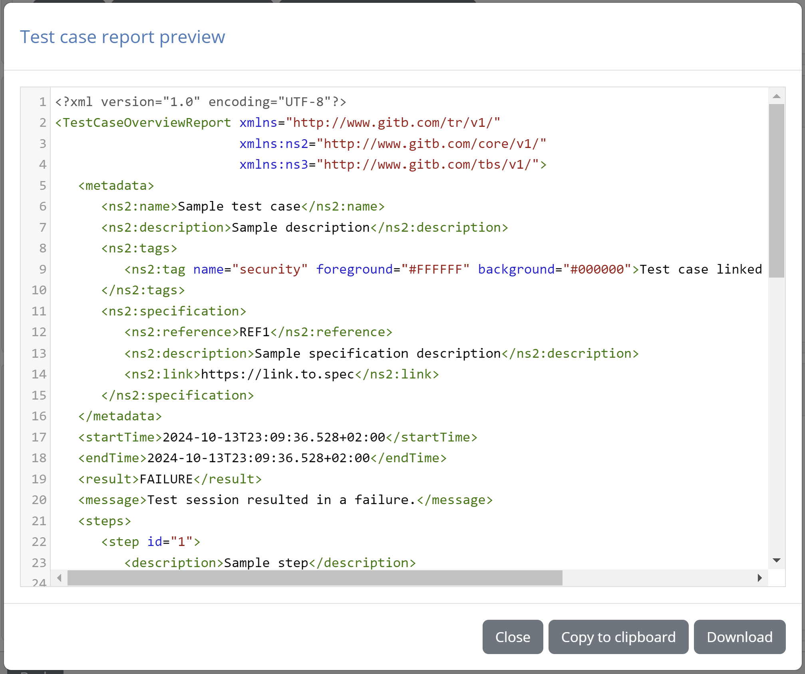

In the case of the **PDF report** settings, and assuming you are using the built-in template, the preview will be similar to the following example:

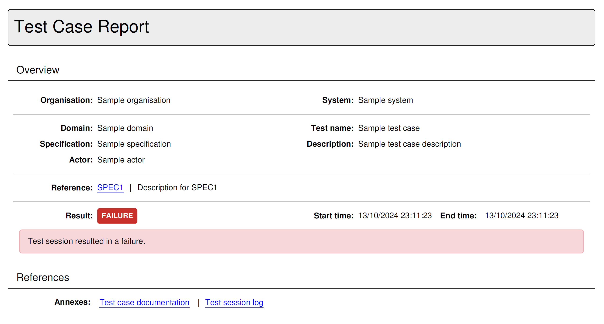

In case you chose to delegate the report's generation to an **external service**, the preview also serves as a test that the service is accessible and
responds as expected. The service will be called with the sample data in XML form, and the resulting PDF report will be downloaded. In case there is an
error in the configuration or the service's processing, a popup with detailed information will be presented to help you troubleshoot the issue.

.. _community__report_settings__test_step_report:

Test step report
++++++++++++++++

The **test step report** is used to summarise the result of a specific test session step and is available in XML and PDF formats.
The report's configuration settings are available in the **Test step report** panel.

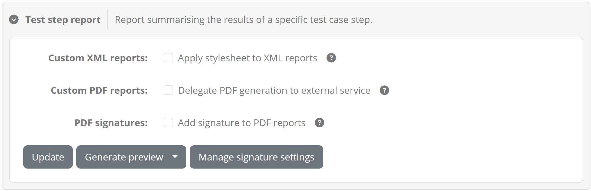

When producing an **XML report** this uses by default the `GITB Test Reporting Language (GITB TRL) <https://github.com/ISAITB/gitb-types/blob/master/gitb-types-specs/src/main/resources/schema/gitb_tr.xsd>`__
as the output format. If you prefer to use a different structure, you can check the **custom XML reports** option to provide an XSLT stylesheet.
This will be applied on the default XML data to produce the desired output.

When producing a **PDF report** the Test Bed's built-in template is used by default. If you want to customise the report, you can check
the **Custom PDF reports** option, in which case report generation will be delegated to an external service. In this case you will need to provide:

* The **service address** of the endpoint that will generate the reports. This is an HTTP endpoint that will receive a ``POST`` with the report
  data in XML, and is expected to return the resulting PDF.
* In case you chose to apply a **custom stylesheet** to XML reports, you can also choose whether the stylesheet should be applied to the XML
  data before posting it to the service.

Finally, regarding PDF reports you can also choose to include a **digital signature** to ensure your reports' integrity and trust. You can leave
the relevant option unchecked if you don't require signatures, or if you delegate to an external service that already signs the produced PDF reports.
If you have the Test Bed sign PDF reports you will need to also configure your :ref:`signature settings <community__report_settings__test_step_report__signature>`.

.. _community__report_settings__test_step_report__signature:

Configure digital signatures
............................

If you have selected to add digital signatures to PDF reports you will need to foresee a signing certificate. To manage this click on **Manage signature settings**
from the panel's footer.

Doing so will display a popup in which you can provide information on the certificate to be used for the signatures.

You are expected to provide here:

* The **keystore** file that includes the keypair (private and public key) that will be used. The keystore should contain **a single keypair**.
* The **keystore type**. Supported types are JCEKS, JKS and PKCS#12.
* The **keystore's password**, used to open and read the keystore's contents.
* The **key's password**, that is needed to use the private key when producing signatures.

.. note::
    **Use of a community keypair for signatures:** The reason you are expected to provide a keypair for signatures is because ultimately
    the responsibility for issuing and signing the report, as well as maintaining the validity of the relevant keypair lies within the community.

Once the certificate information is provided you may **Download** or **Delete** it's keystore. You may also validate your configuration to be certain
that the Test Bed can read the certificate by clicking the **Test settings** button. Clicking **Save** will persist your settings, whereas **Close** will hide the popup.

.. _community__report_settings__test_step_report__preview:

Preview your configuration
..........................

Once you have adjusted your settings you may preview them by clicking the **Generate preview** button. You can preview both PDF and XML reports.

When previewing your **XML report** settings, the produced report will be displayed in a popup allowing you to also **copy** and **download** it. If you have
configured a custom XSLT stylesheet this will also be applied to the preview.

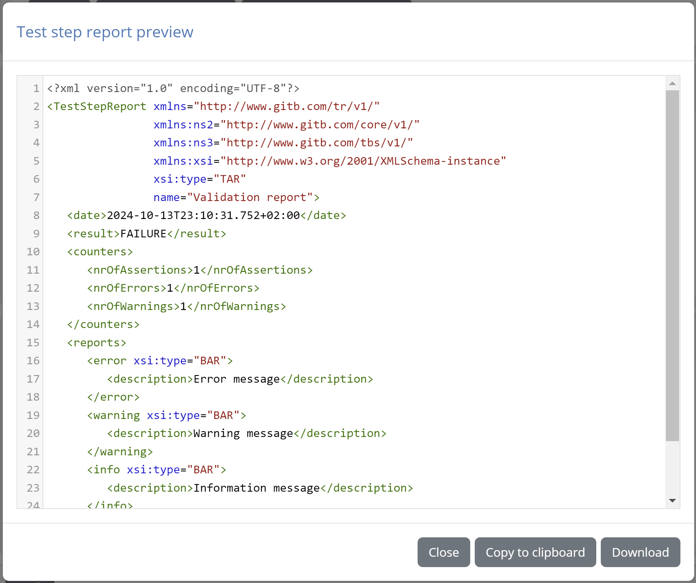

In the case of the **PDF report** settings, and assuming you are using the built-in template, the preview will be similar to the following example:

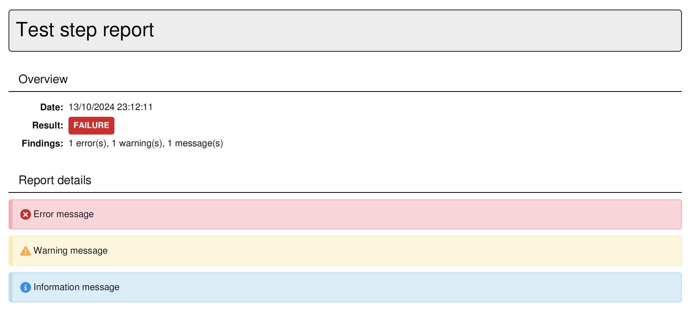

In case you chose to delegate the report's generation to an **external service**, the preview also serves as a test that the service is accessible and
responds as expected. The service will be called with the sample data in XML form, and the resulting PDF report will be downloaded. In case there is an
error in the configuration or the service's processing, a popup with detailed information will be presented to help you troubleshoot the issue.

.. _community__properties:

Edit custom member properties
~~~~~~~~~~~~~~~~~~~~~~~~~~~~~

As part of a community's configuration you can also define a set of **custom properties** for its organisations and their
systems. Such properties allow you to collect and record additional information for the organisations, extending the default, limited
information (names and versions).

The additional properties that you define can be used in numerous ways:

* As additional **data collection** for the community's members, collecting through the Test Bed information not
  necessarily linked to testing that you need for your reporting and follow-up.
* To facilitate **test configuration**. Any properties you define can be included as variables in test sessions. By defining such
  information at a level higher than conformance statements you can avoid replication of properties that are of a cross-cutting nature
  (e.g. a country code linked to an organisation).
* As additional **quality control** by restricting certain properties as being editable only by Test Bed or community administrators. Such properties
  can be considered as flags that you need to set before an organisation can engage in testing.
* For **data sharing**, allowing you to configure for your users certain information that they will subsequently be able to access.
* To **facilitate automation** via :ref:`webhooks<community__manage_triggers>` or external scripting, by allowing the management of certain properties by external processes that could be used to
  drive automation tasks linked to your conformance testing (e.g. automatically generate certificates for new organisations).

To manage the community's custom properties you start by clicking the **Edit custom member properties** button from the community
details panel.

Doing so transfers you to the custom property management screen where you see your currently defined custom properties split in
two tables:

* **Organisation-level properties** for properties applicable to organisations.
* **System-level properties** for properties applicable to systems.

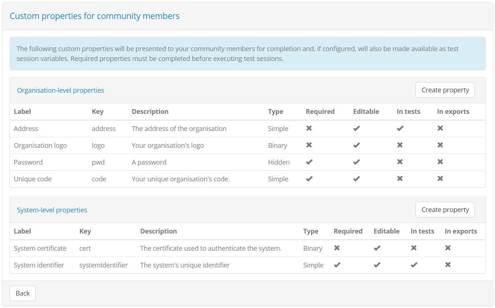

Regardless of the type of property, the information recorded and displayed is the same:

* **Label:** A text to be displayed to users as the label for the property.
* **Key:** A unique value for the property that will also be used as its variable name in test cases.
* **Type:** The type of the property. This can be **Simple** for text values, **Binary** for files or **Secret** for secret values.
* **Required:** Whether the property must be defined before executing test cases.
* **Editable:** Whether the property can be edited by organisation users. Otherwise this will be reserved to administrators.
* **In tests:** Whether the property is included as a variable in test sessions. If so the name of this variable is determined by the **key** value
  and is accessed through the **ORGANISATION** or **SYSTEM** map depending on the case (see the `GITB TDL documentation`_ for more details).
* **In exports:** Whether the property will be included in the PDF reports and CSV exports generated from administration dashboards (the
  :ref:`session dashboard<monitor_test_sessions>` and :ref:`conformance dashboard<monitor_conformance_status>`).
* **Hidden:** Whether the property apart from being editable only by administrators is also hidden from organisation users. Such properties could be very
  useful as control flags that are set by administrators, :ref:`webhooks<community__manage_triggers>` or external scripts before testing starts.

In the case of organisation-level properties there is an additional option **In registration** available. By checking this, the property
will also appear as part of the self-registration form for the community. You may also set this for non-editable properties,
meaning that these will be presented for input during self-registration, but will subsequently only be editable by administrators.

Including properties for input during self-registration is typically done for information you want to have users provide as early
as possible, and ideally as part of their initial organisation data. Through the community's **user permissions** you may also specify that
such properties, when defined additionally as required, are mandatory to complete the self-registration process.

Regarding a property's key, there are certain predefined values that cannot be used as these correspond to the default 
organisation's or system's information. The reserved keys per case are:

* For organisation properties values **shortName** and **fullName**.
* For system properties values **shortName**, **fullName** and **version**.

.. note::
  The screenshots that follow illustrate the management of organisation properties. The process and information is nonetheless
  identical for system properties.

.. _community__properties__create:

Create a property
+++++++++++++++++

Creating a new property is done by clicking the **Create property** button from the relevant table header.

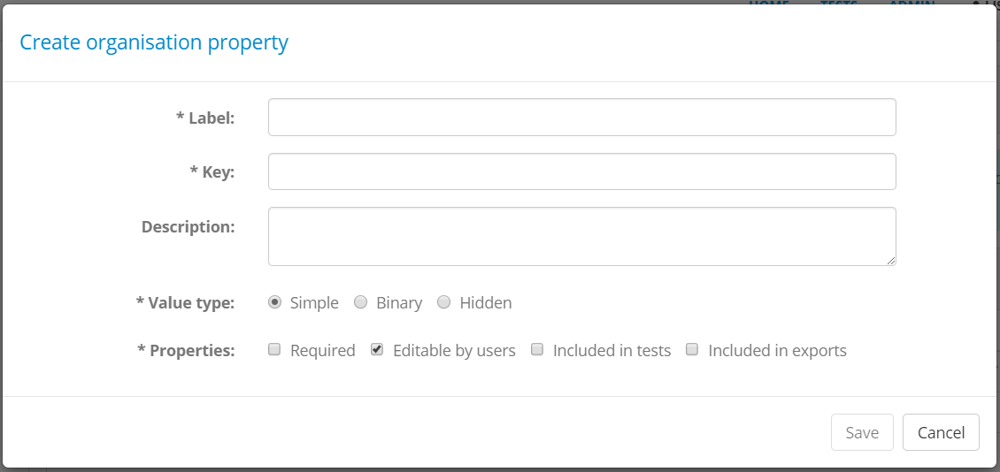

In the resulting popup you are prompted to provide the property's definition. The **description** of the property is an optional text that serves as a tooltip to assist
users in the property's completion. The **Preset values** apply to simple properties (i.e. text) and allow you to define a preset list of values for this property that
will appear as a dropdown selection list. For each such value you can define a user-friendly **label** and the property's actual **value**, using the provided controls
to **add** new values, **remove** existing ones or change their **display order**.

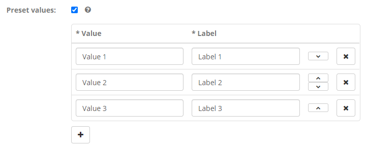

The **Depends on** field is optional and allows you to define a prerequisite condition for this property. To set such a prerequisite you need to select another property
from the provided list and specify to its left in the provided text field (or dropdown selection if the property has preset values) the value that it needs to have for the
current property to be enabled. A property that misses any of its prerequisite conditions (i.e. its direct prerequisite or a prerequisite's prerequisite) will
be considered inactive, even if set as required, and will be excluded from input forms and test sessions. Using such dependencies is a powerful mechanism to define conditional
inputs based on other properties or external processing (e.g. via :ref:`webhooks<community__manage_triggers>`).

.. note::
  Parameters of **binary** or **secret** type cannot be used as prerequisites.

The **Default value** input is available for simple text properties and represents the property's default value for
new organisations or systems. It will be presented as pre-entered (or pre-selected) when creating a new organisation or system,
and will apply automatically if the user does not explicitly override it.

In terms of their configuration, new properties are by default set to be **simple** (i.e. text values) and **editable by users**. If the property is set as being
**binary** or **secret** it will not be able to be included in exports. In addition, a property can only be defined as **hidden** if it is set at non-editable by users.

To create the property, complete the required information and click on **Save**. Clicking on **Cancel** will close the popup without any action.

.. _community__properties__edit:

Edit a property
+++++++++++++++

Editing an exiting property is done by clicking the property's row from its relevant table.

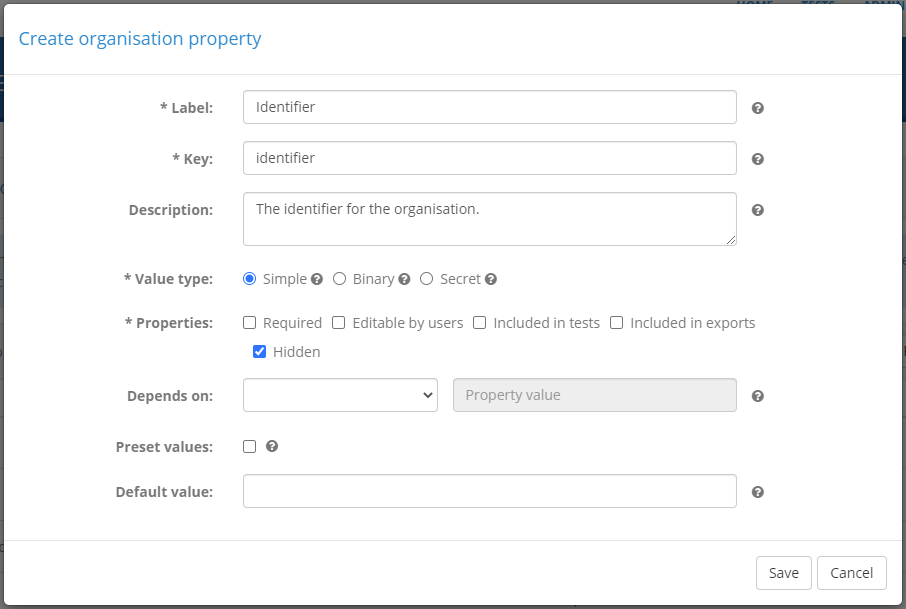

In the resulting popup you can view the property's current configuration and edit it according to your needs. Details on the meaning of properties, preset values, default values and
property dependencies are provided in the :ref:`create property<community__properties__create>` documentation.

To update the property's definition complete the required information and click on **Save**. Alternatively, clicking on **Delete** 
will, upon confirmation, delete the property as well as any existing values provided by the community's members. Finally, clicking
on **Cancel** will close the popup without any action.

.. _community__properties__ordering:

Change property ordering
++++++++++++++++++++++++

By default properties are ordered alphabetically based on their label. You may override this default ordering by reordering the properties as needed and saving their
relative positions. This is done through the table listing the properties, by using the **move** button at each row's right end to drag and drop each property to the desired position.

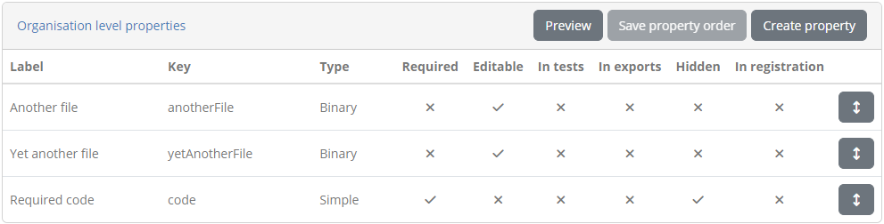

Once you have reordered properties in this way you will notice that the **Save property order** button becomes enabled. You will need to click this to confirm and persist the displayed ordering.

.. _community__properties__preview:

Preview property forms
++++++++++++++++++++++

Given the multiple options available to define custom properties (e.g. preset values, ordering, prerequisites, hidden properties) it is useful to double-check that your
setup matches your expectations. To help with this you may click the **Preview** button on each table's header to open up a sample form based on your current configuration.

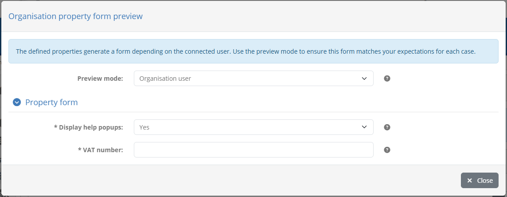

The displayed dialog offers a **Preview mode** selection with which you can adapt the preview based on the various available situations:

* **Organisation user:** Presents the form visible by organisation administrators once they are logged into the Test Bed.
* **Self-registration screen:** Presents the form that is displayed as part of the self-registration process (if enabled).
* **Community administrator:** Presents the form visible to community and Test Bed administrators.

In case the current configuration results in an empty form (e.g. all properties are set as hidden and the preview mode is set to "Organisation user") a relevant message
is displayed.

.. _community__labels:

Edit labels
~~~~~~~~~~~

A key step in designing a conformance testing strategy using the Test Bed is to make a mapping between its
:ref:`key concepts<introduction__glossary>` and the ones specific to a given community. Although the Test Bed's
concepts are flexible enough to address most needs the resulting mapping could result in terms being presented to
users that may not be intuitive.

As a means to further customise the Test Bed for a given community, community and Test Bed administrators are able to define
replacement labels for each concept. These replacements are displayed in all screens, reports and exports, both
for community members and administrators.

To define custom labels for a given community you start by clicking the **Edit labels** button from the community details
panel.

Doing so transfers you to the label management screen where you can review the labels currently considered, both default
and custom ones.

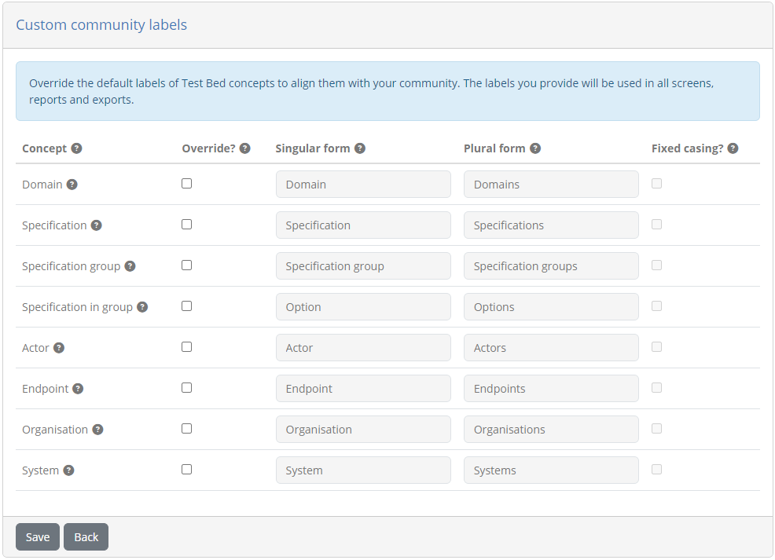

The concepts that can have custom labels defined are :ref:`domains<introduction__glossary__domain>`, :ref:`specifications<introduction__glossary__specification>`,
:ref:`actors<introduction__glossary__actor>`, :ref:`endpoints<introduction__glossary__endpoint>`, :ref:`organisations<introduction__glossary__organisation>`
and :ref:`systems<introduction__glossary__system>`. For each concept the following controls are provided:

* **Override:** Whether or not the given label should be set with a custom value. If not, the default values apply.
* **Singular form:** The label applied when referring to a single concept element. The default value, if not replaced, is displayed as readonly.
* **Plural form:** The label applied when referring to multiple concept elements. The default value, if not replaced, is displayed as readonly.
* **Fixed casing:** Whether the casing provided should be kept unchanged in all references. If not checked, labels will be lowercased when in
  the middle of sentences.

To provide a custom label check the **Override** checkbox and supply the desired labels. Once finished editing the labels, click on **Save**
to persist your changes or **Back** to discard them and return to the community details' page.

.. _GITB TDL documentation: https://www.itb.ec.europa.eu/docs/tdl/latest/expressions/index.html#referring-to-configuration-parameters
.. _GITB processing service API: https://www.itb.ec.europa.eu/docs/services/latest/processing/
.. _getModuleDefinition operation: https://www.itb.ec.europa.eu/docs/services/latest/processing/index.html#getmoduledefinition