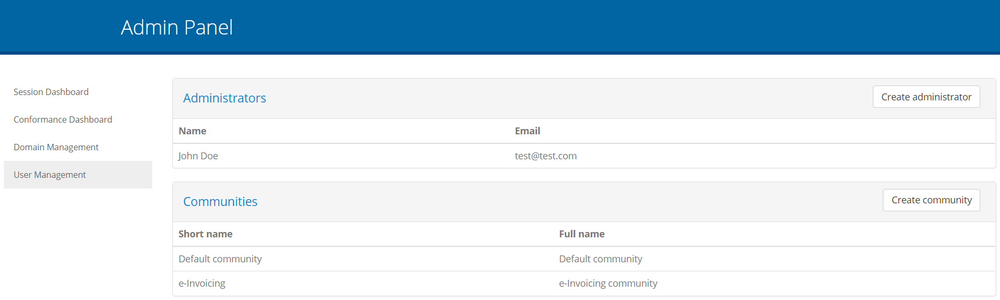
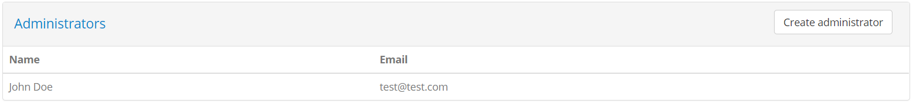
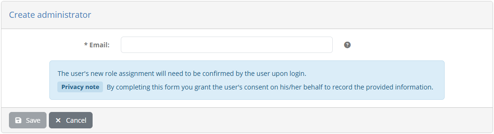
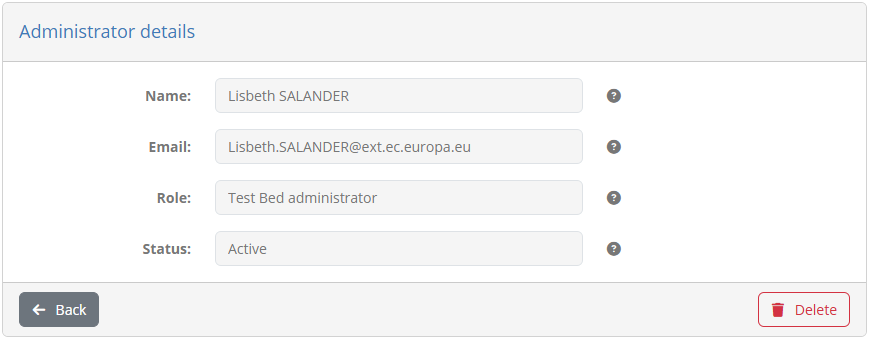
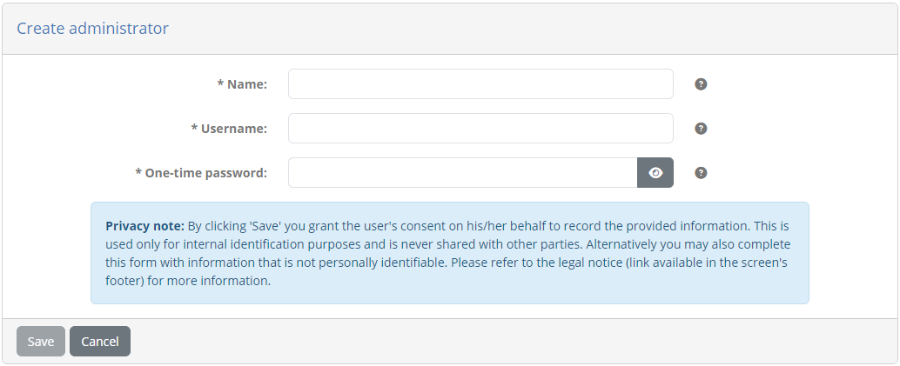
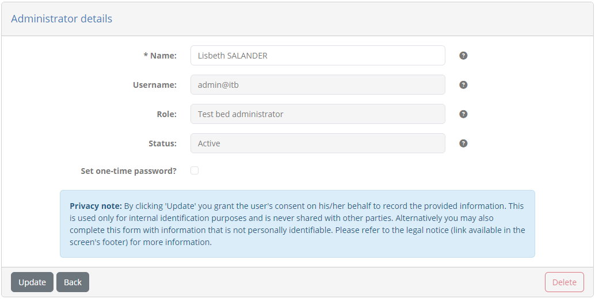
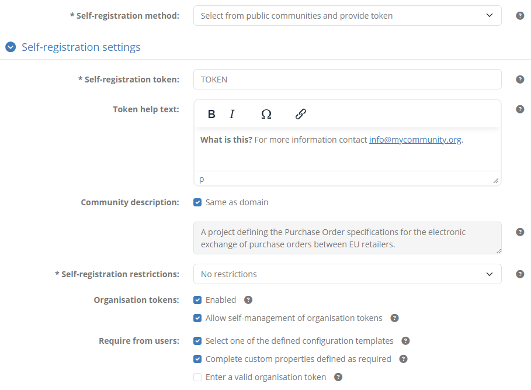
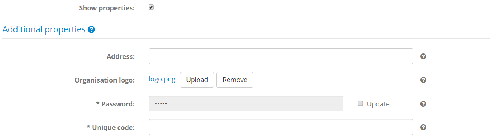
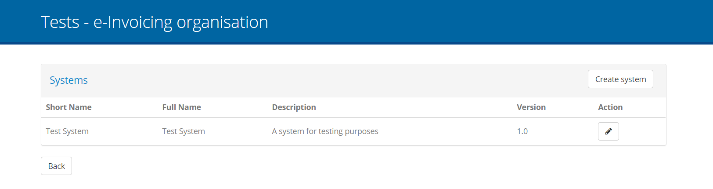
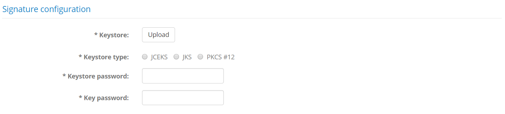

.. _community:

Manage test bed users
=====================

The **User Management** screen is the place where you can manage your test bed's communities, organisations and users. To access it click
the **ADMIN** link from the screen's header.

.. figure:: ../screenshots/header_admin.PNG
  :align: center

Doing so presents you with a left side menu containing links to administrative functions, of which you need to click 
the **User Management** link.

The screen is split in two sections:

* The **Administrators** section listing the currently defined test bed administrators, including yourself (see :ref:`community_testbed_administrators`).
* The **Communities** section listing the test bed's communities (see :ref:`community_testbed_communities`).

.. _community_testbed_administrators:

Manage test bed administrators
------------------------------

The **Administrators** section lists the test bed administrators in a table, with one row per administrator.

Test bed administrators are listed in a table with one row per user displaying the user's **name**, **email** address and **status**.

.. note::
  **User status:** A user's status is meaningful when the test bed is integrated with EU Login. A value of **Inactive** indicates
  a user that has not yet :ref:`confirmed a role assignment<login__roles__confirm>` whereas a value of **Not migrated** indicates
  a legacy account that has not been :ref:`migrated to EU Login<login__roles__migrate>`. In all other cases the user will be
  displayed as **Active**.

To create a new test bed administrator click on the **Create administrator** button from the table's header.
Clicking on an existing row from the table allows you to edit the relevant user's information.

The displayed screens and required information both when you edit or create a new administrator depends on whether or not the test bed
is integrated with EU Login.

Case: EU Login
~~~~~~~~~~~~~~

When creating an administrator you will be presented with a form to enter the user's information.

You are required to provide the **email** address of the user. This address needs to be the one that the user has linked to
her EU Login account. Once you have created the user you will see that a new entry is added to the list of test bed administrators
but for which there is no displayed name and the displayed status is **Inactive**. The name and status will be
updated once this user has :ref:`confirmed this role assignment<login__roles__confirm>`.

To finish creating the user click **Save**, otherwise click **Cancel** to close the dialog.

Editing an administrator's details displays her information as read-only.

The information presented here is the user's **name**, **email**, **role**, and **status**. From here you can delete the user
by clicking on **Delete** unless she is the only administrator configured for the community. Finally, clicking **Back**
will return you to the previous screen.

Case: No EU Login
~~~~~~~~~~~~~~~~~

When creating an administrator you will be presented with a form to enter the user's information.

In this form you are expected to provide the following information:

* The administrator's **name** (required), used in feedback submissions to the test bed.
* The **email** address (required), used to login. This is essentially a username formatted as an email address, and does not have to be a real functioning
  address as no emails are ever sent to it.
* The user's **password** that needs also to be **confirmed**. The entered password is a "one-time" password which will need to be changed by the user upon his/her next login.

To complete the creation of the new administrator click on **Save**. Clicking **Cancel** discards changes and returns you to the previous screen.

When editing a user you see a similar screen, this time prefilled with the user's information.

The information presented here is the user's **name**, **email**, **role**, and **status**, of which only the name is editable. To change the name
edit the existing value and click on **Update**, whereas to delete the user click on **Delete**. Note that if this user is the only administrator configured
for the test bed the **Delete** button is disabled. Finally, clicking **Back** will discard any pending changes and return you to the previous screen.

In this form you may also choose to reset the user's password. You can do this by checking the **Set one-time password** option which will display for you
additional input fields to provide and confirm the new password. The password you enter is considered a "one-time" password meaning that the user will be forced
to change it at his/her next login.

.. _community_testbed_communities:

Manage communities
------------------

The **Communities** section allows you to manage the test bed's communities. Existing communities are presented in a table with a row per
community.

.. figure:: ../screenshots/admin_community_communities.PNG
  :align: center

For each community the **short name** and **full name** is presented. From this section you can add a new community (see :ref:`community_testbed_communities__create`)
or edit an existing one (see :ref:`community_testbed_communities__manage`).

.. note::
    **The default community:** The list of communities always includes the **Default community** which is a special-purpose community corresponding to
    the overall test bed itself. This community allows management of organisations without a specific community and also elements such as landing pages
    and legal notices defined at test bed level. See :ref:`community__defaults__community` for more information.

.. _community_testbed_communities__create:

Create a community
~~~~~~~~~~~~~~~~~~

Creating a new community is done by clicking the **Create community** button from the **Communities** section header.

.. figure:: ../screenshots/admin_community_communities_header.PNG
  :align: center

Doing so presents you with a screen to input the community's basic information.

.. figure:: ../screenshots/admin_community_communities_create.PNG
  :align: center

The information you are expected to provide is:

* The **short name** for the community (required), used in list displays.
* Its **full name** (required), used in detail screens and reports.
* The **domain** it will be linked with (optional) defining the conformance statements its members can create.
* A **support email** address (optional), used to deliver feedback provided by the community's users.
* The preference on allowing **self-registration** for the community.
* The **user permissions** to apply for the community's organisation users.

More information on the domain, support email, self-registration settings and user permissions is provided in the :ref:`community details section<community_testbed_communities__manage>`.
Once the information is entered you complete the community creation by clicking **Save**. Clicking **Cancel** discards pending changes and returns you to
the previous screen.

.. _community_testbed_communities__manage:

Manage a community's details
----------------------------

To manage a community's details click its corresponding row from the **Communities** section.

.. figure:: ../screenshots/admin_community_communities.PNG
  :align: center

Doing so takes you to the community's detail screen that is split in six sections:

* The **Community detail** section presenting to you the information for the community.
* The **Community administrators** section allowing you to view and manage the community's administrators.
* The **Organisations** section in which you can view and manage the community's organisations.
* The **Landing pages** section listing the community-specific landing pages that can be used for the community's organisations.
* The **Legal notices** section listing the community-specific legal notices that can be displayed for the community's organisations.
* The **Error templates** section listing the community-specific error message templates used to display unexpected errors to community's organisations.
* The **Triggers** section listing the triggers used to automate processes upon specific events.

The **Community detail** section allows you to view and edit the community's basic information.

.. figure:: ../screenshots/admin_community_details_ta.PNG
  :align: center

The information you can edit in this form is:

* Your community's **short** and **full name** (required). These are visible to the test bed administrator and in certain user reports.
* The community's linked **domain** (optional), granting full access to it to community administrators.
* Your community's **support email** address (optional) to receive contact form submissions.
* Your preference on allowing **self-registration** for your community.
* The **user permissions** you foresee for the community's members.

Regarding the **domain**, it is typically the case that you would want to specify one for the community. Doing so delegates
full management of the domain's specifications and test suites to the community's administrator(s) and is critical if they are responsible
for their configuration and test suite development. In addition, linking the community to a specific domain hides other domains from the
community administrators and also the community's users when defining conformance statements (see :ref:`manage_your_conformance_statements__create`).
It effectively presents to the community a view over the test bed that is dedicated to their own testing needs. If no domain is linked to the community,
its administrators and users are presented with all available domains and specifications.

.. note::
    **Changing a community's domain:** Once a community has been linked to a domain its members can create conformance statements and execute relevant tests.
    After this point, if you change the domain linked to the community, the conformance testing history of its members will be rendered obsolete. Note that
    changing a community's domain after creation is possible to facilitate initial setup but is almost never needed once the initial setup is compete.

Regarding the **support email**, this is the address, typically a functional mailbox, where community users' feedback is sent via
the test bed's contact form (see :ref:`contact_support`). If this email address is configured, it will be used as the recipient of
submissions from the community's users, with the test bed team's functional mailbox (DIGIT-ITB@ec.europa.eu) added in CC. If not
configured, submissions will only be delivered to the test bed team's functional mailbox.

.. note::
    **When to configure a support email:** If this is a large user community expected to have frequent user interactions it is highly
    advised that it has its own support email. This is important since most questions would typically relate to the community's
    test cases and specifications rather than the test bed software itself. The test bed team will most likely not be able to answer 
    domain-specific questions and community users would experience unnecessary delays. On the other hand this could be unconfigured if
    testing activities for the community are limited, to benefit from the test bed's helpdesk without setting up one by the community.

Assuming a support email is defined, the contact form submission messages are formatted in HTML such as the following sample.

.. figure:: ../screenshots/contact_form_sample.PNG
  :align: center
  :scale: 70%

Received messages include the following information: 

* The user's **name**, **identifier** and **preferred contact address**.
* The related organisation's **identifier** and **name**, as well as your community's **identifier** and **name**.
* The **type** of the message and the **message** itself.
* Any **attachments** that the user has included.

The **self-registration method** is another point that merits further details. This setting determines whether users can themselves
:ref:`register new organisations<login__create_account>` in the community through the test bed's :ref:`welcome page<login__welcome>`.
The possible values for this are as follows:

* **Not supported:** Disables self-registration. By selecting this only you or a community administrator will be able to register
  organisations.
* **Select from public communities:** This will allow self-registration to all, effectively making the community a public one.
* **Select from public communities and provide token:** This will display the community as available for self-registration
  but will require the provision of an additional text token as a "community password".

Selecting any value other than **Not supported** will expand the community details' form to provide further configuration options under section **Self-registration settings**. These
are:

* **Self-registration token:** This is displayed if the third option is selected that requires a token being provided to complete the self-registration.
  The value you provide here is the "community password" that self-registration users will need to provide.
* **Token help text:** In case token-based self-registration is selected you can also use this to specify a short help text that will be displayed to users next
  to the token input. This can include simple formatting and hyperlinks to allow you to reference an email address or link to an online resource.
* **Description:** This is a descriptive text for the community that will accompany its display in the self-registration form as one of the available
  communities. The purpose of this is to provide a short summary of what this community offers to potential users. If the community is linked to a **domain**
  you have the option of replicating the description from the domain by checking the **Same as domain** checkbox. You may alternatively provide a different
  description if this is more suitable.
* **Self-registration notifications:** This option is available if the test bed supports email notifications and if the community defines a **support email**.
  Checking this will send a notification email to the configured support mailbox whenever there is a new registration.
* **Self-registration restrictions:** This allows you to select a means of restricting self-registration to ensure people and/or organisations enroll only once.
  The restrictions you can set are to not allow multiple registrations from the same user (based on her email address) or from the same email domain. Note
  that such restrictions are only supported if the test bed is integrated with EU Login that allows the test bed to be aware of users' actual email addresses.
* **Require from users:** These are requirements that you want to enforce to users completing the self-registration process. You have two options here, the first
  one being to force the selection of a :ref:`configuration template<community__create_organisation>` and the second one to require the completion of
  :ref:`custom properties<community__properties>` marked as required (which are otherwise displayed as required but are not blocking).

.. note::
  **Organisation templates:** If you choose to enable self-registration for the community you may also find interesting the
  possibility to :ref:`define preconfigured templates for organisations<community__create_organisation>`.

Finally, the **user permissions** section allows you to customise the permissions available to the community's members. Through the provided options you can allow user to:

* **Download conformance certificates**. If not allowed, only community administrators may generate such certificates from the :ref:`conformance dashboard<monitor_conformance_status__statements__export_statement>` or a :ref:`conformance statement detail page<manage_your_conformance_statements__view_a_conformance_statements_details__export_certificate>`.
* **Create or delete systems**. Note that editing a system and its custom properties (if defined) is always possible for organisation administrators.
* **Create or delete conformance statements**.

.. note::
  **When to set user permissions:** You would restrict user permissions in the community if you want to make sure that only you and community administrators can manage systems and conformance statements.
  This also works well when you have enabled self-registration and require the selection of a :ref:`configuration template<community__create_organisation>`. This way you ensure
  only predefined and non-editable conformance testing setups for your users.

To persist any changes you have made in the community detail form click the **Save changes** button. Clicking the **Back** button will discard any pending changes and
return to the previous screen. The **Delete** button will, following confirmation, delete the complete community and all its dependent information.
In terms of additional features available here:

* The **Edit conformance certificate settings** button is addressed in section :ref:`community__conformance_certificate_settings`.
* The **Edit custom member properties** button is addressed in section :ref:`community__properties`.
* The **Edit labels** button is addressed in section :ref:`community__labels`.

.. note::

    **Default community:** The **Delete** button is hidden for the test bed's **Default community** as it cannot be deleted.
    See :ref:`community__defaults__community` for more information.

.. _community__administrators:

Manage community administrators
~~~~~~~~~~~~~~~~~~~~~~~~~~~~~~~

.. note::
    **Default community:** This section is not displayed in case you are viewing the details of the test bed's **Default community**.
    See :ref:`community__defaults__community` for more information.

The **Community administrators** section displays the users that are capable of managing the community.

.. figure:: ../screenshots/admin_community_administrators.PNG
  :align: center

Community administrators are listed in a table with one row per user displaying the user's **name**, **email** address and **status**.

.. note::
  **User status:** A user's status is meaningful when the test bed is integrated with EU Login. A value of **Inactive** indicates
  a user that has not yet :ref:`confirmed a role assignment<login__roles__confirm>` whereas a value of **Not migrated** indicates
  a legacy account that has not been :ref:`migrated to EU Login<login__roles__migrate>`. In all other cases the user will be
  displayed as **Active**.

To create a new community administrator click on the **Create community administrator** button from the table's header.
Clicking on an existing row from the table allows you to edit the relevant user's information.

The displayed screens and required information both when you edit or create a new administrator depends on whether or not the test bed
is integrated with EU Login.

Case: EU Login
++++++++++++++

When creating an administrator you will be presented with a form to enter the user's information.

.. figure:: ../screenshots/admin_community_administrators_create_eulogin.PNG
  :align: center

You are required to provide the **email** address of the user. This address needs to be the one that the user has linked to
her EU Login account. Once you have created the user you will see that a new entry is added to the list of community administrators
but for which there is no displayed name and the displayed status is **Inactive**. The name and status will be
updated once this user has :ref:`confirmed this role assignment<login__roles__confirm>`.

To finish creating the user click **Save**, otherwise click **Cancel** to close the dialog.

Editing an administrator's details displays her information as read-only.

.. figure:: ../screenshots/admin_community_administrators_edit_eulogin.PNG
  :align: center

The information presented here is the user's **name**, **email**, **role**, and **status**. From here you can delete the user
by clicking on **Delete** unless she is the only administrator configured for the community. Finally, clicking **Back**
will return you to the previous screen.

Case: No EU Login
+++++++++++++++++

When creating an administrator you will be presented with a form to enter the user's information.

.. figure:: ../screenshots/admin_community_administrators_create.PNG
  :align: center

In this form you are expected to provide the following information:

* The administrator's **name** (required), used in feedback submissions to the test bed.
* The **email** address (required), used to login. This is essentially a username formatted as an email address, and does not have to be a real functioning
  address as no emails are ever sent to it.
* The user's **password** that needs also to be **confirmed**. The entered password is a "one-time" password which will need to be changed by the user upon his/her next login.

To complete the creation of the new administrator click on **Save**. Clicking **Cancel** discards changes and returns you to the previous screen.

When editing a user you see a similar screen, this time prefilled with the user's information.

.. figure:: ../screenshots/admin_community_administrators_edit.PNG
  :align: center

The information presented here is the user's **name**, **email**, **role**, and **status**, of which only the name is editable. To change the name
edit the existing value and click on **Update**, whereas to delete the user click on **Delete**. Note that if this user is the only administrator configured
for the community the **Delete** button is disabled. Finally, clicking **Back** will discard any pending changes and return you to the previous screen.

In this form you may also choose to reset the user's password. You can do this by checking the **Set one-time password** option which will display for you
additional input fields to provide and confirm the new password. The password you enter is considered a "one-time" password meaning that the user will be forced
to change it at his/her next login.

.. _community__organisations:

Manage organisations
~~~~~~~~~~~~~~~~~~~~

The **Organisations** section presents to you the organisations that are defined as members of the community. These are displayed in a table with one
row per organisation, displaying for each organisation its **short** and **full name**.

.. figure:: ../screenshots/admin_community_organisations.PNG
  :align: center

Clicking on **Create organisation** allows you to add a new organisation (see :ref:`community__create_organisation`), whereas clicking on the row of an
existing organisation allows you to edit its details (see :ref:`community__manage_organisation`).

.. _community__create_organisation:

Create an organisation
++++++++++++++++++++++

To create a new organisation click on the **Create organisation** button from the section's header.

.. figure:: ../screenshots/admin_community_organisations_header.PNG
  :align: center

Doing so presents you with the screen to enter the new organisation's details.

.. figure:: ../screenshots/admin_community_organisations_create.PNG
  :align: center

In this screen you are expected to enter the following information for the organisation:

* Its **short name** (required), used in list displays.
* Its **full name** (required), used in detail screens and reports.
* Its **landing page** (optional), presented to its users upon login.
* Its **legal notice** (optional), presented to its users when they click the **Legal notice** link from the screen footer.
* Its **error template** (optional), used to format unexpected errors presented to its users.
* Whether it should be **published as a template** (optional), as an option during self-registration if enabled for your community.
  Checking this will also prompt you for a **template name** to display to users.

Regarding the landing page, legal notice and error template, these are presented as a choice of the ones defined for the community
(see :ref:`community__manage_landing_pages`, :ref:`community__manage_legal_notices` and :ref:`community__manage_error_templates` respectively). If no selection
is made then the default settings for the community are used, falling back to the test bed's overall defaults if none
are defined for the community. Defining these at the level of the organisation allows you to present
customised messages and content per organisation and is left fully at your discretion as administrator.

If the community includes other organisations you are also presented here with an option to **copy the test setup** from
one of them as a source. Selecting one will replicate the selected organisation's systems and conformance statements for the
new organisation.

.. figure:: ../screenshots/admin_community_organisations_create_copy.PNG
  :align: center
  :scale: 70%

Once another organisation is selected to copy from, you are also presented with additional options to include:

* **Organisation properties:** To also copy any additional organisation-level properties that the source organisation defines.
* **System properties:** To also copy any additional system-level properties for replicated systems.
* **Conformance statement configurations:** To also copy any of the source organisation's configuration parameters set on its
  systems' conformance statements.

If additional organisation properties are foreseen, and as long as you are not copying the properties from another organisation,
you will also see a **Show properties** checkbox. Checking this you can manage the organisation's properties.

.. figure:: ../screenshots/admin_community_organisations_create_properties.PNG
  :align: center

Configured properties can be simple texts, secret values (e.g. passwords) or files for which, if supplied by you, you will also
see a help tooltip to understand their meaning. Such properties can be edited as follows:

* For texts through an editable text field or dropdown select (for preset values).
* For files using the **Upload** button. Once one is selected you can download it by clicking on its link, or delete it by 
  clicking **Remove**.
* For secrets a read-only text field indicates whether a value is currently set. Provide a new value by checking
  **Update** which makes the text field editable. While editing you can also toggle the display of typed characters.

.. note::
  Required properties are marked with an asterisk. It is is not mandatory to fill these in when providing the organisation's
  information but as long as required properties are missing it will not be able to launch tests.

To complete the creation of the new organisation click **Save**. Clicking on **Cancel** discards pending changes and returns you to the previous screen.

.. note::
    **Defining a template organisation:** Using the **Copy test setup** option you could define a special purpose organisation that is configured in terms
    of its systems and conformance statements as you would expect all the community's organisations to be. This can be especially beneficial in cases where organisations
    will be expected to define multiple systems (e.g. "Development", "Integration", "Acceptance") or where the community's domain has numerous individual specifications. Using this
    approach enhances consistency and greatly reduces configuration effort.

    In addition, such templates can also be made publicly available to users during self-registration through the **Publish as template** option.

.. _community__manage_organisation:

Manage an organisation's details
++++++++++++++++++++++++++++++++

To manage an organisation's details click its corresponding row from the **Organisations** table displayed in the community details screen.

.. figure:: ../screenshots/admin_community_organisations.PNG
  :align: center

Doing so presents you with the organisation details page that is split in two sections:

* The **Organisation details** section, displaying the organisation's information and allowing it to be edited.
* The **Users** section, displaying the list of users for the organisation (see :ref:`community__manage_organisation__users`).

The **Organisation details** section displays the organisation's information in an editable form in which you can modify its **short name**, **full name**,
**landing page**, **legal notice** and **error template**. You can also adapt whether or not this organisation will be listed during
self-registration as a **published template**.

.. figure:: ../screenshots/admin_community_organisations_organisation_detail.PNG
  :align: center

If the community includes other organisations you are also presented here with an option to **copy the test setup** from
one of them as a source. Selecting one will replicate the selected organisation's systems and conformance statements for the
new organisation. Note that in doing so the systems and conformance statements already defined will be removed.

.. figure:: ../screenshots/admin_community_organisations_create_copy.PNG
  :align: center
  :scale: 70%

Once another organisation is selected to copy from, you are also presented with additional options to include:

* **Organisation properties:** To also copy any additional organisation-level properties that the source organisation defines.
* **System properties:** To also copy any additional system-level properties for replicated systems.
* **Conformance statement configurations:** To also copy any of the source organisation's configuration parameters set on its
  systems' conformance statements.

If additional organisation properties are foreseen, and as long as you are not copying the properties from another organisation,
you will also see a **Show properties** checkbox. Checking this you can manage the organisation's properties.

Configured properties can be simple texts, secret values (e.g. passwords) or files for which, if supplied by you, you will also see
a help tooltip to understand their meaning. Such properties can be managed as follows:

* For texts the current value is presented in an editable text field or dropdown select (in case of preset values).
* For files the **Upload** button is used to select a new file, whereas if one is already set you can download it
  by clicking on its link, or delete it by clicking **Remove**.
* For secrets a read-only text field indicates whether a value is currently set, whereas to provide a new value you
  check **Update**. When providing a new value you can also toggle the display of the typed characters.

.. note::
  Required properties are marked with an asterisk. It is is not mandatory to fill these in when providing the organisation's
  information but as long as required properties are missing it will not be able to launch tests.

To change the organisation's information edit the displayed values and click the **Update** button. The organisation can also
be deleted from here by clicking the **Delete** button. Doing so will, following confirmation, delete the organisation and its dependent information (e.g. users). The 
**Back** button will discard any pending changes and return you back to the previous screen. Finally, the **Manage tests** button allows you to manage the
organisation's test configuration (see :ref:`community__manage_organisation__tests`).

.. _community__manage_organisation__tests:

Manage the organisation's tests
...............................

An interesting option available from the organisation's detail screen is the **Manage tests** button. This allows you to configure the organisation's test setup,
including its systems (see :ref:`manage_your_systems`) and conformance statements (see :ref:`manage_your_conformance_statements`). You can even proceed to 
complete a system's configuration parameters used in test cases (see :ref:`execute_tests__provide_your_systems_configuration`) and also execute tests on behalf of
the organisation (see :ref:`execute_tests`). When you click the **Manage tests** button you will be directly taken to the organisation's system management screen.

When on this screen you are effectively taking on the role of an administrator for the organisation, with the screen being displayed matching exactly what 
such a user would see if he/she clicked the **TESTS** button from the screen header. To avoid confusion between this screen and the one you can access for
your own special-purpose test organisation (see :ref:`validate_test_setup`), the banner displays the name of the selected organisation.

.. figure:: ../screenshots/admin_community_organisations_organisation_manage_banner.PNG
  :align: center

In addition, the system management screen now also presents a **Back** button that will bring you back to the organisation's detail screen. If you proceed to manage
the organisation's setup in further screens you can always return where you were through this **Back** button.

.. note::
    **Managing your organisations' test setup on their behalf** 

    Using the **Manage Tests** button allows you to fully complete an organisation's test setup on their behalf. This is an alternative to the organisations'
    administrators doing this themselves (see :ref:`manage_your_conformance_statements`). The selected approach depends on the needs of the organisations' community.
    
    If the community defines multiple specifications and its organisations are to fully take charge over what they want to conform to then the best approach would be
    to avoid using the **Manage tests** feature and let organisation administrators manage their own setup. On the other hand if the community has more simple
    needs, it could be beneficial to define only non-administrator users for its organisations and configure on their behalf their system(s) and conformance
    statement(s). Simple cases with only a single system and conformance statement per organisation would allow users to login, click on **TESTS** from the 
    screen header and immediately start testing.

.. _community__manage_organisation__users:

Manage the organisation's users
...............................

Management of the organisation's users is done through the **Users** section of the organisation's detail screen.

.. figure:: ../screenshots/admin_community_organisations_organisation_users.PNG
  :align: center

This section lists the currently defined users in a table, with one row per user, displaying for each one his/her **name**, **email**, **role** and **status**.

.. note::
  **User status:** A user's status is meaningful when the test bed is integrated with EU Login. A value of **Inactive** indicates
  a user that has not yet :ref:`confirmed a role assignment<login__roles__confirm>` whereas a value of **Not migrated** indicates
  a legacy account that has not been :ref:`migrated to EU Login<login__roles__migrate>`. In all other cases the user will be
  displayed as **Active**.

To create a new user for the organisation click on the **Create user** button from the table's header.
Clicking on an existing row from the table allows you to edit the relevant user's information.

The displayed screens and required information both when you edit or create a new user depends on whether or not the test bed
is integrated with EU Login.

Case: EU Login
##############

When creating a user you will be presented with a form to enter her information.

.. figure:: ../screenshots/admin_community_organisations_organisation_users_create_eulogin.PNG
  :align: center

You are required to provide the **email** address and **role** of the user. The email address needs to be the one that the user has
linked to her EU Login account. The role can either be "Administrator" or "User". Recall that the "User" role can execute and follow
up on tests, whereas the "Administrator" role can additionally manage the organisation's configuration (e.g. properties, systems and
conformance statements) and add other users.

Once you have created the user you will see that a new entry is added to the list of users
but for which there is no displayed name and the displayed status is **Inactive**. The name and status will be
updated once this user has :ref:`confirmed this role assignment<login__roles__confirm>`. To finish creating the user click **Save**,
otherwise click **Cancel** to close the dialog.

Editing a user's details displays her information as read-only.

.. figure:: ../screenshots/admin_community_organisations_organisation_users_edit_eulogin.PNG
  :align: center

The information presented here is the user's **name**, **email**, **role**, **status** and **organisation**. From here you can change
the user's role and click on **Update** to save your change. Alternatively you can delete, upon confirmation, the user by clicking
on **Delete** or click **Back** to cancel and return to the previous screen.

Case: No EU Login
#################

When creating a user you will be presented with a form to enter the user's information.

.. figure:: ../screenshots/admin_community_organisations_organisation_users_create.PNG
  :align: center

The resulting screen provides you with a form to enter the following information for the new user:

* The user's **name** (required), used when contacting the support team.
* The **email** address (required), used by the user to login. Note that this should be considered as a username formatted as an email, and does not
  need to be a functioning address as no messages will be sent to it.
* The user's **role** (required), either "Administrator" or "User". Recall that the "User" role can execute and follow up on tests, whereas the "Administrator"
  role can additionally manage the organisation's test configuration (e.g. systems and conformance statements) and add other users.
* The user's **password** and the password **confirmation**. The entered password is considered a "one-time" password that the user will need to change upon his/her next login.

To complete the creation of the user click the **Save** button. Clicking on **Cancel** will discard pending changes and return to the previous screen.

When editing a user you see a similar screen, this time prefilled with the user's information.

.. figure:: ../screenshots/admin_community_organisations_organisation_users_edit.PNG
  :align: center

The information displayed is the user's **name**, **email**, **role**, **status** and **organisation**, of which only the **name** and **role** can
be edited. You may also check the **Set one-time password** option to provide a new password for your user (to be changed on his/her next login). Clicking 
on **Update** saves your changes whereas clicking on **Back** discards them and returns you to the previous screen. The **Delete** 
button will, following confirmation, delete the current user.

.. _community__manage_landing_pages:

Manage community-specific landing pages
~~~~~~~~~~~~~~~~~~~~~~~~~~~~~~~~~~~~~~~

A **landing page** is the home page displayed to the community's users when they log into the test bed. Its purpose is to welcome users providing them context
on the use of the test bed and potentially including a customised message. Moreover, this customised message can even be set at the level of specific organisations
if you choose to do so (see :ref:`community__organisations`).

The landing pages available for the community are listed in the **Landing pages** section. These are presented in a table with one row per landing page,
displaying for each its **name**, **description** and indication on whether it is considered as the **default**.

.. figure:: ../screenshots/admin_community_landing_pages.PNG
  :align: center

The landing page marked as default is the one that applies to all organisations in the community that don't have another, more specific one configured. If no
landing page is defined then the one that applies to the test bed as a whole is automatically used (see :ref:`community__defaults__landing_page`). Note the
community's default landing page is what the community's administrator(s) also view upon login.

Adding a new landing page can be done in one of the following ways:

* You can create a new landing page from scratch by clicking the **Create landing page** button.
* You can copy the test bed's default landing page by clicking the **Copy Test Bed landing page** button.
* You can copy one of the community's existing landing pages while editing its details.

.. note::
    **Default community:** In case you are viewing the details of the test bed's **Default community** no **Copy Test Bed landing page** button is presented. This
    is because the default landing page defined for this is actually considered the test bed's default. See :ref:`community__defaults__landing_page` for more information.

Create landing page
+++++++++++++++++++

When creating a new landing page you are presented with a form to enter its information.

.. figure:: ../screenshots/admin_community_landing_pages_create.PNG
  :align: center

If you are creating a landing page from scratch (i.e. you have clicked the **Create landing page** button), this form will be empty. Alternatively,
if the landing page is being created as a copy of an existing one (either the test bed's default landing page or another one defined for the community), the
form will be prefilled. The information you are expected to complete for the landing page is:

* Its **name** (required), used in the list of landing pages and when selecting one for an organisation.
* Its **description** (optional), presented to test bed and community administrators.
* Whether or not it should be the **default** landing page for the community (default is "false").
* The landing page **content**, provided through a rich text editor, allowing you to add styled text, lists, images and links.

When you have provided the required information you can complete the landing page creation by clicking **Save**. Note that if you have set this as the 
new default landing page for the community you will also be prompted for confirmation considering that this will be immediately visible to all its
users. Clicking on the **Cancel** button will discard pending changes and return to the previous screen.

Edit landing page
+++++++++++++++++

To edit an existing landing page click its corresponding row from the **Landing pages** table.

.. figure:: ../screenshots/admin_community_landing_pages.PNG
  :align: center

Doing so will take you to a screen where the landing page's information is displayed in editable form fields.

.. figure:: ../screenshots/admin_community_landing_pages_edit.PNG
  :align: center

In this screen you can change the landing page's **name**, **description**, **default** setting and **content**. Note that if the landing page is currently
the default, this can't be unset. To switch defaults you would need to edit or create another landing page and at that time set it as the new default.
This is done to avoid misconfiguration where you could end up with no default landing page for the community.

To persist any changes click on the **Update** button or discard them clicking on the **Back** button. The **Delete** button will, following confirmation,
remove the landing page. Finally, the **Copy** button allows you to make a copy of this landing page, by taking you to the landing page creation screen prefilled
with the current landing page's information. This can be useful if you want to create minor variations of a default landing page for certain organisations.

.. _community__manage_legal_notices:

Manage community-specific legal notices
~~~~~~~~~~~~~~~~~~~~~~~~~~~~~~~~~~~~~~~

A **legal notice** is an arbitrary text that can be presented to the community's users when they click on the **Legal notice** link from the screen footer.
The purpose of this is to define terms and conditions, notices and disclaimers that you want to make known to the community.

You may define a default legal notice that applies to the entire community or even specific legal notices for one or more organisations.
The legal notices available for the community are listed in the **Legal notices** section. These are presented in a table with one row per notice,
displaying for each its **name**, **description** and indication on whether it is considered as the **default**.

.. figure:: ../screenshots/admin_community_legal_notices.PNG
  :align: center

The legal notice marked as default is the one that applies to all organisations in the community that don't have another, more specific one configured. If no
legal notice is defined then the one that applies to the test bed as a whole is automatically used (see :ref:`community__defaults__landing_page`). Note that
the community's administrator(s) can also view the community's default legal notice when they click the relevant link from the screen footer.

Adding a new legal notice can be done in one of the following ways:

* You can create a new legal notice from scratch by clicking the **Create legal notice** button.
* You can copy the test bed's default legal notice by clicking the **Copy Test Bed legal notice** button.
* You can copy one of the community's existing legal notices while editing its details.

.. note::
    **Default community:** In case you are viewing the details of the test bed's **Default community** no **Copy Test Bed legal notice** button is presented. This
    is because the default legal notice defined for this is actually considered the test bed's default. See :ref:`community__defaults__landing_page` for more information.

Create legal notice
+++++++++++++++++++

When creating a new legal notice you are presented with a form to enter its information.

.. figure:: ../screenshots/admin_community_legal_notices_create.PNG
  :align: center

If you are creating a legal notice from scratch (i.e. you have clicked the **Create legal notice** button), this form will be empty. Alternatively,
if the legal notice is being created as a copy of an existing one (either the test bed's default legal notice or another one defined for the community), the
form will be prefilled. The information you are expected to complete for the legal notice is:

* Its **name** (required), used in the list of legal notices and when selecting one for an organisation.
* Its **description** (optional), presented to test bed and community administrators.
* Whether or not it should be the **default** legal notice for the community (default is "false").
* The legal notice **content**, provided through a rich text editor, allowing you to add styled text, lists, images and links.

When you have provided the required information you can complete the legal notice creation by clicking **Save**. Note that if you have set this as the 
new default legal notice for the community you will also be prompted for confirmation considering that this will be available to all its
users. Clicking on the **Cancel** button will discard pending changes and return to the previous screen.

Edit legal notice
+++++++++++++++++

To edit an existing legal notice click its corresponding row from the **Legal notices** table.

.. figure:: ../screenshots/admin_community_legal_notices.PNG
  :align: center

Doing so will take you to a screen where the legal notice's information is displayed in editable form fields.

.. figure:: ../screenshots/admin_community_legal_notices_edit.PNG
  :align: center

In this screen you can change the legal notice's **name**, **description**, **default** setting and **content**. Note that if the legal notice is currently
the default, this can't be unset. To switch defaults you would need to edit or create another legal notice and at that time set it as the new default.
This is done to avoid misconfiguration where you could end up with no default legal notice for the community.

To persist any changes click on the **Update** button or discard them clicking on the **Back** button. The **Delete** button will, following confirmation,
remove the legal notice. Finally, the **Copy** button allows you to make a copy of this legal notice, by taking you to the legal notice creation screen prefilled
with the current legal notice's information. This can be useful if you want to create minor variations of a default legal notice for certain organisations.

.. _community__manage_error_templates:

Manage community-specific error templates
~~~~~~~~~~~~~~~~~~~~~~~~~~~~~~~~~~~~~~~~~

An **error template** is a template that is used to format and stylise information displayed to users due to unexpected errors. They can be used to
provide specific guidelines to users or support information.

You may define a default error template that applies to the entire community or have specific ones for one or more organisations.
The templates available for the community are listed in the **Error templates** section. These are presented in a table with one row per template,
displaying for each its **name**, **description** and indication on whether it is considered as the **default**.

.. figure:: ../screenshots/admin_community_error_templates.PNG
  :align: center

The template marked as default is the one that applies to all organisations in the community that don't have another, more specific one configured. If no
template is defined then the one that applies to the test bed as a whole is automatically used.

Adding a new error template can be done in one of the following ways:

* You can create a new template from scratch by clicking the **Create error template** button.
* You can copy the test bed's default template by clicking the **Copy Test Bed error template** button.
* You can copy one of the community's existing templates while editing its details.

Create error template
+++++++++++++++++++++

When creating a new error template you are presented with a form to enter its information.

.. figure:: ../screenshots/admin_community_error_templates_create.PNG
  :align: center

If you are creating an error template from scratch (i.e. you have clicked the **Create error template** button), this form will be empty. Alternatively,
if the template is being created as a copy of an existing one (either the test bed's default one or another one defined for the community), the
form will be prefilled. The information you are expected to complete for the error template is:

* Its **name** (required), used in the list of templates and when selecting one for an organisation.
* Its **description** (optional), presented to administrators.
* Whether or not it should be the **default** template for the community (default is "false").
* The template's **content**, provided through a rich text editor, allowing you to add styled text, lists, images and links.

When completing the content of the template you are also provided with two placeholders you can use that will be completed when an actual error is being treated:

* **$ERROR_DESCRIPTION:** The error message text (a text value - may be empty).
* **$ERROR_ID:** The error identifier (used to trace error in logs).

While editing the template's content you can see a preview of what it would look like when used. To do so click the **Preview** button that will open an
error popup using a sample error and your current template:

.. figure:: ../screenshots/admin_community_error_templates_preview.PNG
  :align: center
  :scale: 50%

When you have provided the required information you can complete the template's creation by clicking **Save**. Note that if you have set this as the
new default for the community you will also be prompted for confirmation. Clicking on the **Cancel** button will discard pending changes and return to
the previous screen.

Edit error template
+++++++++++++++++++

To edit an existing error template click its corresponding row from the **Error templates** table.

.. figure:: ../screenshots/admin_community_error_templates.PNG
  :align: center

Doing so will take you to a screen where the template's information is displayed in editable form fields.

.. figure:: ../screenshots/admin_community_error_templates_edit.PNG
  :align: center

In this screen you can change the template's **name**, **description**, **default** setting and **content**. Note that if the template is currently
the default, this can't be unset. To switch defaults you would need to edit or create another one and at that time set it as the new default.
This is done to avoid misconfiguration where you could end up with no default error template.

Similar to when you create an error template you can preview your changes using the **Preview** button. Once you are finished click on the **Update** button
to persist your changes or discard them clicking on the **Back** button. The **Delete** button will, following confirmation,
remove the template. Finally, the **Copy** button allows you to make a copy of this error template, by taking you to the creation screen prefilled
with the current template's information. This can be useful if you want to create minor variations of a default template for certain organisations.

.. _community__manage_triggers:

Manage triggers
~~~~~~~~~~~~~~~

A **trigger** is a means of carrying out automated processing when a given event occurs. Triggers can receive various types of inputs depending
on their configured event, and can be used both to receive notifications and to modify the current test setup. They represent a powerful means of
extending the Test Bed's processing in a decoupled way and can be used to complete advanced tasks that the test bed alone cannot handle
(e.g. preparing configuration packages for new community members).

Trigger execution is always an asynchronous step, and a failed trigger call will never cause its root event to fail itself. Numerous triggers
may be configured for the same event types which, assuming they are set as active, will all be processed. There is however no guarantee on the
execution order or chaining of triggers, so you need to take this into account in your trigger design. Finally, note that triggers are not
fired when bulk :ref:`import operations<exportimport__import>` take place (e.g. creating organisations through an import).

Configured triggers are displayed in the **Triggers** section. These are presented as a table with one row per trigger, displaying for each its
**name**, **description**, **event type**, **active** status and latest **result**.

.. figure:: ../screenshots/admin_community_triggers.PNG
  :align: center

Adding a new trigger is done by clicking the **Create trigger** button.

.. _community__manage_triggers__create:

Create trigger
++++++++++++++

When creating a new trigger you are presented with a form to enter its information.

.. figure:: ../screenshots/admin_community_triggers_create.PNG
  :align: center

The information requested from you in this form for the new trigger is:

* Its **name** (required), used for display purposes in the list of triggers.
* Its **description** (optional), presented to community administrators to provide additional context on the purpose of the trigger.
* The **event type** (required) for the occurrences of which the trigger will be fired.
* The **active** flag (optional) that determines whether this trigger is currently enabled (default is false).

The event types that are available for configuration are listed in the following table:

.. csv-table::
    :header: "Event type", "Description"
    :delim: |

    Organisation created | Creation of an organisation, either by a community administrator or via self-registration.
    Organisation updated | Update of an organisation's information (including :ref:`custom organisation properties<community__properties>`).
    System created | Creation of a system, either manually or via self-registration based on a :ref:`configuration template<community__create_organisation>`.
    System updated | Update of a system's information (including :ref:`custom system properties<community__properties>`).
    Conformance statement created | Creation of a conformance statement, either manually or via self-registration based on a :ref:`configuration template<community__create_organisation>`.
    Conformance statement updated | Update of a conformance statement's configuration (:ref:`endpoint parameter values<manage_your_conformance_statements__view_a_conformance_statements_details__endpoints>`).

The separate **Web service details** section includes the inputs concerning the trigger's web service. Consider that the trigger itself is a set of metadata
that determines what fires and with what data, however the actual processing linked to the trigger is handled by the configured web service. This service
needs to be accessible by the test bed and implement the `GITB processing service API`_, a simple SOAP API that expects an arbitrary set of inputs and can
provide any number of outputs. The information required to configure this web service are:

* Its **endpoint URL** (required), the full URL to reach the service's WSDL file. Note that this URL needs to be provided as it should be used by
  test bed, meaning that it could also be an internal address.
* An **operation** (optional), to signal an operation name to the processing service (see the `GITB processing service API`_ for details).
* The **input data** (optional) to provide as part of service's payload when the trigger fires.

The configured **input data** provide context to the trigger's web service to complete its processing. The type of inputs depend on the trigger's **event type**
as follows:

.. csv-table::
    :header: "Input data", "Event types", "Details"
    :delim: |

    Community | All | The ID, short and full name of the community.
    Organisation | All | The ID, short and full name of the organisation linked to the event.
    System | System/statement created/updated | The ID, short and full name of the system linked to the event
    Specification | Statement created/updated | The ID, short and full name of the specification linked to the event
    Actor | Statement created/updated | The ID, short and full name of the actor linked to the event
    Organisation properties | All | The name and value of one or more custom organisation properties.
    System properties | System/statement created/updated | The name and value of one or more custom system properties.

To include one or more types of data in the service's calls check the relevant checkboxes. In the case of organisation and system properties, once the relevant
option is checked, you will be presented with a table listing the properties defined for the community.

.. figure:: ../screenshots/admin_community_triggers_org_properties.PNG
  :align: center

Each row in this table corresponds to a property, displaying for each its **name**, **type** and **identifier**. The identifier will be used as the input's name,
whereas the value to be passed will be determined by the property's type. Simple and secret values are provided as text, whereas binary values are provided as serialised Base64 strings.
To add a property to the inputs click its row (clicking it again will remove it).

.. note::
  **Including secret properties:** Secret properties, if included as input, will be passed in the clear. Make sure that you are aware of this and only choose to include
  such values knowingly.

Once you have selected the input required by the service you can click the **Preview service call** button. This will use the information provided to display the sample
payload that will be sent in the input SOAP envelope.

.. figure:: ../screenshots/admin_community_triggers_preview.PNG
  :align: center

From this preview popup you can click **Copy to clipboard** to copy all text or **Close** to hide the preview. In addition you may also test the provided **endpoint URL**
by clicking the **Test** button situated to its right. This will result in calling the service's `getModuleDefinition operation`_ and, if successful, will open a popup to
present the call's output.

.. figure:: ../screenshots/admin_community_triggers_test_url.PNG
  :align: center

If the test fails the popup will display the collected error messages from the call attempt. If multiple nested errors are raised you are presented with the errors in sequence.

.. figure:: ../screenshots/admin_community_triggers_test_url_complex.PNG
  :align: center

Once you have provided the required information you can complete the trigger's creation by clicking the **Save** button. Clicking on the **Cancel** button will discard pending
changes and return to the previous screen.

.. _community__manage_triggers__edit:

Edit trigger
++++++++++++

To edit an existing trigger click its corresponding row from the **Triggers** table.

.. figure:: ../screenshots/admin_community_triggers.PNG
  :align: center

Doing so will take you to a screen where the trigger's information is displayed in editable form fields.

.. figure:: ../screenshots/admin_community_triggers_edit.PNG
  :align: center

In this screen you can change the trigger's information, web service details and included data. For a detailed description of each property and the available options check the
:ref:`trigger creation<community__manage_triggers__create>` documentation. In this screen you can in addition see a section named **Trigger status** which
indicates the result from the trigger's last execution. This status can be one of the following:

* **None:** Highlighted in blue, this displays if the trigger has actually never fired up to now.
* **Success:** Highlighted in green, this indicates the trigger succeeded in its last execution.
* **Error:** Highlighted in red, this indicates the trigger failed in its last execution.

.. figure:: ../screenshots/admin_community_triggers_edit_status.PNG
  :align: center

For triggers having executed and resulting either in a success or failure, you are presented with a **Clear** button. You may click this to clear the latest status, resetting it to **None**,
in case you want to ensure a subsequently displayed status corresponds to changes you have just introduced. In the case of a failed last call you also have the option to **View errors**. Clicking this
will display the collected error messages returned from the last trigger's execution that you can **Copy to clipboard** or **Close**.

.. figure:: ../screenshots/admin_community_triggers_status_error.PNG
  :align: center

To persist any changes you have made in the trigger's definition click on **Save**. Clicking on **Delete** deletes, upon confirmation, the trigger, whereas clicking **Back** will cancel
pending changes and return to the :ref:`community details page<community>`.

.. _community__manage_triggers__output:

Returning output from triggers
++++++++++++++++++++++++++++++

One of the powerful features of triggers is that they can also adapt the configuration in the test bed. A trigger can achieve this by having its web service return an output as per the
`GITB processing service API`_ specification that can modify, depending on the trigger's event type, the values for **organisation properties**, **system properties** or **conformance statement parameters**.
Each such type of output is grouped in a map which defines output items as key-value pairs, the key being the property's key or identifier and the value being the value to set (provided as
Base64 in the case of binary properties). Each value map is named as follows:

* **organisationProperties** for organisation properties to set (applicable and handled in all cases).
* **systemProperties** for system properties to set (applicable and handled in events linked to systems and conformance statements).
* **statementProperties** for the properties of conformance statements (applicable and handled in events linked to conformance statements).

Note that returned properties that don't apply (e.g. system properties when creating an organisation) are ignored. This is also the case for properties that cannot be matched with existing ones.
In addition, any unexpected errors that may occur when applying such properties have no effect on the origin event of the trigger.

The following sample output illustrates a case where a trigger linked to the creation of a new conformance statement is returning values to set:

 * For the organisation, setting its "identifier" property.
 * For two conformance statement properties named "client.flag" and "client.number".

.. code-block:: xml

  <?xml version="1.0" encoding="UTF-8" standalone="yes"?>
  <ps:ProcessResponse xmlns:core="http://www.gitb.com/core/v1/" xmlns:ps="http://www.gitb.com/ps/v1/">
      <output name="organisationProperties">
          <core:item name="identifier">
              <core:value>123</core:value>
          </core:item>
      </output>
      <output name="statementProperties">
          <core:item name="client.flag">
              <core:value>true</core:value>
          </core:item>
          <core:item name="client.number">
              <core:value>ABC</core:value>
          </core:item>
      </output>
  </ps:ProcessResponse>

A use case for such a trigger could be to prepare the organisation's configuration linked to the new conformance statement so that it can begin testing. This trigger processing could
also be defined as a mandatory prerequisite through the use of a hidden but required property that is used as a control flag and set through the trigger's output.

.. _community__conformance_certificate_settings:

Edit conformance certificate settings
~~~~~~~~~~~~~~~~~~~~~~~~~~~~~~~~~~~~~

A **conformance certificate** is a report that can be created only by administrators on behalf of an organisation. Its purpose is to act as the official
summary of an organisation's testing activities, providing proof of its results for a given conformance statement.

The conformance certificate is a report that is constructed automatically by the test bed but that can be customised for the community. This is done by clicking
the **Edit conformance certificate settings** button from the community details' panel:

.. figure:: ../screenshots/admin_community_details_ta.PNG
  :align: center

Doing so presents you with a screen in which you can review and edit the current certificate settings. These are settings that are considered the defaults but
that can also be overridden when creating each certificate if certain organisation-specific customisations need to be made.

.. figure:: ../screenshots/admin_community_certificate.PNG
  :align: center

The options you can provide to customise the issued certificates are as follows:

* The **title** to use. If none is provided "Conformance Certificate" is used.
* Whether to add the conformance statement **details**. These are the information on the domain, specification, actor, organisation and system.
* Whether to add the **result overview**. This is a summary text on the number of successfully passed and failed test cases.
* Whether to add the individual **test cases**. Doing so will include a table showing the status for each test case in the conformance statement.
* Whether to add a custom **message**. This is a rich-text section that you can customise as needed (see :ref:`community__conformance_certificate_settings__message`).
* Whether to add a digital **signature** to the report. This is done to serve as proof of authenticity and for non-repudiation (see :ref:`community__conformance_certificate_settings__signature`).

When you have adjusted your settings you may preview them by clicking the **Generate preview** button. This generates a sample certificate such as the following:

.. figure:: ../screenshots/admin_community_certificate_preview.PNG
  :align: center

Note that by default the conformance certificate includes the same information as the conformance test report (see :ref:`manage_your_conformance_statements__view_a_conformance_statements_details__export`).
You are however free to customise this as you see fit for the community in question.

.. _community__conformance_certificate_settings__message:

Setting a custom message
++++++++++++++++++++++++

If you select to add a message, the form will expand to allow you to define its content:

.. figure:: ../screenshots/admin_community_certificate_message.PNG
  :align: center

This is provided by means of a rich text editor that supports several placeholders that will be replaced using values from the actual conformance statement when
the certificate is generated. The supported placeholders are:

* **$DOMAIN:** The full name of the domain.
* **$SPECIFICATION:** The full name of the specification.
* **$ACTOR:** The full name of the actor linked to the conformance statement.
* **$ORGANISATION:** The full name of the organisation to be granted the certificate.
* **$SYSTEM:** The full name of the organisation's system that was used in the tests.

.. _community__conformance_certificate_settings__signature:

Adding digital signatures
+++++++++++++++++++++++++

If you select to include a digital signature to generated certificates, the form will expand for you to provide the additionally required information:

To support signatures you are expected to provide:

* The **keystore** file that includes the keypair (private and public key) that will be used. The keystore should contain **a single keypair**.
* The **keystore type**. Supported types are JCEKS, JKS and PKCS#12.
* The **keystore's password**, used to open and read the keystore's contents.
* The **key's password**, that is needed to use the private key when producing signatures.

.. note::
    **Use of a community keypair for signatures:** The reason you are expected to provide a community-specific keypair for signatures is because ultimately it is
    the responsibility of the community administrator to determine whether an organisation should be issued a conformance certificate. An administrator could
    even choose to issue this if the organisation in question has not succeeded in passing all test cases. As a signature reflects the authenticity
    of the certificate's content, the responsibility for issuing and signing it, as well as maintaining the validity of the relevant keypair,
    lies within the community and not the test bed as a whole.

Once a keystore file is uploaded you may **Download** or **Remove** it. In the latter case this will also reset the keystore type and provided passwords.
When you have provided all information required you may also validate your configuration to be certain that the test bed can read the keystore and use
the provided passwords. You can do so by clicking the **test keystore configuration** button.

.. figure:: ../screenshots/admin_community_certificate_signature_test.PNG
  :align: center
  :scale: 50%

.. _community__properties:

Edit custom member properties
~~~~~~~~~~~~~~~~~~~~~~~~~~~~~

As part of a community's configuration you can also define a set of **custom properties** for its organisations and their
systems. Such properties allow you to collect and record additional information for the organisations, extending the default, limited
information (names and versions).

The additional properties that you define can be used in numerous ways:

* As additional **data collection** for community's members, collecting through the test bed information not
  necessarily linked to the testing that you need for your reporting and follow-up.
* To facilitate **test configuration**. Any properties you define can be included as variables in test sessions. By defining such
  information at a level higher than conformance statements you can avoid replication of properties that are of a cross-cutting nature
  (e.g. a country code linked to an organisation).
* As additional **quality control** by restricting certain properties as being editable only by test bed or community administrators. Such properties
  can be considered as flags that you need to set before an organisation can engage in testing.
* For **data sharing**, allowing you to configure for your users certain information that they will subsequently be able to access.
* To **facilitate automation** via :ref:`triggers<community__manage_triggers>` or external scripting, by allowing the management of certain properties by external processes that could be used to
  drive automation tasks linked to your conformance testing (e.g. automatically generate certificates for new organisations).

To manage the community's custom properties you start by clicking the **Edit custom member properties** button from the community
details panel.

.. figure:: ../screenshots/admin_community_details_ta.PNG
  :align: center

Doing so transfers you to the custom property management screen where you see your currently defined custom properties split in
two tables:

* **Organisation-level properties** for properties applicable to organisations.
* **System-level properties** for properties applicable to systems.

.. figure:: ../screenshots/admin_community_properties.PNG
  :align: center

Regardless of the type of property, the information recorded and displayed is the same:

* **Label:** A text to be displayed to users as the label for the property.
* **Key:** A unique value for the property that will also be used as its variable name in test cases.
* **Type:** The type of the property. This can be **Simple** for text values, **Binary** for files or **Secret** for secret values.
* **Required:** Whether the property must be defined before executing test cases.
* **Editable:** Whether the property can be edited by organisation users. Otherwise this will be reserved to administrators.
* **In tests:** Whether the property is included as a variable in test sessions. If so the name of this variable is determined by the **key** value
  and is accessed through the **ORGANISATION** or **SYSTEM** map depending on the case (see the `GITB TDL documentation`_ for more details).
* **In exports:** Whether the property will be included in the CSV exports generated from administration dashboards (the
  :ref:`session dashboard<monitor_test_sessions>` and :ref:`conformance dashboard<monitor_conformance_status>`).
* **Hidden:** Whether the property apart from being editable only by administrators is also hidden from organisation users. Such properties could be very
  useful as control flags that are set by administrators, :ref:`triggers<community__manage_triggers>` or external scripts before testing starts.

In the case of organisation-level properties there is an additional option **In registration** available. By checking this, the property
will also appear as part of the self-registration form for the community. You would do this for key information you want to have users provide as early
as possible, and ideally as part of their initial organisation data. Through the community's **user permissions** you may also specify that such properties when
defined additionally as required are to be blocking if not provided.

Regarding a property's key, there are certain predefined values that cannot be used as these correspond to the default
organisation's or system's information. The reserved key values per case are:

* For organisation properties values **shortName** and **fullName**.
* For system properties values **shortName**, **fullName** and **version**.

.. note::
  The screenshots that follow illustrate the management of organisation properties. The process and information is nonetheless
  identical for system properties.

.. _community__properties__create:

Create a property
+++++++++++++++++

Creating a new property is done by clicking the **Create property** button from the relevant table header.

.. figure:: ../screenshots/admin_community_properties_create.PNG
  :align: center

In the resulting popup you are prompted to provide the property's definition. The **description** of the property is an optional text that serves as a tooltip to assist
users in the property's completion. The **Preset values** apply to simple properties (i.e. text) and allow you to define a preset list of values for this property that
will appear as a dropdown selection list. For each such value you can define a user-friendly **label** and the property's actual **value**, using the provided controls
to **add** new values, **remove** existing ones or change their **display order**.

.. figure:: ../screenshots/admin_community_properties_presets.PNG
  :align: center

The **Depends on** field is optional and allows you to define a prerequisite condition for this property. To set such a prerequisite you need to select another property
from the provided list and specify to its left in the provided text field (or dropdown selection if the property has preset values) the value that it needs to have for the
current property to be enabled. A property that misses any of its prerequisite conditions (i.e. its direct prerequisite or a prerequisite's prerequisite) will
be considered inactive, even if set as required, and will be excluded from input forms and test sessions. Using such dependencies is a powerful mechanism to define conditional
inputs based on other properties or external processing (e.g. via :ref:`triggers<community__manage_triggers>`).

.. note::
  Parameters of **binary** or **secret** type cannot be used as prerequisites.

In terms of their configuration, new properties are by default set to be **simple** (i.e. text values) and **editable by users**. If the property is set as being
**binary** or **secret** it will not be able to be included in exports. In addition, a property can only be defined as **hidden** if it is set at non-editable by users.

To create the property complete the required information and click on **Save**. Clicking on **Cancel** will close the popup.

.. _community__properties__edit:

Edit a property
+++++++++++++++

Editing an exiting property is done by clicking the property's row from its relevant table.

.. figure:: ../screenshots/admin_community_properties_edit.PNG
  :align: center

In the resulting popup you can view the property's current configuration and edit it according to your needs. Details on the meaning of properties, preset values and
property dependencies are provided in the :ref:`create property<community__properties__create>` documentation.

To update the property's definition complete the required information and click on **Save**. Alternatively, clicking on **Delete**
will, upon confirmation delete the property as well as any existing values provided by the community's members. Finally, clicking
on **Cancel** will close the popup without any action.

.. _community__properties__ordering:

Change property ordering
++++++++++++++++++++++++

By default properties are ordered alphabetically based on their label. You may override this default ordering by reordering the properties as needed and saving their
relative positions. This is done through the table listing the properties per type by clicking the **up** and **down** arrows at each row's right end.

.. figure:: ../screenshots/admin_community_properties_ordering.PNG
  :align: center

At each click the relevant row will be moved accordingly by one. Once you have reordered properties in this way you will notice that the **Save property order** button
becomes enabled. You will need to click this to confirm and persist the displayed ordering.

.. _community__properties__preview:

Preview property forms
++++++++++++++++++++++

Given the multiple options available to define custom properties (e.g. preset values, ordering, prerequisites, hidden properties) it is useful to double-check that your
setup matches your expectations. To help with this you may click the **Preview** button on each table's header to open up a sample form based on your current configuration.

.. figure:: ../screenshots/admin_community_properties_preview.PNG
  :align: center

The displayed dialog offers a **Preview mode** selection with which you can adapt the preview based on the various available situations:

* **Organisation user:** Presents the form visible by organisation administrators once they are logged into the test bed.
* **Self-registration screen:** Presents the form that is displayed as part of the self-registration process (if enabled).
* **Community administrator:** Presents the form visible to community and test bed administrators.

In case the current configuration results in an empty form (e.g. all properties are set as hidden and the preview mode is set to "Organisation user") a relevant message
is displayed.

.. _community__labels:

Edit labels
~~~~~~~~~~~

A key step in designing a conformance testing strategy using the test bed is to make a mapping between its
:ref:`key concepts<introduction__glossary>` and the ones specific to a given community. Although the test bed's
concepts are flexible enough to address most needs the resulting mapping could result in terms being presented to
users that may not be intuitive.

As a means to further customise the test bed for a given community, community and test bed administrators are able to define
replacement labels for each concept. These replacements are displayed in all screens, reports and exports, both
for community members and administrators.

To define custom labels for a given community you start by clicking the **Edit labels** button from the community details
panel.

.. figure:: ../screenshots/admin_community_details_ta.PNG
  :align: center

Doing so transfers you to the label management screen where you can review the labels currently considered, both default
and custom ones.

.. figure:: ../screenshots/admin_community_labels.png
  :align: center

The concepts that can have custom labels defined are :ref:`domains<introduction__glossary__domain>`, :ref:`specifications<introduction__glossary__specification>`,
:ref:`actors<introduction__glossary__actor>`, :ref:`endpoints<introduction__glossary__endpoint>`, :ref:`organisations<introduction__glossary__organisation>`
and :ref:`systems<introduction__glossary__system>`. For each concept the following controls are provided:

* **Override:** Whether or not the given label should be set with a custom value. If not, the default values apply.
* **Singular form:** The label applied when referring to a single concept element. The default value, if not replaced, is displayed as readonly.
* **Plural form:** The label applied when referring to multiple concept elements. The default value, if not replaced, is displayed as readonly.
* **Fixed casing:** Whether the casing provided should be kept unchanged in all references. If not checked, labels will be lowercased when in
  the middle of sentences.

To provide a custom label check the **Override** checkbox and supply the desired labels. Once finished editing the labels, click on **Save**
to persist your changes or **Back** to discard them and return to the community details' page.

.. _community__defaults:

Manage test bed defaults
------------------------

As test bed administrator you can define information as being default at test bed level, allowing your communities to fall back to them if no
community-specific replacement is defined. The test-bed default elements that can be configured are:

* A default landing page.
* A default legal notice.
* A default error template.

In addition, the test bed foresees a **Default community** to facilitate with the management of default elements as well as to support organisations
that don't belong to a specific community.

.. _community__defaults__community:

The Default community
~~~~~~~~~~~~~~~~~~~~~

The **Default community** is a special purpose community that is always present in the test bed and cannot be removed. It allows use of the test bed
without needing to define specific user communities for organisations with limited testing activities. Your special purpose **Admin organisation** is
also defined as part of this community and allows you to verify any defined test cases before your users execute them.

In terms of management the **Default community** is exactly like a regular community with the following differences:

* It cannot be deleted.
* It cannot have community administrators defined for it (its administrators are the test bed administrators).
* Any organisations you add to this community will have access to all the specifications and test suites defined in the test bed.
* Elements defined as community defaults (landing page, legal notice, error template) are considered also as the test bed defaults.

These exceptions aside, management of the **Default community** uses the same screens as a regular community. See :ref:`community_testbed_communities__manage`
for more information.

.. note::
    **When to define organisations in the Default community:** The **Default community** can include organisations as any other community. It is advised
    however that organisations are added to this only in cases where testing activities are very limited or in case of proof-of-concepts. In most scenarios
    where a set of organisations need to execute tests that need to be followed up by administrators they would be better served by a dedicated
    community. This allows you to delegate management, configuration and support tasks to the community's administrators and allow for easier use as
    non-relevant specifications will be hidden (both for community administrators and organisation users).

.. _community__defaults__landing_page:

Default pages, notices and templates
~~~~~~~~~~~~~~~~~~~~~~~~~~~~~~~~~~~~

The test bed's default landing page, legal notice and error template, are those displayed to all users that don't have more specific ones configured. This could be possible
in two cases:

* For users within a specific community for which a community-level default landing page, legal notice and/or error template are defined.
* For users of organisations that have a specific landing page, legal notice and/or error template configured directly for their organisation.

In all other cases it is the test bed's defaults that will be displayed, including for test bed administrators.
Management of these defaults is achieved through the **Default community's** management screen as you would do for any community. The difference here is
that the landing page, legal notice and error template that are defined as the defaults are the ones considered as such not only for the **Default community's** organisations
but also for all communities.

To manage the default landing page, legal notice and error template:

1. Select to manage the **Default community's** details (see :ref:`community_testbed_communities__manage`).
2. Manage the landing pages, legal notices and error templates through the same screens used for the community-specific ones
   (see :ref:`community__manage_landing_pages`, :ref:`community__manage_legal_notices` and :ref:`community__manage_error_templates` respectively).

.. _GITB TDL documentation: https://www.itb.ec.europa.eu/docs/tdl/latest/expressions/index.html#referring-to-configuration-parameters
.. _GITB processing service API: https://www.itb.ec.europa.eu/docs/services/latest/processing/
.. _getModuleDefinition operation: https://www.itb.ec.europa.eu/docs/services/latest/processing/index.html#getmoduledefinition