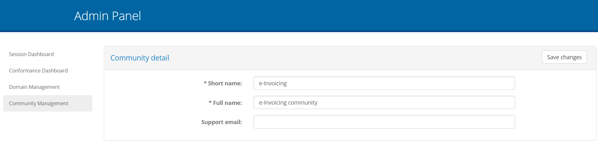

.. _community:

Manage your community
=====================

The **Community Management** screen is the place where you can manage your community's organisations and users. To access it click 
the **ADMIN** link from the screen's header.

.. figure:: ../screenshots/header_admin.PNG
  :align: center

Doing so presents you with a left side menu containing links to administrative functions, of which you need to click 
the **Community Management** link.

The screen is split in five sections:

* The **Community detail** section presenting to you the information for your community.
* The **Community administrators** section allowing you to view and manage your administrators.
* The **Organisations** section in which you can view and manage your organisations.
* The **Landing pages** section listing the landing pages you can use for your organisations.
* The **Legal notices** section listing the legal notices you can display for your organisations.

The **Community detail** section allows you to view and edit your community's basic information.

.. figure:: ../screenshots/admin_community_details.PNG
  :align: center

The information you can edit in this form is:

* Your community's **short** and **full name** (required). These are visible to the test bed administrator and in certain user reports.
* Your community's **support email** address (optional) to receive contact form submissions.

Regarding the **support email**, this is the address, typically a functional mailbox, where your community users' feedback is sent via 
the test bed's contact form (see :ref:`contact_support`). If you configure this email address, it will be used as the recipient of 
submissions, with the test bed team's functional mailbox (DIGIT-ITB@ec.europa.eu) added in CC. If not configured, submissions will only 
be delivered to the test bed team's functional mailbox.

.. note::
    **When to configure a support email:** If you have a large user community and expect to have frequent user interactions it is highly
    advised that you configure your own support email. This is important since most questions would typically relate to your community's
    test cases and specifications rather than the test bed software itself. The test bed team will most likely not be able to answer 
    domain-specific questions and your users would experience unnecessary delays. On the other hand you would leave this unconfigured if
    your testing activities are limited, to benefit from the test bed's helpdesk without setting up your own.

Assuming you have defined a support email, the contact form submission messages are formatted in HTML such as the following sample.

.. figure:: ../screenshots/contact_form_sample.PNG
  :align: center
  :scale: 50%

Received messages include the following information: 

* The user's **name**, **identifier** and **preferred contact address**.
* The related organisation's **identifier** and **name**, as well as your community's **identifier** and **name**.
* The **type** of the message and the **message** itself.

To persist any changes you have made in the community detail form click the **Save changes** button. Navigating away from this page will discard any pending changes.

.. _community__administrators:

Manage administrators
---------------------

The **Community administrators** section displays the users, including yourself, that are capable of managing your community. 

.. figure:: ../screenshots/admin_community_administrators.PNG
  :align: center

Community administrators are listed in a table with one row per user displaying the user's **name** and **email** address. Clicking on a row allows you to edit
the user's information in a separate screen.

.. figure:: ../screenshots/admin_community_administrators_edit.PNG
  :align: center

The information presented here is the user's **name**, **email** and **role**, all required properties, of which only the name is editable. To change the name 
edit the existing value and click on **Update**, whereas to delete the user click on **Delete**. Note that if this user is the only administrator configured
for the community the **Delete** button is disabled. Finally, clicking **Back** will discard any pending changes and return you to the previous screen.

To create a new community administrator click on the **Create community administrator** button from the section's header.

.. figure:: ../screenshots/admin_community_administrators_header.PNG
  :align: center

Doing so will present you with a form to enter the user's information.

.. figure:: ../screenshots/admin_community_administrators_create.PNG
  :align: center

In this form you are expected to provide the following information:

* The administrator's **name** (required), used in your display and in feedback submissions to the test bed.
* The **email** address (required), used to login. This is essentially a username formatted as an email address, and does not have to be a real functioning
  address as no emails are ever sent to it.
* The user's **password** that needs also to be **confirmed**. The entered password can be changed by the user upon login through the profile
  management screen (see :ref:`manage_your_profile__change_password`).

To complete the creation of the new administrator click on **Save**. Clicking **Cancel** discards changes and returns you to the previous screen.

.. _community__organisations:

Manage organisations
--------------------

The **Organisations** section presents to you the organisations that are defined as members of your community. These are displayed in a table with one
row per organisation, displaying for each organisation its **short** and **full name**.

.. figure:: ../screenshots/admin_community_organisations.PNG
  :align: center

Clicking on **Create organisation** allows you to add a new organisation (see :ref:`community__create_organisation`), whereas clicking on the row of an
existing organisation allows you to edit its details (see :ref:`community__manage_organisation`).

.. _community__create_organisation:

Create an organisation
~~~~~~~~~~~~~~~~~~~~~~

To create a new organisation click on the **Create organization** button from the section's header.

.. figure:: ../screenshots/admin_community_organisations_header.PNG
  :align: center

Doing so presents you with the screen to enter the new organisation's details.

.. figure:: ../screenshots/admin_community_organisations_create.PNG
  :align: center

In this screen you are expected to enter the following information for the organisation:

* Its **short name** (required), used in list displays.
* Its **full name** (required), used in detail screens and reports.
* Its **landing page** (optional), presented to its users upon login.
* Its **legal notice** (optional), presented to its users when they click the **Legal notice** link from the screen footer.

Regarding the landing page and legal notice, these are presented as a choice of the ones defined for your community 
(see :ref:`community__manage_landing_pages` and :ref:`community__manage_legal_notices` respectively). If no selection
is made then the default landing page for the community is used, falling back to the test bed's overall default if none
is defined. Defining the landing page and legal notice at the level of the organisation allows you to present a
customised message and notice per organisation and is left fully at your discretion as community administrator.

To complete the creation of the new organisation click **Save**. Clicking on **Cancel** discards pending changes and returns you to the previous screen.

.. _community__manage_organisation:

Manage an organisation's details
~~~~~~~~~~~~~~~~~~~~~~~~~~~~~~~~

To manage an organisation's details click its corresponding row from the **Organisations** table displayed in the **Community management** screen.

.. figure:: ../screenshots/admin_community_organisations.PNG
  :align: center

Doing so presents you with the organisation details page that is split in two sections:

* The **Organization detail** section, displaying the organisation's information and allowing it to be edited.
* The **Users** section, displaying the list of users for the organisation (see :ref:`community__manage_organisation__users`).

The **Organization detail** section displays the organisation's information in an editable form in which you can modify its **short name**, **full name**,
**landing page** and **legal notice**. 

.. figure:: ../screenshots/admin_community_organisations_organisation_detail.PNG
  :align: center

To change the organisation's information edit the displayed values and click the **Update** button. The organisation can also
be deleted from here by clicking the **Delete** button. Doing so will, following confirmation, delete the organisation and its dependent information (e.g. users). The 
**Back** button will discard any pending changes and return you back to the community management screen. Finally, the **Manage Tests** button allows you to manage the 
organisation's test configuration (see :ref:`community__manage_organisation__tests`).

.. _community__manage_organisation__tests:

Manage the organisation's tests
+++++++++++++++++++++++++++++++

An interesting option available from the organisation's detail screen is the **Manage Tests** button. This allows you to configure the organisation's test setup, 
including its systems (see :ref:`manage_your_systems`) and conformance statements (see :ref:`manage_your_conformance_statements`). You can even proceed to 
complete a system's endpoint configuration used in test cases (see :ref:`execute_tests__provide_your_systems_configuration`) and also execute tests on behalf of 
the organisation (see :ref:`execute_tests`). When you click the **Manage Tests** button you will be directly taken to the organisation's system management screen.

.. figure:: ../screenshots/admin_community_organisations_organisation_manage.PNG
  :align: center

When on this screen you are effectively taking on the role of an administrator for the organisation, with the screen being displayed matching exactly what 
such a user would see if he/she clicked the **TESTS** button from the screen header. To avoid confusion between this screen and the one you can access for
your own special-purpose test organisation (see :ref:`validate_test_setup`), the banner displays the name of the selected organisation.

.. figure:: ../screenshots/admin_community_organisations_organisation_manage_banner.PNG
  :align: center

In addition, the system management screen now also presents a **Back** button that will bring you back to the organisation's detail screen. If you proceed to manage
your organisation's setup in further screens you can always return where you were through this **Back** button.

.. note::
    **Managing your organisations' test setup on their behalf** 

    Using the **Manage Tests** button allows you to fully complete an organisation's test setup on their behalf. This is an alternative to your organisations' 
    administrators doing this themselves (see :ref:`manage_your_conformance_statements`). The selected approach depends on the needs of your community. 
    
    If you define multiple specifications and want your organisations to fully take charge over what they want to conform to then the best approach would be 
    to avoid using the **Manage Tests** feature and let your organisations' administrators manage their own setup. On the other hand if you have more simple 
    needs, it could be beneficial to define only non-administrator users for your organisations and configure on their behalf their system(s) and conformance 
    statement(s). Simple cases with only a single system and conformance statement per organisation would allow users to login, click on **TESTS** from the 
    screen header and immediately start testing.

.. _community__manage_organisation__users:

Manage the organisation's users
+++++++++++++++++++++++++++++++

Management of the organisation's users is done through the **Users** section of the organisation's detail screen.

.. figure:: ../screenshots/admin_community_organisations_organisation_users.PNG
  :align: center

This section lists the currently defined users in a table, with one row per user, displaying for each one his/her **name**, **email** and **role**. To 
create a new user click the **Create user** button.

.. figure:: ../screenshots/admin_community_organisations_organisation_users_create.PNG
  :align: center

The resulting screen provides you with a form to enter the following information for the new user:

* The user's **name** (required), used when contacting the support team.
* The **email** address (required), used by the user to login. Note that this should be considered as a username formatted as an email, and does not
  need to be a functioning address as no messages will be sent to it.
* The user's **role** (required), either "Administrator" or "User". Recall that the "User" role can execute and follow up on tests, whereas the "Administrator"
  role can additionally manage the organisation's test configuration (e.g. systems and conformance statements) and add other users.
* The user's **password** and the password **confirmation**. The entered password can be changed by the user upon login through the profile management
  screen (see :ref:`manage_your_profile__change_password`).

To complete the creation of the user click the **Save** button. Clicking on **Cancel** will discard pending changes and return to the previous screen.

To edit an existing user click his/her corresponding row from the **Users** section.

.. figure:: ../screenshots/admin_community_organisations_organisation_users.PNG
  :align: center

Doing so presents you with a screen displaying the user's information in editable form fields.

.. figure:: ../screenshots/admin_community_organisations_organisation_users_edit.PNG
  :align: center

The information displayed is the user's **name**, **email**, **role** and **organisation**, all required, of which only the **name** and **role** can 
be edited. Clicking on **Update** saves your changes whereas clicking on **Back** discards them and returns you to the previous screen. The **Delete** 
button will, following confirmation, delete the current user.

.. _community__manage_landing_pages:

Manage landing pages
--------------------

A **landing page** is the home page displayed to your community's users when they log into the test bed. Its purpose is to welcome users providing them context
on the use of the test bed and potentially including a customised message. Moreover, this customised message can even be set at the level of specific organisations
if you choose to do so (see :ref:`community__organisations`).

The landing pages available for your community are listed in the **Landing pages** section. These are presented in a table with one row per landing page,
displaying for each its **name**, **description** and indication on whether it is considered as the **default**.

.. figure:: ../screenshots/admin_community_landing_pages.PNG
  :align: center

The landing page marked as default is the one that applies to all organisations in your community that don't have another, more specific one configured. If no
landing page is defined then the one that applies to the test bed as a whole is automatically used. Note that you, as community administrator, also view your
community's default landing page upon login.

Adding a new landing page can be done in one of the following ways:

* You can create a new landing page from scratch by clicking the **Create landing page** button.
* You can copy the test bed's default landing page by clicking the **Copy Test Bed landing page** button.
* You can copy one of your community's existing landing pages while editing its details.

Create landing page
~~~~~~~~~~~~~~~~~~~

When creating a new landing page you are presented with a form to enter its information.

.. figure:: ../screenshots/admin_community_landing_pages_create.PNG
  :align: center

If you are creating a landing page from scratch (i.e. you have clicked the **Create landing page** button), this form will be empty. Alternatively,
if the landing page is being created as a copy of an existing one (either the test bed's default landing page or another one defined for your community), the 
form will be prefilled. The information you are expected to complete for the landing page is:

* Its **name** (required), used in the list of landing pages and when selecting one for an organisation.
* Its **description** (optional), presented to community administrators.
* Whether or not it should be the **default** landing page for the community (default is "false").
* The landing page **content**, provided through a rich text editor, allowing you to add styled text, lists, images and links.

When you have provided the required information you can complete the landing page creation by clicking **Save**. Note that if you have set this as the 
new default landing page for your community you will also be prompted for confirmation considering that this will be immediately visible to all your
users. Clicking on the **Cancel** button will discard pending changes are return to the previous screen.

Edit landing page
~~~~~~~~~~~~~~~~~

To edit an existing landing page click its corresponding row from the **Landing pages** table.

.. figure:: ../screenshots/admin_community_landing_pages.PNG
  :align: center

Doing so will take you to a screen where the landing page's information is displayed in editable form fields.

.. figure:: ../screenshots/admin_community_landing_pages_edit.PNG
  :align: center

In this screen you can change the landing page's **name**, **description**, **default** setting and **content**. Note that if the landing page is currently
the default, this can't be unset. To switch defaults you would need to edit or create another landing page and at that time set it as the new default.
This is done to avoid misconfiguration where you could end up with no default landing page.

To persist any changes click on the **Update** button or discard them clicking on the **Back** button. The **Delete** button will, following confirmation,
remove the landing page. Finally, the **Copy** button allows you to make a copy of this landing page, by taking you to the landing page creation screen prefilled
with the current landing page's information. This can be useful if you want to create minor variations of a default landing page for certain organisations.

.. _community__manage_legal_notices:

Manage legal notices
--------------------

A **legal notice** is an arbitrary text that you can present to your users when they click on the **Legal notice** link from the screen footer.
The purpose of this is to define terms and conditions, notices and disclaimers that you want to make known to your community.

.. figure:: ../screenshots/footer.PNG
  :align: center

You may define a default legal notice that applies to your entire community or even specific legal notices for one or more organisations.
The legal notices available for your community are listed in the **Legal notices** section. These are presented in a table with one row per notice,
displaying for each its **name**, **description** and indication on whether it is considered as the **default**.

.. figure:: ../screenshots/admin_community_legal_notices.PNG
  :align: center

The legal notice marked as default is the one that applies to all organisations in your community that don't have another, more specific one configured. If no
legal notice is defined then the one that applies to the test bed as a whole is automatically used. Note that you, as community administrator, can also view 
your community's default legal notice when you click the relevant link from the screen footer.

Adding a new legal notice can be done in one of the following ways:

* You can create a new legal notice from scratch by clicking the **Create legal notice** button.
* You can copy the test bed's default legal notice by clicking the **Copy Test Bed legal notice** button.
* You can copy one of your community's existing legal notices while editing its details.

Create legal notice
~~~~~~~~~~~~~~~~~~~

When creating a new legal notice you are presented with a form to enter its information.

.. figure:: ../screenshots/admin_community_legal_notices_create.PNG
  :align: center

If you are creating a legal notice from scratch (i.e. you have clicked the **Create legal notice** button), this form will be empty. Alternatively,
if the legal notice is being created as a copy of an existing one (either the test bed's default legal notice or another one defined for your community), the 
form will be prefilled. The information you are expected to complete for the legal notice is:

* Its **name** (required), used in the list of legal notices and when selecting one for an organisation.
* Its **description** (optional), presented to community administrators.
* Whether or not it should be the **default** legal notice for the community (default is "false").
* The legal notice **content**, provided through a rich text editor, allowing you to add styled text, lists, images and links.

When you have provided the required information you can complete the legal notice creation by clicking **Save**. Note that if you have set this as the 
new default legal notice for your community you will also be prompted for confirmation considering that this will be available to all your
users. Clicking on the **Cancel** button will discard pending changes are return to the previous screen.

Edit legal notice
~~~~~~~~~~~~~~~~~

To edit an existing legal notice click its corresponding row from the **Legal notices** table.

.. figure:: ../screenshots/admin_community_legal_notices.PNG
  :align: center

Doing so will take you to a screen where the legal notice's information is displayed in editable form fields.

.. figure:: ../screenshots/admin_community_legal_notices_edit.PNG
  :align: center

In this screen you can change the legal notice's **name**, **description**, **default** setting and **content**. Note that if the legal notice is currently
the default, this can't be unset. To switch defaults you would need to edit or create another legal notice and at that time set it as the new default.
This is done to avoid misconfiguration where you could end up with no default legal notice.

To persist any changes click on the **Update** button or discard them clicking on the **Back** button. The **Delete** button will, following confirmation,
remove the legal notice. Finally, the **Copy** button allows you to make a copy of this legal notice, by taking you to the legal notice creation screen prefilled
with the current legal notice's information. This can be useful if you want to create minor variations of a default legal notice for certain organisations.
