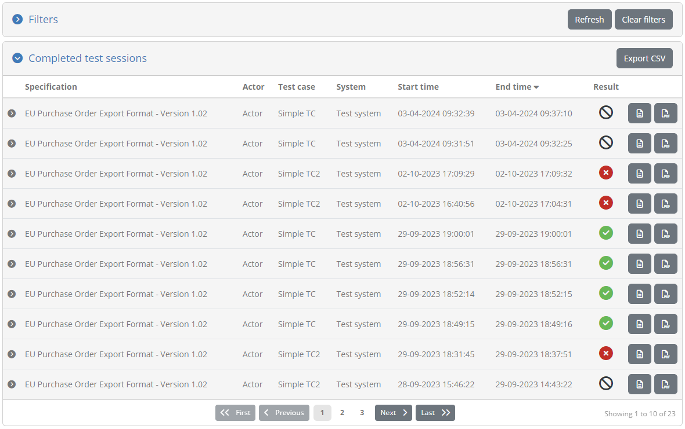

.. _communityTests:

View your community's test history
==================================

.. note::

    The **community test history** screen is available only if your administrator has enabled users to view other community members'
    tests.

This screen allows you to view the test sessions executed by any user in your community.

The information presented in this screen and the provided controls are the same as in the screen displaying
:ref:`your test history <view_your_test_history>`, with two important differences:

* Only **completed test sessions** are displayed.
* Having selected a specific test session, you can only **view the session's information** without navigating to related detail screens. 

Besides these constraints, you have full access to:

* View and search the :ref:`completed test sessions <view_your_test_history__completed>`.
* Export :ref:`test case reports <view_your_test_history__search__export>`.
* View :ref:`test session details <view_your_test_history__test_steps>`, and export :ref:`reports for specific test steps <view_your_test_history__test_steps__export>`.