.. _monitor_conformance_status:

Monitor conformance status
==========================

The conformance status for your communities is the summary of latest test results by all their
member organisations for their declared conformance statements. Monitoring this summary is possible
by means of the **Conformance dashboard**, accessible via the relevant menu link.

You can view your conformance dashboard in two ways, depending on your preference:

* **View per organisation**, displaying all statements grouped and split according to their specifications for a specific organisation.
  This approach is best if you are interested in a specific organisation.
* **Detailed tabular view**, displaying all statements for all organisations as a flat table. This approach os more suitable if you
  want to make complex filtering covering both organisations and specifications.

The default dashboard presentation is **per organisation**, considering that this is the most common dashboard use case. You can switch
between both dashboard presentation modes by toggling the **View per organisation** control from the page's header.

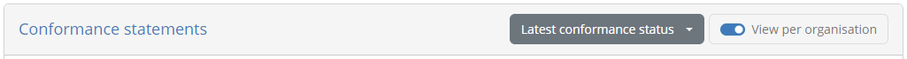

.. note::
    **Conformance dashboard vs session dashboard:** A significant benefit of the conformance dashboard is that the focus is placed on the latest result
    and also that even non-executed test cases are displayed. This allows you to get a clear picture of an organisation's testing progress without
    needing to extrapolate information.

.. _monitor_conformance_status__organisation_view:

View per organisation
---------------------

The dashboard display per organisation is the presentation mode active by default. It allows you to select a specific organisation
and system within a specific community, to display the complete set of its conformance statements. These statements are grouped and split
according to the organisation of your :ref:`domains<domains__domain_details>`, :ref:`specification groups<domains__domain_specification_groups>`,
:ref:`specifications<domains__domain__specification_list>` and :ref:`actors<domains__specification__actor_list>`.

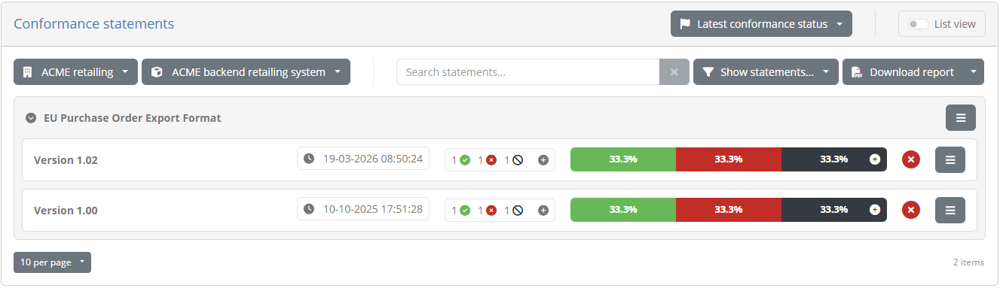

Assuming there are conformance statements defined these will be presented in expandable panels, split and grouped based on their
relevant specifications, specification groups and options (if applicable). If you do indeed see such groupings, related statements
can be expanded and collapsed by clicking on their relevant titles.

For each statement you can see besides the **name** of the specification, an overview of the system's current testing status. This overview
consists of:

* The **last update time**, corresponding to the last time the status of the conformance statement was updated.
* The **result counts**, showing the number of tests in the conformance statement that are completed, failed or incomplete.
* The **result ratios**, illustrating the same results but as a percentage of the total tests in the statement.
* The **overall status** of the statement which can be successful, failed, or incomplete, based on the latest test results.

The statement row itself can also be **expanded** by clicking it to :ref:`view its details<monitor_conformance_status__statement_details>`.
These details include **specific controls** at the level of the statement, as well the listing of all its **test suites** and **test cases** with their
latest test results.

In case numerous statements are defined, you can use the provided **search controls** to filter statements based on:

* The specifications' **name**.
* The **overall status**.

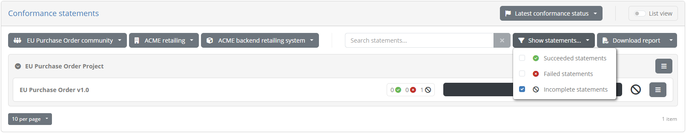

It could be that certain statements include **optional** test cases. Such tests can be consulted but are not counted towards the conformance
testing status. If statements with optional tests exist, the displayed counts and ratios will present a **plus** button to expand their
display allowing you to consult both mandatory and optional test results.

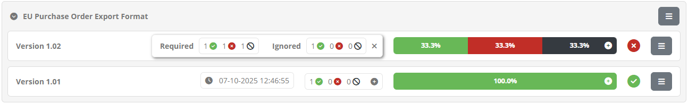

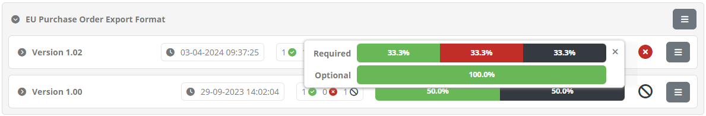

From the organisation view of the conformance dashboard you can also generate :ref:`conformance overview reports<monitor_conformance_status__detailed_view_conformance_overview_reports>`
and :ref:`conformance overview certificates<monitor_conformance_status__detailed_view_conformance_overview_certificates>`. These reports capture
the aggregate testing status covering multiple related conformance statements.

.. _monitor_conformance_status__detailed_view_conformance_overview_reports:

Conformance overview reports
~~~~~~~~~~~~~~~~~~~~~~~~~~~~

Conformance overview reports are a complement to the :ref:`conformance statement reports<manage_your_conformance_statements__view_a_conformance_statements_details__export>`
available when :ref:`viewing a specific conformance statement<manage_your_conformance_statements__view_a_conformance_statements_details>`,
focusing rather on a set of related conformance statements. Such overview reports are available at different levels depending on how
specifications are configured, specifically (per decreasing aggregation level):

* The selected system's **overall** status (always available).
* A **domain**, when conformance statements can cover more than one domains.
* A **specification group**, if groups are defined.
* A **specification**, when multiple actors can be tested for.

A report of the selected system's overall conformance status can be produced by clicking on the **Download report** button presented above the listing of statements. By default
this will produce a **PDF report**, but clicking the presented caret for additional options allows you to also **download the report in XML format**.

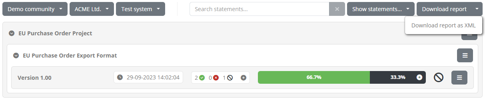

The PDF report includes an **overview** section summarising the report's context and status. This includes:

* The **organisation** and **system** the report refers to.
* The selected **domain**, **specification group**, or **specification** (skipped if the report refers to the overall status).
* The report **date** and **status**.
* The summary of conformance statement results, as **counts** and also **percentage ratios**.

Below the overview section, the report includes the listing of **conformance statements** presented in the same grouping as the on-screen display. Each
statement includes its **name** and **test result ratio** and **status**.

.. figure:: ../screenshots/conformance_overview_pdf.png
  :align: center

Following the summary of conformance statements, the report includes each individual **statement report** that lists its specific status, test suites and test cases.
In fact the name of each presented conformance statement from the summary is a link you may click to access the page of the relevant statement report.

.. figure:: ../screenshots/conformance_overview_pdf_statement.png
  :align: center

.. note::

  Each conformance statement report included in the overview report, matches the report you can produce separately for the
  :ref:`statement's detail screen<manage_your_conformance_statements__view_a_conformance_statements_details__export>`. When included in an overview report there are however
  no extended details for specific test cases.

An alternative to producing the report in PDF is to select the **Download report as XML** option. The format of this report is defined by the
`GITB Test Reporting Language (GITB TRL) <https://github.com/ISAITB/gitb-types/blob/master/gitb-types-specs/src/main/resources/schema/gitb_tr.xsd>`__,
and allows simpler machine-based processing. The following XML content is a sample of such a report:

.. literalinclude:: ../manageConformanceStatements/resources/conformance_overview_xml.xml
   :language: xml

.. note::
  You can also define **custom formats** for any kind of XML report. This is managed as part of the community's :ref:`report settings<community__report_settings>`.

Producing a conformance overview report at the level of a specific **domain**, **specification group** or **specification**, is achieved
using the report icon buttons presented at the right side of the statements' display. The first button is used to produce the report in XML
and the second one in PDF.

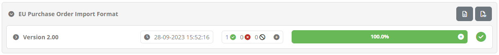

The reports in either case are structured in the same way as the overall reports discussed above. The only difference is that a report at a
specific aggregation level (e.g. a specification group) will also list the relevant level as part of the report's overview information.

.. figure:: ../screenshots/conformance_overview_pdf_statement_specific.png
  :align: center

.. _monitor_conformance_status__detailed_view_conformance_overview_certificates:

Conformance overview certificates
~~~~~~~~~~~~~~~~~~~~~~~~~~~~~~~~~

Depending on the community's :ref:`report settings<community__report_settings>` you may also produce a **conformance overview certificate** for statements
at different aggregation levels . This certificate is a report (in PDF format) that attests to the fact that the selected system has successfully completed
testing for all relevant conformance statements.

To produce a certificate you click on the PDF report generation buttons, either at the overall level or for a specific domain, specification
group or specification. If generating a certificate is enabled you will be prompted with a choice to select the kind of report to produce.

.. figure:: ../screenshots/conformance_report_generation_options_popup.png
  :align: center

Selecting **Conformance overview certificate** will display an additional section to confirm, and if desired adapt, the certificate's settings. The presented
settings are pre-populated based on the values already configured for the community (see :ref:`community__report_settings`), and can all be adapted
except for the signature settings.

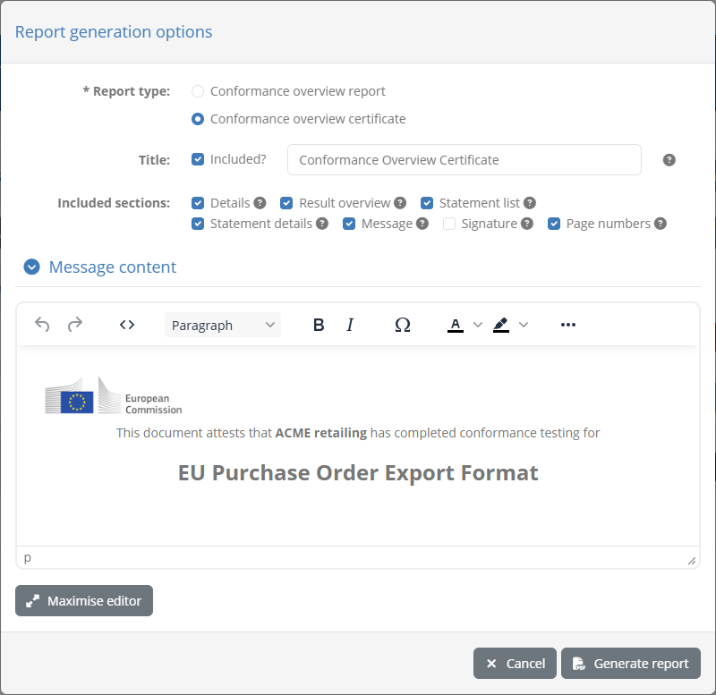

In case you have defined an elaborate custom message, acting for example as a full cover page for your certificate, it may be difficult
to view and edit it in the editor. For this purpose you are provided with the **Maximise editor** button that when clicked will expand
the editor to take up the full screen.

Once the settings are reviewed and adapted, clicking **Generate report** will produce the certificate.

.. figure:: ../screenshots/conformance_overview_pdf_certificate.png
  :align: center

.. note::

  The **Conformance overview report** option is the default if no certificate is enabled at the selected aggregation level. In such a case clicking a PDF report
  download button will skip the report type prompt and directly download the overview report.

.. _monitor_conformance_status__detailed_view:

Detailed view
-------------

You can switch to the **detailed dashboard view** at any time by toggling off the **View per organisation** control from the page's header.

Doing so presents the community's conformance statements in a table, and enables advanced search filters allowing you to inspect specific
statements of interest. The table listing statements is paged and includes one row per conformance statement.

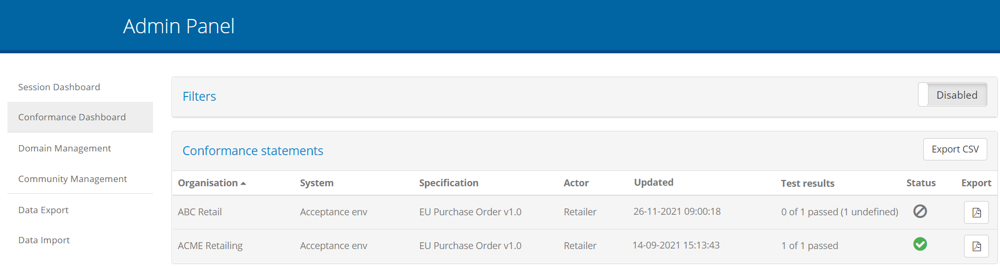

Statements are presented in a paged table sorted based on the **organisation's name**. Custom sorting
can be applied by clicking the title of each column; clicking a column header for the first time will sort by it in ascending manner and clicking it again
will switch to descending. The active sort column and type are indicated using an arrow next to the relevant column header. The table offers
controls to go to **specific pages** as well as the **first**, **previous**, **next** and **last** ones (as applicable), while showing in the bottom right
corner the total and currently displayed test counts.

The information displayed for each conformance statement is:

* The **community** of the organisation linked to the statement.
* The **organisation** linked to the statement.
* The **system** that is the focus of the testing activities.
* The **domain** of the specification.
* The **specification** that the system is selected to conform to.
* The **actor** of the specification the system is expected to act as.
* The date and time when the conformance statement's status was last **last updated**.
* The statement's **test results** showing how many configured tests are successful, failed, or incomplete. This can also be hovered over to view a text summary
  of the displayed counts.
* The statement's overall **status** (success, failure or incomplete).

The statement row can also be **expanded** by clicking it to :ref:`view its details<monitor_conformance_status__statement_details>`.
These details include **specific controls** at the level of the statement, as well the listing of all its **test suites** and **test cases** with their
latest test results.

Finally, each row also provides on the right side **export** controls that can be triggered clicking on the provided document icon.
Clicking these produce the conformance statement report for the given statement in XML and PDF formats (see :ref:`monitor_conformance_status__statements__export_statement`).

.. _monitor_conformance_status__statements__export_all:

Export all conformance statements
~~~~~~~~~~~~~~~~~~~~~~~~~~~~~~~~~

It is possible to generate a CSV export including all the conformance statements currently displayed. To do so click the **Export CSV** button
from the conformance statements' header.

.. figure:: ../screenshots/admin_conformance_dashboard_header_expanded.PNG
  :align: center

Doing so will generate a CSV file taking into account the currently applied filtering settings and include the conformance
statement information as well as the information on the individual related test cases. Note that such exports can also
include custom properties for communities applicable to organisations or systems (see :ref:`community__properties`) if these
have been defined by you or community administrators. To include such custom properties:

* A **single community** must be selected from the filtering criteria (otherwise custom properties are skipped).
* It must be a **Simple** text value (i.e. not a hidden value or a file).
* It must be configured as **Included in exports**.

All such properties are included in the export as columns following the "Organisation" or "System", depending on whether
they are organisation of system level properties. Their columns are named using a prefix of "Organisation" or "System" followed
by the property's key value included in parentheses.

.. figure:: ../screenshots/admin_conformance_dashboard_export_csv.PNG
  :align: center

.. note::
  **Exporting custom properties from multiple communities:** It is not possible to produce a single export for multiple communities
  including custom properties. The reason for this is that the resulting CSV file needs to have a single structure in terms of
  columns. The best workaround is to make individual exports per community selecting one at a time from the filtering criteria.

.. _monitor_conformance_status__filters:

Apply search filters
~~~~~~~~~~~~~~~~~~~~

When the dashboard's detailed display is active, it offers also a set of filters that can be used to select the displayed conformance statements. These can be enabled
by clicking the **Search filters** button from the table header.

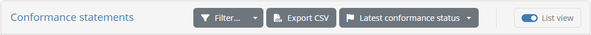

Doing so will expand the table header to present the available filter controls.

.. figure:: ../screenshots/admin_conformance_dashboard_filters_on_ta.PNG
  :align: center

The controls that can be used for filtering are:

* The relevant **community**, **organisation** and **system**.
* The relevant **domain** (only in case your community is not linked to a specific domain).
* The relevant **specification group**, **specification** and **actor**.
* The conformance **status**.
* The **last update time** for the conformance statement's status.
* Custom **organisation and system properties** defined for a given community.

Most filter controls are defined as selection choices. Multiple selected values across these controls are applied as follows:

* Within a specific filter control using "OR" logic (e.g. selecting multiple specifications).
* Across filter controls using "AND" logic (e.g. selecting a specification and an organisation).

Note additionally that selecting dependent values serves to limit the filter options that are presented. For example if a given organisation
is selected, the systems available for filtering will be limited to that organisation to already exclude impossible combinations.

Regarding organisation and system properties, these can be selected once a specific community has been selected for filtering.
Once enabled, each property type presents an **Add** button that, once clicked, will display a list of the available properties,
a field or selection list to provide the filter value, and controls to confirm or cancel the filter. Multiple property filters can be added with the
following semantics:

* Values provided for the same property are applied using "OR" logic.
* Values provided for different properties are applied using "AND" logic.

The presented conformance statements are automatically updated whenever your filter options are modified. The filter panel may also be **collapsed and expanded**
by clicking again the **Search filters** button. In addition, you may click the caret to the right of the button to select from its options to
either **refresh** the current results, or to **clear all applied filters**.

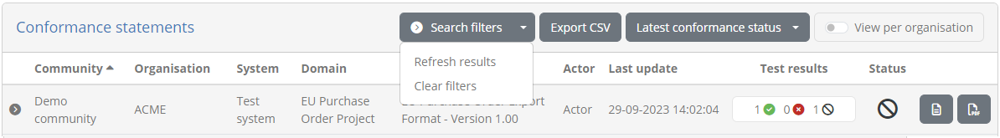

.. _monitor_conformance_status__statement_details:

View statement details
----------------------

Viewing a statement's details depends on the type of display you have active for the conformance dashboard. In case you are have enabled the
:ref:`view per organisation<monitor_conformance_status__organisation_view>` (the default) you click the desired statement from the presented
statement presentation (statements are the entries displaying test result information):

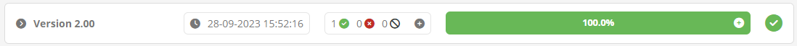

Alternatively, if you have the :ref:`detailed dashboard view<monitor_conformance_status__detailed_view>` enabled, you click the desired
statement's row from the statements' table.

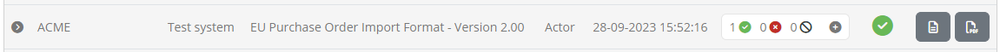

In both cases, the selected conformance statement will expand to present a nested table with its relevant test suites and test cases. Each test suite is presented in a
separate panel that indicates the overall result for its contained test cases. These test suite panels can also be clicked to collapse or expand. The content
of the panels is a table listing the test suite's test cases, displaying for each the latest recorded test result. Each test case row includes the following:

* The **test case name** and **description**, the latter visible by clicking the test case's row.
* The list of **tags**, if any are defined for the test case.
* The time of the test case's **last run**.
* A **view** button to view the relevant session's details. Clicking this will open up the test session in the :ref:`session dashboard<session_dashboard__completed>`.
* An **info** button to view the test case's HTML documentation.
* Two **export** buttons, to :ref:`generate the test case report<monitor_conformance_status__statements__export__test_case>` for the presented, latest test session in XML or PDF format.
* The latest test **result**. Note that if the relevant test session resulted in a specific **output message**, the result icon can be clicked to display it.

.. figure:: ../screenshots/admin_conformance_dashboard_expanded_output_message.PNG
  :align: center

As part of the display of the conformance statement's details you are provided with additional controls, to navigate to relevant information
and view conformance badges. If you have active the dashboard's :ref:`view per organisation<monitor_conformance_status__organisation_view>`, you will see the following
controls:

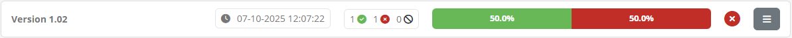

For the :ref:`detailed dashboard view<monitor_conformance_status__detailed_view>`, the displayed controls differ slightly as follows:

.. figure:: ../screenshots/admin_conformance_dashboard_expanded_controls.png
  :align: center

The presented controls permit the following actions:

* **View statement** takes you to the relevant :ref:`conformance statement<manage_your_conformance_statements__view_a_conformance_statements_details>`.
* **View system** takes you to the relevant :ref:`system<community__manage_organisation__systems_edit>`, :ref:`community<community>` or :ref:`organisation<community__manage_organisation>`.
* **View specification** takes you to the relevant :ref:`specification<domains__specification>`, :ref:`domain<domains__domain_details>` or :ref:`actor<domains__actor>`.
* **Copy badge URL**, presented if the relevant specification has configured :ref:`conformance badges <domains__specification>`,
  will copy to your clipboard a URL that can be referred to from outside the test bed to display the badge. The same button also includes a 
  secondary option named **Preview badge** that you can click for a preview.
* **Download report** (available in the :ref:`view per organisation<monitor_conformance_status__organisation_view>`), allows you to generate :ref:`conformance statement reports<monitor_conformance_status__statements__export_statement>` and :ref:`certificates<monitor_conformance_status__statements__export_certificate>`.

Producing a conformance badge preview (if a badge is defined) results in a popup presenting the badge image.

.. figure:: ../screenshots/conformance_statement_details_badge_preview.png
  :align: center

Note that the displayed badge is dynamically updated to always reflect the latest conformance testing status. For example if new test cases are
added to the statement, accessing the same badge (displayed as a "success" badge above) will switch to an "incomplete" badge.

.. figure:: ../screenshots/conformance_statement_details_badge_preview_incomplete.png
  :align: center

When the :ref:`detailed dashboard view<monitor_conformance_status__detailed_view>` is enabled, the controls will be complemented with the overall
**test result percentages** as a horizontal bar chart, showing the ratio of successes, failures and incomplete tests.
If the statement includes :ref:`optional test cases <domains__test_case__details>` the bar chart includes a **plus** control that you can click
to see separate percentages for mandatory and optional tests (by default mandatory tests are presented).

.. figure:: ../screenshots/conformance_statement_details_ratios.png
  :align: center

Expanded tables can be collapsed by clicking again on the expanded conformance statement's row. In addition, once one or more rows are expanded
the conformance statement header also displays a **Collapse all** button to collapse all rows with a single click.

.. figure:: ../screenshots/admin_conformance_dashboard_header_expanded.PNG
  :align: center

.. _monitor_conformance_status__statements__export__test_case:

Export a test case report
~~~~~~~~~~~~~~~~~~~~~~~~~

Exporting a test case's report is made possible through the file icon controls included in each test's row. The two **export** buttons provided
allow you to download the session's **test case report** in XML and PDF format.

The following is an example of such a report in **XML format**, the XML content being defined by the `GITB Test Reporting Language (GITB TRL) <https://www.itb.ec.europa.eu/docs/tdl/latest/introduction/index.html#specification-links>`_:

.. literalinclude:: ../testHistory/resources/test_case_report.xml
   :language: xml

The report includes the following information:

* The **identifier**, **name** and **description** of the test case.
* The **start** and **end time**.
* The overall **result** as well as the **output message** that may have been produced.
* The list of **step reports** that include each step's **identifier**, **description**, **timestamp**, **result** and **findings** (if validations were carried out).

Selecting the second export option produces the report in **PDF format** which includes similar information to its XML counterpart with
certain additional context data. The following sample report illustrates the information included:

.. figure:: ../screenshots/test_case_report.png
  :align: center

The report contains a first **Overview** section that summarises the purpose and result of the test session. The information
included here is:

* The name of the **system** that was tested and the name of its related **organisation**.
* The names of the **domain**, **specification** and **actor** of the relevant conformance statement.
* The **test case's name** and **description**.
* The session's **result**, **start** and **end time**.

The overview section is then followed by a section per test case step, each starting on a separate page.

.. figure:: ../screenshots/test_case_report_step.png
  :align: center

The information displayed for each step is:

* Its **sequence number**.
* Its **name**.
* Its **result**.
* Its completion **time**.
* For validation steps, the number of validation report findings classified as **errors**, **warnings** and **messages**.
* For validation steps, a **Details** section listing the details of each validation finding.

.. note::
    The XML report for a given test session can also be obtained through the test bed's :ref:`REST API<api>` (if enabled for your test bed instance).

.. _monitor_conformance_status__statements__export_statement:

Conformance statement report
~~~~~~~~~~~~~~~~~~~~~~~~~~~~

The **conformance statement report** provides an overview of the conformance testing status relevant to a specific conformance statement. It can be
generated to include only an overview or include also the results from its individual test cases. It is available in both XML and PDF formats.

Generating this report depends on the active dashboard view. If the :ref:`view per organisation<monitor_conformance_status__organisation_view>` is active,
you use the **Download report** and **Download report as XML** controls.

In case the :ref:`detailed dashboard view<monitor_conformance_status__detailed_view>` is active, you click the export icons on the right side of the statement's row.

Selecting to download a PDF report, you will be prompted for the type of report you want to generate:

* The **conformance statement report** (the default), for the report including the status overview for the conformance statement.
* The **conformance statement report (with test case results)**, to also include the detailed test case results.
* The **conformance certificate** (discussed in :ref:`monitor_conformance_status__statements__export_certificate`).

When generating an XML report you will see a similar prompt including only the first two options (conformance certificates
are not available in XML).

In both cases, once you select the report type and click the **Generate report** button, the produced report will be downloaded.
Clicking on **Cancel** closes the popup to return you to the previous screen.

The following sample illustrates the information included in the conformance statement PDF report's overview section. Specifically:

* The information on the **domain**, **specification** and **actor** for the selected system.
* The name of the system's **organisation** and the **system** itself.
* The **date** the report was produced, the number of **successfully passed test cases** versus the total, and the **percentage of results** (successes, failures and incomplete tests).
* The list of **test suites** displaying per test suite its **name**, **description** and **status**.
* For each test suite, the list of **test cases**, displaying similarly each test case's **name**, **description** and **result**. The
  test case name is also prefixed with the test's overall sequence that, in case test case steps are included, is a **link** to jump to its detailed report.

.. figure:: ../screenshots/conformance_statement_report_sample.png
  :align: center

In case the option to add each test case's step results is selected, the report includes a page per test case displaying its summary
and the result of each test step. The test case's title includes its reference number listed in the report's overview section, and
provides also a link to return to the listing of test cases.

.. figure:: ../screenshots/conformance_statement_report_sample_test_case.png
  :align: center

.. note::
    **Detailed report size:**  The detailed conformance statement report presents each test session and individual step in 
    a separate page. If the conformance statement contains numerous test cases, each with multiple test steps, the resulting detailed report 
    could be quite long.

Producing the report in XML is an interesting alternative if you want to use it for machine-based processing or further customisations. The format of this report
is defined by the `GITB Test Reporting Language (GITB TRL) <https://github.com/ISAITB/gitb-types/blob/master/gitb-types-specs/src/main/resources/schema/gitb_tr.xsd>`__.
The following XML content is a sample of such a report:

.. literalinclude:: ../manageConformanceStatements/resources/conformance_statement_xml.xml
   :language: xml

.. note::
  You can also define **custom formats** for any kind of XML report. This is managed as part of the community's :ref:`report settings<community__report_settings>`.

.. _monitor_conformance_status__statements__export_certificate:

Conformance statement certificate
~~~~~~~~~~~~~~~~~~~~~~~~~~~~~~~~~

The **conformance certificate** is a PDF report similar to the :ref:`conformance statement report<monitor_conformance_status__statements__export_statement>`,
that is meant to be delivered to the organisation linked to the conformance statement as a proof of its test results. It extends the base report by allowing
you to selectively include its sections, include a custom text and also add a digital signature for integrity control and non-repudiation. These customisations
are done for each generated certificate on the basis of defaults that are configured as part of the community's :ref:`report settings<community__report_settings>`.

Generating a conformance certificate depends on the active dashboard view. If the :ref:`view per organisation<monitor_conformance_status__organisation_view>` is active,
you use the **Download report** control:

In case the :ref:`detailed dashboard view<monitor_conformance_status__detailed_view>` is active, you click the export icon on the far right side of the statement's row:

Selecting to download a PDF report, you will be prompted for the type of report you want to generate:

.. figure:: ../screenshots/admin_conformance_dashboard_export_prompt.PNG
  :align: center

The options available are:

* The **conformance statement report** (the default), for the report including the status overview for the conformance statement.
* The **conformance statement report (with test case results)**, to also include the detailed test case results.
* The **conformance certificate**.

Selecting the **conformance certificate** option will display the customisation options for the certificate, starting from the values already
configured for the community (see :ref:`community__report_settings`). You may override all settings, including the custom message
that is presented here with the defined placeholders replaced using the information from the selected conformance statement. The only option that
cannot be overridden at this point is the digital signature configuration.

.. figure:: ../screenshots/admin_conformance_dashboard_export_prompt_cert.PNG
  :align: center

In case you have defined an elaborate custom message, acting for example as a full cover page for your certificate, it may be difficult
to view and edit it in the editor. For this purpose you are provided with the **Maximise editor** button that when clicked will expand
the editor to take up the full screen.

Once you have selected the report type and adapted your settings you can click the **Generate report** button to download the produced report.
Clicking on **Cancel** closes the popup to return you to the previous screen.

The following example is a sample conformance certificate. It can significantly resemble the :ref:`conformance statement report<monitor_conformance_status__statements__export_statement>`
with its overview section drawing from the same information as a normal report. In this example however, a custom message for the recipient organisation is also included:

.. figure:: ../screenshots/conformance_statement_certificate_sample.png
  :align: center

.. _monitor_conformance_status__snapshots:

Conformance snapshots
---------------------

The statements listed in the conformance dashboard correspond to the current status of the :ref:`communities <community>` and
:ref:`domains <domains>`. If you have :ref:`selected a single community<monitor_conformance_status__filters>` using the provided filter, it becomes possible to take a readonly snapshot of this status that you can later on consult to
review the conformance testing progress at previous points in time. You may want to do this to record an
overview at specific milestones, or simply to track detailed testing progress over time. You could also find
such snapshots useful to provide further versioning for test configurations over what is normally possible, by defining
snapshots as named and readonly version milestones. Regardless of their eventual purpose, these snapshots are referred to in
the test bed as **conformance snapshots**.

You can review and select a given snapshot through the relevant control on the statement listings' header. This is by default set
to **Latest conformance status** indicating that you are viewing the current status.

.. _monitor_conformance_status__snapshots_create:

To create a new snapshot or manage your existing ones, expand the snapshot button and select option **Manage conformance snapshots**.

.. figure:: ../screenshots/monitor_conformance_status__snapshots_controls_expanded.png
  :align: center

Doing so presents you with a popup listing the existing snapshots for the selected community, presenting for each its **label** and **timestamp**, the latter
used also to sort the entries to display the most recent snapshot first. As a first entry an entry is also included matching the latest conformance status.
Above the listed snapshots you also have a simple search filter you can use to filter the displayed entries, as well as a control to toggle between
internal and public labels for the snapshots.

.. figure:: ../screenshots/monitor_conformance_status__snapshots_popup.png
  :align: center

Each listed snapshot presents controls to **edit** and **delete** it. Editing a snapshot allows you to replace the snapshot's label,
but also to specify whether it is visible to organisation users, and if so, whether it will presented with a different label. This
information is also what is requested when you create a new snapshot by clicking the **Create snapshot** button from the popup's footer.

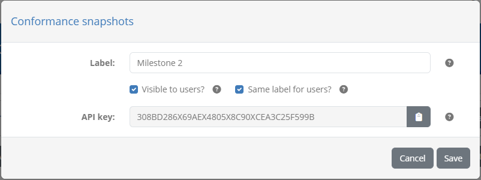

The default snapshot entry corresponding to the latest status is always present and visible to organisation users. However, you may still edit it to
set a specific public label.

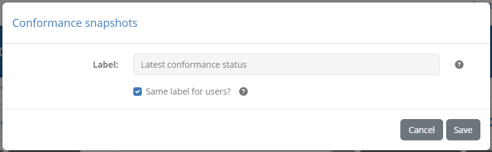

To view a specific snapshot you click its corresponding row. Doing so will close the popup and populate the conformance dashboard
with the information from the snapshot. This is highlighted for you by displaying the snapshot's **label** in the statement panel's header.

.. figure:: ../screenshots/monitor_conformance_status__snapshots_selected.png
  :align: center

With the snapshot selected, you may proceed to review its statements, use :ref:`search filters <monitor_conformance_status__filters>`
and carry out all actions as you would on the current conformance status. Given that the snapshot's data is **fully readonly**, it is possible
that related information is changed or even deleted. The snapshot always displays information reflecting the state at the time of the snapshot.
In case of currently deleted information (e.g. a deleted test suite or organisation), references are displayed with the only difference
being that navigation controls to view the deleted data's details will be unavailable. Finally, it is interesting to note that
conformance badges are also part of the snapshot's data so that if a badge is subsequently changed, the snapshot will still refer to the
previous badge.

To have the conformance dashboard revert to the current status, select the **Latest conformance status** option from the snapshot button
on the statement panel's header. This will also happen by default if you are no longer viewing a single community based on your current
:ref:`search filters<monitor_conformance_status__filters>`.