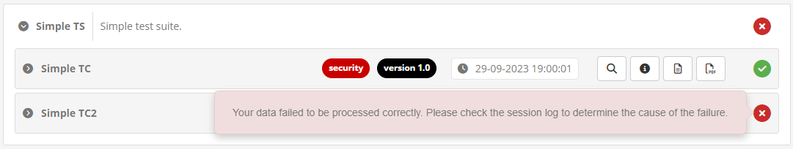
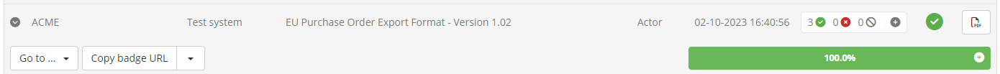
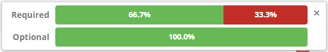
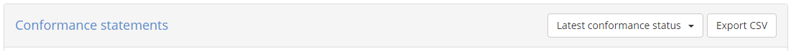
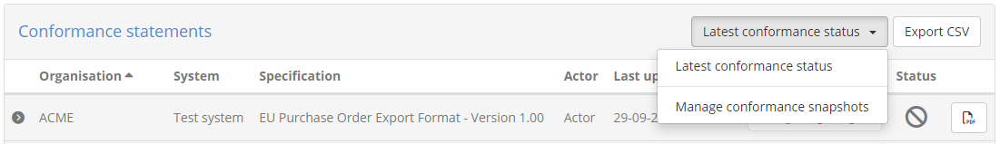
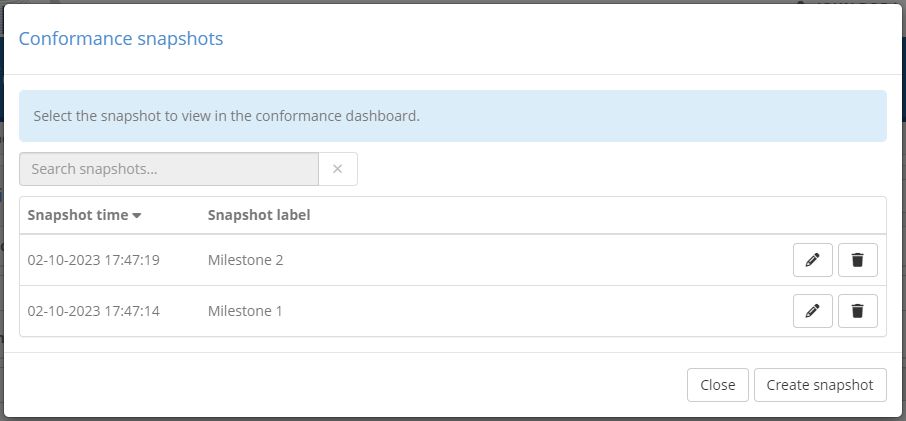
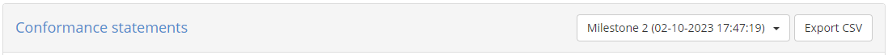

.. _monitor_conformance_status:

Monitor conformance status
==========================

The conformance status for your communities is the summary of the latest test results by all their
member organisations for their currently active conformance statements. Monitoring this summary is possible
by means of the **Conformance dashboard**, accessible via the relevant menu link.

.. figure:: ../screenshots/admin_conformance_dashboard_ta.PNG
  :align: center

The screen is split in two sections:

* A set of **search filters**, to help you focus on specific organisations and specifications.
* The list of **conformance statements** defined for your communities' organisations.

The currently defined conformance statements are presented in a paged table with one conformance statement per row. Recall that
a conformance statement represents the link between an organisation's system and a specification's actor and defines 
what the organisation needs to test for (see :ref:`introduction__glossary__conformance_statement`).

.. figure:: ../screenshots/admin_conformance_dashboard_collapsed_ta.PNG
  :align: center

The information displayed for each conformance statement is:

* The **community** of the organisation linked to the statement.
* The **organisation** linked to the statement.
* The **system** that is the focus of the testing activities.
* The **domain** of the specification.
* The **specification** that the system is selected to conform to.
* The **actor** of the specification the system is expected to act as.
* The date and time when the conformance statement's status was last **last updated**.
* The statement's **test results** showing how many configured tests are successful, failed, or incomplete. This can also be hovered over to view a text summary
  of the displayed counts.
* The statement's overall **status** (success, failure or incomplete).

The presented results are by default sorted based on the community's name, but clicking on each header label allows you to apply different sorting,
based on the selected column, in either descending or ascending manner. The currently active sorting is indicated by an arrow next to the relevant
header's label. Each row also provides on the right side an **export** function that can be triggered clicking on the provided document icon.
Clicking this button produces the conformance statement report for the given statement (see :ref:`monitor_conformance_status__statements__export_statement`).

View a statement's test results
-------------------------------

Each row in the conformance statements table can be expanded to present the test cases that relate to it. To do this click on the desired statement's
row.

.. figure:: ../screenshots/admin_conformance_dashboard_expanded_ta.PNG
  :align: center

Clicking on the row expands to present a nested table with the relevant test suites and test cases for this statement. Each test suite is presented in a
separate panel that indicates the overall result for its contained test cases. These test suite panel can also be clicked to collapse or expand. The content
of the panels is a table listing the test suite's test cases, displaying for each the latest recorded test result. Each test case row includes the following:

* The **test case name** and **description**, the latter visible by clicking the test case's row.
* The list of **tags**, if any are defined for the test case.
* The time of the test case's **last run**.
* A **view** button to view the relevant session's details. Clicking this will open up the test session in the :ref:`session dashboard<session_dashboard__completed>`.
* An **info** button to view the test case's HTML documentation.
* Two **export** buttons, to generate the test case report for the presented, latest test session in XML or PDF format (see :ref:`monitor_conformance_status__statements__export__test_case`).
* The latest test **result**. Note that if the relevant test session resulted in a specific **output message**, the result icon can be clicked to display it.

As part of the display of the conformance statement's details you are provided with additional controls, to navigate to relevant information
and view conformance badges.

The **Go to ...** button is used to navigate to the statement's relevant data, specifically :ref:`conformance statement <manage_your_conformance_statements__view_a_conformance_statements_details>`,
:ref:`community <community>`, :ref:`organisation <community__manage_organisation>`, :ref:`system <community__manage_organisation__systems_edit>`,
:ref:`domain <domains__domain_details>`, :ref:`specification <domains__specification>`, and :ref:`actor <domains__actor>`. The **Copy badge URL** button
is presented if the relevant specification has configured :ref:`conformance badges <domains__specification>`. If so you, clicking it
will copy to your clipboard a URL that can be referred to from outside the test bed to display the badge. The same button also includes a
secondary option named **Preview badge** that you can click for a preview.

.. figure:: ../screenshots/conformance_statement_details_badge_preview.png
  :align: center

Note that the displayed badge is dynamically updated to always reflect the latest conformance testing status. For example if new test cases are
added to the statement, accessing the same badge (displayed as a "success" badge above) will switch to an "incomplete" badge.

.. figure:: ../screenshots/conformance_statement_details_badge_preview_incomplete.png
  :align: center

At the right of these controls you are also presented with the overall **test result percentages** as a horizontal bar chart, showing the ratio of successes, failures and incomplete tests.
If the statement includes :ref:`optional test cases <domains__test_case__details>` the bar chart includes a **plus** control that you can click
to see separate percentage for mandatory and optional tests (by default mandatory tests are presented).

Expanded tables can be collapsed by clicking again on the expanded conformance statement's row. In addition, once one or more rows are expanded
the conformance statement header also displays a **Collapse all** button to collapse all rows with a single click.

.. figure:: ../screenshots/admin_conformance_dashboard_header_expanded.PNG
  :align: center

.. note::
    **Conformance dashboard vs session dashboard:** A significant benefit of the conformance dashboard is that the focus is placed on the latest result 
    and also that even non-executed test cases are displayed. This allows you to get a clear picture of an organisation's testing progress without 
    needing to extrapolate information.

.. _monitor_conformance_status__statements__export__test_case:

Export a test case report
-------------------------

Exporting a test case's report is made possible through the file icon controls included in each test's row. The two **export** buttons provided
allow you to download the session's **test case report** in XML and PDF format.

The following is an example of such a report in **XML format**, the XML content being defined by the `GITB Test Reporting Language (GITB TRL) <https://www.itb.ec.europa.eu/docs/tdl/latest/introduction/index.html#specification-links>`_:

.. literalinclude:: ../testHistory/resources/test_case_report.xml
   :language: xml

The report includes the following information:

* The **identifier**, **name** and **description** of the test case.
* The **start** and **end time**.
* The overall **result** as well as the **output message** that may have been produced.
* The list of **step reports** that include each step's **identifier**, **description**, **timestamp**, **result** and **findings** (if validations were carried out).

Selecting the second export option produces the report in **PDF format** which includes similar information to its XML counterpart with
certain additional context data. The following sample report illustrates the information included:

.. figure:: ../screenshots/test_case_report.png
  :align: center

The report contains a first **Overview** section that summarises the purpose and result of the test session. The information
included here is:

* The name of the **system** that was tested and the name of its related **organisation**.
* The names of the **domain**, **specification** and **actor** of the relevant conformance statement.
* The **test case's name** and **description**.
* The session's **result**, **start** and **end time**.

The overview section is then followed by a section per test case step, each starting on a separate page.

.. figure:: ../screenshots/test_case_report_step.png
  :align: center

The information displayed for each step is:

* Its **sequence number**.
* Its **name**.
* Its **result**.
* Its completion **time**.
* For validation steps, the number of validation report findings classified as **errors**, **warnings** and **messages**.
* For validation steps, a **Details** section listing the details of each validation finding.

.. note::
    The XML report for a given test session can also be obtained through the test bed's :ref:`REST API<api>` (if enabled for your test bed instance).

.. _monitor_conformance_status__statements__export_statement:

Export conformance statement report and certificate
---------------------------------------------------

The **conformance statement report** provides an overview of the conformance testing status relevant to a specific conformance statement. It can be
generated to include only an overview or include also the results from its individual test cases.

The **conformance certificate** is similar to the conformance statement report but is meant to be delivered to the organisation linked to the
conformance statement as a proof of its test results. It extends the base report by allowing you to selectively include its sections, include a custom
text and also add a digital signature for integrity control and non-repudiation. These customisations are done for each generated certificate on the basis
of defaults that are configured as part of the community details' management (see :ref:`community__conformance_certificate_settings`).

To generate these reports for a given statement you start by clicking the export file icon on the right side of the statement's row.

.. figure:: ../screenshots/admin_conformance_dashboard_collapsed_ta.PNG
  :align: center

Once the button is clicked you will be prompted for the type of report you want to generate:

.. figure:: ../screenshots/admin_conformance_dashboard_export_prompt.PNG
  :align: center

The options available are:

* The **Conformance statement report** (the default), for the report including the status overview for the conformance statement.
* The **Conformance statement report (with test case results)**, to also include the detailed test case results.
* The **Conformance certificate**.

Selecting the **Conformance certificate** option will display the customisation options for the certificate, starting from the values already
configured for the community (see :ref:`community__conformance_certificate_settings`). You may override all settings, including the custom message
that is presented here with the defined placeholders replaced using the information from the selected conformance statement. The only option that
cannot be overridden at this point is the digital signature configuration.

.. figure:: ../screenshots/admin_conformance_dashboard_export_prompt_cert.PNG
  :align: center

Once you have selected the report type and adapted your settings you can click the **Generate report** button to download the produced report.
Clicking on **Cancel** closes the popup to return you to the previous screen.

The following sample illustrates the information that is included in the conformance statement report's overview section. Specifically:

 * The information on the **domain**, **specification** and **actor** for the selected system.
 * The name of the system's **organisation** and the **system** itself.
 * The **date** the report was produced, the number of **successfully passed test cases** versus the total, and the **percentage of results** (successes, failures and incomplete tests).
 * The list of **test suites** displaying per test suite its **name**, **description** and **status**.
 * For each test suite, the list of **test cases**, displaying similarly each test case's **name**, **description** and **result**. The
   test case name is also prefixed with the test's overall sequence that, in case test case steps are included, is a **link** to jump to its detailed report.

.. figure:: ../screenshots/conformance_statement_report_sample.png
  :align: center

In case the option to add each test case's step results is selected, the report includes a page per test case displaying its summary
and the result of each test step. The test case's title includes its reference number listed in the report's overview section, and
provides also a link to return to the listing of test cases.

.. figure:: ../screenshots/conformance_statement_report_sample_test_case.png
  :align: center

.. note::
    **Detailed report size:**  The detailed conformance statement report presents each test session and individual step in 
    a separate page. If the conformance statement contains numerous test cases, each with multiple test steps, the resulting detailed report 
    could be quite long.

Finally, the following example provides a sample of a conformance certificate. It can significantly resemble the conformance statement report
but in this case includes a custom message for the recipient organisation.

.. figure:: ../screenshots/conformance_statement_certificate_sample.PNG
  :align: center

.. _monitor_conformance_status__statements__export_all:

Export all conformance statements
---------------------------------

It is possible to generate a CSV export including all the conformance statements currently displayed. To do so click the **Export CSV** button
from the conformance statements' header.

.. figure:: ../screenshots/admin_conformance_dashboard_header_expanded.PNG
  :align: center

Doing so will generate a CSV file taking into account the currently applied filtering settings and include the conformance
statement information as well as the information on the individual related test cases. Note that such exports can also
include custom properties for communities applicable to organisations or systems (see :ref:`community__properties`) if these
have been defined by you or community administrators. To include such custom properties:

* A **single community** must be selected from the filtering criteria (otherwise custom properties are skipped).
* It must be a **Simple** text value (i.e. not a hidden value or a file).
* It must be configured as **Included in exports**.

All such properties are included in the export as columns following the "Organisation" or "System", depending on whether
they are organisation of system level properties. Their columns are named using a prefix of "Organisation" or "System" followed
by the property's key value included in parentheses.

.. figure:: ../screenshots/admin_conformance_dashboard_export_csv.PNG
  :align: center

.. note::
  **Exporting custom properties from multiple communities:** It is not possible to produce a single export for multiple communities
  including custom properties. The reason for this is that the resulting CSV file needs to have a single structure in terms of
  columns. The best workaround is to make individual exports per community selecting one at a time from the filtering criteria.

.. _monitor_conformance_status__filters:

Apply search filters
--------------------

The conformance dashboard offers a set of filters that can be used to limit the displayed conformance statements.

.. figure:: ../screenshots/admin_conformance_dashboard_filters_off.PNG
  :align: center

Filters can be applied by clicking on the collapsed filter panel which expands to display the available controls.

.. figure:: ../screenshots/admin_conformance_dashboard_filters_on_ta.PNG
  :align: center

The controls that can be used for filtering are:

* The relevant **community**, **organisation** and **system**.
* The relevant **domain** (only in case your community is not linked to a specific domain).
* The relevant **specification group**, **specification** and **actor**.
* The conformance **status**.
* The **last update time** for the conformance statement's status.
* Custom **organisation and system properties** defined for a given community.

Most filter controls are defined as selection choices. Multiple selected values across these controls are applied as follows:

* Within a specific filter control using "OR" logic (e.g. selecting multiple specifications).
* Across filter controls using "AND" logic (e.g. selecting a specification and an organisation).

Note additionally that selecting dependent values serves to limit the filter options that are presented. For example if a given organisation
is selected, the systems available for filtering will be limited to that organisation to already exclude impossible combinations.

Regarding organisation and system properties, these can be selected once a specific community has been selected for filtering.
Once enabled, each property type presents an **Add** button that, once clicked, will display a list of the available properties,
a field or selection list to provide the filter value, and controls to confirm or cancel the filter. Multiple property filters can be added with the
following semantics:

* Values provided for the same property are applied using "OR" logic.
* Values provided for different properties are applied using "AND" logic.

The presented conformance statements are automatically updated whenever your filter options are modified, or when the filters are removed altogether by clicking the 
**Clear filters** button. The filter panel may also be **collapsed and expanded** by clicking the panel's title while maintaining the defined filters.
The **Refresh** button is used to refresh the display of results based on the current filtering.

.. _monitor_conformance_status__snapshots:

Conformance snapshots
---------------------

The statements listed in the conformance dashboard correspond to the current status of the :ref:`communities <community>` and
:ref:`domains <domains>`. If you have selected a single community using the provided filter, it becomes possible to take a readonly snapshot of this status that you can later on consult to
review the conformance testing progress at previous points in time. You may want to do this to record an
overview at specific milestones, or simply to track detailed testing progress over time. You could also find
such snapshots useful to provide further versioning for test configurations over what is normally possible, by defining
snapshots as named and readonly version milestones. Regardless of their eventual purpose, these snapshots are referred to in
the test bed as **conformance snapshots**.

You can review and select a given snapshot through the relevant control on the statement listings' header. This is by default set
to **Latest conformance status** indicating that you are viewing the current status.

.. _monitor_conformance_status__snapshots_create:

To create a new snapshot or manage your existing ones, expand the snapshot button and select option **Manage conformance snapshots**.

Doing so presents you with a popup listing the existing snapshots for the selected community, presenting for each its **label** and **timestamp**, the latter
used also to sort the entries to display the most recent snapshot first. Above the listed snapshots you also have a simple search
filter you can use to filter the displayed entries.

Each listed snapshot presents controls to **edit** and **delete** it. Editing a snapshot allows you to replace the snapshot's label.
This is also what is requested when you create a new snapshot by clicking the **Create snapshot** button from the popup's footer.

To view a specific snapshot you click its corresponding row. Doing so will close the popup and populate the conformance dashboard
with the information from the snapshot. This is highlighted for you by displaying the snapshot's **label** and **timestamp** in
the statement panel's header.

With the snapshot selected, you may proceed to review its statements, use the :ref:`search filters <monitor_conformance_status__filters>`
and carry out all actions as you would on the current conformance status. Given that the snapshot's data is **fully readonly**, it is possible
that related information is changed or even deleted. The snapshot always displays information reflecting the state at the time of the snapshot.
In case of currently deleted information (e.g. a deleted test suite or organisation), references are displayed with the only difference
being that navigation controls to view the deleted data's details will be unavailable. Finally, it is interesting to note that
conformance badges are also part of the snapshot's data so that if a badge is subsequently changed, the snapshot will still refer to the
previous badge.

To have the conformance dashboard revert to the current status, select the **Latest conformance status** option from the snapshot button
on the statement panel's header.