.. _monitor_conformance_status:

Monitor conformance status
==========================

The conformance status for your communities is the summary of the latest test results by all their
member organisations for their currently active conformance statements. Monitoring this summary is possible
by means of the **Conformance Dashboard** screen. To access this click on the **ADMIN** link from the screen's header.

.. figure:: ../screenshots/header_admin.PNG
  :align: center

Doing so presents you with a left side menu containing links to administrative functions, of which you need to click 
the **Conformance Dashboard** link.

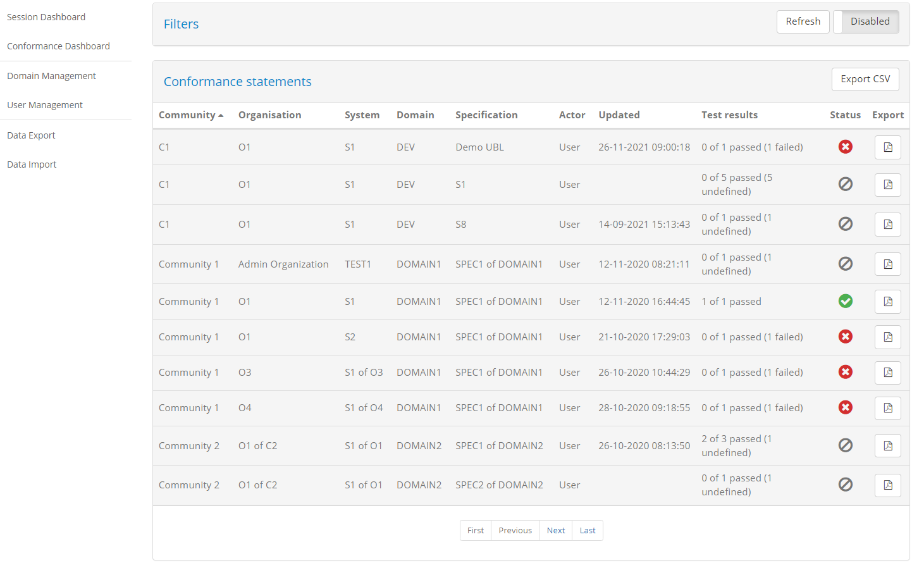

The screen is split in two sections:

* A set of **search filters**, initially disabled, to help you focus on specific organisations and specifications.
* The list of **conformance statements** defined for your communities' organisations.

The currently defined conformance statements are presented in a table with one conformance statement per row. Recall that
a conformance statement represents the link between an organisation's system and a specification's actor and defines 
what the organisation needs to test for (see :ref:`introduction__glossary__conformance_statement`).

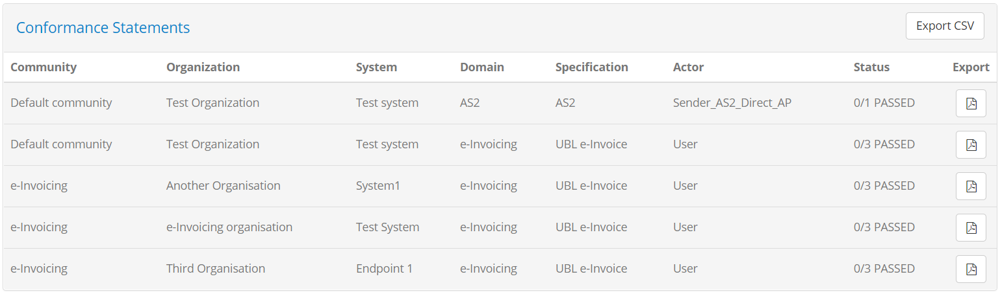

The information displayed for each conformance statement is:

* The **community** of the organisation linked to the statement.
* The **organisation** linked to the statement.
* The **system** that is the focus of the testing activities.
* The **domain** of the specification.
* The **specification** that the system is selected to conform to.
* The **actor** of the specification the system is expected to act as.
* The testing **status** in terms of successfully passed tests versus the total, including for the ones not passed their current
  status ("undefined" or "failed").

Each row also provides on the right side an **export** function that can be triggered clicking on the provided document icon.
Clicking this button produces the conformance statement report for the given statement (see :ref:`monitor_conformance_status__statements__export_statement`).

View a statement's test results
-------------------------------

Each row in the conformance statements table can be expanded to present the test cases that relate to it. To do this click on the desired statement's
row.

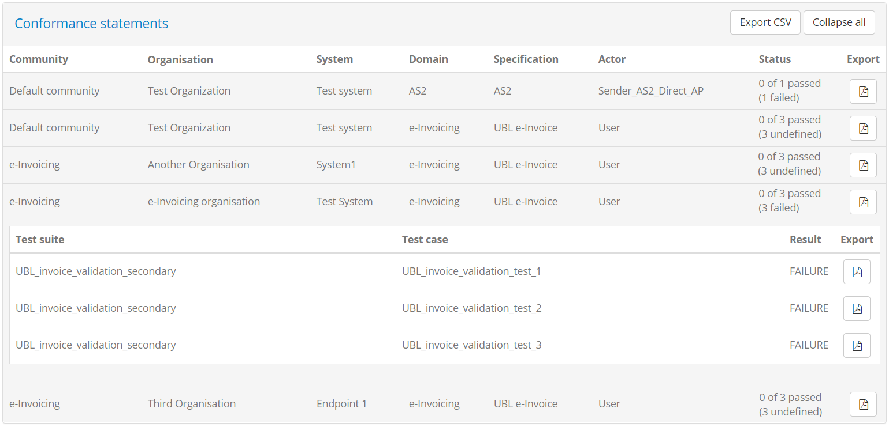

Clicking on the row expands to present a nested table with the relevant test cases for this statement. Each row corresponds to a test case and presents 
its latest test result, executed by the organisation in question. Each row includes the following information:

* The relevant **test suite**.
* The **test case**.
* The latest test **result**.

Each row also presents an **export** file icon that can be clicked to generate the test case report for the presented, latest test session 
(see :ref:`monitor_conformance_status__statements__export__test_case`).

Expanded tables can be collapsed by clicking again on the expanded conformance statement's row. In addition, once one or more rows are expanded
the conformance statement header also displays a **Collapse all** button to collapse all rows with a single click.

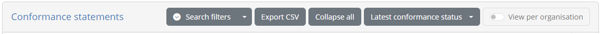

.. note::
    **Conformance dashboard vs session dashboard:** A significant benefit of the conformance dashboard is that the focus is placed on the latest result 
    and also that even non-executed test cases are displayed. This allows you to get a clear picture of an organisation's testing progress without 
    needing to extrapolate information.

.. _monitor_conformance_status__statements__export__test_case:

Export a test case report
-------------------------

Exporting a test case's report is made possible through the file icon control on the far right side of each test's row.

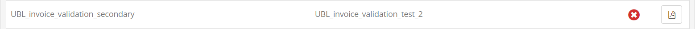

Clicking this will generate and download the report (in PDF format).

.. figure:: ../screenshots/test_case_report.png
  :align: center

The test case report contains a first **Overview** section that summarises the purpose and result of the test session. The information
included here is:

* The name of the **system** that was tested and the name of its related **organisation**.
* The names of the **domain**, **specification** and **actor** of the relevant conformance statement.
* The **test case's name** and **description**.
* The session's **result**, **start** and **end time**.

The overview section is then followed by a section per test case step, each starting on a separate page.

.. figure:: ../screenshots/test_case_report_step.png
  :align: center

The information displayed for each step is:

* Its **sequence number**.
* Its **name**.
* Its **result**.
* Its completion **time**.
* For validation steps, the number of validation report findings classified as **errors**, **warnings** and **messages**.
* For validation steps, a **Details** section listing the details of each validation finding.

.. note::
    **Step context values:** The information included in the test case report for each step does not include the context
    information relevant to the step's output results. This is omitted as the report would in most cases end up being 
    very large.

.. _monitor_conformance_status__statements__export_statement:

Export conformance statement report and certificate
---------------------------------------------------

The **conformance statement report** provides an overview of the conformance testing status relevant to a specific conformance statement. It can be
generated to include only an overview or include also the results from its individual test cases.

The **conformance certificate** is similar to the conformance statement report but is meant to be delivered to the organisation linked to the
conformance statement as a proof of its test results. It extends the base report by allowing you to selectively include its sections, include a custom
text and also add a digital signature for integrity control and non-repudiation. These customisations are done for each generated certificate on the basis
of defaults that are configured as part of the community details' management (see :ref:`community__conformance_certificate_settings`).

To generate these reports for a given statement you start by clicking the export file icon on the right side of the statement's row.

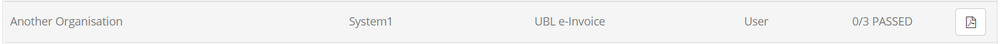

Once the button is clicked you will be prompted for the type of report you want to generate:

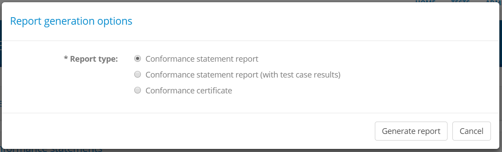

The options available are:

* The **Conformance statement report** (the default), for the report including the status overview for the conformance statement.
* The **Conformance statement report (with test case results)**, to also include the detailed test case results.
* The **Conformance certificate**.

Selecting the **Conformance certificate** option will display the customisation options for the certificate, starting from the values already
configured for the community (see :ref:`community__conformance_certificate_settings`). You may override all settings, including the custom message
that is presented here with the defined placeholders replaced using the information from the selected conformance statement. The only option that
cannot be overridden at this point is the digital signature configuration.

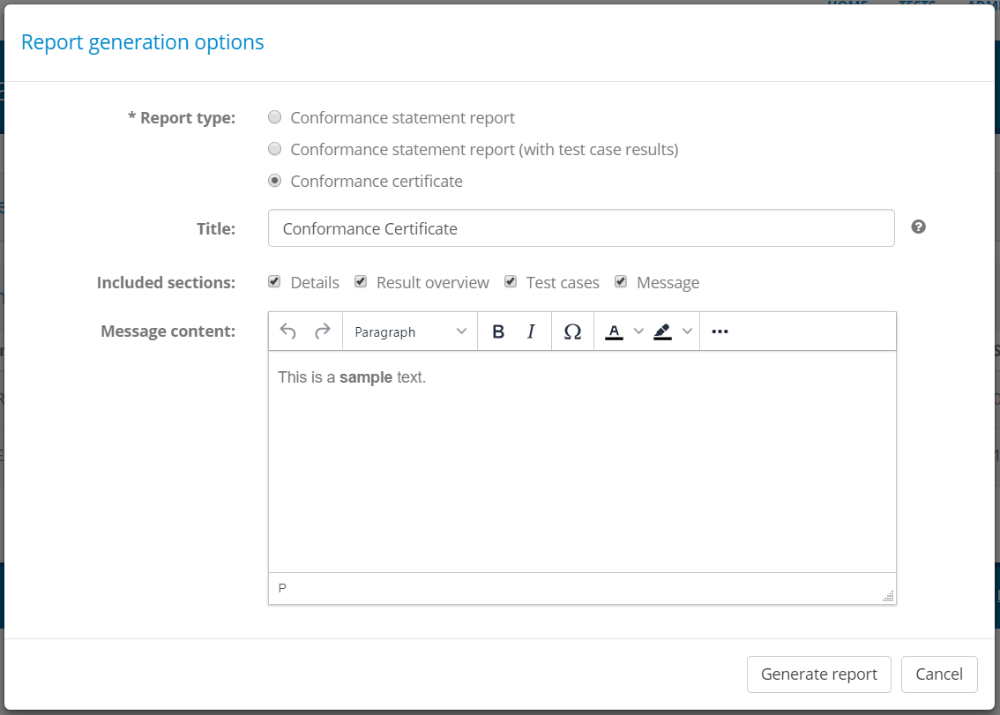

Once you have selected the report type and adapted your settings you can click the **Generate report** button to download the produced report.
Clicking on **Cancel** closes the popup to return you to the previous screen.

The following sample illustrates the information that is included in the conformance statement report's overview section. Specifically:

 * The information on the **domain**, **specification** and **actor** for the selected system.
 * The name of the system's **organisation** and the **system** itself.
 * The **date** the report was produced and the number of **successfully passed test cases** versus the total.
 * A table with the conformance statement's test cases, displaying a row per test case with its **reference number**, the name of the 
   the **test suite** and **test case**, the test case **description** and its test **result**.

.. figure:: ../screenshots/conformance_statement_report_sample.png
  :align: center

In case the option to add each test case's step results is selected, the report includes a section per test case displaying its summary
and the results from each test step. The test case's title includes its reference number listed in the report's overview section.

.. figure:: ../screenshots/conformance_statement_report_sample_test_case.png
  :align: center

.. note::
    **Detailed report size:**  The detailed conformance statement report presents each test session and individual step in 
    a separate page. If the conformance statement contains numerous test cases, each with multiple test steps, the resulting detailed report 
    could be quite long.

Finally, the following example provides a sample of a conformance certificate. It can significantly resemble the conformance statement report
but in this case includes a custom message for the recipient organisation.

.. figure:: ../screenshots/admin_community_certificate_preview.PNG
  :align: center

.. _monitor_conformance_status__statements__export_all:

Export all conformance statements
---------------------------------

It is possible to generate a CSV export including all the conformance statements currently displayed. To do so click the **Export CSV** button
from the conformance statements' header.

Note that the CSV export will include the conformance statement information as well as the information on the individual related test cases.
If you have defined custom properties for the community applicable to organisations or systems (see :ref:`community__properties`)
these may also be included in CSV exports. To include a custom property:

* It must be a **Simple** text value (i.e. not a hidden value or a file).
* It must be configured as **Included in exports**.

All such properties are included in the export as columns following the "Organisation" or "System", depending on whether
they are organisation of system level properties. Their columns are named using a prefix of "Organisation" or "System" followed
by the property's key value included in parentheses.

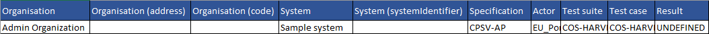

.. _monitor_conformance_status__filters:

Apply search filters
--------------------

The Conformance Dashboard offers a set of filters that can be used to limit the displayed conformance statements.

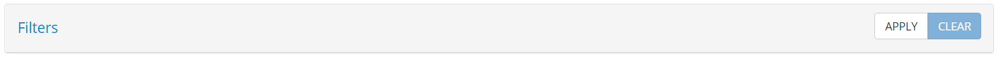

Filtering is by default switched off as indicated by the **CLEAR** button that is highlighted in blue as active. By clicking the **APPLY** button 
the filter controls are displayed and filtering is switched on.

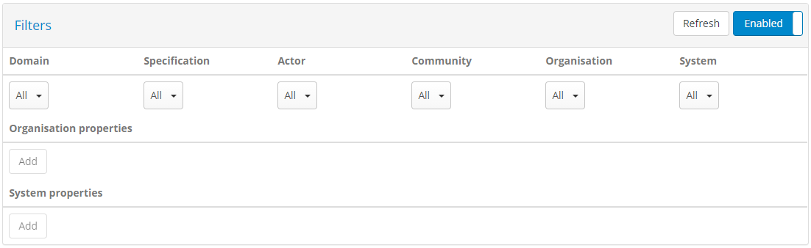

The controls that can be used for filtering are:

* The relevant **community**, **organisation** and **system**.
* The **domain**, **specification** and **actor**.

All filter controls are multiple selection choices. Multiple selected values across these controls are applied as follows:

* Within a specific filter control using "OR" logic (e.g. selecting multiple specifications).
* Across filter controls using "AND" logic (e.g. selecting a specification and an organisation).

Note additionally that selecting dependent values serves to limit the filter options that are presented. For example if a given organisation
is selected, the systems available for filtering will be limited to that organisation to already exclude impossible combinations.

The presented conformance statements are automatically updated whenever your filter options are modified, or when the filters are removed altogether
by clicking the **CLEAR** button. Note that applying no filtering is also the default case when you first visit this screen.