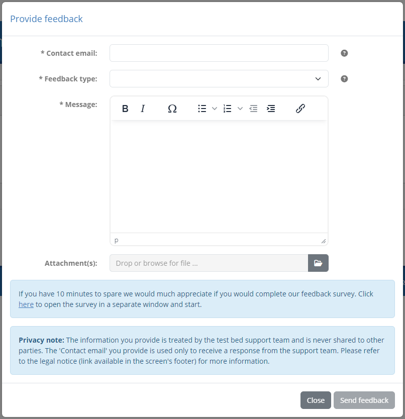
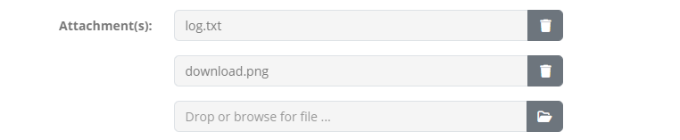

.. _contact_support:

Contact support
===============

You can easily contact the support team at any time through the **Contact support** link in the 
screen's footer.

.. figure:: ../screenshots/navigate_footer.png
  :align: center

Clicking this link results in a popup where you can provide your message and contact information.

In this form you are asked to enter the following information:

* A **contact email** as the address used to receive a response. If the test bed is integrated with EU Login this is pre-filled but you can
  still change it to another preferred address.
* The **feedback type** to specify the nature of the message. You can choose from a **technical issue**, **question on usage**, 
  **feature request** or **other**.
* The **message** itself. This is provided as a rich text editor so that you can format it as you please.
* One or more **attachments** linked to your message. A maximum of five attachments is allowed that should not exceed a total of five megabytes.
  Currently, accepted file types are images (GIF, PNG, JPEG), PDF files, text files and XML files.

To add an attachment click the file input field to select the file you want, or drag and drop it to the input. For added attachments you 
will see their file name along with a delete button you can use to remove them.

Clicking on the **Send feedback** button will send an email to the test bed's support team. Upon doing so you will also remain
on the contact form in case you want to submit a further message. Finally, clicking on **Close** discards any information you have entered
and closes the contact form popup.

.. note::
    **Support email:** By default the destination of contact form submissions is the test bed team's functional mailbox (DIGIT-ITB@ec.europa.eu).
    As community administrator you can override this for you and your community by setting a community-specific support email. See 
    :ref:`community` for more information on when and how to configure this.
    
.. _contact_support__provide_detailed_feedback:

Provide detailed feedback
-------------------------

In the contact form you are also presented with a message to provide further information if you desire. Clicking the provided link will open
a new browser tab with the `Interoperability Test Bed feedback survey`_. This is a survey that allows you to provide further information
and feedback in a structured manner. Completing the survey is always much appreciated by the test bed team as it provides valuable pointers on
how the test bed's service can be improved.

.. figure:: ../screenshots/survey.PNG
  :align: center

.. _Interoperability Test Bed feedback survey: https://ec.europa.eu/eusurvey/runner/itb
