.. _domains:

Manage test configuration
=========================

As Test Bed administrator you are able to work in parallel with community administrators in setting up the specifications that organisations are expected to conform to
as well as the test suites to verify this. Managing this information is possible through the **Domain management** screen, accessible
by clicking the relevant link from the menu. Once you do so you will be presented with the :ref:`listing of available domains<domains__domain_view>`.

.. _domains__domain_view:

Domains
-------

The first screen you access is the display of the domains defined in the Test Bed. These are managed by you as Test Bed administrator but also by
community administrators, assuming that their community has been linked to a given domain.

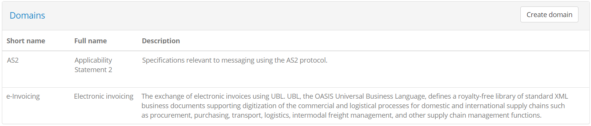

The presented table includes one row per domain for which the following information is displayed:

* The **short name** for the domain, used when the domain is mentioned in list displays.
* The **full name** for the domain, used in detail displays and reports.
* A **description** for the domain to provide context over what the domain relates to.

To proceed within a :ref:`domain's details<domains__domain_details>` click its relevant row from the table. To :ref:`create a new domain<domains__domain_create>` click the
**Create domain** button.

.. note::
    **Providing context to users:** The information you provide for the domain as well as further concepts such as the specification
    and actor are important to provide context to Test Bed users. This information should summarise what they are testing for, whereas
    the name and description of test cases and test suites should summarise how they are supposed to test.

.. _domains__domain_create:

Create domain
~~~~~~~~~~~~~

To create a new domain click on the **Create domain** button from the domain list header.

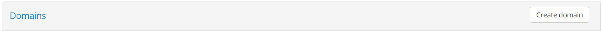

Doing so presents you with an editable form in which you are expected to enter the information for the new domain.

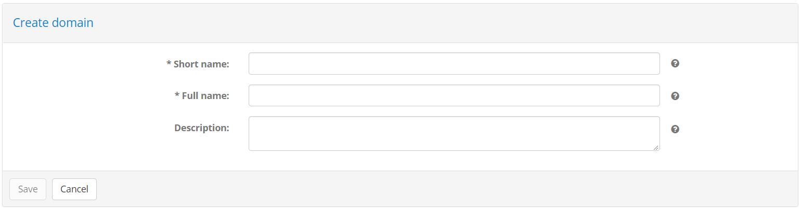

The information expected is the following:

* The domain's **short name** (required), displayed in lists.
* Its **full name** (required), displayed in detail screens and reports.
* Its **description** (optional), displayed in detail screens and reports.

To complete the creation of the new domain, provide the required information and click on the **Save** button. Clicking on the **Cancel** button
will discard pending changes and return you to the previous screen.

.. _domains__domain_details:

Manage domain details
---------------------

The domain detail screen is where you can edit a domain's properties. It is split in two sections:

* The **Domain details** section, to view and edit the domain's information.
* Tabs for the information linked to the domain, notably the **Specifications** tab to :ref:`manage its specifications<domains__domain__specification_list>`,
  the **Shared test suites** tab to manage the domain's :ref:`shared test suites<domains__domain__shared_test_suites>`, the
  the **Parameters** tab to :ref:`manage configuration parameters<domains__domain__parameter_list>` used in test cases,
  and the **Test services** tab to :ref:`manage supporting test services<domains__domain__service_list>`.

In the **Domain details** section you are presented with a form to view and edit the domain's information.

.. figure:: ../screenshots/admin_domains_domain_details.PNG
  :align: center

The following information is presented in corresponding form controls:

* The domain's **short name** (required), displayed in lists.
* Its **full name** (required), displayed in detail screens and reports.
* Its **description** (optional), displayed in details screens and reports.
* Its **report metadata** (optional), included in XML reports.
* The domain's **API key**, used to refer to it through the :ref:`REST API <api>` and in :ref:`data exports <exportimport>`.

To edit the domain's information, enter the new values you require and click the **Save changes** button. Clicking the **Delete** button will,
following confirmation, delete the domain and all related information. The **Back** button does not make any changes but takes you back to the
:ref:`domain list screen<domains__domain_view>`.

.. note::
    **Providing context to users:** The information you provide for the domain as well as further concepts such as the specification 
    and actor are important to provide context to your users. This information should summarise what they are testing for, whereas 
    the name, description and documentation of test cases and test suites should summarise how they are supposed to test.

.. _domains__domain__specification_list:

Specifications
~~~~~~~~~~~~~~

The **Specifications** tab presents a table with the domain's configured specifications. These represent the elements of your project's
:ref:`specifications<introduction__glossary__specification>` that you want organisations to conform to.

.. figure:: ../screenshots/admin_domains_domain_specifications.PNG
  :align: center

Each specification is presented in a separate row, in which the following information is provided:

* The **specification** name (in bold).
* Its **description**, used in detail screens and reports.
* Whether or not the specification is **hidden** from users (represented as a "hidden" icon).

You can use the provided **search box** to search for specifications, filtering based on the specifications' names in a case-insensitive manner,
and supporting partial matching.

Clicking on a specification's row will take you to its :ref:`detail page<domains__specification>`. To :ref:`create a new specification<domains__domain_create_specification>` click the **Create specification**
button, whereas to :ref:`upload a new test suite<domains__domain_deploy_test_suite>` for one or more specifications
click the **Upload test suite** button. You can also manage from here the specifications' :ref:`ordering<domains__domain_specification_ordering>`
to control how they are displayed to users.

.. _domains__domain_create_specification:

Create specification
++++++++++++++++++++

Creating a new specification is done by clicking the **Create specification** button from above the specifications' table.

.. figure:: ../screenshots/admin_domains_domain_specifications_header.PNG
  :align: center

Doing so presents you a screen in which you need to provide the information for the new specification.

.. figure:: ../screenshots/admin_domains_domain_create_specification.PNG
  :align: center

The information to provide for the specification is:

* The specification's **short name** (required), displayed in list views.
* Its **full name** (required), displayed in detail screens and reports.
* A **description** to provide more context on the specification (optional), displayed in detail screens and reports.
* Custom **report metadata** that is included in XML reports.
* Whether or not the specification is to be considered as **hidden** (by default set to false).
* In case :ref:`specification groups<domains__domain_specification_groups>` are defined in the domain, these will also be presented
  as a dropdown selection at the top. In case the specification is being created as an option to add to a group, the group in question
  will be preselected.

Setting a specification as **hidden** is typically meaningful for existing specifications as doing so will effectively
deprecate it. Once set as hidden, a specification does not appear as available when creating new conformance statements,
however any existing conformance statements or performed tests that refer to it remain unaffected. A good example of such
a scenario is when you want to support versioning in specifications and, upon release of a new version, you want to ensure
new conformance statements are only made for this latest version.

At the bottom of the form you may also find an option labelled **Badges enabled** which is by default unchecked. Checking this
expands the form to show further controls to define badges.

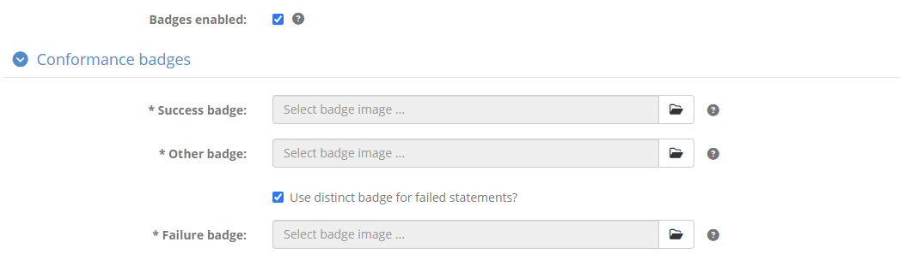

Badges are images that can be publicly looked up for a given organisation's system to produce an image that visually represents
its conformance status. If you choose to define such badges you need to provide at least a badge for the "successful" state
and "other" (i.e. not successful) state. Optionally you may also provide a badge for the "failure" state, for which the "other"
badge is used by default.

Badges can also be included in :ref:`conformance statement certificates<monitor_conformance_status__statements__export_certificate>`
(and :ref:`conformance overview certificates<monitor_conformance_status__detailed_view_conformance_overview_certificates>`),
which are PDF reports attesting to an organisation's successful testing. In this case you may choose to use alternate badge images
that are more appropriate for usage in PDF documents (as opposed to within an HTML page). For this purpose you have the option of
selecting different badges for HTML and PDF display.

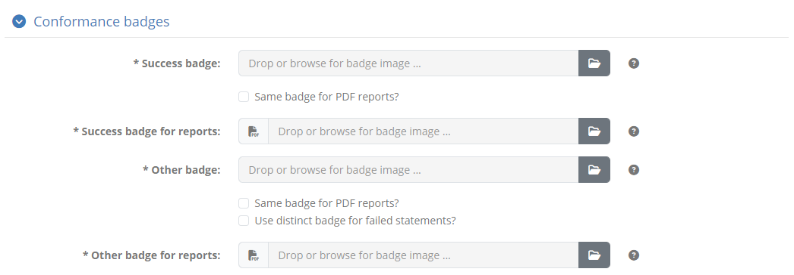

Once a badge is provided you will be presented with additional controls to **delete** and **preview** it.

.. figure:: ../screenshots/conformance_statement_details_badge_preview.png
  :align: center

A badge URL is of the form ``[TEST_BED_ADDRESS]/[SYSTEM_KEY]/[ACTOR_KEY]/[SNAPSHOT_KEY]`` with the ``[SNAPSHOT_KEY]``
being optional. Such URLs can be copied by both administrators through the :ref:`conformance dashboard <monitor_conformance_status>`,
as well as normal users through a :ref:`conformance statement's detail page <manage_your_conformance_statements__view_a_conformance_statements_details>`.

.. note::
  Badges can also be defined at :ref:`actor level <domains__actor>` if this is more meaningful for your setup. If a badge
  is missing at actor level, the one configured for the specification will be used by default.

To complete the creation of the specification click the **Save** button. To cancel and return to the :ref:`domain detail page<domains__domain_details>`
click the **Cancel** button.

.. _domains__domain_specification_groups:

Specification groups
++++++++++++++++++++

In case you need to add more depth to the specifications in your domain, you may create one or more **specification groups**. A specification
group represents a set of related specifications that you may choose to define to facilitate searching and the definition of conformance statements.
A typical example of using groups would be to define your project's specifications as groups, within which you define specific versions. From the
perspective of conformance statements, specifications map to the versions, but the extra grouping makes working with them more intuitive.

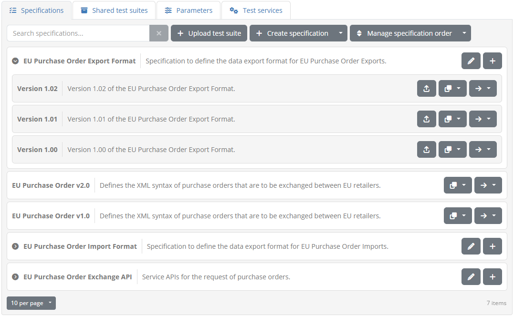

Specification groups are displayed separately from their contained specifications (termed by default as "options" when grouped) in search filters and 
when :ref:`creating new conformance statements<manage_your_conformance_statements__create>`. Certain screen listing don't
present these as separate concepts, showing rather as a specification the concatenation between group and option (separated by a hyphen).

To define a specification group expand the **Create specification** options and select **Create specification group**.

.. figure:: ../screenshots/admin_domains_domain_specifications_header.PNG
  :align: center

Doing so will present you with the form to provide the group's information, notably its **short name**, **full name** and
**description** (optional), and custom XML **report metadata** (optional).

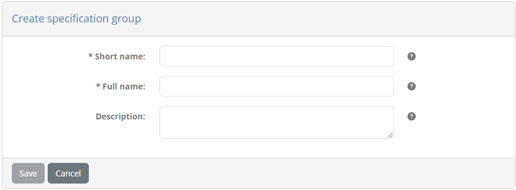

Once your domain defines at least one specification group, the listing of specifications changes. The table of specifications lists now
the groups you have defined as well as any specifications that are not contained in groups. This is an interesting point as you don't
need to define a group for all specifications; you can use groups where meaningful and simple specifications where no grouping is useful.

Specification groups are presented as expandable rows that when clicked will show their contained (specification) options. Clicking a
group's option or a non-grouped specification will take you to its :ref:`detail screen<domains__specification>`. Each specification group
row presents options to **edit** it and :ref:`add within it a new option<domains__domain_create_specification>`. Each specification within
a group (a group option), as well as non-grouped specifications presents controls to **ungroup** it (for options), **copy** it to a group,
and **move** it to a group. Specifically regarding copying to a group, this is meant to simplify the definition of similar options by cloning
the selected option's :ref:`details<domains__specification>`, :ref:`actors<domains__specification__actor_list>`,
and parameters. Test suites however are **not copied**.

Selecting to **edit** a specification group takes you to its detail page where you are presented with its information.

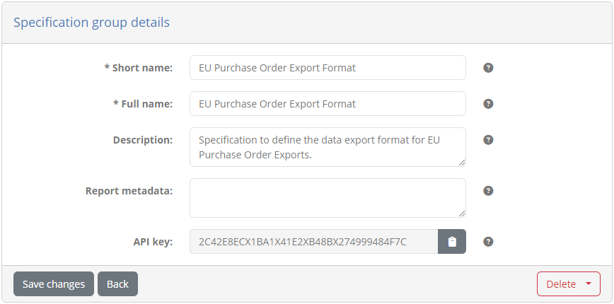

From this page you may select to **Save changes** or go **Back**, but you can also **Delete** the group altogether. When deleting you have
the option of either deleting also the group's options or only deleting the group itself. In the latter case, any specifications contained as
options within the group will be set as being non-grouped.

.. note::

  **Specification groups and conformance statements:** Test suites, conformance statements and executed tests are linked to specifications
  and options (specifications within groups). Specification groups have no direct link to these, and can be removed, replaced or switched without
  impacting users' testing history.

.. _domains__domain_specification_ordering:

Custom specification ordering
+++++++++++++++++++++++++++++

By default specifications are presented with alphabetic ordering to users based on their name. It is possible to override this
by applying a specific presentation order that will be used in the following cases:

* When reviewing available options while :ref:`creating new conformance statements<manage_your_conformance_statements__create>`.
* When :ref:`viewing existing conformance statements<manage_your_conformance_statements__view_your_conformance_statements>`.
* In conformance overview :ref:`reports<monitor_conformance_status__detailed_view_conformance_overview_reports>` and :ref:`certificates<monitor_conformance_status__detailed_view_conformance_overview_certificates>`.

To change the specifications' ordering click the **Manage specification order** button. Doing so will hide specification
controls and present all specifications in a single list (in case paging was active). You may now drag and drop
specifications to adapt their ordering, by clicking and holding them while dragging them to the desired spot.

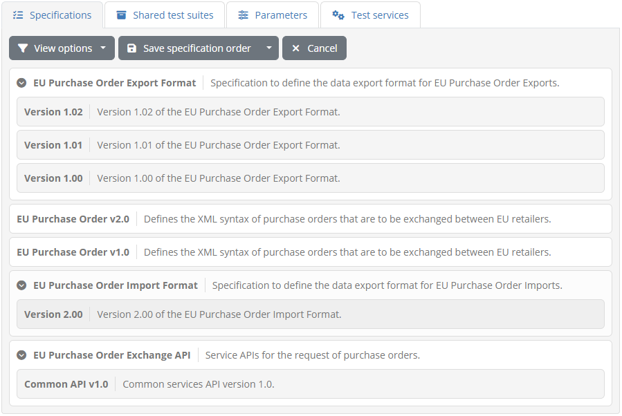

In case you are using specification groups, you can manage the order both at the level of the groups, and within each group's options.
It is also possible to set a specific ordering when you have a mix of grouped and ungrouped specifications. In this case you
can also use the **View options** button to show and hide group options.

When you are happy with the ordering, click on **Save specification order** to record the ordering. You can also choose from
here **Reset specification order** to revert to the natural ordering. Clicking on **Cancel** will take you out of specification
ordering mode without applying any changes.

.. note::

  When specifications (grouped or not) are presented in table listings alongside other concepts such as organisations and test cases, the
  ordering applied is always alphabetic.

.. _domains__domain_deploy_test_suite:

Deploy test suite to multiple specifications
++++++++++++++++++++++++++++++++++++++++++++

In case you have more than one specifications defined for the domain you will also see in the specifications' tab the
option termed **Upload test suite**.

.. figure:: ../screenshots/admin_domains_domain_specifications_header.PNG
  :align: center

Clicking this allows you to upload a test suite to multiple specifications at once, without needing to make individual uploads. For details
on the process to upload a test suite see :ref:`domains__specification__test_suite_upload`.

.. note::

  Deploying a test suite in this way is not the same as linking a :ref:`shared test suite<domains__domain__shared_test_suites>` with
  multiple specifications. In this case the test suite will be separately deployed to each specification and subsequent tests will only
  count towards each test suite's respective specification. The alternative of linking a shared test suite to multiple specifications will result in
  executed tests counting towards **all** linked specifications.

.. _domains__domain__shared_test_suites:

Shared test suites
~~~~~~~~~~~~~~~~~~

The **Shared test suites** section presents the test suites that have been configured at the level of the domain. These are test suites that
are meant to be shared across multiple specifications, for which executed tests will count commonly across specifications. This contrasts
:ref:`test suites defined at specification level<domains__specification__test_suite_list>` whose tests are linked only to the specification
in question. They are presented in a table with one row per shared test suite.

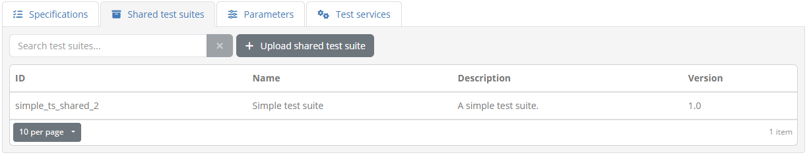

For each test suite the following information is displayed:

* The **ID** of the test suite. This is an internal identifier used to reference the test suite and match it when uploading updates.
* The **name** of the test suite. This is presented to users as a short name for the test suite.
* Its **description**. This typically would include information on the purpose of the test suite and limited instructions relevant to all its test cases.
* Its **version**. This is metadata that is recorded but not presented to users.

Test suites can be filtered using the provided **search box**, that will be applied against test suites' identifiers and names
in a case-insensitive manner and supporting partial matches. In terms of further actions, you may either
:ref:`upload a new test suite<domains__domain__shared_test_suite_upload>` by clicking the **Upload shared test suite** button or
:ref:`view its details<domains__test_suite_details>` by clicking its row.

.. _domains__domain__shared_test_suite_upload:

Upload shared test suite
++++++++++++++++++++++++

To add or update a shared test suite for a domain you need to upload it using the **Upload shared test suite** button from the shared test suite section's header.

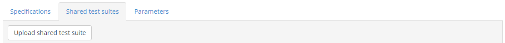

Clicking this button opens a dialog prompting you to select the test suite archive to upload.

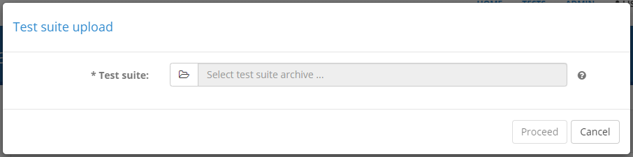

Once the archive is selected you can click on **Proceed** to proceed with the upload. Upon doing so the Test Bed will validate the archive to ensure it is a
valid test suite. In case your uploaded test suite has errors or warnings these will be presented to you including for each:

* An error code and description of the validation finding.
* The relevant test suite file as the location of the problem.

.. figure:: ../screenshots/admin_domains_specification_test_suites_upload_validation.PNG
  :align: center

If the test suite is found to have errors you are not allowed to proceed further. If only warnings are found you can click the **Proceed** button to ignore them
and continue to the next step. Validation warnings will not necessarily lead to test session errors but should nonetheless be reviewed to ensure nothing has been neglected.
Examples of warnings are supporting resources that are not used in test cases or references to missing :ref:`domain parameters<domains__domain_details>`.

.. note::
    **Uploading valid test suites:** If an uploaded test suite is fully valid (i.e. its validation results in no errors or warnings) the validation
    report step is completely skipped.

For a valid test suite, or a test suite with warnings you have chosen to ignore, what takes place next depends on whether or not the test suite already exists.
If this is the case you will be prompted with choices on how to proceed.

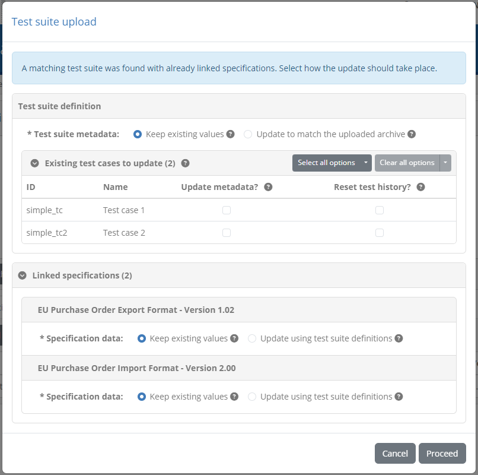

With respect to the test suite's metadata (its name, description, version and documentation) you are presented with the option to keep
existing values unchanged or to update them to match the data from the archive. Below this choice you are presented with three tables
regarding the test suite's test cases (displayed as applicable):

* The **existing test cases**, matched from the archive, that will be updated.
* The **new test cases**, present only in the archive, that will be created.
* The **missing test cases**, not present in the archive, that will be deleted.

From these three tables the one showing matched existing test cases presents further choices per test case. For each such test case you can choose:

* To **update its metadata**, setting its name, description, version and documentation to match the archive's definition.
* To **reset its test history**, that if selected will consider related test sessions as obsolete and reset accordingly linked conformance statements.

To proceed, review and complete the presented choices and click on **Proceed**. Clicking on **Cancel** will close the dialog without further actions.

.. note::

  If any test case option to reset testing history is selected you will be prompted for a confirmation before proceeding. Resetting the testing
  history is **not reversible**.

.. _domains__domain__parameter_list:

Parameters
~~~~~~~~~~

The **Parameters** section presents the configuration parameters defined at domain level. These are configuration values that are expected to be used
within the `GITB TDL test cases`_ that you upload to the Test Bed. They typically relate to information you don't want to include in test cases either
because they would hinder portability (e.g. service URLs), they are sensitive (e.g. service authentication credentials), or they are settings that apply
to all test cases that are subject to change. 

.. _GITB TDL test cases: https://www.itb.ec.europa.eu/docs/tdl/latest/expressions/index.html#referring-to-domain-configuration-parameters

.. figure:: ../screenshots/admin_domains_domain_parameters.PNG
  :align: center

The domain's parameters are presented in a table with one parameter per row. The information provided for each parameter is:

* Its **name**, used to identify the parameter and also refer to it through test cases.
* Its **description** to provide context on the purpose of the parameter.
* Its **value**, which in the case of sensitive parameters is hidden.
* Whether or not the parameter is included **in tests**.
* A **service icon** indication of whether this parameter is linked to a :ref:`test service<domains__domain__service_list>`.

.. note::
    **Parameters not in tests:** Typically domain parameters are meant to be used as global configuration values that are used in test cases.
    A parameter that is not meant to be used in tests could be used ti record arbitrary data within the Test Bed or as
    :ref:`input to a trigger<community__manage_triggers>`.

To :ref:`create a new parameter<domains__domain_create_parameter>` click the **Create parameter** button. To
:ref:`edit an existing one<domains__domain_edit_parameter>` click its corresponding table row.

.. _domains__domain_create_parameter:

Create parameter
++++++++++++++++

Creating a new domain parameter is done by clicking the **Create parameter** button from the **Parameters** list header.

.. figure:: ../screenshots/admin_domains_domain_parameters_header.PNG
  :align: center

Doing so presents you a screen in which you need to provide the information for the new parameter.

.. figure:: ../screenshots/admin_domains_domain_create_parameter.PNG
  :align: center

The information requested in this form is:

* The **name** of the parameter (required), used to identify it and refer to it from test cases.
* The **description** of the parameter (optional).
* The **kind** of parameter it is, choosing from either "Simple", "Binary" or "Secret" (required).
* Whether or not the parameter is to be **included in tests** (by default yes).

Depending on whether you select that this is a "Simple", "Binary" or "Secret" parameter the screen will be adapted to request its value.
Selecting "Simple" means that this is a simple text value that can be entered and displayed as-is. In this case the screen will 
adapt to request additionally the parameter's **value** (required)

.. figure:: ../screenshots/admin_domains_domain_create_parameter_simple.PNG
  :align: center

If selected to be a "Binary" parameter, you are presented with an **upload** button to provide the file in question. Once set,
the file can also be downloaded.

.. figure:: ../screenshots/admin_domains_domain_create_parameter_binary.PNG
  :align: center
  
Finally, if you select that the parameter is "Secret", the screen will adapt to request an obfuscated **value** (required). Hidden parameters are
treated similar to passwords, in that they will never be presented on-screen.

.. figure:: ../screenshots/admin_domains_domain_create_parameter_hidden.PNG
  :align: center

To complete the creation of the parameter click the **Save** button. Clicking the **Cancel** button closes the popup without making changes.

.. _domains__domain_edit_parameter:

Edit parameter
++++++++++++++

To edit a domain parameter click its corresponding row from the **Parameters** table.

.. figure:: ../screenshots/admin_domains_domain_parameters.PNG
  :align: center

Doing so will open a popup screen presenting you the parameter's current information, provided in editable fields.

.. figure:: ../screenshots/admin_domains_domain_update_parameter.PNG
  :align: center

The fields presented for the parameter are:

* The **name** of the parameter (required), used to identify it and refer to it from test cases.
* The **description** of the parameter (optional).
* The **kind** of parameter it is, choosing from either "Simple", "Binary" or "Secret" (required).
* Whether or not the parameter is **included in tests**.
* The **value** of the parameter, presented either as a text input (if **kind** is "Simple"), a downloadable link (if **kind** is "Binary") or a repeated text input (if **kind** is "Secret").

Once you adapt the parameter's information click the **Save** button to record your changes or the **Cancel** button to discard them. Clicking the 
**Delete** button removes, upon confirmation, the parameter.

.. _domains__domain__service_list:

Test services
~~~~~~~~~~~~~

**Test services** represent extensions to the Test Bed's test engine, making available to test cases custom
**validation**, **messaging** and **processing** capabilities that are not available out of the box. More concretely, these
are web service endpoints implementing one or more `GITB test service APIs <https://www.itb.ec.europa.eu/docs/services/latest/>`__
that will be called by the Test Bed when used in test cases, and specifically in test steps defining them as
`service handlers <https://www.itb.ec.europa.eu/docs/tdl/latest/handlers/index.html#custom-external-handlers>`__.

In practice all that is needed to use such a service in a test case is to define its endpoint address as a test step's handler.
The simplest way to do this in a configurable manner is to define this address as a :ref:`domain parameter<domains__domain__parameter_list>`
which can then be referenced as ``$DOMAIN{myService}``. Defining such an endpoint as a **test service** as opposed to a
domain parameter is identical regarding its use from test cases, but brings important benefits:

* You can **configure in a single location** additional service settings such as authentication details.
* Services can be listed and managed through the Test Bed's :ref:`REST API <api__configuration__searchTestServices>`.
* Additional **metadata** can be recorded for services to enable referencing from test suites.
* Services can be supported with **health monitoring** to ensure no disruptions to testing activities.

When a test service is defined it also defines a **linked domain parameter** with the same identifier. Test service definitions
are passed to the test engine when tests are executed, and are referenced through the ``DOMAIN`` map, exactly as you would
reference a domain parameter.

To manage the domain's test services, select the **Test services** tab from the :ref:`domain details <domains__domain_details>` screen.

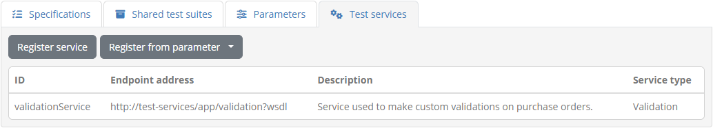

The defined services are presented in a table, listing per service:

* Its **identifier**, serving to identify it uniquely and reference it from test cases.
* Its **endpoint address**, pointing to the address where the service's endpoint is listening.
* Its **description**, providing a short description on the purpose of the service.
* Its **service type**, defining whether this is a **validation**, **processing** or **messaging** service.

To :ref:`create a new test service definition <domains__domain_create_service>` click on **Register service**. Alternatively,
you can also use the **Register from parameter** button in case you have already defined the service's address as a
:ref:`domain parameter <domains__domain__parameter_list>`.

.. _domains__domain_create_service:

Create test service
+++++++++++++++++++

Creating a test service is done by clicking the **Register service** button form the **Test services** tab.

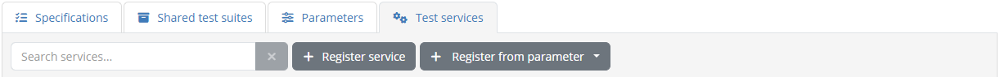

Doing so will open a screen to input the test service's information. Alternatively, if you want to convert an existing
:ref:`domain parameter <domains__domain__parameter_list>` to a test service, you can click the **Register from parameter** button which will allow you to look up
and select an appropriate, existing parameter. In this case the resulting form will be prepopulated using the parameter's
information.

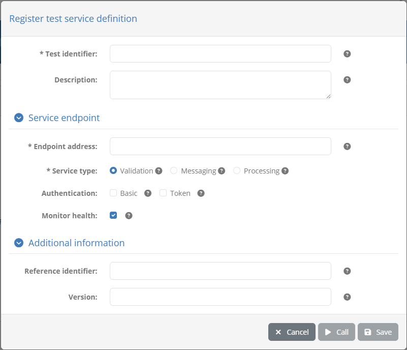

The core information requested in this form is:

* The **identifier** of the service (required), used to identify it and refer to it from test cases.
* The **description** of the service (optional).
* The **endpoint address** (required) that is called when the service is used in test cases.
* The **service type**, identifying this service as a validation, messaging or processing service as per the `GITB test service APIs <https://www.itb.ec.europa.eu/docs/services/latest/>`__.

In case the service requires **authentication** to be used, you can specify here how to authenticate. You can
configure HTTP basic authentication, the `WS-Security UsernameToken profile <https://www.oasis-open.org/committees/download.php/13392/wss-v1.1-spec-pr-UsernameTokenProfile-01.htm>`__,
or both.

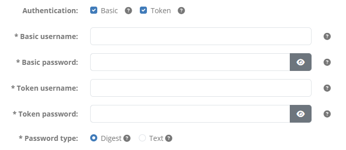

Finally you can also specify optional **metadata** for the service, notably a **reference identifier** and **version** that
are recorded and reported as information for the service, but that are not otherwise used within the Test Bed.

Having provided the requested information you can click on **Test** to check whether the test service responds successfully,
**Save** to persist your changes, or **Cancel** to close without creating the service. Once the test service is created you
will also see that it created in addition a :ref:`domain parameter <domains__domain__parameter_list>`, with the same name
(service identifier), value (endpoint address) and description as the service.

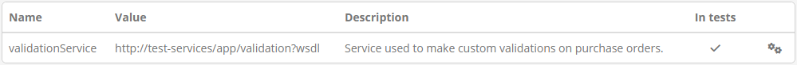

.. _domains__domain_edit_service:

Edit test service
+++++++++++++++++

To edit en existing test service select its row from the test service's list.

Doing so will open a popup screen presenting you the service’s current information, provided in editable fields.

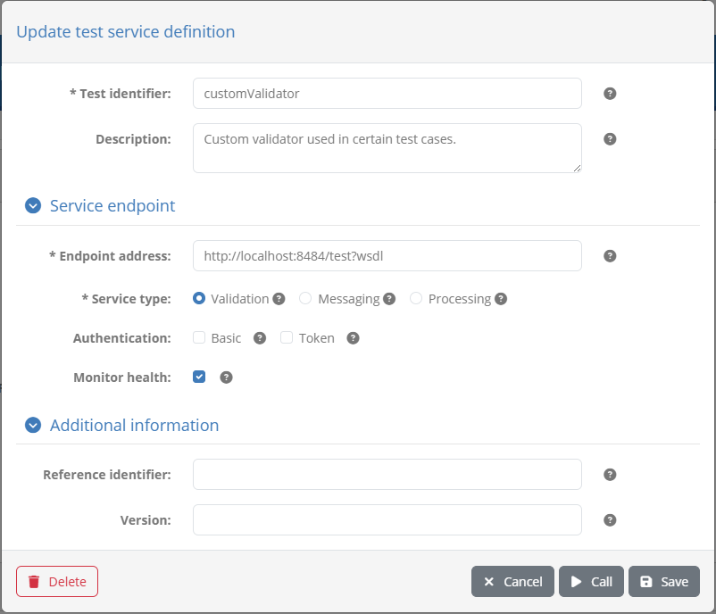

You can use this form to review and edit the service's information, specifically:

* The **identifier** of the service (required), used to identify it and refer to it from test cases.
* The **description** of the service (optional).
* The **endpoint address** (required) that is called when the service is used in test cases.
* The **service type**, identifying this service as a validation, messaging or processing service as per the `GITB test service APIs <https://www.itb.ec.europa.eu/docs/services/latest/>`__.
* The **authentication** settings.
* The **reference identifier** and **version** as additional service metadata.

Similar to when you are :ref:`creating a service <domains__domain_create_service>`, you can click on **Test** to check
whether the test service responds successfully, **Save** to persist your changes, or **Cancel** to close without making changes.

.. _domains__specification:

Manage specification details
----------------------------

To view a specification's details and edit its information you need to click on the specification's row, displayed in the **Specifications** table
of the :ref:`domain details page<domains__domain_details>`.

.. figure:: ../screenshots/admin_domains_domain_specifications.PNG
  :align: center

Doing so will take you to the specification details screen. This is split in three sections:

* The **Specification details** section, presenting the specification's information.
* The **Test suites** section, listing the :ref:`test suites <domains__specification__test_suite_list>` configured for this specification.
* The **Actors** section, listing the :ref:`actors <domains__specification__actor_list>` configured for the specification.

In the **Specification details** section you are presented with a form to view and edit the specification's information.

.. figure:: ../screenshots/admin_domains_specification_details.PNG
  :align: center

The following information is presented in corresponding form controls:

* The specification's **short name** (required), displayed in list views.
* Its **full name** (required), displayed in detail screens and reports.
* A **description** to provide more context on the specification (optional), displayed in detail screens and reports.
* Custom **report metadata** included in XML reports.
* Whether or not the specification is to be considered as **hidden** (by default set to false).
* The specification's **REST API key** that is used to identify the specification when managing test suites via the :ref:`Test Bed's REST API<domains__specification__test_suite_rest>` (if enabled by the Test Bed administrator).
  The readonly key value is automatically generated, and can be copied to your clipboard using the provided **copy** control.
* In case :ref:`specification groups<domains__domain_specification_groups>` are defined in the domain, these will also be presented
  as a dropdown selection at the top, with the specification's group (if defined) being preselected.
* Whether or not **conformance badges** are enabled for the specification (see their explanation in the :ref:`specification creation screen <domains__domain_create_specification>`).

Setting a specification as **hidden** is typically meaningful for existing specifications as doing so will effectively
deprecate it. Once set as hidden, a specification does not appear as available when creating new conformance statements,
however any existing conformance statements or performed tests that refer to it remain unaffected. A good example of such
a scenario is when you want to support versioning in specifications and, upon release of a new version, you want to ensure
new conformance statements are made for this latest version.

To edit the specification's information, enter the new values you require and click the **Save changes** button. Clicking the **Delete** button will,
following confirmation, delete the specification and all related information. The **Back** button does not make any changes but takes you back to the
specification :ref:`domain's detail screen<domains__domain_details>`.

.. _domains__specification__test_suite_list:

Test suites
~~~~~~~~~~~

The **Test suites** section presents the test suites that have been configured for the specification. These include test suites specific to
the current specification, or :ref:`shared test suites<domains__domain__shared_test_suites>` that apply to multiple linked specifications.
All test suites are presented in a table with one row per test suite.

.. figure:: ../screenshots/admin_domains_specification_test_suites.PNG
  :align: center

For each test suite the following information is displayed:

* The **ID** of the test suite. This is an internal identifier used to reference the test suite and match it when uploading updates.
* The **name** of the test suite. This is presented to users as a short name for the test suite.
* Its **description**. This typically would include information on the purpose of the test suite and limited instructions relevant to all its test cases.
* Its **version**. This is metadata that is recorded but not presented to users.
* An indication of whether this test suite is (or could be) **shared** with other specifications.

You can use the provided **search box** to filter test suites based on their identifier and name. In addition, you
may proceed to :ref:`upload a new test suite<domains__specification__test_suite_upload>` by clicking the **Upload test suite** button or
:ref:`view its details<domains__test_suite_details>` by clicking its row. In case the domain defines
:ref:`shared test suites<domains__domain__shared_test_suites>` you may also:

* **Link** a shared test suite to the specification.
* **Unlink** one of the already shared test suites from the specification.

Clicking on either of these options opens up a list to select the test suite to link or unlink. In case linking a shared test suite
requires a confirmation you will be presented with a relevant dialog. This will either inform you that linking the test suite is not possible
(in case another test suite has the same identifier), or will prompt you to choose whether matching actor, endpoint and endpoint parameter
data should be maintained or replaced.

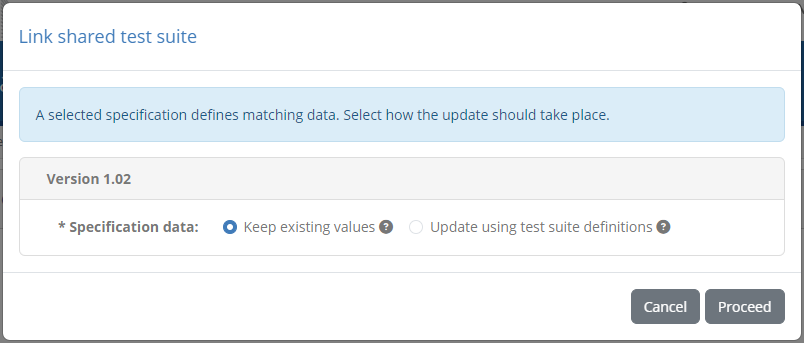

To proceed with the link, review and complete the presented choice and click on **Proceed**. Clicking on **Cancel** will close the dialog
without taking further actions.

.. _domains__specification__test_suite_upload:

Upload test suite
+++++++++++++++++

To add or update a test suite for a specification you need to upload it using the **Upload test suite** button from the test suite section's header.

.. figure:: ../screenshots/admin_domains_specification_test_suites_header.PNG
  :align: center

Recall that test suites are ZIP archives containing a test suite's XML file, one or more test case XML files, and the resources they use. The
test suite and test case XML files are authored in the `GITB TDL`_ which includes detailed instructions and examples on `test suite packaging and
deployment`_.

.. _GITB TDL: https://www.itb.ec.europa.eu/docs/tdl/latest/
.. _test suite packaging and deployment: https://www.itb.ec.europa.eu/docs/tdl/latest/testsuite/index.html#deploying-a-test-suite-in-the-gitb-software

Clicking on the **Upload test suite** button opens a dialog that displays the current **Target specification** as readonly and a file upload control to
select the test suite archive.

.. figure:: ../screenshots/admin_domains_specification_test_suite_upload_single.PNG
  :align: center

Note that in case you are :ref:`uploading a test suite for multiple specifications<domains__domain_deploy_test_suite>` from the :ref:`domain details page<domains__domain_details>`, 
this screen presents the domain's specifications as a multiple selection list.

.. figure:: ../screenshots/admin_domains_specification_test_suite_upload_multiple.PNG
  :align: center

Once the archive is selected you can click on **Proceed** to proceed with the upload. Upon doing so the Test Bed will validate the archive to ensure it is a
valid test suite. In case your uploaded test suite has errors or warnings these will be presented to you including for each:

* An error code and description of the validation finding.
* The relevant test suite file as the location of the problem.

.. figure:: ../screenshots/admin_domains_specification_test_suites_upload_validation.PNG
  :align: center

If the test suite is found to have errors you are not allowed to proceed further. If only warnings are found you can click the **Proceed** button to ignore them
and continue to the next step. Validation warnings will not necessarily lead to test session errors but should nonetheless be reviewed to ensure nothing has been neglected.
Examples of warnings are supporting resources that are not used in test cases or references to missing :ref:`domain parameters<domains__domain_details>`.

.. note::
    **Uploading valid test suites:** If an uploaded test suite is fully valid (i.e. its validation results in no errors or warnings) the validation
    report step is completely skipped.

For a valid test suite, or a test suite with warnings you have chosen to ignore, what takes place next depends on whether or not the test suite or the
data it refers to already exist. If this is the case you will next be prompted with a choice per target specification on how the upload should proceed.

.. figure:: ../screenshots/admin_domains_specification_test_suites_upload_choices.PNG
  :align: center

For each specification you have two possible choices regarding the specification's data:

* **Update the actor definitions**, displayed in case actors with the same identifiers as those in the test suite are found. Select this option
  to update the definitions of actors, endpoints and parameters to match the definitions from the archive.
* **Update test suite metadata**, displayed in case the test suite already exists. Select this option to update the test suite's metadata (name,
  description, documentation, version) to match the archive.

In case an existing test suite is found you are also presented with tables concerning the test suite's test cases (displayed as applicable):

* The **existing test cases**, matched from the archive, that will be updated.
* The **new test cases**, present only in the archive, that will be created.
* The **missing test cases**, not present in the archive, that will be deleted.

From these three tables the one showing matched existing test cases presents further choices per test case. For each such test case you can choose:

* To **update its metadata**, setting its name, description, version and documentation to match the archive's definition.
* To **reset its test history**, that if selected will consider related test sessions as obsolete and reset accordingly linked conformance statements.

.. note::

  If any test case option to reset testing history is selected you will be prompted for a confirmation before proceeding. Resetting the testing
  history is **not reversible**.

When reviewing the choices for matching data you may also choose to replicate one set of choices to all specifications through the **Apply to all** button. In addition, you can
click the **Skip** button to avoid making any changes to the specification in question. Doing so will grey out the specification's entry and display a **Process** button in case
you finally choose to proceed with the changes. Once you are satisfied with your choices you can click the **Proceed** button to complete the upload.

Once the upload is completed the dialog will close and the listed test suites will be refreshed. At any point during the test suite upload wizard you can stop the operation by
clicking the **Cancel** button that closes the popup without making any updates.

.. note::
    **Deleting specification data:** Specification data that is not matched through the test suite upload can only be created or updated. Data that exists
    but that is not matched in the test suite remains unaffected.

.. _domains__specification__test_suite_rest:

Manage test suites via REST API
+++++++++++++++++++++++++++++++

Apart from managing test suites through its user interface, the Test Bed also provides a **REST API** allowing you to deploy and undeploy test suites
via REST calls. Managing test suites in this way is primarily used during **test suite development**, to allow the deployment of test suites via
automation processes. Specifically you may use the API to:

* **Deploy** test suites (shared and specification-specific).
* **Undeploy** test suites (shared and specification-specific).
* **Link** shared test suites to specifications.
* **Unlink** shared test suites from specifications.

Details on each operation, including sample requests and responses, are provided in the :ref:`REST API documentation<api__test_suites>`.

.. note::

  Using the Test Bed's REST API is an advanced feature needs to first be enabled before it can be used. This is done by setting the
  `AUTOMATION_API_ENABLED`_ property to true in the Test Bed's configuration or via the :ref:`system configuration screen <systemAdmin>`.

.. _domains__specification__actor_list:

Actors
~~~~~~

The **Actors** section presents the actors configured for the specification. They are presented in a table with one row per actor.

.. figure:: ../screenshots/admin_domains_specification_actors.PNG
  :align: center

For each actor the following information is displayed:

* The **ID** of the actor, used for display purposes as a short name and also to reference the actor from test suites.
* Its **name**, as the complete actor name to show in detail screens and reports. This is also the name presented to users during test
  execution, unless this is overridden at test case level.
* Its **description**, displayed in details screens and reports to provide more details on the actor.
* Whether or not the actor is the specification's **default**. The default actor is the one that will be preselected as the SUT when creating new 
  conformance statements for the specification.
* Whether or not the actor is set as **hidden** (presented as a "hidden" icon). Hidden actors are not presented to users during the creation of conformance statements.

Clicking on an actor's row will take you to its :ref:`detail page<domains__actor>`. To manually :ref:`create a new actor<domains__specification__create_actor>` click the **Create actor**
button from the table's header.

.. note::
    **Automatic vs manual actor creation:** Actors can also be created automatically during test suite upload as long as their complete
    information is provided. If you prefer to manually create actors through the Test Bed's interface you should opt to refer to these
    using their ID rather than define them fully from within test suites (see the `GITB TDL documentation`_ for more details).

.. _GITB TDL documentation: https://www.itb.ec.europa.eu/docs/tdl/latest/testsuite/index.html#deploying-a-test-suite-in-the-gitb-software

.. _domains__specification__create_actor:

Create actor
++++++++++++

To create a new actor manually (as opposed to automatically via test suite upload) click  the **Create actor** button from the **Actors** list header.

.. figure:: ../screenshots/admin_domains_specification_actors_header.PNG
  :align: center

Doing so presents you a screen in which you need to provide the information for the new actor.

.. figure:: ../screenshots/admin_domains_specification_create_actor.PNG
  :align: center

The information to provide for the actor is:

* The actor's **ID** (required), displayed in list views and used to reference the actor within test suites.
* Its **name** (required), displayed in detail screens and reports, as well as in the test execution screen (unless overridden at test case level).
* A **description** to provide more context on the actor's purpose (optional), displayed in detail screens and reports.
* Custom **report metadata** to include in XML reports.
* The actor's **display order** (optional), used to determine where the actor should be displayed in the test execution diagram (see :ref:`execute_tests`).
  If provided this should be an integer that will be compared to the other specification actors' display order to determine the presentation order. An actor
  with a configured value will be displayed before actors with a larger value or ones that have no value configured.
* Whether or not the actor is the **specification default**. Only one default actor can be defined for a specification which will be preselected when creating
  new conformance statements.
* Whether or not the actor should be **hidden**. Hidden actors are valid for reference purposes but are not presented to users when creating conformance
  statements. They can be used to hide simulated actors or deprecate ones that have been previously used without affecting existing test sessions.

At the bottom of the form you may also find an option labelled **Badges enabled** which is by default unchecked. Checking this
expands the form to show further controls to define badges.

Badges are images that can be publicly looked up for a given organisation's system to produce an image that visually represents
its conformance status. If you choose to define such badges you need to provide at least a badge for the "successful" state
and "other" (i.e. not successful) state. Optionally you may also provide a badge for the "failure" state, for which the "other"
badge is used by default.

Badges can also be included in :ref:`conformance statement certificates<monitor_conformance_status__statements__export_certificate>`
(and :ref:`conformance overview certificates<monitor_conformance_status__detailed_view_conformance_overview_certificates>`),
which are PDF reports attesting to an organisation's successful testing. In this case you may choose to use alternate badge images
that are more appropriate for usage in PDF documents (as opposed to within an HTML page). For this purpose you have the option of
selecting different badges for HTML and PDF display.

Once a badge is provided you will be presented with additional controls to **delete** and **preview** it.

.. figure:: ../screenshots/conformance_statement_details_badge_preview.png
  :align: center

A badge URL is of the form ``[TEST_BED_ADDRESS]/[SYSTEM_KEY]/[ACTOR_KEY]/[SNAPSHOT_KEY]`` with the ``[SNAPSHOT_KEY]``
being optional. Such URLs can be copied by both administrators through the :ref:`conformance dashboard <monitor_conformance_status>`,
as well as normal users through a :ref:`conformance statement's detail page <manage_your_conformance_statements__view_a_conformance_statements_details>`.

.. note::
  Badges can also be defined at :ref:`specification level <domains__domain_create_specification>` if this is more meaningful for your setup. If a badge
  is missing at actor level, the one configured for the specification will be used by default.

To complete the creation of the actor click the **Save** button. To cancel and return to the :ref:`specification's detail page<domains__specification>`
click the **Cancel** button.

.. _domains__test_suite_details:

Manage test suite details
-------------------------

To view a test suite and edit its metadata click its row from the specification's test suite listing.

.. figure:: ../screenshots/admin_domains_specification_test_suites.PNG
  :align: center

In case of a :ref:`shared test suite<domains__domain__shared_test_suites>`, the entry point to its details would be to click the test suite's
row from the domain's listing of shared test suites.

For both shared and specification-specific test suites, details are presented in an editable form followed by:

* A listing of its included :ref:`test cases<domains__test_suite_test_case_list>`.
* A listing of its :ref:`linked specifications<domains__test_suite_linked_specifications_list>` (for a shared test suite).

In case this is a shared test suite you are also presented with a message highlighting that any changes made would apply to all linked
specifications.

.. figure:: ../screenshots/admin_domains_test_suites_details.PNG
  :align: center

Using the provided form you can edit the test suite's metadata, specifically:

* Its **ID**, a non-editable identifier set via test suite upload that is used to reference and match the test suite in subsequent uploads.
* Its **name** (required), a short text presented to users to identify the test suite.
* Its **version** (required), a version identifier for the test suite presented only to administrators.
* Its **description** (optional), a text providing context on the test suite and a brief overview of its purpose and contained test cases.

You can also include here an additional set of properties related to the test suite's normative **specification reference**. This information
forms part of the test suite's metadata, that if completed will figure in the test suite's definition file, reports, and on-screen displays.

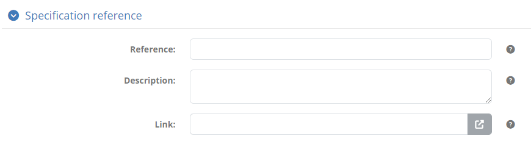

You can provide here as part of this information a **reference code**, a **description**, as well as a **link** to an online resource where
more information can be found. Providing this information is optional, and depending on what you provide it will be displayed accordingly. For
example providing all information will show the reference code as a link followed by the description, whereas if only a link is provided this
will be displayed as a link icon to follow.

You may also view and edit here the test suite's **documentation**. This is displayed to users as part of the
:ref:`conformance statement detail page<manage_your_conformance_statements__view_a_conformance_statements_details__tests>`, its purpose
being to add extended rich documentation that describes the steps to follow and reference external resources. To display the existing
documentation check the **Documentation** header, which will expand to display a rich text editor.

.. figure:: ../screenshots/admin_domains_test_suites_details_documentation.PNG
  :align: center

Above the rich text editor you have a **Copy system-wide resource reference** control that allows you to search in-place your :ref:`system resources <systemAdmin__resources>`,
such as images to include or files to add download links for. Once you find the resource you're looking for you can click it to copy its reference
to the clipboard. You can then use this reference as e.g. the source of an image file or the target of a link.

.. note::

  Unlike community administrators, you cannot search and include :ref:`community-specific resources <community__manage_resources>` here because the relevant domain
  could be linked to multiple communities.

If you choose to provide such documentation you may also click the **Preview documentation** to ensure it matches your expectations. Doing so
presents a popup with the documentation, displaying it exactly as when viewed by your users.

.. figure:: ../screenshots/conformance_statement_details_tests_documentation_popup_test_suite.PNG
  :align: center

Once you have introduced documentation for the test suite you may also click the **Copy to clipboard** button that will copy the documentation's
HTML source. You can use this to inspect the documentation in an editor or to store it within your test suite archive (in case you refer to
the documentation from the test suite definition file).

If you make changes to the test suite's metadata you can apply them by clicking the **Save changes** button. From here you can also click
**Download** to download the test suite's ZIP archive. Clicking **Delete** will delete, upon confirmation, the test suite rendering linked
test results as obsolete, whereas clicking on **Back** will discard any pending changes and return you to the :ref:`specification detail page<domains__specification>`
(for a specification's test suite) or the :ref:`domain detail page<domains__domain__shared_test_suites>` (for a shared test suite).

.. note::
  **Update via test suite upload:** A test suite's name, description and documentation can also be updated via
  :ref:`test suite upload<domains__specification__test_suite_upload>`. When uploading a new version for a test suite you can choose whether
  such values provided through the user interface are to be kept or replaced. Note that the content and execution order of
  the test suite's test cases can only be changed via upload.

In the case of a **non-shared test suite**, the available controls also include options to:

* **Move the test suite** from the current specification to another one.
* **Convert the test suite** to a shared test suite.

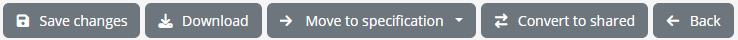

Both these operations can be useful when reorganising your tests and specifications. You may want to move test suites across specifications
if you realise that certain tests are best placed under another specification. Similarly, converting to a shared test suite can be useful if
you want to associate this test suite with multiple specifications without requiring the re-execution of its tests. In case the test suite is
already shared, these two options are replaced by the option to **convert to a non-shared test suite**. This acts as the opposite of what we
saw previously, allowing you to link the test suite with a specific specification. This could be interesting if you want to have a test
suite re-executed per linked specification.

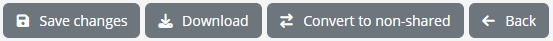

It is important to note that moving test suites across specifications, as well as converting to and from being shared, **maintains the current test history**.
You can also effectively always undo such actions by reversing them once complete (e.g. converting to shared and then back to non-shared). In addition, 
the scenarios when you will be unable to make such changes will be highlighted in advance. For example a test suite cannot be converted to being shared 
if one already exists with the same identifier, whereas converting from to non-shared is not allowed if the test suite is already linked to multiple
specifications.

.. _domains__test_suite_test_case_list:

Test cases
~~~~~~~~~~

The **Test cases** section presents the test cases included in the test suite.

.. figure:: ../screenshots/admin_domains_test_cases.PNG
  :align: center

The presentation of test cases is the same as what you would see in a :ref:`conformance statement detail page <manage_your_conformance_statements__view_a_conformance_statements_details>`.
Test case are displayed following their execution sequence, displaying per test case:

* Its **name**, displayed to users as a short name for the test case.
* Its **description**, displayed to users to provide context on the purpose of the test case and a brief summary of its steps. This
  becomes visible once a test case is clicked to be expanded.
* Indicators on whether a test case is **optional** and/or **disabled**.
* Its **group** indicator and name in the test case is defined within a group.
* Its **tags** to highlight interesting aspects of the test case.
* A button to view its **documentation**, if such documentation is defined.

Each test case also provides an **edit button** that you can click to proceed to its :ref:`detail page<domains__test_case__details>`. You can
also use use the provided **search box** to filter the displayed test cases based on their name.

.. note::
  **Creating a test case:** Creating a new test case is only possible through :ref:`test suite upload<domains__specification__test_suite_upload>`.

.. _domains__test_suite_linked_specifications_list:

Linked specifications
~~~~~~~~~~~~~~~~~~~~~

For a :ref:`shared test suite<domains__domain__shared_test_suites>`, the **Linked specifications** tab presents the specifications with which
the test suite is currently linked. These are the specifications for which the test suite's test results will count towards,
without needing to be re-executed per specification. Specifications are presented in a row showing per specification
its name and description, that can be also clicked to display its :ref:`details<domains__specification>`.

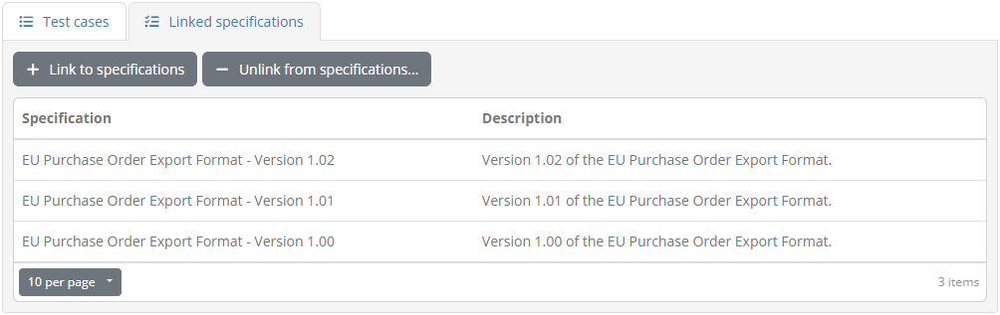

To link the test suite with another specification click the **Link to specifications** button. Doing so will present a dialog with
the specifications available to link the test suite with.

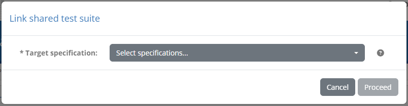

To proceed select the desired specification(s) and click on **Proceed**. At this point you may be presented with an
additional confirmation screen in case matching information is found in any of the selected specifications. Specifically:

* In case a specification defines a different test suite with the same identifier you will see this highlighted and the linking marked as
  skipped.
* In case a specification already defines actors, endpoints and endpoint parameters matching the test suite's data, you will be prompted to
  choose whether these will remain unchanged or will be updated to match the test suite archive.

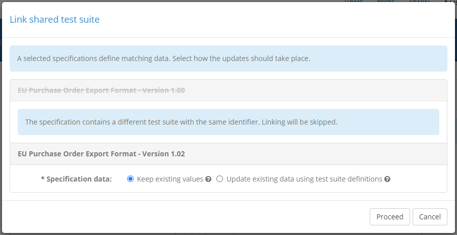

Once you have reviewed and completed these choices you may click on **Proceed** to complete the link. Clicking on **Cancel** at any time will
close the dialog without any actions.

To unlink a test suite from one or more specifications you may click the **Unlink from specifications...** button. Doing so will present
checkboxes alongside each specification allowing you to unlink multiple specifications in one go.

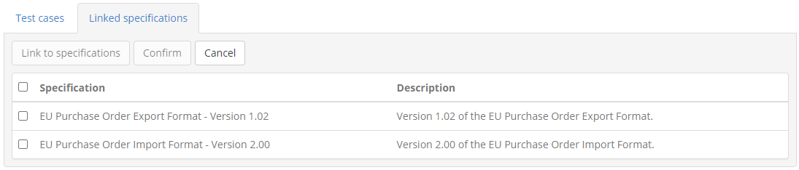

To proceed, select one or more specifications and click on **Confirm**. Note that unlinking a test suite from a specification does not
delete the test suite itself nor does it affect its recorded tests.

.. _domains__test_case__details:

Manage test case details
------------------------

To view a test case's details and update its metadata you need to click on the test case's row, displayed in the **Test cases** tab
of the :ref:`test suite details page<domains__test_suite_test_case_list>`.

.. figure:: ../screenshots/admin_domains_test_cases.PNG
  :align: center

Doing so will present you with the test case details screen where you can view and edit the test case's information.

.. figure:: ../screenshots/admin_domains_test_case_details.PNG
  :align: center

An editable form is presented here that displays the metadata for the test case, specifically:

* Its **ID**, used for internal reference by its test suite and to match the test case during uploads. This is a readonly value that is set
  during initial test suite upload.
* Its **name** (required), that you can edit to provide a user-friendly short identifier for the test case. This is presented to users in the
  :ref:`conformance statement details page<manage_your_conformance_statements__view_a_conformance_statements_details__tests>` and during
  :ref:`test execution<execute_tests_interactive>`.
* Its **description** (optional), displayed alongside the test case's name in the :ref:`conformance statement details page<manage_your_conformance_statements__view_a_conformance_statements_details__tests>`
  and during :ref:`test execution<execute_tests_interactive>`. The purpose of this description is to summarise its purpose and steps.
* Whether or not the test case is **optional**. Optional test cases can be executed but are not counted towards a conformance statement's status.
* Whether or not the test case is **disabled**. Disabled test cases are by default hidden and cannot be executed.
* One or more **tags** you can define to highlight traits for the current test case.

If you choose to define **tags** you can add new ones through the **Add** button that opens up a popup to provide the tag's information.

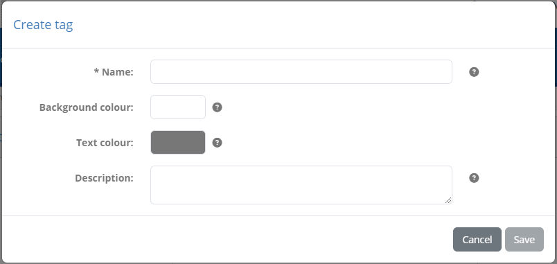

The information to provide here consists of the tag's **name** that will be displayed on the tag, its **background** and **text** colour, as well
as an optional **description** to display in tooltips and report legends. To create the tag click on **Save**, or click on **Cancel** to close the popup
without making changes.

Once tags are defined you can see an editable preview of each along with **edit** and **delete** buttons.

You can also include here an additional set of properties related to the test case's normative **specification reference**. This information
forms part of the test case's metadata, that if completed will figure in the test case's definition file, reports, and on-screen displays.

You can provide here as part of this information a **reference code**, a **description**, as well as a **link** to an online resource where
more information can be found. Providing this information is optional, and depending on what you provide it will be displayed accordingly. For
example providing all information will show the reference code as a link followed by the description, whereas if only a link is provided this
will be displayed as a link icon to follow.

You may also view and edit here the test case's **documentation**. This is displayed to users as part of the
:ref:`conformance statement detail page<manage_your_conformance_statements__view_a_conformance_statements_details__tests>`, its purpose
being to add extended rich documentation that describes the steps to follow and reference external resources. To display the existing
documentation click the **Documentation** section, to reveal a rich text editor.

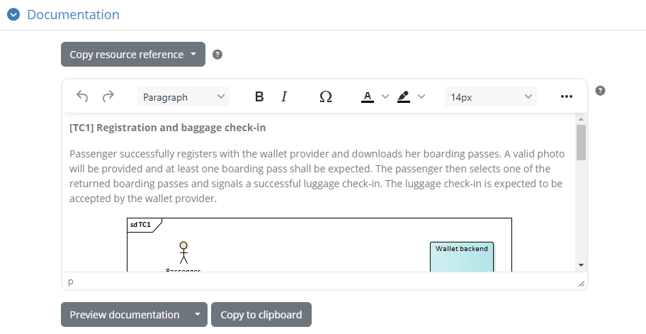

Above the rich text editor you have a **Copy system-wide resource reference** control that allows you to search in-place your :ref:`system resources <systemAdmin__resources>`,
such as images to include or files to add download links for. Once you find the resource you're looking for you can click it to copy its reference
to the clipboard. You can then use this reference as e.g. the source of an image file or the target of a link.

.. note::

  Unlike community administrators, you cannot search and include :ref:`community-specific resources <community__manage_resources>` here because the relevant domain
  could be linked to multiple communities.

If you choose to provide such documentation you may also click the **Preview documentation** to ensure it matches your expectations. Doing so
presents a popup with the documentation, displaying it exactly as when viewed by your users.

.. figure:: ../screenshots/conformance_statement_details_tests_documentation_popup.PNG
  :align: center

The **Preview documentation** button offers also a secondary option termed **Preview documentation in PDF report**. This allows you to preview
how the documentation will display in PDF exports, given that :ref:`test case reports<view_your_test_history__search__export>` include their
documentation as an annex. Selecting the option will generate a PDF report that you can inspect to ensure everything appears as expected.

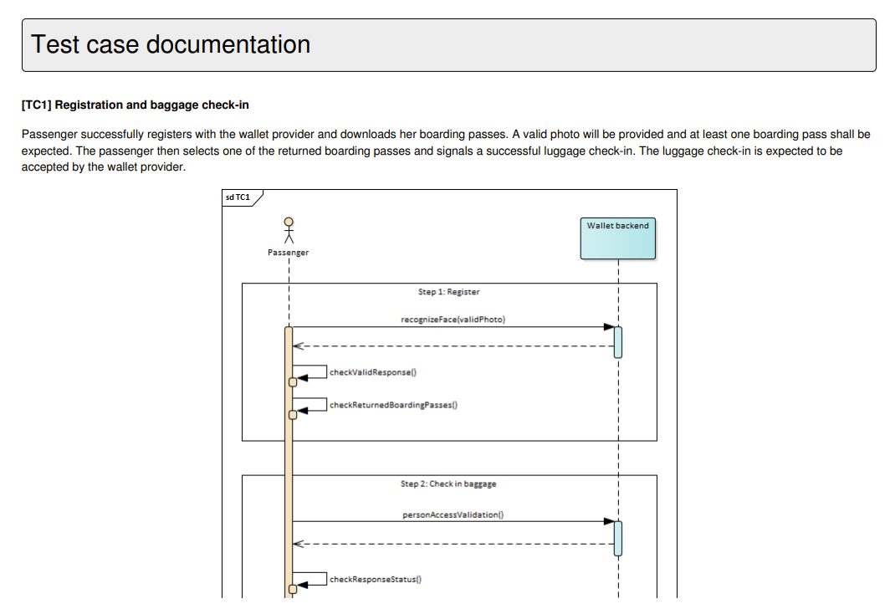

.. note::

  **Image display problems in PDF reports:** If you notice that PDF reports fail to render defined images you may
  need to adapt slightly your HTML content. This may occur for an image whose size is specified as a percentage and that is included in a table.
  If this is the case either specify a fixed pixel width for the image, or move it outside the table.

Once you have introduced documentation for the test case you may also click the **Copy to clipboard** button that will copy the documentation's
HTML source. You can use this to inspect the documentation in an editor or to store it within your test suite archive (in case you refer to
the documentation from the test case definition file).

Beneath the test case details' form you are presented also with an additional panel to **preview the test case**. This displays the test execution
diagram for the test case, as it will be presented to users, allowing you to visualise its steps.

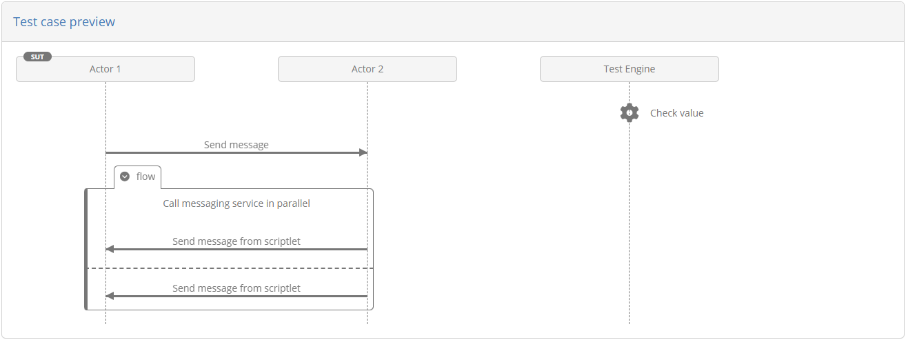

.. note::
  **Update via test suite upload:** A test case's name, description and documentation can also be updated via
  :ref:`test suite upload<domains__specification__test_suite_upload>`. When uploading a new version for a test suite you can choose whether
  the values you have been editing through the user interface are to be kept or replaced. The test case's content (i.e. its steps) on the
  other hand can only be changed via upload.

To persist your changes click on the **Save changes** button. Clicking on **Back** will discard any changes and return you to the
:ref:`test suite details page<domains__test_suite_details>`.

.. _domains__actor:

Manage actor details
--------------------

To view an actor's details and edit its information you need to click on the actor's row, displayed in the **Actors** table
of the :ref:`specification details page<domains__specification>`.

.. figure:: ../screenshots/admin_domains_specification_actors.PNG
  :align: center

Doing so will take you to the actor details screen. This is split in two sections:

* The **Actor details** section, presenting the actor's information.
* The **Configuration parameters** tab, listing the parameters configured for this actor.

In the **Actor details** section you are presented with a form to view and edit the actor's information.

.. figure:: ../screenshots/admin_domains_actor_details.PNG
  :align: center

The following information is presented in corresponding form controls:

* The actor's **ID** (required), used for display purposes and to refer to the actor in test suites.
* A **name** (required), displayed in detail screens and reports, as well as the test execution screen.
* A **description** to provide more context on the actor's purpose (optional), displayed in detail screens and reports.
* Custom **report metadata** to include in XML reports.
* The actor's **display order** (optional), used to determine where the actor should be displayed in the test execution diagram (see :ref:`execute_tests`).
  If provided this should be an integer that will be compared to the other specification actors' display order to determine the presentation order. An actor
  with a configured value will be displayed before actors with a larger value or ones that have no value configured.
* Whether or not the actor is the **specification default**. Only one default actor can be defined for a specification which will be preselected when creating
  new conformance statements.
* Whether or not the actor should be **hidden**. Hidden actors are valid for reference purposes but are not presented to users when creating conformance
  statements. They can be used to hide simulated actors or deprecate ones that have been previously used without affecting existing test sessions.
* The actor's **REST API key** that is used to identify the actor when launching tests via the :ref:`Test Bed's REST API<api>` (if the REST API is enabled).
  The readonly key value is automatically generated, and can be copied to your clipboard using the provided **copy** control.
* Whether or not **conformance badges** are enabled for the actor (see their explanation in the :ref:`actor creation screen <domains__specification__create_actor>`).

To edit the actor's information, enter the new values you require and click the **Save changes** button. Clicking the **Delete** button will,
following confirmation, delete the actor and all related information. The **Back** button does not make any changes but takes you back to the
:ref:`specification's detail screen<domains__specification>`.

.. _domains__actor__endpoint_list:

The **Configuration parameters** tab presents actor-related information that varies per conformance statement. They
are displayed in a table with one row per parameter.

.. figure:: ../screenshots/admin_domains_endpoint_parameters.PNG
  :align: center

For each parameter the following information is displayed:

* Its **name**, used for display purposes and as an identifier when referring to the parameter (e.g. within test cases).
* Its **description**, used to provide context to users on the parameter's purpose.
* Its **type**, either "Simple" for a simple text value, "Binary" for files or "Secret" for secret texts.
* A **required** flag, determining whether the parameter needs to be provided before executing tests.
* An **editable** flag, determining whether the parameter can be edited by users or is reserved to administrators.
* An **included in tests** flag, determining whether or not the parameter is included as a variable within test sessions.
* A **hidden** flag, determining whether or not a non-editable parameter is is also to be hidden from organisation users.

Clicking on a parameter's row will open a popup to :ref:`view and edit its information<domains__endpoint__edit_parameter>`. To manually 
:ref:`create a new parameter<domains__endpoint__create_parameter>` click the **Create parameter** button.

.. note::
    **Automatic vs manual parameter creation:** Actor configuration parameters can also be created automatically during :ref:`test suite upload<domains__specification__test_suite_upload>`.

.. _domains__endpoint__create_parameter:

Create parameter
~~~~~~~~~~~~~~~~

To create a new actor parameter manually (as opposed to automatically via test suite upload) click the **Create parameter** button.

.. figure:: ../screenshots/admin_domains_endpoint_parameters_header.PNG
  :align: center

Doing so opens a popup screen in which you need to provide the information for the new parameter.

.. figure:: ../screenshots/admin_domains_endpoint_parameters_create.PNG
  :align: center

The information to provide for the parameter is:

* Its **name** (required), used for display purposes.
* The **key** (required), used to refer to the parameter within test cases.
* Its **description** (optional), used to provide context to users on the parameter's purpose.
* Its **value type** (required), either "Simple" for a simple text value, "Binary" for files or "Secret" for secret texts.
* Its **properties**, specifically whether is is required, editable by users, included in test sessions and hidden.

Whether or not parameters are set as editable and included in test sessions provides flexibility in collecting, setting and
sharing configuration by and towards users. A parameter set as not editable could be used by administrators as
a way to provide a user with a given input that is needed during test execution (e.g. a generated
certificate). Furthermore, non-editable parameters set as hidden are never presented to organisation users and as such are ideal as control
flags. Such flags could set manually by administrators when :ref:`managing the tests of an organisation<community__manage_organisation__tests>`
and viewing a :ref:`conformance detail page<manage_your_conformance_statements__view_a_conformance_statements_details__endpoints>` or
automatically via a conformance statement :ref:`trigger<community__manage_triggers>`.

.. note::
  **Organisation and system properties:** Actor parameters can be seen as input and configuration properties that are
  relevant to a system's specific conformance statement. For information that is more high-level, you may also use
  :ref:`system or organisation properties<community__properties>` when this is linked, respectively, to a system or a complete
  organisation. Finally, parameters can also be :ref:`set at domain level<domains__domain__parameter_list>`, applying to a
  complete domain or community.

  All configuration parameters can be edited manually but also automatically through :ref:`triggers<community__manage_triggers>`.

The **Preset values** apply to simple parameters (i.e. text) and allow you to define a preset list of values for the parameter that
will appear as a dropdown selection list. For each such value you can define a user-friendly **label** and the property's actual **value**,
using the provided controls to **add** new values, **remove** existing ones or change their **display order**.

.. figure:: ../screenshots/admin_community_properties_presets.PNG
  :align: center

The **Depends on** field is optional and allows you to define a prerequisite condition for this parameter. To set such a prerequisite you need to select another parameter
from the provided list and specify to its left in the provided text field (or dropdown selection if the parameter has preset values) the value that it needs to have for the
current parameter to be enabled. A parameter that misses any of its prerequisite conditions (i.e. its direct prerequisite or a prerequisite's prerequisite) will
be considered inactive, even if set as required, and will be excluded from input forms and test sessions. Using such dependencies is a powerful mechanism to define conditional
inputs based on other parameters or external processing (e.g. via :ref:`triggers<community__manage_triggers>`).

.. note::
  Properties of **binary** or **secret** type cannot be used as prerequisites.

The **Default value** input is available for simple text properties and represents the parameter's default value for
new conformance statements. Users may override this value when :ref:`editing their conformance statement's configuration<manage_your_conformance_statements__view_a_conformance_statements_details__endpoints>`.

To complete the creation of the parameter, click the **Save** button. To cancel and close the popup click the **Cancel** button.

.. _domains__endpoint__edit_parameter:

Edit parameter
~~~~~~~~~~~~~~

To edit a parameter click its corresponding row from the **Parameters** table.

.. figure:: ../screenshots/admin_domains_endpoint_parameters.PNG
  :align: center

Doing so opens a popup screen presenting the details of the parameter in editable form fields.

.. figure:: ../screenshots/admin_domains_endpoint_parameters_edit.PNG
  :align: center

The purpose of all fields and usage of available controls is identical to the :ref:`create parameter<domains__endpoint__create_parameter>` case.
To edit the parameter's information, enter the new values you require and click the **Save** button. Clicking the **Delete** button will,
following confirmation, delete the parameter. The **Cancel** button closes the popup without making any changes.

.. _domains__endpoint__order_parameters:

Change parameter ordering
~~~~~~~~~~~~~~~~~~~~~~~~~

By default parameters are ordered alphabetically based on their name. You may override this default ordering by reordering the parameters as needed and saving their
relative positions. This is done through the table listing the parameters, by using the **move** buttons at each row's right end, to drag and drop them into their
desired ordering.

.. figure:: ../screenshots/admin_domains_endpoint_parameters.PNG
  :align: center

Once you have reordered parameters in this way you will notice that the **Save parameter order** button becomes enabled. You will need to click this to confirm and
persist the displayed ordering.

.. _domains__endpoint__manage_endpoints:

Parameter endpoints
~~~~~~~~~~~~~~~~~~~

You may have noticed when :ref:`creating a parameter <domains__endpoint__create_parameter>` that the **Create parameter** button offers also
a second option titled **Create endpoint**.

.. figure:: ../screenshots/admin_domains_endpoint_parameters_header.PNG
  :align: center

Endpoints are a feature that was **deprecated** as of release 1.24.0 as it offered little additional value and made actor-specific
configuration properties less accessible. Endpoints are a means of grouping together configuration properties, of which you could
in theory have multiple. In practice you should only ever need one, so when you define an actor, an implicit *config* endpoint is also
created and subsequently hidden from view.

For backwards compatibility reasons you can still directly create and subsequently manage endpoints, although you are advised not to do so.
For the same reason, the endpoint management screens are not documented here given that the meaningful actions - managing parameters - is
identical to those performed directly under actors.

.. note::
  **Endpoints defined in the GITB TDL**: Even though direct management of endpoints via the user interface is not advised, this still remains
  the way to define actor configuration properties in `GITB TDL test suite definitions <https://www.itb.ec.europa.eu/docs/tdl/latest/testsuite/index.html#endpoints-for-simple-configuration-values>`__. Once defined however, the endpoint as a concept will be
  hidden on the user interface, displaying instead directly the parameters.

.. _AUTOMATION_API_ENABLED: https://www.itb.ec.europa.eu/docs/guides/latest/installingTheTestBedProduction/index.html#configuration-properties
.. _production: https://www.itb.ec.europa.eu/docs/guides/latest/installingTheTestBedProduction/
.. _development: https://www.itb.ec.europa.eu/docs/guides/latest/installingTheTestBed/
