.. _domains:

Manage test configuration
=========================

As community administrator you are responsible with setting up the specifications that your organisations are expected to conform to
as well as the test suites to verify this. Managing this information is possible through the **Domain Management** screen. To access 
this click on the **ADMIN** link from the screen's header.

.. figure:: ../screenshots/header_admin.PNG
  :align: center

Doing so presents you with a left side menu containing links to administrative functions, of which you need to click 
the **Domain Management** link.

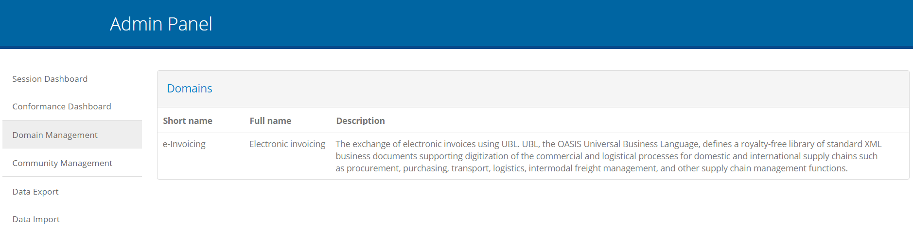

.. _domains__domain_view:

Domain list
-----------

The first screen you access is the display of the domains relevant to your community. These are configured for you by the test bed
administrator at the time your community is created. Typically you would always have a single domain linked to your community over which
you have full access.

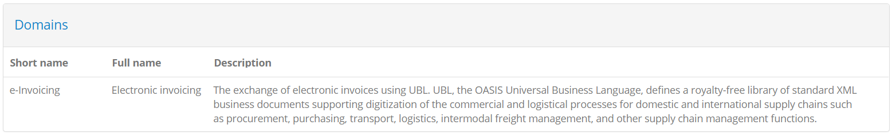

The presented table includes one row per domain for which the following information is displayed:

* The **short name** for the domain, used when the domain is mentioned in list displays.
* The **full name** for the domain, used in detail displays and reports.
* A **description** for the domain to provide context over what the domain relates to.

To proceed within a domain's details click its relevant row from the table.

.. note::
    **Providing context to users:** The information you provide for the domain as well as further concepts such as the specification 
    and actor are important to provide context to your users. This information should summarise what they are testing for, whereas 
    the name and description of test cases and test suites should summarise how they are supposed to test.

.. _domains__domain_details:

Manage domain details
---------------------

The domain detail screen is where you can edit a domain's properties. It is split in three sections:

* The **Domain Details** section, to view and edit the domain's information.
* The **Specifications** section to manage the domain's specifications (see :ref:`domains__domain__specification_list`).
* The **Parameters** section to manage configuration parameters used in test cases (see :ref:`domains__domain__parameter_list`).

In the **Domain Details** section you are presented with a form to view and edit the domain's information.

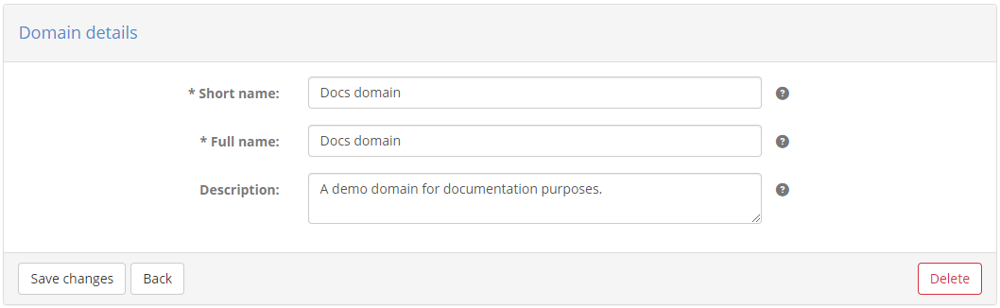

The following information is presented in corresponding form controls:

* The domain's **short name** (required), displayed in lists.
* Its **full name** (required), displayed in detail screens and reports.
* Its **description** (optional), displayed in details screens and reports.

To edit the domain's information, enter the new values you require and click the **Save changes** button. Clicking the **Delete** button will,
following confirmation, delete the domain and all related information. The **Back** button does not make any changes but takes you back to the
domain list screen (see :ref:`domains__domain_view`).

.. _domains__domain__specification_list:

Specification list
~~~~~~~~~~~~~~~~~~

The **Specifications** section presents a table with the domain's configured specifications. These represent the elements of your project's
specifications that you want your organisations to conform to (see :ref:`introduction__glossary__specification`). 

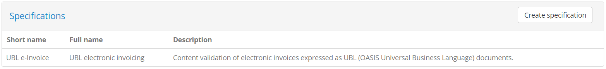

Each specification is presented in a separate row, in which the following information is provided:

* The specification's **short name**, used in list displays.
* Its **full name**, used in detail screens and reports.
* Its **description**, used in detail screens and reports.

Clicking on a specification's row will take you to its detail page (see :ref:`domains__specification`). To create a new specification click the **Create specification**
button from the table's header (see :ref:`domains__domain_create_specification`).

.. _domains__domain_create_specification:

Create specification
~~~~~~~~~~~~~~~~~~~~

Creating a new specification is done by clicking the **Create specification** button from the **Specifications** list header.

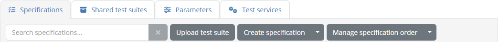

Doing so presents you a screen in which you need to provide the information for the new specification.

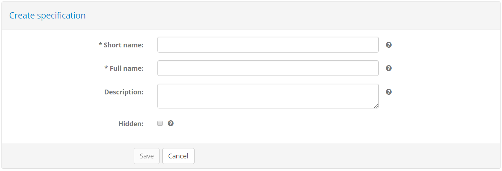

The information to provide for the specification is:

* The specification's **short name** (required), displayed in list views.
* Its **full name** (required), displayed in detail screens and reports.
* A set of comma-separated **related URLs** that are pertinent to the specification (optional).
* A URL to a **diagram** describing the specification (optional).
* A **description** to provide more context on the specification (optional), displayed in detail screens and reports.
* The **specification type** as a choice between "Integration Profile" and "Content Specification" (optional).

To complete the creation of the specification click the **Save** button. To cancel and return to the domain detail page (see :ref:`domains__domain_details`) 
click the **Cancel** button.

.. note::
    **Specification metadata:** From the information you are requested to provide only the specification's **short name**, **full name** and **description**
    are currently used. The additional information is recorded as metadata but not currently displayed.

.. _domains__domain__parameter_list:

Parameter list
~~~~~~~~~~~~~~

The **Parameters** section presents the configuration parameters defined at domain level. These are configuration values that are expected to be defined
within the `GITB TDL test cases`_ that you upload to the test bed. They typically relate to information you don't want to include in test cases either
because they would hinder portability (e.g. service URLs), they are sensitive (e.g. service authentication credentials), or they are settings that apply
to all test cases that are subject to change. 

.. _GITB TDL test cases: https://www.itb.ec.europa.eu/docs/tdl/latest/expressions/index.html#referring-to-domain-configuration-parameters

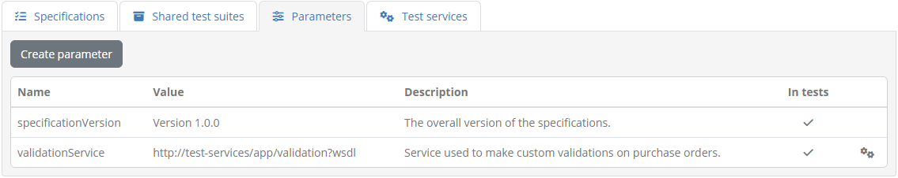

The domain's parameters are presented in a table with one parameter per row. The information provided for each parameter is:

* Its **name**, used to identify the parameter and also refer to it through test cases.
* Its **description** to provide context on the purpose of the parameter.
* Its **value**, which in the case of sensitive parameters is hidden.

To create a new parameter click the **Create parameter** button (see :ref:`domains__domain_create_parameter`). To edit an existing one click its 
corresponding table row (see :ref:`domains__specification`).

.. _domains__domain_create_parameter:

Create parameter
~~~~~~~~~~~~~~~~

Creating a new domain parameter is done by clicking the **Create parameter** button from the **Parameters** list header.

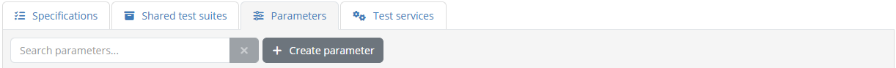

Doing so presents you a screen in which you need to provide the information for the new parameter.

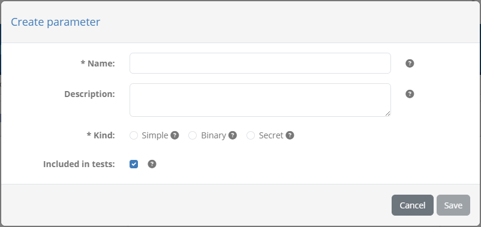

The information requested in this form is:

* The **name** of the parameter (required), used to identify it and refer to it from test cases.
* The **description** of the parameter (optional).
* The **kind** of parameter it is, choosing from either "Simple", "Binary" or "Hidden" (required).

Depending on whether you select that this is a "Simple", "Binary" or "Hidden" parameter the screen will be adapted to request its value.
Selecting "Simple" means that this is a simple text value that can be entered and displayed as-is. In this case the screen will 
adapt to request additionally the parameter's **value** (required)

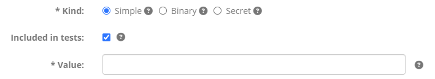

If selected to be a "Binary" parameter, you are presented with an **Upload** button to provide the file in question. Once set, 
the file is displayed as a link to download.

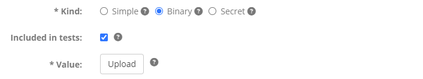

Finally, if you select that the parameter is "Hidden", the screen will adapt to request an obfuscated **value** (required), requesting
you also to **repeat** it to ensure that you have entered it correctly. Hidden parameters are treated similar to passwords, in that they will
never be presented on-screen.

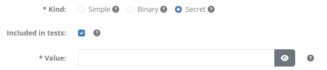

To complete the creation of the parameter click the **Save** button. Clicking the **Cancel** button closes the popup without making changes.

.. _domains__domain_edit_parameter:

Edit parameter
~~~~~~~~~~~~~~

To edit a domain parameter click its corresponding row from the **Parameters** table.

Doing so will open a popup screen presenting you the parameter's current information, provided in editable fields.

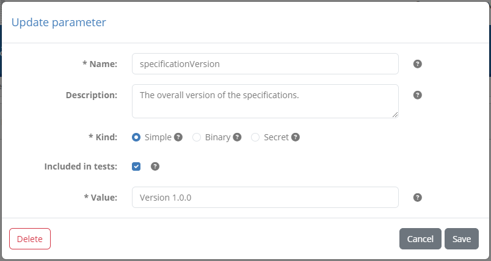

The fields presented for the parameter are:

* The **name** of the parameter (required), used to identify it and refer to it from test cases.
* The **description** of the parameter (optional).
* The **kind** of parameter it is, choosing from either "Simple", "Binary" or "Hidden" (required).
* The **value** of the parameter, presented either as a text input (if **kind** is "Simple"), a downloadable link (if **kind** is "Binary") or a repeated text input (if **kind** is "Hidden").

Once you adapt the parameter's information click the **Save** button to record your changes or the **Cancel** button to discard them. Clicking the 
**Delete** button removes, upon confirmation, the parameter.

.. _domains__specification:

Manage specification details
----------------------------

To view a specification's details and edit its information you need to click on the specification's row, displayed in the **Specifications** table
of the domain details page (see :ref:`domains__domain_details`).

Doing so will take you to the specification details screen. This is split in three sections:

* The **Specification details** section, presenting the specification's information.
* The **Test suites** section, listing the test suites that are configured for this specification (see :ref:`domains__specification__test_suite_list`).
* The **Actors** section, listing the actors configured for the specification (see :ref:`domains__specification__actor_list`).

In the **Specification details** section you are presented with a form to view and edit the specification's information.

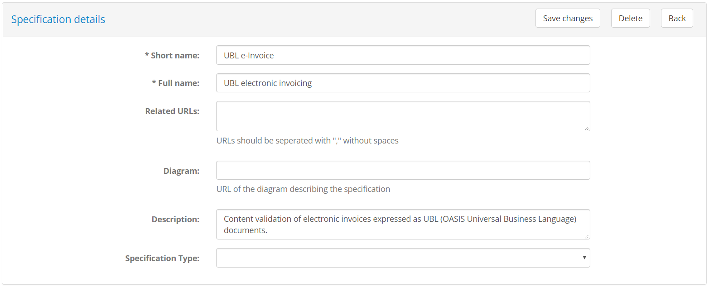

The following information is presented in corresponding form controls:

* The specification's **short name** (required), displayed in list views.
* Its **full name** (required), displayed in detail screens and reports.
* A set of comma-separated **related URLs** that are pertinent to the specification (optional).
* A URL to a **diagram** describing the specification (optional).
* A **description** to provide more context on the specification (optional), displayed in detail screens and reports.
* The **specification type** as a choice between "Integration Profile" and "Content Specification" (optional).

To edit the specification's information, enter the new values you require and click the **Save changes** button. Clicking the **Delete** button will,
following confirmation, delete the specification and all related information. The **Back** button does not make any changes but takes you back to the
specification domain's detail screen (see :ref:`domains__domain_details`).

.. _domains__specification__test_suite_list:

Test suite list
~~~~~~~~~~~~~~~

The **Test suites** section presents the test suites that have been configured for the specification. They are presented in a table with one row per
test suite.

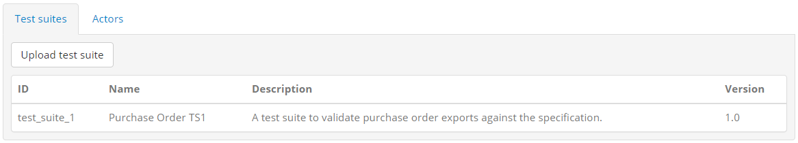

For each test suite the following information is displayed:

* The **name** of the test suite. This is presented to users as a short identifier for the test suite.
* Its **description**. This typically would include information on the purpose of the test suite and potentially instructions relevant to all its test cases.
* Its **version**. This is metadata that is recorded but not presented to users.

Each row includes a **delete** button, presented with a cross icon under the **operation** header. Clicking this will, following confirmation, delete the 
test suite and its contained test cases. In addition, you may also **download** the test suite ZIP archive by clicking on its relevant row. Doing so will prompt
you for the location to save the test suite archive.

.. _domains__specification__test_suite_upload:

Upload test suite
~~~~~~~~~~~~~~~~~

To add a new test suite for a specification you need to upload it using the **Deploy test suite** button from the test suite section's header. 

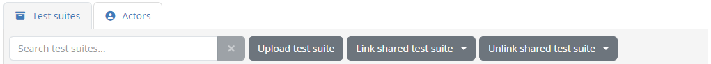

Recall that test suites are ZIP archives containing a test suite's XML file, one or more test case XML files, and the resources they use. The
test suite and test case XML files are authored in the `GITB TDL`_ for which online documentation is provided specifically on `test suite packaging and
deployment`_.

.. _GITB TDL: https://www.itb.ec.europa.eu/docs/tdl/latest/
.. _test suite packaging and deployment: https://www.itb.ec.europa.eu/docs/tdl/latest/testsuite/index.html#deploying-a-test-suite-in-the-gitb-software

Clicking on the **Deploy test suite** button opens a file browser (for ZIP archives) for you to retrieve the test suite to upload. Once this is selected
the test bed validates the uploaded archive to ensure that it is a valid test suite. This validation goes beyond simple syntax checking by verifying
included expressions, variable references and correct use of all GITB TDL elements. In case your uploaded test suite has errors these will be presented to you
in a validation result dialog displaying:

* An error code and description of the validation finding.
* The relevant test suite file as the location of the problem.

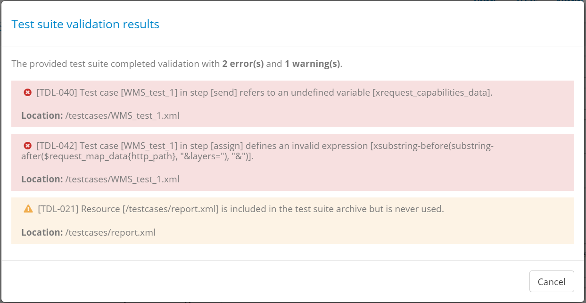

The presence of errors blocks the test suite upload as these are guaranteed to always result in test session errors. In this case your only option is to 
review the validation report and click the **Cancel** button. In case only warnings have been raised, these are still presented to you but you are also
given the option to ignore them.

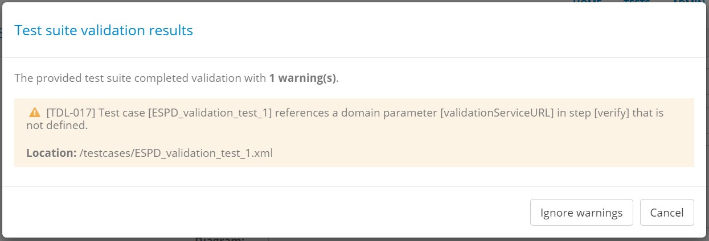

Such warnings will not necessarily lead to test session errors but should nonetheless be reviewed to ensure nothing has been neglected. Examples of 
warnings are supporting resources that are not used in test cases or references to missing domain parameters (see :ref:`domains__domain_details`).
You may now choose to abort the test suite upload by clicking the **Cancel** button or click the **Ignore warnings** button to proceed.

.. note::
    **Uploading valid test suites:** If an uploaded test suite is fully valid (i.e. its validation results in no errors or warnings) the validation
    report step is completely skipped.

For a fully valid test suite, or a test suite with warnings you have chosen to ignore, what takes place next depends on whether or not the test suite 
already exists (i.e. its name matches that of a test suite already uploaded for the specification). In case this test suite already 
exists you will be prompted with a choice on how to consider the upload.

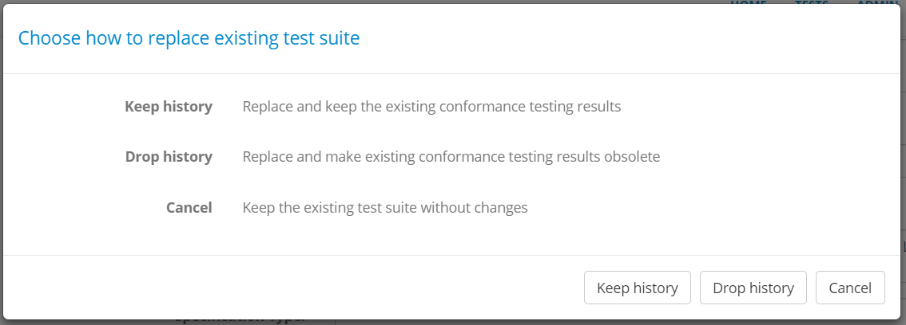

You can make one of three choices:

* Click the **Keep history** button to replace the test suite without further consequences on already existing conformance tests. Select this
  if you are adding new test cases or if any changes you have made are minor and don't require retesting.
* Click the **Drop history** button to replace the test suite but also render obsolete any existing conformance test results. Select this if
  you are introducing significant changes that require all tests to be repeated.
* Click the **Cancel** button to stop the update and prevent any changes.

If the test suite upload proceeds, either because you choose to do so or because the test suite is a new one, you will be presented with an upload
outcome popup. This details what was added, modified, or left unchanged as a result of the upload.

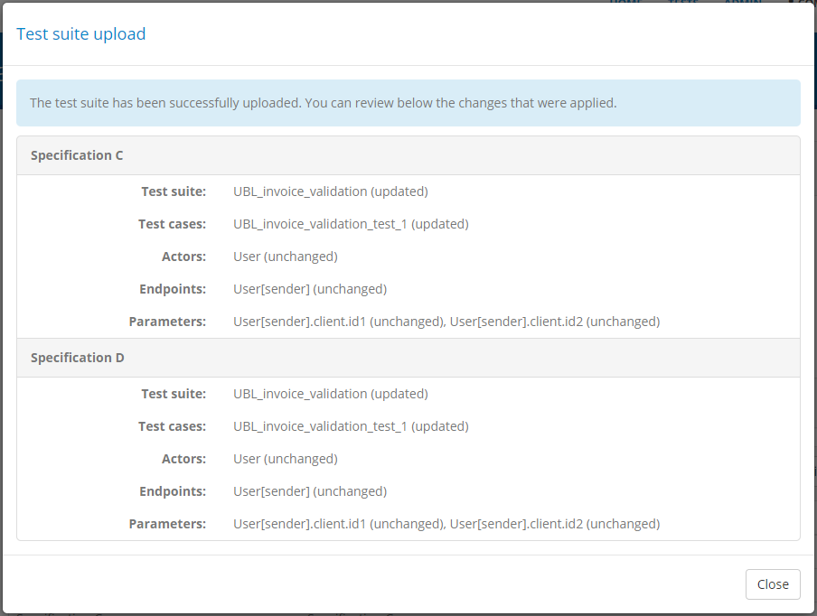

The reason this information is presented is because a number of things happen under the hood once you upload a test suite. It does not only add the 
test suite in question and its test cases but it will also proceed to automatically create the actors, endpoints and endpoint parameters defined within
or update them if they already exist. For each such item the following information is presented:

* The **test suite** that was affected. This will either be marked as "added" or "updated" depending on whether or not the test suite already existed.
* The **test cases** that were handled. Test cases present in the uploaded test suite that did not previously exist are presented as "added", others
  that matched existing ones are presented as "updated", whereas test cases that existed previously but are removed from the latest test suite are
  reported as "deleted".
* The **actors** that were referenced. These will either be reported as "added" for those defined in the test suite that did not previously exist,
  "updated" for those defined in the test suite and already present in the specification, or "unchanged" for those that were defined in the test suite
  as references, without their complete information.
* The **endpoints** that were managed. These will either be "added" for new ones, "updated" for already existing ones, or "unchanged" for those that
  already existed but were not defined in the test suite.
* The **parameters** that were managed. These will either be "added" for new ones, "updated" for already existing ones, or "unchanged" for those that
  already existed but were not defined in the test suite.

.. note::
    **Automatic updates following test suite upload:** When uploading a test suite a series of automatic updates may take place (as described above).
    If you manage your domain's entities manually through the test bed, uploading a test suite could overwrite your existing information. On the other
    hand it could be helpful to use the automatic update process if you choose to define everything in test suites. Either way make sure you are aware
    of what may occur automatically. In addition, keep in mind that this automatic update process **never deletes information** (with the exception of 
    obsolete test cases). If you want to fully remove e.g. obsolete actors or endpoints you will need to do so through the test bed's interface.

.. _domains__specification__actor_list:

Actor list
~~~~~~~~~~

The **Actors** section presents the actors configured for the specification. They are presented in a table with one row per actor.

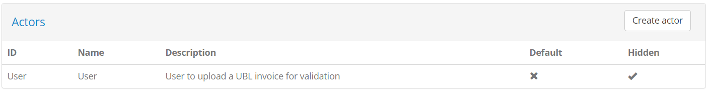

For each actor the following information is displayed:

* The **ID** of the actor, used for display purposes as a short name and also to reference the actor from test suites.
* Its **name**, as the complete actor name to show in detail screens and reports. This is also the name presented to users during test
  execution, unless this is overridden at test case level.
* Its **description**, displayed in details screens and reports to provide more information about the actor.
* Whether or not the actor is the specification's **default**. The default actor is the one that will be preselected as the SUT when creating new 
  conformance statements for the specification.
* Whether or not the actor is set as **hidden**. Hidden actors are not presented to users during the creation of conformance statements.

Clicking on an actor's row will take you to its detail page (see :ref:`domains__actor`). To manually create a new actor click the **Create actor**
button from the table's header (see :ref:`domains__specification__create_actor`).

.. note::
    **Automatic vs manual actor creation:** Actors can also be created automatically during test suite upload as long as their complete
    information is provided. If you prefer to manually create actors through the test bed's interface you should opt to refer to these
    using their ID rather than define them fully from within test suites (see the `GITB TDL documentation`_ for more details).

.. _GITB TDL documentation: https://www.itb.ec.europa.eu/docs/tdl/latest/testsuite/index.html#deploying-a-test-suite-in-the-gitb-software

.. _domains__specification__create_actor:

Create actor
~~~~~~~~~~~~

To create a new actor manually (as opposed to automatically via test suite upload) click  the **Create actor** button from the **Actors** list header.

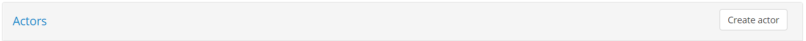

Doing so presents you a screen in which you need to provide the information for the new actor.

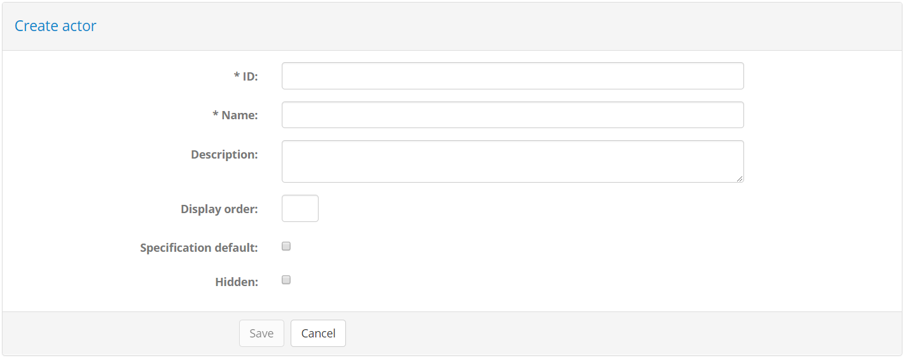

The information to provide for the actor is:

* The actor's **ID** (required), displayed in list views and used to reference the actor within test suites.
* Its **name** (required), displayed in detail screens and reports, as well as in the test execution screen (unless overridden at test case level).
* A **description** to provide more context on the actor's purpose (optional), displayed in detail screens and reports.
* The actor's **display order** (optional), used to determine where the actor should be displayed in the test execution diagram (see :ref:`execute_tests`).
  If provided this should be an integer that will be compared to the other specification actors' display order to determine the presentation order. An actor
  with a configured value will be displayed before actors with a larger value or ones that have no value configured.
* Whether or not the actor is the **specification default**. Only one default actor can be defined for a specification which will be preselected when creating
  new conformance statements.
* Whether or not the actor should be **hidden**. Hidden actors are valid for reference purposes but are not presented to users when creating conformance
  statements. They can be used to hide simulated actors or deprecate ones that have been previously used without affecting existing test sessions.

To complete the creation of the actor click the **Save** button. To cancel and return to the specification's detail page (see :ref:`domains__specification`) 
click the **Cancel** button.

.. _domains__actor:

Manage actor details
--------------------

To view an actor's details and edit its information you need to click on the actor's row, displayed in the **Actors** table
of the specification details page (see :ref:`domains__specification`).

Doing so will take you to the actor details screen. This is split in two sections:

* The **Actor details** section, presenting the actor's information.
* The **Endpoints** section, listing the endpoints configured for this actor (see :ref:`domains__actor__endpoint_list`).

In the **Actor details** section you are presented with a form to view and edit the actor's information.

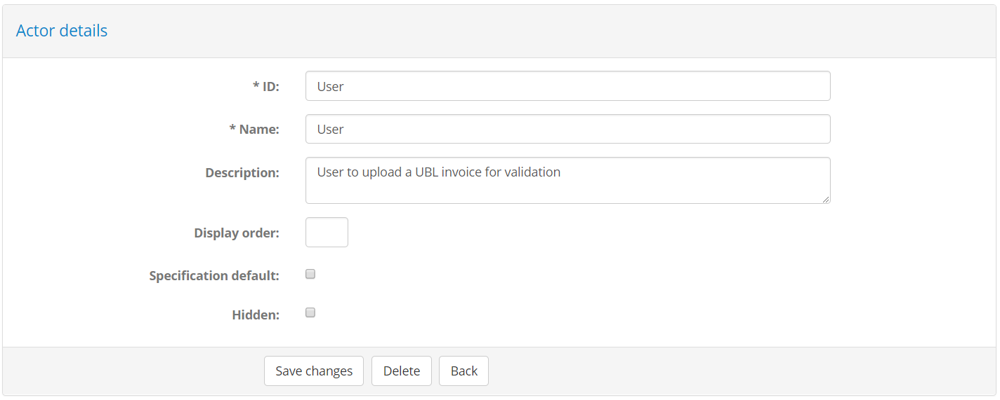

The following information is presented in corresponding form controls:

* The actor's **ID** (required), used for display purposes and to refer to the actor in test suites.
* A **name** (required), displayed in detail screens and reports, as well as the test execution screen.
* A **description** to provide more context on the actor's purpose (optional), displayed in detail screens and reports.
* The actor's **display order** (optional), used to determine where the actor should be displayed in the test execution diagram (see :ref:`execute_tests`).
  If provided this should be an integer that will be compared to the other specification actors' display order to determine the presentation order. An actor
  with a configured value will be displayed before actors with a larger value or ones that have no value configured.
* Whether or not the actor is the **specification default**. Only one default actor can be defined for a specification which will be preselected when creating
  new conformance statements.
* Whether or not the actor should be **hidden**. Hidden actors are valid for reference purposes but are not presented to users when creating conformance
  statements. They can be used to hide simulated actors or deprecate ones that have been previously used without affecting existing test sessions.

To edit the actor's information, enter the new values you require and click the **Save changes** button. Clicking the **Delete** button will,
following confirmation, delete the actor and all related information. The **Back** button does not make any changes but takes you back to the
specification's detail screen (see :ref:`domains__specification`).

.. _domains__actor__endpoint_list:

Endpoint list
~~~~~~~~~~~~~

The **Endpoints** section presents the endpoints defined for the actor. They are presented in a table with one row per endpoint.

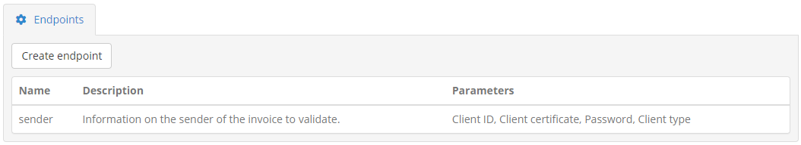

For each endpoint the following information is displayed:

* Its **name**, used for display purposes and to refer to the endpoint within test cases.
* Its **description**, used to provide context to users on the endpoint's purpose.
* A comma-separated list of its defined **parameters**.

Clicking on an endpoint's row will take you to its detail page (see :ref:`domains__endpoint`). To manually create a new endpoint click the **Create endpoint**
button from the table's header (see :ref:`domains__actor__create_endpoint`).

.. note::
    **Automatic vs manual endpoint creation:** Endpoints can also be created automatically during test suite upload.

.. _domains__actor__create_endpoint:

Create endpoint
~~~~~~~~~~~~~~~

To create a new endpoint manually (as opposed to automatically via test suite upload) click  the **Create endpoint** button from the **Endpoints** list header.

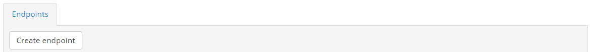

Doing so presents you a screen in which you need to provide the information for the new endpoint.

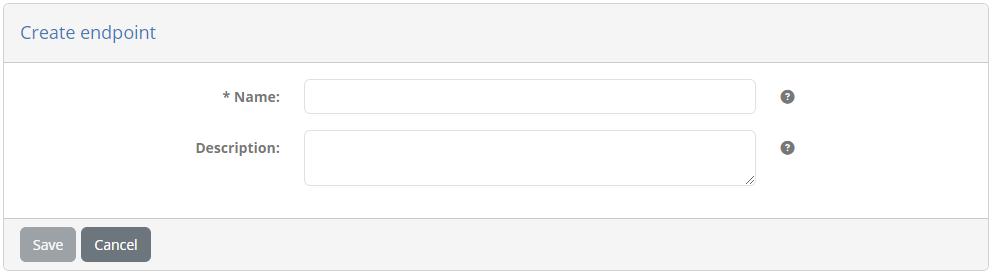

The information to provide for the endpoint is:

* Its **name** (required), displayed in detail screens and used to refer to it from test cases.
* Its **description** to provide more context on the endpoint's purpose (optional).

To complete the creation of the endpoint click the **Save** button. To cancel and return to the actor's detail page (see :ref:`domains__actor`) 
click the **Cancel** button.

.. _domains__endpoint:

Manage endpoint details
-----------------------

To view an endpoint's details and edit its information you need to click on the endpoint's row, displayed in the **Endpoints** table
of the actor details page (see :ref:`domains__actor`).

Doing so will take you to the endpoint details screen. This is split in two sections:

* The **Endpoint details** section, presenting the endpoint's information.
* The **Parameters** section, listing the endpoint's parameters (see :ref:`domains__endpoint__parameter_list`).

In the **Endpoint details** section you are presented with a form to view and edit the endpoint's information.

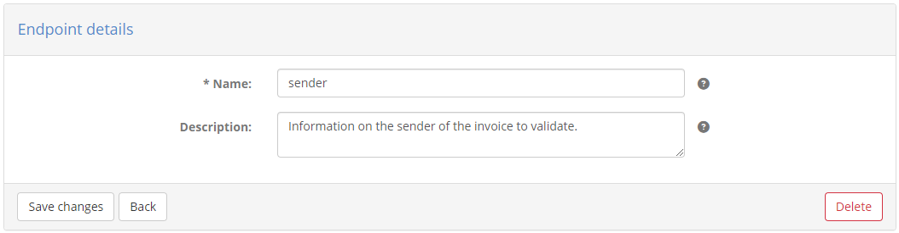

The following information is presented in corresponding form controls:

* the endpoint's **name** (required), displayed in detail screens and used to refer to it from test cases.
* Its **description** to provide more context on the endpoint's purpose (optional).

To edit the endpoint's information, enter the new values you require and click the **Save changes** button. Clicking the **Delete** button will,
following confirmation, delete the endpoint and its parameters. The **Back** button does not make any changes but takes you back to the
actor's detail screen (see :ref:`domains__actor`).

.. _domains__endpoint__parameter_list:

Endpoint parameter list
~~~~~~~~~~~~~~~~~~~~~~~

The **Parameters** section presents the endpoint's parameters. They are presented in a table with one row per parameter.

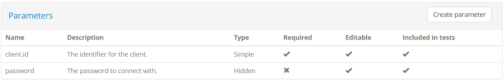

For each parameter the following information is displayed:

* Its **name**, used for display purposes and to refer to the parameter within test cases.
* Its **description**, used to provide context to users on the parameter's purpose.
* Its **type**, either "Simple" for a simple text value, "Binary" for files or "Hidden" for secret texts.
* A **required** flag, determining whether the parameter needs to be provided before executing tests.
* An **editable** flag, determining whether the parameter can be edited by users or is reserved to administrators.
* A **included in tests** flag, determining whether or not the parameter is included as a variable within test sessions.

Clicking on a parameter's row will open a popup to view and edit its information (see :ref:`domains__endpoint__edit_parameter`). To manually create 
a new parameter click the **Create parameter** button from the table's header (see :ref:`domains__endpoint__create_parameter`).

.. note::
    **Automatic vs manual parameter creation:** Endpoint parameters can also be created automatically during test suite upload.

.. _domains__endpoint__create_parameter:

Create endpoint parameter
~~~~~~~~~~~~~~~~~~~~~~~~~

To create a new endpoint parameter manually (as opposed to automatically via test suite upload) click  the **Create parameter** button from the 
**Parameters** list header.

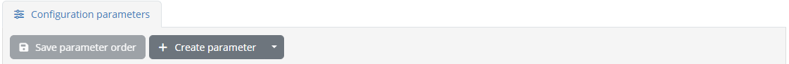

Doing so opens a popup screen in which you need to provide the information for the new parameter.

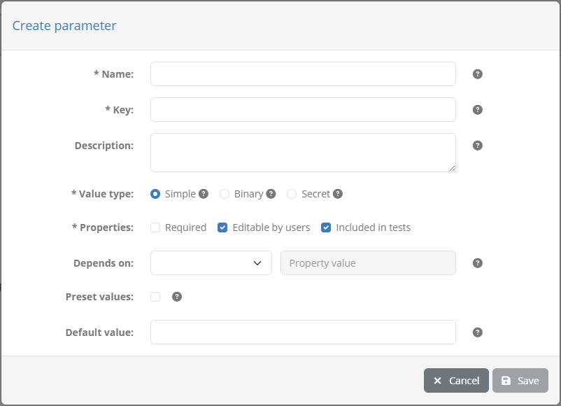

The information to provide for the parameter is:

* Its **name** (required), used for display purposes and to refer to the parameter within test cases.
* Its **description** (optional), used to provide context to users on the parameter's purpose.
* Its **value type** (required), either "Simple" for a simple text value, "Binary" for files or "Hidden" for secret texts.
* Its **properties**, specifically whether is is required, editable by users and included in test sessions.

Whether or not parameters are set as editable and included in test sessions provides flexibility in collecting, setting and
sharing configuration by and towards users. A parameter set as not editable could act as a quality control flag by administrators
or as a way for administrators to provide to a user a given input that is needed during test execution (e.g. a generated
certificate). Similarly, a parameter that is set as not included in tests can be used for data collection purposes for information
that is linked to a specific conformance statement.

.. note::
  **Organisation and system properties:** Endpoint parameters can be seen as input and configuration properties that are 
  relevant to a system's specific conformance statement. For information that is more high-level, you may also use
  :ref:`system or organisation properties<community__properties>` when this is linked, respectively, to a system or a complete
  organisation. Finally, parameters can also be :ref:`set at domain level<domains__domain__parameter_list>`, applying to a
  complete domain or community.

To complete the creation of the parameter click the **Save** button. To cancel and close the popup click the **Cancel** button.

.. _domains__endpoint__edit_parameter:

Edit endpoint parameter
~~~~~~~~~~~~~~~~~~~~~~~

To edit an endpoint parameter click its corresponding row from the **Parameters** table.

Doing so opens a popup screen presenting the details of the parameter in editable form fields.

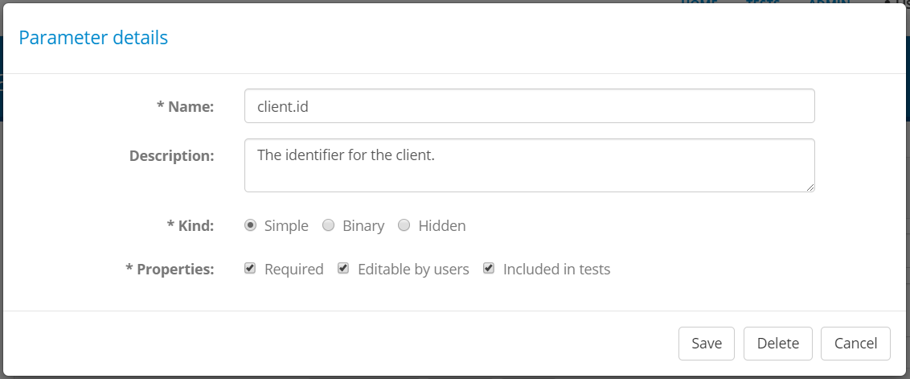

The following information is presented for the parameter in corresponding form controls:

* Its **name** (required), used for display purposes and to refer to the parameter within test cases.
* Its **description** (optional), used to provide context to users on the parameter's purpose.
* Its **value type** (required), either "Simple" for a simple text value, "Binary" for files or "Hidden" for secret texts.
* Its **properties**, specifically whether is is required, editable by users and included in test sessions.

To edit the parameter's information, enter the new values you require and click the **Save** button. Clicking the **Delete** button will,
following confirmation, delete the parameter. The **Cancel** button closes the popup without making any changes.