.. _domains:

Manage test configuration
=========================

As community administrator you are responsible with setting up the specifications that your organisations are expected to conform to
as well as the test suites to verify this. Managing this information is possible through the **Domain Management** screen. To access 
this click on the **ADMIN** link from the screen's header.

.. figure:: ../screenshots/header_admin.PNG
  :align: center

Doing so presents you with a left side menu containing links to administrative functions, of which you need to click 
the **Domain Management** link.

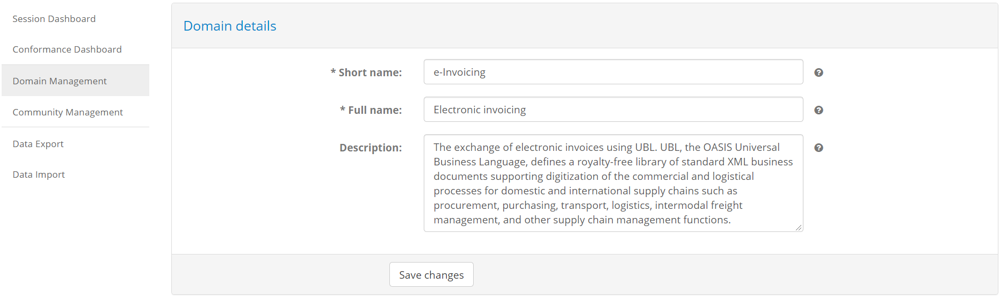

.. note::
    **Community with no domain:** The link between your community and a domain is set by a test bed administrator. If no
    specific domain has been linked to your community your organisations may create conformance statements for any domain,
    however you cannot edit any of their linked information. In this case the **Domain Management** link is not available.

.. _domains__domain_details:

Manage domain details
---------------------

The domain detail screen is where you can edit a domain's properties. It is split in three sections:

* The **Domain details** section, to view and edit the domain's information.
* The **Specifications** section to manage the domain's specifications (see :ref:`domains__domain__specification_list`).
* The **Parameters** section to manage configuration parameters used in test cases (see :ref:`domains__domain__parameter_list`).

In the **Domain details** section you are presented with a form to view and edit the domain's information.

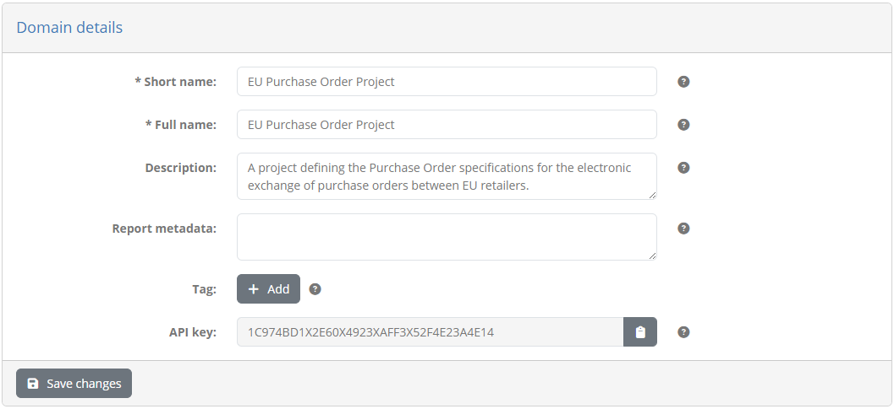

The following information is presented in corresponding form controls:

* The domain's **short name** (required), displayed in lists.
* Its **full name** (required), displayed in detail screens and reports.
* Its **description** (optional), displayed in details screens and reports.

To edit the domain's information, enter the new values you require and click the **Save changes** button.

.. note::
    **Providing context to users:** The information you provide for the domain as well as further concepts such as the specification 
    and actor are important to provide context to your users. This information should summarise what they are testing for, whereas 
    the name, description and documentation of test cases and test suites should summarise how they are supposed to test.

.. _domains__domain__specification_list:

Specification list
~~~~~~~~~~~~~~~~~~

The **Specifications** section presents a table with the domain's configured specifications. These represent the elements of your project's
specifications that you want your organisations to conform to (see :ref:`introduction__glossary__specification`). 

.. figure:: ../screenshots/admin_domains_domain_specifications.PNG
  :align: center

Each specification is presented in a separate row, in which the following information is provided:

* The specification's **short name**, used in list displays.
* Its **full name**, used in detail screens and reports.
* Its **description**, used in detail screens and reports.
* Whether or not the specification is **hidden** from organisation users.

Clicking on a specification's row will take you to its detail page (see :ref:`domains__specification`). To create a new specification click the **Create specification**
button from the table's header (see :ref:`domains__domain_create_specification`).

.. _domains__domain_create_specification:

Create specification
~~~~~~~~~~~~~~~~~~~~

Creating a new specification is done by clicking the **Create specification** button from the **Specifications** list header.

.. figure:: ../screenshots/admin_domains_domain_specifications_header.PNG
  :align: center

Doing so presents you a screen in which you need to provide the information for the new specification.

.. figure:: ../screenshots/admin_domains_domain_create_specification.PNG
  :align: center

The information to provide for the specification is:

* The specification's **short name** (required), displayed in list views.
* Its **full name** (required), displayed in detail screens and reports.
* A **description** to provide more context on the specification (optional), displayed in detail screens and reports.
* Whether or not the specification is to be considered as **hidden** (by default set to false).

Setting a specification as **hidden** is typically meaningful for existing specifications as doing so will effectively
deprecate it. Once set as hidden, a specification does not appear as available when creating new conformance statements,
however any existing conformance statements or performed tests that refer to it remain unaffected. A good example of such
a scenario is when you want to support versioning in specifications and, upon release of a new version, you want to ensure
new conformance statements are made for this latest version.

To complete the creation of the specification click the **Save** button. To cancel and return to the domain detail page (see :ref:`domains__domain_details`) 
click the **Cancel** button.

.. _domains__domain_deploy_test_suite:

Deploy test suite to multiple specifications
~~~~~~~~~~~~~~~~~~~~~~~~~~~~~~~~~~~~~~~~~~~~

In case you have more than one specifications defined for your domain you will also see in the specifications' table header the 
option to **Upload test suite**.

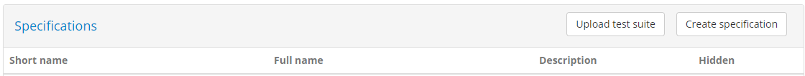

Clicking this allows you to upload a test suite to multiple specifications at once, without needing to make individual uploads. For details
on the process to upload a test suite see :ref:`domains__specification__test_suite_upload`.

.. _domains__domain__parameter_list:

Parameter list
~~~~~~~~~~~~~~

The **Parameters** section presents the configuration parameters defined at domain level. These are configuration values that are expected to be used
within the `GITB TDL test cases`_ that you upload to the test bed. They typically relate to information you don't want to include in test cases either
because they would hinder portability (e.g. service URLs), they are sensitive (e.g. service authentication credentials), or they are settings that apply
to all test cases that are subject to change. 

.. _GITB TDL test cases: https://www.itb.ec.europa.eu/docs/tdl/latest/expressions/index.html#referring-to-domain-configuration-parameters

.. figure:: ../screenshots/admin_domains_domain_parameters.PNG
  :align: center

The domain's parameters are presented in a table with one parameter per row. The information provided for each parameter is:

* Its **name**, used to identify the parameter and also refer to it through test cases.
* Its **description** to provide context on the purpose of the parameter.
* Its **value**, which in the case of sensitive parameters is hidden.

To create a new parameter click the **Create parameter** button (see :ref:`domains__domain_create_parameter`). To edit an existing one click its 
corresponding table row (see :ref:`domains__specification`).

.. _domains__domain_create_parameter:

Create parameter
~~~~~~~~~~~~~~~~

Creating a new domain parameter is done by clicking the **Create parameter** button from the **Parameters** list header.

.. figure:: ../screenshots/admin_domains_domain_parameters_header.PNG
  :align: center

Doing so presents you a screen in which you need to provide the information for the new parameter.

.. figure:: ../screenshots/admin_domains_domain_create_parameter.PNG
  :align: center

The information requested in this form is:

* The **name** of the parameter (required), used to identify it and refer to it from test cases.
* The **description** of the parameter (optional).
* The **kind** of parameter it is, choosing from either "Simple", "Binary" or "Secret" (required).

Depending on whether you select that this is a "Simple", "Binary" or "Secret" parameter the screen will be adapted to request its value.
Selecting "Simple" means that this is a simple text value that can be entered and displayed as-is. In this case the screen will 
adapt to request additionally the parameter's **value** (required)

.. figure:: ../screenshots/admin_domains_domain_create_parameter_simple.PNG
  :align: center

If selected to be a "Binary" parameter, you are presented with an **Upload** button to provide the file in question. Once set, 
the file is displayed as a link to download.

.. figure:: ../screenshots/admin_domains_domain_create_parameter_binary.PNG
  :align: center
  
Finally, if you select that the parameter is "Secret", the screen will adapt to request an obfuscated **value** (required), requesting
you also to **repeat** it to ensure that you have entered it correctly. Hidden parameters are treated similar to passwords, in that they will
never be presented on-screen.

.. figure:: ../screenshots/admin_domains_domain_create_parameter_hidden.PNG
  :align: center

To complete the creation of the parameter click the **Save** button. Clicking the **Cancel** button closes the popup without making changes.

.. _domains__domain_edit_parameter:

Edit parameter
~~~~~~~~~~~~~~

To edit a domain parameter click its corresponding row from the **Parameters** table.

.. figure:: ../screenshots/admin_domains_domain_parameters.PNG
  :align: center

Doing so will open a popup screen presenting you the parameter's current information, provided in editable fields.

.. figure:: ../screenshots/admin_domains_domain_update_parameter.PNG
  :align: center

The fields presented for the parameter are:

* The **name** of the parameter (required), used to identify it and refer to it from test cases.
* The **description** of the parameter (optional).
* The **kind** of parameter it is, choosing from either "Simple", "Binary" or "Secret" (required).
* The **value** of the parameter, presented either as a text input (if **kind** is "Simple"), a downloadable link (if **kind** is "Binary") or a repeated text input (if **kind** is "Secret").

Once you adapt the parameter's information click the **Save** button to record your changes or the **Cancel** button to discard them. Clicking the 
**Delete** button removes, upon confirmation, the parameter.

.. _domains__specification:

Manage specification details
----------------------------

To view a specification's details and edit its information you need to click on the specification's row, displayed in the **Specifications** table
of the domain details page (see :ref:`domains__domain_details`).

.. figure:: ../screenshots/admin_domains_domain_specifications.PNG
  :align: center

Doing so will take you to the specification details screen. This is split in three sections:

* The **Specification details** section, presenting the specification's information.
* The **Test suites** section, listing the test suites that are configured for this specification (see :ref:`domains__specification__test_suite_list`).
* The **Actors** section, listing the actors configured for the specification (see :ref:`domains__specification__actor_list`).

In the **Specification details** section you are presented with a form to view and edit the specification's information.

.. figure:: ../screenshots/admin_domains_specification_details.PNG
  :align: center

The following information is presented in corresponding form controls:

* The specification's **short name** (required), displayed in list views.
* Its **full name** (required), displayed in detail screens and reports.
* A **description** to provide more context on the specification (optional), displayed in detail screens and reports.
* Whether or not the specification is to be considered as **hidden** (by default set to false).

Setting a specification as **hidden** is typically meaningful for existing specifications as doing so will effectively
deprecate it. Once set as hidden, a specification does not appear as available when creating new conformance statements,
however any existing conformance statements or performed tests that refer to it remain unaffected. A good example of such
a scenario is when you want to support versioning in specifications and, upon release of a new version, you want to ensure
new conformance statements are made for this latest version.

To edit the specification's information, enter the new values you require and click the **Save changes** button. Clicking the **Delete** button will,
following confirmation, delete the specification and all related information. The **Back** button does not make any changes but takes you back to the
specification domain's detail screen (see :ref:`domains__domain_details`).

.. _domains__specification__test_suite_list:

Test suite list
~~~~~~~~~~~~~~~

The **Test suites** section presents the test suites that have been configured for the specification. They are presented in a table with one row per
test suite.

.. figure:: ../screenshots/admin_domains_specification_test_suites.PNG
  :align: center

For each test suite the following information is displayed:

* The **ID** of the test suite. This is an internal identifier used to reference the test suite and match it when uploading updates.
* The **name** of the test suite. This is presented to users as a short name for the test suite.
* Its **description**. This typically would include information on the purpose of the test suite and limited instructions relevant to all its test cases.
* Its **version**. This is metadata that is recorded but not presented to users.

From the table you may either :ref:`upload a new test suite<domains__specification__test_suite_upload>` by clicking the **Upload test suite** button or 
:ref:`view its details<domains__test_suite_details>` by clicking its row.

.. _domains__specification__test_suite_upload:

Upload test suite
~~~~~~~~~~~~~~~~~

To add or update a test suite for a specification you need to upload it using the **Upload test suite** button from the test suite section's header. 

.. figure:: ../screenshots/admin_domains_specification_test_suites_header.PNG
  :align: center

Recall that test suites are ZIP archives containing a test suite's XML file, one or more test case XML files, and the resources they use. The
test suite and test case XML files are authored in the `GITB TDL`_ for which online documentation is provided specifically on `test suite packaging and
deployment`_.

.. _GITB TDL: https://www.itb.ec.europa.eu/docs/tdl/latest/
.. _test suite packaging and deployment: https://www.itb.ec.europa.eu/docs/tdl/latest/testsuite/index.html#deploying-a-test-suite-in-the-gitb-software

Clicking on the **Upload test suite** button opens a dialog that displays the current **Target specification** as readonly and a file upload control to
select the test suite archive.

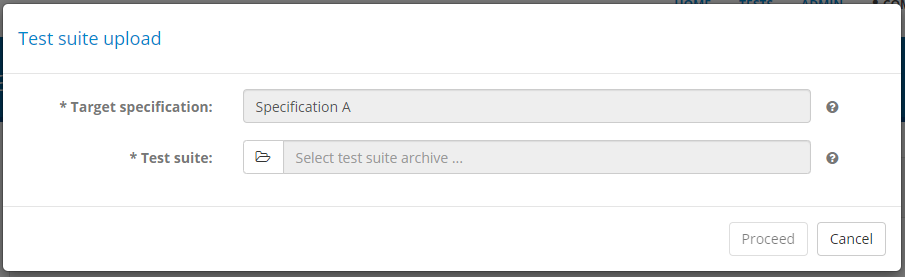

Note that in case you are :ref:`uploading a test suite for multiple specifications<domains__domain_deploy_test_suite>` from the :ref:`domain details page<domains__domain_details>`, 
this screen presents the domain's specifications as a multiple selection list (use Control and left-click to select entries).

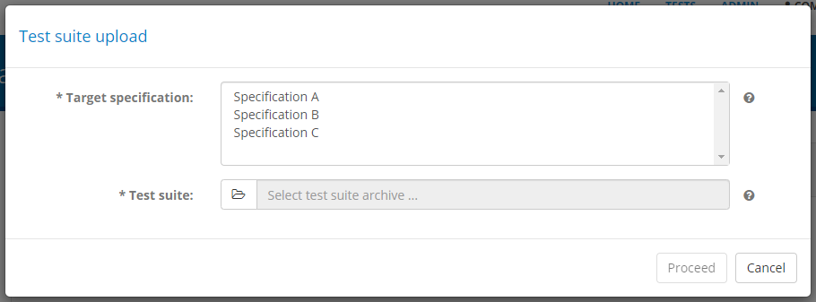

Once the archive is selected you can click on **Proceed** to proceed with the upload. Upon doing so the test bed will validate the archive to ensure it is a
valid test suite. In case your uploaded test suite has errors or warnings these will be presented to you including for each:

* An error code and description of the validation finding.
* The relevant test suite file as the location of the problem.

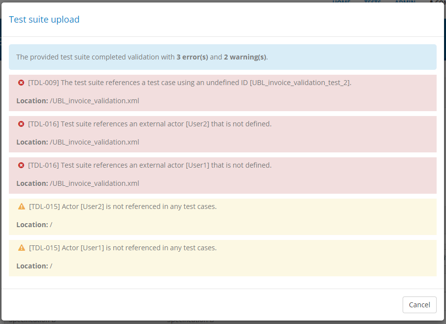

If the test suite is found to have errors you are not allowed to proceed further. If only warnings are found you can click the **Proceed** button to ignore them
and continue to the next step. Validation warnings will not necessarily lead to test session errors but should nonetheless be reviewed to ensure nothing has been neglected.
Examples of warnings are supporting resources that are not used in test cases or references to missing :ref:`domain parameters<domains__domain_details>`.

.. note::
    **Uploading valid test suites:** If an uploaded test suite is fully valid (i.e. its validation results in no errors or warnings) the validation
    report step is completely skipped.

For a valid test suite, or a test suite with warnings you have chosen to ignore, what takes place next depends on whether or not the test suite or the
data it refers to already exist. If this is the case you will next be prompted with a choice per target specification on how the upload should proceed.

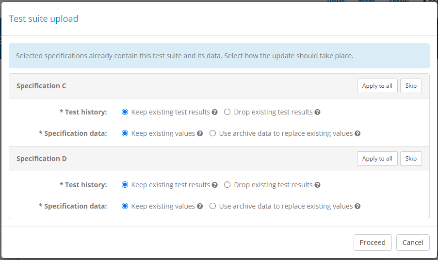

For each specification you have one or two sets of choices depending on its existing data:

* **Test history:** This choice appears when the uploaded test suite identifier matches an existing one and refers to the existing test suite's conformance testing history.
  You may choose to **keep** the existing test results (the default choice) if you are adding new test cases or if any changes you have made are minor and don't require retesting.
  Alternatively you can **drop**, upon confirmation, the existing test results, rendering them obsolete, in case changes are significant and require all tests to be repeated.
* **Specification data:** This choice appears if the test suite defines specification data that already exists. Such data can be actors, endpoints and parameters, as well
  as metadata for the test suite and its test cases (essentially anything you could have updated through the user interface). You may choose to **keep** existing values unchanged
  (the default choice) or **replace** them with the data coming from the archive.

When reviewing the choices for matching data you may also choose to replicate one set of choices to all specifications through the **Apply to all** button. In addition, you can
click the **Skip** button to avoid making any changes to the specification in question. Doing so will grey out the specification's entry and display a **Process** button in case
you finally choose to proceed with the changes. Once you are satisfied with your choices you can click the **Proceed** button to complete the upload.

Once the upload is completed you are presented with a summary of all changes that were made, organised by target specification. 

.. figure:: ../screenshots/admin_domains_specification_test_suites_upload_result.PNG
  :align: center

The information presented shows you all the resources that were affected as part of the test suite upload. Specifically:

* The **test suite** that was affected. This will either be marked as "added" or "updated" depending on whether or not the test suite already existed.
* The **test cases** that were handled. Test cases present in the uploaded test suite that did not previously exist are presented as "added", others
  that matched existing ones are presented as "updated", whereas test cases that existed previously but are removed from the latest test suite are
  reported as "deleted".
* The **actors** that were referenced. These will either be reported as "added" for those defined in the test suite that did not previously exist,
  "updated" for those defined in the test suite and already present in the specification, or "unchanged" for those that were defined in the test suite
  as references, without their complete information.
* The **endpoints** that were managed. These will either be "added" for new ones, "updated" for already existing ones, or "unchanged" for those that
  already existed but were not defined in the test suite.
* The **parameters** that were managed. These will either be "added" for new ones, "updated" for already existing ones, or "unchanged" for those that
  already existed but were not defined in the test suite.

.. note::
    **Deleting specification data:** Specification data that is not matched through the test suite upload can only be created or updated. Data that exists
    but that is not matched in the test suite remains unaffected.

At any point during the test suite upload wizard you can stop the operation by clicking the **Cancel** button. Only once the upload is fully completed
is this replaced by a **Close** button given that changes have already been applied. Clicking either of these button closes the popup.

.. _domains__specification__actor_list:

Actor list
~~~~~~~~~~

The **Actors** section presents the actors configured for the specification. They are presented in a table with one row per actor.

.. figure:: ../screenshots/admin_domains_specification_actors.PNG
  :align: center

For each actor the following information is displayed:

* The **ID** of the actor, used for display purposes as a short name and also to reference the actor from test suites.
* Its **name**, as the complete actor name to show in detail screens and reports. This is also the name presented to users during test
  execution, unless this is overridden at test case level.
* Its **description**, displayed in details screens and reports to provide more information about the actor.
* Whether or not the actor is the specification's **default**. The default actor is the one that will be preselected as the SUT when creating new 
  conformance statements for the specification.
* Whether or not the actor is set as **hidden**. Hidden actors are not presented to users during the creation of conformance statements.

Clicking on an actor's row will take you to its detail page (see :ref:`domains__actor`). To manually create a new actor click the **Create actor**
button from the table's header (see :ref:`domains__specification__create_actor`).

.. note::
    **Automatic vs manual actor creation:** Actors can also be created automatically during test suite upload as long as their complete
    information is provided. If you prefer to manually create actors through the test bed's interface you should opt to refer to these
    using their ID rather than define them fully from within test suites (see the `GITB TDL documentation`_ for more details).

.. _GITB TDL documentation: https://www.itb.ec.europa.eu/docs/tdl/latest/testsuite/index.html#deploying-a-test-suite-in-the-gitb-software

.. _domains__specification__create_actor:

Create actor
~~~~~~~~~~~~

To create a new actor manually (as opposed to automatically via test suite upload) click  the **Create actor** button from the **Actors** list header.

.. figure:: ../screenshots/admin_domains_specification_actors_header.PNG
  :align: center

Doing so presents you a screen in which you need to provide the information for the new actor.

.. figure:: ../screenshots/admin_domains_specification_create_actor.PNG
  :align: center

The information to provide for the actor is:

* The actor's **ID** (required), displayed in list views and used to reference the actor within test suites.
* Its **name** (required), displayed in detail screens and reports, as well as in the test execution screen (unless overridden at test case level).
* A **description** to provide more context on the actor's purpose (optional), displayed in detail screens and reports.
* The actor's **display order** (optional), used to determine where the actor should be displayed in the test execution diagram (see :ref:`execute_tests`).
  If provided this should be an integer that will be compared to the other specification actors' display order to determine the presentation order. An actor
  with a configured value will be displayed before actors with a larger value or ones that have no value configured.
* Whether or not the actor is the **specification default**. Only one default actor can be defined for a specification which will be preselected when creating
  new conformance statements.
* Whether or not the actor should be **hidden**. Hidden actors are valid for reference purposes but are not presented to users when creating conformance
  statements. They can be used to hide simulated actors or deprecate ones that have been previously used without affecting existing test sessions.

To complete the creation of the actor click the **Save** button. To cancel and return to the specification's detail page (see :ref:`domains__specification`) 
click the **Cancel** button.

.. _domains__test_suite_details:

Manage test suite details
-------------------------

To view a test suite and edit its metadata click its row from the specification's test suite listing.

.. figure:: ../screenshots/admin_domains_specification_test_suites.PNG
  :align: center

Doing so presents you with the test suite's details in an editable form followed by a listing of its included test cases.

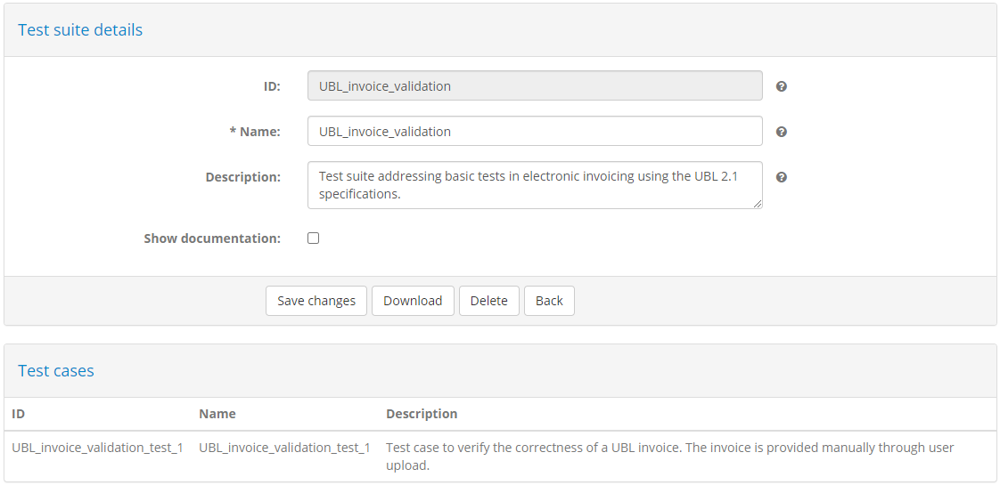

Using the provided form you can edit the test suite's metadata, specifically:

* Its **ID**, a non-editable identifier set via test suite upload that is used to reference and match the test suite in subsequent uploads.
* Its **name** (required), a short text presented to users to identify the test suite.
* Its **description** (optional), a text providing context on the test suite and a brief overview of its purpose and contained test cases.

You may also view and edit here the test suite's **documentation**. This is displayed to users as part of the
:ref:`conformance statement detail page<manage_your_conformance_statements__view_a_conformance_statements_details__tests>`, its purpose
being to add extended rich documentation that describes the steps to follow and reference external resources. To display the existing 
documentation check the **Show documentation** option, which opens up a rich text editor.

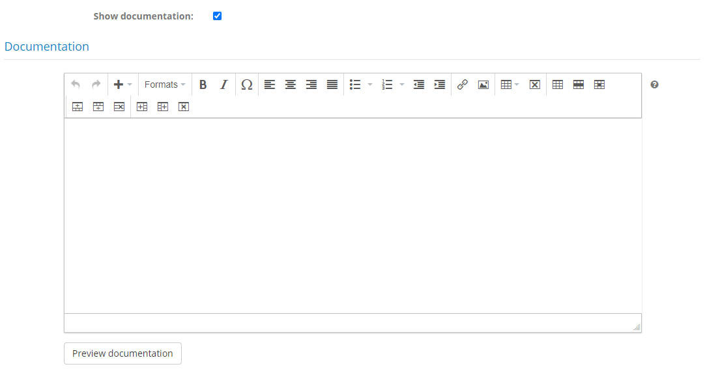

If you choose to provide such documentation you may also click the **Preview documentation** to ensure it matches your expectations. Doing so
presents a popup with the documentation, displaying it exactly as when viewed by your users.

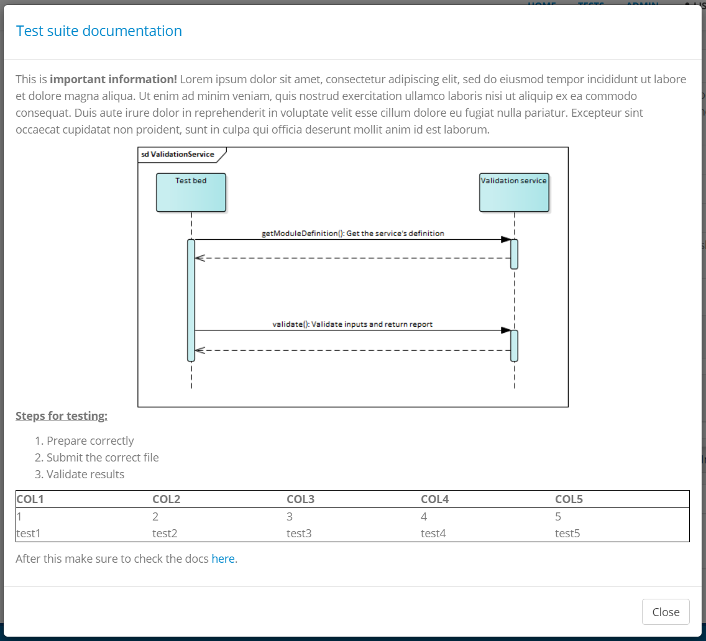

If you make changes to the test suite's metadata you can apply them by clicking the **Save changes** button. From here you can also click the
**Download** button to download the test suite's ZIP archive. Clicking **Delete** will delete, upon confirmation, the test suite rendering linked
test results as obsolete, whereas clicking on **Back** will discard any pending changes and return you to the :ref:`specification detail page<domains__specification>`.

.. note::
  **Update via test suite upload:** A test suite's name, description and documentation can also be updated via 
  :ref:`test suite upload<domains__specification__test_suite_upload>`. When uploading a new version for a test suite you can choose whether
  the values you have been editing through the user interface are to be kept or replaced. Note that the content and execution order of 
  the test suite's test cases can only be changed via upload.

.. _domains__test_suite_test_case_list:

Test case list
~~~~~~~~~~~~~~

The **Test cases** section presents the test cases included in the test suite. They are presented in a table with one row per test case.

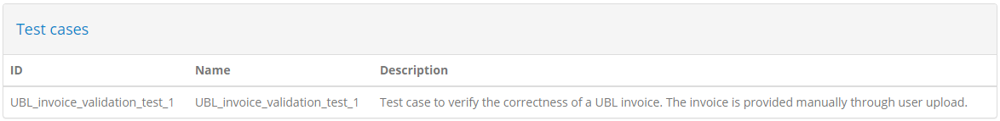

For each test case the following information is displayed:

* Its **ID**, an internal identifier for the test case used to reference it from its test suite and to match it during test suite uploads.
* Its **name**, displayed to users as a short name for the test case.
* Its **description**, displayed to users to provide context on the purpose of the test case and a brief summary of its steps.

Clicking on an test case's row will take you to its :ref:`detail page<domains__test_case__details>`.

.. note::
  **Creating a test case:** Creating a new test case is only possible through :ref:`test suite upload<domains__specification__test_suite_upload>`.

.. _domains__test_case__details:

Manage test case details
------------------------

To view a test case's details and update its metadata you need to click on the test case's row, displayed in the **Test cases** table
of the :ref:`test suite details page<domains__test_suite_test_case_list>`.

Doing so will present you with the test case details screen where you can view and edit the test case's information.

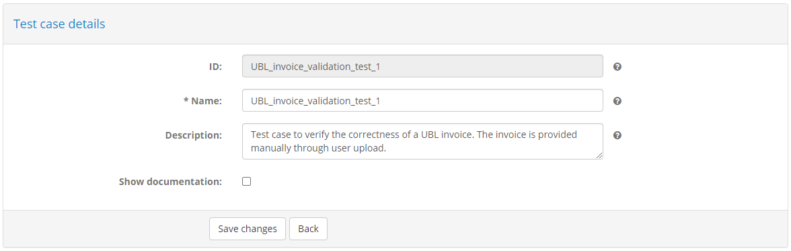

An editable form is presented here that displays the metadata for the test case, specifically:

* Its **ID**, used for internal reference by its test suite and to match the test case during uploads. This is a readonly value that is set
  during initial test suite upload.
* Its **name** (required), that you can edit to provide a user-friendly short identifier for the test case. This is presented to users in the 
  :ref:`conformance statement details page<manage_your_conformance_statements__view_a_conformance_statements_details__tests>` and during 
  :ref:`test execution<execute_tests__step3>`.
* Its **description** (optional), displayed alongside the test case's name in the :ref:`conformance statement details page<manage_your_conformance_statements__view_a_conformance_statements_details__tests>` 
  and during :ref:`test execution<execute_tests__step3>`. The purpose of this description is to summarise its purpose and steps.

You may also view and edit here the test case's **documentation**. This is displayed to users as part of the
:ref:`conformance statement detail page<manage_your_conformance_statements__view_a_conformance_statements_details__tests>`, its purpose
being to add extended rich documentation that describes the steps to follow and reference external resources. To display the existing 
documentation check the **Show documentation** option, which opens up a rich text editor.

If you choose to provide such documentation you may also click the **Preview documentation** to ensure it matches your expectations. Doing so
presents a popup with the documentation, displaying it exactly as when viewed by your users.

.. figure:: ../screenshots/conformance_statement_details_tests_documentation_popup.PNG
  :align: center

.. note::
  **Update via test suite upload:** A test case's name, description and documentation can also be updated via 
  :ref:`test suite upload<domains__specification__test_suite_upload>`. When uploading a new version for a test suite you can choose whether
  the values you have been editing through the user interface are to be kept or replaced. The test case's content (i.e. its steps) on the 
  other hand can only be changed via upload.

To persist your changes click on the **Save changes** button. Clicking on **Back** will discard any changes and return you to the 
:ref:`test suite details page<domains__test_suite_details>`.

.. _domains__actor:

Manage actor details
--------------------

To view an actor's details and edit its information you need to click on the actor's row, displayed in the **Actors** table
of the specification details page (see :ref:`domains__specification`).

.. figure:: ../screenshots/admin_domains_specification_actors.PNG
  :align: center

Doing so will take you to the actor details screen. This is split in two sections:

* The **Actor details** section, presenting the actor's information.
* The **Endpoints** section, listing the endpoints configured for this actor (see :ref:`domains__actor__endpoint_list`).

In the **Actor details** section you are presented with a form to view and edit the actor's information.

.. figure:: ../screenshots/admin_domains_actor_details.PNG
  :align: center

The following information is presented in corresponding form controls:

* The actor's **ID** (required), used for display purposes and to refer to the actor in test suites.
* A **name** (required), displayed in detail screens and reports, as well as the test execution screen.
* A **description** to provide more context on the actor's purpose (optional), displayed in detail screens and reports.
* The actor's **display order** (optional), used to determine where the actor should be displayed in the test execution diagram (see :ref:`execute_tests`).
  If provided this should be an integer that will be compared to the other specification actors' display order to determine the presentation order. An actor
  with a configured value will be displayed before actors with a larger value or ones that have no value configured.
* Whether or not the actor is the **specification default**. Only one default actor can be defined for a specification which will be preselected when creating
  new conformance statements.
* Whether or not the actor should be **hidden**. Hidden actors are valid for reference purposes but are not presented to users when creating conformance
  statements. They can be used to hide simulated actors or deprecate ones that have been previously used without affecting existing test sessions.

To edit the actor's information, enter the new values you require and click the **Save changes** button. Clicking the **Delete** button will,
following confirmation, delete the actor and all related information. The **Back** button does not make any changes but takes you back to the
specification's detail screen (see :ref:`domains__specification`).

.. _domains__actor__endpoint_list:

Endpoint list
~~~~~~~~~~~~~

The **Endpoints** section presents the endpoints defined for the actor. They are presented in a table with one row per endpoint.

.. figure:: ../screenshots/admin_domains_actor_endpoints.PNG
  :align: center

For each endpoint the following information is displayed:

* Its **name**, used for display purposes and to refer to the endpoint within test cases.
* Its **description**, used to provide context to users on the endpoint's purpose.
* A comma-separated list of its defined **parameters**.

Clicking on an endpoint's row will take you to its detail page (see :ref:`domains__endpoint`). To manually create a new endpoint click the **Create endpoint**
button from the table's header (see :ref:`domains__actor__create_endpoint`).

.. note::
    **Automatic vs manual endpoint creation:** Endpoints can also be created automatically during test suite upload.

.. _domains__actor__create_endpoint:

Create endpoint
~~~~~~~~~~~~~~~

To create a new endpoint manually (as opposed to automatically via test suite upload) click  the **Create endpoint** button from the **Endpoints** list header.

.. figure:: ../screenshots/admin_domains_actor_endpoints_header.PNG
  :align: center

Doing so presents you a screen in which you need to provide the information for the new endpoint.

.. figure:: ../screenshots/admin_domains_actor_endpoints_create.PNG
  :align: center

The information to provide for the endpoint is:

* Its **name** (required), displayed in detail screens and used to refer to it from test cases.
* Its **description** to provide more context on the endpoint's purpose (optional).

To complete the creation of the endpoint click the **Save** button. To cancel and return to the actor's detail page (see :ref:`domains__actor`) 
click the **Cancel** button.

.. _domains__endpoint:

Manage endpoint details
-----------------------

To view an endpoint's details and edit its information you need to click on the endpoint's row, displayed in the **Endpoints** table
of the actor details page (see :ref:`domains__actor`).

.. figure:: ../screenshots/admin_domains_actor_endpoints.PNG
  :align: center

Doing so will take you to the endpoint details screen. This is split in two sections:

* The **Endpoint details** section, presenting the endpoint's information.
* The **Parameters** section, listing the endpoint's parameters (see :ref:`domains__endpoint__parameter_list`).

In the **Endpoint details** section you are presented with a form to view and edit the endpoint's information.

.. figure:: ../screenshots/admin_domains_endpoint_details.PNG
  :align: center

The following information is presented in corresponding form controls:

* the endpoint's **name** (required), displayed in detail screens and used to refer to it from test cases.
* Its **description** to provide more context on the endpoint's purpose (optional).

To edit the endpoint's information, enter the new values you require and click the **Save changes** button. Clicking the **Delete** button will,
following confirmation, delete the endpoint and its parameters. The **Back** button does not make any changes but takes you back to the
actor's detail screen (see :ref:`domains__actor`).

.. note::
  **Endpoint display for users:** In most cases each actor will define at most one endpoint for its configuration. If this is the case the endpoint
  is hidden from users in the :ref:`conformance statement detail page<manage_your_conformance_statements__view_a_conformance_statements_details__endpoints>`
  which instead displays directly the endpoint's configuration parameters.

.. _domains__endpoint__parameter_list:

Endpoint parameter list
~~~~~~~~~~~~~~~~~~~~~~~

The **Parameters** section presents the endpoint's parameters. They are displayed in a table with one row per parameter.

.. figure:: ../screenshots/admin_domains_endpoint_parameters.PNG
  :align: center

For each parameter the following information is displayed:

* Its **name**, used for display purposes and as an identifier when referring to the parameter (e.g. within test cases).
* Its **description**, used to provide context to users on the parameter's purpose.
* Its **type**, either "Simple" for a simple text value, "Binary" for files or "Secret" for secret texts.
* A **required** flag, determining whether the parameter needs to be provided before executing tests.
* An **editable** flag, determining whether the parameter can be edited by users or is reserved to administrators.
* An **included in tests** flag, determining whether or not the parameter is included as a variable within test sessions.
* A **hidden** flag, determining whether or not a non-editable parameter is is also to be hidden from organisation users.

Clicking on a parameter's row will open a popup to view and edit its information (see :ref:`domains__endpoint__edit_parameter`). To manually create 
a new parameter click the **Create parameter** button from the table's header (see :ref:`domains__endpoint__create_parameter`).

.. note::
    **Automatic vs manual parameter creation:** Endpoint parameters can also be created automatically during :ref:`test suite upload<domains__specification__test_suite_upload>`.

.. _domains__endpoint__create_parameter:

Create endpoint parameter
~~~~~~~~~~~~~~~~~~~~~~~~~

To create a new endpoint parameter manually (as opposed to automatically via test suite upload) click  the **Create parameter** button from the 
**Parameters** list header.

.. figure:: ../screenshots/admin_domains_endpoint_parameters_header.PNG
  :align: center

Doing so opens a popup screen in which you need to provide the information for the new parameter.

.. figure:: ../screenshots/admin_domains_endpoint_parameters_create.PNG
  :align: center
  
The information to provide for the parameter is:

* Its **name** (required), used for display purposes and to refer to the parameter within test cases.
* Its **description** (optional), used to provide context to users on the parameter's purpose.
* Its **value type** (required), either "Simple" for a simple text value, "Binary" for files or "Secret" for secret texts.
* Its **properties**, specifically whether is is required, editable by users, included in test sessions and hidden.

Whether or not parameters are set as editable and included in test sessions provides flexibility in collecting, setting and
sharing configuration by and towards users. A parameter set as not editable could be used by administrators as 
a way to provide a user with a given input that is needed during test execution (e.g. a generated
certificate). Furthermore, non-editable parameters set as hidden are never presented to organisation users and as such are ideal as control
flags. Such flags could set manually by administrators when :ref:`managing the tests of an organisation<community__manage_organisation__tests>` 
and viewing a :ref:`conformance detail page<manage_your_conformance_statements__view_a_conformance_statements_details__endpoints>` or
automatically via a conformance statement :ref:`trigger<community__manage_triggers>`.

.. note::
  **Organisation and system properties:** Endpoint parameters can be seen as input and configuration properties that are 
  relevant to a system's specific conformance statement. For information that is more high-level, you may also use
  :ref:`system or organisation properties<community__properties>` when this is linked, respectively, to a system or a complete
  organisation. Finally, parameters can also be :ref:`set at domain level<domains__domain__parameter_list>`, applying to a
  complete domain or community.

  All configuration parameters can be edited manually but also automatically through :ref:`triggers<community__manage_triggers>`.

The **Preset values** apply to simple parameters (i.e. text) and allow you to define a preset list of values for the parameter that 
will appear as a dropdown selection list. For each such value you can define a user-friendly **label** and the property's actual **value**, 
using the provided controls to **add** new values, **remove** existing ones or change their **display order**.

.. figure:: ../screenshots/admin_community_properties_presets.PNG
  :align: center

The **Depends on** field is optional and allows you to define a prerequisite condition for this parameter. To set such a prerequisite you need to select another parameter
from the provided list and specify to its left in the provided text field (or dropdown selection if the parameter has preset values) the value that it needs to have for the
current parameter to be enabled. A parameter that misses any of its prerequisite conditions (i.e. its direct prerequisite or a prerequisite's prerequisite) will
be considered inactive, even if set as required, and will be excluded from input forms and test sessions. Using such dependencies is a powerful mechanism to define conditional
inputs based on other parameters or external processing (e.g. via :ref:`triggers<community__manage_triggers>`).

.. note::
  Properties of **binary** or **secret** type cannot be used as prerequisites.

To complete the creation of the parameter click the **Save** button. To cancel and close the popup click the **Cancel** button.

.. _domains__endpoint__edit_parameter:

Edit endpoint parameter
~~~~~~~~~~~~~~~~~~~~~~~

To edit an endpoint parameter click its corresponding row from the **Parameters** table.

.. figure:: ../screenshots/admin_domains_endpoint_parameters.PNG
  :align: center

Doing so opens a popup screen presenting the details of the parameter in editable form fields.

.. figure:: ../screenshots/admin_domains_endpoint_parameters_edit.PNG
  :align: center

The purpose of all fields and usage of available controls is identical to the :ref:`create parameter<domains__endpoint__create_parameter>` case. 
To edit the parameter's information, enter the new values you require and click the **Save** button. Clicking the **Delete** button will,
following confirmation, delete the parameter. The **Cancel** button closes the popup without making any changes.

.. _domains__endpoint__order_parameters:

Change parameter ordering
~~~~~~~~~~~~~~~~~~~~~~~~~

By default parameters are ordered alphabetically based on their name. You may override this default ordering by reordering the parameters as needed and saving their
relative positions. This is done through the table listing the parameters by clicking the **up** and **down** arrows at each row's right end.

.. figure:: ../screenshots/admin_domains_endpoint_parameters.PNG
  :align: center

At each click the relevant row will be moved accordingly by one. Once you have reordered parameters in this way you will notice that the **Save parameter order** button
becomes enabled. You will need to click this to confirm and persist the displayed ordering.