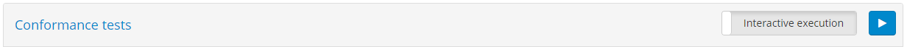
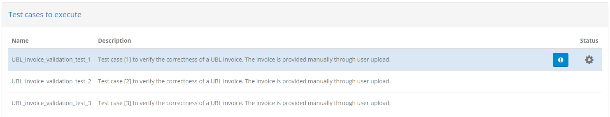
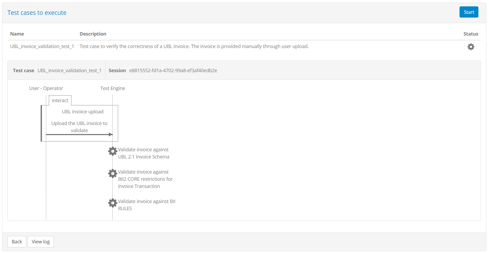
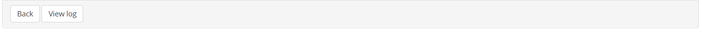

.. _execute_tests:

Execute tests
=============

Executing conformance tests for your system is the reason you are using the test bed. Considering
that test cases are linked to your system by means of conformance statements, the first step before
executing a test is to visit a conformance statement's detail screen (see :ref:`manage_your_conformance_statements__view_a_conformance_statements_details`).
This screen is the place where you input required configuration and are provided with the controls to execute one or more tests.

.. _execute_tests__provide_your_systems_configuration:

Provide your system's configuration
-----------------------------------

The testing configuration for your selected specification may require that you provide one or more 
configuration parameters before executing tests. If for example test cases require that the test bed 
sends messages to your system, it is likely that you need to inform the test bed on how to do so.

Providing and reviewing the configuration for your system is done through the **Configuration parameters** section of
the conformance statement detail page (see :ref:`manage_your_conformance_statements__view_a_conformance_statements_details__endpoints`).

Once all required configuration is provided you can choose to execute one or more test cases 
through the conformance statement detail's **Conformance tests** section (see :ref:`manage_your_conformance_statements__view_a_conformance_statements_details__tests`). The test execution
process starts by clicking one of the available **Play** buttons. In short, you can either execute a
specific test case or a complete test suite and choose whether the test sessions will be launched
in the background or in interactive mode (the default).

.. _execute_tests_background:

Background execution
--------------------

Launching tests in the background is done by toggling the execution mode button to **Background execution**.

.. figure:: ../screenshots/conformance_statement_details_tests_background.PNG
  :align: center

With this set you click the **Play** button to launch a test suite or a specific test case. Before doing so the test bed
will verify that all required configuration properties are defined, and will display a popup notification for those
that are missing.

.. figure:: ../screenshots/test_execution_config_background.PNG
  :align: center

The missing information is presented to you in sections depending on its type:

* **Organisation properties:** Properties at the level of the whole organisation.
* **System properties:** Properties at the level of the system being tested.
* **Conformance statement parameters:** Configuration parameters linked to the specific conformance statement.

In each case you are presented with the following information:

* The name of the **property** or **parameter** (marked with an asterisk if mandatory).
* The information's **description**.

From this point you have the following options:

* Click the **Close** button in the bottom right corner to return to the 
  :ref:`conformance statement detail screen<manage_your_conformance_statements__view_a_conformance_statements_details>`.
* Click one of the **View** buttons on top right corners of the presented tables to access the configuration in question.

Once all required information is correctly defined you can proceed to execute your test(s). Doing so will launch the test
sessions in the background where they will proceed to run in parallel. A visual confirmation of the launched test session will
briefly appear in the top right area of the screen informing you of this.

.. figure:: ../screenshots/test_execution_background.PNG
  :align: center

The status of test sessions launched in the background can be monitored by means of the :ref:`Test Sessions<view_your_test_history>` screen.

.. _execute_tests_interactive:

Interactive execution
---------------------

Launching tests interactively is the default option and is enabled by having the execution mode toggle button set to **Interactive execution**.

Proceeding to execute tests will result in a three-step process:

  1. Verification of the configuration you provide to the test bed.
  2. Communication of any configuration provided by the test bed to you.
  3. Test execution.

Throughout these steps you are presented on top with the list of test cases to execute. Each test case is displayed with its **name** and 
**description** as well as an **information button** in case the test case in question defines further extended documentation.

The currently active test case is always highlighted in **blue**, whereas the **status** column indicates the pending test case as well as 
the overall result of the ones previously executed. Regarding the  **information button**, if present, clicking it will open a popup displaying 
the test case's extended documentation.

.. figure:: ../screenshots/conformance_statement_details_tests_documentation_popup.PNG
  :align: center

.. _execute_tests__step1:

Step 1 - Verification of your configuration
~~~~~~~~~~~~~~~~~~~~~~~~~~~~~~~~~~~~~~~~~~~

The first step of executing one or more test cases is the verification on your provided configuration. If
you are expected to enter required information that is missing you will be presented with
a screen listing the **missing properties**.

.. figure:: ../screenshots/test_execution_config.PNG
  :align: center

This screen presents on the top the test cases to execute but puts
the focus on the missing information. This is presented to you in sections depending on its type:

* **Missing organisation properties:** Properties at the level of the whole organisation.
* **Missing system properties:** Properties at the level of the system being tested.
* **Missing conformance statement parameters:** Configuration parameters linked to the specific conformance statement.

In each case you are presented with the following information:

* The name of the **property** or **parameter** (marked with an asterisk if mandatory).
* The information's **description**.

From this point you have the following options:

* Click the **Back** button in the bottom left corner to return to the 
  :ref:`conformance statement detail screen<manage_your_conformance_statements__view_a_conformance_statements_details>`.
* Click one of the **View** buttons on top right corners of the presented tables to access the configuration in question.

Once all required information is correctly defined you can proceed to execute your test(s).

.. note::
    **Valid configuration:** If you are not required to provide any information or all required information
    is correctly provided this screen will be skipped. You will be taken directly to 
    the display of the simulated actors' configuration (see :ref:`execute_tests__step2`).

.. _execute_tests__step2:

Step 2 - Simulated actor configuration 
~~~~~~~~~~~~~~~~~~~~~~~~~~~~~~~~~~~~~~

The second step when executing your test(s) is the **Preliminary phase** screen where you again see the test case(s) to execute 
but also see the configuration information generated for you by the test bed. 
The nature of this configuration depends on the tests you are executing but in all cases refers to information that the
test bed is communicating to you that you may likely need to configure in your system before starting. If for example your 
system is expected to send messages to the test bed this step informs you what you need to configure as the test bed's address.

.. figure:: ../screenshots/test_execution_simulated.PNG
  :align: center

The configuration properties displayed here are in fact parameters (see :ref:`introduction__glossary__endpoint`) that are listed with their names
and values under the name of the specification actor that is being simulated. Continuing the example, if the test bed
is going to simulate a specification actor named "EU portal" to which you are expected to send messages, the simulated
actor name (in the example "EU portal") is presented before its configuration values.

Apart from the display of such configuration parameters, it could also be the case that this step presents you with additional notification popups 
to provide you with further information or instructions. The existence or not of such a popup as well as its contents are
defined within each test case.

.. figure:: ../screenshots/test_execution_simulated_instruction.PNG
  :align: center
  :scale: 50%

It may be interesting to note that when being presented with this screen, a test session has already been started in the 
test bed. In case you are executing a complete test suite (see :ref:`manage_your_conformance_statements__view_a_conformance_statements_details__tests`), the information 
presented to you corresponds to the setup of the session for the first test case. Once this completes, it could be that this screen reappears if any new configuration 
values have been added or if any previously communicated ones have changed. For the currently active (or selected) test case, you are presented with:

* The **test case name**.
* The test **session identifier**. Hovering over this highlights it, at which point you can click to copy it to the clipboard. Doing so could be useful in case you 
  would like to communicate the identifier or use it for subsequent :ref:`test session filtering<view_your_test_history>`.

At this point you may also click the **Back** button from the bottom left corner to cancel the execution and return to the conformance statement detail page.

.. note::
    **No simulated configuration:** This screen is presented to you only if preliminary steps are needed before starting
    a test session. If the test bed has no configuration to report to you and there are no specific instructions to 
    communicate, this screen will be skipped. You will be taken directly to the test execution screen (see :ref:`execute_tests__step3`).

.. _execute_tests__step3:

Step 3 - Test execution
~~~~~~~~~~~~~~~~~~~~~~~

The third step when executing your test(s) is the **Execution** screen. This continues the display the test case(s)
on top but now also shows you the test steps from the first test case to execute. In addition, a greyed-out 
cog icon is now presented under the its **status** indicating that this test case is ready for execution but has not started yet.

The **Execution** section includes the active test case's name and the session identifier, the latter allowing to be clicked to be copied to the clipboard.
In addition, this section now also displays the upcoming test case's steps in a way similar to a `sequence diagram`_. The elements included
in this diagram are:

* A **lifeline per actor** defined in the test case. One of these will be marked as the "SUT" (the System Under Test), whereas the other
  actor lifelines will be labelled as "SIMULATED". An additional **operator lifeline** may also be present in case user interaction is defined 
  in the test case.
* Expected **messages** between actors represented as labelled arrows indicating the type and direction of the communication.
* A **Test Engine lifeline** in case the test case includes validation or processing steps that are carried out by the test
  bed that don't relate to a specific actor.
* Zero or more **cog icons**, typically under the "Test Engine" indicating the points where validation or processing will take place.
* **Visual grouping elements** that serve to facilitate the display in case of e.g. conditional steps, parallel steps or loops.

.. _sequence diagram: https://en.wikipedia.org/wiki/Sequence_diagram

If multiple test cases are being executed (i.e. a complete test suite is selected for execution) the display remains similar but the test case 
overview section now shows the full list of upcoming tests.

.. figure:: ../screenshots/test_execution_execute_multiple.PNG
  :align: center

In this case the displayed diagram refers to the test case that is up next for execution, indicated also as such by highlighting in blue the 
relevant row from the test case overview table.

Starting the test session is achieved by clicking the provided **Start** button. In case you are executing a single test case this is present in the 
test case overview header. Otherwise, if multiple test cases are to be executed, the **Start** button is presented in the display of the 
specific test case.

Finally, throughout the execution of all test cases you may click the **Back** button in the bottom left corner to leave the interactive test execution
and return to the conformance statement detail page. Doing so will continue to execute the ongoing and pending test cases in the background that you 
can now follow from the :ref:`Test Sessions<view_your_test_history>` screen.

.. _execute_tests__step3__monitor_and_manage_test_progress:

Monitor and manage test progress
++++++++++++++++++++++++++++++++

Clicking the **Start** button begins the first selected test case's session. What follows depends on the definition of the test case as illustrated
in the presented diagram but can be summarised in the following types of feedback:

* **Exchanges of messages** between actors (i.e. the displayed arrows) proceed. Messaging initiated by the test bed happens automatically, whereas for messages
  originating from your system the test session blocks until you trigger them, e.g. through your software component's user interface.
* **Popup dialogs** relative to interaction steps are presented to either inform you or request input.
* **Validation or processing steps** take place automatically.

During the execution of the test case colours are used to inform on each step's status:

* **Blue** is used to highlight the currently active or pending step. This could be a blue arrow showing that a message is expected or a spinning
  blue cog to show active processing.
* **Grey** is used for all elements that haven't started yet or that have been skipped (e.g. due to conditional logic). Skipped steps are also displayed
  with a strike-through to enhance the fact they have been skipped.
* **Green** is used for steps that have successfully completed.
* **Red** is used for steps that have failed with a severity level of "error".
* **Orange** is used for steps that have failed with a severity level of "warning".

.. figure:: ../screenshots/test_execution_execute_multiple_in_progress.PNG
  :align: center

The colour-based feedback is also repeated at the level of the test case overview in the **status** cog icons. The icon's colour serves to highlight the currently 
active test case, versus future ones or completed ones (in case of multiple test cases being up for execution). Once completed the status icon for the 
test case is replaced by a green tick or red cross to indicate the session's overall result as a success or failure respectively. Note that a test session 
is considered as failed if it contains at least one error; warnings are displayed but don't affect the overall test outcome (i.e. in the presence of warnings and no errors
the overall test result will be successful). Regardless of the outcome of individual steps, test execution always continues as even in the presence of errors 
it could be still interesting to proceed (e.g. if multiple different validation steps take place).

In case multiple test cases are up for execution, testing proceeds automatically, only pausing in case user interaction is needed. Such user interaction can 
either be a step within a test case or part of the setup for the next test session. In the latter case, automatic test execution is paused and can be restarted
by clicking again the test case's **Start** button.

Stopping the test(s) execution is achieved through controls that replace the **Start** button. Specifically:

* In case of a single test case a **Stop** button is displayed in the test case overview header. Clicking this immediately stops the test session.
* In case of multiple test cases being executed, The **Stop** button is presented at the level of the currently active test case and results in 
  stopping the specific test session but proceeding with the subsequent test cases. Stopping the entire test suite execution is achieved through the 
  **Stop all** button displayed in the test case overview header.

Once all test cases are complete the test case overview displays a **Reset** button. This serves as shortcut to re-run the same test case(s).

.. _execute_tests__step3__view_test_step_documentation:

View test step documentation
++++++++++++++++++++++++++++

Test steps are presented in the test execution diagram with a limited description label. Test steps can however be defined to also include additional
detailed context, documentation, or instructions. Test steps defining such additional documentation are presented with a **circled question mark** next
to their label that can be clicked.

.. figure:: ../screenshots/test_execution_execute_documentation.png
  :align: center
  :scale: 80%

Clicking the presented icon results in a "Step information" popup that displays the further documentation linked to the step. This can range from 
being a simple text to rich text documentation, including styled content, tables, lists, links and images. 

.. figure:: ../screenshots/test_execution_execute_documentation_popup.png
  :align: center

Clicking the **Close** button or anywhere outside the popup will dismiss it and refocus the test execution diagram.

.. _execute_tests__step3__view_test_step_results:

View test step results
++++++++++++++++++++++

During test case execution, additional controls are made available to allow you to inspect the ongoing test(s) results.

First of all, if multiple test cases are selected for execution, completed test case sessions can be inspected by clicking their respective row 
from the test case overview table. Doing so will replace the currently displayed test session diagram with the one relevant to the clicked test
case. Note that if there is a currently running test session that results in a test step update, the displayed diagram will be automatically
replaced with the one for the active test session.

Regarding the test steps within a given test session, each completed step displays a clickable control in the form of a document with 
a green tick or red cross (for success or failure respectively). This applies both for validation steps and messaging steps.

.. figure:: ../screenshots/test_execution_execute_step_result_controls.PNG
  :align: center
  :scale: 50%

Apart from serving as an additional indication on the success or failure of the test step, these controls provide further details on the step's
results. In case of messaging steps, this triggers a popup that shows the different information elements that can be viewed inline or opened in
a separate popup editor. In the case of validation steps, this is extended to also provide the detailed validation results and an overview
of the error, warning and information message counts, as illustrated in the following example.

.. figure:: ../screenshots/test_execution_execute_step_failure.PNG
  :align: center
  :scale: 50%

In the test step result popup you are presented with the **result** and completion **time** as the step summary. In the sections that follow you 
can inspect the output information from the step, presented either inline (for short values), as a file you can download, or through a further popup editor.
These two latter options are available by clicking the **download** or **view** icons respectively at the right of each section. In case you choose to
view the content in an editor, a popup is presented that displays the content which, in the case of validation steps, is also highlighted for the
recorded validation messages.

.. figure:: ../screenshots/test_execution_execute_step_failure_code.PNG
  :align: center
  :scale: 50%

The editor popup allows you to copy a specific part of the content or, by means of the **Copy to clipboard** button, copy its entire contents. The
**Close** button closes this popup and returns you to the test step result display. Note that clicking on a specific error will  
open the validated content and automatically focus on the selected error.

An alternative to viewing the content in this way is to click the **Download** button which will download the content as a file. The test bed will determine
the most appropriate type for the content and name the downloaded file accordingly (if possible). In the case of simple texts that are presented inline, you
are not presented with the download and view buttons, but rather with a **Copy to clipboard** button that allows you to copy the presented value.

.. figure:: ../screenshots/test_execution_execute_step_clipboard.PNG
  :align: center

.. note::
    **Viewing binary output:** The **Download as file** option is the best way to inspect information that is binary (e.g. an image). The test bed will nonetheless
    always present the **Open in editor** option but given that the content is then assumed to be text, this will likely not be useful.

The errors, warnings and information messages displayed are contained in a **details** section that also shows the overall counts per violation
severity level. This summary title is also clickable, to allow the listed details to be collapsed or expanded if already collapsed. Collapsing the
displayed details could be useful in case they are numerous, providing as such easier access to the popup's additional controls.

The results of the test step can also be exported as a test step report (in PDF format). This is made available through the **Export** button that triggers the 
generation and download of the step report. 

.. figure:: ../screenshots/test_execution_test_step_report.PNG
  :align: center

This report includes:

* The **test step result overview**, including the **result**, **date** and, in case of a validation step, the total number of validation findings
  (classified as **errors**, **warnings** and **messages**).
* The **report details**, included in case of a validation step to list the details of the validation report's findings.
* The step's **context** information, to list its output values and returned content.

.. note::
    **Test step report size:** When exporting a test step report the context information is always included to provide the full information pertinent
    to its result. In case the context information returned by the step includes large file contents, these would be included resulting in a 
    potentially very large export.

Finally, it is important to point out that the examination of a test session's result, both in terms of steps and message exchanges, as well as 
detailed test step results, is possible at any time through your test session history (see :ref:`view_your_test_history`).

.. _execute_tests__step3__view_log:

View test session log
+++++++++++++++++++++

During any point in a test session's execution you may view its detailed log output. This is done by clicking the **View log** button in the 
bottom left corner next to the **Back** button.

Clicking this will open a popup window that includes the detailed log output (debug statements, warnings and errors) for your test session.

.. figure:: ../screenshots/test_execution_view_log_popup.PNG
  :align: center
  :scale: 50%

The detailed log output is typically very useful when you receive error messages but for which the description provided is not clear. The log
output may be used in such a case to determine the cause of the problem or, for unexpected issues, provide input to the test bed support team
(see :ref:`contact_support`).

The test session log popup presents you with three options:

* **Copy to clipboard**, to copy the entire log output to your clipboard (you may also of course selectively copy specific sections).
* **Download**, to download the log output as a text file.
* **Close**, to close the popup.