.. _execute_tests:

Execute tests
=============

Executing conformance tests is the reason your community is using the test bed. Considering
that test cases are linked to a system by means of conformance statements, the first step before
executing a test is to visit a conformance statement's detail screen (see :ref:`manage_your_conformance_statements__view_a_conformance_statements_details`).
This screen is the place where you input required configuration and are provided with the controls to execute one or more tests.

.. _execute_tests__provide_your_systems_configuration:

Provide your system's configuration
-----------------------------------

The testing configuration for your selected specification may require that you provide one or more 
configuration parameters before executing tests. If for example test cases require that the test bed 
sends messages to your system, it is likely that you need to inform the test bed on how to do so.

Providing and reviewing the configuration for your system is done through the **Configuration parameters** tab of
the conformance statement detail page (see :ref:`manage_your_conformance_statements__view_a_conformance_statements_details__endpoints`).

Once all required configuration is provided you can choose to execute one or more test cases 
through the conformance statement details' **Conformance tests** tab (see :ref:`manage_your_conformance_statements__view_a_conformance_statements_details__tests`). The test execution
process starts by clicking one of the available **Play** buttons. In short, you can either execute a
specific test case or a complete test suite and choose whether the test sessions will be launched
in the background or in interactive mode (the default). Furthermore, for background test sessions you may choose whether these will be executed
in parallel or sequentially.

.. _execute_tests_background:

Background execution
--------------------

Launching tests in the background is done by selecting one of the **background execution options** from the **Conformance tests** tab ("parallel" or
"sequential").

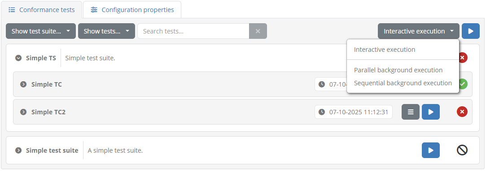

With this set you click the **Play** button to launch a full test suite, a specific test case, or a currently filtered set of test cases. Before doing
so the test bed will verify that all required configuration properties are defined, and will display a popup notification for those that are missing.

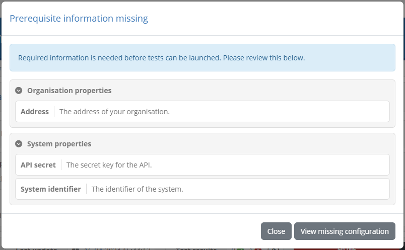

The missing information is presented to you in sections depending on its type:

* **Organisation properties:** Properties at the level of the whole organisation.
* **System properties:** Properties at the level of the system being tested.
* **Conformance statement parameters:** Configuration parameters linked to the specific conformance statement.

In each case you are presented with the following information:

* The name of the **property** or **parameter** (marked with an asterisk if mandatory).
* The information's **description**.

From this point you have the following options:

* Click the **Close** button in the bottom right corner to return to the 
  :ref:`conformance statement detail screen<manage_your_conformance_statements__view_a_conformance_statements_details>`.
* Click one of the **View** buttons on top right corners of the presented tables to access the configuration in question.

Once all required information is correctly defined you can proceed to execute your test(s). Doing so will launch the test
sessions in the background presenting a brief visual confirmation in the top right area of the screen.

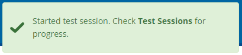

The status of test sessions launched in the background can be monitored by means of the :ref:`Test Sessions<view_your_test_history>` screen.

.. _execute_tests_interactive:

Interactive execution
---------------------

Launching tests interactively is the default option and is enabled by setting the execution mode dropdown menu to **Interactive execution**.

The first step when launching one or more test sessions is to verify the completeness of :ref:`your configuration<manage_your_conformance_statements__view_a_conformance_statements_details__endpoints>`.
If you are expected to enter required information that is missing you will be presented with a screen listing the **missing properties**.

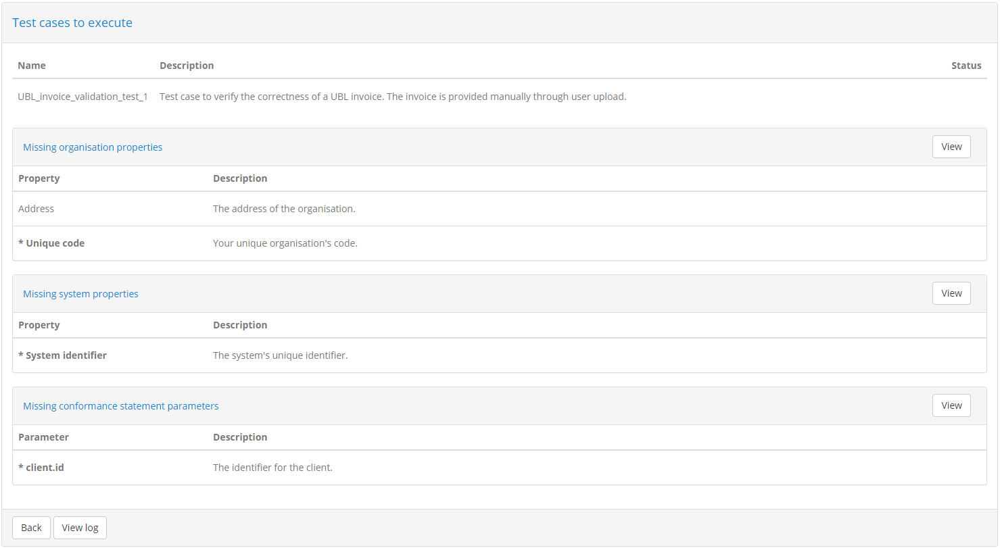

This screen includes separate sections for the different types of configuration you are missing. Specifically:

* **Missing organisation properties:** Properties at the level of the whole organisation.
* **Missing system properties:** Properties at the level of the system being tested.
* **Missing conformance statement parameters:** Configuration parameters linked to the specific conformance statement.

In each case you are presented with the following information:

* The name of the **property** or **parameter** (marked with an asterisk if mandatory).
* The property's **description**.

From this point you have the following options:

* Click the **Back** button to return to the :ref:`conformance statement detail screen<manage_your_conformance_statements__view_a_conformance_statements_details>`.
* Click one of the **View** buttons on the top right corners of the presented tables to review the configuration in question.

Once all required information is correctly defined you can proceed to execute your test(s). In this case, or in case no configuration was missing to
begin with, the display presents the list of test cases you have selected for execution:

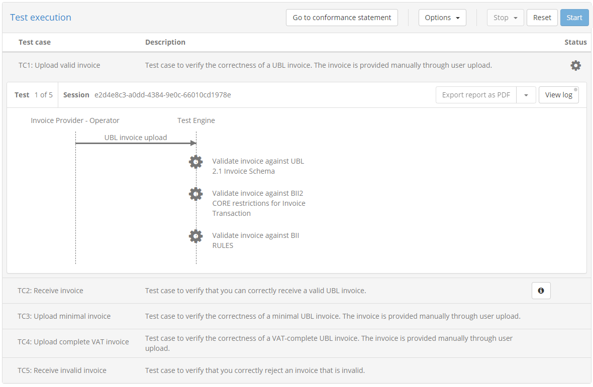

The presented display includes on top a set of **controls** to manage your tests and control their execution. Specifically:

* The **Back** button allows you to return at any time to the :ref:`conformance statement detail screen<manage_your_conformance_statements__view_a_conformance_statements_details>`.
  In case you click this when test sessions have already started executing they will continue to run in the background.
* You can adapt the way **test sessions are displayed**. By default completed tests are hidden and pending tests are displayed to have the active
  session always on top. You can however adapt these settings to e.g. :ref:`view an already executed test<execute_tests__step3__view_test_step_results>` or hide upcoming ones.
* You can select **how execution continues** once a test session completes. By default the next test session will start automatically but you can
  choose to have execution pause whenever a test completes.

.. note::

  **Executing a single test case:** In case you have chosen to execute only a single test case the options managing the display of test sessions
  and the execution of further test cases are not presented.

Beneath these controls, you can see the list of test cases to execute. For each test case you can see its **name**, **description** as well as its
current **status** (ready, ongoing, failed or succeeded). In case the test case has extended documentation, an additional **information button** is
presented that can be clicked to present it in a popup:

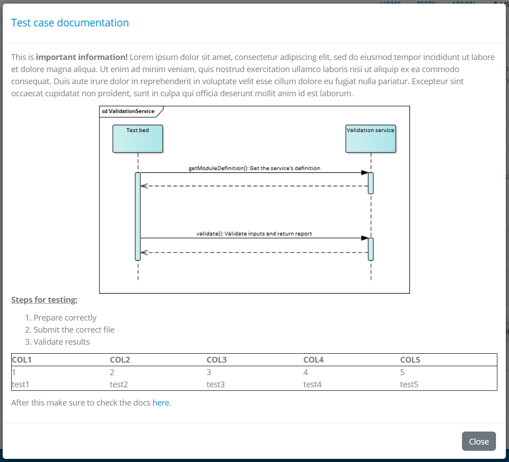

For the currently active test case you see an additional panel that presents to you the **test diagram**, the **test counter** (if executing multiple
test cases) and the **test session identifier** (which can be clicked to copy). The **View log** button on the right can be used to view and follow
the test session's log (see :ref:`execute_tests__step3__view_log`).

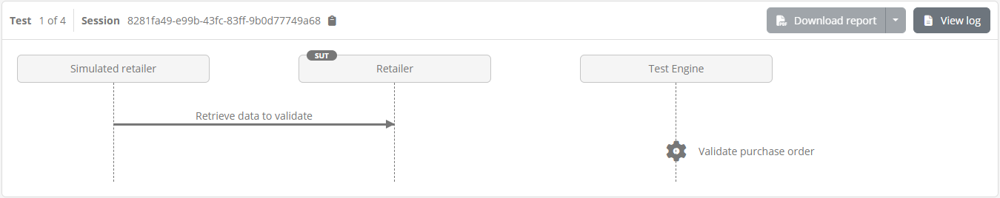

Before starting a test session, the test bed checks to see whether it needs to present you any configuration that you need to take into account. This
step is the counterpart of the verification that was previously discussed, where the test bed checked the configuration that you provided. In this case
the test bed will present to you its own configuration to take into account when preparing your system. If such configuration properties indeed exist and
need to be displayed, they will be presented to you in a popup:

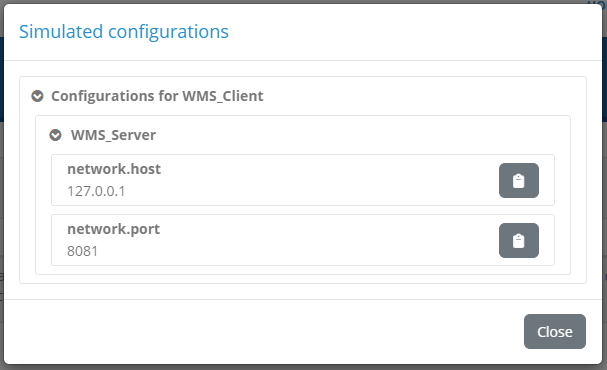

The configuration properties displayed here correspond to a specification actor that is being simulated. These :ref:`properties<introduction__glossary__endpoint>`
are listed with their names and values, and are grouped by simulated actor (there may be multiple).

Apart from the display of such configuration parameters, it could also be the case that this step presents you with additional notification popups 
to provide you with further information or instructions. The existence or not of such a popup as well as its contents are defined within each test case.

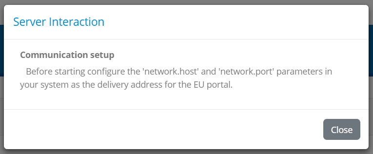

Once all configuration has been verified and the current test case's definition has been loaded you will be able to proceed with the
:ref:`test execution<execute_tests_interactive_execution>`. You can do this by clicking the **Start** button from the test execution controls.

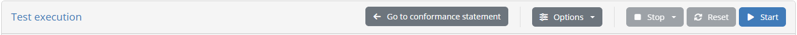

.. _execute_tests_interactive_execution:

Test execution
~~~~~~~~~~~~~~

To start executing your selected tests click the **Start** button from the test execution controls.

Test execution goes through the steps defined in the test case's definition which are presented in a way similar to a `sequence diagram`_. The
elements included in this diagram are:

* A **lifeline per actor** defined in the test case. One of these will be marked as the "SUT" (the System Under Test), whereas the other
  actor lifelines will be labelled as "SIMULATED". An additional **operator lifeline** may also be present in case user interaction is defined 
  in the test case.
* Expected **messages** between actors represented as labelled arrows indicating the type and direction of the communication.
* A **Test Engine lifeline** in case the test case includes validation or processing steps that are carried out by the test
  bed that don't relate to a specific actor.
* Zero or more **cog icons**, typically under the "Test Engine" indicating the points where validation or processing will take place.
* **Visual grouping elements** that serve to facilitate the display in case of e.g. conditional steps, parallel steps or loops.

.. _sequence diagram: https://en.wikipedia.org/wiki/Sequence_diagram

.. _execute_tests__step3__monitor_and_manage_test_progress:

Monitor and manage test progress
++++++++++++++++++++++++++++++++

Clicking the **Start** button begins the first selected test case's session. What follows depends on the definition of the test case as illustrated
in the presented diagram but can be summarised in the following types of feedback:

* **Exchanges of messages** between actors (i.e. the displayed arrows) proceed. Messaging initiated by the test bed happens automatically, whereas for messages
  originating from your system the test session blocks until you trigger them, e.g. through your system's user interface.
* **Popup dialogs** relative to interaction steps are presented to either inform you or request input.
* **Validation or processing steps** take place automatically.

During the execution of the test case, colours are used to inform you of each step's status:

* **Blue** is used to highlight the currently active or pending step. This could be a blue arrow showing that a message is expected or a spinning
  blue cog to show active processing.
* **Grey** is used for all elements that haven't started yet or that have been skipped (e.g. due to conditional logic). Skipped steps are also displayed
  with a strike-through to enhance the fact they have been skipped.
* **Green** is used for steps that have successfully completed.
* **Red** is used for steps that have failed with a severity level of "error".
* **Orange** is used for steps that have failed with a severity level of "warning".

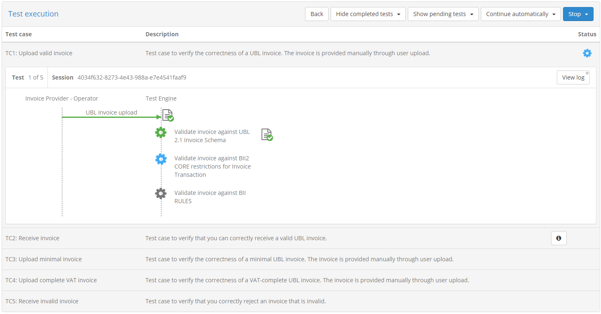

The colour-based feedback is also repeated at the level of the test case overview in the **status** cog icons. The icon's colour serves to highlight the currently 
active test case, versus future ones or completed ones (in case these are displayed). Once completed, the status icon for the test case is replaced by
a green tick or red cross to indicate the session's overall result as a success or failure respectively. Note that a test session is considered as
failed if it contains at least one error; warnings are displayed but don't affect the overall test outcome (i.e. in the presence of warnings and no
errors the overall test result will be successful).

In case multiple test cases are up for execution, testing proceeds automatically unless you have chosen to continue manually. In such a case you will
need to click againt the **Start** button to proceed. Stopping the test(s) execution is achieved by clicking the **Stop** button from the test
execution controls. In case you are executing multiple test cases this offers two options, stopping only the current test or all test cases.

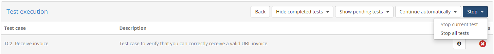

Once all test cases are complete (or have been stopped) the test execution controls include a **Reset** button. This serves as shortcut to re-run the
same test case(s).

.. _execute_tests__step3__view_test_step_documentation:

View test step documentation
++++++++++++++++++++++++++++

Test steps are presented in the test execution diagram with a limited description label. Test steps can however be defined to also include additional
detailed context, documentation, or instructions. Test steps defining such additional documentation are presented with a **circled question mark** next
to their label that can be clicked.

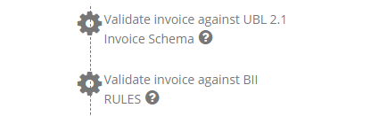

Clicking the presented icon results in a "Step information" popup that displays the further documentation linked to the step. This can range from 
being a simple text to rich text documentation, including styled content, tables, lists, links and images. 

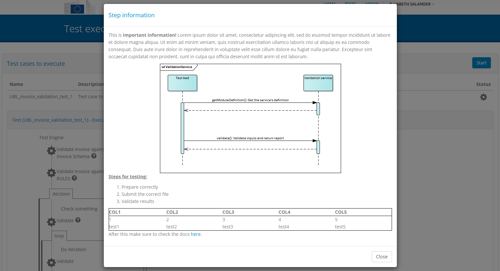

Clicking the **Close** button or anywhere outside the popup will dismiss it and refocus the test execution diagram.

.. note::

    **Test documentation and instructions:** Providing extended documentation for key steps is a good way of enriching the feedback provided to
    users. This documentation can be used to provide detailed instructions or references to the specifications being tested, complementing the
    limited information presented through test step labels, or test case and test suite descriptions. Such documentation is added in the test
    cases' `GITB TDL content`_ by means of the test steps' ``documentation`` element.

.. _execute_tests__step3__view_test_step_results:

View test step results
++++++++++++++++++++++

During test case execution, additional controls are made available to allow you to inspect the ongoing test(s) results.

First of all, if multiple test cases are selected for execution, completed test case sessions can be inspected by selecting to **show completed tests**
and clicking their relevant row. Doing so will expand the clicked row to display the relevant test execution diagram.

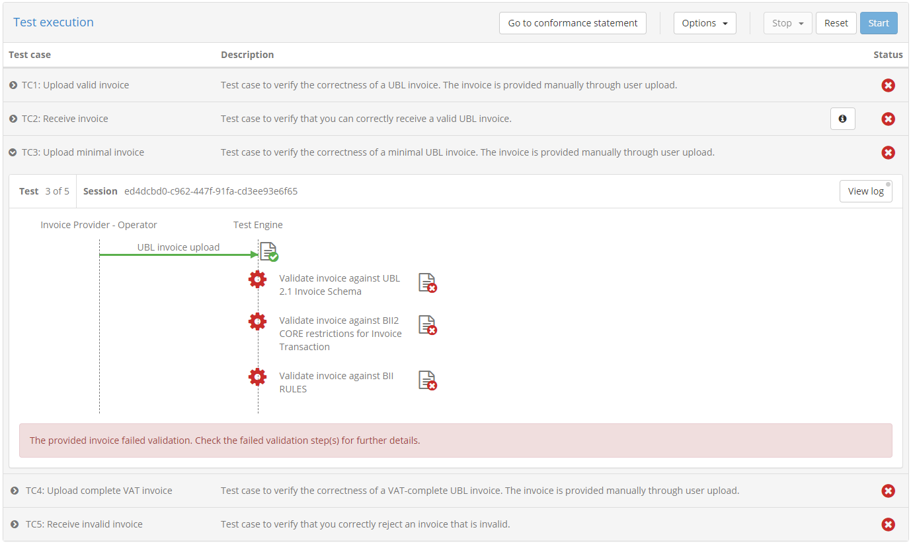

Regarding the test steps within a given test session, each completed step displays a clickable control in the form of a document with 
a green tick or red cross (for success or failure respectively). This applies for validation, messaging, processing and interaction steps.

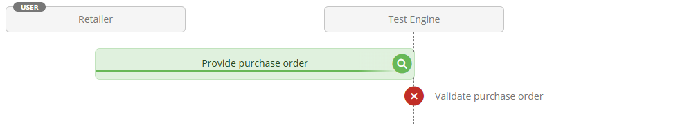

Apart from serving as an additional indication on the success or failure of the test step, these controls provide further details on the step's
results. Clicking them triggers a popup that shows the different information elements that can be viewed inline or opened in
a separate popup editor. In the case of validation steps, this is extended to also provide the detailed validation results and an overview
of the error, warning and information message counts, as illustrated in the following example.

.. figure:: ../screenshots/test_execution_execute_step_failure.PNG
  :align: center
  :scale: 50%

In the test step result popup you are presented with the **result** and completion **time** as the step summary. In the sections that follow you 
can inspect the output information from the step, presented either inline (for short values), as a file you can download, or through a further popup editor.
These two latter options are available by clicking the **download** or **view** icons respectively at the right of each section. In case you choose to
view the content in an editor, a popup is presented that displays the content which, in the case of validation steps, is also highlighted for the
recorded validation messages.

.. figure:: ../screenshots/test_execution_execute_step_failure_code.PNG
  :align: center
  :scale: 50%

The editor popup allows you to copy a specific part of the content or, by means of the **Copy to clipboard** button, copy its entire contents. The
**Close** button closes this popup and returns you to the test step result display. Note that clicking on a specific error will  
open the validated content and automatically focus on the selected error.

An alternative to viewing the content in this way is to click the **Download** button which will download the content as a file. The test bed will determine
the most appropriate type for the content and name the downloaded file accordingly (if possible). In the case of simple texts that are presented inline, you
are not presented with the download and view buttons, but rather with a **Copy to clipboard** button that allows you to copy the presented value.

.. figure:: ../screenshots/test_execution_execute_step_clipboard.PNG
  :align: center

.. note::
    **Viewing binary output:** Downloading a file is the best way to inspect information that is binary (e.g. an image). The test bed will nonetheless
    always present an option to open the file in an editor but given that the content is then assumed to be text, this will likely not be useful.

The errors, warnings and information messages displayed are contained in a **details** section that also shows the overall counts per violation
severity level. This summary title is also clickable, to allow the listed details to be collapsed or expanded if already collapsed. Collapsing the
displayed details could be useful in case they are numerous, providing as such easier access to the popup's additional controls.

The results of the test step can also be exported as a test step report (in PDF format). This is made available through the **Export** button that triggers the 
generation and download of the step report. 

.. figure:: ../screenshots/test_execution_test_step_report.PNG
  :align: center

This report includes:

* The **test step result overview**, including the **result**, **date** and, in case of a validation step, the total number of validation findings
  (classified as **errors**, **warnings** and **messages**).
* The **report details**, included in case of a validation step to list the details of the validation report's findings.
* The step's **context** information, to list its output values and returned content.

.. note::
    **Test step report size:** When exporting a test step report the context information is always included to provide the full information pertinent
    to its result. In case the context information returned by the step includes large file contents, these would be included resulting in a 
    potentially very large export.

Finally, it is important to point out that the examination of a test session's result, both in terms of steps and message exchanges, as well as 
detailed test step results, is possible at any time through your test session history (see :ref:`view_your_test_history`).

.. _execute_tests__step3__view_log:

View test session log
+++++++++++++++++++++

During any point in a test session's execution, be it an active or completed test session, you may view its detailed log output. This is done by
clicking the **View log** button in the top right corner of the test execution diagram. This button displays also a **status indicator** as a circle
in case the log includes new messages since the last time it was viewed.

Clicking this button will open a popup window that includes the detailed log output (debug statements, information messages, warnings and errors)
for your test session.

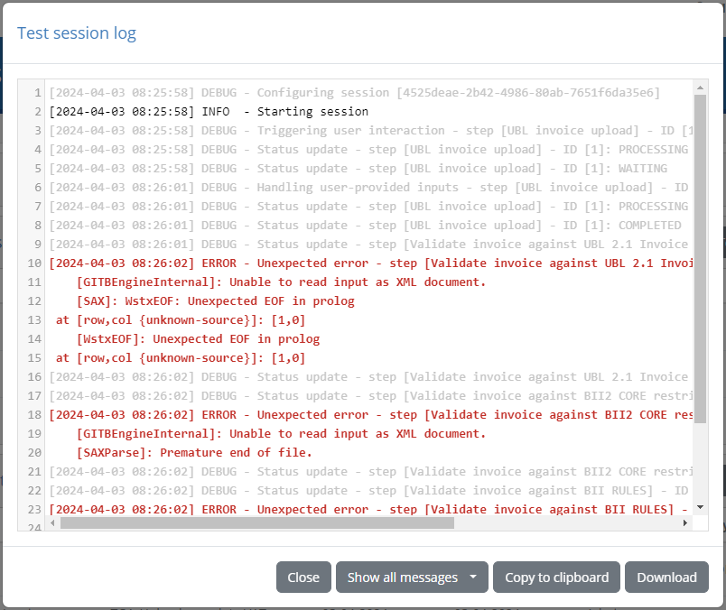

The detailed log output is typically very useful when you receive error messages but for which the description provided is not clear. The log
output may be used in such a case to determine the cause of the problem or, for unexpected issues, provide input to the test bed support team
(see :ref:`contact_support`). Note that once opened, the log display is automatically updated for newly received messages.

The displayed log messages are highlighted with different colours depending on their severity:

* Light grey for **debug** messages.
* Black for **information** messages.
* Orange for **warnings**.
* Red for **errors**.

Finally, the popup's header presents controls to manage the log display. Specifically you may:

* Choose to automatically **scroll to the latest message** (i.e. tail) or maintain your scroll position (the default).
* Select the **minimum severity** to display (by default all messages are displayed).
* **Copy** the log to your clipboard.
* **Download** the log as a text file.
* **Close** the popup.

.. _execute_tests_rest:

Execution via REST API
----------------------

Apart from launching tests through its user interface, the test bed also provides a **REST API** allowing you to launch and manage test sessions
via REST calls. The test bed's REST API is primarily used to integrate the test bed with automation solutions, enabling use cases such as **automated testing**
and **continuous integration**. A typical scenario would be to use this as part of a development or quality assurance workflow that would involve the following steps:

1. Upon changes to your system, or at given intervals, deploy and initialise the latest version of your system.
2. Once your system is ready, use the test bed's REST API to launch a series of test sessions for your system.
3. Have your system proceed, via scripting or responding to test bed requests, to complete the launched test sessions.
4. Monitor the progress of the launched test sessions by periodically polling the test bed for updates.
5. Once all test sessions are complete, compile an overview report and shut down your system.

.. note::

  Using the test bed's REST API is an advanced feature that needs to first be enabled by your administrator to be available to you. If setting up
  your own test bed instance (for `production`_ or `development`_) you may enable this by setting the `AUTOMATION_API_ENABLED`_ property to true.

All operations provided by the test bed's REST API make use of API keys to determine the information relevant to a specific call. These
API keys are :ref:`managed as part of the organisation's details<manage_your_profile__view_organisation_details__rest>` and include:

* **Organisation:** The key to identify the specific organisation for which test sessions will be launched or managed.
* **System:** The key to determine the system for which new test sessions are to be launched.
* **Actor:** The key to determine the target specification actor for which to test conformance. Recall that the combination of system and actor
  essentially define a :ref:`conformance statement<manage_your_conformance_statements>`.
* **Test suite:** The key to determine a specific test suite.
* **Test case:** The key to determine a specific test case.

The test bed's REST API includes three operations that allow you to launch, monitor and manage test sessions:

* :ref:`start<execute_tests_rest__start>`: Launch one or more test sessions relevant to a given conformance statement.
* :ref:`status<execute_tests_rest__status>`: Query the status of one or more test sessions.
* :ref:`stop<execute_tests_rest__stop>`: Stop one or more test sessions.

All these operations are HTTP calls that include the following:

* A HTTP header named ``ITB_API_KEY`` set with the **organisation API key**. This header is required to authenticate the request.
* A **JSON payload** provided as the body of the request to determine the parameters of the requested action.

Details on each operation, including sample requests and responses, are provided in the following sections.

.. _execute_tests_rest__start:

start
~~~~~

The **start** operation is used to launch one or more test sessions. You may use the operation's parameters to specify exactly which test cases
to execute, allowing for targetted choices or batch execution of complete sets of tests. You may also define how the selected test cases are
launched, by specifying whether they should be parallelised or executed in sequence. In addition, you may provide inputs for the tests to execute
that could serve to replace values that would be otherwise provided interactively (e.g. user inputs or uploaded files).

To call the **start** operation make an HTTP ``POST`` to path ``/api/rest/tests/start``. As an example, for the `DIGIT instance`_,
the path would be ``https://www.itb.ec.europa.eu/itb/api/rest/tests/start``.

As with all test bed REST operations you must include in your request an HTTP header named ``ITB_API_KEY`` set to your **organisation API key**.

In the request's payload you will need to define at least the following properties:

* The ``system``, referring to the API key of the system to be tested.
* The ``actor``, referring to the API key for the target actor.

In addition to the above, you can include properties ``testSuite`` and ``testCase``, both arrays including the API keys for specific test suites
and test cases, which in combination with the ``actor`` define which test cases shall be executed.
For example the following request defines only the ``actor``, thus launching all test cases defined in the actor's
:ref:`conformance statement<manage_your_conformance_statements__view_a_conformance_statements_details__tests>`:

.. code-block:: json

  {
    "system": "B277E210X2FB4X4BD7X88B6X951504F45F8F",
    "actor": "28E6E6C9X80BDX40C9XB54DX102800BC32D7"
  }

Including in addition the ``testSuite`` property will instruct the test bed to launch the test cases defined in that specific test suite(s):

.. code-block:: json

  {
    "system": "B277E210X2FB4X4BD7X88B6X951504F45F8F",
    "actor": "28E6E6C9X80BDX40C9XB54DX102800BC32D7",
    "testSuite": [ "TS1" ]
  }

If you want to launch only one or more specific test cases you can use the ``testCase`` property:

.. code-block:: json

  {
    "system": "B277E210X2FB4X4BD7X88B6X951504F45F8F",
    "actor": "28E6E6C9X80BDX40C9XB54DX102800BC32D7",
    "testCase": [ "TS1_TC1", "TS1_TC2" ]
  }

Apart from selecting the test cases to launch, you may also specify property ``forceSequentialExecution`` to inform the test bed how the
test sessions should be launched. Setting this to ``true`` will force the test bed to launch all tests sequentially. By default, this is
considered as ``false``, meaning that the test bed will launch all test sessions in parallel, unless certain of the selected test cases
require sequential execution.

.. code-block:: json

  {
    "system": "B277E210X2FB4X4BD7X88B6X951504F45F8F",
    "actor": "28E6E6C9X80BDX40C9XB54DX102800BC32D7",
    "forceSequentialExecution": true
  }

As a complement to the information on which tests are to be launched, you may also provide one or more **inputs** for the selected test cases.
These inputs will be added to the test session context before executing each test, overriding any variables defined with default values.
Providing inputs can be very useful allowing you to execute tests that would otherwise require user interactions (which in this case will be skipped).

The inputs provided can be done so in a flexible manner, defining each input (e.g. a text or even a file) once and mapping it to the test cases
for which it should be considered. To do this you use the ``inputMapping`` property, an array with one item per input, complemented by the
information on the test cases to apply it to. Regarding this test case mapping, you may specify property ``testSuite`` to map it to the tests
of certain test suites, property ``testCase`` to map it to certain test cases, or skip these altogether to apply it to all tests.

For example, the following request defines an input named "countryCode" that applies to all test cases, and a second input named "partyId" that
only applies to two specific ones:

.. code-block:: json

  {
    "system": "B277E210X2FB4X4BD7X88B6X951504F45F8F",
    "actor": "28E6E6C9X80BDX40C9XB54DX102800BC32D7",
    "inputMapping": [
      {
        "input": {
          "name": "countryCode",
          "value": "BE"
        }
      },
      {
        "testCase": ["TS1_TC1", "TS1_TC2"],
        "input": {
          "name": "partyId",
          "value": "ID12345"
        }
      }
    ]
  }

The definition of each ``input`` property is quite flexible, allowing you to define complete files as well as complex structures such as maps.
To define a file you would including its content as a Base64-encoded string, setting appropriately the ``embeddingMethod`` and ``type`` properties
on its relevant input:

.. code-block:: json

  {
    "system": "B277E210X2FB4X4BD7X88B6X951504F45F8F",
    "actor": "28E6E6C9X80BDX40C9XB54DX102800BC32D7",
    "inputMapping": [
      {
        "testCase": ["TS1_TC1"],
        "input": {
          "name": "aFile",
          "embeddingMethod": "BASE64",
          "type": "binary",
          "value": "ZGY6TEtNZmRzYSdrZ2ptZmdobDthZyBcb2VrZ2hhc......"
        }
      }
    ]
  }

When providing a map as an input you do so by including its entries within the top-level map input, in its ``item`` property:

.. code-block:: json

 {
    "system": "B277E210X2FB4X4BD7X88B6X951504F45F8F",
    "actor": "28E6E6C9X80BDX40C9XB54DX102800BC32D7",
    "inputMapping": [
      {
        "testCase": ["TS1_TC1"],
        "input": {
          "name": "countryInfo",
          "type": "map",
          "item": [
            { "name": "countryCode", "value": "BE" },
            { "name": "countryName", "value": "Belgium" }
          ]
        }
      }
    ]
  }

For the full specification of the **start** operation's request payload you may check its :ref:`JSON schema definition<execute_tests_rest__start__request>`.

The response you receive from the **start** operation, includes a confirmation of the test sessions that have been started or planned for execution
(if execution was requested to be sequential). The information for each scheduled session is returned in the ``createdSessions`` array, of which
each item corresponds to one session. For each session you are informed of its relevant ``testSuite`` and ``testCase``, as well as its assigned
``session`` identifier with which you can follow its progress.

.. code-block:: json

  {
    "createdSessions": [
      {
        "testSuite": "TS1",
        "testCase": "TS1_TC1",
        "session": "63b76ce6-5ade-431f-8620-8dadb13d2f42"
      },
      {
        "testSuite": "TS1",
        "testCase": "TS1_TC2",
        "session": "a866297c-ccb0-4133-9ae9-2c3af7aba0bd"
      }
    ]
  }

You may use the reported session identifiers to check the sessions' :ref:`status<execute_tests_rest__status>` and, if needed, forcibly :ref:`stop<execute_tests_rest__stop>` them.

.. _execute_tests_rest__start__request:

start - request schema
++++++++++++++++++++++

The payload of the **start** operation's request is defined by the following :download:`JSON Schema<../executeTests/resources/start_request.schema.json>`:

.. literalinclude:: ../executeTests/resources/start_request.schema.json
   :language: json

.. _execute_tests_rest__start__response:

start - response schema
+++++++++++++++++++++++

The payload of the **start** operation's response is defined by the following :download:`JSON Schema<../executeTests/resources/start_response.schema.json>`:

.. literalinclude:: ../executeTests/resources/start_response.schema.json
   :language: json

.. _execute_tests_rest__status:

status
~~~~~~

The **status** operation is used to check the progress of one or more specific test sessions. It can be used with any test session, not only
sessions launched via the test bed's REST API, as long as you are authorised to view them.

To call the **status** operation make an HTTP ``POST`` to path ``/api/rest/tests/status``. As an example, for the `DIGIT instance`_,
the path would be ``https://www.itb.ec.europa.eu/itb/api/rest/tests/status``.

.. note::
  **Using GET:** Prior to release 1.17.0 the **status** operation was available through HTTP ``GET``. This remains possible as an alternative
  to ``POST`` but is not part of the API's :ref:`OpenAPI documentation<execute_tests_rest__openapi>` as ``GET`` requests are not supposed to
  have body content.

As with all test bed REST operations you must include in your request an HTTP header named ``ITB_API_KEY`` set to your **organisation API key**.

In the request's payload you may provide two properties to define your query:

* The ``session`` array, including one or more session identifiers to look up.
* The ``withLogs`` boolean flag to specify whether you want to view the detailed log trace for each returned session. By default log traces
  are not returned, but you can set this to ``true`` to include them.

The following example call makes a query for one test session, choosing to also return its detailed log:

.. code-block:: json

  {
    "session": ["08e49917-d560-4ffb-bbf5-280bf1084148"],
    "withLogs": true
  }

As a response for the **status** operation, the test bed returns the latest information for the requested sessions in an array named ``sessions``.
This includes one item per reported session which includes in turn the following properties:

* ``session``, for the session's identifier.
* ``result``, one of "SUCCESS", "FAILURE" or "UNDEFINED" for the overall test status.
* ``startTime``, containing a timestamp for the session's launch time.

The above properties are included for all test sessions, active or completed. If a session is completed this information additionally includes the
following properties:

* ``endTime``, containing a timestamp of the session's completion time.
* ``message``, optionally included if an overall output message was produced by the test session.

Finally, in case detailed log traces were requested (i.e. property ``withLogs`` was included and set to ``true``), each test session will
also include a property named ``logs``. This is a string array containing one item per reported log message.

The following example illustrates the status information returned for a single completed test session with logs included:

.. code-block:: json

  {
    "sessions": [
      {
        "session": "08e49917-d560-4ffb-bbf5-280bf1084148",
        "result": "FAILURE",
        "startTime": "2022-03-17T13:28:16Z",
        "endTime": "2022-03-17T13:28:38Z",
        "message": "Your query did not have the expected type.",
        "logs": [
          "[2022-03-17 14:28:15] DEBUG - Configuring session [08e49917-d560-4ffb-bbf5-280bf1084148]",
          "[2022-03-17 14:28:15] INFO  - Starting session",
          "[2022-03-17 14:28:15] DEBUG - Status update - step [Query system] - ID [1]: PROCESSING",
          "[2022-03-17 14:28:15] DEBUG - Status update - step [Query system] - ID [1]: WAITING",
          "[2022-03-17 14:28:15] WARN  - Received 'receive' call from Test Bed",
          "[2022-03-17 14:28:37] DEBUG - Received notification",
          "[2022-03-17 14:28:37] DEBUG - Status update - step [Query system] - ID [1]: COMPLETED",
          "[2022-03-17 14:28:37] DEBUG - Status update - step [Response] - ID [2]: PROCESSING",
          "[2022-03-17 14:28:37] DEBUG - Status update - step [Response] - ID [2]: COMPLETED",
          "[2022-03-17 14:28:37] DEBUG - Status update - step [Sequence] - ID [3]: PROCESSING",
          "[2022-03-17 14:28:37] DEBUG - Status update - step [Verify the query type] - ID [3.1]: PROCESSING",
          "[2022-03-17 14:28:37] DEBUG - Status update - step [Verify the query type] - ID [3.1]: ERROR",
          "[2022-03-17 14:28:37] DEBUG - Status update - step [Sequence] - ID [3]: ERROR",
          "[2022-03-17 14:28:37] DEBUG - Status update - step [Call] - ID [3]: ERROR",
          "[2022-03-17 14:28:37] DEBUG - Preparing to stop",
          "[2022-03-17 14:28:38] INFO  - Session finished with result [ERROR]"
        ]
      }
    ]
  }

.. _execute_tests_rest__status__request:

status - request schema
+++++++++++++++++++++++

The payload of the **status** operation's request is defined by the following :download:`JSON Schema<../executeTests/resources/status_request.schema.json>`:

.. literalinclude:: ../executeTests/resources/status_request.schema.json
   :language: json

.. _execute_tests_rest__status__response:

status - response schema
++++++++++++++++++++++++

The payload of the **status** operation's response is defined by the following :download:`JSON Schema<../executeTests/resources/status_response.schema.json>`:

.. literalinclude:: ../executeTests/resources/status_response.schema.json
   :language: json

.. _execute_tests_rest__stop:

stop
~~~~

The **stop** operation is used to forcibly terminate one or more specific test sessions.  It can be used with any test session, not only
sessions launched via the test bed's REST API, as long as you are authorised to view them.

To call the **stop** operation make an HTTP ``POST`` to path ``/api/rest/tests/stop``. As an example, for the `DIGIT instance`_,
the path would be ``https://www.itb.ec.europa.eu/itb/api/rest/tests/stop``.

As with all test bed REST operations you must include in your request an HTTP header named ``ITB_API_KEY`` set to your **organisation API key**.

In the request's payload you are expected to provide an array named ``session``, including the session identifiers for one or more test sessions
you want to stop. In the following example, a request is being made to terminate two test sessions:

.. code-block:: json

  {
    "session": ["08e49917-d560-4ffb-bbf5-280bf1084148", "a866297c-ccb0-4133-9ae9-2c3af7aba0bd"]
  }

Once this call is made, the test bed will immediately terminate the requested test sessions. The response to the **stop** operation has an
empty body and is returned with a ``200`` (ok) status code.

.. _execute_tests_rest__stop__request:

stop - request schema
+++++++++++++++++++++

The payload of the **stop** operation's request is defined by the following :download:`JSON Schema<../executeTests/resources/stop_request.schema.json>`:

.. literalinclude:: ../executeTests/resources/stop_request.schema.json
   :language: json

.. _execute_tests_rest__openapi:

OpenAPI documentation
~~~~~~~~~~~~~~~~~~~~~

The test bed's REST API is also documented using the standard `OpenAPI specification <https://swagger.io/specification/>`_. You may
download this from :download:`here <resources/openapi.json>`, or access it live from the test bed from path ``/api/rest``. On a typical
`developer instance <https://www.itb.ec.europa.eu/docs/guides/latest/installingTheTestBed/>`_ this would be available at ``http://localhost:9000/api/rest``.

The API's documentation does not only provide a standardised representation of its operations. It also allows it to be imported into
tools that can process it to generate **code**, **documentation** and even **call the live services**.

An example of a popular and free and open-source tool for this purpose is the `Swagger UI <https://swagger.io/tools/swagger-ui/>`_
which provides a full user interface to explore and use an API. This can either be downloaded or used directly from the cloud.
If you use `Docker <https://www.docker.com/>`_ and have it installed on your workstation you can get it up and running by issuing:

.. code-block:: none

  docker pull swaggerapi/swagger-ui
  docker run -p 80:8080 swaggerapi/swagger-ui

Executing the above two commands will download and launch Swagger UI, making it available at ``http://localhost``. Accessing this
you may now view and use the test bed's REST API:

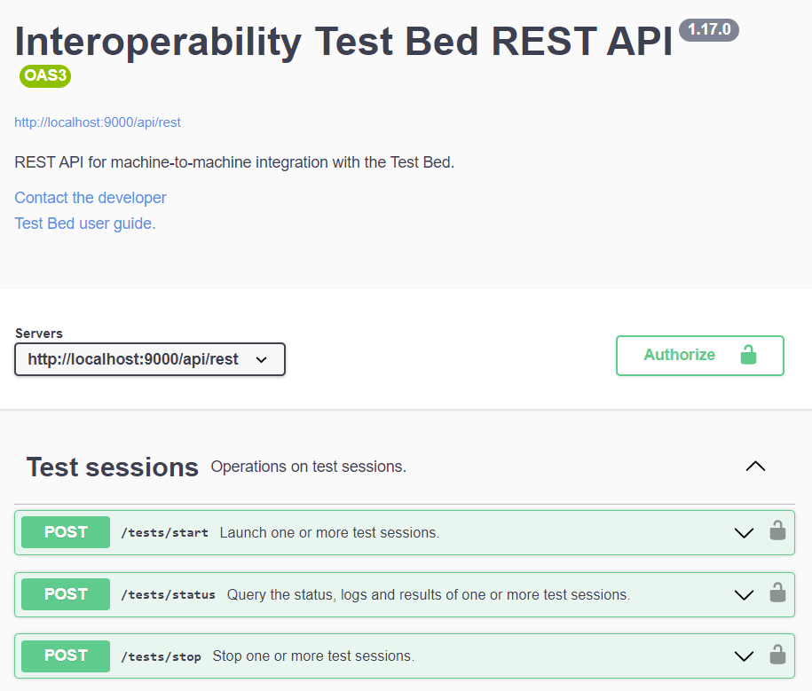

.. _DIGIT instance: https://www.itb.ec.europa.eu/itb/
.. _GITB TDL content: https://www.itb.ec.europa.eu/docs/tdl/latest/constructs/index.html#rich-documentation-per-step
.. _AUTOMATION_API_ENABLED: https://www.itb.ec.europa.eu/docs/guides/latest/installingTheTestBedProduction/index.html#configuration-properties
.. _production: https://www.itb.ec.europa.eu/docs/guides/latest/installingTheTestBedProduction/
.. _development: https://www.itb.ec.europa.eu/docs/guides/latest/installingTheTestBed/