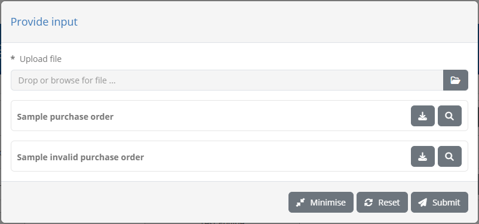
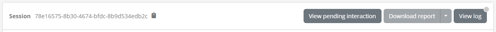
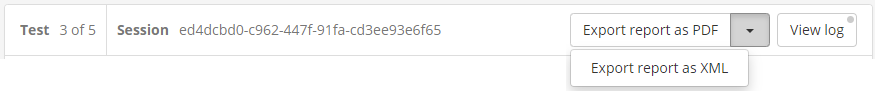

.. _execute_tests:

Execute tests
=============

Executing conformance tests is the reason your users are using the Test Bed. Considering
that test cases are linked to a system by means of conformance statements, the first step before
executing a test is to visit a :ref:`conformance statement's detail screen <manage_your_conformance_statements__view_a_conformance_statements_details>`.
This screen is the place where you input required configuration and are provided with the controls to execute one or more tests.

.. _execute_tests__provide_your_systems_configuration:

Provide your system's configuration
-----------------------------------

The testing configuration for your selected specification may require that you provide one or more 
configuration parameters before executing tests. If for example test cases require that the Test Bed
sends messages to your system, it is likely that you need to inform the Test Bed on how to do so.

Providing and reviewing the configuration for your system is done through the **Configuration parameters** tab of
the :ref:`conformance statement detail page <manage_your_conformance_statements__view_a_conformance_statements_details__endpoints>`.
In addition, you may need to provide inputs for mandatory :ref:`organisation-level <manage_organisation>` and
:ref:`system-level <manage_organisation__systems>` properties that apply to your organisation.

Once all required configuration is provided you can choose to execute one or more test cases 
through the conformance statement details' :ref:`Conformance tests tab <manage_your_conformance_statements__view_a_conformance_statements_details__tests>`.
The test execution process starts by clicking one of the available **Play** buttons. In short, you can either execute a
specific test case or a complete test suite and choose whether the test sessions will be launched
in the background or in interactive mode (the default). Furthermore, for background test sessions you may choose whether these will be executed
in parallel or sequentially.

Regardless of how test sessions are to be launched, if required configuration is missing you will be presented with a popup listing the missing information,
split per type:

* **Organisation properties:** Properties at the level of the whole organisation.
* **System properties:** Properties at the level of the system being tested.
* **Conformance statement parameters:** Configuration parameters linked to the specific conformance statement.

.. figure:: ../screenshots/test_execution_config_background.PNG
  :align: center

In each case you see the **name** and **description** of the missing property. Clicking **Close** will close the popup, whereas clicking
**View missing configuration** will take you to the **Configuration parameters** tab.

.. _execute_tests_background:

Background execution
--------------------

Launching tests in the background is done by selecting one of the **background execution options** from the **Conformance tests** tab ("parallel" or
"sequential").

.. figure:: ../screenshots/conformance_statement_details_tests_background.PNG
  :align: center

With this set you click the **Play** button to launch all tests, a full test suite, a specific test case, or a currently filtered set of test cases. Doing so will
launch the test sessions in the background presenting a brief visual confirmation in the top right area of the screen.

.. figure:: ../screenshots/test_execution_background.PNG
  :align: center

The status of test sessions launched in the background can be monitored by means of the :ref:`test history<view_your_test_history>` screen.

.. _execute_tests_interactive:

Interactive execution
---------------------

Launching tests interactively is the default option and is enabled by setting the execution mode dropdown menu to **Interactive execution**.

.. figure:: ../screenshots/conformance_statement_details_tests_background.PNG
  :align: center

With this set you click the **Play** button to launch all tests, a full test suite, a specific test case, or a currently filtered set of test cases. Doing so
will display the list of test cases you have selected for execution:

.. figure:: ../screenshots/test_execution_test_cases.png
  :align: center

The presented display includes on top a set of **controls** to manage your tests and control their execution. Specifically:

* The **Go to conformance statement** button allows you to return at any time to the :ref:`conformance statement detail screen<manage_your_conformance_statements__view_a_conformance_statements_details>`.
  In case you click this when test sessions have already started executing they will continue to run in the background.
* Through the **Options** button you can adapt the way **test sessions are displayed**. By default completed tests are hidden and pending tests are displayed to have the active
  session always on top. You can however adapt these settings to e.g. :ref:`view an already executed test<execute_tests__step3__view_test_step_results>` or hide upcoming ones.
* Similarly through the **Options** button you can select **how execution continues** once a test session completes. By default the next test session will start automatically but you can
  choose to have execution pause whenever a test completes.

.. note::

  **Executing a single test case:** In case you have chosen to execute only a single test case the options managing the display of test sessions
  and the execution of further test cases are not presented.

Beneath these controls, you can see the list of test cases to execute. For each test case you can see its **name**, **description** as well as its
current **status** (ready, ongoing, failed or succeeded). In case the test case has extended documentation, an additional **information button** is
presented that can be clicked to present it in a popup:

.. figure:: ../screenshots/conformance_statement_details_tests_documentation_popup.PNG
  :align: center

For the currently active test case you see an additional panel that presents to you the **test diagram**, the **test counter** (if executing multiple
test cases) and the **test session identifier** (which can be clicked to copy). The **View log** button on the right can be used to view and follow
the test session's log (see :ref:`execute_tests__step3__view_log`).

.. figure:: ../screenshots/test_execution_execute_diagram.PNG
  :align: center

Once all configuration has been prepared and the current test case's definition has been loaded you will be able to proceed with the
:ref:`test execution<execute_tests_interactive_execution>`. You can do this by clicking the **Start** button from the test execution controls.

.. figure:: ../screenshots/test_execution_execute_start.PNG
  :align: center

.. _execute_tests_interactive_execution:

Test execution
~~~~~~~~~~~~~~

To start executing your selected tests click the **Start** button from the test execution controls.

.. figure:: ../screenshots/test_execution_test_cases.png
  :align: center

Test execution goes through the steps defined in the test case's definition which are presented in a way similar to a `sequence diagram`_. The
elements included in this diagram are:

* A **lifeline per actor** defined in the test case. One of these will be marked as the "SUT" (the System Under Test), whereas the other
  actor lifelines will be labelled as "SIMULATED". An additional **operator lifeline** may also be present in case user interaction is defined 
  in the test case.
* Expected **messages** between actors represented as labelled arrows indicating the type and direction of the communication.
* A **Test Engine lifeline** in case the test case includes validation or processing steps that are carried out by the test
  bed that don't relate to a specific actor.
* Zero or more **cog icons**, typically under the "Test Engine" indicating the points where validation or processing will take place.
* **Visual grouping elements** that serve to facilitate the display in case of e.g. conditional steps, parallel steps or loops.

.. _sequence diagram: https://en.wikipedia.org/wiki/Sequence_diagram

.. _execute_tests__step3__monitor_and_manage_test_progress:

Monitor and manage test progress
++++++++++++++++++++++++++++++++

Clicking the **Start** button begins the first selected test case's session. What follows depends on the definition of the test case as illustrated
in the presented diagram but can be summarised in the following types of feedback:

* **Exchanges of messages** between actors (i.e. the displayed arrows) proceed. Messaging initiated by the Test Bed happens automatically, whereas for messages
  originating from your system the test session blocks until you trigger them, e.g. through your system's user interface.
* **Popup dialogs** relative to interaction steps are presented to either inform you or request input.
* **Validation or processing steps** take place automatically.

During the execution of the test case, colours are used to inform you of each step's status:

* **Blue** is used to highlight the currently active or pending step. This could be a blue arrow showing that a message is expected or a spinning
  blue cog to show active processing.
* **Grey** is used for all elements that haven't started yet or that have been skipped (e.g. due to conditional logic). Skipped steps are also displayed
  with a strike-through to enhance the fact they have been skipped.
* **Green** is used for steps that have successfully completed.
* **Red** is used for steps that have failed with a severity level of "error".
* **Orange** is used for steps that have failed with a severity level of "warning".

.. figure:: ../screenshots/test_execution_execute_multiple_in_progress.PNG
  :align: center

The colour-based feedback is also repeated at the level of the test case overview in the **status** cog icons. The icon's colour serves to highlight the currently 
active test case, versus future ones or completed ones (in case these are displayed). Once completed, the status icon for the test case is replaced by
a green tick or red cross to indicate the session's overall result as a success or failure respectively. Note that a test session is considered as
failed if it contains at least one error; warnings are displayed but don't affect the overall test outcome (i.e. in the presence of warnings and no
errors the overall test result will be successful).

During a test you may be prompted with certain information or be requested for inputs. When this occurs you will see a **user interaction popup** with
information and inputs depending on the specific test step.

Such prompts allow you to inspect the information provided (for example a simple text value, a file, an image) with controls to copy, open in an editor,
preview or download as applicable. Input controls on the other hand vary depending on the information requested, ranging from file upload and text inputs
to code editors. Information-only pop-ups can be **closed**, whereas when inputs are requested you are able to **reset** and **submit** your data.
In addition, you may **minimise** the prompt to inspect other information such as :ref:`previous test step reports<execute_tests__step3__view_test_step_results>`.
If user prompts are minimised you will see a a **View pending interaction** button, that can be clicked to restore the popup.

.. note::

  User interactions can also be completed asynchronously by inspecting your currently :ref:`active test sessions<view_your_test_history__active>`.

In case multiple test cases are up for execution, testing proceeds automatically unless you have chosen to continue manually. In such a case you will
need to click againt the **Start** button to proceed. Stopping the test(s) execution is achieved by clicking the **Stop** button from the test
execution controls. In case you are executing multiple test cases this offers two options, stopping only the current test or all test cases.

.. figure:: ../screenshots/test_execution_execute_stop_options.PNG
  :align: center

During test case execution (or when tests are no longer running) the **Reset** button will also be enabled. This serves as shortcut to stop any ongoing
tests and re-run them.

.. _execute_tests__step3__view_test_step_documentation:

View test step documentation
++++++++++++++++++++++++++++

Test steps are presented in the test execution diagram with a limited description label. Test steps can however be defined to also include additional
detailed context, documentation, or instructions. Test steps defining such additional documentation are presented with a **circled question mark** next
to their label that can be clicked.

.. figure:: ../screenshots/test_execution_execute_documentation.png
  :align: center
  :scale: 80%

Clicking the presented icon results in a "Step information" popup that displays the further documentation linked to the step. This can range from 
being a simple text to rich text documentation, including styled content, tables, lists, links and images. 

.. figure:: ../screenshots/test_execution_execute_documentation_popup.png
  :align: center

Clicking the **Close** button or anywhere outside the popup will dismiss it and refocus the test execution diagram.

.. note::

    **Test documentation and instructions:** Providing extended documentation for key steps is a good way of enriching the feedback provided to
    users. This documentation can be used to provide detailed instructions or references to the specifications being tested, complementing the
    limited information presented through test step labels, or test case and test suite descriptions. Such documentation is added in the test
    cases' `GITB TDL content`_ by means of the test steps' ``documentation`` element.

.. _execute_tests__step3__view_test_step_results:

View test step results
++++++++++++++++++++++

During test case execution, additional controls are made available to allow you to inspect the ongoing test(s) results.

First of all, if multiple test cases are selected for execution, completed test case sessions can be inspected by clicking **Options**, selecting to **show completed tests**
and clicking their relevant row. Doing so will expand the clicked row to display the relevant test execution diagram.

.. figure:: ../screenshots/test_execution_execute_multiple_view_completed.PNG
  :align: center

Regarding the test steps within a given test session, each completed step displays a clickable control in the form of a document with 
a green tick or red cross (for success or failure respectively). This applies for validation, messaging, processing and interaction steps.

.. figure:: ../screenshots/test_execution_execute_step_result_controls.PNG
  :align: center
  :scale: 70%

Apart from serving as an additional indication on the success or failure of the test step, these controls provide further details on the step's
results. Clicking them triggers a popup that shows the different information elements that can be viewed inline or opened in
a separate popup editor. In the case of validation steps, this is extended to also provide the detailed validation results and an overview
of the error, warning and information message counts, as illustrated in the following example.

.. figure:: ../screenshots/test_execution_execute_step_failure.PNG
  :align: center

In the test step result popup you are presented with the **result** and completion **time** as the step summary. In the sections that follow you 
can inspect the output information from the step, presented either inline (for short values), as a file you can download, or through a further popup editor.
These two latter options are available by clicking the **download** or **view** icons respectively at the right of each section. In case you choose to
view the content in an editor, a popup is presented that displays the content which, in the case of validation steps, is also highlighted for the
recorded validation messages.

.. figure:: ../screenshots/test_execution_execute_step_failure_code.PNG
  :align: center

The editor popup allows you to copy a specific part of the content or, by means of the **Copy to clipboard** button, copy its entire contents. The
**Close** button closes this popup and returns you to the test step result display. Note that clicking on a specific error will  
open the validated content and automatically focus on the selected error.

An alternative to viewing the content in this way is to click the **Download** button which will download the content as a file. The Test Bed will determine
the most appropriate type for the content and name the downloaded file accordingly (if possible). In the case of simple texts that are presented inline, you
are not presented with the download and view buttons, but rather with a **Copy to clipboard** button that allows you to copy the presented value.

.. figure:: ../screenshots/test_execution_execute_step_clipboard.PNG
  :align: center

.. note::
    **Viewing binary output:** Images are presented as a preview when selecting to view them. For other binary content (e.g. a PDF document), the best
    way to inspect it is to download it. Opening such content in the in-place code editor will still be possible, but this will most likely not be useful.

The errors, warnings and information messages displayed are contained in a **details** section that also shows the overall counts per violation
severity level. This summary title is also clickable, to allow the listed details to be collapsed or expanded if already collapsed. Collapsing the
displayed details could be useful in case they are numerous, providing as such easier access to the popup's additional controls.

The results of the test step can also be exported as a **test step report** (in PDF and XML format). This is made available through the **Download report** button
and its additional **Download report as XML** option, that trigger the generation and download of the step report in the desired format. The following example
presents such a report in PDF.

.. figure:: ../screenshots/test_execution_test_step_report.PNG
  :align: center

The PDF report includes:

* The **test step result overview**, including the **result**, **date** and, in case of a validation step, the total number of validation findings
  (classified as **errors**, **warnings** and **messages**).
* The **report details**, included in case of a validation step to list the details of the validation report's findings.
* The **report data** matching the step's input and output data. Note that only text values are presented in full and are truncated if too long.

When selecting to **download the report as XML**, you receive similar information but represented in XML for simpler machine-processing. 
The structure of the report is defined by the `GITB Test Reporting Language (GITB TRL) <https://github.com/ISAITB/gitb-types/blob/master/gitb-types-specs/src/main/resources/schema/gitb_tr.xsd>`__,
with the following being a simple sample:

.. literalinclude:: ../executeTests/resources/test_step_report.xml
   :language: xml

Finally, it is important to point out that the examination of a test session's result, both in terms of steps and message exchanges, as well as 
detailed test step results, is possible at any time through your test session history (see :ref:`view_your_test_history`).

.. _execute_tests__step3__view_log:

View test session log
+++++++++++++++++++++

During any point in a test session's execution, be it an active or completed test session, you may view its detailed log output. This is done by
clicking the **View log** button in the top right corner of the test execution diagram. This button displays also a **status indicator** as a circle
in case the log includes new messages since the last time it was viewed. Furthermore, this indicator will be orange or red in case the log includes
respectively warnings or errors.

.. figure:: ../screenshots/test_execution_execute_diagram.PNG
  :align: center

Clicking this button will open a popup window that includes the detailed log output (debug statements, information messages, warnings and errors)
for your test session.

.. figure:: ../screenshots/test_execution_view_log_popup.PNG
  :align: center

The detailed log output is typically very useful when you receive error messages but for which the description provided is not clear. The log
output may be used in such a case to determine the cause of the problem or, for unexpected issues, provide input to the Test Bed support team
(see :ref:`contact_support`). Note that once opened, the log display is automatically updated for newly received messages.

The displayed log messages are highlighted with different colours depending on their severity:

* Light grey for **debug** messages.
* Black for **information** messages.
* Orange for **warnings**.
* Red for **errors**.

Finally, the popup's header presents controls to manage the log display. Specifically you may:

* Choose to automatically **scroll to the latest message** (i.e. tail) or maintain your scroll position (the default).
* Select the **minimum severity** to display (by default all messages are displayed).
* **Copy** the log to your clipboard.
* **Download** the log as a text file.
* **Close** the popup.

.. _execute_tests__step3__view_report:

Export test session report
++++++++++++++++++++++++++

Once a test session has completed it is also possible to export its report in PDF or XML, using the **Export report as PDF**
and **Export report as XML** buttons respectively.

The XML export format of this report is defined by the
`GITB Test Reporting Language (GITB TRL) <https://github.com/ISAITB/gitb-types/blob/master/gitb-types-specs/src/main/resources/schema/gitb_tr.xsd>`__,
and is suitable for machine-based processing. The following XML content is a sample of such a report:

.. literalinclude:: ../testHistory/resources/test_case_report.xml
   :language: xml

The report includes the following information:

* The **identifier**, **name** and **description** of the test case.
* The **start** and **end time**.
* The overall **result** as well as the **output message** that may have been produced.
* The list of **step reports** that include each step's **identifier**, **description**, **timestamp**, **result** and **findings** (if validations were carried out).

The PDF report includes similar information to its XML counterpart with certain additional context data. The following sample report
illustrates the information included:

.. figure:: ../screenshots/test_case_report.png
  :align: center

The report contains a first **overview** section that summarises the purpose and result of the test session. The information
included here is:

* The name of the **system** that was tested and the name of its related **organisation**.
* The names of the **domain**, **specification** and **actor** of the relevant conformance statement.
* The **test case's name** and **description**.
* The session's **result**, **start** and **end time**.
* The session's **output message** if one was produced.

Below the overview information follow the test case's **references** where, as available, you are provided with links to additional
information included as annexes in the report. These may be:

* The **extended documentation** of the test case.
* The **test session log**.

This first page is followed by the section on the test case's **step reports**. All steps are initially presented as an overview
including per step, its **description** and **result**. The detailed step reports follow this overview, with individual reports being
directly accessible by clicking each step's sequence identifier that prefixes its description.

.. figure:: ../screenshots/test_case_report_step.png
  :align: center

Each detailed **step report** includes the following information for its step:

* Its **sequence number** and **description** in its header, that also includes a link to return to the steps' overview section.
* Its **result** and completion **time**.
* The number of validation report findings classified as **errors**, **warnings** and **messages** (if applicable).
* A **report details** section listing the details of each validation finding (if applicable).
* A **report data** section listing the step's input and output. Note that only text values are presented here and are truncated if too long.

.. figure:: ../screenshots/test_case_report_step_details.png
  :align: center

At the end of the test case report follow the report's annexes, specifically the **test case's documentation** and the produced **log output**.

.. figure:: ../screenshots/test_case_report_documentation.png
  :align: center

Regarding the **log output**, this is limited to messages reported at **information** level thus excluding debugging output that could be quite
long for elaborate test cases.

.. figure:: ../screenshots/test_case_report_log.png
  :align: center

.. note::
    The XML report for a given test session can also be obtained through the Test Bed's :ref:`REST API<api>` (if enabled for your Test Bed instance).

.. _execute_tests_rest:

Execution via REST API
----------------------

Apart from launching tests through its user interface, the Test Bed also provides a **REST API** allowing you to manage test sessions
via REST calls. Specifically you may use the API to:

* **Start** test sessions.
* Consult test sessions' **status**, logs and reports.
* **Stop** test sessions.

Details on each operation, including sample requests and responses, are provided in the :ref:`REST API documentation<api__test_sessions>`.

.. note::

  The Test Bed's REST API is an advanced feature that needs to first be enabled by your administrator before it can be used.

.. _GITB TDL content: https://www.itb.ec.europa.eu/docs/tdl/latest/constructs/index.html#rich-documentation-per-step