.. _exportimport:

Export and import your data
===========================

A key part of your administration tasks is the configuration of :ref:`domains<domains>` and :ref:`user communities<community>` to 
define your conformance testing setup and customise the experience of your users. This configuration involves significant data entry
and upload of files (most importantly test suites) that can be time-consuming if needed to be replicated. Replicating this setup is 
nonetheless something that often needs to be done, typically as part of the following scenarios:

* **Development workflow:** You are implementing your test cases in a local test bed instance that you use for development. Once ready you will
  want to replicate your configuration to the test bed instance your users will actually be using. 
* **Setup of new test bed instance:** You may need at some point to set up a new test bed instance that matches a given community's configuration.
  This could be the case when defining a separate environment (e.g. "TEST" and "ACCEPTANCE" environments) or when a new test developer joins
  the team and needs her own development instance.
* **Troubleshooting:** If a specific organisation is facing issues with a test suite you may want to replicate its specific configuration in 
  a separate test bed instance for further investigation.
* **Experimentation:** When rolling out a new setup for a community you may want to initially set this up separately as a dry run of the 
  configuration update.
* **Configuration of user-hosted test bed:** As part of your conformance testing strategy you may want to allow users to set up an on-premise
  test bed instance as a tool to facilitate their implementation of the target specifications. Such test bed instances would need to be 
  populated to offer a ready-to-use environment for your users. This case constitutes the set up of sandbox instances that is specifically 
  addressed :ref:`here<exportimport__sandbox>`.

One approach to carry out the above scenarios would be to manually create all data in the target test bed instance and 
:ref:`upload the relevant test suites<domains__specification__test_suite_upload>`. Needless to say, for a non-trivial setup, this would
be a very time-consuming and error-prone task. To address this, the test bed allows you to process data in bulk by means of:

* **Exporting data** from the source test bed, selecting the information you want to export and generating an all-in-one data archive.
* **Importing data** to the target test bed, providing a data archive and choosing how to apply its contents on the existing data.

.. note::
    **Using imports for minor modifications:** The simplicity offered by generating and then importing data archives may appear as a valid
    replacement for manual data modifications even when these are very limited. You need to keep in mind that data export/import is suited 
    for bulk operations and can have unwanted side-effects when applied to existing setups without being :ref:`carefully reviewed<exportimport__import_step2>`.

    In other words, don't use such bulk operations as a replacement for :ref:`uploading a new test suite<domains__specification__test_suite_upload>` 
    or :ref:`creating a new organisation<community__create_organisation>`.
    
.. _exportimport__export:

Export data
-----------

You export data by means of the **Data Export** screen. To access this click the **ADMIN** link from the screen's header.

.. figure:: ../screenshots/header_admin.PNG
  :align: center

Doing so presents you with a left side menu containing links to administrative functions, of which you need to click 
the **Data Export** link.

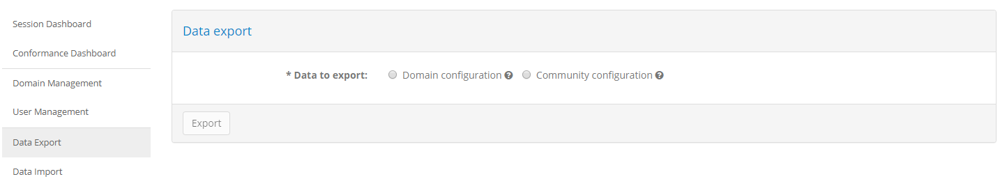

The first choice you need to make is the type of data you will be exporting. This is defined by the **Data to export** choices and can be:

* **Domain configuration:** Select this to export only the information linked to a domain (e.g. specifications, test suites).
* **Community configuration:** Select this to export the full information linked to a community (e.g. custom properties, organisations) as well as its linked domain.

The second option can be viewed as a superset of the first one in that the community data can also include all information on the domain. It is important however to 
provide the distinction given that you may want to only export your testing configuration without any information linked to a community.

Selecting **Domain configuration** expands the form to provide information on the exported data. Doing so displays the list of available domains
that will be exported as well as additional configuration options.

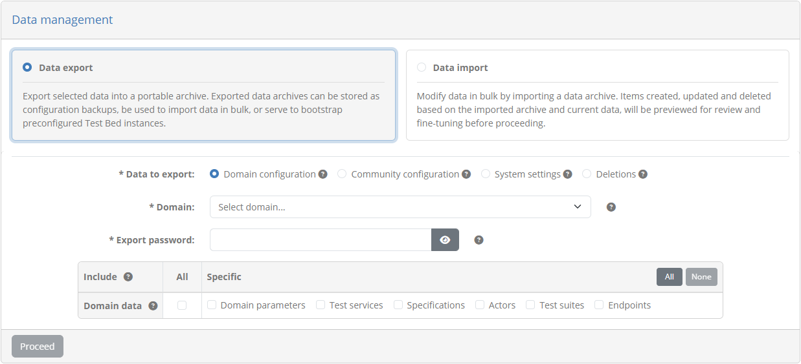

If you select **Community configuration** the form is similarly expanded to display the list of available communities and the export options. Note that the 
test bed's :ref:`default community<community__defaults__community>` is not included in this list as it cannot be exported.

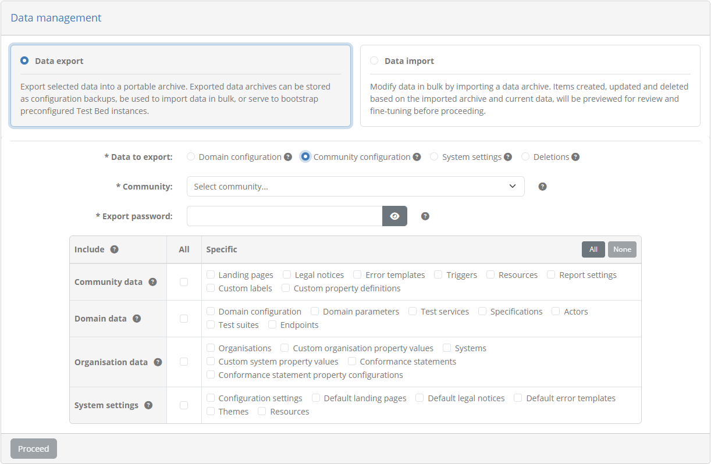

Regardless of your choice, the information you need to provide is as follows:

* The **domain** or **community** (depending on the export type) that you want to export.
* An **export password** that will be used to encrypt the export archive as well as any sensitive information that the archive would internally include. This password
  will need to be provided when you :ref:`import the archive<exportimport__import_step1>` or if you manually open it.
* The information to **include** in the archive presented as a table of available choices.

By default a domain export includes the basic information of the domain (its **short name**, **full name** and **description**) but you would typically further extend this
to include the information you need. The available types of information are presented in the **Domain data** row and can be:

* The domain's :ref:`parameters<domains__domain__parameter_list>`.
* The domain's :ref:`specifications<domains__specification>`.
* Each specification's :ref:`actors<domains__actor>`.
* Each specification's :ref:`test suites<domains__specification__test_suite_list>`.
* Each actor's :ref:`endpoints<domains__endpoint>` (including the :ref:`parameters<domains__endpoint__parameter_list>` they define).

A community export includes in addition to **domain data** the **community data** and **organisation data**. By default it includes its basic information (**short name**,
**full name**, **notification options**, **self-registration settings** and **user permissions**) but can similarly be extended. From the **Community data** row you may include the 
following types of information that form part of the configuration of the community itself:

* The :ref:`administrator accounts<community__administrators>` (only if the test bed instance is not integrated with EU Login).
* The community's :ref:`landing pages<community__manage_landing_pages>`, :ref:`legal notices<community__manage_legal_notices>` and :ref:`error templates<community__manage_error_templates>`.
* The community's :ref:`certificate settings<community__conformance_certificate_settings>`.
* The :ref:`custom labels<community__labels>` and :ref:`custom properties<community__properties>` defined for the community members.
* The :ref:`triggers<community__manage_triggers>` used to drive automated tasks when important events occur.

Using the options from the **Organisation data** row you may also include data linked to the community's members:

* The :ref:`organisations<community__organisations>`, including those that are defined as self-registration templates.
* Each :ref:`organisation's users<community__manage_organisation__users>` (only if the test bed instance is not integrated with EU Login).
* The values provided by each organisation for the community's :ref:`custom organisation properties<community__properties>`.
* The :ref:`systems<manage_your_systems>` defined by each organisation.
* The values provided for each organisation's systems relevant to the community's :ref:`custom system properties<community__properties>`.
* Each system's :ref:`conformance statements<manage_your_conformance_statements>` and :ref:`statement configuration values<manage_your_conformance_statements__view_a_conformance_statements_details__endpoints>`.

Selecting one of these options will also ensure that any prerequisites are also included. For example an export including test suites will also automatically include the
domain's specifications and actors, checking these options automatically as mandatory. You may also check the **All** option from each table row to include all its 
relevant information or the **All** button from the table's header to include everything. Clicking on **None** in the table's header will uncheck all options.

At first glance it may appear odd to export organisations that are not only self-registration templates, as well as community administrator and organisation user accounts.
Doing so is typically meaningful when replicating data across development instances and is also important when defining functional accounts for :ref:`sandbox instances<exportimport__sandbox>`.
Regarding exported **user accounts** in particular, and regardless of the use of encryption to protect account passwords, community administrators are advised to include them only
in such specific circumstances and moreover, only when these are linked to functional accounts defined by them. It is important to note that any sensitive information included 
in exports, apart from being stored as one-way hashes to begin with, is encrypted using the archive password and stored within the archive which is itself a ZIP archive
encrypted using AES encryption with a 256-bit key strength.

Once you are satisfied with the export settings click the **Export** button to produce and download the data archive.

.. note::
    **Exporting specific data:** During the export it is not possible to select individual data items to be exported (e.g. a specific test suite), only types of data.
    Such fine-grained selections can be made as part of the :ref:`import review process<exportimport__import_step2>`.

.. _exportimport__import:

Import data
-----------

You import data by means of the **Data Import** screen. To access this click the **ADMIN** link from the screen's header.

.. figure:: ../screenshots/header_admin.PNG
  :align: center

Doing so presents you with a left side menu containing links to administrative functions, of which you need to click 
the **Data Import** link.

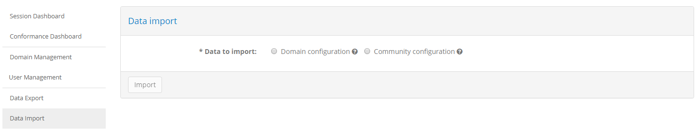

Carrying out a data import is a two-step process:

1. You first select the archive to be imported and provide the overall settings for the import.
2. Once the archive is uploaded you review the modifications it will make, confirm and complete the process.

.. _exportimport__import_step1:

Step 1: Select the data archive
~~~~~~~~~~~~~~~~~~~~~~~~~~~~~~~

Similarly to the :ref:`data export<exportimport__export>`, the first choice you need to make is on the type
of import you want to carry out. You have two choices:

* **Domain configuration:** Select this to import domain information (e.g. specifications, test suites).
* **Community configuration:** Select this to import community information (e.g. custom properties, organisations) as well as its linked domain.

Choosing the type of import to carry out is important given that the data archive you want to import from may include additional information
you would want to skip. A good example is when you have an archive containing a full community export but you want to import
only the data linked to its domain.

Selecting one of these options expands the screen to present additional information and settings.

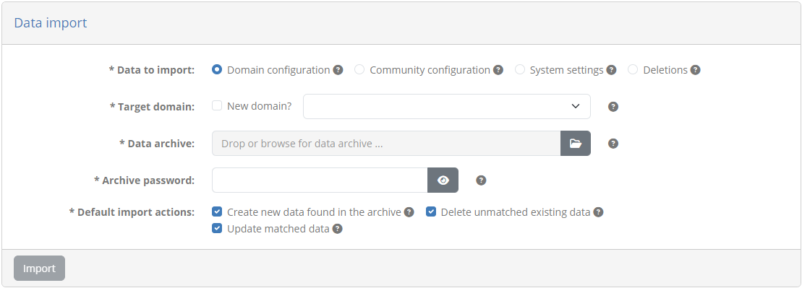

Depending on the type of data you chose to import, you see the available **domains** or **communities** presented as the **target** for the import.
Following this you are prompted to provide the **data archive** to use as well as the **password** that was set during the export to
encrypt it. Finally you are presented with a set of **default import actions** that will determine how data is to be processed.
These options are specifically:

* **Create new data found in the archive:** This will flag for creation all data that exists only in the archive and not the 
  target test bed instance.
* **Delete unmatched existing data:** This will flag for deletion all data that is found in the target test bed instance for which there
  is no match within the data archive.
* **Update matched data:** This will flag for update all data that exists both in the data archive and the target test bed instance.

These options assume a matching between data that exists within the archive and the target test bed instance. This matching is based on
information such as names (e.g. a specification's short name) which should be sufficient to identify it although not always guaranteed
to be unique. For example, a specification's actors always have a unique identifier, whereas there can be no guarantee on the name of an
organisation. Although duplicate information is not typical, administrators are advised to always :ref:`review<exportimport__import_step2>` 
the processing actions that will result from an import.

Finally, it is important to highlight that the options set as **default import actions** only affect how data is flagged to be processed.
You will always have the possibility to review this as well as override any specific processing actions as part of the 
:ref:`import's review<exportimport__import_step2>`.

Once you have provided all requested information for the import you can proceed to the next step by clicking the **Import** button.

.. note::
    **Data archive versions:** If you import a data archive that was made for an earlier Test Bed version this will automatically be
    migrated to the latest version.

.. _exportimport__import_step2:

Step 2: Review and complete the import
~~~~~~~~~~~~~~~~~~~~~~~~~~~~~~~~~~~~~~

In this screen you see the detailed actions that will be carried out as a result of the import. Actions are displayed under two main categories,
**Domains** and **Communities** that are displayed as follows:

* The **Domains** group is displayed if you are importing a domain or a community that is linked to a domain.
* The **Communities** group is displayed if you are importing a community.

Next to each group you also see the count of its items which at the top level will always be 1.

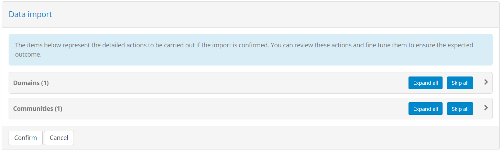

Actions are displayed in a tree structure reflecting the data they represent. You can progressively expand each group and included item by clicking its 
entry in the tree. Clicking again results in the item being collapsed. At any level you may also click the **Expand all** button at the right 
side that will expand all items starting from the point you selected. Note that collapsing an item collapses also all child items.

The displayed items are organised in **groups** and individual **data items**. The groups provide an overview of the type of data as well as the 
count of individual data items. Data items on the other hand represent each a processing action that will take place on specific data, and correspond
to the result of the import taking into account data from the archive as well as existing data in the test bed.

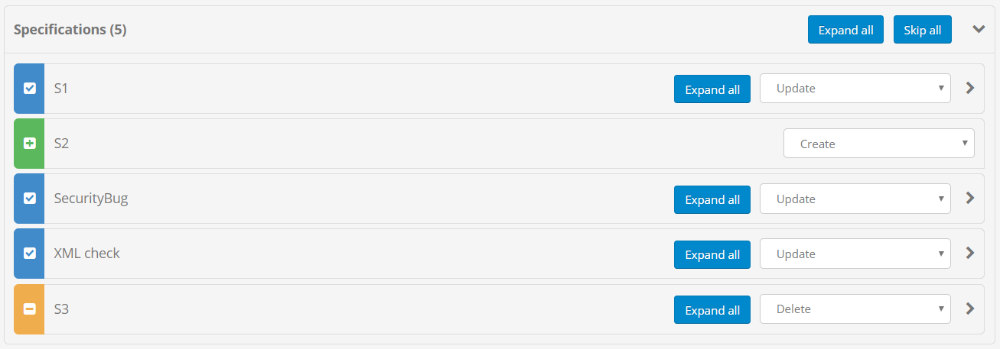

When reviewing the processing actions to be carried out it is important to identify where each actions comes from. This is done by means of colour coding
and an icon displayed in the left side of each data item. The available processing actions for each data item depend on its source, with the default 
proposed action per case determined from the settings you provided in the :ref:`previous step<exportimport__import_step1>`.
Specifically:

* **Blue item (marked with a tick):** Data that was found both in the archive and in the test bed. You may choose to **update** the data, **process only dependent child data**, 
  or **skip** the update altogether.
* **Green item (marked with a plus):** Data that was found only in the archive. You may choose to **create** the data or **skip** it.
* **Orange item (marked with a minus):** Data that was found only in the test bed. You may choose to **delete** the data or **skip** it.

From the above you likely see that the items matched both in the archive and the test bed (marked with blue) offer an additional option of processing only child data.
This is useful if you don't want to update the matched data item itself (e.g. a specification) but want to continue processing dependent data (e.g. the specification's
test suites). 

Selecting to **skip** a data item means that the import process will ignore it. A skipped item appears greyed-out and with a strike-through to make this more clear.
When you choose to skip a data item with children or a complete group of items, this will extend also to any and all child data. In this case skipping child data is
considered as being forced and is displayed as an action you cannot override.

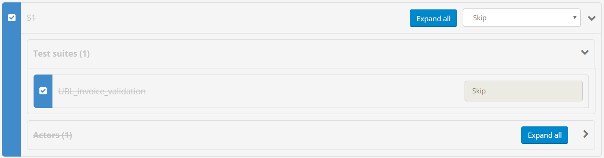

As mentioned earlier, in the case of matched data (blue items) you can choose the option to **skip but process children** that will not update the data itself but will
continue to process normally all child data. You will notice that in this case only the parent data item is greyed-out whereas child items allow you to determine their
actions.

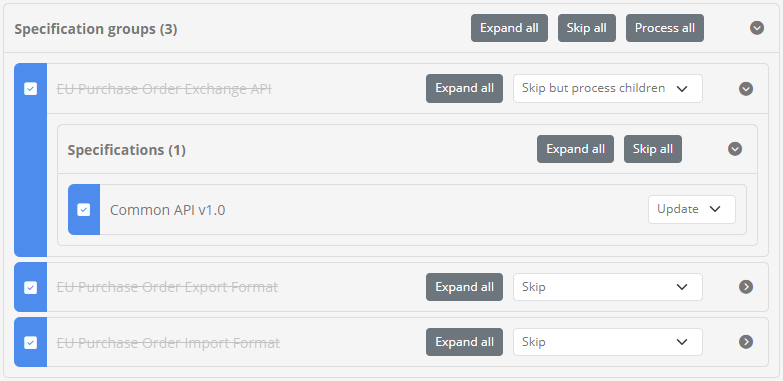

At the level of a data item group you are also presented with actions that apply to the complete group. You can specifically choose to **Skip all** its items, an option 
presented if at least one item is to be processed, or **Process all** if at least one item is set as skipped. A good example of when such controls are useful
is when you want to completely skip the import of certain types of data (e.g. skip test suites).

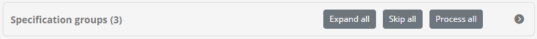

Using these controls you can review at a very fine level all changes that will be carried out from an import and adapt the processing
according to your intended result. Going into this level of detail is something you can typically skip when making an import into an empty domain 
or community, or when you want the result to reflect fully the data in the archive. A detailed review is nonetheless critical when targeting an 
existing domain or community that is currently in use to ensure there are no unwanted side-effects.

An important final note is that during the time it takes for you to review the actions and confirm the import there may be changes introduced in the
relevant data. For example, you may be importing a conformance statement for an organisation that in the meantime 
is :ref:`created manually<manage_your_conformance_statements__create>` by another user. The review you are making is linked to specific data and will never affect data
that was not reviewed. For example, if you are deleting test bed data not found in the archive, this will only be the data you have reviewed, with
any additional non-reviewed data being ignored.

Once you have completed your review and adapted the import actions click the **Confirm** button to proceed. Doing
so will complete the import and, once finished, take you back to the :ref:`import screen<exportimport__import>`.
Alternatively you can cancel the import by clicking the **Cancel** button.

.. _exportimport__sandbox:

Define a sandbox instance
-------------------------

An interesting use case that is made possible through data exports is the definition of **sandbox instances**. A sandbox is a test bed instance
that is installed by a user and that is pre-configured to make available test scenarios and development tools. The purpose of such a sandbox is
typically not formal conformance testing but rather to provide a set of test cases as utilities to be used during development. The test bed offers
a perfect mechanism to provide scenario-based development tools but this needs to be done in a manner that is as streamlined as possible. This is
made possible by means of importing data archives.

.. _exportimport__sandbox_step1:

Step 1: Prepare the sandbox data
~~~~~~~~~~~~~~~~~~~~~~~~~~~~~~~~

A sandbox's configuration is basically the full configuration linked to a domain and a community. As a first step you would prepare this in a
test bed instance you are using for development purposes to which you connect as a test bed administrator to have full control. To prepare this
proceed as follows:

1. **Create a new domain** in which you include your testing setup. It is advised to use a new domain for this to keep things separate from your normal
   setup.
2. **Create a new community** to define settings such as :ref:`labels<community__labels>` and :ref:`custom properties<community__properties>`.
3. Define an **organisation** with a **user account** that users will be using from the sandbox to launch tests. If you want that users set a new password
   for this you could also set a :ref:`one-time password<community__manage_organisation__users>`.
4. Define a **system** for the organisation with **conformance statements** to allow sandbox users to immediately start executing test cases.
5. Provide any **configuration values** needed to ensure that the tests can immediately be used. This may include :ref:`domain parameters<domains__domain__parameter_list>`, 
   :ref:`organisation and system properties<community__manage_organisation>` as well as :ref:`conformance statement configurations<manage_your_conformance_statements__view_a_conformance_statements_details__endpoints>`.
6. Once you are happy with the configuration proceed to :ref:`export<exportimport__export>` the complete community and its domain.

At this stage you have a data export you can use that contains all the configuration needed to start executing tests. The next step in the process is to
use this data archive to setup a sandbox instance.

.. _exportimport__sandbox_step2:

Step 2: Prepare the sandbox installation
~~~~~~~~~~~~~~~~~~~~~~~~~~~~~~~~~~~~~~~~

A user setting up a sandbox instance will be expecting a **streamlined setup experience**. In theory, one could use the data archive you prepared in the 
:ref:`previous step<exportimport__sandbox_step1>` by (a) `installing an empty test bed`_, (b) connecting using the default test bed administrator account, (c) creating
an empty domain and a community linked to it, and (d) importing the community. This however represents a multi-step process that seems more like a
workaround rather than a streamlined setup.

To simplify this process the test bed can be installed with configuration that enables advanced sandbox support. You have two options available depending
on the approach you want to make available:

* **Automatic sandbox setup:** The sandbox data is set up as part of the test bed's installation.
* **Manual sandbox setup:** Once the test bed is installed the user is prompted to provide the data archive.

.. _exportimport__sandbox_step2_approach1:

Approach 1: Automatic sandbox setup
+++++++++++++++++++++++++++++++++++

This approach sets up the sandbox data as part of the test bed's installation. It is the simplest approach given that users would simply install the test
bed and get started. However, to use this approach there is a prerequisite and a caveat:

* **Prerequisite:** The test bed sandbox instance needs to be installed on an operating system that allows direct access to its filesystem for `Docker containers`_ (via volumes).
* **Caveat:** The password used to generate the export needs to be provided as part of the test bed's installation script.

In short, to follow this approach you would prepare the test bed's installation script according to your needs and provide alongside it the data archive
to use for its initialisation. The archive and its password are provided as input to the test bed, allowing it to read and process it automatically
upon its initial run.

The test bed's overall installation is driven through `Docker`_ and specifically `docker-compose`_. Make a copy of the installation script provided
in the test bed's `installation guide`_ and adapt it as needed to include additional services you need such as validators. What is important for the
sandbox setup is the additional configuration to be done to the **gitb-ui** service. Specifically:

.. code::

    version: '2.1'
        ...
    services:
        ...
        gitb-ui:
            ...
            environment:
                ...
                - DATA_ARCHIVE_KEY=the_archive_password
            volumes:
                ...
                - ./data/:/gitb-repository/data/in/:rw

The important points here are:

* The ``DATA_ARCHIVE_KEY`` environment variable that is set with the password used for the data export.
* The volume that maps a folder ``data`` next to the script to a specific location within the container.

Next up, you need to create the ``data`` folder and copy within it the data archive :ref:`prepared previously<exportimport__sandbox_step1>`. 
To keep things simple, the ``data`` folder should be created next to the installation script so that it can be referred to from within the 
script using the relative path ``./data/``. As a final step ZIP the installation script and ``data`` folder to create a single installation
bundle and provide it to your users. 

On the side of the user the **installation process** is very simple:

1. The user extracts the installation package you provided in a target folder.
2. From within the target folder the user installs the test bed by issuing ``docker-compose up -d``.
3. Once the installation completes the user can connect to the test bed using the account(s) you have defined
   and start executing tests.

.. _exportimport__sandbox_step2_approach2:

Approach 2: Manual sandbox setup
++++++++++++++++++++++++++++++++

The manual setup approach requires an extra step by users as part of the installation but offers important benefits:

* It can be ubiquitously applied as it has no prerequisites on how `Docker containers`_ access the host file system.
* It avoids the need of including the archive password in the installation script.

The test bed's overall installation is driven through `Docker`_ and specifically `docker-compose`_. Make a copy of the installation script provided
in the test bed's `installation guide`_ and adapt it as needed to include additional services you need such as validators. What you need to do in
this case is configure the **gitb-ui** service to expect a data archive upon first connection:

.. code::

    version: '2.1'
        ...
    services:
        ...
        gitb-ui:
            ...
            environment:
                ...
                - DATA_WEB_INIT_ENABLED=true

The important point here is the ``DATA_WEB_INIT_ENABLED`` environment variable that is set to ``true``. Doing so will instruct the test bed
to prompt the user for the data archive upon first connection. To complete the preparation, bundle together the installation script and the 
data archive :ref:`prepared previously<exportimport__sandbox_step1>` that you can then provide to your users. You need to also communicate the archive's password as this
will be requested for the setup.

From the user's point of view the **installation process** involves the following step:

1. The user copies the installation script you provided in a target folder.
2. From within the target folder the user installs the test bed by issuing ``docker-compose up -d``.
3. Upon first connection the user is automatically prompted to supply the data archive she received as well as its password.

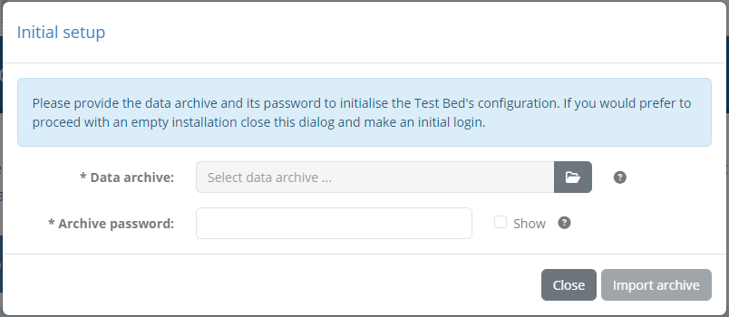

Note that compared to the :ref:`import screen<exportimport__import_step1>` you access within the test bed, there is here no selection of target domains or communities, nor choices
for default import actions. Upon clicking the **Import archive** button the archive is processed to create a new community linked to a new domain with all contained data flagged for creation. Once
this initial import has been completed, the user can log in using the account(s) you have defined within the data archive. Note that this initialisation
process can only be carried out once.

The user may close the data initialisation popup by clicking the **Close** button. One reason to do this would be to skip data initialisation and proceed with an empty test bed instance. To
do this the user can close the popup and proceed to make an initial login using the test bed's default administrator account. Note that if the dialog is closed by mistake, the user can always make it 
reappear by refreshing the screen (assuming no login has been made in the meantime).

.. note::

  **Automatic vs manual sandbox setup:** Choosing the setup approach to follow (or potentially allowing both) is up to you. Automatic setup requires no user interaction but assumes an operating system
  that runs `Docker`_ natively, allowing it to directly read files from its filesystem. If this is a problem, or if you want to avoid including the data archive's password in the configuration file,
  choosing the manual approach is the best option. As a rule of thumb the approach that is guaranteed to work in all cases is the manual setup.

.. _installing an empty test bed: https://www.itb.ec.europa.eu/docs/guides/latest/installingTheTestBed
.. _installation guide: https://www.itb.ec.europa.eu/docs/guides/latest/installingTheTestBed
.. _docker-compose: https://docs.docker.com/compose/
.. _Docker containers: https://www.docker.com/
.. _Docker: https://www.docker.com/