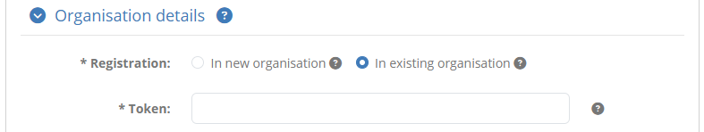
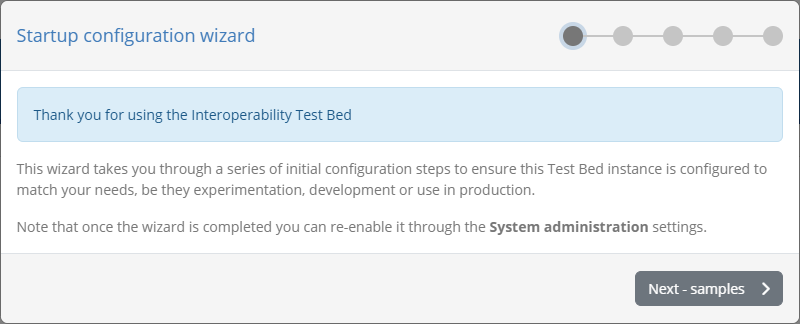
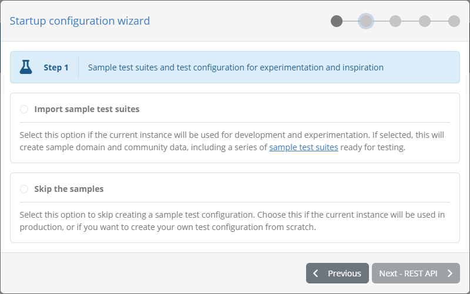
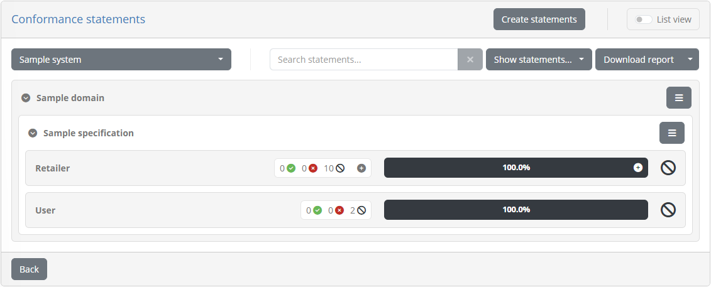
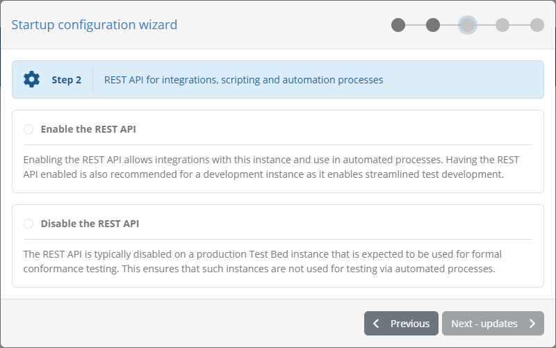
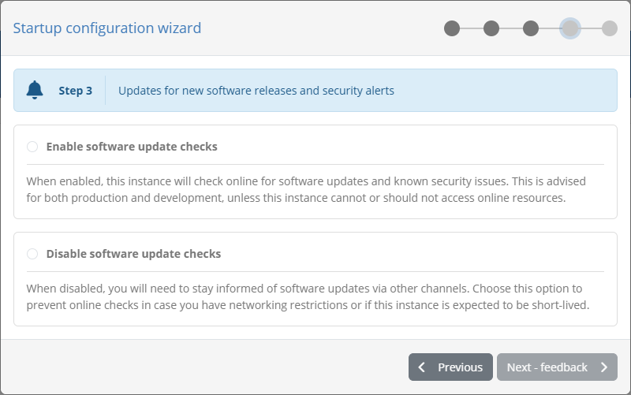
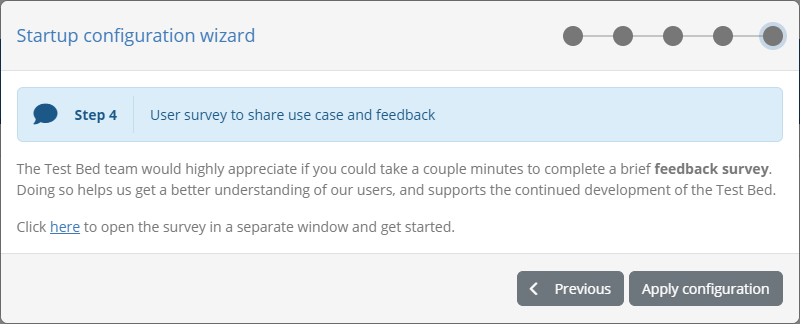
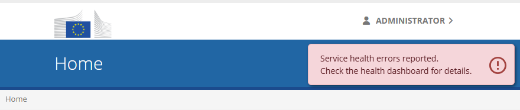
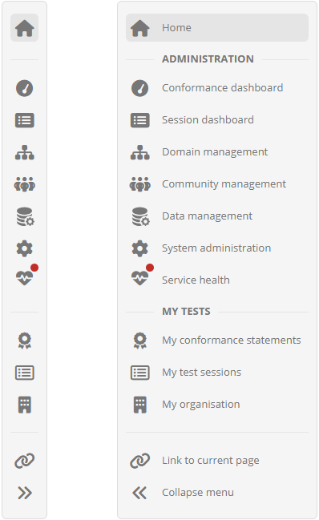

.. _login:

Log in
======

Before carrying out any action on the Test Bed you will need to log in. The first step in doing so is to access the Test Bed's
welcome page.

.. _login__welcome:

Welcome page
------------

The Test Bed's welcome page serves as your first stop when visiting the Test Bed. It provides you with useful information,
the option to log in, as well as shortcuts for tasks you may want to do before connecting.

.. figure:: ../screenshots/welcome_basic.PNG
  :align: center

The content of the welcome page may vary depending on the Test Bed's setup. The example listed above is a simple case which
displays:

* A welcome message. This can be adapted as part of the overall :ref:`system settings<systemAdmin__config>`.
* The main **Click to log in** button to log you in.
* The **Register in a public community** shortcut allowing to self-register for one of the Test Bed's communities (see :ref:`login__create_account`).
  This can be deactivated as part of the overall :ref:`system settings<systemAdmin__config>`
* A privacy note with a link to view the Test Bed's legal notice.

A more complete example can be found in the `DIGIT Test Bed instance`_ where additional information and shortcuts are displayed:

.. figure:: ../screenshots/welcome_complete.PNG
  :align: center

In this case, you are additionally presented with:

* The **Confirm your new role** shortcut to approve a role that is assigned to you by an administrator (see :ref:`login__roles__confirm`).
* The **Try out our demos** shortcut to take you to the Test Bed's demos (see :ref:`login__demos`).
* A message on the use of **EU Login** to authenticate (if EU Login is used for authentication), along with the link to a simplified `EU Login user guide`_.
* A **migration note** on how to migrate a legacy username and password based account to EU Login, including a shortcut to
  start the migration and a link to a `step-by-step guide`_ (see :ref:`login__roles__migrate`).

.. note::

  **EU Login:** Most of the additional information on the Test Bed's welcome page is only displayed if the instance you are
  using is integrated with EU Login. This is normally the case for Test Bed instances operated by the European Commission.

.. _login__login:

Log in
------

To trigger the login process click on **Click to log in** from the Test Bed's welcome page.

.. figure:: ../screenshots/welcome__login.png
  :align: center

What happens from here depends on the Test Bed's authentication approach:

* Use of an external identity provider such as EU Login (see :ref:`login__login__eulogin`).
* Test Bed username and password based accounts (see :ref:`login__login__legacy`).

.. note::
  **Initial login following installation:** When you first install the Test Bed and log in for the first time, the
  login process is slightly. Check the :ref:`specific section <login__initial>` on this first login for more details.

.. _login__login__eulogin:

Logging in with an identity provider
~~~~~~~~~~~~~~~~~~~~~~~~~~~~~~~~~~~~

If the Test Bed uses an external identity provider you will be transferred to the provider's sign-in page to authenticate.
For European Commission Test Bed instances this provider is typically EU Login, in which case you will need to authenticate
using your EU Login account. If you already have an active session you will simply be displayed a confirmation message before
proceeding to access the Test Bed.

.. figure:: ../screenshots/eu_login.png
  :align: center
  :scale: 70%

In the case of EU Login being used, the Test Bed also features a simplified `EU Login user guide`_ in case you are unfamiliar with it. This is also accessible through
a link on the welcome page.

.. figure:: ../screenshots/welcome_eu_login_tutorial.png
  :align: center

Once you have authenticated you will be transferred back to the Test Bed as follows:

* If you have a single role assigned to you you will be automatically transferred to the :ref:`Test Bed's landing page<navigate__landing_page>`.
* If you don't have an assigned role or have multiple roles you will be transferred to a screen to select the one to proceed with. See :ref:`login__roles` for details.

.. _login__login__legacy:

Logging in without an identity provider
~~~~~~~~~~~~~~~~~~~~~~~~~~~~~~~~~~~~~~~

In case an external identity provider such as EU Login is not enabled for your Test Bed, you will be using username and password based accounts. The login screen
in this case requires you to provide:

* Your account's **username**.
* Your account's **password**.

.. figure:: ../screenshots/login.PNG
  :align: center

Your account credentials are those configured during installation or provided to you by another Test Bed administrator.
Once you have entered your credentials click the **Log in** button.

.. _login__onetime_password:

Replacing a one-time password
+++++++++++++++++++++++++++++

If this is the first time you are logging into the Test Bed your password provided to you by your administrator is
considered a "one-time password". This means that it is only valid for a single login in which as a first step you
will need to change it. Note that you may also need to go through this step if you are already a Test Bed user but
an administrator has reset your password.

.. figure:: ../screenshots/login_change_onetime_password.PNG
  :align: center

In the form that appears you are requested to:

* Provide your **current password**.
* Provide a **new password**.

The new password you provide must meet minimum expected complexity requirements. Specifically:

* It must include at least one lowercase letter, uppercase letter, digit and symbol.
* It must be at least 8 characters long.

Once ready click on **Save** to change your password and access the Test Bed.

.. _login__create_account:

Register for a public community
-------------------------------

From the Test Bed's welcome page you have the option of registering for one of its public communities. Selecting to do this will prompt
you to create an account linked to a new organisation that will be registered in one of the Test Bed's available communities.
This process is also referred to as "self-registration".

To carry out the registration start by clicking the **Register in a public community** shortcut from the Test Bed's welcome page.

.. figure:: ../screenshots/welcome__create_account.png
  :align: center

.. note::
  In case the Test Bed uses an external identity provider such as EU Login, you will be first prompted to authenticate
  using the provider's sign-in form. Once you authenticate, you will be transferred to a simplified registration form
  described in :ref:`login__roles__register`.

  The information that follows in this section covers the case of a Test Bed where an external identity provider is **not enabled**.

If you are using a Test Bed that is not integrated with an external identity provider you will be presented with a registration form in which
you are expected to:

* Select the community you want to register for.
* Provide the details for your new organisation or select an existing organisation.
* Provide the details for your new administrator account.

As a first step you are presented with the publicly available communities, displaying their name and description.

.. figure:: ../screenshots/self_registration__select_community.png
  :align: center

Select one of the available communities by clicking on its relevant row. Doing so will present you the registration form linked to this community.

.. figure:: ../screenshots/self_registration__non_eu_login.PNG
  :align: center

The information needed to complete this form is as follows:

* **Registration token:** A token value you are expected to provide to register for the community. The value for this token
  will be provided to you by the community's administrator. If a token is not required this input will not be displayed.
* **Short name:** The name of your organisation in short form.
* **Full name:** The name of your organisation in full form.
* **Configuration:** A list of configuration templates for your organisation, defined by the community's administrator,
  that will predefine your organisation's systems and conformance statements. This will not be displayed if no such
  templates are available.
* **Name:** The name for your new organisation's initial administrator account.
* **Username:** A username for the account.
* **Password:** The password for the new administrator account.

The password you provide must meet minimum expected complexity requirements. Specifically:

* It must include at least one lowercase letter, uppercase letter, digit and symbol.
* It must be at least 8 characters long.

Depending on the community's configuration, you may also be provided the option to join an existing organisation as opposed
to registering a new one. Moreover, joining an existing organisation may also be the only option available. If joining
an existing organisation is enabled, you will be prompted to provide the organisation's **registration token**, serving
to uniquely identify the organisation.

When registering a new organisation, the **organisation details** section may also include one or more additional properties that the community's administrator requires
for completion during registration. These properties may be simple text values, values to select from preset lists, secret values or files for you to upload, and may be 
optional or required. Properties marked as required must be provided before you can start executing tests, but depending on the 
community's configuration, you may still be allowed to proceed with your registration without completing them.

Once the information is provided click on **Register** to create your organisation and proceed to your landing page. Clicking
on **Cancel** will return you back to the welcome page.

.. _login__demos:

Launch demos
------------

If the Test Bed foresees a set of demo scenarios these can be accessed through the welcome page by clicking on the
**try out our demos** link.

.. figure:: ../screenshots/welcome__demos.png
  :align: center

Doing so will connect you to the Test Bed using a special demo account with predefined test scenarios you can execute. From the
:ref:`landing page<navigate__landing_page>` for this account you can then click the **My conformance statements** link from the menu to view the
available :ref:`demo conformance statements<manage_your_conformance_statements__view_your_conformance_statements>` and proceed
to execute their test cases.

.. _login__roles:

Manage your roles
-----------------

.. note::

  This feature is applicable only if the Test Bed is integrated with an external identity provider such as EU Login. In this case you are
  considered as having a single account and one or more roles in defined organisations (potentially in
  different communities). If the Test Bed is not integrated with an external identity provider such roles are determined by separate username and password based accounts.

In this screen you can view and manage the roles assigned to you. You can reach this screen by multiple means, including shortcuts on
the Test Bed's :ref:`welcome page<login__welcome>` and controls from your :ref:`profile management page<manage_your_profile>`.

.. figure:: ../screenshots/roles__ou.PNG
  :align: center

This screen presents to you the list of roles currently linked to your account. For each role you see:

* Your role level (e.g. "User", "Administrator"). This is also represented by a different colour accent (e.g. grey for a "User").
* The name of your organisation.
* The name of your organisation's community.

Clicking on one of the listed roles will select it and transfer you to the relevant :ref:`organisation's landing page<navigate__landing_page>`.
Alternatively from here you can click the **Link another role to your account** button to select additional roles. Doing so
displays a popup with your available options:

.. figure:: ../screenshots/roles__popup.PNG
  :align: center

Depending on the option you select you can:

* Confirm a role assigned to you by an administrator (see :ref:`login__roles__confirm`).
* Register a new organisation in a public community (see :ref:`login__roles__register`).
* Migrate a legacy account to EU Login (see :ref:`login__roles__migrate`).

.. _login__roles__confirm:

Confirm an assigned role
~~~~~~~~~~~~~~~~~~~~~~~~

Roles are assigned to you by administrators and represent your permission to access specific organisations. An administrator does
this by linking your email address, the one also linked to your EU Login account, to the role in question. Before you start using
such a role you need to first confirm its assignment to you, an action that will also record in the Test Bed your EU Login
account's information.

To confirm an assigned role select the relevant option from the popup dialog.

.. figure:: ../screenshots/roles__popup__confirm_option.PNG
  :align: center

Doing so will present you with the list of roles that are currently assigned to you and are pending your confirmation.

.. figure:: ../screenshots/roles__popup__confirm_form.PNG
  :align: center

Similar to the display of your current roles, you see per case the role, the relevant organisation's name and the
organisation's community. To confirm an assignment, click on it to highlight it and then on **Complete**. Doing so will close the dialog and
display the relevant role in your available connection options. Note that you can also click on **Cancel** to abort the process and
close the dialog.

.. _login__roles__register:

Register a new organisation
~~~~~~~~~~~~~~~~~~~~~~~~~~~

You can register yourself a new organisation in one of the Test Bed's available communities. To do so select the relevant option
from the popup dialog.

.. figure:: ../screenshots/roles__popup__register_option.PNG
  :align: center

As a first step you are presented with the publicly available communities, displaying their name and description.

.. figure:: ../screenshots/roles__popup__register_communities.PNG
  :align: center

Select one of the available communities by clicking on its relevant row. Doing so will present you the registration form linked to this community.

.. figure:: ../screenshots/roles__popup__register_form.PNG
  :align: center

To complete the registration form provide the following information:

* **Registration token:** A token value you are expected to provide to register for the community. The value for this token
  will be provided to you by the community's administrator. If a token is not required this input will not be displayed.
* **Short name:** The name of your organisation in short form.
* **Full name:** The name of your organisation in full form.
* **Configuration:** A list of configuration templates for your organisation, defined by the community's administrator,
  that will predefine your organisation's systems and conformance statements. This will not be displayed if no such
  templates are available.

Depending on the community's configuration, you may also be provided the option to join an existing organisation as opposed
to registering a new one. Moreover, joining an existing organisation may also be the only option available. If joining
an existing organisation is enabled, you will be prompted to provide the organisation's **registration token**. This token
acts as a key to uniquely identify the organisation and will need to be shared to you by an administrator.

When registering a new organisation, the **organisation details** section may also include one or more additional properties that the community's administrator requires
for completion during registration. These properties may be simple text values, secret values or files for you to upload, and may be
optional or required. Note that properties highlighted as required will not prevent you from completing the registration if you don't
supply them. These will need to be provided however before you can execute any tests.

Once the information is provided click on **Complete** to finish the registration. Doing so will close the dialog and
display the relevant role in your available connection options. Note that you can also click on **Cancel** to abort the process and
close the dialog.

.. _login__roles__migrate:

Migrate a legacy account
~~~~~~~~~~~~~~~~~~~~~~~~

If the Test Bed has migrated from legacy username and password accounts to using an identity provider service (for example EU Login),
it will allow you to migrate your legacy account as a new role linked to your provider's account.

To migrate a legacy account start by selecting the relevant option from the popup dialog. Note that this selection is already done
for you in case you clicked the migration link from the Test Bed's :ref:`welcome page<login__welcome>`.

.. figure:: ../screenshots/roles__popup__migrate_option.PNG
  :align: center

Doing so will present you with a form to provide your legacy account's credentials.

.. figure:: ../screenshots/roles__popup__migrate_form.PNG
  :align: center

Complete this form by providing:

* **Username:** The username you have been using to log in.
* **Password:** The password for your legacy account.

Once you have provided this information click on **Complete** to validate your legacy credentials. If the validation succeeds
this account will be converted into a role and be linked to your provider's account. Once complete, the dialog will close and you
will see your migrated role displayed as an available connection option. Note that you can also click on **Cancel** to abort
the process and close the dialog.

.. note::

  The Test Bed offers also a `step-by-step migration guide <https://www.itb.ec.europa.eu/docs/guides/latest/migratingToEULogin>`__ to inform and guide you through the
  process of migrating your legacy account.

.. _login__initial:

Initial administrator login
---------------------------

When you log in for the first time on a new Test Bed instance you will need to make your initial connection using an
**automatically generated administrator account**. The username for this account is ``admin@itb`` whereas the password
is listed in the ``itb-ui`` application's logs as follows:

.. code-block:: none

  ...
  ###############################################################################

  The one-time password for the default administrator account [admin@itb] is:

  b1afbc39-8ad7-49f4-a9d9-0bcec942aef4

  ###############################################################################
  ...

This password is replaced at every startup, and will be included in the logs until a first connection has been made.
How this connection takes place depends on the authentication approach configured for the Test Bed, and specifically
whether or not you have an **external identity provider** such as EU Login configured:

* **Without an identity provider:** :ref:`Log in as normal <login__login__legacy>` and provide the ``admin@itb`` account's
  credentials. Upon doing so you are prompted to :ref:`replace the auto-generated password <login__onetime_password>`
  before proceeding.
* **Using an identity provider:** The Test Bed is automatically set in account migration mode. Choose to
  :ref:`migrate your account <login__roles__migrate>`, for which you provide the ``admin@itb`` account's credentials
  including the auto-generated password. Until you have migrated this account the Test Bed will remain in account migration
  mode.

Once you have completed your initial connection you will be taken to the Test Bed's :ref:`default landing page <navigate__landing_page>`,
and the :ref:`startup configuration wizard <login__startup_wizard>` will be displayed.

.. _login__startup_wizard:

Startup configuration wizard
~~~~~~~~~~~~~~~~~~~~~~~~~~~~

When you connect to the Test Bed for the very first time as a Test Bed administrator, you will be presented with a
**startup configuration wizard**. The purpose of this is to simplify the Test Bed's initial configuration depending on
its intended use.

.. note::
  Once completed, the wizard can be re-enabled through the :ref:`system configuration dashboard <systemAdmin__config>`.

The wizard initially displays a **welcome message** before proceeding with the configuration steps. Configuration changes
will only be applied once the overall wizard is completed. Note that once you have made a choice for a given step you can
move to the next one and return to previous ones.

The first step covers the automatic setup of **samples**.

Enabling the bundled samples is advised if you are going to use the Test Bed for experimentation or development, as they
give you a ready-to-use test configuration covering a range of use cases. Choosing to do so will:

1. Create an initial :ref:`domain <domains__domain_view>` and :ref:`specification <domains__domain__specification_list>`.
2. Import the `GITB TDL example test suites <https://www.itb.ec.europa.eu/docs/tdl/latest/examples/>`__ to the specification.
3. Create a :ref:`community <community_testbed_communities>` linked to the sample domain.
4. Create an :ref:`organisation <community__organisations>` and the
   :ref:`conformance statements <manage_your_conformance_statements>` to test for.

To try out the sample tests you will need to access the created organisation's tests as follows:

1. From the :ref:`Community management <community>` screen select the **Sample community**.
2. From the community's :ref:`organisation tab <community__organisations>` select the **Sample organisation**.
3. Click on **Manage tests** to view the organisation's :ref:`conformance statements <manage_your_conformance_statements>`.

The resulting screen displays the sample specification's conformance statements.

From here you can select statements and execute their included tests. Note that sample tests have no
external dependencies and include all necessary test data and usage instructions.

The next wizard step covers the Test Bed's :ref:`REST API <api>`.

The :ref:`REST API <api>` is disabled by default to avoid production Test Bed instances being used in automated test
processes. You can enable it explicitly from the wizard, which is proposed here primarily because the REST API is a key tool
for developers in streamlining test development. Otherwise you can still manage this from the
:ref:`system configuration screen <systemAdmin__config>`.

The next step concerns the automated checking for **software updates**.

Enabling software update checks is advised in all cases as it allows you to easily check for new releases, and most
importantly, be notified if the release you are currently using has known security issues. Such checks are made upon
:ref:`administrator login <login__health_check>` and through the :ref:`service health dashboard <serviceHealth>`.

The software update check is disabled by default as it involves calling (anonymously) an online check endpoint
maintained by DIGIT. You may want to keep this disabled if your Test Bed instance has no internet access, or if you want
to avoid any external calls.

The final wizard step covers **feedback**.

The Test Bed's `feedback survey <https://ec.europa.eu/eusurvey/runner/itb>`__ is entirely optional but goes a long
way in giving an indication to the Test Bed team of the different projects using it. You complete this anonymously
and can choose to either provide very limited information on your use case, or expand into more extended feedback.
You may also choose to share your contact information if you would like to get in touch.

To complete the wizard and apply the selected options, click on **Apply configuration**.

.. _login__health_check:

Service health check
--------------------

When a Test Bed administrator connects to the Test Bed, an **automated health check** is performed to ensure everything is
running smoothly. In case of detected warnings or errors, you will be notified by a relevant popup:

This popup is persistent and needs to be clicked to be dismissed. In addition, the menu entry for the
:ref:`service health dashboard <serviceHealth>` will be displayed with an error or warning bubble.

In case you see such notifications, you should visit the :ref:`service health dashboard <serviceHealth>` as soon as
possible to determine the underlying issue and see how to resolve it.

.. _DIGIT Test Bed instance: https://www.itb.ec.europa.eu/itb
.. _EU Login user guide: https://www.itb.ec.europa.eu/docs/guides/latest/usingEULogin/
.. _step-by-step guide: https://www.itb.ec.europa.eu/docs/guides/latest/migratingToEULogin/