.. _login:

Log in
======

Before carrying out any action on the Test Bed you will need to log in. The first step in doing so is to access the Test Bed's
welcome page.

.. _login__welcome:

Welcome page
------------

The Test Bed's welcome page serves as your first stop when visiting the Test Bed. It provides you with useful information,
the option to log in, as well as shortcuts for tasks you may want to do before connecting.

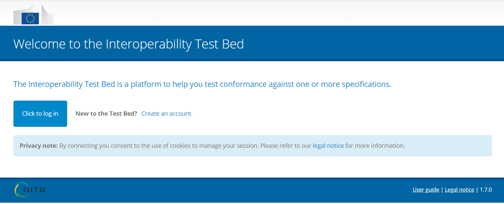

The content of the welcome page may vary depending on the Test Bed's setup. The example listed above is a simple case which
displays:

* A welcome message. This can be adapted as part of the overall :ref:`system settings<systemAdmin__config>`.
* The main **Click to log in** button to log you in.
* The **Register in a public community** shortcut allowing to self-register for one of the Test Bed's communities (see :ref:`login__create_account`).
  This can be deactivated as part of the overall :ref:`system settings<systemAdmin__config>`
* A privacy note with a link to view the Test Bed's legal notice.

A more complete example can be found in the `DIGIT Test Bed instance`_ where additional information and shortcuts are displayed:

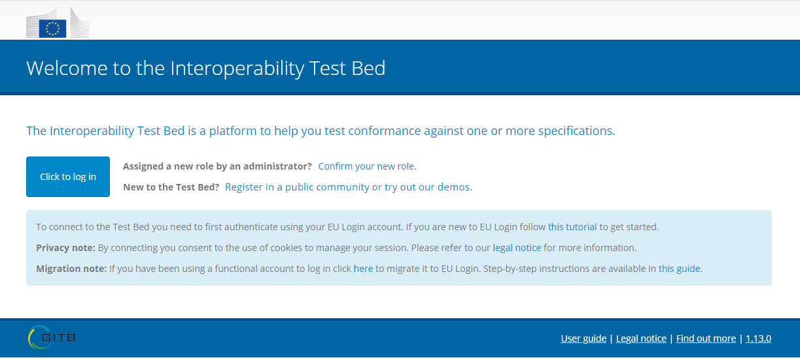

In this case, you are additionally presented with:

* The **Confirm your new role** shortcut to approve a role that is assigned to you by an administrator (see :ref:`login__roles__confirm`).
* The **Try out our demos** shortcut to directly take you to the Test Bed's demos (see :ref:`login__demos`).
* A message on the use of **EU Login** to authenticate, along with the link to a simplified `EU Login user guide`_.
* A **migration note** on how to migrate a legacy username and password based account to EU Login, including a shortcut to
  start the migration and a link to a `step-by-step guide`_ (see :ref:`login__roles__migrate`).

.. note::

  **EU Login:** Most of the additional information on the Test Bed's welcome page is only displayed if the instance you are
  using is integrated with EU Login. This is normally the case for Test Bed instances operated by the European Commission.

.. _login__login:

Log in
------

To trigger the login process click on **Click to log in** from the Test Bed's welcome page.

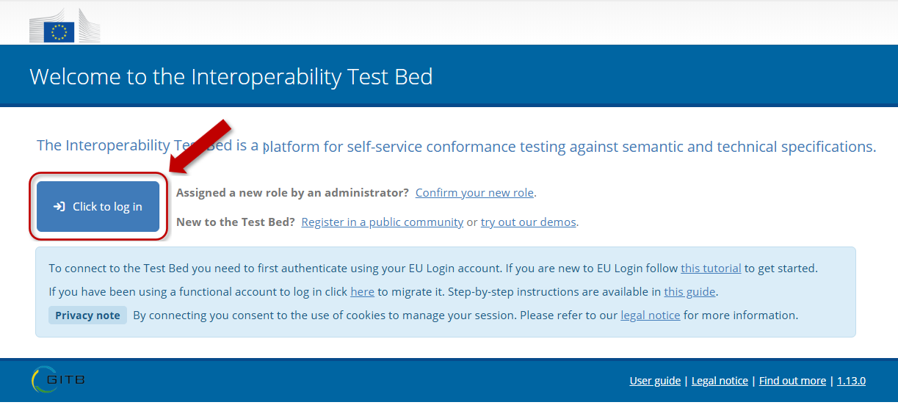

What happens from here depends on the Test Bed's authentication approach:

* EU Login (see :ref:`login__login__eulogin`).
* Test bed username and password based accounts (see :ref:`login__login__eulogin`).

.. _login__login__eulogin:

Logging in with EU Login
~~~~~~~~~~~~~~~~~~~~~~~~

If EU Login integration is enabled (most likely the case for European Commission Test Bed instances), you will be transferred
to a sign-in page where you will be requested to authenticate using your EU Login account. If you already have an active
session you will simply be displayed a confirmation message before proceeding to access the Test Bed.

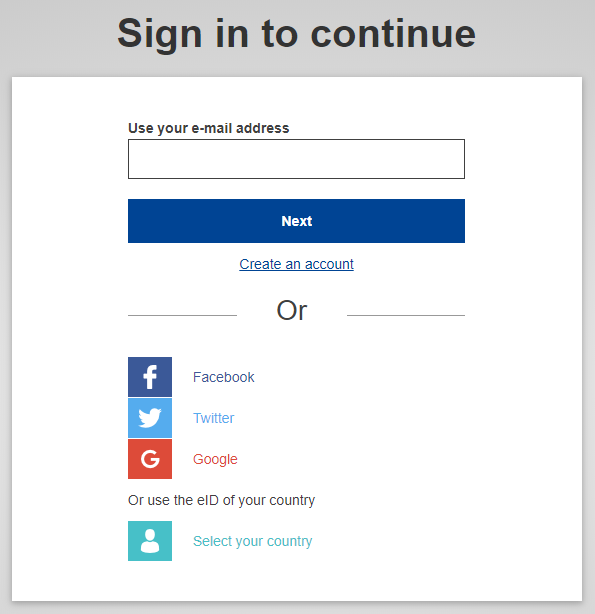

The Test Bed features a simplified `EU Login user guide`_ in case you are unfamiliar with it. This is also accessible through
a link on the welcome page.

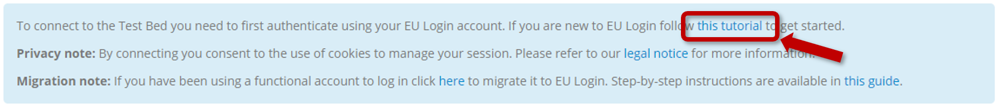

Once you have authenticated you will be transferred back to the Test Bed as follows:

* If you have a single role assigned to you you will be automatically transferred to the :ref:`Test Bed's landing page<navigate__landing_page>`.
* If you don't have an assigned role or have multiple roles you will be transferred to a screen to select the one to proceed with. See :ref:`login__roles` for details.

.. note::
  **Initial login following installation:** A fresh Test Bed installation defines an initial administrator account
  that can be used to make the first login, however this is a username and password based account. If your Test Bed
  instance is to be integrated with EU Login it needs to first be configured as being in "migration mode" to
  allow you to link your EU Login account to the default administrator.

.. _login__login__legacy:

Logging in without EU Login
~~~~~~~~~~~~~~~~~~~~~~~~~~~

In case EU Login is not enabled for your Test Bed you will be using username and password based accounts. The login screen
in this case requires you to provide:

* Your account's **username**.
* Your account's **password**.

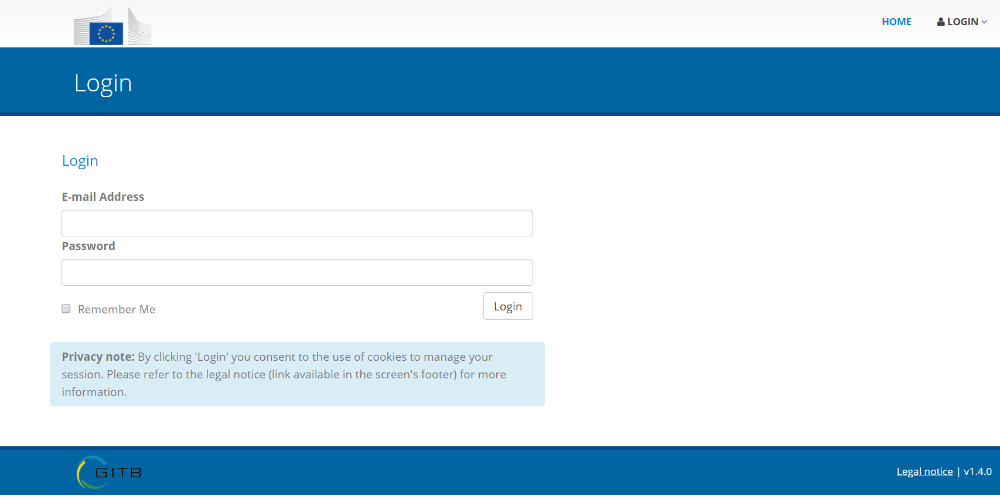

Your account credentials are those configured during installation or provided to you by another Test Bed administrator.

On the login screen you also have the possibility to have the Test Bed keep your session open. To do this
simply check the **Remember me** checkbox below the login form. Once you have entered your credentials click
the **Log in** button.

.. _login__onetime_password:

Replacing a one-time password
+++++++++++++++++++++++++++++

If this is the first time you are logging into the Test Bed your password provided to you by your administrator is
considered a "one-time password". This means that it is only valid for a single login in which as a first step you
will need to change it. Note that you may also need to go through this step if you are already a Test Bed user but
an administrator has reset your password.

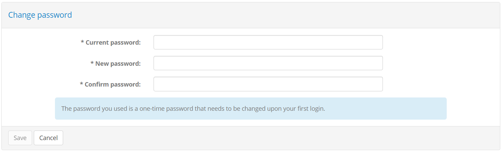

In the form that appears you are requested to:

* Provide your **current password**.
* Provide a **new password**.

The new password you provide must meet minimum expected complexity requirements. Specifically:

* It must include at least one lowercase letter, uppercase letter, digit and symbol.
* It must be at least 8 characters long.

Once ready click on **Save** to change your password and access the Test Bed.

.. _login__create_account:

Register for a public community
-------------------------------

From the Test Bed's welcome page you have the option of registering for one of its public communities. Selecting to do this will prompt
you to create an account linked to a new organisation that will be registered in one of the Test Bed's available communities.
This process is also referred to as "self-registration".

To carry out the registration start by clicking the **Register in a public community** shortcut from the Test Bed's welcome page.

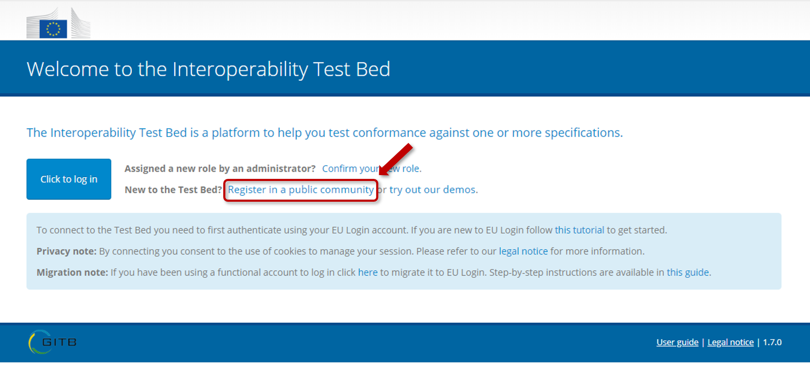

.. note::
  In case the Test Bed uses EU Login you will be first prompted to authenticate and then transferred to a simplified
  registration form described in :ref:`login__roles__register`.

  The information that follows in this section covers the case of a Test Bed where EU Login is **not enabled**.

If you are using a Test Bed that is not integrated with EU Login you will be presented with a registration form in which
you are expected to:

* Select the community you want to register for.
* Provide the details for your new organisation.
* Provide the details for the new organisation's initial administrator.

As a first step you are presented with the publicly available communities, displaying their name and description.

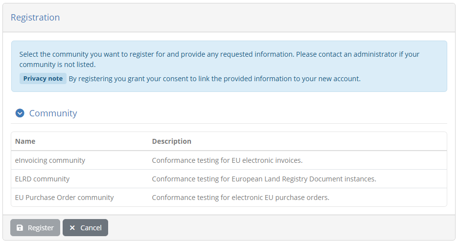

Select one of the available communities by clicking on its relevant row. Doing so will present you the registration form linked to this community.

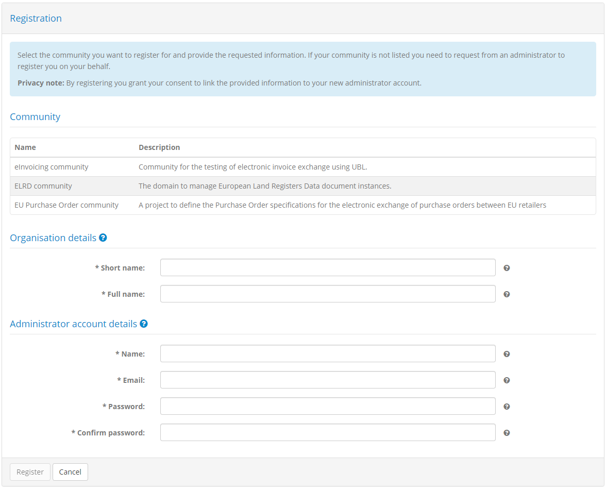

The information needed to complete this form is as follows:

* **Registration token:** A token value you are expected to provide to register for the community. The value for this token
  will be provided to you by the community's administrator. If a token is not required this input will not be displayed.
* **Short name:** The name of your organisation in short form.
* **Full name:** The name of your organisation in full form.
* **Configuration:** A list of configuration templates for your organisation, defined by the community's administrator,
  that will predefine your organisation's systems and conformance statements. This will not be displayed if no such
  templates are available.
* **Name:** The name for your new organisation's initial administrator account.
* **Username:** A username for the account.
* **Password:** The password for the new administrator account.

The password you provide must meet minimum expected complexity requirements. Specifically:

* It must include at least one lowercase letter, uppercase letter, digit and symbol.
* It must be at least 8 characters long.

The **Organisation details** section may also include one or more additional properties that the community's administrator requires
for completion during registration. These properties may be simple text values, values to select from preset lists, secret values or files for you to upload, and may be
optional or required. Properties marked as required must be provided before you can start executing tests, but depending on the
community's configuration, you may still be allowed to proceed with your registration without completing them.

Once the information is provided click on **Register** to create your organisation and proceed to your landing page. Clicking
on **Cancel** will return you back to the welcome page.

.. _login__demos:

Launch demos
------------

If the Test Bed foresees a set of demo scenarios these can be accessed through the welcome page by clicking on the
**try out our demos** link.

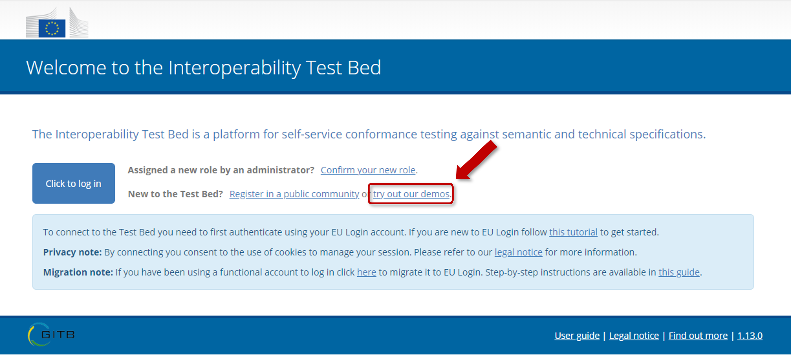

Doing so will connect you to the Test Bed using a special demo account with predefined test scenarios you can execute. From the
:ref:`landing page<navigate__landing_page>` for this account you can then click the **My conformance statements** link from the menu to view the
available :ref:`demo conformance statements<manage_your_conformance_statements__view_your_conformance_statements>` and proceed
to execute their test cases.

.. _login__roles:

Manage your roles
-----------------

.. note::

  This feature is applicable only if the Test Bed is integrated with EU Login. In this case you are
  considered as having a single account (your EU Login account) and one or more roles in defined organisations (potentially in
  different communities). If the Test Bed is not integrated with EU Login such roles are determined by separate username and password based accounts.

In this screen you can view and manage the roles assigned to you. You can reach this screen by multiple means, including shortcuts on
the Test Bed's :ref:`welcome page<login__welcome>` and controls from your :ref:`profile management page<manage_your_profile>`.

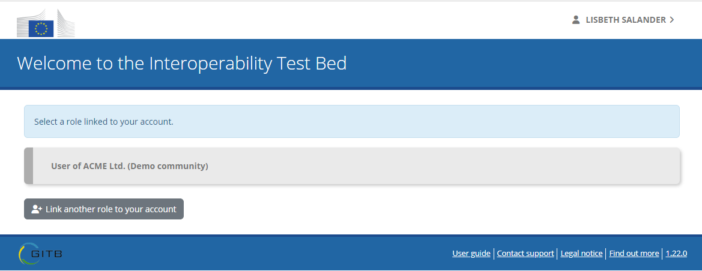

This screen presents to you the list of roles currently linked to your account. For each role you see:

* Your role level (e.g. "User", "Administrator"). This is also represented by a different colour accent (e.g. grey for a "User").
* The name of your organisation.
* The name of your organisation's community.

Clicking on one of the listed roles will select it and transfer you to the relevant :ref:`organisation's landing page<navigate__landing_page>`.
Alternatively from here you can click the **Link another role to your account** button to select additional roles. Doing so
displays a popup with your available options:

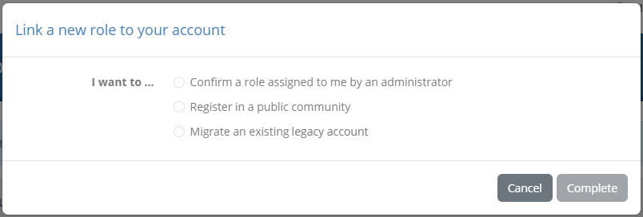

Depending on the option you select you can:

* Confirm a role assigned to you by an administrator (see :ref:`login__roles__confirm`).
* Register a new organisation in a public community (see :ref:`login__roles__register`).
* Migrate a legacy account to EU Login (see :ref:`login__roles__migrate`).

.. _login__roles__confirm:

Confirm an assigned role
~~~~~~~~~~~~~~~~~~~~~~~~

Roles are assigned to you by administrators and represent your permission to access specific organisations. An administrator does
this by linking your email address, the one also linked to your EU Login account, to the role in question. Before you start using
such a role you need to first confirm its assignment to you, an action that will also record in the Test Bed your EU Login
account's information.

To confirm an assigned role select the relevant option from the popup dialog.

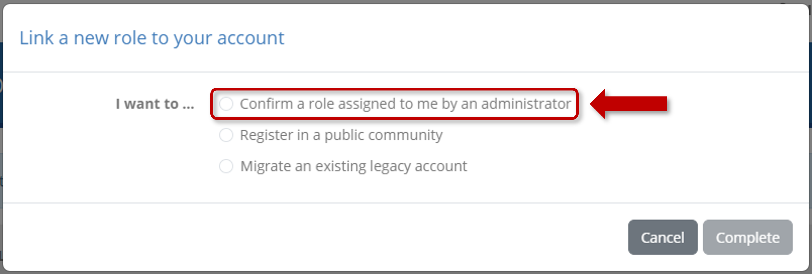

Doing so will present you with the list of roles that are currently assigned to you and are pending your confirmation.

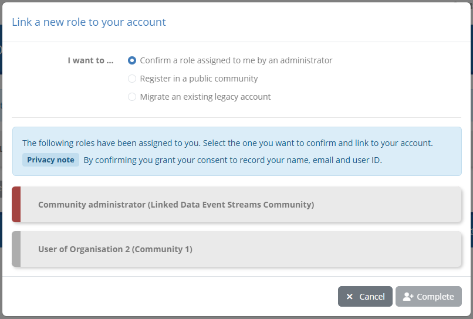

Similar to the display of your current roles, you see per case the role, the relevant organisation's name and the
organisation's community. To confirm an assignment, click on it to highlight it and then on **Complete**. Doing so will close the dialog and
display the relevant role in your available connection options. Note that you can also click on **Cancel** to abort the process and
close the dialog.

.. _login__roles__register:

Register a new organisation
~~~~~~~~~~~~~~~~~~~~~~~~~~~

You can register yourself a new organisation in one of the Test Bed's available communities. To do so select the relevant option
from the popup dialog.

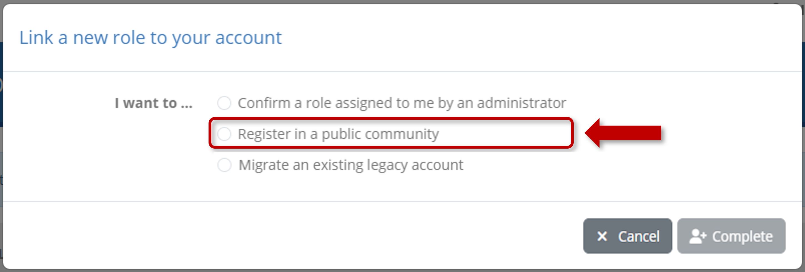

As a first step you are presented with the publicly available communities, displaying their name and description.

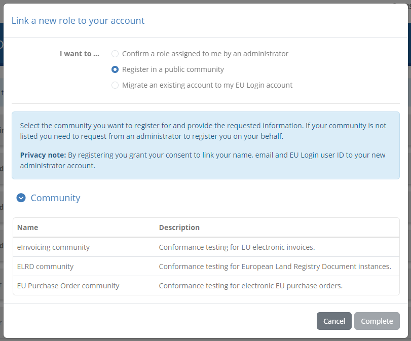

Select one of the available communities by clicking on its relevant row. Doing so will present you the registration form linked to this community.

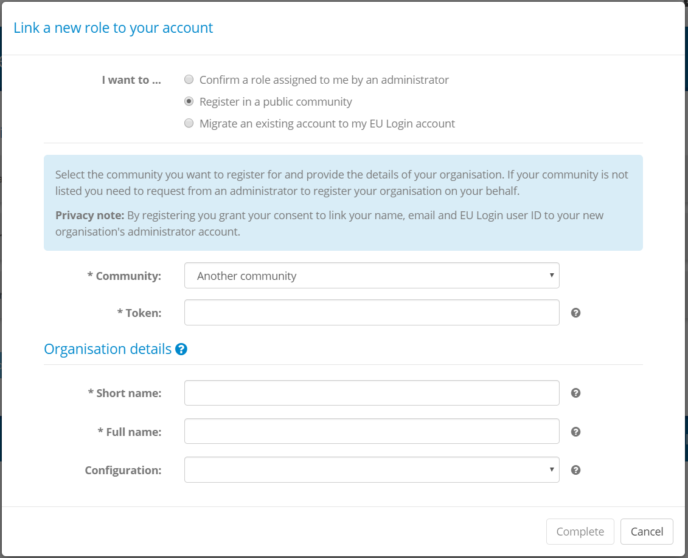

To complete the registration form provide the following information:

* **Registration token:** A token value you are expected to provide to register for the community. The value for this token
  will be provided to you by the community's administrator. If a token is not required this input will not be displayed.
* **Short name:** The name of your organisation in short form.
* **Full name:** The name of your organisation in full form.
* **Configuration:** A list of configuration templates for your organisation, defined by the community's administrator,
  that will predefine your organisation's systems and conformance statements. This will not be displayed if no such
  templates are available.

The **Organisation details** section may also include one or more additional properties that the community's administrator requires
for completion during registration. These properties may be simple text values, secret values or files for you to upload, and may be
optional or required. Note that properties highlighted as required will not prevent you from completing the registration if you don't
supply them. These will need to be provided however before you can execute any tests.

Once the information is provided click on **Complete** to finish the registration. Doing so will close the dialog and
display the relevant role in your available connection options. Note that you can also click on **Cancel** to abort the process and
close the dialog.

.. _login__roles__migrate:

Migrate a legacy account
~~~~~~~~~~~~~~~~~~~~~~~~

If the Test Bed has migrated from legacy username and password accounts to EU Login it will allow you to migrate such an account
as a new role linked to your EU Login profile.

To migrate a legacy account start by selecting the relevant option from the popup dialog. Note that this selection is already done
for you in case you clicked the migration link from the Test Bed's :ref:`welcome page<login__welcome>`.

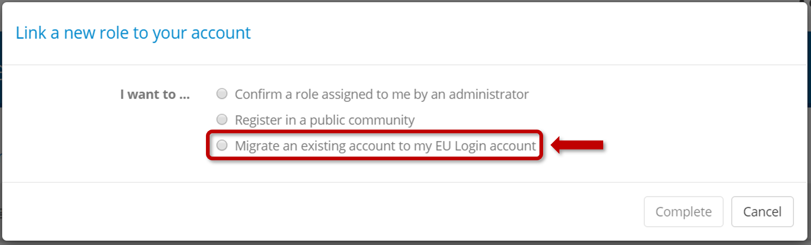

Doing so will present you with a form to provide your legacy account's credentials.

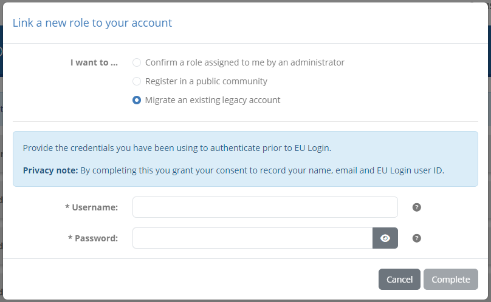

Complete this form by providing:

* **Username:** The username you have been using to log in.
* **Password:** The password for your legacy account.

Once you have provided this information click on **Complete** to validate your legacy credentials. If the validation succeeds
this account will be converted into a role and be linked to your EU Login profile. Once complete, the dialog will close and you
will see your migrated role displayed as an available connection option. Note that you can also click on **Cancel** to abort
the process and close the dialog.

.. note::

  The Test Bed offers also a step-by-step migration guide to inform and guide you through the
  process of migrating your legacy account.

  This is available at https://www.itb.ec.europa.eu/docs/guides/latest/migratingToEULogin.

.. _DIGIT Test Bed instance: https://www.itb.ec.europa.eu/itb
.. _EU Login user guide: https://www.itb.ec.europa.eu/docs/guides/latest/usingEULogin/
.. _step-by-step guide: https://www.itb.ec.europa.eu/docs/guides/latest/migratingToEULogin/