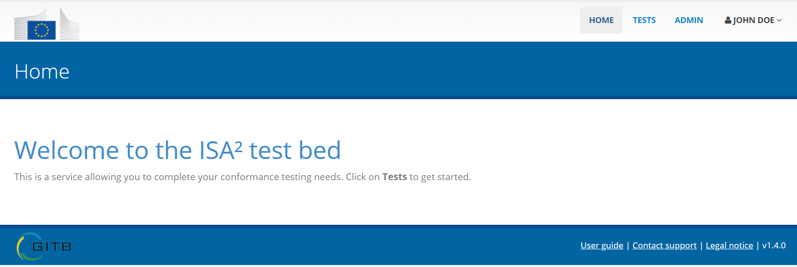

.. _login:

Log in
======

Before carrying out any action on the test bed you need to log in. The login screen requires you to provide:

* Your account's **email address**.
* Your account's **password**.

.. figure:: ../screenshots/login.PNG
  :align: center

Your account credentials are those configured during installation or provided to you by another test bed administrator. Note that the email address  
defined for the account is not necessarily an active address. It is rather a "functional" email address that
is linked to the test bed. You are not expected to receive emails on this address.

On the login screen you also have the possibility to have the test bed keep your session open. To do this 
simply check the **Remember Me** checkbox below the login form. Once you have entered your credentials click
the **Login** button.

.. _login__interface_layout:

Interface layout
----------------

Once logged in, you are presented with the test bed's user interface. The first screen you see is called the 
**landing page**.

The bar at the top of the interface is called the **header**. This is always visible on every screen
and provides quick access to the following options:

.. figure:: ../screenshots/header_admin.PNG
  :align: center

* **HOME:** Return back to the landing page.
* **TESTS:** Access the test management page for the test bed's "Admin Organization". 
* **ADMIN:** Access the test bed's administrator features.
* **Profile controls:** Displays your name and can be hovered over for additional options such as
  editing your profile and logging out.

Beneath the header you find the screen's main **banner**. This displays a title relevant to the
screen you are on to give you context on where you are.

.. figure:: ../screenshots/banner.PNG
  :align: center

At the bottom of the screen is where you find the screen's **footer**. This displays the following information:

.. figure:: ../screenshots/footer.PNG
  :align: center

* A link to the current **user guide**.
* A link to **contact the support team** for problems, questions and feedback (see :ref:`contact_support`).
* A link to view the **legal notice** linked the test bed's use. 
* The test bed's **version** number.
