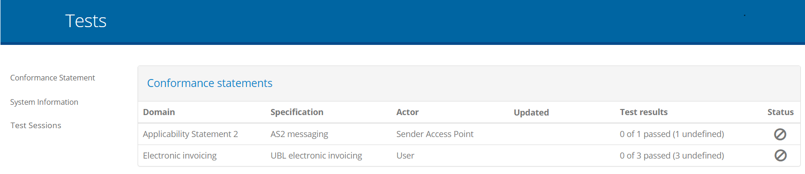
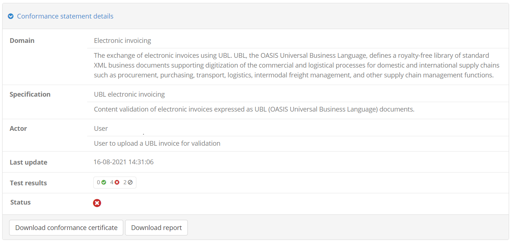
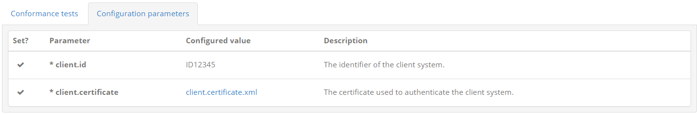
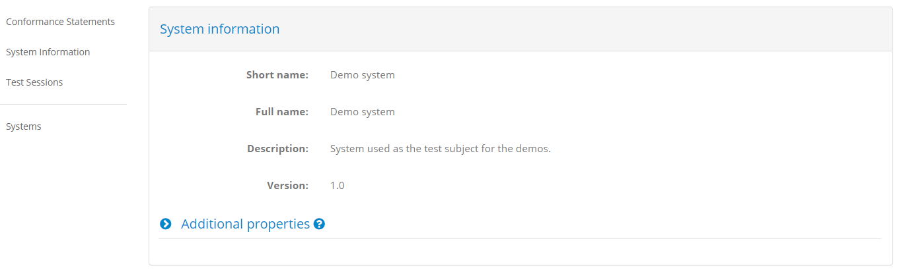
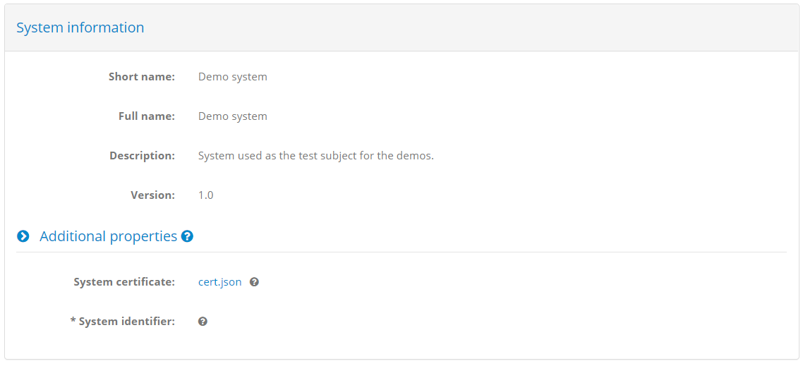

.. _manage_your_conformance_statements:

Manage your conformance statements
==================================

Conformance statements serve to define your organisation's testing goals by linking one of your registered
systems with a specification's actor (see :ref:`introduction__glossary__conformance_statement`). It is a system's conformance statements that determine the test
suites and test cases that will be presented to you to execute.

Your organisation's conformance statements may either be configured by an administrator of your organisation
or by the overall community administrator. From your perspective, conformance statements can be viewed but
not modified, serving to organise and focus your testing activities for each specification.

.. _manage_your_conformance_statements__view_your_conformance_statements:

View your conformance statements
--------------------------------

Conformance statements are made at the level of a system and as such, the first step is to select one of the systems 
configured for your organisation (see :ref:`manage_your_systems`). Note that this step is optional in case your organisation defines only
a single system in which case clicking on the **TESTS** button on the header directly takes you to its list of 
conformance statements.

This table presents for the selected system its list of conformance statements in terms
of their **domain** (in case different domains are available), **specification** and **actor**. Simply put this set of information serves to uniquely 
identify the specification role that your system aims to play, thus determining the test cases that it should
execute. The **last update** timestamp shows the last time the status of the conformance statement was updated, whereas the presented **test results** provide an overview 
of the latest results, showing how many configured tests your system has succeeded, failed, or has not yet completed. This can also be hovered over to view a text summary
of the displayed counts. Finally, the overall conformance **status** is also displayed per statement indicating its current result as incomplete, failed or successful.

From this table you can click any row to proceed to the conformance statement's details (see :ref:`manage_your_conformance_statements__view_a_conformance_statements_details`).
You can return to the listing of conformance statements at any time by clicking the **Conformance Statement** entry in the left side menu.

.. note::
    **Systems with a single conformance statement:** If your selected system defines a single conformance statement
    the current screen is skipped. You are instead presented directly with the conformance statement's details (see :ref:`manage_your_conformance_statements__view_a_conformance_statements_details`).
    Note that in case your organisation has a single system and a single conformance statement clicking the **TESTS**
    button from the screen header will directly bring you to the conformance statement's details.

.. _manage_your_conformance_statements__view_a_conformance_statements_details:

View a conformance statement's details
--------------------------------------

The conformance statement detail screen provides you the test status summary for a given system of your organisation 
and a specification's actor. In addition it is the point from which you can start new tests. The information displayed 
in this page is organised in three sections to present to you:

* The details of the conformance statement.
* The configuration for your system, used when it is defined as a test case's SUT.
* The status and controls of the related tests.

.. _manage_your_conformance_statements__view_a_conformance_statements_details__overview:

Overview
~~~~~~~~

The **Conformance statement details** section provides you the context of what your system is supposed to conform to.

The **domain** details are presented on the top as the high-level description of the project you are testing for. The 
**specification** information follows to define the specification you have chosen for your system to conform to
(a domain may have multiple specifications). The **actor** information defines the specific role your system is expected to fulfil
as part of this specification (a specification may have multiple actors). The **last update** timestamp highlights the last time the 
conformance statement's status was updated. The **test results** present an overview of the testing progress for the conformance statement's test cases, 
whereas the **status** represents the statement's current progress. Below this section you are presented with buttons for further actions as follows:

* The **Download conformance certificate** button to generate a conformance certificate for your system (see :ref:`manage_your_conformance_statements__view_a_conformance_statements_details__export_certificate`).
* The **Download report** button to export your system's current conformance statement report (see :ref:`manage_your_conformance_statements__view_a_conformance_statements_details__export`).

The overall detail panel can also be **collapsed** and **expanded** by clicking its header. Collapsing its display could be useful if you would want to focus on the tests to
execute rather than the statement's details.

Beneath the statement details' panel you are presented with two tabs that allow you to interact and manage the conformance statement:

* The **Conformance tests** tab to view and launch the statement's tests (see :ref:`manage_your_conformance_statements__view_a_conformance_statements_details__tests`).
* The **Configuration parameters** tab to view and edit the statement's configuration parameters if needed (see :ref:`manage_your_conformance_statements__view_a_conformance_statements_details__endpoints`).

.. _manage_your_conformance_statements__view_a_conformance_statements_details__tests:

Conformance tests
~~~~~~~~~~~~~~~~~

The **Conformance tests** tab lists the tests linked to the conformance statement. These are the tests that you need to successfully complete to be considered 
as conformant. The display includes two parts:

* A set of **controls** to filter the displayed test cases and configure test execution.
* The list of **test cases** included in the conformance statement.

.. figure:: ../screenshots/conformance_statement_details_tests.png
  :align: center

The statement's test cases are grouped by their test suite, of which the **name** is presented in bold, alongside its **description**. This test suite header can be clicked
to expand or collapse the displayed test cases, which could be interesting if there are multiple test suites. Note that if only a single test suite is defined it 
appears as expanded by default.

Each test suite includes a table listing its test cases. The information displayed for each test case includes:

* Its **name**, a short text to identify and refer to the test case.
* Its **description**, providing the context you need to understand the purpose of the test case and plan for its execution.
* The date and time of the test case's **last run** (i.e. when a test session was last executed).
* The **status** of the latest test session executed for the test cases (displayed on the right).

This information is complemented by the test case controls which depending on the status of the test case include:

* A shortcut to **view** the latest test session executed for this test case in the :ref:`test session history<view_your_test_history__test_steps>` (if such a session exists).
* An **information** button to view the test case's extended documentation (if defined).
* A **play** button to start a new test session for this test case (see :ref:`execute_tests`).

At the level of the test suite you can also view the aggregated **status** of the test suite's test cases, as well as additional controls:

* An **information** button to view the test suite's extended documentation (if defined).
* A **play** button to launch test sessions for all listed test cases.

When test sessions are completed for the statement's different test cases, the displayed status will be adapted to present them as successful or failed.
Moreover, in case a test session also produced a detailed output message, this can be viewed by clicking on the success or failure icon.

.. figure:: ../screenshots/conformance_statement_details_tests_output_message.PNG
  :align: center

Above the display of test suites the **Conformance tests** tab also includes controls relevant to the displayed test cases.

.. figure:: ../screenshots/conformance_statement_details_tests_controls.png
  :align: center

On the left side you are presented with controls to **search test cases**. You may use the provided **search box** to look for a specific test case, with the text
you provide being used to match, in a case-insensitive way, test cases based on their name or description. Next to this you are provided with a **dropdown menu** that
defines which tests are displayed based on their **status**. You may choose to show all tests (the default), or show only successful tests, failed tests or incomplete tests.
Any change to this will update the display to list the matched test cases. It is important to note that when selecting to run test cases at the level of the displayed 
test suite, the test cases to be executed will be those currently displayed.

To the right side you may find a further **dropdown menu** that determines how test cases will be **executed**. The options presented here are the following:

* **Interactive execution**, to launch tests in an interactive manner, presenting their test execution diagram and interacting with you for inputs.
* **Parallel background execution**, to launch tests in the background executing them in parallel. Note that test cases that don't support parallel execution
  will be ran sequentially.
* **Sequential background execution**, to launch tests in the background executing them one by one in sequence.

Opting for background execution allows you to launch a potentially large number of test sessions without needing to oversee their progress. Care however needs
to be taken here to ensure that all relevant test cases can be carried out without user interaction. If a test session running in the background defines user
interaction steps, these are managed as follows:

* **Instructions** are simply skipped, assuming that these are purely of informational value.
* **Input requests** are completed automatically without input. Doing so will most likely cause a test session to fail (e.g. if a user is expected to provide
  the content of a message to send) but could still result in a successful completion if the test case has been designed to treat user input as optional.

The status of test sessions launched in the background can be monitored by means of the :ref:`Test Sessions<view_your_test_history>` screen.

Finally, recall that the listed test suites and test cases may include an **information** button in case they define extended documentation. This documentation
complements the displayed description with further information such as diagrams and reference links.

.. figure:: ../screenshots/conformance_statement_details_tests.png
  :align: center

Clicking this button results in a popup window containing the extended documentation.

.. figure:: ../screenshots/conformance_statement_details_tests_documentation_popup.PNG
  :align: center

Note that the documentation on test cases is also available to consult during their :ref:`execution<execute_tests_interactive_execution>` (in case of interactive execution).

.. _manage_your_conformance_statements__view_a_conformance_statements_details__endpoints:

Configuration parameters
~~~~~~~~~~~~~~~~~~~~~~~~

Alongside the **Conformance tests** tab you are presented with the **Configuration parameters** tab. This includes any necessary configuration at the level of the
specific conformance statement that you are expected to provide.

Configuration properties are displayed in rows where for each one the following information is presented:

* Whether or not it is **set**.
* Its **parameter name**, serving as its identifier. This is prefixed with an asterisk if the parameter is mandatory.
* Its **configured value**, which in case it is a file will be presented as a download link.
* Its **description** to help understand the parameter's purpose.

.. note::
    **Editing configuration parameters:** Editing your conformance statement's configuration parameters is reserved to administrators.

.. _manage_your_conformance_statements__view_a_conformance_statements_details__export:

Export conformance statement report
~~~~~~~~~~~~~~~~~~~~~~~~~~~~~~~~~~~

The conformance statement report (in PDF format) provides the details on the conformance statement and also an overview of its relevant tests. To generate it
click the **Download report** button from the overview section's panel.

Once the button is clicked you will be prompted for the level of detail you want to include in the report. Two options are available regarding 
whether or not you want to include each test case's step results in the report.

.. figure:: ../screenshots/conformance_statement_report_detail_prompt.PNG
  :align: center
  :scale: 50%

Selecting **Yes** includes the conformance statement details and test overview but also each test case's step results. Selecting **No** on the 
other hand skips the test step results.

The following sample illustrates the information that is included in the report's overview section that is always included. Specifically:

 * The information on the **domain**, **specification** and **actor** for the selected system.
 * The name of the system's **organisation** and the **system** itself.
 * The **date** the report was produced and the number of **successfully passed test cases** versus the total.
 * A table with the conformance statement's test cases, displaying a row per test case with its **reference number**, the name of the 
   the **test suite** and **test case**, the test case **description** and its test **result**.

.. figure:: ../screenshots/conformance_statement_report_sample.png
  :align: center

In case the option to add each test case's step results is selected, the report includes a section per test case displaying its summary
and the results from each test step. The test case's title includes its reference number listed in the report's overview section.

.. figure:: ../screenshots/conformance_statement_report_sample_test_case.png
  :align: center

.. note::
    **Detailed report size:**  The detailed conformance statement report presents each test session and individual step in 
    a separate page. If your conformance statement contains numerous test cases, each with multiple test steps, the resulting detailed report 
    could be quite long.

.. _manage_your_conformance_statements__view_a_conformance_statements_details__export_certificate:

Export conformance certificate
~~~~~~~~~~~~~~~~~~~~~~~~~~~~~~

The conformance certificate is a report (in PDF format) that attests to the fact that your current system has successfully passed its expected test cases. The option
to generate this is only visible if your system has succeeded in all configured tests. If this is the case and the option is still not visible, this means that your 
community administrator has disabled this feature. In such a case you will need to contact your administrator to obtain it.

Assuming the option is available for you, clicking the button will generate the certificate and prompt you for its download. The certificate will typically resemble the
following sample:

.. figure:: ../screenshots/conformance_statement_certificate_sample.png
  :align: center

The contents of the certificate are defined by your administrator and are a customisation of the :ref:`conformance statement report<manage_your_conformance_statements__view_a_conformance_statements_details__export>`.
The certificate may omit certain sections, include a message for you, and potentially be digitally signed.

.. _manage_your_conformance_statements__view_system_information:

View selected system's information
----------------------------------

Once a system is selected from the list of your organisation's systems (see :ref:`manage_your_systems`) you can manage its conformance statements and view its test history. 
At any given time you can review the information of your selected system by clicking the **System Information** entry from the left side menu.

In this screen you can see the **short** and **full name** of the system, its **description** and its **version** number. If your 
community administrator has foreseen additional properties for systems you will also see here the **Additional properties** section.
Clicking this will expand to also display the current system's additional information.

The displayed properties can be simple texts, secret values (e.g. passwords) or files and, if supplied by your community 
administrator, will display a help tooltip to understand their meaning. Only administrators may update these properties
but you can view their configured values or download their linked files. Required properties are marked with an asterisk
and will need to be completed by an administrator before launching any tests for this system.

.. note::
    **Editing a system's information:** The information displayed on this screen is read-only. Editing the system's information is reserved 
    to your administrator.
