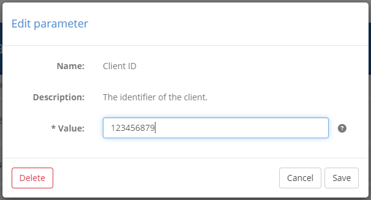
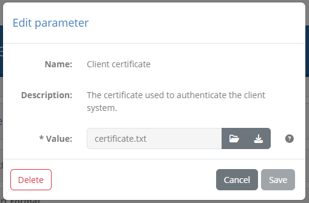
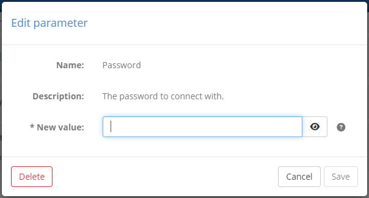
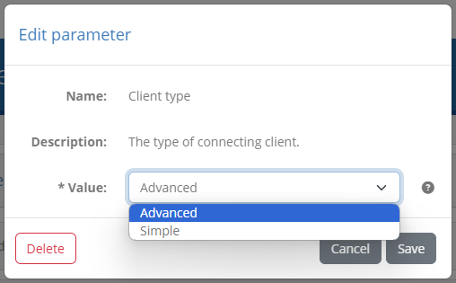

.. _manage_your_conformance_statements:

Manage your conformance statements
==================================

:ref:`Conformance statements <introduction__glossary__conformance_statement>` serve to define an organisation's testing goals by linking one of its registered
systems with a specification's actor. It is a system's conformance statements that determine the test
suites and test cases that will be presented for execution.

Depending on your preferences you may allow organisation administrators to configure their own conformance statements or you
may configure them on their behalf.

.. _manage_your_conformance_statements__view_your_conformance_statements:

View your conformance statements
--------------------------------

To view your organisation's conformance statements click the **My conformance statements** link from the menu. Doing so
presents you with a screen listing each statement and its status.

.. figure:: ../screenshots/conformance_statements_admin.PNG
  :align: center

Conformance statements are made at the level of a system and as such, the first step is to select a system from the presented dropdown.
If the organisation only has a single system this appears preselected and its conformance statements are automatically loaded.

Assuming there are conformance statements defined these will be presented in expandable panels, split and grouped based on their
relevant specifications, specification groups and options (if applicable). If you do indeed see such groupings, related statements
can be expanded and collapsed by clicking on their relevant titles.

For each statement you can see besides the **name** of the specification, an overview of the system's current testing status. This overview
consists of:

* The **last update time**, corresponding to the last time the status of the conformance statement was updated.
* The **result counts**, showing the number of tests in the conformance statement that are completed, failed or incomplete.
* The **result ratios**, illustrating the same results but as a percentage of the total tests in the statement.
* The **overall status** of the statement which can be successful, failed, or incomplete, based on the latest test results.

In case numerous statements are defined, you can use the provided **search controls** to filter them based on:

* The specifications' **name**.
* The **overall status**.

.. figure:: ../screenshots/conformance_statements_filters.png
  :align: center

It could be that certain test cases configured for the specification are **optional** in nature. Such tests can be consulted
but are not counted towards the conformance testing status. If such optional tests exist, the displayed counts and ratios
will present a **plus** button to expand their display allowing you to consult both mandatory and optional tests.

.. figure:: ../screenshots/conformance_statements_optional_counts.png
  :align: center

.. figure:: ../screenshots/conformance_statements_optional_ratios.png
  :align: center

Clicking any conformance statement row will take you to the :ref:`conformance statement's details <manage_your_conformance_statements__view_a_conformance_statements_details>`
from where you can see further information on the statements' test cases and execute new test sessions.

.. _manage_your_conformance_statements__create:

Create a conformance statement
------------------------------

To create a new conformance statement for the selected system click the **Create statements** button from the panels controls.

.. figure:: ../screenshots/conformance_statement_create_button.png
  :align: center

Doing so presents to you the available conformance statements that are available for the system.

.. figure:: ../screenshots/conformance_statement_create.png
  :align: center

The available domains (if multiple), specifications, their groups (if applicable), and actors are organised as available conformance statements
in expandable options. You may click each statement to collapse or expand it, revealing the available statements that you may select.

.. figure:: ../screenshots/conformance_statement_create_options.png
  :align: center

Above the available conformance statements you are also presented with controls to facilitate your selection.

.. figure:: ../screenshots/conformance_statement_create_controls.png
  :scale: 80%
  :align: center

Using these controls you may:

* **Search** for an available statement (the search text is looked up in names and descriptions in a case-insensitive manner). Note that if
  statements are already selected these will always remain visible regardless of the search results.
* **Select**, or unselect the statements currently displayed.
* **View** all details by collapsing or expanding all statements.

Once you have selected one or more statements you may click on **Confirm** to proceed with their creation. Clicking on **Cancel** will return you back
to the listing of the existing conformance statements.

.. _manage_your_conformance_statements__view_a_conformance_statements_details:

View a conformance statement's details
--------------------------------------

The conformance statement detail screen provides you the test status summary for a given system of your organisation 
and a specification's actor. In addition it is the point from which you can start new tests. The information displayed 
in this page is organised in three sections to present to you:

* The **details** of the conformance statement.
* The **configuration** for your system, used when it is defined as a test case's SUT.
* The status and controls of the related **tests**.

.. _manage_your_conformance_statements__view_a_conformance_statements_details__overview:

Overview
~~~~~~~~

The **Conformance statement details** section provides you the context of what your system is supposed to conform to.

.. figure:: ../screenshots/conformance_statement_details_overview_admin.PNG
  :align: center

At the top of the detail panel you see the name of the **organisation** and **system** for which this conformance statement has
been made. Following this you see the name and description of the **specification** you are claiming conformance for, including
any options (e.g. specification versions, profiles or roles) that apply. Finally, at the bottom of the panel you see the current
status of the statement, specifically:

* The **overall status** based on the latest test results (success, failure or incomplete).
* The **last update time**, corresponding to the last time the status of the conformance statement was updated.
* The **result counts**, showing the number of tests in the conformance statement that are completed, failed or incomplete.
* The **result ratios**, illustrating the same results but as a percentage of the total tests in the statement.

Similar to the :ref:`conformance statements' listing <manage_your_conformance_statements__view_your_conformance_statements>`,
in case your statement includes optional test cases, the counts and ratios will display a **plus** button that can be
clicked to expand and display both mandatory and optional tests. Note that optional and disabled tests do not count towards
your conformance status.

At the bottom of the details' panel you are presented with buttons for further actions as follows:

* The **Download report** button to export your system's current :ref:`conformance statement report <manage_your_conformance_statements__view_a_conformance_statements_details__export>`.
* The **Download conformance certificate** button to generate a :ref:`conformance certificate <manage_your_conformance_statements__view_a_conformance_statements_details__export_certificate>` for your system.
* The **Copy badge URL** and **Preview badge** buttons to copy (or preview) a conformance badge for your current status. This is available only
  if you have :ref:`configured such badges <domains__specification>`.
* The **View system** button allows you to navigate to your :ref:`system <manage_organisation__systems>` or :ref:`organisation <manage_organisation>` details.
* The **Back** button to return to the :ref:`conformance statement list <manage_your_conformance_statements__view_your_conformance_statements>`.
* The **Delete statement** button to :ref:`delete the conformance statement <manage_your_conformance_statements__view_a_conformance_statements_details__delete>`.

In addition, the overall detail panel can also be **collapsed** and **expanded** by clicking its header. Collapsing its display could be useful if you would want to focus on the tests to
execute rather than the statement's details.

Beneath the statement details' panel you are presented with two tabs that allow you to interact and manage the conformance statement:

* The :ref:`Conformance tests <manage_your_conformance_statements__view_a_conformance_statements_details__tests>` tab to view and launch the statement's tests.
* The :ref:`Configuration parameters <manage_your_conformance_statements__view_a_conformance_statements_details__endpoints>` tab to view and edit the statement's configuration parameters if needed.

.. _manage_your_conformance_statements__view_a_conformance_statements_details__badge:

Using conformance badges
~~~~~~~~~~~~~~~~~~~~~~~~

Conformance badges are an optional feature for specifications that may be :ref:`set up for your community<domains__specification>`. Badges are
images that indicate a specific live status for a given organisation's system, with respect to a specific conformance statement. They are
meant to be accessible publicly so that they can be embedded in displays such as online dashboards or GitHub README files.

In case conformance badges are configured for the statement's specification, the detail panel's controls will also include a **Copy badge URL**
button.

.. figure:: ../screenshots/conformance_statement_details_controls.png
  :align: center

Clicking this will copy to your clipboard a URL that you can then refer to from outside the test bed to display a badge. A typical use case for this
would be to add it as the source of an image in a HTML page listing conformant solutions. The same button also includes a secondary option named
**Preview badge** that you can click for a preview.

.. figure:: ../screenshots/conformance_statement_details_badge_preview.png
  :align: center

Note that the displayed badge is dynamically updated to always reflect the latest conformance testing status. For example if new test cases are
added to the statement, accessing the same badge (displayed as a "success" badge above) will switch to an "incomplete" badge.

.. figure:: ../screenshots/conformance_statement_details_badge_preview_incomplete.png
  :align: center

.. note::

    By default conformance badges illustrate a "success" and "not success" state. It could be the case however that specific "failure" badges
    are also configured depending on your community's setup.

.. _manage_your_conformance_statements__view_a_conformance_statements_details__tests:

Conformance tests
~~~~~~~~~~~~~~~~~

The **Conformance tests** tab lists the tests linked to the conformance statement. These are the tests that you need to successfully complete to be considered
as conformant. The display includes two parts:

* A set of **controls** to filter the displayed test cases and configure test execution.
* The list of **test cases** included in the conformance statement.

.. figure:: ../screenshots/conformance_statement_details_tests.png
  :align: center

The statement's test cases are grouped by their test suite, of which the **name** is presented in bold, alongside its **description**. This test suite header can be clicked
to expand or collapse the displayed test cases, which could be interesting if there are multiple test suites. Note that if only a single test suite is defined it
appears as expanded by default.

Each test suite includes within it the listing of its test cases. The information displayed for each test case includes:

* An icon indicating of whether it is **required**, **optional**, or **disabled**. Note that if only required tests are defined this icon is hidden.
* Its **name**, a short text to identify and refer to the test case.
* Zero or more **tags** that highlight specific traits relevant to the test case. These can also be hovered over to view further information.
* The date and time of the test case's **last execution**.
* The **status** of the latest test session executed for the test case (displayed on the right).
* The test case extended **description**, which is initially hidden but can be displayed if clicking on the test case row.

This information is complemented by the test case controls which depending on the status of the test case include:

* A shortcut to **view** the latest test session executed for this test case in the :ref:`test session history<view_your_test_history__test_steps>` (if such a session exists).
* An **information** button to view the test case's extended documentation (if defined).
* A **play** button to start a new test session for this test case (see :ref:`execute_tests`).

At the level of the test suite you can also view the aggregated **status** of the test suite's test cases, as well as additional controls:

* An **information** button to view the test suite's extended documentation (if defined).
* A **play** button to launch test sessions for all listed test cases.

When test sessions are completed for the statement's different test cases, the displayed status will be adapted to present them as successful or failed.
Moreover, in case a test session also produced a detailed output message, this can be viewed by clicking on the success or failure icon.

.. figure:: ../screenshots/conformance_statement_details_tests_output_message.PNG
  :align: center

Above the display of test suites the **Conformance tests** tab also includes controls relevant to the displayed test cases.

.. figure:: ../screenshots/conformance_statement_details_tests_controls.png
  :align: center

On the left side you are presented with controls to **search test cases**. You may use the provided **search box** to look for a specific test case, with the text
you provide being used to match, in a case-insensitive way, test cases based on their name or description. Next to this you are provided with a **dropdown menu** that
defines which tests are displayed based on their **status**. You may choose to show all tests (the default), or select successful tests, failed tests or incomplete tests.
If there are also optional and disabled test cases you may also select (or deselect) their display from here as well.
Any change to filtering options will update the display to list the matched test cases. It is important to note that when selecting to run test cases at the level of the displayed
test suite, the test cases to be executed will be those currently displayed.

.. note::

  Disabled test cases can be reviewed in case they have previous test results, but they are hidden by default and cannot be executed.

To the right side you may find a further **dropdown menu** that determines how test cases will be **executed**. The options presented here are the following:

* **Interactive execution**, to launch tests in an interactive manner, presenting their test execution diagram and interacting with you for inputs.
* **Parallel background execution**, to launch tests in the background executing them in parallel. Note that test cases that don't support parallel execution
  will be ran sequentially.
* **Sequential background execution**, to launch tests in the background executing them one by one in sequence.

Opting for background execution allows you to launch a potentially large number of test sessions without needing to oversee their progress. Care however needs
to be taken here to ensure that all relevant test cases can be carried out without user interaction. If a test session running in the background defines user
interaction steps, these are managed as follows:

* **Instructions** are simply skipped, assuming that these are purely of informational value.
* **Input requests** are completed automatically without input. Doing so will most likely cause a test session to fail (e.g. if a user is expected to provide
  the content of a message to send) but could still result in a successful completion if the test case has been designed to treat user input as optional.

The status of test sessions launched in the background can be monitored by means of the :ref:`Test Sessions<view_your_test_history>` screen.

Finally, recall that the listed test suites and test cases may include an **information** button in case they define extended documentation. This documentation
complements the displayed description with further information such as diagrams and reference links.

.. figure:: ../screenshots/conformance_statement_details_tests.png
  :align: center

Clicking this button results in a popup window containing the extended documentation.

.. figure:: ../screenshots/conformance_statement_details_tests_documentation_popup.PNG
  :align: center

Note that the documentation on test cases is also available to consult during their :ref:`execution<execute_tests_interactive_execution>` (in case of interactive execution).

.. _manage_your_conformance_statements__view_a_conformance_statements_details__endpoints:

Configuration parameters
~~~~~~~~~~~~~~~~~~~~~~~~

Alongside the **Conformance tests** tab you are presented with the **Configuration parameters** tab. This includes any necessary configuration at the level of the
specific conformance statement that you are expected to provide.

.. figure:: ../screenshots/conformance_statement_details_endpoints_admin.PNG
  :align: center

Configuration properties are displayed in rows where for each one the following information is presented:

* Whether or not it is **set**.
* Its **parameter name**, serving as its identifier. This is prefixed with an asterisk if the parameter is mandatory.
* Its **configured value**, which in case it is a file will be presented as a download link.
* Its **description** to help understand the parameter's purpose.
* An **edit** icon to change or remove its value.

To edit a configuration parameter click its **edit** icon on its relevant row. Doing so will open a prompt that presents the parameter's
**name**, **description** and current **value** that is editable.

In case of a parameter that is a file, the popup will be adapted to allow you to download the file and upload a replacement.

A third scenario is that of a parameter being a secret value (e.g. a password). In this case you are prompted to provide the
value in the secret value input.

Finally, an additional scenario is when preset values are defined for the parameter. In this case you are presented with a dropdown selection
list that includes the available options.

To change the parameter's value click on **Save**. Clicking on **Delete** will clear the current value, whereas **Cancel** will close the popup without
making changes.

.. _manage_your_conformance_statements__view_a_conformance_statements_details__export:

Export conformance statement report
~~~~~~~~~~~~~~~~~~~~~~~~~~~~~~~~~~~

The conformance statement report (in PDF format) provides the details on the conformance statement and also an overview of its relevant tests. To generate it
click the **Download report** button from the overview section's panel.

.. figure:: ../screenshots/conformance_statement_details_overview_admin.PNG
  :align: center

Once the button is clicked you will be prompted for the level of detail you want to include in the report. Two options are available regarding
whether or not you want to include each test case's step results in the report.

.. figure:: ../screenshots/conformance_statement_report_detail_prompt.PNG
  :align: center
  :scale: 70%

Selecting **Yes** includes the conformance statement details and test overview but also each test case's step results. Selecting **No** on the 
other hand skips the test step results.

The following sample illustrates the information that is included in the report's overview section that is always included. Specifically:

 * The information on the **domain**, **specification** and **actor** for the selected system.
 * The name of the system's **organisation** and the **system** itself.
 * The **date** the report was produced.
 * The overall **conformance status**, the number of **successfully passed test cases** versus the total as well as **result percentage ratios**.
 * A listing of the statement's **test suites**, each including its **test cases** and their **result**. Test cases are presented as a **link** to
   take you directly to the relevant result (if test steps were selected to be included).

.. figure:: ../screenshots/conformance_statement_report_sample.png
  :align: center

If the listed test cases include optional or disabled test cases, or if any of them define tags, the listing of test cases is followed by a
**legend** explaining the meaning of the different status icons and tags.

.. figure:: ../screenshots/conformance_statement_report_legend.png
  :align: center

In case the option to add each test case's step results is selected, the report includes a page per test case displaying its summary
and the result of each test step. The test case's title includes its reference number listed in the report's overview section, and
provides also a link to return to the listing of test cases.

.. figure:: ../screenshots/conformance_statement_report_sample_test_case.png
  :align: center

.. note::
    **Detailed report size:**  The detailed conformance statement report presents each test session and individual step in 
    a separate page. If your conformance statement contains numerous test cases, each with multiple test steps, the resulting detailed report 
    could be quite long.

.. _manage_your_conformance_statements__view_a_conformance_statements_details__export_certificate:

Export conformance certificate
~~~~~~~~~~~~~~~~~~~~~~~~~~~~~~

The conformance certificate is a report (in PDF format) that attests to the fact that your current system has successfully passed its expected test cases. The option
to generate this is only visible if your system has succeeded in all configured tests.

Assuming the option is available for you, clicking the button will generate the certificate and prompt you for its download. The certificate will typically resemble the
following sample:

.. figure:: ../screenshots/conformance_statement_certificate_sample.png
  :align: center

The contents of the certificate are defined by your administrator and are a customisation of the :ref:`conformance statement report<manage_your_conformance_statements__view_a_conformance_statements_details__export>`.
The certificate may omit certain sections, include a message for you, and potentially be digitally signed.

.. _manage_your_conformance_statements__view_a_conformance_statements_details__delete:

Delete conformance statement
~~~~~~~~~~~~~~~~~~~~~~~~~~~~

Deleting the conformance statement may be desired if you created it by mistake or if your system is no longer expected to conform to the
given specification. Deleting the conformance statement is possible through the **Delete statement** button from the overview panel.

Clicking this will request confirmation and, if confirmed, will remove the conformance statement. Note that your testing history relevant
to this conformance statement still remains and can be consulted through your :ref:`test history <view_your_test_history>`. In addition,
if you create the same conformance statement again, your previous tests will be once again counted towards your conformance testing status.
