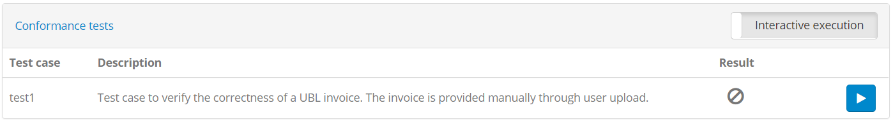
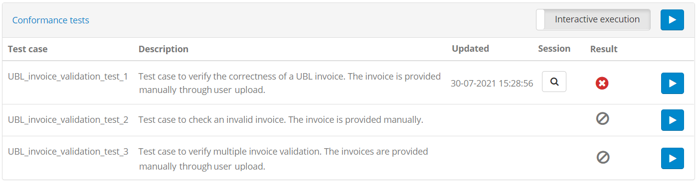
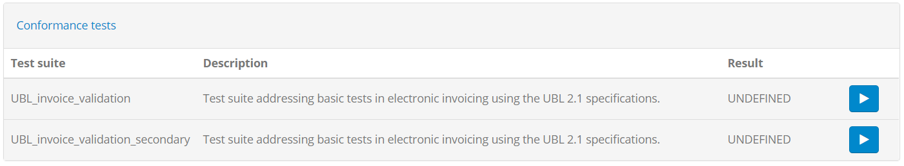
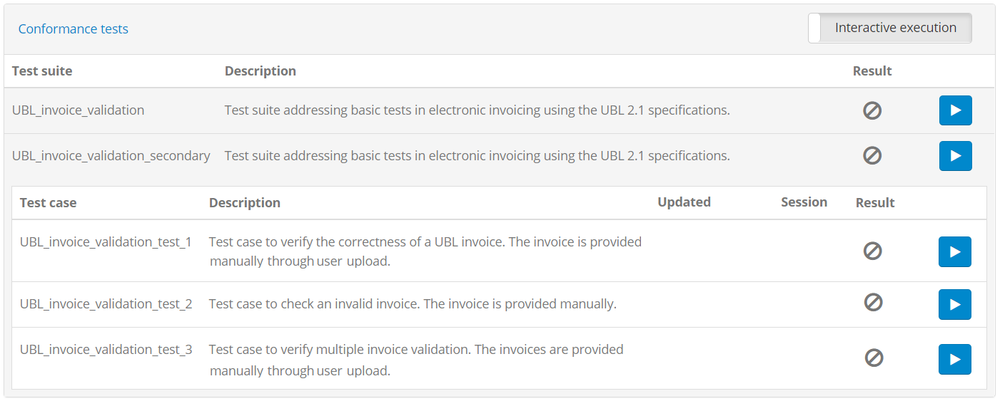
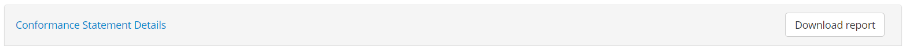

.. _manage_your_conformance_statements:

Manage your conformance statements
==================================

Conformance statements serve to define your organisation's testing goals by linking one of your registered
systems with a specification's actor (see :ref:`introduction__glossary__conformance_statement`). It is a system's conformance statements that determine the test
suites and test cases that will be presented to you to execute.

Your organisation's conformance statements may either be configured by an administrator of your organisation
or by the overall community administrator. From your perspective, conformance statements can be viewed but
not modified, serving to organise and focus your testing activities for each specification.

.. _manage_your_conformance_statements__view_your_conformance_statements:

View your conformance statements
--------------------------------

Conformance statements are made at the level of a system and as such, the first step is to select one of the systems 
configured for your organisation (see :ref:`manage_your_systems`). Note that this step is optional in case your organisation defines only
a single system in which case clicking on the **TESTS** button on the header directly takes you to its list of 
conformance statements.

.. figure:: ../screenshots/conformance_statements_nonadmin.PNG
  :align: center

This table presents for the selected system its list of conformance statements in terms
of their **domain**, **specification** and **actor**. Simply put this set of information serves to uniquely 
identify the specification role that your system aims to play, thus determining the test cases that it should
execute. The presented **results** also provide you an overview of the latest test results, showing you 
how many configured tests your system has successfully passed up to this point. What remains are tests that
have failed or that have never been completed.

From this table you can click any row to proceed to the conformance statement's details (see :ref:`manage_your_conformance_statements__view_a_conformance_statements_details`).
You can return to the listing of conformance statements at any time by clicking the **Conformance Statement** entry in the left side menu.

.. note::
    **Systems with a single conformance statement:** If your selected system defines a single conformance statement
    the current screen is skipped. You are instead presented directly with the conformance statement's details (see :ref:`manage_your_conformance_statements__view_a_conformance_statements_details`).
    Note that in case your organisation has a single system and a single conformance statement clicking the **TESTS**
    button from the screen header will directly bring you to the conformance statement's details.

.. _manage_your_conformance_statements__view_a_conformance_statements_details:

View a conformance statement's details
--------------------------------------

The conformance statement detail screen provides you the test status summary for a given system of your organisation 
and a specification's actor. In addition it is the point from which you can start new tests. The information displayed 
in this page is organised in three sections to present to you:

* The details of the conformance statement.
* The configuration for your system, used when it is defined as a test case's SUT.
* The status and controls of the related tests.

.. _manage_your_conformance_statements__view_a_conformance_statements_details__overview:

Overview
~~~~~~~~

The **Conformance Statement Details** section provides you the context of what your system is supposed to conform to.

.. figure:: ../screenshots/conformance_statement_details_overview_nonadmin.PNG
  :align: center

The **domain** details are presented on the top as the high-level description of the project you are testing for. The 
**specification** information follows to define the specification you have chosen for your system to conform to
(a domain may have multiple specifications). The **actor** information defines the specific role your system is expected to fulfil
as part of this specification (a specification may have multiple actors). At the top of this section you can also click the 
**Download report** button to export your system's conformance statement report (see :ref:`manage_your_conformance_statements__view_a_conformance_statements_details__export`).

.. _manage_your_conformance_statements__view_a_conformance_statements_details__endpoints:

Endpoints
~~~~~~~~~

The next section displayed is the information on the system's **Endpoints**.

.. figure:: ../screenshots/conformance_statement_details_endpoints.PNG
  :align: center

Simply put, this represents the configuration parameters that you are expected to provide
to the test bed for your system. These parameters are termed **Endpoint parameters** and are grouped under an **Endpoint** which you can 
consider as a named group of configuration for use in test cases. The table that is presented displays the **name** and **description** of the 
endpoint and for each endpoint parameter:

* Its **name**, serving as its identifier.
* Its **usage**, indicating whether it is optional ("O") or required ("R").
* Its **type**, which can be "SIMPLE" (i.e. a simple text to enter) or "BINARY" (i.e. a file to upload).
* Whether or not it already has a **configured** value. 

Clicking on a row in this table opens a popup to display additional information on the endpoint parameter.

.. figure:: ../screenshots/conformance_statement_details_endpoint_details_nonadmin.PNG
  :align: center
  :scale: 50%

The information presented additionally here is the parameter's **description** and its **value**.

Finally, note that the complete **Endpoints** section may be missing in case your system is not expected to provide any configuration parameters
before executing its tests.

.. note::
    **Editing endpoint parameters:** Endpoint parameters apply for the specific system across all its conformance statements. As such, 
    editing its configuration (i.e. its endpoint parameters) is reserved to your administrator.

.. _manage_your_conformance_statements__view_a_conformance_statements_details__tests:

Tests
~~~~~

At the bottom of the page you can find the **Conformance Tests** section.

This is a table displaying the tests you are expected to execute for the given conformance statement as well as the latest test results. The 
information displayed for each test case is:

* Its **name**, a short text to identify and refer to the test case.
* Its **description**, providing the context you need to understand the purpose of the test case and plan for its execution.
* Its latest **result** which can be either "SUCCESS", "FAILURE" or "UNDEFINED" in case the test case has never been executed.
* A **Play** button to start a new test session for this test case (see :ref:`execute_tests`).

Note that the screenshot above indicates a simple conformance statement that contains a single test suite containing in turn a single test case. In
this case the test suite is hidden for simplicity. A more elaborate conformance statement would typically include multiple test cases, each 
addressing a different scenario to be tested. The following screenshot is from a conformance statement for which a single test suite is defined
but that contains multiple test cases.

Notice in this case that apart from the individual button to execute each test case, you also have a similar button in the section's header.
Clicking this will proceed to automatically and sequentially execute all listed test cases.

Finally, a further complex conformance statement could define multiple test cases organised in multiple test suites. In this case each test suite
becomes important and is presented in the list of tests.

The table in this case displays at a first level the list of test suites, using a grey backdrop to differentiate them from test cases.
Similar to test cases, each test suite displays its **name**, **description** and overall **result**, and can be clicked to expand and display its test cases.

Clicking on an expanded test suite collapses it again. Notice in addition that the **Play** button to execute test cases now displays at two 
levels:

* **For each test suite:** To automatically and sequentially execute all the test suite's test cases.
* **For each test case:** To execute the specific test case.

.. _manage_your_conformance_statements__view_a_conformance_statements_details__export:

Export conformance statement report
~~~~~~~~~~~~~~~~~~~~~~~~~~~~~~~~~~~

The conformance statement report (in PDF format) provides the details on the conformance statement and also an overview of its relevant tests. To generate it
click the **Download report** button from the overview section's header.

Once the button is clicked you will be prompted for the level of detail you want to include in the report. Two options are available regarding 
whether or not you want to include each test case's step results in the report.

.. figure:: ../screenshots/conformance_statement_report_detail_prompt.PNG
  :align: center
  :scale: 50%

Selecting **Yes** includes the conformance statement details and test overview but also each test case's step results. Selecting **No** on the 
other hand skips the test step results.
.
The following sample illustrates the information that is included in the report's overview section that is always included. Specifically:

 * The information on the **domain**, **specification** and **actor** for the selected system.
 * The name of the system's **organisation** and the **system** itself.
 * The **date** the report was produced and the number of **successfully passed test cases** versus the total.
 * A table with the conformance statement's test cases, displaying a row per test case with its **reference number**, the name of the 
   the **test suite** and **test case**, the test case **description** and its test **result**.

.. figure:: ../screenshots/conformance_statement_report_sample.png
  :align: center

In case the option to add each test case's step results is selected, the report includes a section per test case displaying its summary
and the results from each test step. The test case's title includes its reference number listed in the report's overview section.

.. figure:: ../screenshots/conformance_statement_report_sample_test_case.png
  :align: center

.. note::
    **Detailed report size:**  The detailed conformance statement report presents each test session and individual step in 
    a separate page. If your conformance statement contains numerous test cases, each with multiple test steps, the resulting detailed report 
    could be quite long.

.. _manage_your_conformance_statements__view_system_information:

View selected system's information
----------------------------------

Once a system is selected from the list of your organisation's systems (see :ref:`manage_your_systems`) you can manage its conformance statements and view its test history. 
At any given time you can review the information of your selected system by clicking the **System Information** entry from the left side menu.

.. figure:: ../screenshots/conformance_statements_systeminfo.PNG
  :align: center

In this screen you can see the **short** and **full name** of the system, its **description** and its **version** number.

.. note::
    **Editing a system's information:** The information displayed on this screen is read-only. Editing the system's information is reserved 
    to your administrator.
