.. _manage_your_conformance_statements:

Manage your conformance statements
==================================

:ref:`Conformance statements <introduction__glossary__conformance_statement>` serve to define an organisation's testing goals by linking one of its registered
systems with a specification's actor. It is a system's conformance statements that determine the test
suites and test cases that will be presented for execution.

Depending on your preferences you may allow organisation administrators to configure their own conformance statements or you
may configure them on their behalf.

.. _manage_your_conformance_statements__view_your_conformance_statements:

View your conformance statements
--------------------------------

To view your organisation's conformance statements click the **My conformance statements** link from the menu. Doing so
presents you with a screen listing each statement and its status.

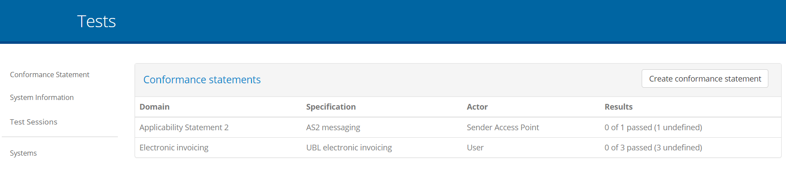

Conformance statements are made at the level of a system and as such, the first step is to select a system from the presented dropdown.
If the organisation only has a single system this appears preselected and its conformance statements are automatically loaded.

Assuming there are conformance statements defined these will be presented in expandable panels, split and grouped based on their
relevant specifications, specification groups and options (if applicable). If you do indeed see such groupings, related statements
can be expanded and collapsed by clicking on their relevant titles.

For each statement you can see besides the **name** of the specification, an overview of the system's current testing status. This overview
consists of:

* The **last update time**, corresponding to the last time the status of the conformance statement was updated.
* The **result counts**, showing the number of tests in the conformance statement that are completed, failed or incomplete.
* The **result ratios**, illustrating the same results but as a percentage of the total tests in the statement.
* The **overall status** of the statement which can be successful, failed, or incomplete, based on the latest test results.

In case numerous statements are defined, you can use the provided **search controls** to filter them based on:

* The specifications' **name**.
* The **overall status**.

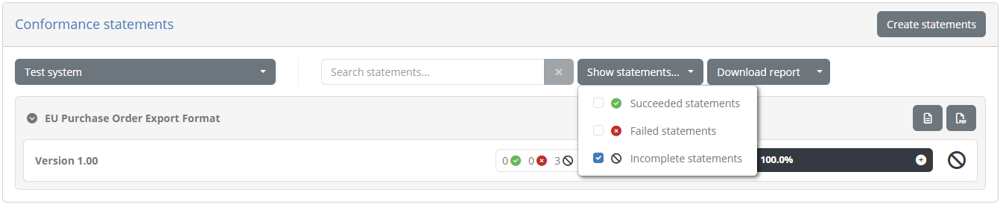

It could be that certain test cases configured for the specification are **optional** in nature. Such tests can be consulted
but are not counted towards the conformance testing status. If such optional tests exist, the displayed counts and ratios
will present a **plus** button to expand their display allowing you to consult both mandatory and optional tests.

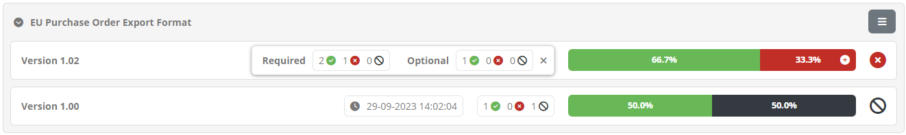

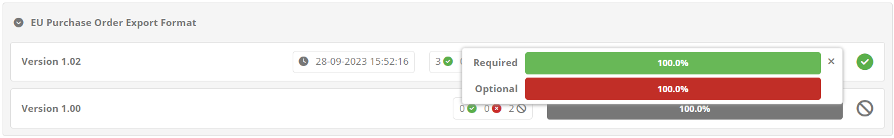

Clicking any conformance statement row will take you to the :ref:`conformance statement's details <manage_your_conformance_statements__view_a_conformance_statements_details>`
from where you can see further information on the statements' test cases and execute new test sessions.

.. _manage_your_conformance_statements__list_view:

List view
---------

You can switch to a **list view** presentation of the conformance statements at any time by toggling the **List view** control from the page's header.

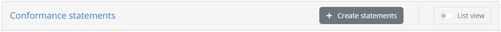

Doing so presents the conformance statements in a table, and enables advanced search filters allowing you to inspect specific
statements of interest. The table listing statements is paged and includes one row per conformance statement.

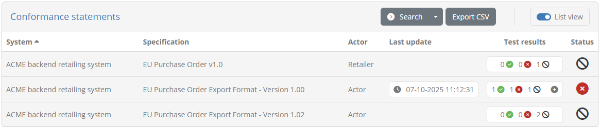

Statements are presented in a paged table sorted based on the **system's name**. Custom sorting
can be applied by clicking the title of each column; clicking a column header for the first time will sort by it in ascending manner and clicking it again
will switch to descending. The active sort column and type are indicated using an arrow next to the relevant column header. The table offers
controls to go to **specific pages** as well as the **first**, **previous**, **next** and **last** ones (as applicable), while showing in the bottom right
corner the total and currently displayed test counts.

The information displayed for each conformance statement is:

* The **system** that is the focus of the testing activities.
* The **specification** that the system is selected to conform to.
* The **actor** of the specification the system is expected to act as.
* The date and time when the conformance statement's status was  **last updated**.
* The statement's **test results** showing how many configured tests are successful, failed, or incomplete. This can also be hovered over to view a text summary
  of the displayed counts.
* The statement's overall **status** (success, failure or incomplete).

Clicking on a row from the table will take you to the :ref:`conformance statement detail screen <manage_your_conformance_statements__view_a_conformance_statements_details>`.

.. _manage_your_conformance_statements__list_view__export:

Export all conformance statements
~~~~~~~~~~~~~~~~~~~~~~~~~~~~~~~~~

It is possible to generate a CSV export including all the conformance statements currently displayed. To do so click the **Export CSV** button
from the conformance statements' header.

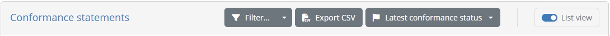

Note that the CSV export will include the conformance statement information as well as the information on the individual related test cases.

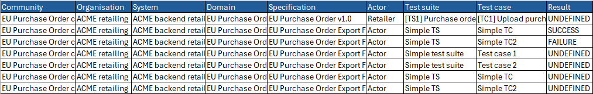

.. _manage_your_conformance_statements__list_view__filters:

Apply search filters
~~~~~~~~~~~~~~~~~~~~

When the conformance statements' list view is active, it offers also a set of filters that can be used to select the displayed conformance statements. These can be enabled
by clicking the **Search filters** button from the table header.

Doing so will expand the table header to present the available filter controls.

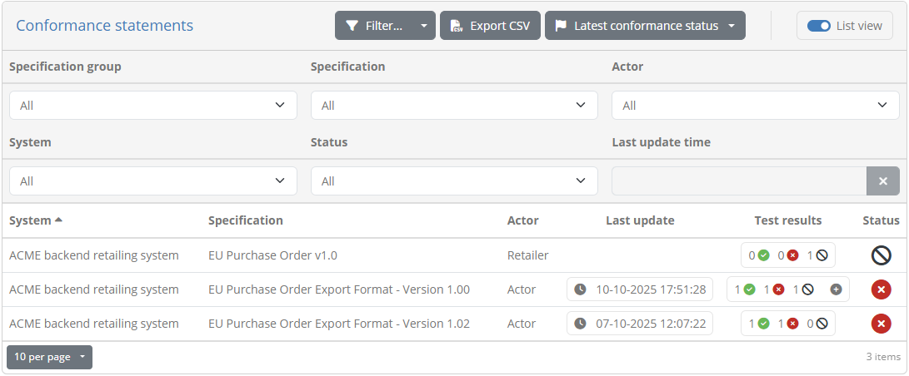

The controls that can be used for filtering are:

* The relevant **system**.
* The relevant **domain**.
* The relevant **specification group**, **specification** and **actor**.
* The conformance **status**.
* The **last update time** for the conformance statement's status.

Most filter controls are defined as selection choices. Multiple selected values across these controls are applied as follows:

* Within a specific filter control using "OR" logic (e.g. selecting multiple specifications).
* Across filter controls using "AND" logic (e.g. selecting a specification and an organisation).

Note additionally that selecting dependent values serves to limit the filter options that are presented. For example if a given specification
is selected, the actors available for filtering will be limited to that specification to already exclude impossible combinations.

The presented conformance statements are automatically updated whenever your filter options are modified. The filter panel may also be **collapsed and expanded**
by clicking again the **Search filters** button. In addition, you may click the caret to the right of the button to select from its options to
either **refresh** the current results, or to **clear all applied filters**.

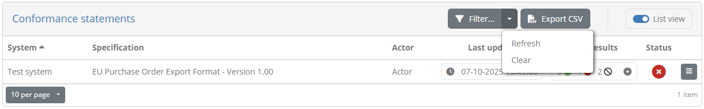

.. _manage_your_conformance_statements__create:

Create a conformance statement
------------------------------

To create a new conformance statement for the selected system click the **Create statements** button from the panel's controls.

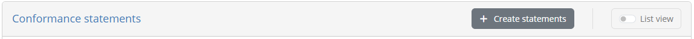

Doing so presents to you the available conformance statements that can be selected for the system.

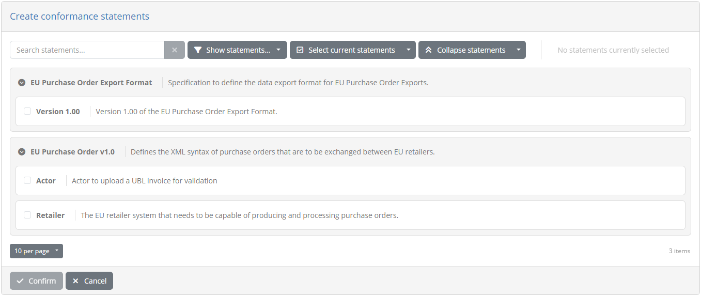

The available domains (if multiple), specifications, their groups (if applicable), and actors are organised as available conformance statements
in expandable options. You may click each statement to collapse or expand it, revealing the available statements that you may select.

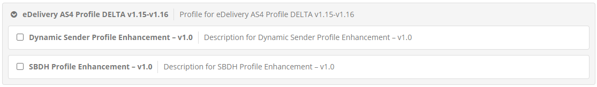

Above the available conformance statements you are also presented with controls to facilitate your selection.

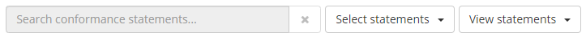

Using these controls you may:

* **Search** for an available statement (the search text is looked up in names and descriptions in a case-insensitive manner).
* Show the currently **selected** or **unselected** statements.
* **Select** or **unselect** the currently displayed statements.
* **Collapse** or **expand** the displayed statements.

At the right of these controls you also see the **total selected statements**. When selecting statements you can make
several searches and navigate between returned pages of results without losing your currently selected statements. This allows
you to fine-tune the conformance statements you want to create for your system.

Once you have selected one or more statements you may click on **Confirm** to proceed with their creation. Clicking on **Cancel** will return you back
to the listing of the existing conformance statements.

.. _manage_your_conformance_statements__export_overview:

Conformance overview report
---------------------------

Besides viewing your conformance statements and their grouping on this screen, you can also generate **conformance overview reports**. These
reports are a complement to the :ref:`conformance statement reports<manage_your_conformance_statements__view_a_conformance_statements_details__export>`
available when :ref:`viewing a specific conformance statement<manage_your_conformance_statements__view_a_conformance_statements_details>`,
focusing rather on a set of related conformance statements. Such overview reports are available at different levels depending on how
specifications are configured, specifically (per decreasing aggregation level):

* Your **overall** status as an organisation (always available).
* A **domain**, when your conformance statements can cover more than one domains.
* A **specification group**, if groups are defined.
* A **specification**, when multiple actors can be tested for.

A report of your overall conformance status can be produced by clicking on the **Download report** button presented above the listing of statements. By default
this will produce a **PDF report**, but clicking the presented caret for additional options allows you to also **download the report in XML format**.

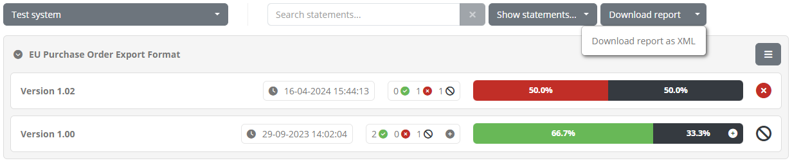

The PDF report includes an **overview** section summarising the report's context and status. This includes:

* The **organisation** and **system** the report refers to.
* The selected **domain**, **specification group**, or **specification** (skipped if the report refers to the overall status).
* The report **date** and **status**.
* The summary of conformance statement results, as **counts** and also **percentage ratios**.

Below the overview section, the report includes the listing of **conformance statements** presented in the same grouping as the on-screen display. Each
statement includes its **name** and **test result ratio** and **status**.

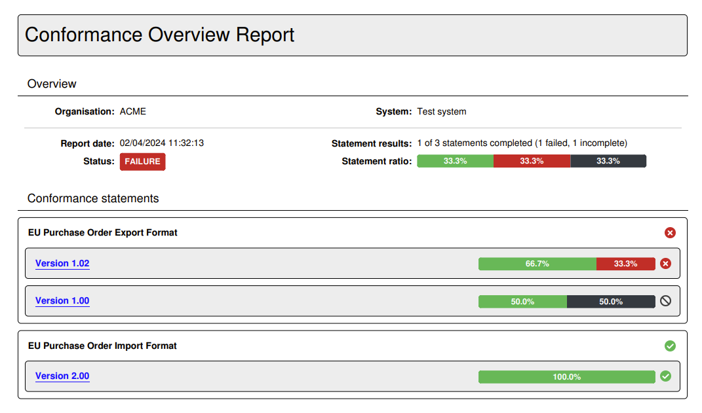

Following the summary of conformance statements, the report includes each individual **statement report** that lists its specific status, test suites and test cases.
In fact the name of each presented conformance statement from the summary is a link you may click to access the page of the relevant statement report.

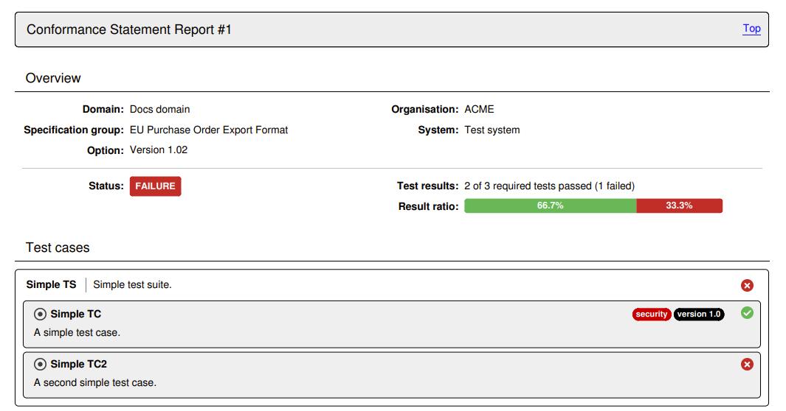

.. note::

  Each conformance statement report included in the overview report, matches the report you can produce separately for the
  :ref:`statement's detail screen<manage_your_conformance_statements__view_a_conformance_statements_details__export>`. When included in an overview report there are however
  no extended details for specific test cases.

An alternative to producing the report in PDF is to select the **Download report as XML** option. The format of this report is defined by the
`GITB Test Reporting Language (GITB TRL) <https://github.com/ISAITB/gitb-types/blob/master/gitb-types-specs/src/main/resources/schema/gitb_tr.xsd>`__,
and allows simpler machine-based processing. The following XML content is a sample of such a report:

.. literalinclude:: ../manageConformanceStatements/resources/conformance_overview_xml.xml
   :language: xml

Producing a conformance overview report at the level of a specific **domain**, **specification group** or **specification**, is achieved
using the option button presented at the right side of the statements' display. Clicking this will present the report generation options.

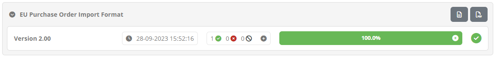

The reports in either case are structured in the same way as the overall reports discussed above. The only difference is that a report at a
specific aggregation level (e.g. a specification group) will also list the relevant level as part of the report's overview information.

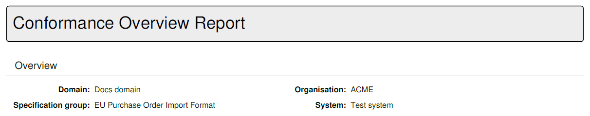

.. _manage_your_conformance_statements__export_overview_certificate:

Conformance overview certificate
--------------------------------

Depending on the community's configuration you may also produce a **conformance overview certificate**. This certificate is a report
(in PDF format) that attests to the fact that your current system has successfully completed testing for all relevant conformance statements.
Such certificates are available for you to download if enabled by the community administrator, and if you have succeeded all relevant testing.

To produce a certificate you click on the PDF report generation buttons, either at the overall level or for a specific domain, specification
group or specification. If generating a certificate is possible you will be prompted with a choice to select the kind of report to produce.

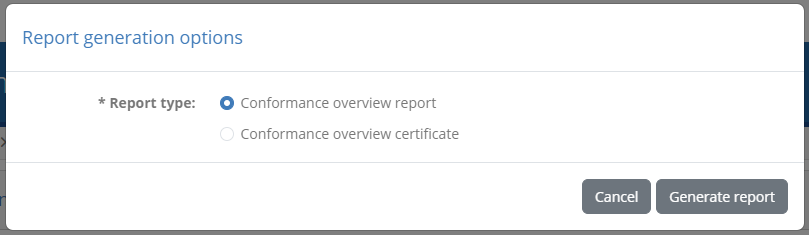

Selecting **Conformance overview certificate** and clicking **Generate report** will produce the certificate, which is similar in content to
the :ref:`normal overview report<manage_your_conformance_statements__export_overview>` but is further curated by the administrator.

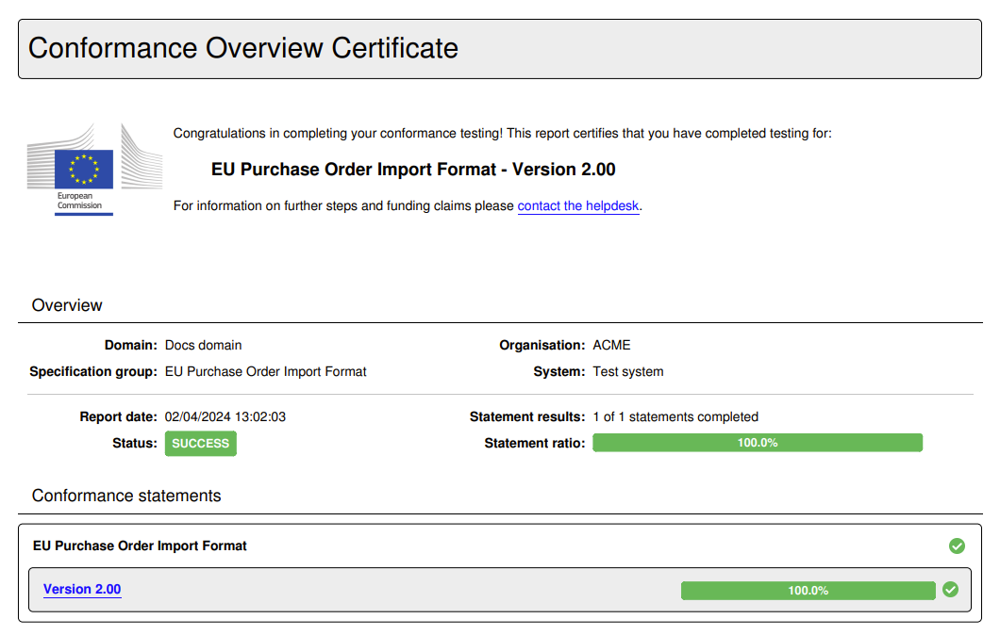

.. note::

  The **Conformance overview report** option is the default if no certificate can be produced. In such a case clicking a PDF report download
  button will skip the report type prompt and directly download the overview report.

.. _manage_your_conformance_statements__view_snapshot:

Select a conformance snapshot
-----------------------------

A **conformance snapshot** represents a milestone in the conformance testing process that can be made by a community administrator. It is called a snapshot
as it is a readonly copy of the conformance testing status at a given point in time, that captures the defined specifications, organisations and test results
at that moment. If such snapshots are available you will see the header on this screen display an additional control to select which conformance testing status
you want to view. By default you always view the **latest conformance status**.

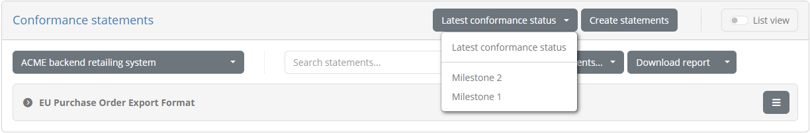

Selecting a specific snapshot, or switching back to the latest status, will refresh the screen to present the relevant conformance statements. Note that a snapshot
could also include elements such as specifications and systems that were defined at the time the snapshot was taken, but that may have since been modified or ever
deleted. All controls here otherwise remain the same with the exception of not being able to define new conformance statements while a snapshot is selected.

In addition, when viewing a specific snapshot and selecting to :ref:`view a statement's details<manage_your_conformance_statements__view_a_conformance_statements_details>`
you will notice that the statement is presented as **readonly**, meaning that is cannot be deleted or have new test executions. In addition, you will see a message
informing you that this statement does not represent the latest testing status.

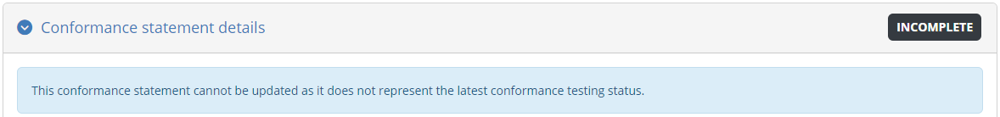

.. _manage_your_conformance_statements__view_a_conformance_statements_details:

View a conformance statement's details
--------------------------------------

The conformance statement detail screen provides you the test status summary for a given system of your organisation 
and a specification's actor. In addition it is the point from which you can start new tests. The information displayed 
in this page is organised in three sections to present to you:

* The **details** of the conformance statement.
* The **configuration** for your system, used when it is defined as a test case's SUT.
* The status and controls of the related **tests**.

.. _manage_your_conformance_statements__view_a_conformance_statements_details__overview:

Overview
~~~~~~~~

The **Conformance statement details** section provides you the context of what the selected system is supposed to conform to.

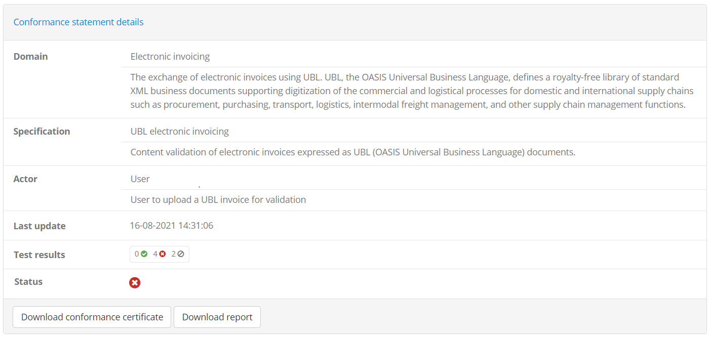

At the top of the detail panel you see the name of the **organisation** and **system** for which this conformance statement has
been made. Following this you see the name and description of the **specification** it is claiming conformance for, including
any options (e.g. specification versions, profiles or roles) that apply. Finally, at the bottom of the panel you see the current
status of the statement, specifically:

* The **overall status** based on the latest test results (success, failure or incomplete).
* The **last update time**, corresponding to the last time the status of the conformance statement was updated.
* The **result counts**, showing the number of tests in the conformance statement that are completed, failed or incomplete.
* The **result ratios**, illustrating the same results but as a percentage of the total tests in the statement.

Similar to the :ref:`conformance statements' listing <manage_your_conformance_statements__view_your_conformance_statements>`,
in case your statement includes optional test cases, the counts and ratios will display a **plus** button that can be
clicked to expand and display both mandatory and optional tests. Note that optional and disabled tests do not count towards
your conformance status.

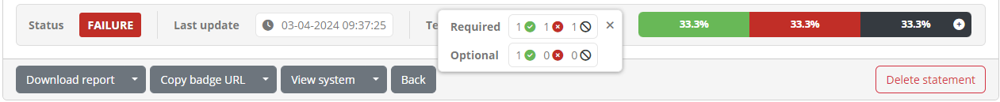

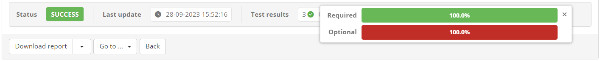

At the bottom of the details' panel you are presented with buttons for further actions as follows:

* The **Download report** button to export your system's current :ref:`conformance statement report <manage_your_conformance_statements__view_a_conformance_statements_details__export>` in PDF or XML, or download a :ref:`conformance certificate<manage_your_conformance_statements__view_a_conformance_statements_details__export_certificate>`.
* The **Copy badge URL** and **Preview badge** buttons to copy (or preview) a conformance badge for your current status. This is available only
  if you have :ref:`configured such badges <domains__specification>`.
* The **View system** button allows you to navigate to your :ref:`system <manage_organisation__systems>` or :ref:`organisation <manage_organisation>` details.
* The **Refresh** button allows you to refresh the status of your conformance statement to view its latest results.
* The **Back** button to return to the :ref:`conformance statement list <manage_your_conformance_statements__view_your_conformance_statements>`.
* The **Delete statement** button to :ref:`delete the conformance statement <manage_your_conformance_statements__view_a_conformance_statements_details__delete>`.

In addition, the overall detail panel can also be **collapsed** and **expanded** by clicking its header. Collapsing its display could be useful if you would want to focus on the tests to
execute rather than the statement's details.

Beneath the statement details' panel you are presented with two tabs that allow you to interact and manage the conformance statement:

* The :ref:`Conformance tests <manage_your_conformance_statements__view_a_conformance_statements_details__tests>` tab to view and launch the statement's tests.
* The :ref:`Configuration parameters <manage_your_conformance_statements__view_a_conformance_statements_details__endpoints>` tab to view and edit the statement's configuration if needed.

.. _manage_your_conformance_statements__view_a_conformance_statements_details__badge:

Using conformance badges
~~~~~~~~~~~~~~~~~~~~~~~~

Conformance badges are an optional feature for specifications that may be :ref:`set up for the community<domains__specification>`. Badges are
images that indicate a specific live status for a given organisation's system, with respect to a specific conformance statement. They are
meant to be accessible publicly so that they can be embedded in displays such as online dashboards or GitHub README files.

In case conformance badges are configured for the statement's specification, the detail panel's controls will also include a **Copy badge URL**
button.

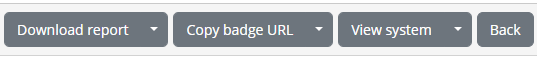

Clicking this will copy to your clipboard a URL that you can then refer to from outside the Test Bed to display a badge. A typical use case for this
would be to add it as the source of an image in a HTML page listing conformant solutions. The same button also includes a secondary option named
**Preview badge** that you can click for a preview.

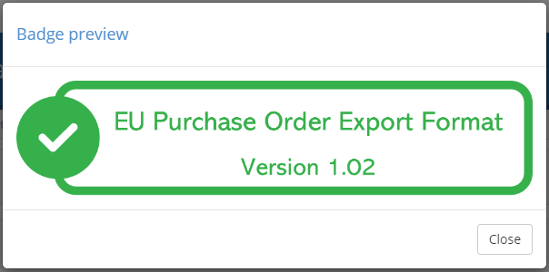

Note that the displayed badge is dynamically updated to always reflect the latest conformance testing status. For example if new test cases are
added to the statement, accessing the same badge (displayed as a "success" badge above) will switch to an "incomplete" badge.

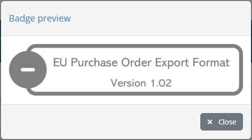

.. note::

    By default conformance badges illustrate a "success" and "not success" state. It could be the case however that specific "failure" badges
    are also configured depending on the community's setup.

.. _manage_your_conformance_statements__view_a_conformance_statements_details__tests:

Conformance tests
~~~~~~~~~~~~~~~~~

The **Conformance tests** tab lists the tests linked to the conformance statement. These are the tests that you need to successfully complete to be considered
as conformant. The display includes two parts:

* A set of **controls** to filter the displayed test cases and configure test execution.
* The list of **test cases** included in the conformance statement.

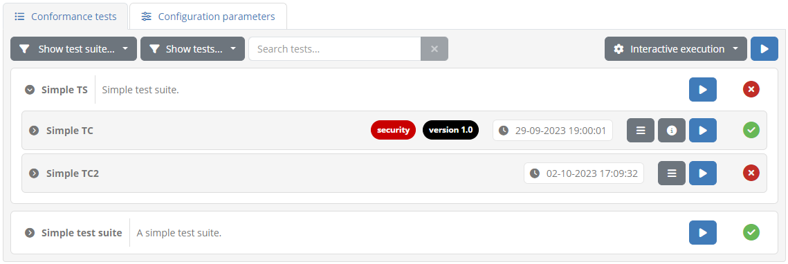

The statement's test cases are grouped by their test suite, of which the **name** is presented in bold, alongside its **description**. This test suite header can be clicked
to expand or collapse the displayed test cases, which could be interesting if there are multiple test suites. Note that if only a single test suite is defined it
appears as expanded by default.

Each test suite includes within it the listing of its test cases. The information displayed for each test case includes:

* An icon indicating of whether it is **required**, **optional**, or **disabled**. Note that if only required tests are defined this icon is hidden.
* Its **name**, a short text to identify and refer to the test case.
* Zero or more **tags** that highlight specific traits relevant to the test case. These can also be hovered over to view further information.
* The date and time of the test case's **last execution**.
* The **status** of the latest test session executed for the test case (displayed on the right).
* The test case extended **description**, which is initially hidden but can be displayed if clicking on the test case row.

This information is complemented by the test case controls which depending on the status of the test case include:

* An **option** button, if a test session has been executed, that allows you to **view** the latest executed session in the :ref:`test session history<view_your_test_history__test_steps>`, and to download its **test report** in PDF or XML format.
* An **information** button to view the test case's extended documentation (if defined).
* A **play** button to :ref:`start a new test session <execute_tests>` for this test case.

At the level of the test suite you can also view the aggregated **status** of the test suite's test cases, as well as additional controls:

* An **information** button to view the test suite's extended documentation (if defined).
* A **play** button to launch test sessions for all listed test cases. This will be missing if the test suite contains only a single test case.

When test sessions are completed for the statement's different test cases, the displayed status will be adapted to present them as successful or failed.
Moreover, in case a test session also produced a detailed output message, this can be viewed by clicking on the success or failure icon.

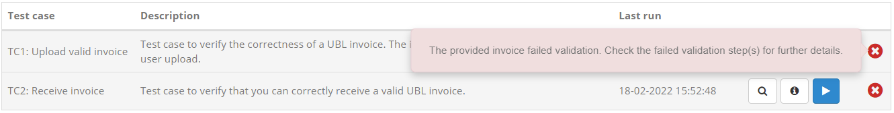

Above the display of test suites the **Conformance tests** tab includes controls relevant to test case selection and execution.

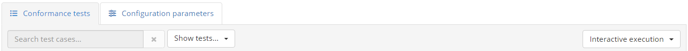

On the left side you are presented with controls to **filter the displayed test cases**. In case there are multiple test suites defined,
the **show test suite** control allows you to lookup and select a specific one. Next to this you can find a **dropdown menu** that
defines which tests are displayed based on their **status**. You may choose to show all tests (the default), or select successful tests, failed tests or incomplete tests.
If there are also optional and disabled test cases you may also select (or deselect) their display from here as well. Finally,
at the end of the filtering controls is also a **search box** that you can use to filter, in a case-insensitive manner, the displayed test cases based on
their name or description.

Any change to filtering options will update the display to list the matched test cases. It is important to note that when selecting to run test cases at the level of the displayed
test suite or the overall conformance statement, the test cases to be executed will be those that match the **current filtering options**.

.. note::

  Disabled test cases can be reviewed in case they have previous test results, but they are hidden by default and cannot be executed.

To the right side you may find a further **dropdown menu** that determines how test cases will be executed, as well as a button to
**launch all tests** matching the current filtering criteria. This button will be missing in case only a single test suite
is displayed.

Regarding the **test execution approach**, the options available are the following:

* **Interactive execution**, to launch tests in an interactive manner, presenting their test execution diagram and interacting with you for inputs.
* **Parallel background execution**, to launch tests in the background executing them in parallel. Note that test cases that don't support parallel execution
  will be ran sequentially.
* **Sequential background execution**, to launch tests in the background executing them one by one in sequence.

Opting for background execution allows you to launch a potentially large number of test sessions without needing to oversee their progress. Note however that
test cases foreseeing user interactions will proceed depending on the test case definition. Specifically:

* **Instructions** are simply skipped, assuming that these are purely of informational value.
* **Inputs** may either cause the test session to pause for later completion, or be automatically handled. Automatic handling
  involves either skipping the inputs, or delegating their collection to a supporting service (if one is configured in the test definition).
  Note that skipping expected user inputs due to background test execution will most likely result in failed test sessions, unless the test cases
  are designed to handle missing values.

The status of test sessions launched in the background can be monitored by means of the :ref:`test history<view_your_test_history>` screen. From here
you may also complete pending user interactions if doing so is foreseen in the relevant test case definitions.

Finally, recall that the listed test suites and test cases may include an **information** button in case they define extended documentation. This documentation
complements the displayed description with further information such as diagrams and reference links.

Clicking this button results in a popup window containing the extended documentation.

.. figure:: ../screenshots/conformance_statement_details_tests_documentation_popup.PNG
  :align: center

Note that the documentation on test cases is also available to consult during their :ref:`execution<execute_tests_interactive_execution>` (in case of interactive execution).

.. _manage_your_conformance_statements__view_a_conformance_statements_details__endpoints:

Configuration parameters
~~~~~~~~~~~~~~~~~~~~~~~~

Alongside the **Conformance tests** tab you are presented with the **Configuration parameters** tab. This includes configuration for the
specific conformance statement that you are expected to provide, as well as your organisation and selected system.

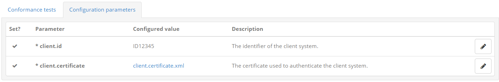

Configuration properties are displayed in panels grouping together **organisation properties**, **system properties** and **statement properties**.
For each property you see its name, value and a tooltip with a description, including an asterisk if a value is required before executing tests.

How you view and edit the value of each property depends on its type, and can be either a text field, password field or file upload control.
To update the properties' values make the desired changes and click on **Update configuration**. Doing so will save the latest values and
validate once again whether you can proceed with executing tests.

.. _manage_your_conformance_statements__view_a_conformance_statements_details__export:

Export conformance statement report
~~~~~~~~~~~~~~~~~~~~~~~~~~~~~~~~~~~

The conformance statement report provides the details on the conformance statement and also an overview of its relevant tests. To generate it
click the **Download report** button from the overview section's panel.

Once the button is clicked you will be prompted for the level of detail you want to include in the report. Two options are available regarding
whether or not you want to include each test case's step results in the report.

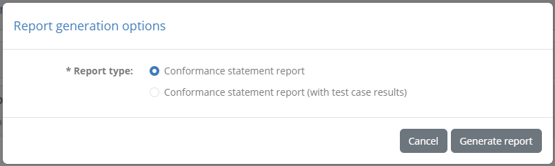

Selecting **Conformance statement report (with test case results)** includes the conformance statement details and test overview but also each
test case's step results. Selecting **Conformance statement report** on the other hand skips the test step results.

The following sample illustrates the information that is included in the report's overview section that is always included. Specifically:

 * The information on the **domain**, **specification** and **actor** for the selected system.
 * The name of the system's **organisation** and the **system** itself.
 * The **date** the report was produced.
 * The overall **conformance status**, the number of **successfully passed test cases** versus the total as well as **result percentage ratios**.
 * A listing of the statement's **test suites**, each including its **test cases** and their **result**. Test cases are presented as a **link** to
   take you directly to the relevant result (if test steps were selected to be included).

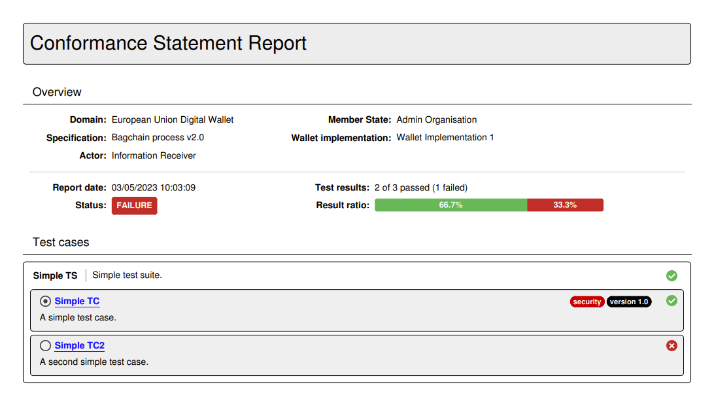

If the listed test cases include optional or disabled test cases, or if any of them define tags, the listing of test cases is followed by a
**legend** explaining the meaning of the different status icons and tags.

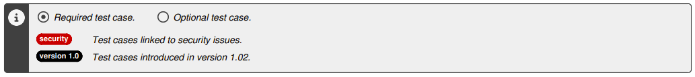

In case the option to add each test case's step results is selected, the report includes a page per test case displaying its summary
and the result of each test step. The test case's title includes its reference number listed in the report's overview section, and
provides also a link to return to the listing of test cases.

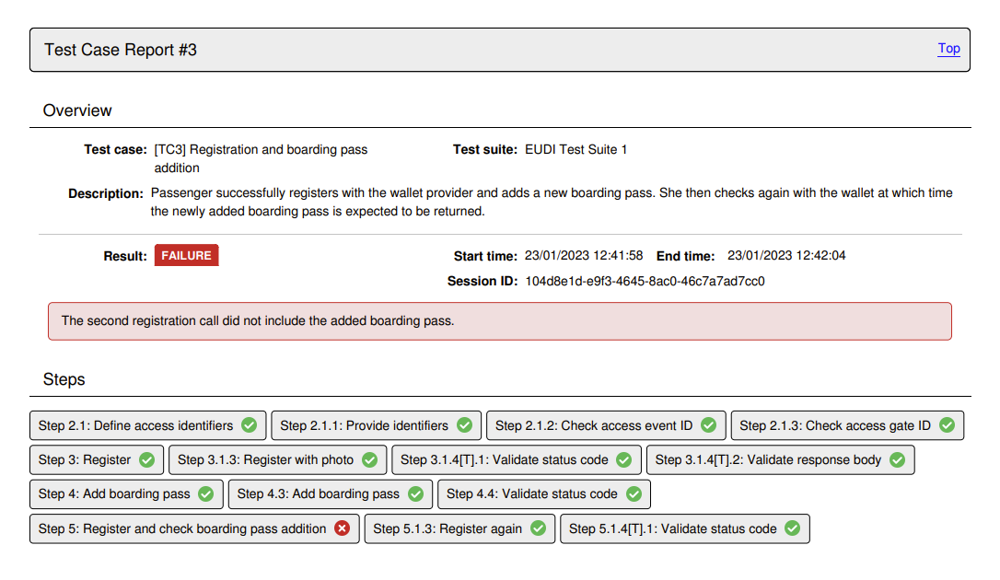

.. note::
    **Detailed report size:**  The detailed conformance statement report presents each test session and individual step in 
    a separate page. If your conformance statement contains numerous test cases, each with multiple test steps, the resulting detailed report 
    could be quite long.

An alternative to producing the report in PDF is to select the **Download report as XML** option presented by clicking to expand the download
button's options. The format of this report is defined by the `GITB Test Reporting Language (GITB TRL) <https://github.com/ISAITB/gitb-types/blob/master/gitb-types-specs/src/main/resources/schema/gitb_tr.xsd>`__,
and allows simpler machine-based processing. As in the case of the PDF report, you are prompted whether or not to include detailed test step
results before proceeding with the download. The following XML content is a sample of such a report:

.. literalinclude:: ../manageConformanceStatements/resources/conformance_statement_xml.xml
   :language: xml

.. _manage_your_conformance_statements__view_a_conformance_statements_details__export_certificate:

Export conformance certificate
~~~~~~~~~~~~~~~~~~~~~~~~~~~~~~

The conformance certificate is a report (in PDF format) that attests to the fact that your current system has successfully passed its expected test cases. The option
to generate this is only visible if your system has succeeded in all configured tests.

Assuming the option is available for you, you can select the **Download conformance certificate** option after having expanded the download button's options.
The certificate will typically resemble the following sample:

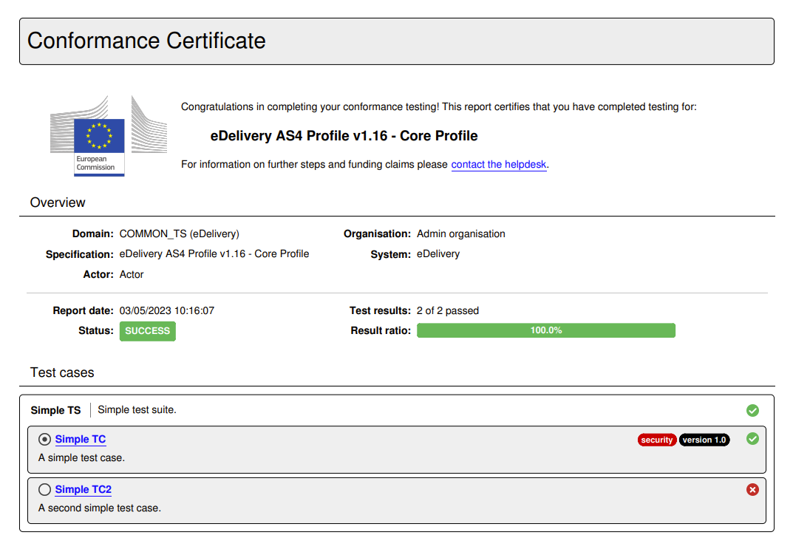

The contents of the certificate are defined by your administrator and are a customisation of the :ref:`conformance statement report<manage_your_conformance_statements__view_a_conformance_statements_details__export>`.
The certificate may omit certain sections, include a message for you, and potentially be digitally signed.

.. _manage_your_conformance_statements__view_a_conformance_statements_details__delete:

Delete conformance statement
~~~~~~~~~~~~~~~~~~~~~~~~~~~~

Deleting the conformance statement may be desired if you created it by mistake or if your system is no longer expected to conform to the
given specification. Deleting the conformance statement is possible through the **Delete statement** button from the overview panel.

Clicking this will request confirmation and, if confirmed, will remove the conformance statement. Note that your testing history relevant
to this conformance statement still remains and can be consulted through your :ref:`test history <view_your_test_history>`. In addition,
if you create the same conformance statement again, your previous tests will be once again counted towards your conformance testing status.
