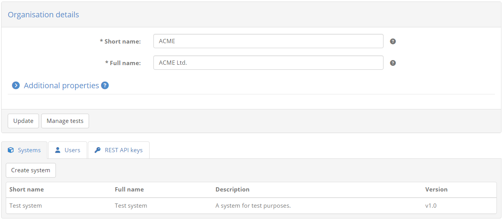
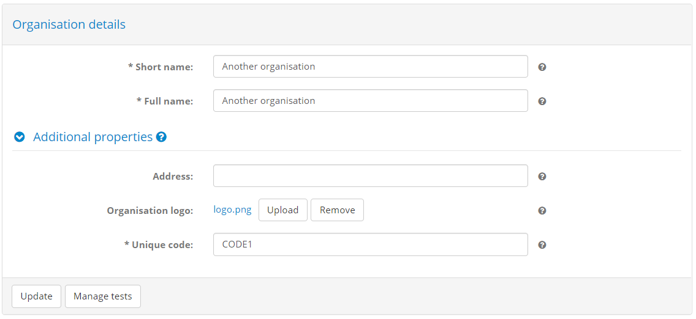
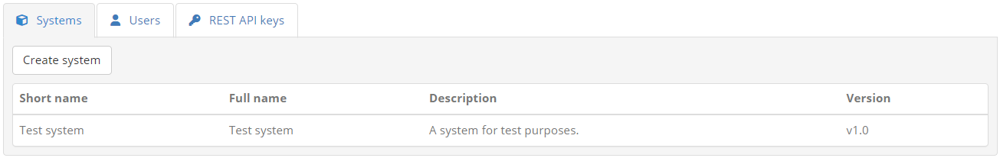
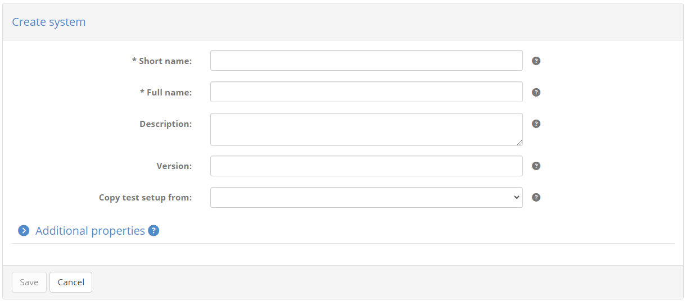
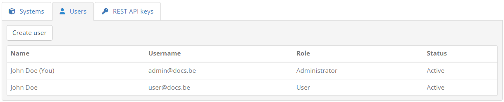
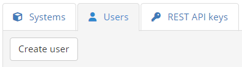
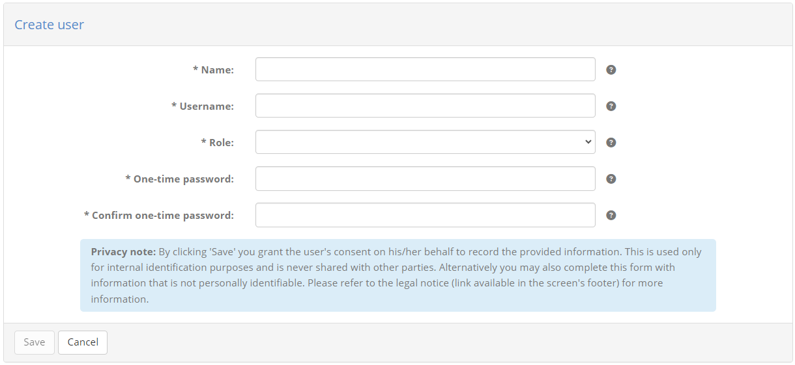
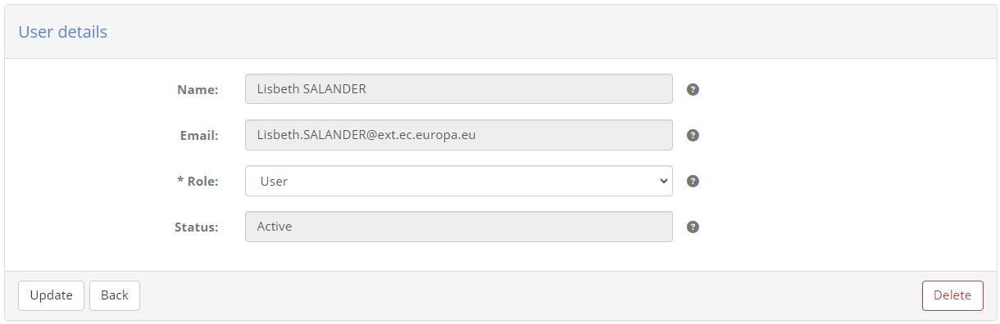
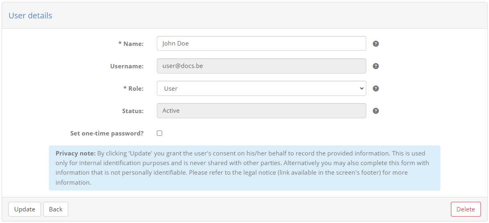
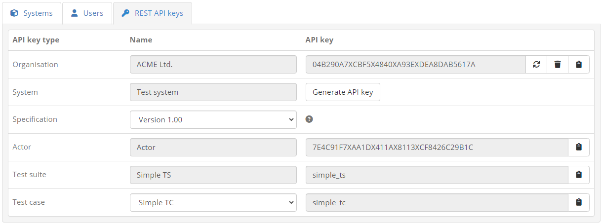

.. _manage_organisation:

Manage your organisation
========================

To view your organisation's information click the **My organisation** link from the side menu. The screen you 
are presented with shows you the information relevant to your organisation, split in the following sections:

* **Organisation details:** The name (short and full) of your organisation.
* **Systems**: A tab listing the systems defined for your organisation. Each listed system displays its **name** (short and full),
  **description** and **version**.
* **Users:** A tab listing your organisation's users. This includes yourself as well as any other configured users.
  For each user the **name**, **username** (or **email** if using EU Login), **role** and **status** are presented.
* **REST API keys:** A tab, visible if :ref:`testing via REST API<execute_tests_rest>` is enabled by your administrator, allowing you to view and manage the
  keys you need to use it.

If your community administrator has defined additional properties for its organisations you will also see here an
**Additional properties** section that you can click to display your organisation's additional information. 

If this is expanded you will see a list of these additional properties along with their currently configured values.
Such properties can be simple texts, secret values (e.g. passwords) or files and, if supplied by your community 
administrator, will display a help tooltip to understand their meaning.

As an administrator you can view and edit these properties, depending on their type:

* For texts the current value is presented in an editable text field.
* For files the **Upload** button is used to select a new file, whereas if one is already set you can download it
  by clicking on its link, or delete it by clicking **Remove**.
* For secrets a read-only text field indicates whether a value is currently set, whereas to provide a new value you
  check **Update**. When providing a new value you can also toggle the display of the typed characters.

Certain properties may actually be non-editable. Such properties can only be managed by your community administrator.

.. note::
  Required properties are marked with an asterisk. It is is not mandatory to fill these in when editing the organisation's
  information but as long as required properties are missing you will not be able to launch tests.

Update any of the existing values and click on **Update** to persist your changes. From here you can also review your
organisation's :ref:`systems <manage_organisation__systems>`, :ref:`users <manage_organisation__users>`
and :ref:`REST API keys <manage_organisation__rest>` by clicking on their respective tabs. You may also click the **Manage tests** 
button to view your organisation's :ref:`conformance statements <manage_your_conformance_statements>`.

.. _manage_organisation__systems:

Manage your systems
-------------------

Selecting the **Systems** tab presents the :ref:`systems <introduction__glossary__system>` defined for your organisation.
Systems are an important concept in the test bed as they represent the software components you are testing for. Before
proceeding to test anything you will need to have one or more systems that you can use to define conformance statements.

Your organisation's systems are presented in a table that displays for each system:

* Its **short name**, a brief name used to display in search results.
* Its **full name**, the complete system name presented in reports and detail screens.
* A **description**, providing additional context on the specific system.
* A **version** number.

To :ref:`view the details of a specific system <manage_organisation__systems_edit>` you can click its row in the table. Clicking on
the **Create system** button allows you to :ref:`create a new system <manage_organisation__systems_create>`.

.. note::
  **Create option missing:** The create system option may be missing if your community administrator has disabled the management of
  systems by organisation users.

.. _manage_organisation__systems_create:

Create a new system
~~~~~~~~~~~~~~~~~~~

To create a new system click on the **Create system** button displayed above the listing of existing systems.

Doing so you will be presented with a screen to provide the new system's information. The inputs presented in the form are:

* The system's **short name** (required). This is used when the system is displayed in lists.
* The system's **full name** (required). This is included in reports that mention the system.
* An optional **description** to provide more information about the system.
* A **version** number. Although requested this is not currently used in the test bed apart from display purposes.

If your organisation includes other systems you are also presented here with an option to **copy the test setup** from
one of them as a source. Selecting one will replicate the selected system's conformance statements for the new system.

.. figure:: ../screenshots/systems_create_copy.PNG
  :align: center
  :scale: 70%

Once another system is selected to copy from, you are also presented with additional options to include:

* **System properties:** To also copy any additional system-level properties that the source system defines.
* **Conformance statement configurations:** To also copy any of the source system's configuration parameters set on its
  conformance statements.

If your community foresees additional system properties, and as long as you are not copying the properties from another system,
you will also see a **Additional properties** section. Clicking this expands the section so that you can manage your new system's properties.

.. figure:: ../screenshots/systems_create_properties.PNG
  :align: center

Configured properties can be simple texts, secret values (e.g. passwords) or files for which, if supplied by your community
administrator, you will also see a help tooltip to understand their meaning. Such properties can be edited as follows:

* For texts through an editable text field or by selecting a preset value from a dropdown list.
* For files using the **Upload** button. Once one is selected you can download it by clicking on its link, or delete it by
  clicking **Remove**.
* For secrets a read-only text field indicates whether a value is currently set. Provide a new value by checking
  **Update** which makes the text field editable. While editing you can also toggle the display of typed characters.

.. note::
  Required properties are marked with an asterisk. It is is not mandatory to fill these in when providing the system's
  information but as long as required properties are missing you will not be able to launch tests.

Once you have entered the system's information click the **Save** button to record it. You can also click the **Cancel** button
to return to the previous screen without making any changes.

.. _manage_organisation__systems_edit:

Edit an existing system
~~~~~~~~~~~~~~~~~~~~~~~

To edit an existing system click its row from the listing of existing systems. Doing so results in a screen
displaying the system's information, presented in editable input fields.

.. figure:: ../screenshots/systems_update.PNG
  :align: center

You can proceed here to modify the **short name**, **full name**, **description** and **version** of the system. If your organisation defines
other systems you can also select to **copy the test setup** from another system which will reset the system's conformance statements to
match the selected one (upon confirmation).

.. figure:: ../screenshots/systems_create_copy.PNG
  :align: center
  :scale: 70%

Once another system is selected to copy from, you are also presented with additional options to include:

* **System properties:** To also copy any additional system-level properties that the source system defines.
* **Conformance statement configurations:** To also copy any of the source system's configuration parameters set on its
  conformance statements.

If your community foresees additional system properties, and as long as you are not copying the properties from another system, you
will also see an **Additional properties** section. You can click this to expand and manage the system's properties.

.. figure:: ../screenshots/systems_update_properties.PNG
  :align: center

Configured properties can be simple texts, secret values (e.g. passwords) or files for which, if supplied by your community
administrator, you will also see a help tooltip to understand their meaning. Such properties can be managed as follows:

* For texts the current value is presented in an editable text field or dropdown menu (if the property has preset values).
* For files the **Upload** button is used to select a new file, whereas if one is already set you can download it
  by clicking on its link, or delete it by clicking **Remove**.
* For secrets a read-only text field indicates whether a value is currently set, whereas to provide a new value you
  check **Update**. When providing a new value you can also toggle the display of the typed characters.

Certain properties may actually be non-editable. Such properties can only be managed by your community administrator.

.. note::
  Required properties are marked with an asterisk. It is is not mandatory to fill these in when providing the system's
  information but as long as required properties are missing you will not be able to launch tests.

Once ready click the **Update** button to finish. You may also click here the **Manage tests** button to view the system's :ref:`conformance statements <manage_your_conformance_statements>`,
or the **Delete** button which, following confirmation, will proceed to
completely delete the system. In case you choose to delete the system, the tests realised for it will still be searchable but will be presented
as obsolete (see :ref:`view_your_test_history`). Finally, you can also click the **Back** button to return to the previous screen
without making any changes.

.. note::
  **Missing delete option:** The delete system option may be missing if your community administrator has disabled the management of
  systems by organisation users.

.. _manage_organisation__users:

Manage your users
-----------------

Selecting the **Users** tab presents your organisation's users. This includes yourself as well as any other
users defined by administrators.

Each user is displayed in a row presenting her **name**, **email**, **role** and **status**. Your entry in the table is
highlighted with a "(You)" displayed at the end of your name. From here you can click on the **Create user** button
to :ref:`create a new user <manage_organisation__users_create>`, or click on an existing user's row to
:ref:`edit the user <manage_organisation__users_edit>`.

.. note::
  **User status:** A user's status is meaningful when the test bed is integrated with EU Login. A value of **Inactive** indicates
  a user that has not yet :ref:`confirmed a role assignment<login__roles__confirm>` whereas a value of **Not migrated** indicates
  a legacy account that has not been :ref:`migrated to EU Login<login__roles__migrate>`. In all other cases the user will be
  displayed as **Active**.

.. _manage_organisation__users_create:

Create a new user
~~~~~~~~~~~~~~~~~

As organisation administrator you can add new users to your organisation. Adding a new user is done by clicking on
the **Create user** button presented above the listing of existing users.

Doing so will present a screen to input the new user's information, the content of which depends on whether or not your test bed
uses EU Login for its authentication.

Case: EU Login
++++++++++++++

In case EU Login is used the following screen is displayed.

.. figure:: ../screenshots/organisation_manage_add_member_eulogin.png
  :align: center

You are required to provide the **email** address and **role** of the user. The email address needs to be the one that the user has
linked to her EU Login account. The role can either be "Administrator" or "User". Recall that the "User" role can execute and follow
up on tests, whereas the "Administrator" role can additionally manage the organisation's configuration (e.g. properties, systems and
conformance statements) and add other users.

Once you have created the user you will see that a new entry is added to the list of users
but for which there is no displayed name and the displayed status is **Inactive**. The name and status will be
updated once this user has :ref:`confirmed this role assignment<login__roles__confirm>`. To finish creating the user click **Save**,
otherwise click **Cancel** to return to the previous screen.

Case: no EU Login
+++++++++++++++++

In case EU Login is not used the following screen is displayed.

The information requested for the new user are as follows:

* The user's **name** (required), used when contacting the support team.
* The **username** (required), used by the user to login.
* The user's **role** (required), either "Administrator" or "User". Recall that the "User" role can execute and follow up on tests, whereas the "Administrator"
  role can additionally manage the organisation's test configuration (e.g. systems and conformance statements) and add other users.
* The user's **password** and the password **confirmation**. The entered password is considered a "one-time" password that the user will need to change upon his/her next login.

To complete the creation of the user click the **Save** button. Clicking on **Cancel** will discard pending changes and return to the previous screen.

.. _manage_organisation__users_edit:

Edit an existing user
~~~~~~~~~~~~~~~~~~~~~

To edit an existing user of your organisation click on her corresponding row from the listing of existing users. The screen you see following
this depends on whether or not your test bed uses EU Login for its authentication.

Case: EU Login
++++++++++++++

Editing a user's details opens a screen to display her current information.

The information presented here is the user's **name**, **email**, **role**, and **status**. From here you can change
the user's role and click on **Update** to save your change. Alternatively you can delete, upon confirmation, the user by clicking
on **Delete** or click **Back** to cancel and return to the previous screen.

Case: no EU Login
+++++++++++++++++

Editing a user's details displays presents her information in the following screen.

The information displayed is the user's **name**, **username**, **role**, and **status**, of which only the **name** and **role** can
be edited. You may also check the **Set one-time password** option to provide a new password for your user (to be changed on his/her next login). Clicking
on **Update** saves your changes whereas clicking on **Back** discards them and returns you to the previous screen. The **Delete**
button will, following confirmation, delete the current user.

.. note::
  Selecting to edit your own user will take you to your :ref:`profile management screen <manage_your_profile>`.

.. _manage_organisation__rest:

Manage your REST API keys
-------------------------

Selecting the **REST API keys** tab (if available) presents you the API keys to :ref:`launch and manage test sessions via REST API<execute_tests_rest>`. This tab
may be missing if use of this REST API is not enabled by your administrator.

From this table you can view, manage and copy the keys you need to identify your organisation, the system to be tested and the target conformance statement and
tests. These API keys are listed in a table presenting per case the key to consider. For each key you may click the provided **copy** control to copy it to your
clipboard.

The keys listed include the following:

* **Organisation:** The key to identify your organisation. The readonly name of the organisation is displayed alongside the key. You are also presented here
  with **reset** and **delete** controls to replace or remove the key.
* **System:** The key to identify a specific system. If your organisation defines multiple systems these are presented in a dropdown list and selecting one
  will display its API key. The displayed key also provides **reset** and **delete** controls to replace or remove it.
* **Specification:** The target specification does not itself define an API key but you need to select one to view the API keys of its related information
  (actors, test suites and test cases). If you have conformance statements for only a single specification this appears as preselected and readonly.
* **Actor:** The key to identify the target specification's actor. The actor, along with your selected system essentially constitute your target
  :ref:`conformance statement<manage_your_conformance_statements>`. The selected specification's actors are listed in a dropdown list unless there is a single one which would appear as a readonly preset selection.
  Selecting an actor from the list displays its related API key.
* **Test suite:** The key to identify a specific test suite. Selecting a given test suite displays its relevant API key.
* **Test case:** The key to identify a specific test case within the selected test suite. Selecting a given test case displays its relevant API key.

When removing or replacing the API key of your organisation or one of its systems, you will be prompted to confirm it. If you
proceed to do so any existing automation setups you may have would need to be updated accordingly given that the previous
keys will no longer be valid.

Details on how these REST API keys are used to launch and manage test sessions are provided in :ref:`execute_tests_rest`.

.. note::

  The displayed specifications, actors, test suites and test cases are limited to those linked to your already configured :ref:`conformance statements<manage_your_conformance_statements>`.