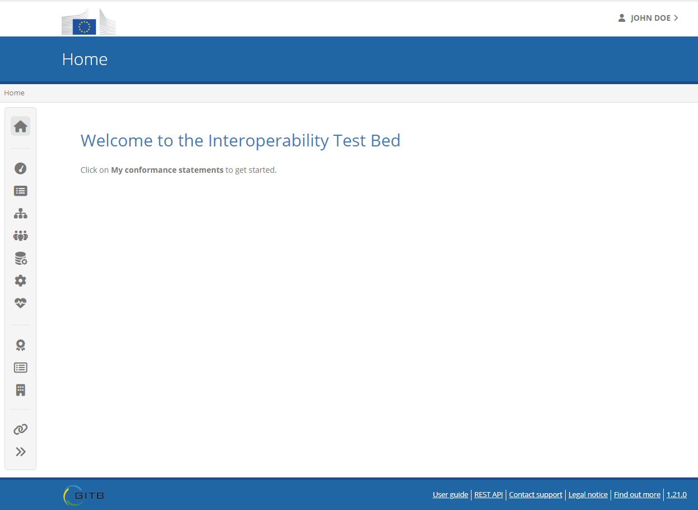
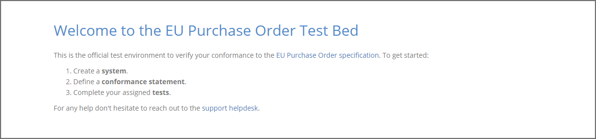
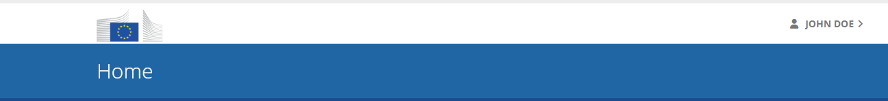
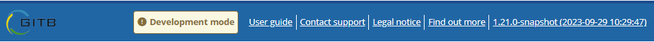
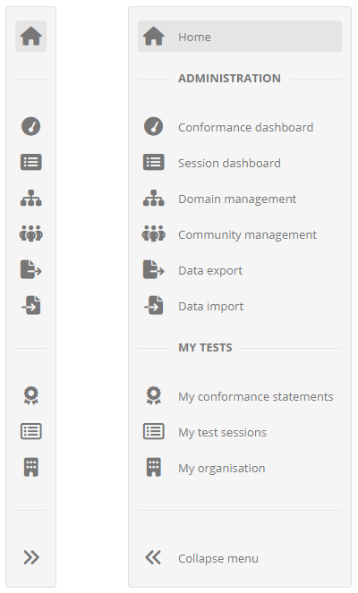
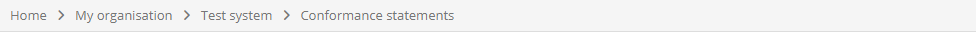
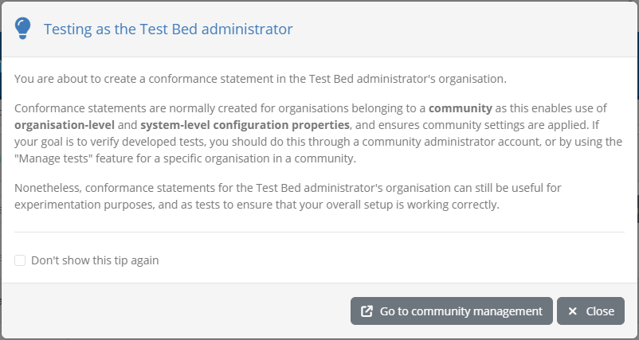

.. _navigate:

Navigate the user interface
===========================

Once you have :ref:`logged into the Test Bed <login>` you are presented with its main user interface. From here you can proceed to go about your tasks,
navigating screens using the Test Bed's various navigation options.

Interesting points to highlight about the main user interface and navigation controls are:

* The :ref:`landing page <navigate__landing_page>`.
* The :ref:`banner <navigate__banner>` and :ref:`footer <navigate__footer>`.
* The :ref:`left-side menu <navigate__menu>`.
* The :ref:`navigation breabcrumbs <navigate__breadcrumbs>`.

.. _navigate__landing_page:

Using the landing page
----------------------

The first page you are presented with after logging in is called your **landing page**. This is set up by you
as the point to welcome your community members to the Test Bed. If not set, this will be the default page
configured by the Test Bed administrator.

The content of the landing page can vary based on your community, but it would typically include a welcome message,
simple instructions to get started, references to online resources and support information.

The landing page is accessible at any time by clicking on the **Home** links, present at the top of the :ref:`menu <navigate__menu>`
or at the beginning of the :ref:`breadcrumb trail <navigate__breadcrumbs>`.

.. note::
  The first page that is accessed by community users upon login can be changed as part of the :ref:`community's configuration <community>`.

.. _navigate__banner:

Using the banner
----------------

At the top of the screen you will always see the interface's **banner**.

The primary purpose of the banner is to always highlight for you the purpose of the screen that you are currently on. The displayed text
will change whenever you navigate between different screens. Besides this information, the banner also displays your name in the top-right 
corner as the currently connected user. Hovering over your name gives you access to further information and controls relevant to your
personal profile. These controls are discussed in the :ref:`profile management section <manage_your_profile>` of this guide.

.. _navigate__footer:

Using the footer
----------------

At the bottom of the screen you are presented with the interface's **footer**.

.. figure:: ../screenshots/navigate_footer.png
  :align: center

The footer includes the following information and links:

* A link to the **user guide**. The section of the user guide displayed depends on the screen you are currently accessing.
* A link to the **REST API** OpenAPI documentation, if the :ref:`REST API is enabled <api>`.
* A link to **contact the support team** for problems, questions and feedback (see :ref:`contact_support`).
* A link to view the Test Bed's **legal notice**.
* A link to **find out more** information on the Test Bed.
* The Test Bed's **version** number which can also be clicked to view its release notes.

In case you are accessing a development instance of the Test Bed you will also see in the footer a clear indication that you
are running in **development mode**. This is presented as a warning given that such an instance is not suited for use in production
due to certain `security configurations <https://www.itb.ec.europa.eu/docs/guides/latest/installingTheTestBedProduction/index.html#step-3-prepare-basic-configuration>`_
being pending. When accessing the Test Bed in development mode the version information displayed will also include the software's
build timestamp.

.. _navigate__menu:

Using the menu
--------------

The main **navigation menu** of the Test Bed is presented in the left side of the screen and is always present. The menu is
presented by default in collapsed mode but can be expanded to see full descriptions of the available links.

When in collapsed mode, navigation links are presented using icons that can be hovered over to display their meaning. By clicking
on the **expand** icon at the bottom of the menu, it will expand to present alongside the items their descriptions. The menu
items are grouped thematically, whereas the menu item that applies to your current screen is highlighted.

The following menu items are available to you:

.. csv-table::
    :header: "Menu item", "Description"
    :delim: |

    **Home** | Takes you back to your :ref:`landing page <navigate__landing_page>`.
    **Conformance dashboard** | Takes you to view the overall :ref:`conformance status <monitor_conformance_status>` of your community.
    **Session dashboard** | Takes you to the monitoring page for all active and completed :ref:`test sessions <monitor_test_sessions>`.
    **Domain management** | Takes you to the management of your :ref:`specifications and test configuration <domains>`.
    **Community management** | Takes you to the management of your :ref:`community <community>`.
    **Data management** | Takes you to the page managing :ref:`data imports and exports <exportimport>`.
    **System administration** | Takes you to the page managing the overall :ref:`Test Bed configuration<systemAdmin>`.
    **Service health** | Takes you to the monitoring page for the overall :ref:`service health <serviceHealth>`.
    **My conformance statements** | Takes you to your own organisation's :ref:`conformance statement overview <manage_your_conformance_statements>`.
    **My test sessions** | Takes you to your own organisation's :ref:`test history <view_your_test_history>`.
    **My organisation** | Takes you to view your own :ref:`organisation's information <manage_organisation>`.
    **Link to current page** | Copies an external and shareable link for the current page.
    **Collapse menu** | Collapses (or expands) the menu.

.. _navigate__breadcrumbs:

Using the breadcrumbs
---------------------

The **navigation breadcrumbs** are presented just below the interface's :ref:`banner <navigate__banner>` and above
the :ref:`menu <navigate__menu>` and main page content.

The purpose of the breadcrumbs is to present you the sequence of screens you have gone through to reach your current
screen. Each breadcrumb is separated with a chevron highlighting the hierarchical order of screens going from the 
higher-level screens on the left, to more detailed screens on the right.

Each breadcrumb can be clicked to take you to its respective screen. The **Home** breadcrumb is always present as
the first, left-most, breadcrumb, to take you back to your :ref:`landing page <navigate__landing_page>`.

Using the breadcrumbs offers quick navigation from any screen but also helps contextualise the current screen you are on.
This can be interesting if you are accessing a screen presenting detailed information, as it serves as a reminder of the
exact information you are seeing and its hierarchical place compared to other information.

.. _navigate__usage_tips:

Usage tips
----------

Upon accessing specific pages, the Test Bed may display **usage tips** to help you getting started in using it. The purpose
of these is to acquaint you with key concepts and guide you when creating your initial setup.

Such tips are only presented to the Test Bed administrator, not to other users, and are meant as a development aid. Whenever
a tip is shown, you are presented with the option to **close** the tip, and while doing so, disable the specific tip,
or all tips in the future. Where applicable, the tip will also include controls to access other referenced screens.

Tips can be disabled and also re-enabled from the :ref:`system configuration screen <systemAdmin>`.
