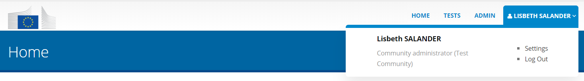
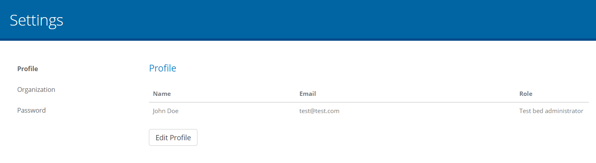
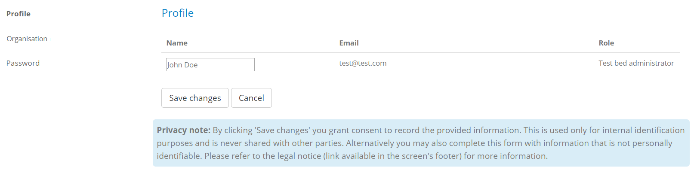
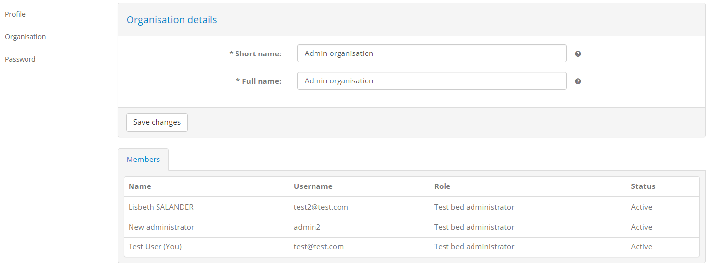
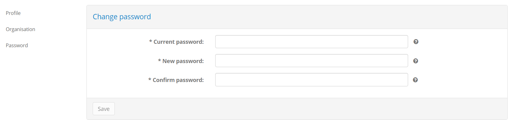

.. _manage_your_profile:

Manage your profile
===================

To manage your profile locate in the screen's header the control displaying your user's name.

.. figure:: ../screenshots/header_admin.PNG
  :align: center

Hovering over this displays your name and two links:

* **Settings:** To manage your profile settings.
* **Log Out:** To log out from the test bed.

To manage your profile select the **Settings** link. The screen that is displayed presents you your 
profile information, including your **name**, **email** and **role**. In the side menu you are also
presented links to manage your profile (**Profile**, the current page), manage your organisation (**Organization**)
and reset your password (**Password**).

.. _manage_your_profile__edit:

Edit your profile
-----------------

To edit your profile click the **Edit Profile** button in the bottom of the screen. Doing so results in
your name becoming editable.

From here enter the value you want for your name and click **Save Changes** to complete. Alternatively
click on **Cancel** to not proceed with the update.

.. _manage_your_profile__view_organisation_details:

View your organisation's details
--------------------------------

To view your organisation's information click the **Organization** link from the side menu. This shows you 
the information relevant to your organisation, split in two sections:

* **Organization:** The name (short and full) of your special-purpose organisation.
* **Members:** Your organisation's list of members (i.e. users). This includes yourself as well as any other 
  test bed administrators. For each user the **name**, **email** and **role** are presented.

.. note::
    **Editing your organisation details:** The "Admin Organisation" presented here is a special organisation linked to the test bed's administrators
    that is used for testing purposes. You cannot change this organisation's information.

.. _manage_your_profile__change_password:

Change your password
--------------------

To change your password click on the **Password** link from the side menu. Doing this presents you with a form
to enter your current password and the new one. To ensure your new password is entered correctly you need to enter
it twice (in the **New Password** and **Confirm Password** fields).

When ready click on the **Save** button to complete your password update.