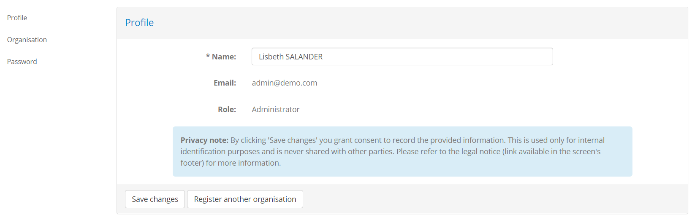

.. _manage_your_profile:

Manage your profile
===================

To manage your profile locate in the screen's header the control displaying your user's name.

.. figure:: ../screenshots/header_nonadmin.PNG
  :align: center

Hovering over this displays your name and two links:

* **Settings:** To manage your profile settings.
* **Log Out:** To log out from the test bed.

.. figure:: ../screenshots/profile_hover_nonadmin.PNG
  :align: center

To manage your profile select the **Settings** link. The screen that is displayed presents you your 
profile information, including your **name**, **email** and **role**. In the side menu you are also
presented links to manage your profile (**Profile**, the current page), manage your organisation (**Organisation**)
and reset your password (**Password**).

.. _manage_your_profile__edit:

Edit your profile
-----------------

To edit your profile click the **Edit profile** button in the bottom of the screen. Doing so results in
your name becoming editable.

.. figure:: ../screenshots/edit_profile_oa.PNG
  :align: center

From here enter the value you want for your name and click **Save changes** to complete. Alternatively
click on **Cancel** to not proceed with the update.

.. note::
    **Updating your role:** From the profile management screen you only have access to modify your name.
    Modification of your role is also possible but this is reserved to your community administrator.

.. _manage_your_profile__view_organisation_details:

View your organisation's details
--------------------------------

To view your organisation's information click the **Organisation** link from the side menu. This shows you 
the information relevant to your organisation, split in two sections:

* **Organisation:** The name (short and full) of your organisation.
* **Members:** Your organisation's list of members (i.e. users). This includes yourself as well as any other 
  users configured by your community administrator. For each user the **name**, **email** and **role** are presented.

.. figure:: ../screenshots/organisation_manage_admin.PNG
  :align: center

.. _manage_your_profile__edit_organisation:

Edit your organisation's details
~~~~~~~~~~~~~~~~~~~~~~~~~~~~~~~~

Editing the details of your organisation is possible through the editable fields relevant to your organisation's
**short** and **full names**. Update any of the existing values and click on **Save changes** to persist your changes.

.. _manage_your_profile__add_member:

Add a member to your organisation
~~~~~~~~~~~~~~~~~~~~~~~~~~~~~~~~~

As organisation administrator you can also add new non-administrator users to your organisation (see :ref:`introduction__glossary__organisation`).
These users can start test sessions and view your organisation's testing history but cannot add other users or change
your organisation's configuration.

To add a new member click on the **Add member** button and complete the information for the new user in the popup that is
displayed.

.. figure:: ../screenshots/organisation_manage_add_member.PNG
  :align: center
  :scale: 50%

The information requested is:

* The **user's name**.
* The **email** address that the user will use to login. Recall that this address does not have to be a real one but is rather considered as a functional username.
  No emails will be sent to this address.
* The user's **password**. This is a "one-time password" meaning that the user will need to change it upon his/her first login.

.. note::
    **Deleting users and managing roles:** Deleting your organisation's users as well as changing their assigned roles is currently not possible.
    This is a feature reserved to your community administrator.

.. _manage_your_profile__change_your_password:

Change your password
--------------------

To change your password click on the **Password** link from the side menu. Doing this presents you with a form
to enter your current password and the new one. To ensure your new password is entered correctly you need to enter
it twice (in the **New password** and **Confirm password** fields).

.. figure:: ../screenshots/password.PNG
  :align: center

When ready click on the **Save** button to complete your password update.