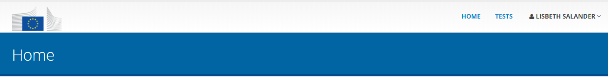
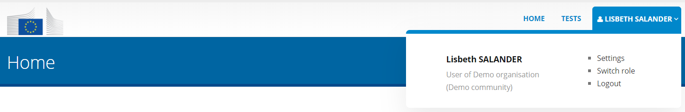
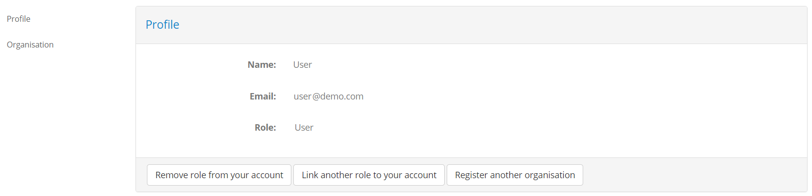
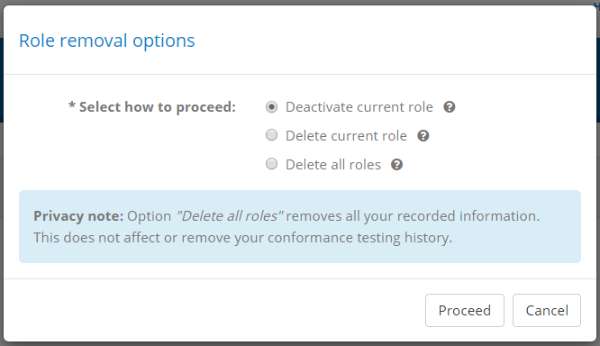
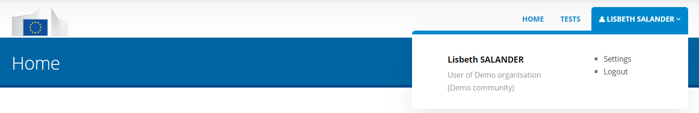
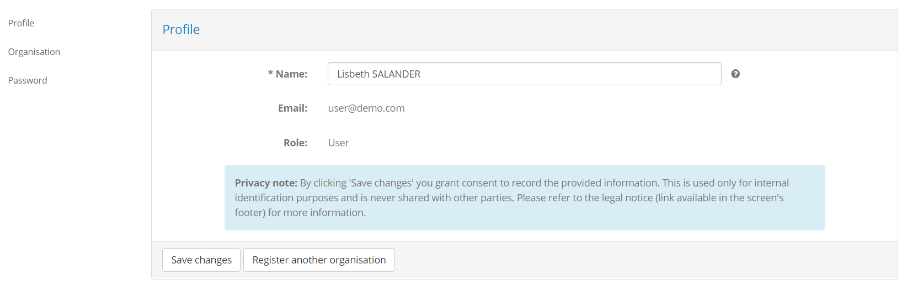
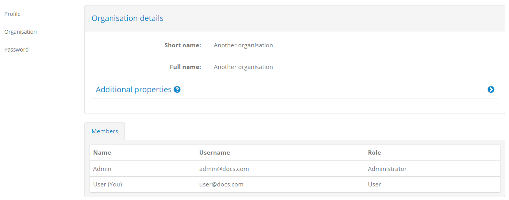
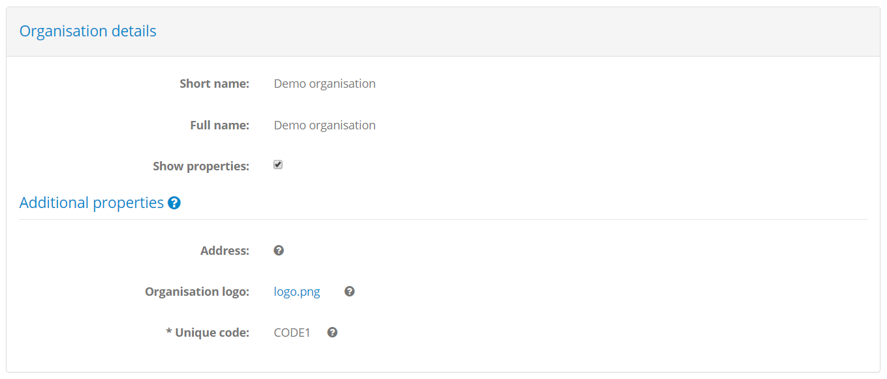

.. _manage_your_profile:

Manage your profile
===================

To manage your profile locate in the screen's header the control displaying your user's name.

Your profile management functions can be accessed through links that are displayed once you hover over your 
displayed user's name. These functions allow you to manage your own personal profile and also your organisation's
information. How you manage your personal profile depends largely on whether or not you are using EU Login to 
connect to the test bed, whereas the display and management of your organisation's information remains the same.

Use the following links depending on your case:

* :ref:`Profile management when using EU Login<manage_your_profile__eulogin>`.
* :ref:`Profile management when not using EU Login<manage_your_profile__noeulogin>`.
* :ref:`Organisation details<manage_your_profile__view_organisation_details>`.

.. note::
  When using EU Login you may have more than one user roles linked to your EU Login account. Each such role is related
  to different organisations, possibly within different communities. The profile management section of the test bed offers 
  the means of managing these roles but not your EU Login account.

  When not using EU Login you will have a distinct test bed user account per role that you use to log in with. In this case
  your profile management differs as you can also modify this test bed specific account.

.. _manage_your_profile__eulogin:

Case: EU Login
--------------

.. note::
  This section is relevant if you are **using EU Login** to connect to the test bed. Click :ref:`here<manage_your_profile__noeulogin>` 
  if this is not the case.

To manage your profile hover over your user's name in the screen's header to see the available options.

The popup information displays your name, current role, and three links:

* **Settings:** To :ref:`manage your profile settings<manage_your_profile__edit__eulogin>`.
* **Switch role:** To :ref:`switch your currently connected role<logout__eulogin>`.
* **Logout:** To :ref:`log out from the test bed<logout__eulogin>`.

To manage your profile select the **Settings** link. The screen that is displayed presents you your 
profile information, including your **name**, **email** and **role**. In the side menu you are also
presented links to :ref:`manage your profile<manage_your_profile__edit__eulogin>` (**Profile**, the current page) and 
:ref:`view your organisation<manage_your_profile__view_organisation_details>` (**Organisation**).

.. _manage_your_profile__edit__eulogin:

Edit your profile
~~~~~~~~~~~~~~~~~

The information you see here is taken from your EU Login account and cannot be edited within the test bed. The options you
have here relate to the test bed roles linked to your account, specifically:

* **Remove role from your account** is used to remove one or more roles from your EU Login account.
* **Link another role to your account** will transfer you to the screen where you can :ref:`link additional roles to your EU Login account<login__roles>`.
* **Register another organisation** will transfer you to the screen to :ref:`register another organisation<login__roles__register>` 
  in one of the test bed's communities (not necessarily the current one). Note that this button may not be available if 
  self-registration is disabled by your test bed's administrator.

Clicking **Remove role from your account** will present you with a popup in which you are prompted to select the role(s) to remove.

You have three options from which to choose from, each with increasing weight:

  * **Deactivate current role:** This will disconnect your EU Login account from the current role and effectively deactivate it. You 
    will be transferred to the :ref:`listing of your available roles<login__roles>` where you will no longer see the one you just removed.
    Note that this can once again be added to your account by :ref:`confirming again its assignment to you<login__roles__confirm>`.
  * **Delete current role:** This deactivates the current role (see above) but also deletes the inactive role. Only an administrator can
    redefine this role for you. 
  * **Delete all roles:** This deletes not only your current role (see above) but also all other roles you may have linked to your EU Login
    account (in other organisations or communities). This effectively wipes all your information from the test bed.

The delete options, either for the current role or all roles, provide you the ability to fully manage your own information in the test bed.
Removing your information, specifically the email, user ID and name associated to your EU Login account can thus be driven by you without
needing to involve other parties. Importantly, deactivating or deleting user roles never impacts the test session history or conformance status
of your organisation.

.. note::
  Each of these actions will also disconnect your current session. You will be prompted to confirm this before proceeding.

  **Updating your role:** Modification of your role is possible but this is reserved as an administrator-level feature.

.. _manage_your_profile__noeulogin:

Case: No EU Login
-----------------

.. note::
  This section is relevant if you are **not using EU Login** to connect to the test bed. Click :ref:`here<manage_your_profile__eulogin>` 
  if this is not the case.

To manage your profile hover over your user's name in the screen's header to see the available options.

The popup information displays your name, current role, and two links:

* **Settings:** To :ref:`manage your profile settings<manage_your_profile__edit>`.
* **Logout:** To :ref:`log out from the test bed<logout__noeulogin>`.

To manage your profile select the **Settings** link. The screen that is displayed presents you your 
profile information, including your **name**, **email** and **role**. In the side menu you are also
presented links to :ref:`manage your profile<manage_your_profile__edit>` (**Profile**, the current page), 
:ref:`view your organisation<manage_your_profile__view_organisation_details>` (**Organisation**) and 
:ref:`reset your password<manage_your_profile__change_your_password>` (**Password**).

.. _manage_your_profile__edit:

Edit your profile
~~~~~~~~~~~~~~~~~

Your profile allows you to edit your displayed name. To do this enter a new value and click the **Save changes** button.

You are also presented here with the option to **Register another organisation**. This is a shortcut allowing you to 
disconnect from your current session and register another organisation in one of the test bed's communities (also not
necessarily the current one). If you click this you will be presented with a confirmation message and then 
transferred to the :ref:`organisation self-registration page<login__create_account>`. Note that this button may not
be available if self-registration is disabled by your test bed's administrator. 

.. note::
    **Updating your role:** From the profile management screen you only have access to modify your name.
    Modification of your role is also possible but this is reserved as an administrator-level feature.

.. _manage_your_profile__change_your_password:

Change your password
~~~~~~~~~~~~~~~~~~~~

To change your password click on the **Password** link from the side menu. Doing this presents you with a form
to enter your current password and the new one. To ensure your new password is entered correctly you need to enter
it twice (in the **New password** and **Confirm password** fields).

.. figure:: ../screenshots/password.PNG
  :align: center

When ready click on the **Save** button to complete your password update.

.. _manage_your_profile__view_organisation_details:

View your organisation's details
--------------------------------

To view your organisation's information click the **Organisation** link from the side menu. This shows you 
the information relevant to your organisation, split in two sections:

* **Organisation details:** The name (short and full) of your organisation.
* **Members:** Your organisation's list of members (i.e. users). This includes yourself as well as any other 
  users configured by administrators. For each user the **name**, **email** and **role** are presented.

If your community administrator has defined additional properties for its organisations you will also see here a
**Show properties** checkbox to toggle the display of your organisation's additional information. 

If this is checked you will see a list of these additional properties along with their currently configured values.
Such properties can be simple texts, secret values (e.g. passwords) or files and, if supplied by your community 
administrator, will display a help tooltip to understand their meaning. Only administrators may update these properties
but you can view their configured values or download their linked files. Required properties are marked with an asterisk
and will need to be completed by an administrator before your organisation can engage in any tests.