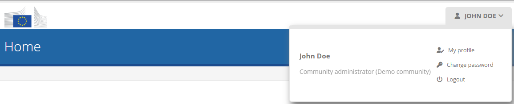
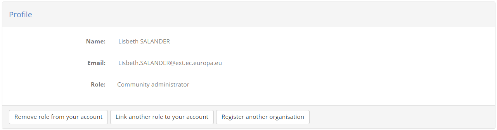
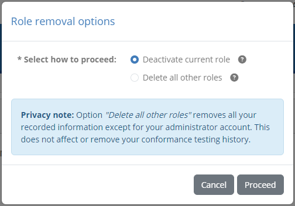
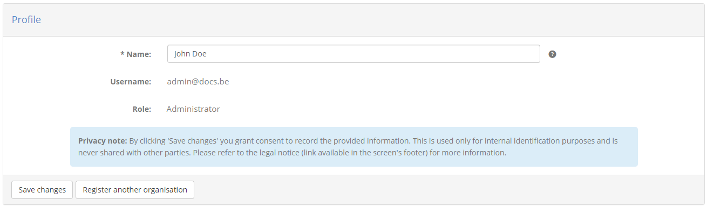

.. _manage_your_profile:

Manage your profile
===================

To manage your profile locate in the screen's header the control displaying your user's name. Hovering over this
will expand it to reveal information about your profile and the actions you may take.

How you manage your personal profile depends largely on whether or not you are using an external identity provider to connect to the Test Bed.
Use the following links depending on your case:

* :ref:`Profile management when using an identity provider<manage_your_profile__eulogin>`.
* :ref:`Profile management when not using an identity provider<manage_your_profile__noeulogin>`.

.. note::
  When using an external identity provider you may have more than one user roles linked to your account. Each such role is related
  to different organisations, possibly within different communities. The profile management section of the Test Bed offers
  the means of managing these roles but not your provider's account.

  When not using an identity provider you will have a distinct Test Bed user account per role that you use to log in with. In this case
  your profile management differs as you can also modify this Test Bed specific account.

.. _manage_your_profile__eulogin:

Case: Using an identity provider
--------------------------------

.. note::
  This section is relevant if you are **using an external identity provider** to connect to the Test Bed. Click :ref:`here<manage_your_profile__noeulogin>`
  if this is not the case.

To manage your profile hover over your user's name in the screen's header to see the available options.

The popup information displays your name, current role, and three links:

* **My profile:** To :ref:`manage your profile settings<manage_your_profile__edit__eulogin>`.
* **Switch role:** To :ref:`switch your currently connected role<logout__eulogin>`.
* **Logout:** To :ref:`log out from the Test Bed<logout__eulogin>`.

.. _manage_your_profile__edit__eulogin:

Edit your profile
~~~~~~~~~~~~~~~~~

To edit your profile click on the **My profile** link from the header's profile popup.

The information you see here is taken from your identity provider's account and cannot be edited within the Test Bed.

The options you have here relate to the Test Bed roles linked to your account, specifically:

* **Remove role from your account** is used to remove one or more roles from your account.
* **Link another role to your account** will transfer you to the screen where you can :ref:`link additional roles to your account<login__roles>`.
* **Register another organisation** will transfer you to the screen to :ref:`register another organisation<login__roles__register>`
  in one of the Test Bed's communities. Note that this button may not be available if
  self-registration is disabled for the Test Bed.

Clicking **Remove role from your account** will present you with a popup in which you are prompted to select the role(s) to remove.

You have three options from which to choose from, each with increasing weight:

  * **Deactivate current role:** This will disconnect the current role from your account and effectively deactivate it. You
    will be transferred to the :ref:`listing of your available roles<login__roles>` where you will no longer see the one you just removed.
    Note that this can once again be added to your account by :ref:`confirming again its assignment to you<login__roles__confirm>`.
  * **Delete all other roles:** This deactivates but also deletes all roles, other than your current Test Bed administrator role, that are linked to
    your account (in all organisations or communities). You Test Bed administrator account cannot be deleted as this is irreversible.

The delete option provides you the ability to better manage your own information in the Test Bed.
Removing your information, specifically the email, user ID and name associated to your account can be achieved through the Test Bed's user interface.
Importantly, deactivating or deleting user roles never impacts a user's test session history.

.. note::
  Each of these actions will also disconnect your current session. You will be prompted to confirm this before proceeding.

.. _manage_your_profile__noeulogin:

Case: No identity provider
--------------------------

.. note::
  This section is relevant if you are **not using an external identity provider** to connect to the Test Bed. Click :ref:`here<manage_your_profile__eulogin>`
  if this is not the case.

To manage your profile hover over your user's name in the screen's header to see the available options.

The popup information displays your name, current role, and three links:

* **My profile:** To :ref:`manage your profile settings<manage_your_profile__edit>`.
* **Change password:** To :ref:`change your password<manage_your_profile__change_your_password>`.
* **Logout:** To :ref:`log out from the Test Bed<logout__noeulogin>`.

.. _manage_your_profile__edit:

Edit your profile
~~~~~~~~~~~~~~~~~

To edit your profile click on the **My profile** link from the header's profile popup.

Doing so will take you to the profile editing screen where you are presented with your account's information.

You see here your **username** and **role**, as well as your **name** which is the only editable (and required) field.
To change your name enter a new value and click the **Save changes** button. You are also presented here with the option
to **Register another organisation**. This is a shortcut allowing you to disconnect from your current session and register
another organisation in one of the Test Bed's communities (also not necessarily the current one). If you click this you will
be presented with a confirmation message and then transferred to the :ref:`organisation self-registration page<login__create_account>`.
Note that this button may not be available if :ref:`self-registration is disabled<systemAdmin__config>`.

.. _manage_your_profile__change_your_password:

Change your password
~~~~~~~~~~~~~~~~~~~~

To change your password click on the **Change password** link from the header's profile popup.

Doing this presents you with a form to enter your current password and the new one.

.. figure:: ../screenshots/password.PNG
  :align: center

The password you provide must meet minimum expected complexity requirements. Specifically:

* It must include at least one lowercase letter, uppercase letter, digit and symbol.
* It must be at least 8 characters long.

When ready click on the **Save** button to complete your password update.