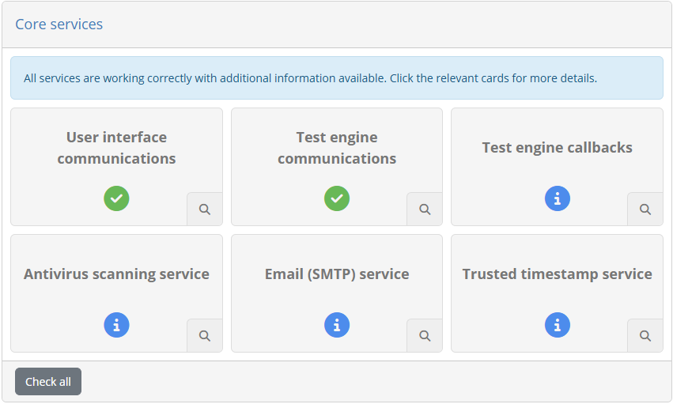
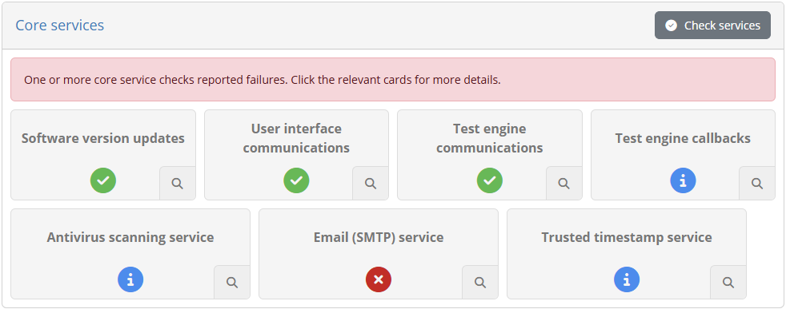
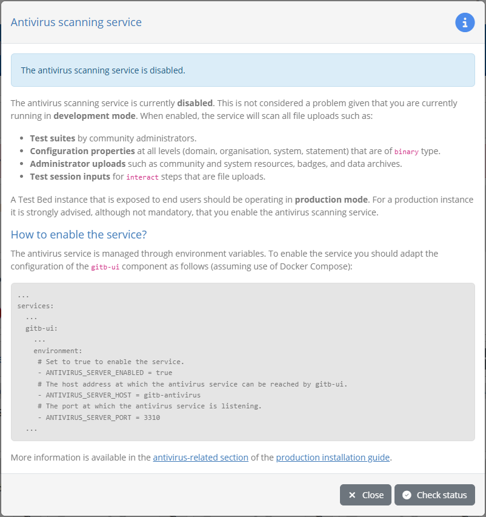
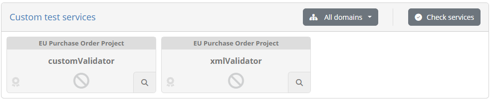
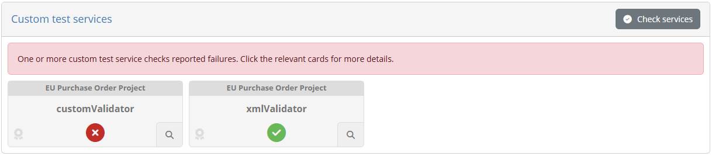
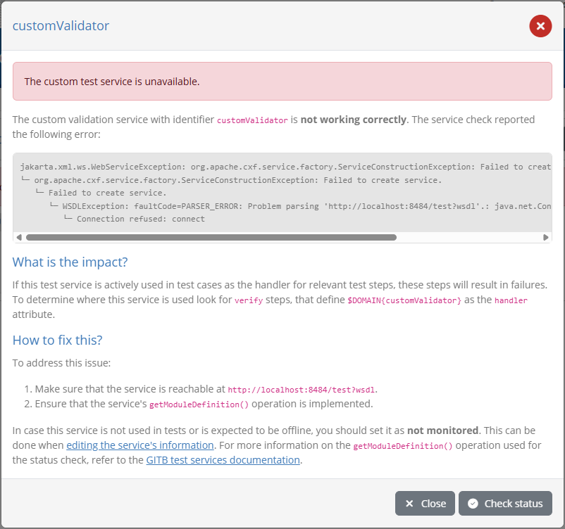

.. _serviceHealth:

Service health
==============

The Test Bed's functioning involves the configuration of internal **core services** that need to be functioning correctly for users
to test without issues. Such services, and depending on the Test Bed's setup, may also become important
in ensuring the overall environment's security and stability.

Besides core services, the Test Bed also provides the possibility to extend its built-in test capabilities with :ref:`custom test services <domains__domain__service_list>`
used during test execution. Similarly, if these are unavailable, test cases that rely upon them will result in unexpected
failures.

The **service health dashboard** provides a single place where you can get an overview of core services and custom extensions,
test them, and investigate possible issues. To access the dashboard select the **Service health** menu entry.

The dashboard is split in two panels, displaying the **core services** at the top and the **custom test services** below.

.. _serviceHealth_core:

Core services
-------------

The status of **core services** is displayed using a **card layout**, with each card representing a specific configuration,
service or attention point (subsequently referred to as "service" to simplify).

Each card displays a **title** and **status icon** summarising the specific service it covers and its health status.
The possible status icons and their meaning are as follows:

* **Success**, for a service that is working correctly.
* **Information**, for a service that seems to be working correctly but is interesting to review.
* **Warning**, for a service that is not working as expected but that is not blocking operations.
* **Error**, for a service that is not working correctly and that is blocking operations.

The aggregate cards' status is also displayed as an **overall status** at the top of the dashboard.

Generally speaking, you should aim for all services being marked with a status of **success** or **information**. It is normal to have
services with information messages, given that certain configuration depends on the specific circumstances of the given
Test Bed instance, which the administrator should evaluate. Whenever there is a **warning**, and in particular an **error**, 
you are strongly advised to take action given that the Test Bed's configuration needs attention.

At the top of the panel you are provided with a **Check services** control to launch the internal diagnostic checks
for all services, and report results as they become available. Note that upon access to the dashboard all core services
will be automatically checked to present the latest status.

All service cards can be clicked to :ref:`show extended details <serviceHealth_details>` on the current configuration, 
returned errors and the steps to take to address them.

.. note::
    **Post installation health check:** Visiting the service health dashboard should be the first action following a
    new Test Bed installation, be it `for development <https://www.itb.ec.europa.eu/docs/guides/latest/installingTheTestBed/>`__
    or `for production <https://www.itb.ec.europa.eu/docs/guides/latest/installingTheTestBedProduction/>`__.

.. _serviceHealth_overview:

Overview of monitored services
++++++++++++++++++++++++++++++

The core services that are monitored by the dashboard are summarised in the following sections.

.. _serviceHealth_overview_software:

Software version updates
~~~~~~~~~~~~~~~~~~~~~~~~

This check verifies whether there are any updates regarding the Test Bed's software. These can be notifications for new
releases, or more importantly, alerts for known security issues affecting the release you are currently using.

An information message here indicates that the software version check is disabled or that a new release is available.
Warnings can be reported either because the software check is enabled but could not complete successfully, or because
the check was made and known issues were reported. In the latter case, a description of the issues is listed along
with any further considerations to take into account. Resolving reported issues is always done by upgrading to the
mentioned release.

.. _serviceHealth_overview_ui:

User interface communications
~~~~~~~~~~~~~~~~~~~~~~~~~~~~~

This check ensures that there is nothing impeding communication between the Test Bed's backend and its user interface
running in the user's browser. An issue here is in almost all cases blocking, as users will be unable to receive updates from the
test engine regarding ongoing tests.

Problems here could be due to configuration issues in the Test Bed's installation that prevent communications, but also due to
intermediate networking components that are configured to block specific protocols unless whitelisted.

.. _serviceHealth_overview_engine:

Test engine communications
~~~~~~~~~~~~~~~~~~~~~~~~~~

This ensures that the internal Test Bed components, notably the interface component and the internal test engine, can correctly
communicate with each other in a bidirectional manner. Such bidirectional communications are needed to allow the launching of tests
but also the communication of feedback from the test engine to users.

Problems here are typically due to misconfigurations of component naming, port mappings, and access routes, that could occur when
making customised production deployments or deviating from the `standard installation instructions <https://www.itb.ec.europa.eu/docs/guides/latest/installingTheTestBedProduction/>`__.

.. _serviceHealth_overview_callbacks:

Test engine callbacks
~~~~~~~~~~~~~~~~~~~~~

This ensures that there is nothing preventing the test engine's callback endpoints from being contacted from systems under test and
supporting test services. Such callbacks are made when components external to the core test engine are expected to directly interact
with it.

Problems here come from a general misconfiguration of access to the Test Bed's test engine. Note that whether this is fully correctly
configured cannot be established automatically as this depends on the testing needs and setup of each Test Bed instance.

.. _serviceHealth_overview_antivirus:

Antivirus service
~~~~~~~~~~~~~~~~~

This checks whether an antivirus service is enabled, and if so, whether it is functioning correctly. When an `antivirus service is configured <https://www.itb.ec.europa.eu/docs/guides/latest/installingTheTestBedProduction/index.html#antivirus-scanning>`__,
which is strongly advised for production instances, all externally provided files are scanned before being accepted by the Test Bed.

Problems here are typically due to the configured service being offline, or to the service simply not being configured for a production
Test Bed instance.

.. _serviceHealth_overview_email:

Email (SMTP) service
~~~~~~~~~~~~~~~~~~~~

This check whether an :ref:`email service is enabled <systemAdmin__config>`, and if so, whether it is functioning correctly. When such
a service is enabled, several notification options are made possible as well as the possibility to :ref:`contact the support team <contact_support>`.

Problems here are typically due to the configured service being non-reachable, either due to misconfiguration or intermediate networking
components that are preventing access.

.. _serviceHealth_overview_tsa:

Trusted timestamp service
~~~~~~~~~~~~~~~~~~~~~~~~~

This check whether a `timestamp service <https://www.itb.ec.europa.eu/docs/guides/latest/installingTheTestBedProduction/index.html#conformance-certificate-timestamps>`__
is configured for use when :ref:`adding signatures to PDF reports <community__report_settings>`.
When enabled, this will augment digital signatures by adding a verifiable timestamp attesting to the reports' generation time.

Problems here are typically due to the configured service being non-reachable, either due to misconfiguration or network access
restrictions to public services.

.. _serviceHealth_details:

Service health details
++++++++++++++++++++++

Each of the presented cards can be clicked to present extended details on the service in question. Doing so opens up a popup with
the service's overall status as well as further details.

In all cases the information displayed will reflect the configuration values detected for the current Test Bed instance. You are 
presented also with clear information on the service's impacts, and in case of **error** the information you need to know to evaluate
and take action. Specifically you will be presented with sections on:

* The **specific impact on operations**, listing behaviour, screens and functionality affected.
* The **steps to resolve the issue**, including troubleshooting guidance and links to further documentation.

Besides consulting the information here, clicking on **Check status** will test the service, whereas **Close** will
hide the popup and return to the dashboard.

.. _serviceHealth_custom:

Custom test services
--------------------

Regarding configured :ref:`custom test services <domains__domain__service_list>`, the display similarly uses a **card layout**,
with each card representing a specific test service.

Each card shows the relevant :ref:`domain <domains__domain_details>`, the **name** of the service, an icon indicating the **service's type**
(validation, messaging or processing), and a **status icon** for its health status. The possible status icons and their meaning are as follows:

* **Success**, for a service that is working correctly.
* **Error**, for a service that is not working correctly and that would cause tests to fail.

The panel provides a **Check services** control to test all services, and also a multiple selection filter on the services'
**domain** to filter the presented cards. Once the services have been tested, the aggregate status is also displayed as
an **overall status** at the top of the panel.

All service cards can be clicked to :ref:`show extended details <serviceHealth_details>` on the current configuration,
returned errors and the steps to take to address them. From such cards you can also test services individually.

Not all your configured test services need to be included for health monitoring in the health dashboard. You decide which
services will be included as part of a :ref:`test service's configuration <domains__domain_edit_service>`. You may choose
to skip services that are not currently in use, or that are already being monitored through other means.

.. _serviceHealth_details_custom:

Service health details
++++++++++++++++++++++

Each of the presented cards can be clicked to present extended details on the service in question. Doing so opens up a popup with
the service's overall status as well as further details.

In all cases the information displayed will reflect the service's configuration. You are presented also with clear
information on the service's impacts, and in case of **error** the information you need to know to evaluate
and take action. Specifically you will be presented with sections on:

* The **specific impact on tests**, providing information on the affected tests.
* The **steps to resolve the issue**, including troubleshooting guidance and links to further documentation.

The **Check status** button in the footer allows you to test the service's status. The **Close** button closes the
popup to return to the dashboard.