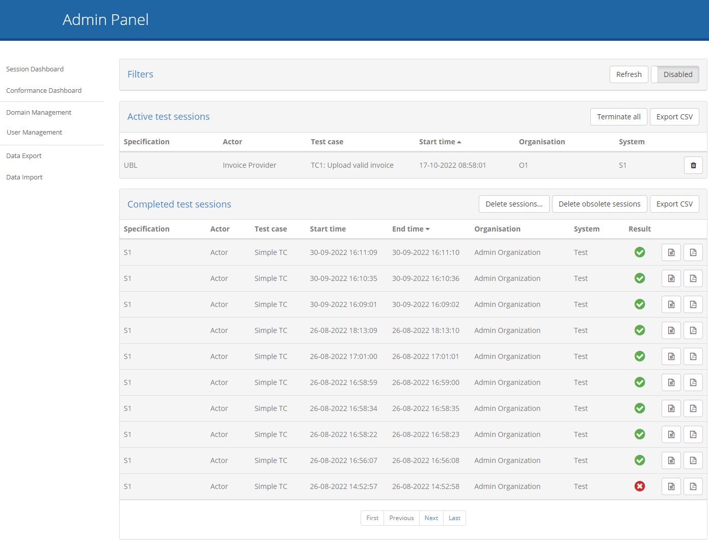
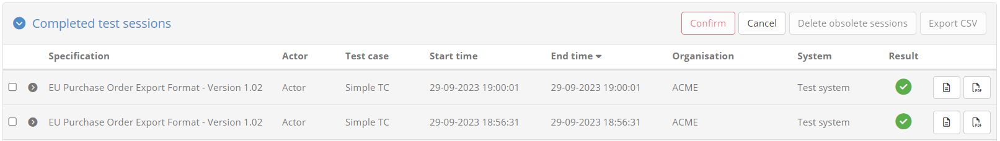
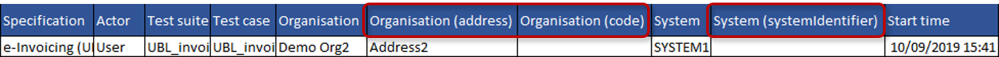

.. _monitor_test_sessions:

Monitor test sessions
=====================

Monitoring all current and past test sessions for the test bed is possible through the **Session Dashboard** screen.
To access this click on the **ADMIN** link from the screen's header.

.. figure:: ../screenshots/header_admin.PNG
  :align: center

Doing so presents you with a left side menu containing links to administrative functions, of which you need to click 
the **Session Dashboard** link. Note that this screen is also the default selection once you click the 
header's **ADMIN** link.

The screen is split in four sections:

* A set of **search filters**, initially disabled, to help locate specific test sessions (see :ref:`session_dashboard__filters`).
* The list of currently **active sessions** (see :ref:`session_dashboard__active`).
* The list of **completed sessions** (see :ref:`session_dashboard__completed`).
* The setting to **automatically terminate idle sessions** (see :ref:`session_dashboard__terminate`).

.. _session_dashboard__active:

Active test sessions
--------------------

The currently active sessions are those that are pending completion. These could be sessions actively being used by the test bed's
users or ones that due to technical issues have been blocked.

.. figure:: ../screenshots/admin_session_dashboard_active.PNG
  :align: center

Each session is presented on a separate table row, with the following information displayed per session:

* The **specification** and **actor** (defined as the test case's SUT).
* The relevant **test case**.
* The session **start time**.
* The **organisation** and **system** this session is executed for.

The information displayed in the table is sorted using the sessions’ **start time** in ascending manner (i.e. the oldest sessions are presented first).
Sorting can be adapted by clicking on each column’s header to sort by it in ascending manner. The currently active sort column and type are displayed
using an arrow icon next to the relevant column’s title.

The set of currently displayed active sessions can be exported in CSV format by clicking the **Export CSV** button in the table header
(see :ref:`monitor_test_sessions__export`). In addition, the **Terminate all** button can be used to terminate, upon confirmation, all currently active test 
sessions in the community. Clicking on the header itself, allows you to **collapse** or **expand** its display. Finally, each session's row offers controls to:

* View its **test step details**, by clicking on the session's row (see :ref:`session_dashboard__steps`).
* Forcibly **terminate**, it by clicking the cross icon on the relevant session's row under the **Operation** column.

.. _session_dashboard__completed:

Completed test sessions
-----------------------

The history of all completed test sessions is presented in the **Completed test sessions** table.

.. figure:: ../screenshots/admin_session_dashboard_completed.PNG
  :align: center

Each session is presented in a separate row that displays the following information:

* The session's relevant **specification** and **actor** (defined as the test case's SUT).
* Its related **test case**.
* Its **start** and **end time**.
* The **organisation** and **system** this session was executed for.
* Its **result**.

In this case the display of sessions uses paging, providing controls to go to the **first**, **previous**, **next** and **last** page (as applicable) and the rows are by
default sorted based on the session **end time**, in a descending manner (i.e. latest sessions appear first). Sorting can be adapted by clicking on each column's header to 
sort by it in ascending manner. The currently active sort column and type are displayed using an arrow icon next to the relevant column's title.

Viewing a test session's further details and steps is done by clicking on the session's row, similar to the case of the :ref:`active test sessions<session_dashboard__active>`. See :ref:`session_dashboard__steps` for further
information on the details displayed. Moreover, each row provides two **export** buttons that allows you to download the session's **test case report** in XML and PDF format.

The following is an example of such a report in **XML format**, the XML content being defined by the `GITB Test Reporting Language (GITB TRL) <https://www.itb.ec.europa.eu/docs/tdl/latest/introduction/index.html#specification-links>`_:

.. literalinclude:: ../testHistory/resources/test_case_report.xml
   :language: xml

Selecting the second export option produces the report in **PDF format**:

.. figure:: ../screenshots/test_case_report.png
  :align: center

Certain test results may appear greyed out in case they are to be considered as obsolete. These are tests for which linked information has significantly changed since their
execution (e.g. the related organisation having been deleted). Such obsolete results are maintained by default but can be purged at any time by clicking the 
**Delete obsolete results** button.

Specific test sessions can also be selectively deleted by means of the **Delete sessions...** button. Clicking this will disable other buttons and display a checkbox
on each row in the table. To delete one or more test sessions you need to check their checkbox and click on the **Confirm** button. Once in selection mode you may also
click on **Cancel** to abort the deletion and restore the normal table display.

Finally, the presented completed sessions can be exported in CSV format by clicking the **Export CSV** button in the table header (see :ref:`monitor_test_sessions__export`).

.. note::
    **Deleting obsolete tests from the session dashboard:** As test bed administrator if you select to delete the obsolete tests you will be doing so for the entire test bed.
    If you want to target a specific community you could login as a community administrator to do the purge. Alternatively, at the level of a system you can always use
    the relevant option from the test session history display (see :ref:`view_your_test_history`).

.. _session_dashboard__filters:

Apply search filters
--------------------

The session dashboard offers a set of filters that can be used to find test sessions of interest. Filters apply both to the displayed active and completed test sessions.

.. figure:: ../screenshots/admin_session_dashboard_filters_off.PNG
  :align: center

Filtering is by default switched off as indicated by the toggle button that is set as **Disabled**. Clicking this switches it to **Enabled** resulting in the filter controls being displayed
and filtering being switched on.

.. figure:: ../screenshots/admin_session_dashboard_filters_on_ta.PNG
  :align: center

The controls that can be used for filtering are:

* The sessions' **domain**, **specification**, **actor**, **test suite** and **test case**.
* The relevant **community**, **organisation** and **system**.
* The **result**.
* The **start** and **end time**.
* The **session identifier**.
* Specific values for **custom organisation and system properties** (if such properties are defined).

Most filter controls are defined as multiple selection choices. Multiple selected values across these controls are applied as follows:

* Within a specific filter control using "OR" logic (e.g. selecting multiple specifications).
* Across filter controls using "AND" logic (e.g. selecting a specification and a test case).

Note additionally that selecting dependent values serves to limit the filter options that are presented. For example if a given specification
is selected, the test suites and test cases available for filtering will be limited to that specification to already exclude impossible combinations.

The start and end time controls are date pickers that allow selection of ranges of dates for both the start and end of the sessions. The session
identifier on the other hand is a text field that allows the lookup of a specific session. Finally, regarding organisation and system properties, these
can be selected once a specific community has been selected. Once enabled, each property type presents
an **Add** button that, once clicked, will display a list of the available properties, a field or selection list to provide the filter value, and
controls to confirm or cancel the filter. Multiple property filters can be added with the following semantics:

* Values provided for the same property are applied using "OR" logic.
* Values provided for different properties are applied using "AND" logic.

The presented sessions are automatically updated whenever your filter options are modified, or when the filters are removed altogether by clicking the
**Enabled** toggle button. The filter panel may also be **collapsed and expanded** by clicking the panel's title while maintaining the defined filters.
The **Refresh** button is used to refresh the display of results based on the current filtering. Finally, note that applying no filtering is the default
case when you first visit this screen.

.. _session_dashboard__steps:

View a test session's steps
---------------------------

Each row from the lists of presented test sessions may also be clicked to view its detailed steps. Doing so expands the row to present
a diagram that is identical to the one presented during the live test execution (see :ref:`execute_tests_interactive`).

.. figure:: ../screenshots/test_history_test_result.PNG
  :align: center

Once one or more test session rows have been expanded the relevant table's header will also include a **Collapse all** button that can be clicked
to collapse all expanded rows.

The diagram's header includes additional information on the test session, and specifically its **test suite**, **test case** and **session identifier**, the latter 
of which can be clicked to **copy it to the clipboard**. Furthermore, clicking elsewhere on the header of the diagram display will
collapse (or expand) the diagram, which could be useful if you want to quickly view other information on the screen.

Above the diagram display you are presented with additional buttons linked to the test session. The purpose of these are as follows:

* **View log** opens up the test session log for display, displaying its contents similarly to when the :ref:`session is executing<execute_tests__step3__view_log>`.
* **View organisation** takes you to view the :ref:`details of the organisation<community__manage_organisation>` linked to the test session.
* **View system** takes you to view the :ref:`details of the system<manage_your_systems__edit>` this test session relates to.
* **View conformance statement** takes you to the :ref:`conformance statement<manage_your_conformance_statements__view_a_conformance_statements_details>` for which this session was executed.

In the case of an active test session you are also provided with a button to **refresh** its display. This allows you to track the progress of a
specific test session without needing to make a full refresh of the displayed results. Clicking this button will refresh only the relevant
test session and reflect changes on its diagram. Note that it is possible that upon refresh, the test session has in the meanwhile completed,
in which case a relevant information popup will inform you accordingly.

Clicking on the session row will once again collapse the display. Note that once one or more session
details are expanded the table's header will display a **Collapse all** button that can be clicked to collapse all details.

.. _session_dashboard__steps_details:

View test step details
~~~~~~~~~~~~~~~~~~~~~~

Clicking on a step's document icon triggers a popup that shows the step's different information elements that can be viewed inline or opened in
a separate popup editor. In the case of validation steps, this is extended to also provide the detailed validation results as illustrated in the
following example for a validation failure.

.. figure:: ../screenshots/test_execution_execute_step_failure.PNG
  :align: center
  :scale: 50%

In the test step result popup you are presented with the **result** and completion **time** as the step summary. In the sections that follow you 
can inspect the output information from the step, presented either inline (for short values), as a file you can download, or through a further popup editor. In the latter case
this is triggered by clicking the **View** button. Clicking to open this, displays its content which, in the case of validation steps, 
is also highlighted for the recorded validation messages.

.. figure:: ../screenshots/test_execution_execute_step_failure_code.PNG
  :align: center
  :scale: 50%

The editor popup allows you to copy a specific part of the content or, by means of the **Copy to clipboard** button, copy its entire contents. The
**Close** button closes this popup and returns you to the test step result display. Note that clicking on a specific error will 
open the validated content and automatically focus on the selected error.

An alternative to viewing the content in this way is to click the **Download** button which will download the content as a file. The test bed will determine
the most appropriate type for the content and name the downloaded file accordingly (if possible). In the case of simple texts that are presented inline, you
are not presented with the download and view buttons, but rather with a **Copy to clipboard** button that allows you to copy the presented value.

.. figure:: ../screenshots/test_execution_execute_step_clipboard.PNG
  :align: center

.. note::
    **Viewing binary output:** The **Download as file** option is the best way to inspect information that is binary (e.g. an image). The test bed will nonetheless
    always present the **Open in editor** option but given that the content is then assumed to be text, this will likely not be useful.

.. _session_dashboard__steps_report:

Export test step report
~~~~~~~~~~~~~~~~~~~~~~~

The results of the test step can also be exported as a test step report in PDF and XML formats. This is made available through the **Export as PDF** and **Export as XML** button that trigger the 
generation and download of the step report in the requested format. The following example represents such a report in PDF.

.. figure:: ../screenshots/test_execution_test_step_report.PNG
  :align: center

This PDF report includes:

* The **test step result overview**, including the **result**, **date** and, in case of a validation step, the total number of validation findings
  (classified as **errors**, **warnings** and **messages**).
* The **report details**, included in case of a validation step to list the details of the validation report's findings.

When selecting to **download the report as XML**, you receive similar information but represented in XML for simpler machine-processing. 
The structure of the report is defined by the `GITB Test Reporting Language (GITB TRL) <https://www.itb.ec.europa.eu/docs/tdl/latest/introduction/index.html#specification-links>`_, 
with the following being a simple sample:

.. literalinclude:: ../executeTests/resources/test_step_report.xml
   :language: xml

.. _monitor_test_sessions__export:

Export all test sessions
------------------------

Both lists of active and completed test sessions can be exported in CSV format. This is done by clicking the **Export CSV** button
from the respective table's header.

.. figure:: ../screenshots/admin_session_dashboard_active.PNG
  :align: center

Doing so will generate a CSV file taking into account the currently applied filtering settings. Note that such exports can also
include custom properties for communities applicable to organisations or systems (see :ref:`community__properties`) if these
have been defined by you or community administrators. To include such custom properties:

* A **single community** must be selected from the filtering criteria (otherwise custom properties are skipped).
* Properties must be **Simple** text values (i.e. not a hidden value or a file).
* Properties must be configured as **Included in exports**.

All such properties are included in the export as columns following the "Organisation" or "System", depending on whether
they are organisation of system level properties. Their columns are named using a prefix of "Organisation" or "System" followed
by the property's key value included in parentheses.

.. note::
  **Exporting custom properties from multiple communities:** It is not possible to produce a single export for multiple communities
  including custom properties. The reason for this is that the resulting CSV file needs to have a single structure in terms of
  columns. The best workaround is to make individual exports per community selecting one at a time from the filtering criteria.

.. _session_dashboard__terminate:

Automatically terminate idle sessions
-------------------------------------

In the bottom of the Session Dashboard you are presented with the control to terminate idle sessions. These are sessions that have started but for which
no update has been made for a specific time threshold. Through this control the test bed will automatically scan the currently active sessions and forcibly
terminate those that have exceeded the maximum. The purpose of this is to automate clean-up operations allowing the test bed and connected test services to
free up any resources that are being used by the sessions in question.

.. figure:: ../screenshots/admin_session_dashboard_terminate.png
  :align: center

To enable this click the **Disabled** toggle button to switch it to **Enabled**. Doing so you will need to provide the maximum allowed idle time (in seconds).

.. figure:: ../screenshots/admin_session_dashboard_terminate_on.png
  :align: center

Enter the value in seconds and click on **Apply** to persist your change. Switching the toggle button to **Disabled** removes the setting.