.. _monitor_test_sessions:

Monitor test sessions
=====================

Monitoring all current and past test sessions for the test bed is possible through the **Session Dashboard** screen.
To access this click on the **ADMIN** link from the screen's header.

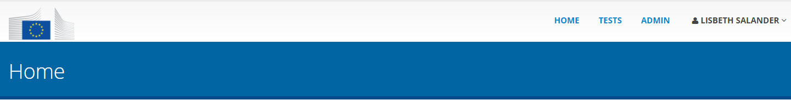

Doing so presents you with a left side menu containing links to administrative functions, of which you need to click 
the **Session Dashboard** link. Note that this screen is also the default selection once you click the 
header's **ADMIN** link.

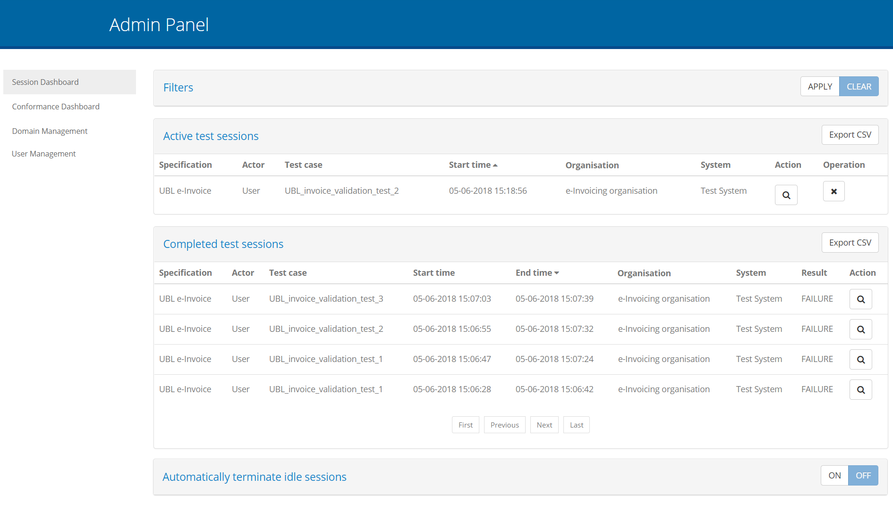

The screen is split in four sections:

* A set of **search filters**, initially disabled, to help locate specific test sessions (see :ref:`session_dashboard__filters`).
* The list of currently **active sessions** (see :ref:`session_dashboard__active`).
* The list of **completed sessions** (see :ref:`session_dashboard__completed`).
* The setting to **automatically terminate idle sessions** (see :ref:`session_dashboard__terminate`).

.. _session_dashboard__active:

Active test sessions
--------------------

The currently active sessions are those that are pending completion. These could be sessions actively being used by the test bed's
users or ones that due to technical issues have been blocked.

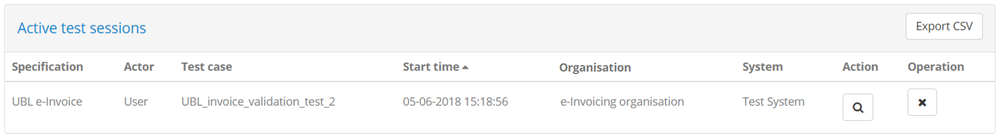

Each session is presented on a separate table row, with the following information displayed per session:

* The **specification** and **actor** (defined as the test case's SUT).
* The relevant **test case**.
* The session **start time**.
* The **organisation** and **system** this session is executed for.

In addition, each session's row can be clicked to open a popup with additional information (the session's **domain**, **test suite** and **session ID**).

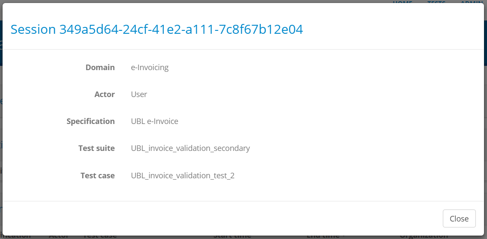

The information displayed in the table is sorted using the sessions' start time in ascending manner (i.e. the oldest sessions are presented first). Sorting
can be adapted by clicking on each column's header to sort by it in ascending manner. The currently active sort column and type are displayed using
an arrow icon next to the relevant column's title.

The set of currently displayed active sessions can be exported in CSV format by clicking the **Export CSV** button in the table header. Finally, each session's 
row offers controls to:

* Forcibly **terminate** it, by clicking the cross icon on the relevant session's row under the **Operation** column.
* View its **test step details**, by clicking the row's magnifying glass icon under the **Action** column (see :ref:`session_dashboard__steps`).

.. _session_dashboard__completed:

Completed test sessions
-----------------------

The history of all completed test sessions is presented in the **Completed test sessions** table.

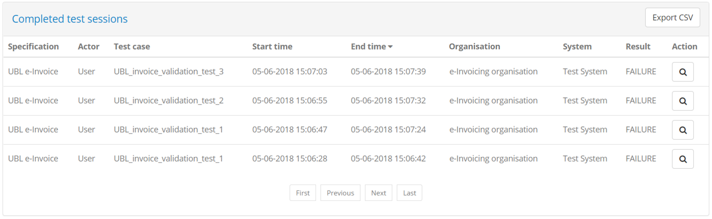

Each session is presented in a separate row that displays the following information:

* The session's relevant **specification** and **actor** (defined as the test case's SUT).
* Its related **test case**.
* Its **start** and **end time**.
* The **organisation** and **system** this session was executed for.
* Its **result**.

Similar to the active sessions' display, a row from this table can be clicked to display further information on the test session (its **domain**, **test suite** and **session ID**).

In this case the display of sessions uses paging, providing controls to go to the **first**, **previous**, **next** and **last** page (as applicable) and the rows are by
default sorted based on the session end time, in a descending manner (i.e. latest sessions appear first). Sorting can be adapted by clicking on each column's header to 
sort by it in ascending manner. The currently active sort column and type are displayed using an arrow icon next to the relevant column's title.

Certain test results may appear greyed out in case they are to be considered as obsolete. These are tests for which linked information has significantly changed since their
execution (e.g. the related organisation having been deleted). Such obsolete results are maintained by default but can be purged at any time by clicking the 
**Delete obsolete results** button.

The presented completed sessions can be exported in CSV format by clicking the **Export CSV** button in the table header. In addition, the **detailed tests steps** for a
session can be displayed by clicking the row's magnifying glass icon under the **Action** column (see :ref:`session_dashboard__steps`).

.. note::
    **Deleting obsolete tests from the session dashboard:** As test bed administrator if you select to delete the obsolete tests you will be doing so for the entire test bed.
    If you want to target a specific community you could login as a community administrator to do the purge. Alternatively, at the level of a system you can always use 
    the relevant option from the test session history display (see :ref:`view_your_test_history`).

.. _session_dashboard__filters:

Apply search filters
--------------------

The session dashboard offers a set of filters that can be used to find test sessions of interest. Filters apply both to the displayed active and completed test sessions.

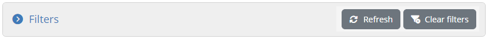

Filtering is by default switched off as indicated by the **CLEAR** button that is highlighted in blue as active. By clicking the **APPLY** button the filter controls are displayed
and filtering is switched on.

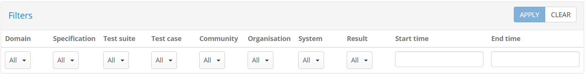

The controls that can be used for filtering are:

* The sessions' **domain**, **specification**, **test suite** and **test case**.
* The relevant **community**, **organisation** and **system**.
* The **result**.
* The **start** and **end time**.

All filter controls with the exception of the start and end time are multiple selection choices. The start and end time controls are
date pickers that allow selection of ranges of dates for both the start and end of the sessions. Multiple selected values across these
controls are applied as follows:

* Within a specific filter control using "OR" logic (e.g. selecting multiple specifications).
* Across filter controls using "AND" logic (e.g. selecting a specification and a test case).

Note additionally that selecting dependent values serves to limit the filter options that are presented. For example if a given specification
is selected, the test suites and test cases available for filtering will be limited to that specification to already exclude impossible combinations.

The presented sessions are automatically updated whenever your filter options are modified, or when the filters are removed altogether by clicking the 
**CLEAR** button. Note that applying no filtering is also the default case when you first visit this screen.

.. _session_dashboard__steps:

View a test session's steps
---------------------------

Each row from the lists of presented test sessions may also be clicked to view its detailed steps. Doing so presents
a view over the test session's steps that is similar to the live test execution diagram displayed while the test session is
active (see :ref:`execute_tests__step3`).

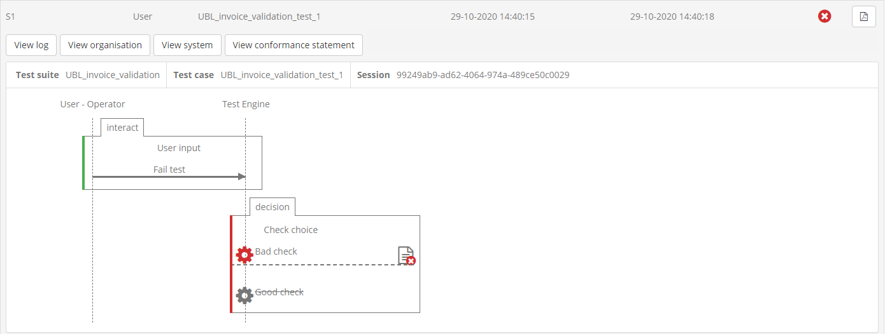

In this screen each test case step is displayed using the same colour coding applied during test execution: 

* **Green** indicates successfully completed steps.
* **Red** indicates failed steps.
* **Grey** indicates steps that were skipped.

In terms of provided controls, a document icon is presented on steps that produced a report that can be clicked to review
its details (see :ref:`view_your_test_history__test_steps__details`). The provided **Back** button serves to return you to the session dashboard.

.. _session_dashboard__steps_details:

View test step details
~~~~~~~~~~~~~~~~~~~~~~

Clicking on a step's document icon triggers a popup that shows the step's different information elements that can be viewed inline or opened in
a separate popup editor. In the case of validation steps, this is extended to also provide the detailed validation results as illustrated in the
following example for a validation failure.

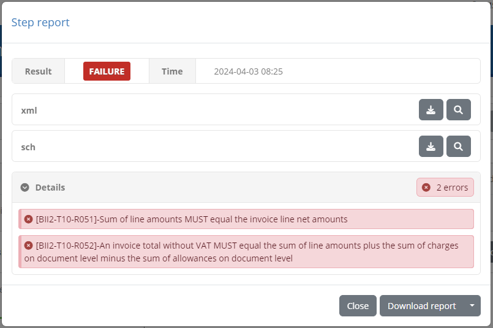

In the test step result popup you are presented with the **result** and completion **time** as the step summary. In the sections that follow you 
can inspect the output information from the step, presented either inline (for short values), as a file you can download, or through a further popup editor. In the latter case
this is triggered by clicking the **Open in editor** link. Clicking to open this, displays its content which, in the case of validation steps, 
is also highlighted for the recorded validation messages.

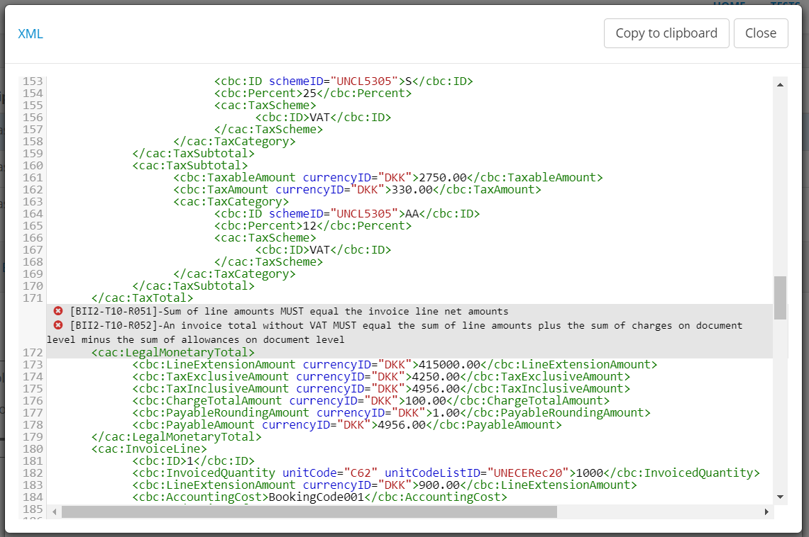

The editor popup allows you to copy a specific part of the content or, by means of the **Copy to clipboard** button, copy its entire contents. The
**Close** button closes this popup and returns you to the test step result display. Note that clicking on a specific error will 
open the validated content and automatically focus on the selected error.

An alternative to viewing the content in this way is to click the **Download as file** link which will download the content as a file. The test bed will determine
the most appropriate type for the content and name the downloaded file accordingly (if possible).

.. note::
    **Viewing binary output:** The **Download as file** option is the best way to inspect information that is binary (e.g. an image). The test bed will nonetheless
    always present the **Open in editor** option but given that the content is then assumed to be text, this will likely not be useful.

.. _session_dashboard__steps_report:

Export test step report
~~~~~~~~~~~~~~~~~~~~~~~

The results of the test step can also be exported as a test step report (in PDF format). This is made available through the **Export** button that triggers the 
generation and download of the step report. 

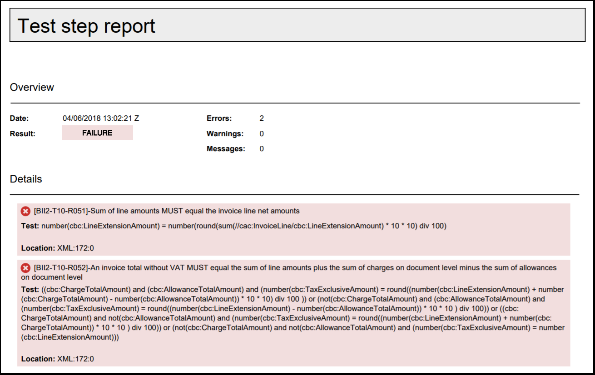

This report includes:

* The **test step result overview**, including the **result**, **date** and, in case of a validation step, the total number of validation findings
  (classified as **errors**, **warnings** and **messages**).
* The **report details**, included in case of a validation step to list the details of the validation report's findings.
* The step's **context** information, to list its output values and returned content.

.. note::
    **Test step report size:** When exporting a test step report the context information is always included to provide the full information pertinent
    to its result. In case the context information returned by the step includes large file contents, these would be included resulting in a 
    potentially very large export.

.. _session_dashboard__terminate:

Automatically terminate idle sessions
-------------------------------------

In the bottom of the Session Dashboard you are presented with the control to terminate idle sessions. These are sessions that have started but for which
no update has been made for a specific time threshold. Through this control the test bed will automatically scan the currently active sessions and forcibly
terminate those that have exceeded the maximum. The purpose of this is to automate clean-up operations allowing the test bed and connected test services to 
free up any resources that are being used by the sessions in question.

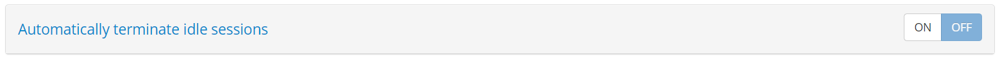

To enable this toggle the button to **ON** at which point you will need to provide the maximum allowed idle time (in seconds).

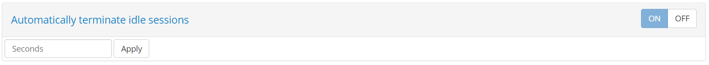

Enter the value in seconds and click on **Apply** to persist your change. Switching the setting to **OFF** removes the setting.