.. _systemAdmin:

Manage system configuration
===========================

Most configuration in the test bed is linked to specific :ref:`communities<introduction__glossary__community>` and :ref:`domains<introduction__glossary__domain>`,
and is managed respectively from the :ref:`community management<community>` and :ref:`domain management<domains>` screens.
Everything that is not covered by these screens is managed through the **System administration** screen that allows you, as
test bed administrator, to manage the overall configuration of the test bed. To access it click the relevant link from the menu.

The displayed page allows you to:

* Manage :ref:`configuration settings<systemAdmin__config>`.
* Manage the :ref:`test bed's administrators<systemAdmin__admins>`.
* Manage default :ref:`landing pages<systemAdmin__landing_pages>`, :ref:`legal notices<systemAdmin__legal_notices>`
  and :ref:`error templates<systemAdmin__error_templates>` for the hosted communities.
* Manage the test bed's :ref:`theme<systemAdmin__themes>`.

.. _systemAdmin__config:

Manage configuration settings
-----------------------------

On the top of the screen you are presented with a panel listing the **system configuration properties**. These are properties
that can for the most part be managed also through `environment variables <https://www.itb.ec.europa.eu/docs/guides/latest/installingTheTestBedProduction/index.html#configuration-properties>`_
set as part of the `test bed's installation <https://www.itb.ec.europa.eu/docs/guides/latest/installingTheTestBedProduction/index.html>`_.

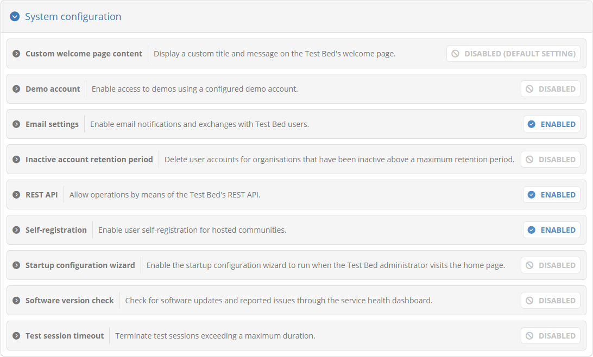

For each setting, you are presented with its **name** and **description**, followed by a **status** indicator that shows if
the setting is enabled, and how it was set. The status indicates if the setting is **enabled** or **disabled** and may be 
followed by an additional postfix:

* No postfix, means that the setting in question was made through this screen.
* **"Environment setting"**, indicates this is set through an environment variable in the test bed's installation configuration.
* **"Default setting"**, indicates this is an overall default setting.

In terms of priority, a setting through this screen takes precedence over an environment variable, which is turn
takes precedence over a default setting. Note that any setting applied through the current screen shall have immediate application
as opposed to using an environment variable which would require a restart.

To edit any setting, click its row to expand its panel and reveal its controls. The specific controls depend on the selected setting
but would typically include a means of enabling or disabling it, and if enabled, provide further information.

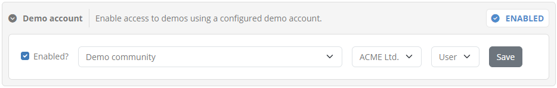

The settings that can be managed through this screen are listed int he following table. The table also references relevant
environment variables (if applicable) if you prefer to have these configured `via the test bed's installation script <https://www.itb.ec.europa.eu/docs/guides/latest/installingTheTestBedProduction/index.html#step-3-prepare-basic-configuration>`_.

.. csv-table::
    :header: "Setting", "Description", "Environment variable(s)", "Default"
    :delim: |

    **Custom welcome page message** | A custom text to display on the test bed's :ref:`welcome page<login__welcome>`. | | Disabled
    **Demo account** | An optional, non-administrator account that users can use to connect with from the login screen to :ref:`execute demos<login__demos>`. | ``DEMOS_ENABLED``, ``DEMOS_ACCOUNT`` | Disabled
    **Email settings** | Settings related to allow the test bed to send emails when applicable. | ``EMAIL_*`` variables | Disabled
    **Inactive account retention period** | Whether inactive user accounts will be removed after a maximum retention period. | | Disabled
    **REST API** | Whether the test bed's :ref:`REST API<api>` is available. | ``AUTOMATION_API_ENABLED`` | Disabled
    **Self-registration** | Whether users are allows to self-register for communities :ref:`supporting self-registration<community_testbed_communities__manage>`. | ``REGISTRATION_ENABLED`` | Enabled
    **Test session timeout** | A duration in seconds after which an active test session will be terminated. | | None

Updating each setting is done individually through its relevant controls. All such controls include a **Save** button that you may
click to persist your choice. Note that the overall settings panel can also be **collapsed** and **expanded** by clicking on its header.

.. _systemAdmin__config__restApi:

REST API configuration
~~~~~~~~~~~~~~~~~~~~~~

One configuration option of note is the **REST API**, which determines whether or not the test bed's :ref:`REST API <api>` will be enabled.

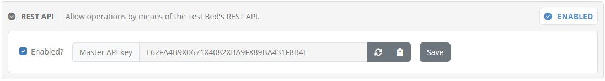

Besides enabling or disabling the REST API, this section also allows you to manage the test bed's **Master API key**. This is used for
authorisation purposes in certain REST operations that require test bed administrator privileges, such as :ref:`creating a new community <community_testbed_communities__create>`.

Regarding the value of the Master API key, this is randomly assigned to the test bed upon initial startup, thus ensuring that two instances will
never inadvertently share the same value. In case you need to foresee a predetermined value for this, for example if you automate an instance's
initial configuration via REST API calls, you may set its value by providing the ``AUTOMATION_API_MASTER_KEY`` environment variable to the gitb-ui
application.

.. _systemAdmin__admins:

Manage system administrators
----------------------------

To manage the system administrators, select the **Administrators** tab from beneath the settings panel.

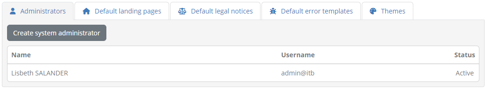

Administrators are listed in a table with one row per user displaying the user's **name**, **email** address (or **username** if integrated with EU Login) and **status**.

.. note::
  **User status:** A user's status is meaningful when the test bed is integrated with EU Login. A value of **Inactive** indicates
  a user that has not yet :ref:`confirmed a role assignment<login__roles__confirm>` whereas a value of **Not migrated** indicates
  a legacy account that has not been :ref:`migrated to EU Login<login__roles__migrate>`. In all other cases the user will be
  displayed as **Active**.

To create a new test bed administrator click on the **Create system administrator** button. Clicking on an existing row from the
table allows you to edit the relevant user's information.

The displayed screens and required information, both when you edit or create a new administrator, depend on whether or not the test bed
is integrated with EU Login.

Case: EU Login
~~~~~~~~~~~~~~

When creating an administrator you will be presented with a form to enter the user's information.

.. figure:: ../screenshots/admin_community_test_bed_administrators_create_eulogin.PNG
  :align: center

You are required to provide the **email** address of the user. This address needs to be the one that the user has linked to
her EU Login account. Once you have created the user you will see that a new entry is added to the list of test bed administrators
but for which there is no displayed name and the displayed status is **Inactive**. The name and status will be
updated once this user has :ref:`confirmed this role assignment<login__roles__confirm>`.

To finish creating the user click **Save**, otherwise click **Cancel** to go back.

Editing an administrator's details displays her information as readonly.

.. figure:: ../screenshots/admin_community_test_bed_administrators_edit_eulogin.PNG
  :align: center

The information presented here is the user's **name**, **email**, **role**, and **status**. From here you can delete the user
by clicking on **Delete** unless this is your own account. Finally, clicking **Back**
will return you to the previous screen.

Case: No EU Login
~~~~~~~~~~~~~~~~~

When creating an administrator you will be presented with a form to enter the user's information.

.. figure:: ../screenshots/admin_community_test_bed_administrators_create.PNG
  :align: center

In this form you are expected to provide the following information:

* The administrator's **name** (required), used in feedback submissions to the test bed.
* The **username** (required), used to login.
* The user's **password**. The entered password is a "one-time" password which will need to be changed by the user upon his/her next login.

To complete the creation of the new administrator click on **Save**. Clicking **Cancel** discards changes and returns you to the previous screen.

When editing a user you see a similar screen, this time prefilled with the user's information.

.. figure:: ../screenshots/admin_community_test_bed_administrators_edit.PNG
  :align: center

The information presented here is the user's **name**, **username**, **role**, and **status**, of which only the name is editable. To change the name
edit the existing value and click on **Update**, whereas to delete the user click on **Delete** (unless this is your own account). 
Finally, clicking **Back** will discard any pending changes and return you to the previous screen.

In this form you may also choose to reset the user's password. You can do this by checking the **Set one-time password** option which will display for you
additional input fields to provide and confirm the new password. The password you enter is considered a "one-time" password meaning that the user will be forced
to change it at his/her next login.

.. _systemAdmin__landing_pages:

Manage default landing pages
----------------------------

To manage the default landing pages, select the **Default landing pages** tab from beneath the settings panel. Default landing pages are 
used by your communities if no :ref:`community-specific landing page<community__manage_landing_pages>` has been configured.

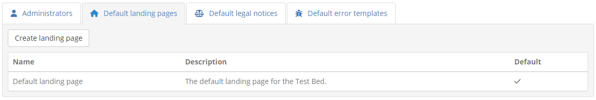

Adding a new landing page can be done in one of the following ways:

* You can create a new landing page from scratch by clicking the **Create landing page** button.
* You can copy one of the existing landing pages while editing its details.

.. note::
    You can set a specific landing page for :ref:`your own "admin organisation"<manage_organisation>`. If none is set the default test bed landing page will be used.

Create landing page
~~~~~~~~~~~~~~~~~~~

When creating a new landing page you are presented with a form to enter its information.

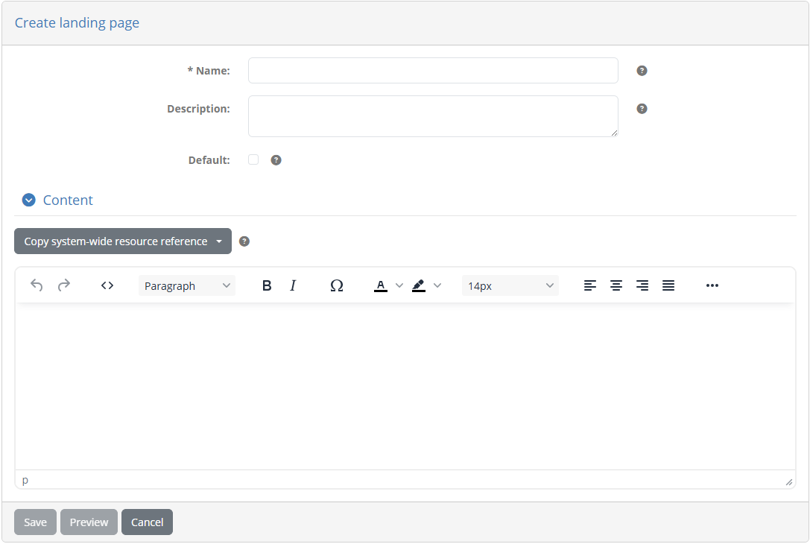

If you are creating a landing page from scratch (i.e. you have clicked the **Create landing page** button), this form will be empty. Alternatively,
if the landing page is being created as a copy of an existing one, the form will be prefilled.

The information you are expected to complete for the landing page is:

* Its **name** (required), used in the list of landing pages and when selecting one for an organisation.
* Its **description** (optional), presented to test bed and community administrators.
* Whether or not it should be the **default** landing page for the community (default is "false").
* The landing page **content**, provided through a rich text editor, allowing you to add styled text, lists, images and links.

While editing the content of the landing page you can use the **Preview** button to preview how the landing page will look like before
you save it. The preview is presented in a popup that is styled and positioned exactly as the landing page :ref:`would appear<navigate__landing_page>`
when users log in. This allows you to fine tune aspects such as positioning and spacing to make sure the result is exactly
how you expect it to be.

.. figure:: ../screenshots/admin_community_landing_pages_preview.png
  :align: center

When you have finished defining the landing page you can complete its creation by clicking **Save**. Note that if you have set this as the
new default landing page for the test bed you will also be prompted for confirmation considering that this will be immediately visible to all your
users. Clicking on the **Cancel** button will discard pending changes and return to the previous screen.

Edit landing page
~~~~~~~~~~~~~~~~~

To edit an existing landing page click its corresponding row from the **Landing pages** table.

Doing so will take you to a screen where the landing page's information is displayed in editable form fields.

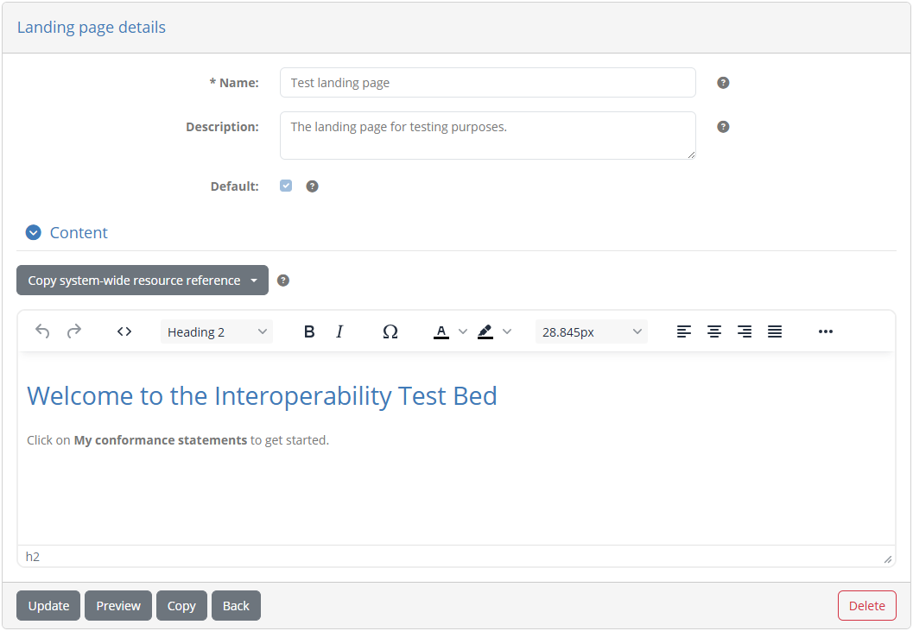

In this screen you can change the landing page's **name**, **description**, **default** setting and **content**. Note that if the landing page is currently
the default, this can't be unset. To switch defaults you would need to edit or create another landing page and at that time set it as the new default.
This is done to avoid misconfiguration where you could end up with no default landing page.

While editing the content of the landing page you can use the **Preview** button to preview how the landing page will look like before
you save it. The preview is presented in a popup that is styled and positioned exactly as the landing page :ref:`would appear<navigate__landing_page>`
when users log in. This allows you to fine tune aspects such as positioning and spacing to make sure the result is exactly
how you expect it to be.

.. figure:: ../screenshots/admin_community_landing_pages_preview.png
  :align: center

To persist any changes click on the **Update** button or discard them clicking on the **Back** button. The **Delete** button will, following confirmation,
remove the landing page. Finally, the **Copy** button allows you to make a copy of this landing page, by taking you to the landing page creation screen prefilled
with the current landing page's information.

.. _systemAdmin__legal_notices:

Manage default legal notices
----------------------------

To manage the default legal notices, select the **Default legal notices** tab from beneath the settings panel. Default legal notices are 
used by your communities if no :ref:`community-specific legal notice<community__manage_legal_notices>` has been configured.

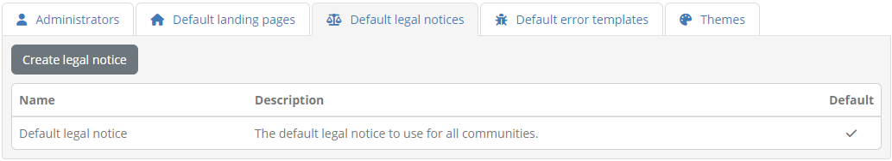

Adding a new legal notice can be done in one of the following ways:

* You can create a new legal notice from scratch by clicking the **Create legal notice** button.
* You can copy one of the existing legal notices while editing its details.

Create legal notice
~~~~~~~~~~~~~~~~~~~

When creating a new legal notice you are presented with a form to enter its information.

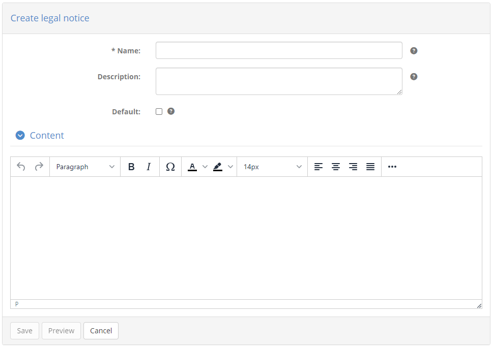

If you are creating a legal notice from scratch (i.e. you have clicked the **Create legal notice** button), this form will be empty. Alternatively,
if the legal notice is being created as a copy of an existing one, the form will be prefilled.

The information you are expected to complete for the legal notice is:

* Its **name** (required), used in the list of legal notices and when selecting one for an organisation.
* Its **description** (optional), presented to test bed and community administrators.
* Whether or not it should be the **default** legal notice for the community (default is "false").
* The legal notice **content**, provided through a rich text editor, allowing you to add styled text, lists, images and links.

While editing the content of the legal notice you can use the **Preview** button to preview how it will look like before
you save it. This allows you to fine tune its presentation and content to make sure the result is exactly how you expect it to be.

.. figure:: ../screenshots/admin_community_legal_notices_preview.png
  :align: center

When you have provided the required information you can complete the legal notice creation by clicking **Save**. Note that if you have set this as the
new default legal notice you will also be prompted for confirmation considering that this will be available to all users.
Clicking on the **Cancel** button will discard pending changes and return to the previous screen.

Edit legal notice
~~~~~~~~~~~~~~~~~

To edit an existing legal notice click its corresponding row from the **Legal notices** table.

Doing so will take you to a screen where the legal notice's information is displayed in editable form fields.

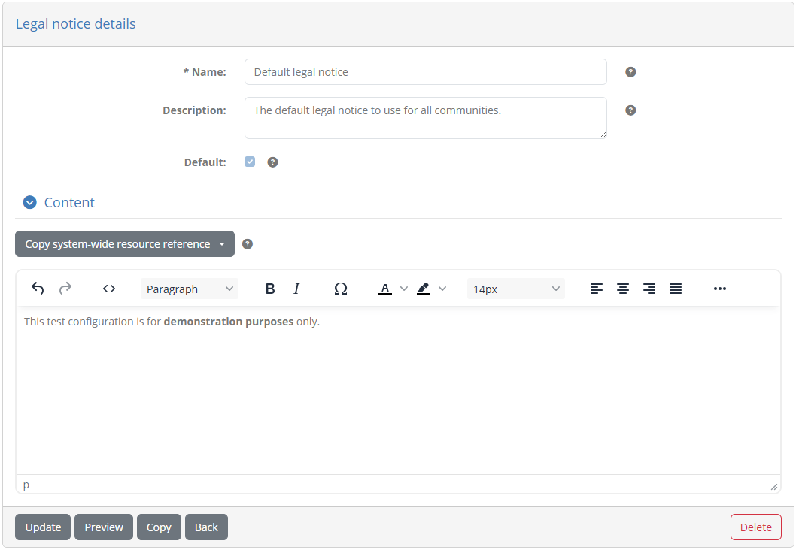

In this screen you can change the legal notice's **name**, **description**, **default** setting and **content**. Note that if the legal notice is currently
the default, this can't be unset. To switch defaults you would need to edit or create another legal notice and at that time set it as the new default.
This is done to avoid misconfiguration where you could end up with no default legal notice.

While editing the content of the legal notice you can use the **Preview** button to preview how it will look like before
you save it. This allows you to fine tune its presentation and content to make sure the result is exactly how you expect it to be.

.. figure:: ../screenshots/admin_community_legal_notices_preview.png
  :align: center

To persist any changes click on the **Update** button or discard them clicking on the **Back** button. The **Delete** button will, following confirmation,
remove the legal notice. Finally, the **Copy** button allows you to make a copy of this legal notice, by taking you to the legal notice creation screen prefilled
with the current legal notice's information.

.. _systemAdmin__error_templates:

Manage default error templates
------------------------------

To manage the default error templates, select the **Default error templates** tab from beneath the settings panel. Default templates are 
used by your communities if no :ref:`community-specific template<community__manage_error_templates>` has been configured.

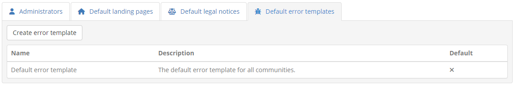

Adding a new error template can be done in one of the following ways:

* You can create a new template from scratch by clicking the **Create error template** button.
* You can copy one of the community's existing templates while editing its details.

Create error template
~~~~~~~~~~~~~~~~~~~~~

When creating a new error template you are presented with a form to enter its information.

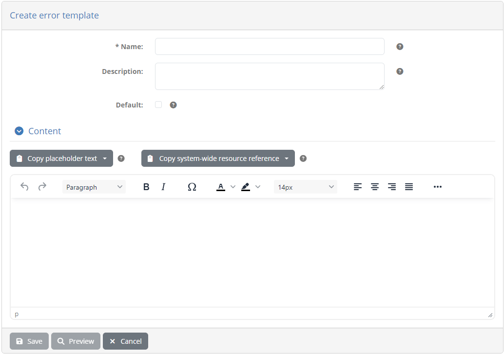

If you are creating an error template from scratch (i.e. you have clicked the **Create error template** button), this form will be empty. Alternatively,
if the template is being created as a copy of an existing one, the form will be prefilled.

The information you are expected to complete for the error template is:

* Its **name** (required), used in the list of templates and when selecting one for an organisation.
* Its **description** (optional), presented to administrators.
* Whether or not it should be the **default** template for the community (default is "false").
* The template's **content**, provided through a rich text editor, allowing you to add styled text, lists, images and links.

When completing the content of the template you are also provided with two placeholders you can use that will be completed when an actual error is being treated:

* **$ERROR_DESCRIPTION:** The error message text (a text value - may be empty).
* **$ERROR_ID:** The error identifier (used to trace error in logs).

You can review and copy these placeholder values to your content using the **Copy placeholder text** button.

While editing the template's content you can see a preview of what it would look like when used. To do so click the **Preview** button that will open an
error popup using a sample error and your current template:

.. figure:: ../screenshots/admin_community_error_templates_preview.PNG
  :align: center
  :scale: 70%

When you have provided the required information you can complete the template's creation by clicking **Save**. Note that if you have set this as the
new default you will also be prompted for confirmation. Clicking on the **Cancel** button will discard pending changes and return to the previous screen.

Edit error template
~~~~~~~~~~~~~~~~~~~

To edit an existing error template click its corresponding row from the **Error templates** table.

Doing so will take you to a screen where the template's information is displayed in editable form fields.

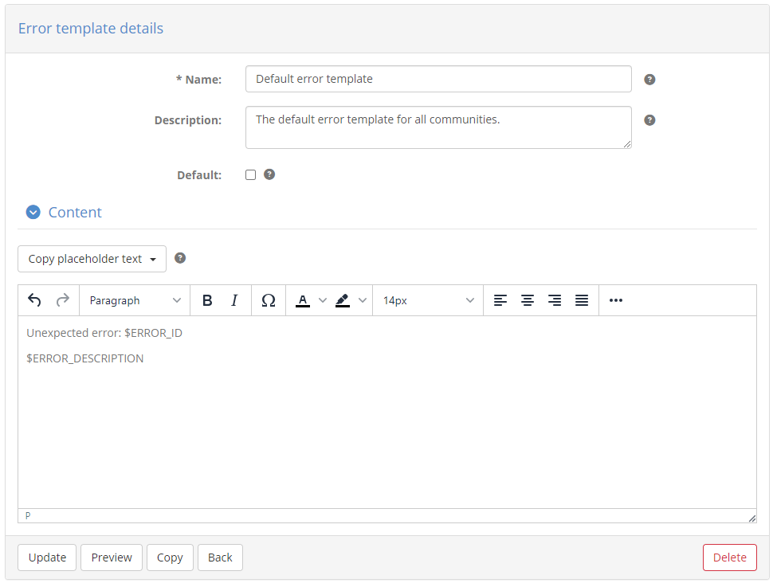

In this screen you can change the template's **name**, **description**, **default** setting and **content**. Note that if the template is currently
the default, this can't be unset. To switch defaults you would need to edit or create another one and at that time set it as the new default.
This is done to avoid misconfiguration where you could end up with no default error template.

When completing the content of the template you are also provided with two placeholders you can use that will be completed when an actual error is being treated:

* **$ERROR_DESCRIPTION:** The error message text (a text value - may be empty).
* **$ERROR_ID:** The error identifier (used to trace error in logs).

You can review and copy these placeholder values to your content using the **Copy placeholder text** button.

While editing the template's content you can see a preview of what it would look like when used. To do so click the **Preview** button that will open an
error popup using a sample error and your current template:

.. figure:: ../screenshots/admin_community_error_templates_preview.PNG
  :align: center
  :scale: 80%

Once you are finished click on the **Update** button to persist your changes or discard them clicking on the **Back** button. The **Delete** button
will, following confirmation, remove the template. Finally, the **Copy** button allows you to make a copy of this error template, by taking you to
the creation screen prefilled with the current template's information.

.. _systemAdmin__themes:

Manage themes
-------------

As test bed administrator you can adapt the test bed's look and feel to match your organisation's needs. Look and feel settings are grouped
into **themes**, allowing you to define multiple themes from which one will be set as the active one. Managing the test bed's themes is done
from the **Themes** tab.

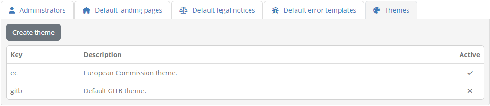

By default, the test bed comes with two built-in themes that can be deactivated but not removed: a European Commission theme and a GITB theme.
The GITB theme (identified by the key "gitb") is the active one following a clean test bed installation. The active theme can be set through 
the user interface when :ref:`editing a theme<systemAdmin__themes_edit>`, or by setting the ``THEME`` environment variable to match a theme's
**key**.

All pre-configured and custom themes are listed in this tab, presenting for each one:

* Its **key**, the unique identifier that can be used as the value of the ``THEME`` environment variable.
* Its **description**, giving a brief explanation on the purpose of the theme.
* Whether the theme is the **active** one.

.. _systemAdmin__themes_create:

Create theme
~~~~~~~~~~~~

To create a new theme, click the **Create theme** button from the **Themes** tab.

Doing so will present a form in which you can define all the theme's information and settings. The default settings for the theme are
initialised based on the currently active one.

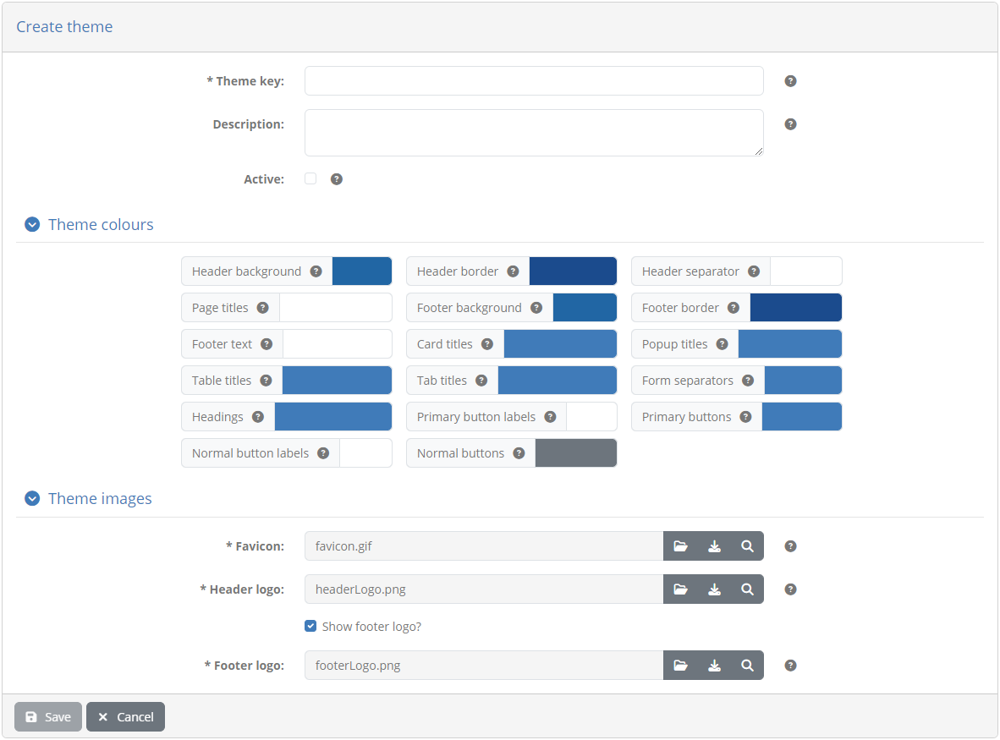

The information you are expected to provide here is as follows:

* The theme's unique **key** and **description**.
* Whether the theme should be the **active** one.
* The theme's **colour set**. For each setting here clicking the current colour will present a colour picker to choose the new value.
* The theme's **images**, including the **header** and **footer** logos, as well as the **favicon**. Images can be **uploaded** through the
  provided controls, **downloaded** and **previewed**.

Once you have completed the information and settings for the new theme, click on **Save** to persist your changes. If set as **active**,
the new theme will be immediately applied to the test bed instance (other users will see the change upon their next login).

.. note::
  New themes can also be made by :ref:`selecting an existing theme<systemAdmin__themes_edit>` and creating a copy of it.

.. _systemAdmin__themes_edit:

Edit theme
~~~~~~~~~~

To edit an existing theme click its row from the table presented in the **Themes** tab.

Doing so will present the theme's information and settings.

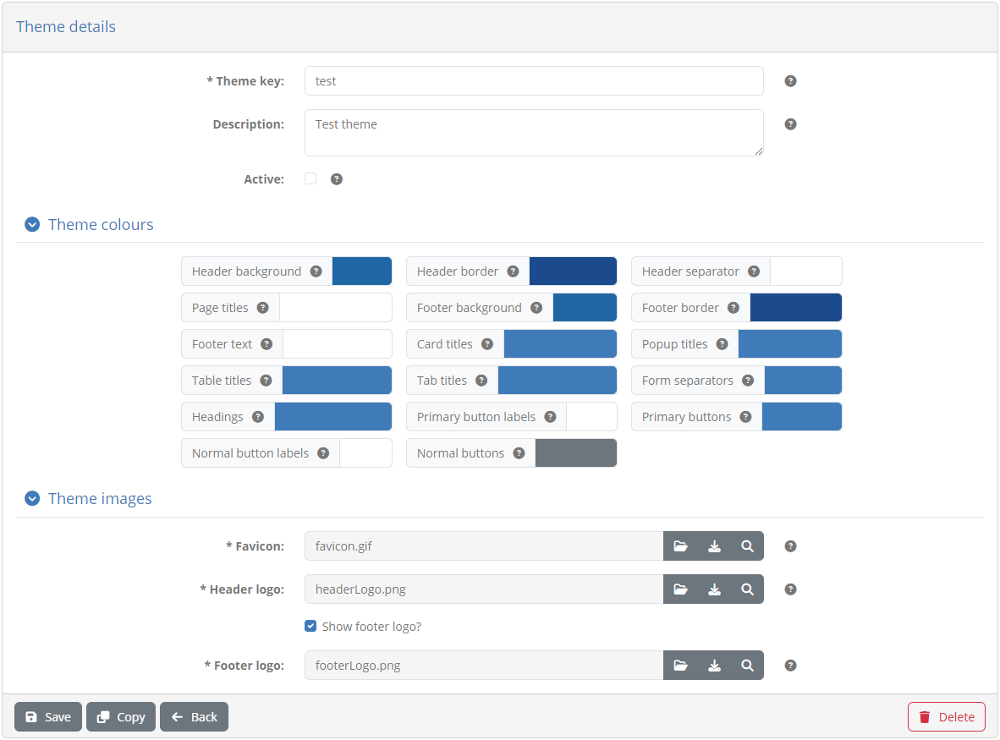

The fields and controls in this form match those when :ref:`creating a new theme<systemAdmin__themes_create>`. To persist any changes, as
well as activate (or deactivate) the theme, click the **Update** button. You may also click the **Copy** button here to create a new theme based on the 
current theme's settings.

If you selected one of the test bed's predefined themes, its information and settings are presented as readonly information with a message
to explain this.

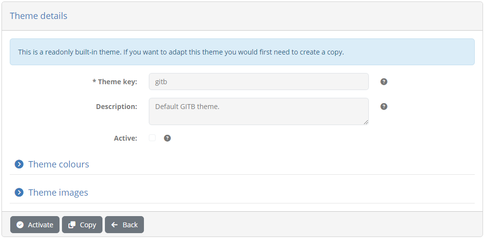

You cannot update such a predefined theme but you can choose to **Activate** it (if inactive) by clicking the relevant button. You can 
also **Copy** the theme to create a new one based on its settings.