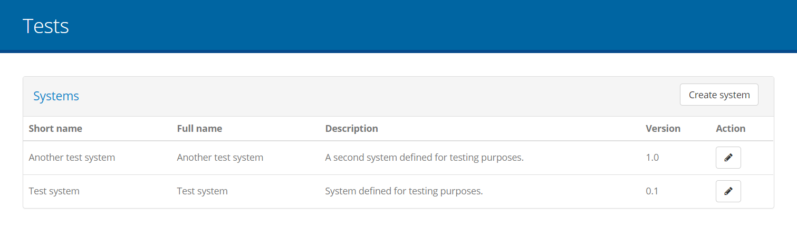
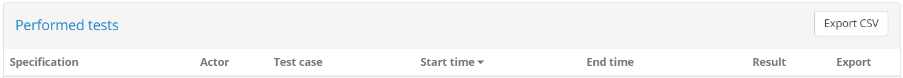

.. _view_your_test_history:

View your test history
======================

All tests you carry out on the test bed are linked to specific conformance statements, each linking one of your
organisation's systems to a specification actor. The first step in viewing your test session history is to 
select the **TESTS** button from the screen header.

.. figure:: ../screenshots/header_admin.PNG
  :align: center

You can then select the system you are interested in from the listing of your organisation's systems (see :ref:`manage_your_systems`).

Selecting a system from the list brings you to its list of conformance statements (see :ref:`manage_your_conformance_statements__view_your_conformance_statements`). 
From this point you will be able to click the **Performed Tests** link from the left side menu.

.. figure:: ../screenshots/conformance_statements_admin.PNG
  :align: center

Clicking this link presents you with the test session history screen (see :ref:`view_your_test_history__search`).

.. _view_your_test_history__search:

Search test history
-------------------

The test session history screen is split into two main parts:

* A set of **search filters** to help locating specific test results.
* The display of the **performed tests**.

.. figure:: ../screenshots/test_history_admin.PNG
  :align: center

When you first visit this screen the filter controls are initially ignored, indicated by the button **CLEAR** being indicated in blue 
as active. Clicking on the **APPLY** button opens up the filtering criteria that you can use to limit the displayed test sessions. 

.. figure:: ../screenshots/test_history_filters.PNG
  :align: center
  :scale: 50%

The available filters are:

* The **domain** and **specification** of the sessions' corresponding conformance statements.
* The sessions' **test suite** and **test case**.
* The sessions' **result**.
* The sessions' **start** and **end time**.

All filter controls with the exception of the start and end time are multiple selection choices. The start and end time controls are
date pickers that allow selection of ranges of dates for both the start and end of the sessions. Selecting multiple values across these
controls are applied as follows:

* Within a specific filter control using "OR" logic (e.g. selecting multiple specifications).
* Across filter controls using "AND" logic (e.g. selecting a specification and a test case).

Note additionally that selecting dependent values serves to limit the filter options that are presented. For example if a given specification
is selected, the test suites and test cases available for filtering will be limited to that specification to already exclude impossible combinations.

The presented tests are automatically updated whenever your filter options are modified, or when the filters are removed altogether by clicking the 
**CLEAR** button. Note that displaying the performed tests with no filtering is also the default when you first visit the screen. Tests are presented
in a paged table, offering controls to go to the **first**, **previous**, **next** and **last** pages as applicable, and are sorted based on their 
**start time** in a descending order (i.e. showing the latest tests at the top). Custom sorting can also be made by clicking the title of each column; 
clicking a column header for the first time will sort by it in ascending manner and clicking it again will switch to descending. The active sort 
column and type are indicated using an arrow next to the relevant column header.

Test sessions are displayed one per table row, with each row including the following information:

* The **specification** and **actor** of the test session.
* The relevant **test case**.
* The session's **start** and **end time**.
* The test **result**.

Each row provides controls to export the relevant test case report and to view the test's steps.

.. note::
    **Obsolete test sessions:** One or more test sessions may be rendered obsolete in case of a significant change in the test setup
    (e.g. the relevant specification being deleted) or a test case update that requires relevant test sessions to be re-executed. Such
    test sessions remain and can be consulted but are displayed greyed-out to indicate that they are no longer considered towards the
    overall conformance testing. Such sessions can be deleted at the level of the current system as described in :ref:`view_your_test_history__search__delete_obsolete`.

.. _view_your_test_history__search__export:

Export a test case report
~~~~~~~~~~~~~~~~~~~~~~~~~

Exporting a test case's report is made possible through the file icon control on the far right side of each test's row.

.. figure:: ../screenshots/test_history_export_pdf.PNG
  :align: center

Clicking this will generate and download the report (in PDF format).

.. figure:: ../screenshots/test_case_report.png
  :align: center

The test case report contains a first **Overview** section that summarises the purpose and result of the test session. The information
included here is:

* The name of the **system** that was tested and the name of its related **organisation**.
* The names of the **domain**, **specification** and **actor** of the relevant conformance statement.
* The **test case's name** and **description**.
* The session's **result**, **start** and **end time**.

The overview section is then followed by a section per test case step, each starting on a separate page.

.. figure:: ../screenshots/test_case_report_step.png
  :align: center

The information displayed for each step is:

* Its **sequence number**.
* Its **name**.
* Its **result**.
* Its completion **time**.
* For validation steps, the number of validation report findings classified as **errors**, **warnings** and **messages**.
* For validation steps, a **Details** section listing the details of each validation finding.

.. note::
    **Step context values:** The information included in the test case report for each step does not include the context
    information relevant to the step's output results. This is omitted as the report would in most cases end up being 
    very large.

.. _view_your_test_history__search__export_csv:

Export all test sessions
~~~~~~~~~~~~~~~~~~~~~~~~

Apart from exporting an individual test case report you can also export the information for the currently displayed test sessions in
CSV format. To do this click the **Export CSV** button in the right of the test session table header.

.. _view_your_test_history__search__delete_obsolete:

Delete obsolete test results
----------------------------

Obsolete test sessions can be deleted by clicking the **Delete obsolete results** button from the search results' panel.

.. figure:: ../screenshots/test_history_admin_header.PNG
  :align: center

Doing so will first prompt you for confirmation and then, if confirmed, will proceed to delete the obsolete test results. Note that the results
deleted are limited to those specific to the system that is currently selected.

.. _view_your_test_history__test_steps:

View a test session's steps
---------------------------

Each row from the list of presented test sessions may also be clicked to view its detailed steps. Doing so presents
a view over the test session's steps that is similar to the live test execution diagram displayed while the test session is
active (see :ref:`execute_tests__step3`).

.. figure:: ../screenshots/test_history_test_result.PNG
  :align: center

In this screen each test case step is displayed using the same colour coding applied during test execution: 

* **Green** indicates successfully completed steps.
* **Red** indicates failed steps.
* **Grey** indicates steps that were skipped.

In terms of provided controls, a document icon is presented on steps that produced a report that can be clicked to review
its details (see :ref:`view_your_test_history__test_steps__details`). The provided **Back** button serves to return you to the previous search screen.

.. _view_your_test_history__test_steps__details:

View test step details
~~~~~~~~~~~~~~~~~~~~~~

Clicking on a step's document icon triggers a popup that shows the step's different information elements that can be viewed inline, downloaded or opened in
a separate popup editor. In the case of validation steps, this is extended to also provide the detailed validation results as illustrated in the
following example for a validation failure.

.. figure:: ../screenshots/test_execution_execute_step_failure.PNG
  :align: center
  :scale: 50%

In the test step result popup you are presented with the **result** and completion **time** as the step summary. In the sections that follow you 
can inspect the output information from the step, presented either inline (for short values), as a file you can download, or through a further popup editor. In the latter case
this is triggered by clicking the **Open in editor** link. Clicking to open this, displays its content which, in the case of validation steps, 
is also highlighted for the recorded validation messages.

.. figure:: ../screenshots/test_execution_execute_step_failure_code.PNG
  :align: center
  :scale: 50%

The editor popup allows you to copy a specific part of the content or, by means of the **Copy to clipboard** button, copy its entire contents. The
**Close** button closes this popup and returns you to the test step result display. Note that clicking on a specific error will
open the validated content and automatically focus on the selected error.

An alternative to viewing the content in this way is to click the **Download as file** link which will download the content as a file. The test bed will determine
the most appropriate type for the content and name the downloaded file accordingly (if possible).

.. note::
    **Viewing binary output:** The **Download as file** option is the best way to inspect information that is binary (e.g. an image). The test bed will nonetheless
    always present the **Open in editor** option but given that the content is then assumed to be text, this will likely not be useful.

.. _view_your_test_history__test_steps__export:

Export test step report
~~~~~~~~~~~~~~~~~~~~~~~

The results of the test step can also be exported as a test step report (in PDF format). This is made available through the **Export** button that triggers the 
generation and download of the step report. 

.. figure:: ../screenshots/test_execution_test_step_report.PNG
  :align: center

This report includes:

* The **test step result overview**, including the **result**, **date** and, in case of a validation step, the total number of validation findings
  (classified as **errors**, **warnings** and **messages**).
* The **report details**, included in case of a validation step to list the details of the validation report's findings.
* The step's **context** information, to list its output values and returned content.

.. note::
    **Test step report size:** When exporting a test step report the context information is always included to provide the full information pertinent
    to its result. In case the context information returned by the step includes large file contents, these would be included resulting in a 
    potentially very large export.