.. _view_your_test_history:

View your test history
======================

To view your organisation's test history click the **My test sessions** link from the side menu. Doing so
presents you with the test session history screen which is split into three main parts:

* A set of **search filters** to help locating specific test results.
* The list of **active test sessions**.
* The list of **completed test sessions**.

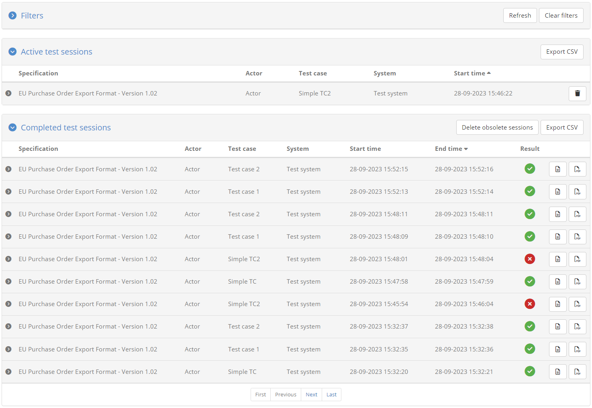

.. _view_your_test_history__active:

Active test sessions
--------------------

The currently active sessions are those that are pending completion. These could be sessions that are :ref:`running in the background<execute_tests_background>`
or sessions that are :ref:`interactively being executed<execute_tests_interactive>` by other users.

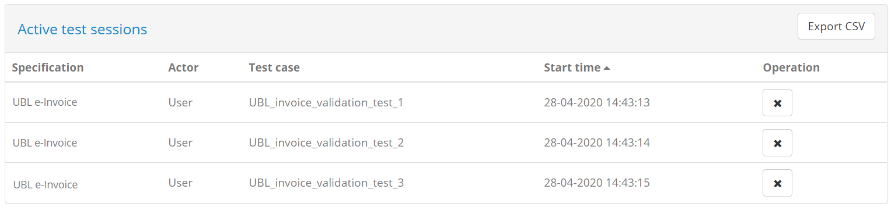

Tests are presented in a paged table sorted based on their **start time** in a ascending order (i.e. the oldest sessions are presented first). Custom sorting
can be applied by clicking the title of each column; clicking a column header for the first time will sort by it in ascending manner and clicking it again
will switch to descending. The active sort column and type are indicated using an arrow next to the relevant column header. The table offers
controls to go to **specific pages** as well as the **first**, **previous**, **next** and **last** ones (as applicable), while showing in the bottom right
corner the total and currently displayed test counts.

Each session is presented on a separate table row, with the following information displayed per session:

* The **specification** and **actor** (defined as the test case’s SUT).
* The relevant **test case**.
* The relevant **system**.
* The session **start time**.

The set of currently displayed active sessions can be exported in CSV format by clicking the **Export CSV** button in the table header 
(see :ref:`view_your_test_history__search__export_csv`). You may also click the **Terminate all** button that, upon confirmation, will
forcibly stop all currently active tests. Finally, the header itself can also be clicked to **collapse** or **expand** its display.

Regarding individual active test sessions, each session's row offers controls to:

* Forcibly **terminate** it, by clicking the delete icon on the relevant session’s row.
* View its **details**, by clicking on the row itself (see :ref:`view_your_test_history__test_steps`).

.. _view_your_test_history__completed:

Completed test sessions
-----------------------

The history of all your completed test sessions is presented in the **Completed test sessions** table.

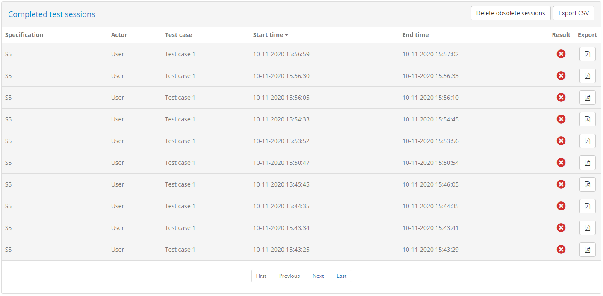

Tests are presented in a paged table sorted based on their **end time** in a descending order (i.e. showing the latest tests at the top). Custom sorting
can be applied by clicking the title of each column; clicking a column header for the first time will sort by it in ascending manner and clicking it again
will switch to descending. The active sort column and type are indicated using an arrow next to the relevant column header. The table offers
controls to go to **specific pages** as well as the **first**, **previous**, **next** and **last** ones (as applicable), while showing in the bottom right
corner the total and currently displayed test counts.

Test sessions are displayed one per table row, with each row including the following information:

* The **specification** and **actor** of the test session.
* The relevant **test case**.
* The relevant **system**.
* The session's **start** and **end time**.
* The test **result**.

Each row provides controls to **export** the relevant test case report and to view the test's steps. In addition, you can use the
overall **Export CSV** button from the table's header to extract a CSV export of the currently displayed sessions (see :ref:`view_your_test_history__search__export_csv`).
In addition, the header itself can also be clicked to **collapse** or **expand** its display.

.. note::
    **Obsolete test sessions:** One or more test sessions may be rendered obsolete in case of a significant change in the test setup
    (e.g. the relevant specification being deleted) or a test case update that requires relevant test sessions to be re-executed. Such
    test sessions remain and can be consulted but are displayed greyed-out to indicate that they are no longer considered towards your
    overall conformance testing.

.. _view_your_test_history__filters:

Apply search filters
--------------------

To locate specific test sessions you are provided with a set of filter controls at the top of the screen. These are presented initially
as collapsed as they are not taken into account, but can be clicked to expand and set specific filter criteria.

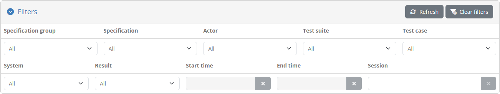

The available filters are:

* The **domain** (if applicable), **specification group**, **specification** and **actor** of the sessions' corresponding conformance statements.
* The relevant' **test suite** and **test case**.
* The relevant' **system**.
* The sessions' **result**, **start** and **end time**.
* A specific **session ID**.

All filter controls with the exception of the start time, end time and session ID are multiple selection choices. The start and end time controls are
date pickers that allow selection of ranges of dates for both the start and end of the sessions. The session ID is a text field. Selecting multiple values across these
controls are applied as follows:

* Within a specific filter control using "OR" logic (e.g. selecting multiple specifications).
* Across filter controls using "AND" logic (e.g. selecting a specification and a test case).

Note additionally that selecting dependent values serves to limit the filter options that are presented. For example if a given specification
is selected, the test suites and test cases available for filtering will be limited to that specification to already exclude impossible combinations.

The presented tests are automatically updated whenever your filter options are modified, or when the filters are removed altogether by clicking the
**Clear filters** button. It is also possible to collapse the filters without disabling them by clicking on the filter panel header. Note that displaying the
performed tests with no filtering is the default when you first visit the screen. Finally, you may also choose to keep the current filtering but refresh
the search results by clicking the **Refresh** button.

.. _view_your_test_history__search__export:

Export a test case report
-------------------------

Exporting a test case's report is possible for completed test sessions, through one of the two file icon controls on the far right side of each test's row.

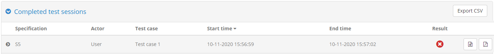

The file icon on the left corresponds to the test case's **XML report**. The format of this report is defined by the 
`GITB Test Reporting Language (GITB TRL) <https://github.com/ISAITB/gitb-types/blob/master/gitb-types-specs/src/main/resources/schema/gitb_tr.xsd>`__,
and allows simpler machine-based processing. The following XML content is a sample of such a report:

.. literalinclude:: ../testHistory/resources/test_case_report.xml
   :language: xml

The report includes the following information:

* The **identifier**, **name** and **description** of the test case.
* The **start** and **end time**.
* The overall **result** as well as the **output message** that may have been produced.
* The list of **step reports** that include each step's **identifier**, **description**, **timestamp**, **result** and **findings** (if validations were carried out).

The file icon on the right of the test session row represents the test case's **PDF report**.

The PDF report includes similar information to its XML counterpart with certain additional context data. The following sample report
illustrates the information included:

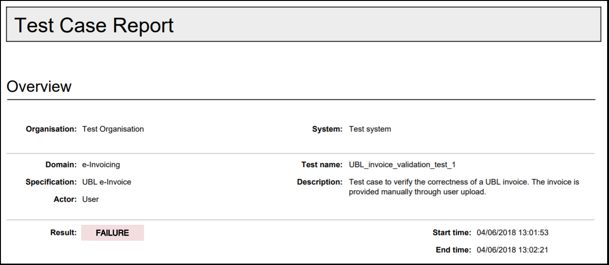

The report contains a first **overview** section that summarises the purpose and result of the test session. The information
included here is:

* The name of the **system** that was tested and the name of its related **organisation**.
* The names of the **domain**, **specification** and **actor** of the relevant conformance statement.
* The **test case's name** and **description**.
* The session's **result**, **start** and **end time**.
* The session's **output message** if one was produced.

Below the overview information follow the test case's **references** where, as available, you are provided with links to additional
information included as annexes in the report. These may be:

* The **extended documentation** of the test case.
* The **test session log**.

This first page is followed by the section on the test case's **step reports**. All steps are initially presented as an overview
including per step, its **description** and **result**. The detailed step reports follow this overview, with individual reports being
directly accessible by clicking each step's sequence identifier that prefixes its description.

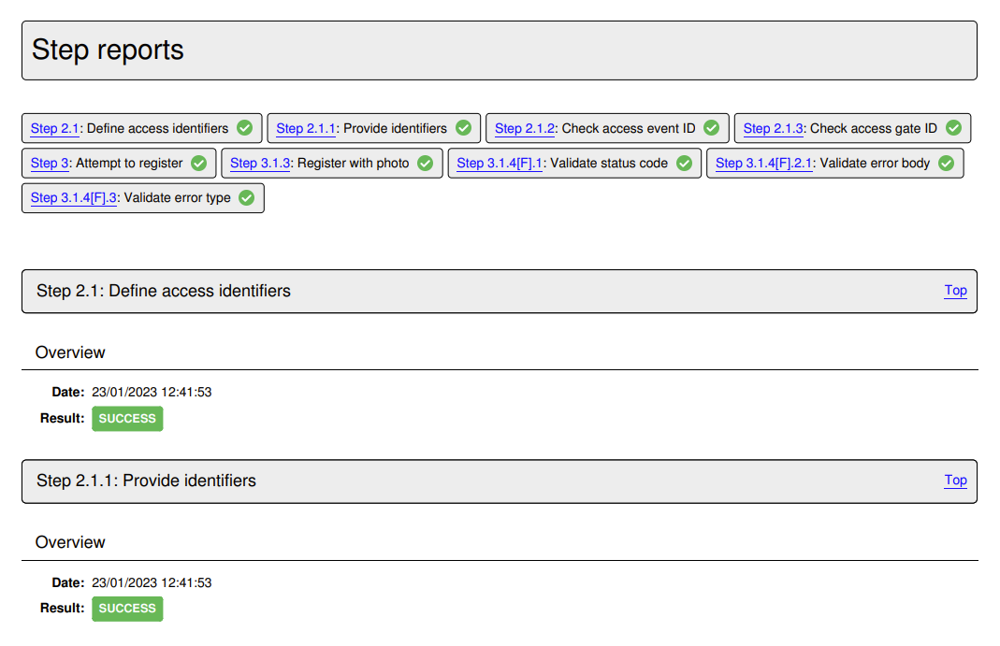

Each detailed **step report** includes the following information for its step:

* Its **sequence number** and **description** in its header, that also includes a link to return to the steps' overview section.
* Its **result** and completion **time**.
* The number of validation report findings classified as **errors**, **warnings** and **messages** (if applicable).
* A **report details** section listing the details of each validation finding (if applicable).
* A **report data** section listing the step's input and output. Note that only text values are presented here and are truncated if too long.

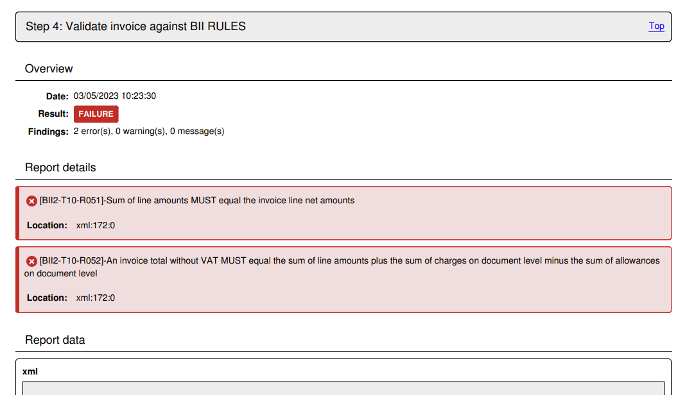

At the end of the test case report follow the report's annexes, specifically the **test case's documentation** and the produced **log output**.

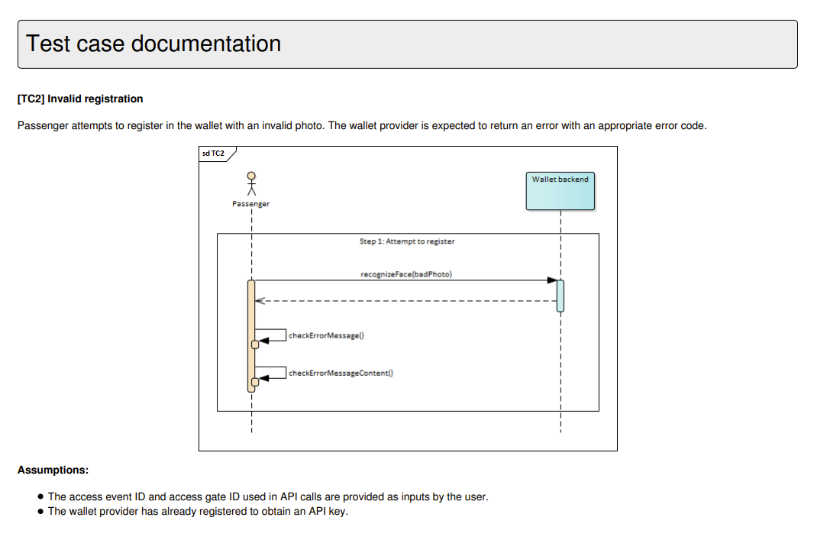

Regarding the **log output**, this is limited to messages reported at **information** level thus excluding debugging output that could be quite
long for elaborate test cases.

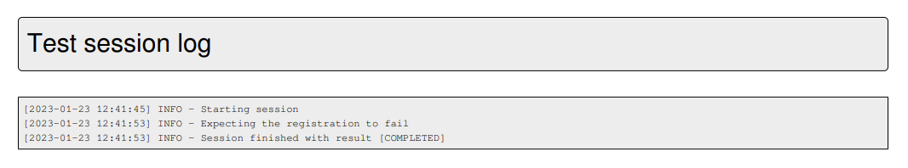

.. note::
    The XML report for a given test session can also be obtained through the Test Bed's :ref:`REST API<api>` (if enabled for your Test Bed instance).

.. _view_your_test_history__search__export_csv:

Export test sessions
--------------------

Apart from exporting an individual test case report you can also export the information for the currently displayed test sessions in
CSV format. To do this click the **Export CSV** button in the right of the active or completed test session table header.

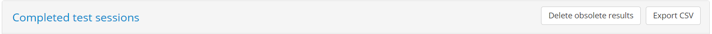

.. _view_your_test_history__search__delete_obsolete:

Delete obsolete test results
----------------------------

Obsolete test sessions can be deleted by clicking the **Delete obsolete sessions** button from the search results' panel.

Doing so will first prompt you for confirmation and then, if confirmed, will proceed to delete the obsolete test results. Note that the results
deleted are limited to those specific to the system that is currently selected.

.. _view_your_test_history__test_steps:

View test session details
-------------------------

Each row from the list of presented test sessions, both active and completed, may also be clicked to view its detailed information. Doing so expands the
row to present the test session's steps in a manner similar to the live test execution diagram displayed while the test session is
active (see :ref:`execute_tests_interactive_execution`).

.. figure:: ../screenshots/test_history_test_result.PNG
  :align: center

In terms of provided controls, a document icon is presented on steps that produced a report that can be clicked to review
its details (see :ref:`view_your_test_history__test_steps__details`). In addition, the diagram's header presents the session's **test suite**,
**test case** and **session identifier**. The session identifier may also be clicked to copy it to the clipboard, which could be useful if you would
want to communicate it to others or to use it for search filtering. Furthermore, clicking elsewhere on the header of the diagram display will
collapse (or expand) the diagram, which could be useful if you want to quickly view other information on the screen.

Above the diagram display you are presented with additional buttons linked to the test session. The purpose of these are as follows:

* **View log** opens up the test session log for display, displaying its contents similarly to when the :ref:`session is executing<execute_tests__step3__view_log>`.
* **Copy link** copies a shareable external link to focus on the current test session.
* **View statement** takes you to the relevant :ref:`conformance statement <manage_your_conformance_statements__view_a_conformance_statements_details>`.
* **View system** allows you to navigate to the relevant :ref:`system <manage_organisation__systems>` or :ref:`organisation <manage_organisation>` details.
* **View specification** allows you to navigate to the relevant :ref:`specification <domains__specification>`, :ref:`actor <domains__actor>` or :ref:`domain <domains__domain_details>` details.
* **View test case** takes you to the relevant :ref:`test case <domains__test_case__details>` or :ref:`test suite <domains__test_suite_details>`.

In the case of an active test session you are also provided with a button to **refresh** its display and **view pending interactions**
(in case interactions are pending).

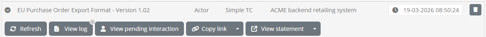

**Refreshing** the display allows you to track the progress of a specific test session without needing to make a full refresh of the displayed results.
Clicking this button will refresh only the relevant test session and reflect changes on its diagram. Note that it is possible that upon refresh, the
test session has in the meanwhile completed, in which case a relevant information popup will inform you accordingly. In case of a **pending interaction**,
clicking to view it will present it so that it can be completed and allow the session to proceed. This allows you to have test sessions execute in the background
while checking through this screen on whether they need user interactions.

Clicking on the session row will once again collapse the display. Note that once one or more session
details are expanded the table's header will display a **Collapse all** button that can be clicked to collapse all details.

.. _view_your_test_history__test_steps__details:

View test step details
~~~~~~~~~~~~~~~~~~~~~~

Clicking on a step's document icon triggers a popup that shows the step's different information elements that can be viewed inline, downloaded or opened in
a separate popup editor. In the case of validation steps, this is extended to also provide the detailed results and report counters as illustrated in the
following example for a validation failure.

.. figure:: ../screenshots/test_execution_execute_step_failure.PNG
  :align: center
  :scale: 70%

In the test step result popup you are presented with the **result** and completion **time** as the step summary. In the sections that follow you 
can inspect the output information from the step, presented either inline (for short values), as a file you can download, or through a further popup editor. In the latter case
this is triggered by clicking the **View** button. Clicking to open this, displays its content which, in the case of validation steps, 
is also highlighted for the recorded validation messages.

.. figure:: ../screenshots/test_execution_execute_step_failure_code.PNG
  :align: center
  :scale: 70%

The editor popup allows you to copy a specific part of the content or, by means of the **Copy to clipboard** button, copy its entire contents. The
**Close** button closes this popup and returns you to the test step result display. Note that clicking on a specific error will
open the validated content and automatically focus on the selected error.

An alternative to viewing the content in this way is to click the **Download** button which will download the content as a file. The Test Bed will determine
the most appropriate type for the content and name the downloaded file accordingly (if possible). In the case of simple texts that are presented inline, you
are not presented with the download and view buttons, but rather with a **Copy to clipboard** button that allows you to copy the presented value.

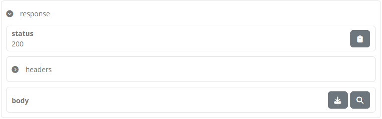

.. note::
  **Viewing binary output:** Images are presented as a preview when selecting to view them. For other binary content (e.g. a PDF document), the best
  way to inspect it is to download it. Opening such content in the in-place code editor will still be possible, but this will most likely not be useful.

.. _view_your_test_history__test_steps__export:

Export test step report
~~~~~~~~~~~~~~~~~~~~~~~

The results of the test step can also be exported as a test step report in PDF and XML formats. This is made available through the **Download report** button
for PDF, and its **Download report as XML** additional option for XML, that will trigger the generation and download of the report in the requested format.
The following example represents such a report in PDF.

.. figure:: ../screenshots/test_execution_test_step_report.PNG
  :align: center

This PDF report includes:

* The **test step result overview**, including the **result**, **date** and, in case of a validation step, the total number of validation findings
  (classified as **errors**, **warnings** and **messages**).
* The **report details**, included in case of a validation step to list the details of the validation report's findings.

When selecting to **download the report as XML**, you receive similar information but represented in XML for simpler machine-processing. 
The structure of the report is defined by the `GITB Test Reporting Language (GITB TRL) <https://github.com/ISAITB/gitb-types/blob/master/gitb-types-specs/src/main/resources/schema/gitb_tr.xsd>`__,
with the following being a simple sample:

.. literalinclude:: ../executeTests/resources/test_step_report.xml
   :language: xml
